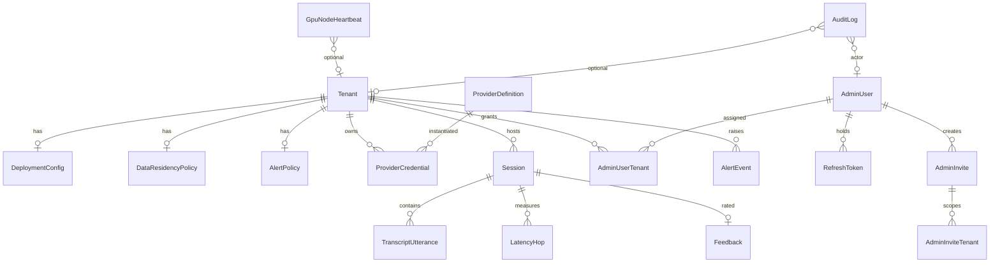

# Conversational Avatar Platform — Product Specification

**Document status:** Complete (v1 / full-platform MVP)  
**Deployment model:** SaaS (Multi-Tenant)  
**Audience:** Architecture, Development, QA, and Platform Operators

---

## 1. Introduction

### 1.1 Purpose

This specification is the authoritative product contract for the Conversational Avatar Platform: a provider-agnostic system for building real-time, voice- and video-driven AI avatar agents. It combines on-premises real-time infrastructure (transport, speech, avatar rendering) with remote LLM intelligence. Each customer **deployment** (tenant) is configured against a different vendor mix without changing the core system.

Every later phase (architecture, development, QA) builds against this document. Ambiguity here is a defect.

### 1.2 Scope

**In scope for v1 (full platform):**

- Operator-managed multi-tenant control plane (tenant/deployment CRUD, no billing, no self-serve signup).
- Admin authentication (session/JWT) for screens 1–8.
- End-user conversation via short-lived LiveKit tokens issued by the control plane (screens 9–11).
- Provider abstraction layer: `ILLMProvider`, `ISTTProvider`, `ITTSProvider`, `IAvatarProvider`, `ITransportProvider`.
- Provider Registry (endpoints + credential refs; secrets never stored in YAML).
- Agent Builder (YAML generation, combination validation, live preview).
- Phase 1 media stack: LiveKit (self-hosted) + STT (Deepgram self-hosted or faster-whisper) + remote LLM (OpenAI / Anthropic / Google) + TTS (Fish Speech default or ElevenLabs) + bitHuman avatar.
- Alibaba LiveAvatar as a second `IAvatarProvider` (validates the abstraction).
- Agent runtime on LiveKit Agents (Python; LangGraph or Pydantic AI behind `ILLMProvider`). NestJS does **not** drive WebRTC.
- All 11 screens listed in §4 (admin control plane + conversation UX).
- Session logs, per-hop latency, failover, data-residency policy, GPU/node **monitoring** (no autoscaler implementation).

**Out of scope for v1:**

- Billing, invoices, usage metering for chargeback, or a customer-facing marketplace.
- Public self-serve signup or a multi-tenant account marketplace.
- GPU autoscaler **implementation** (screen 6 shows utilization/node health/autoscaling *status* only).
- White-label branding / per-tenant theming of the conversation client.
- Custom UI/UX design language beyond functional screens that meet WCAG 2.2 AA (visual design is not a product-differentiation goal).

### 1.3 Glossary

| Term | Definition |
|---|---|
| **Tenant / Deployment** | An operator-managed customer configuration. One platform instance hosts many deployments; each has its own provider mix, residency policy, and LiveKit room namespace. Used interchangeably in this spec. |
| **Control plane** | Separate API (not the agent runtime) that owns tenant CRUD, Agent Builder YAML, provider registry, session logs, residency, failover, and token issuance. |
| **Agent runtime** | LiveKit Agents process (Python) that joins a room, runs STT → LLM/tools → TTS → avatar, and publishes media back. |
| **Provider** | A concrete implementation of one abstraction interface (e.g. OpenAI for `ILLMProvider`). |
| **Credential ref** | Opaque pointer (e.g. secret-store key) stored in the Provider Registry. YAML never contains raw secrets. |
| **Room namespace** | LiveKit room-name prefix scoped to a tenant (`{tenant_slug}_{session_id}`) so rooms cannot collide across tenants. |
| **Hop** | One timed stage in the conversation pipeline: STT, LLM, TTS, or avatar. |
| **Degraded mode** | Session stays alive after primary and fallback LLM fail; a configured spoken message is synthesized and played. |
| **Operator** | Human who seeds/invites admin users and manages tenants. Not a self-serve customer role. |
| **Admin user** | Authenticated operator of screens 1–8. Created by operators (seed/invite), never self-registered. |
| **End user** | Conversation participant. No platform account; enters via a pre-call link and a short-lived LiveKit token. |
| **Agent Builder** | Admin screen that picks providers per layer, generates YAML, validates combinations, and previews the resulting config. |
| **Row-level isolation** | Chosen v1 tenancy strategy: every persisted record carries `tenant_id`; queries always filter by it. Schema-per-tenant is **not** used in v1. |

---

## 2. Vision & Business Goals

### 2.1 Vision

A single self-hosted platform that lets operators stand up many customer avatar deployments—each with a different STT/LLM/TTS/avatar mix—without forking the codebase. Real-time media and sensitive audio stay on-premises where practical; intelligence can come from remote LLMs under an explicit residency policy.

### 2.2 Business goals

1. **Vendor independence.** Swap STT, TTS, avatar, LLM, or transport via configuration. Invalid combinations fail at Agent Builder save time when the conflict is knowable statically.
2. **On-prem media, remote brains.** Keep LiveKit, STT, TTS, and avatar rendering self-hosted by default; call remote LLMs only with residency-allowed payloads.
3. **Operator-scale multi-tenancy.** One platform instance, many customer deployments, each isolated by `tenant_id` and LiveKit room namespaces. Tenants are operator-managed.
4. **Production-quality first conversation.** End users join from a browser and hold a low-latency voice/video conversation with an AI-driven avatar.
5. **Operability.** Operators can see health, session volume, error rates, per-hop latency, GPU utilization, and failover state without SSH-ing into nodes.

### 2.3 Success looks like

An operator seeds an admin user, creates a tenant, registers provider endpoints and credential refs, builds a valid Agent Builder config (e.g. OpenAI + Deepgram self-hosted + Fish Speech + bitHuman + LiveKit), and an end user completes a full conversation (pre-call → live avatar + captions → post-call summary) with hop latencies inside the budgets in NFR-1.

---

## 3. Personas & Roles

| Persona | Role key | Authenticates how | What they do |
|---|---|---|---|
| **Platform Operator** | `operator` | Admin JWT (8h). Created via seed or invite. | Creates tenants, invites other admins, manages Provider Registry secrets/endpoints, views cross-tenant dashboard. |
| **Deployment Admin** | `admin` | Admin JWT (8h). Created via invite, scoped to one or more tenants. | Edits Agent Builder config, residency, alerts/failover for assigned tenants; reads session logs and GPU health. |
| **End User** | `end_user` | No account. Short-lived LiveKit room token (session-bound, ≤ 2h) issued by the control plane after pre-call checks. | Grants mic/camera, joins a conversation, optionally leaves feedback. |
| **System / Agent** | `agent` | LiveKit agent token issued to the runtime when a session starts. | Joins the room, runs the pipeline, publishes avatar A/V. |

**Role rules:**

- There is no public registration endpoint. `POST /auth/register` must not exist.
- `operator` can act on all tenants. `admin` can act only on tenants listed in `AdminUserTenant`.
- End users never receive admin JWTs. Conversation tokens cannot call control-plane admin APIs.
- A single human may hold both `operator` and `admin`; the JWT `roles` claim is an array.

---

## 4. Functional Requirements

Error responses use a single envelope unless noted:

```json
{
  "error": {
    "code": "ERROR_CODE",
    "message": "Human-readable sentence.",
    "details": {}
  }
}
```

HTTP mapping: `400` validation, `401` unauthenticated, `403` forbidden, `404` not found, `409` conflict, `422` semantically invalid combination, `429` rate limit, `503` dependency unavailable.

Idempotency: mutating admin endpoints accept optional header `Idempotency-Key` (UUID). Replays with the same key and same body return the original result. Different body with the same key returns `409` / `IDEMPOTENCY_KEY_REUSED`.

---

### 4.1 Tenants / Deployments — `FR-TENANT-*`

#### FR-TENANT-1 — Operator creates a tenant

Create a new customer deployment with a unique slug and LiveKit room namespace.

- **Required inputs:** `name` (1–80 chars), `slug` (lowercase `[a-z][a-z0-9-]{1,47}`, unique). Optional: `status` (`active` default).
- **Validation:**
  - Missing/invalid `name` → `400` / `TENANT_NAME_INVALID` / `"Name is required and must be 1–80 characters."`
  - Invalid `slug` → `400` / `TENANT_SLUG_INVALID` / `"Slug must be 2–48 characters, start with a letter, and contain only lowercase letters, digits, and hyphens."`
  - Duplicate slug → `409` / `TENANT_SLUG_EXISTS` / `"A tenant with this slug already exists."`
- **Side effects:** Creates empty `DeploymentConfig` (no providers selected), default `DataResidencyPolicy` (prompt-text-only, transcripts 90 days, recordings off), default `AlertPolicy` (3 retries, 200/400/800 ms, no fallback LLM, default degraded message). Sets `room_namespace` to the slug.
- **Idempotency:** Same `Idempotency-Key` + body returns the same tenant.
- **Empty/boundary:** Creating the first tenant on a fresh platform succeeds. Maximum 500 tenants per platform instance in v1 → `400` / `TENANT_LIMIT_REACHED` / `"This platform instance supports at most 500 tenants."`

#### FR-TENANT-2 — List deployments (Screen 3)

Paginated table of deployments: name, slug, provider stack summary, status (`active`/`paused`), last-modified.

- **Required inputs:** none. Optional: `q` (name/slug search, max 80), `status`, `page` (≥1, default 1), `page_size` (1–100, default 25).
- **Validation:** `page_size` > 100 → `400` / `PAGE_SIZE_INVALID` / `"page_size must be between 1 and 100."`
- **Authorization:** `operator` sees all; `admin` sees only assigned tenants. Unassigned admin receives an empty list, not 403.
- **Empty/boundary:** Zero tenants → `{ "items": [], "total": 0, "page": 1 }`. Click-through opens Agent Builder for that tenant (`FR-CONFIG-1`).

#### FR-TENANT-3 — Update tenant metadata

- **Required inputs:** `tenant_id`. Optional: `name`. `slug` is **immutable** after create.
- **Validation:**
  - Unknown id → `404` / `TENANT_NOT_FOUND` / `"Tenant not found."`
  - Attempt to change slug → `400` / `TENANT_SLUG_IMMUTABLE` / `"Slug cannot be changed after creation."`
  - `admin` without assignment → `403` / `TENANT_FORBIDDEN` / `"You are not assigned to this tenant."`
- **Concurrency:** Optimistic lock via `updated_at`. Stale write → `409` / `TENANT_CONFLICT` / `"Tenant was modified by another user. Reload and retry."`

#### FR-TENANT-4 — Pause or activate a tenant

- **Required inputs:** `tenant_id`, `status` ∈ {`active`, `paused`}.
- **Validation:** Invalid status → `400` / `TENANT_STATUS_INVALID`. Same-status no-op returns `200` with unchanged record (idempotent).
- **Behavior when paused:** New conversation tokens are refused (`403` / `TENANT_PAUSED` / `"This deployment is paused."`). In-flight sessions are allowed to finish (no forced disconnect in v1). Agent Builder edits remain allowed.

#### FR-TENANT-5 — Row-level tenant isolation

Every persisted record except `AdminUser` (global) and `ProviderDefinition` (global catalog) carries `tenant_id`. Control-plane queries **must** include `tenant_id` from the auth context or path; omitting it is a server defect, not a client error.

- LiveKit rooms are named `{room_namespace}_{session_id}`. An agent or token issued for tenant A cannot join tenant B’s rooms.
- Cross-tenant id access (guessing another tenant’s UUID) → `404` / `TENANT_NOT_FOUND` (do not leak existence via 403).
- **Not used in v1:** schema-per-tenant or database-per-tenant. Those remain documented alternatives only.

---

### 4.2 Authentication — `FR-AUTH-*`

#### FR-AUTH-1 — Admin login

- **Required inputs:** `email` (valid email, max 254), `password` (8–128 chars).
- **Validation:**
  - Malformed email → `400` / `AUTH_EMAIL_INVALID` / `"Enter a valid email address."`
  - Unknown email or wrong password → `401` / `AUTH_INVALID_CREDENTIALS` / `"Email or password is incorrect."` (same message either way).
  - Disabled user → `403` / `AUTH_USER_DISABLED` / `"This account is disabled. Contact an operator."`
- **Success:** Returns access JWT (TTL **8 hours**) + refresh token (TTL **7 days**, rotated on use). JWT claims: `sub` (admin_user_id), `email`, `roles[]`, `tenant_ids[]` (empty array means operator / all tenants), `exp`.
- **Rate limit:** 10 failed attempts / 10 minutes / IP+email → `429` / `AUTH_RATE_LIMITED` / `"Too many login attempts. Try again in a few minutes."`
- **Empty/boundary:** Leading/trailing whitespace on email is trimmed; password is not.

#### FR-AUTH-2 — Admin session refresh and logout

- Refresh: `refresh_token` required. Invalid/expired/reused (after rotation) → `401` / `AUTH_REFRESH_INVALID` / `"Session expired. Sign in again."`
- Logout: revokes the refresh token family. Access JWT remains valid until expiry (stateless); refresh cannot mint a new one.
- Missing/expired access JWT on admin routes → `401` / `AUTH_UNAUTHORIZED` / `"Sign in required."`

#### FR-AUTH-3 — Operators seed and invite admin users (no self-signup)

- **Seed:** A one-time bootstrap command/API (protected by a bootstrap secret consumed on first use) creates the first `operator`. Second seed attempt → `409` / `AUTH_ALREADY_SEEDED` / `"Platform already has an operator."`
- **Invite:** `operator` (or `admin` inviting into an assigned tenant) supplies `email`, `roles[]`, `tenant_ids[]`. System sends an invite token (TTL **72 hours**). Accept: `token` + `password` (min 8, at least one letter and one digit) → creates `AdminUser`.
  - Duplicate email → `409` / `AUTH_EMAIL_EXISTS` / `"An admin with this email already exists."`
  - Expired/unknown invite → `400` / `AUTH_INVITE_INVALID` / `"This invite link is invalid or has expired."`
  - `admin` inviting to an unassigned tenant → `403` / `TENANT_FORBIDDEN`.
  - `admin` cannot grant `operator` → `403` / `AUTH_ROLE_FORBIDDEN` / `"Only operators can grant the operator role."`
- **There is no public self-registration.** Any `POST /auth/register` or equivalent must not be implemented.

#### FR-AUTH-4 — Control plane issues short-lived LiveKit conversation tokens

Issued from the pre-call screen after permission/connection checks (`FR-CALL-1`).

- **Required inputs:** `tenant_id` (or public deployment slug), optional `display_name` (1–40 chars). No admin JWT required.
- **Validation:**
  - Unknown/paused tenant → `404` / `TENANT_NOT_FOUND` or `403` / `TENANT_PAUSED`.
  - Tenant has incomplete Agent Builder config (any required adapter unset) → `422` / `CONFIG_INCOMPLETE` / `"This deployment is not configured for conversations yet."`
  - `display_name` too long → `400` / `DISPLAY_NAME_INVALID` / `"Display name must be 1–40 characters."`
- **Token:** LiveKit room JWT, **session-bound**, TTL = `min(2 hours, session.max_duration)`. Grants publish (mic/camera) and subscribe on **that room only**. Identity prefix `user_`.
- **Also issued (server-side, not to the browser):** agent join token, identity prefix `agent_`, same room, publish-only for avatar tracks.
- **Idempotency:** Re-request before join creates a **new** session and invalidates the previous unused token for that browser tab key if provided; otherwise a new session is always created (empty/boundary: abandoned pre-call sessions expire after 15 minutes and are marked `abandoned`).

#### FR-AUTH-5 — Conversation tokens cannot access admin APIs

A LiveKit token presented to any `/admin/*` or control-plane mutating route → `401` / `AUTH_UNAUTHORIZED`. Admin JWT presented to LiveKit is ignored by LiveKit (wrong audience).

---

### 4.3 Provider Registry & Abstractions — `FR-PROVIDER-*`

#### FR-PROVIDER-1 — Global catalog of supported providers (Screen 4)

The platform ships a built-in `ProviderDefinition` catalog. v1 built-ins:

| Category | Provider key | Hosting | Interface |
|---|---|---|---|
| transport | `livekit` | self-hosted | `ITransportProvider` |
| stt | `deepgram` | self-hosted | `ISTTProvider` |
| stt | `faster-whisper` | self-hosted | `ISTTProvider` |
| llm | `openai` | remote | `ILLMProvider` |
| llm | `anthropic` | remote | `ILLMProvider` |
| llm | `google` | remote | `ILLMProvider` |
| tts | `fish-speech` | self-hosted | `ITTSProvider` |
| tts | `elevenlabs` | remote | `ITTSProvider` |
| avatar | `bithuman` | self-hosted | `IAvatarProvider` |
| avatar | `alibaba-liveavatar` | remote or customer-hosted per vendor contract | `IAvatarProvider` |

- List is read-only for `admin`; `operator` may disable a definition (hide from Agent Builder dropdowns) but cannot delete built-ins.
- Disable last remaining provider in a category → `422` / `PROVIDER_CATEGORY_EMPTY` / `"At least one provider must remain enabled in this category."`
- Empty/boundary: catalog is never empty after seed.

#### FR-PROVIDER-2 — Per-tenant connection: endpoint + credential ref (Screen 4)

Operators/admins attach a tenant-scoped `ProviderCredential` to a catalog entry.

- **Required inputs:** `tenant_id`, `provider_key`, `endpoint_url` (https, max 2048). Optional: `credential_ref` (secret-store key, 1–256), `display_label`, `extra` (JSON object of non-secret knobs, max 8 KB).
- **Validation:**
  - Unknown `provider_key` → `404` / `PROVIDER_UNKNOWN` / `"Unknown provider '{key}'."`
  - Non-https endpoint (except `http://` loopback for lab) → `400` / `PROVIDER_ENDPOINT_INVALID` / `"Endpoint must be an https URL."`
  - Raw secret in `extra` matching key names `api_key`, `token`, `password`, `secret` → `400` / `PROVIDER_SECRET_IN_BODY` / `"Do not send raw secrets. Store a credential_ref instead."`
  - Duplicate (`tenant_id`, `provider_key`, `display_label`) → `409` / `PROVIDER_CREDENTIAL_EXISTS`.
- **Secrets:** Values behind `credential_ref` live in the platform secret store (or K8s secret / vault). They are **never** written to YAML, logs, or session transcripts. Read APIs return `credential_ref` and `has_secret: true|false`, never the secret.
- **Empty/boundary:** A catalog provider may be selected in Agent Builder only after a credential row exists for that tenant (or the provider is marked `requires_credential: false`, e.g. faster-whisper with a local endpoint only).

#### FR-PROVIDER-3 — Connection status check

- **Input:** `provider_credential_id`. Performs a provider-specific health probe (TCP/HTTP/SDK ping). Timeout 5s.
- **Results:** `healthy` | `degraded` | `unreachable`. Unreachable → stored status `unreachable`; API still `200` with `{ "status": "unreachable", "error_code": "PROVIDER_UNREACHABLE", "message": "Could not reach {label} at {endpoint}." }`.
- **Rate limit:** 30 probes / tenant / minute → `429` / `PROVIDER_PROBE_RATE_LIMITED`.
- Dashboard (`FR-DASH-2`) consumes the latest probe, not a live call on every paint.

#### FR-PROVIDER-4 — Abstraction contracts each adapter must satisfy

Adapters are **config-selected factories**. The control plane does not instantiate media adapters; the agent runtime does.

**`ILLMProvider`**

- `complete_stream(messages, tools, residency_payload) → token iterator`
- Must honor residency: if policy is `prompt_text_only`, must not attach audio, recordings, or raw transcripts beyond the current turn’s text.
- Must surface `first_token_ms` and `error` with retryable vs fatal.

**`ISTTProvider`**

- `transcribe_stream(audio_pcm) → partial and final text events`
- Must emit `first_partial_ms`. Language from deployment config.

**`ITTSProvider`**

- `synthesize_stream(text, voice_id) → audio frames`
- Must emit `first_audio_ms`.

**`IAvatarProvider`**

- `start_session(voice_track) → video track` (and optional mouth-sync metadata)
- Must be drivable by **external** TTS audio (not only vendor-native TTS).
- Must publish a LiveKit video track the browser can subscribe to.
- Must emit `first_frame_ms`.

**`ITransportProvider`** (v1: LiveKit only)

- `create_room(namespace, session_id)`, `issue_token(identity, grants, ttl)`, `close_room`.

An adapter that cannot meet a method fails factory load at agent process start and the session enters degraded or abort per `FR-ALERT-3`.

#### FR-PROVIDER-5 — Combination validation (static, at save)

Agent Builder save (`FR-CONFIG-3`) and `POST /tenants/{id}/config/validate` run the same rules. Knowable-invalid combinations **must** fail at save, not at call time.

v1 rules:

| Condition | Error |
|---|---|
| Any of transport/stt/llm.primary/tts/avatar unset | `422` / `CONFIG_INCOMPLETE` / `"Select a provider for {layer}."` |
| Transport ≠ `livekit` | `422` / `CONFIG_TRANSPORT_UNSUPPORTED` / `"v1 supports only LiveKit as transport."` |
| Selected provider disabled in catalog | `422` / `CONFIG_PROVIDER_DISABLED` / `"{key} is disabled on this platform."` |
| No `ProviderCredential` for a provider that `requires_credential` | `422` / `CONFIG_CREDENTIAL_MISSING` / `"Add an endpoint and credential ref for {key} in Provider Registry."` |
| `llm.fallback.provider` equals `llm.primary.provider` and same model | `422` / `CONFIG_FALLBACK_IDENTICAL` / `"Fallback LLM must differ from the primary provider or model."` |
| `privacy.send_to_remote_llm` = `none` while LLM is remote | `422` / `CONFIG_RESIDENCY_BLOCKS_LLM` / `"Residency policy 'none' cannot be used with a remote LLM. Choose prompt_text_only or an on-prem LLM (not available in v1)."` |
| Avatar `alibaba-liveavatar` selected while adapter feature is off (should not happen in v1 — adapter is in MVP) | n/a |

Valid examples that **must** save:

- Example A: `openai` + `deepgram` + `fish-speech` + `bithuman` + `livekit`
- Example B: `anthropic` + `faster-whisper` + `elevenlabs` + `alibaba-liveavatar` + `livekit`

#### FR-PROVIDER-6 — Self-hosted vs remote badge

Every catalog entry and Agent Builder dropdown row shows `hosting`: `self_hosted` | `remote`. This is display + residency input (remote LLM/TTS/avatar are subject to `FR-PRIV-*`).

#### FR-PROVIDER-7 — Secrets never appear in YAML

`DeploymentConfig.yaml_text` and the generated preview **must not** contain credential values. Only `credential_ref` keys. A save whose YAML includes keys `api_key`, `apiKey`, `secret`, `token`, `password` → `400` / `CONFIG_SECRET_IN_YAML` / `"Remove secrets from YAML. Use credential_ref fields only."`

---

### 4.4 Agent Builder / Deployment Config — `FR-CONFIG-*`

#### FR-CONFIG-1 — Agent Builder editor (Screen 2)

Admin picks one provider per layer via dropdowns (transport, STT, LLM primary, optional LLM fallback, TTS, avatar, agent runtime). Changing a dropdown regenerates YAML and the live preview pane.

- **Inputs:** path `tenant_id`. Unauthorized → `403` / `TENANT_FORBIDDEN` or `404` / `TENANT_NOT_FOUND` per FR-TENANT-5.
- **Empty/boundary:** New tenant shows all dropdowns on placeholder `"Select…"` and preview `{ "valid": false, "errors": [CONFIG_INCOMPLETE…] }`. Save is disabled until valid **or** user may save a draft (`status: draft`) that is invalid for conversations.

#### FR-CONFIG-2 — Canonical YAML schema

Generated and accepted YAML **must** match this schema (unknown top-level keys → `400` / `CONFIG_YAML_UNKNOWN_KEY` / `"Unknown key '{key}'."`):

```yaml
version: 1
deployment:
  tenant_id: "<uuid>"          # server-owned; ignored on write if mismatched
  name: "<string>"
transport:
  provider: livekit
  credential_ref: "<ref>"
  room_namespace: "<slug>"     # server-owned; must equal tenant.slug
stt:
  provider: deepgram | faster-whisper
  credential_ref: "<ref>"      # optional for faster-whisper if endpoint-only
  language: "<bcp47>"          # default en-US
  model: "<string>"            # optional
llm:
  primary:
    provider: openai | anthropic | google
    credential_ref: "<ref>"
    model: "<string>"          # required
  fallback:                    # optional
    provider: openai | anthropic | google
    credential_ref: "<ref>"
    model: "<string>"
  retry:
    max_attempts: 3            # 1–5
    backoff_ms: [200, 400, 800]
tts:
  provider: fish-speech | elevenlabs
  credential_ref: "<ref>"
  voice_id: "<string>"         # required
avatar:
  provider: bithuman | alibaba-liveavatar
  credential_ref: "<ref>"
  avatar_id: "<string>"        # required
agent:
  runtime: langgraph | pydantic-ai
  system_prompt: "<string>"    # max 32 KiB
  tools: []                    # list of { name, api_ref, enabled }
  memory:
    enabled: true
    window_turns: 16           # 1–64
  rag:
    enabled: false
    index_ref: "<ref>"         # required if enabled
privacy:
  send_to_remote_llm: prompt_text_only | prompt_and_transcript | none
  retain_transcripts_days: 90
  recordings_enabled: false
alerts:
  degraded_mode_message: "<string>"  # max 500 chars
```

- Invalid YAML parse → `400` / `CONFIG_YAML_PARSE` / `"YAML could not be parsed: {parser_reason}."`
- `version` ≠ 1 → `400` / `CONFIG_VERSION_UNSUPPORTED` / `"Only config version 1 is supported."`
- `language` not BCP-47 → `400` / `CONFIG_LANGUAGE_INVALID` / `"stt.language must be a BCP-47 tag (e.g. en-US)."`
- `llm.primary.model` empty → `400` / `CONFIG_MODEL_REQUIRED` / `"llm.primary.model is required."`
- `tts.voice_id` or `avatar.avatar_id` empty → `400` / `CONFIG_VOICE_REQUIRED` or `CONFIG_AVATAR_ID_REQUIRED`.
- `agent.system_prompt` > 32 KiB → `400` / `CONFIG_PROMPT_TOO_LARGE` / `"system_prompt must be at most 32768 bytes."`
- `rag.enabled` true without `index_ref` → `400` / `CONFIG_RAG_INDEX_REQUIRED` / `"rag.index_ref is required when RAG is enabled."`
- `retry.max_attempts` outside 1–5 → `400` / `CONFIG_RETRY_INVALID`.
- `privacy.retain_transcripts_days` outside 1–730 → `400` / `CONFIG_RETENTION_INVALID` / `"retain_transcripts_days must be between 1 and 730."`

#### FR-CONFIG-3 — Validate and save (publish or draft)

- **Inputs:** `yaml_text` **or** structured form equivalent, `save_as` ∈ {`draft`, `published`}.
- **Draft:** Persists even if `CONFIG_INCOMPLETE`; cannot start sessions.
- **Published:** Must pass FR-PROVIDER-5 + schema. Success sets `DeploymentConfig.status = published`, `updated_at` now.
- **Concurrency:** `If-Match` / `updated_at` required on save. Stale → `409` / `CONFIG_CONFLICT` / `"Config was modified by another user. Reload and retry."`
- **Idempotency:** Identical published body + key returns same config id.

#### FR-CONFIG-4 — Live preview of resulting config

Preview pane shows: resolved provider keys, hosting badges, credential_ref presence (`has_secret`), validation errors, and a redacted YAML dump. Preview is computed client-side from the same schema plus a server `validate` call (debounced). Empty draft preview lists all incomplete layers.

#### FR-CONFIG-5 — Click-through from Deployment List

Screen 3 row click opens Screen 2 bound to that `tenant_id`. Deep link `/admin/tenants/{id}/builder`. Missing id → Screen 3 with toast `TENANT_NOT_FOUND`.

---

### 4.5 Transport — `FR-TRANSPORT-*`

#### FR-TRANSPORT-1 — Self-hosted LiveKit manages A/V sessions

v1 transport is LiveKit only, self-hosted, WebRTC. The control plane does not proxy media.

- Session start creates a LiveKit room `{room_namespace}_{session_id}`.
- Room empty for 15 minutes after last participant leave → auto-delete; session status `ended` if not already.
- LiveKit unreachable at token issue → `503` / `TRANSPORT_UNAVAILABLE` / `"LiveKit is unreachable. Try again shortly."`

#### FR-TRANSPORT-2 — Route media between browser, STT, TTS/avatar, and agent

- Browser publishes mic (required) and camera (optional).
- Agent subscribes to user audio for STT.
- Agent publishes TTS audio (optional, for captions/debug) and **avatar video** (required for a successful live session).
- Missing user mic after join (track never published within 20s) → session `failed` / `TRANSPORT_MIC_MISSING` / `"Microphone track was not published."` and the client shows “Microphone not detected. Check permissions and rejoin.”

#### FR-TRANSPORT-3 — Support self-hosted agents

The agent runtime joins via LiveKit Agents. NestJS/control plane **must not** attach as a media SFU client. Control plane only: create room metadata, issue tokens, persist session rows.

#### FR-TRANSPORT-4 — Session lifecycle records

On token issue: `Session` row `status=pending`. On first user join: `active`. On end-call or room close: `ended`. On unrecoverable pipeline error: `failed` with `error_code`. Duplicate end-call is idempotent (`ended` stays `ended`).

---

### 4.6 STT — `FR-STT-*`

#### FR-STT-1 — Deepgram self-hosted adapter

- Factory key `deepgram`. Connects to tenant `endpoint_url` + `credential_ref`. Deepgram is **not** assumed cloud-only.
- Failure to connect at session start → hop error `STT_UNAVAILABLE` / `"Speech recognition is unavailable."`; session may continue to retry 3 times then `failed` unless operator marks STT optional (v1: STT is required).

#### FR-STT-2 — faster-whisper adapter

- Factory key `faster-whisper`. Self-hosted on NVIDIA GPU (K8s or bare metal). Same `ISTTProvider` contract.

#### FR-STT-3 — Streaming transcription with partials

- Emits partials for live captions (`FR-CALL-5`) and a final utterance on silence/endpoint.
- Empty audio / no speech for 60s after join: keep session alive; do not call LLM. Boundary: zero-length finals are dropped (no LLM invoke).
- Language from config; mismatch is not auto-detected in v1.

#### FR-STT-4 — Instrument STT hop

Record `LatencyHop` `hop=stt` with `first_partial_ms` and `final_ms`. Target: first-partial p95 < 400 ms (NFR-1). Missing instrumentation is a defect.

---

### 4.7 LLM — `FR-LLM-*`

#### FR-LLM-1 — Remote OpenAI, Anthropic (Claude), Google (Gemini)

- Swappable per deployment via config, not code changes. Factory keys: `openai`, `anthropic`, `google`.
- `model` is required and passed through; unknown model at runtime → retryable once then failover (`FR-LLM-2`) with hop error `LLM_MODEL_NOT_FOUND` / `"Model '{model}' was rejected by {provider}."`

#### FR-LLM-2 — Primary + optional fallback with bounded retries

- Try primary up to `retry.max_attempts` (default 3) with exponential backoff **200 ms / 400 ms / 800 ms** (or configured `backoff_ms` of equal length).
- If primary exhausts and fallback is configured, repeat the same retry policy on fallback.
- If both exhaust: do **not** drop the session. Invoke `FR-ALERT-3` (degraded-mode spoken message). Hop status `failed`, session stays `active`.
- Concurrent utterances: only one in-flight LLM call per session; overlapping finals are queued (max 3). Overflow drops oldest pending with `LLM_QUEUE_OVERFLOW` logged, user hears no extra speech.

#### FR-LLM-3 — Residency-aware payload

- `prompt_text_only` (default): send current system prompt + memory window text + this turn’s STT text. No recordings, no raw audio, no historical transcript export.
- `prompt_and_transcript`: may include prior session transcript text already stored for this tenant.
- `none`: blocked at save for remote LLMs (`CONFIG_RESIDENCY_BLOCKS_LLM`).
- Violation by an adapter is a security defect; runtime must strip non-allowed attachments before the HTTP call.

#### FR-LLM-4 — Instrument LLM hop

`LatencyHop` `hop=llm`: `first_token_ms`, `total_ms`, `provider_key`, `used_fallback` bool. Target: first-token p95 < 1500 ms (NFR-1).

---

### 4.8 TTS — `FR-TTS-*`

#### FR-TTS-1 — Fish Speech is the production default

- Factory key `fish-speech`, self-hosted. Recommended production baseline.
- `voice_id` required. Unknown voice → `TTS_VOICE_NOT_FOUND` / `"Voice '{id}' is not available on Fish Speech."` Session stays up; degraded message uses a platform default voice if configured, else skip audio and keep avatar idle.

#### FR-TTS-2 — ElevenLabs adapter

- Factory key `elevenlabs`, remote. Subject to residency (audio output is inbound to on-prem; text sent outbound is prompt-sized). No recordings uploaded.

#### FR-TTS-3 — Stream audio to the avatar and optionally the room

- Must emit audio frames quickly enough for NFR-1 (first-audio p95 < 500 ms).
- Empty LLM text (model returned whitespace only) → skip TTS; no hop row with duration 0 required; log `TTS_SKIPPED_EMPTY`.

#### FR-TTS-4 — Instrument TTS hop

`LatencyHop` `hop=tts`: `first_audio_ms`, `total_ms`.

---

### 4.9 Avatar — `FR-AVATAR-*`

#### FR-AVATAR-1 — bitHuman is the production default (self-hosted)

- Factory key `bithuman`. Local runtime **must** be drivable by external conversational TTS audio and must integrate with LiveKit (publish video track).
- `avatar_id` required. Unknown → `AVATAR_NOT_FOUND` / `"Avatar '{id}' is not available on bitHuman."` Session `failed` (no video).

#### FR-AVATAR-2 — Alibaba LiveAvatar is a first-class second adapter

- Factory key `alibaba-liveavatar`. Same `IAvatarProvider` contract. In v1 to **prove** the abstraction (Example B must run).
- **Documented feature gap vs bitHuman (v1):** LiveAvatar may not support the same idle-motion set, camera-relative gaze, or custom avatar upload. Agent Builder preview lists gaps: `"LiveAvatar: idle motion and custom upload may differ from bitHuman. Lip-sync and LiveKit publish are required."` Missing lip-sync or LiveKit publish is a **blocker**, not an accepted gap.

#### FR-AVATAR-3 — Drive rendering from TTS audio

Avatar consumes the TTS PCM/stream, not a second vendor TTS, unless the adapter documents an internal resample. Switching TTS provider must not require an avatar code change.

#### FR-AVATAR-4 — Instrument avatar hop

`LatencyHop` `hop=avatar`: `first_frame_ms`. Target p95 < 400 ms. End-to-end: first avatar motion after user utterance **end** p95 < 3.0 s (NFR-1).

#### FR-AVATAR-5 — Avatar process crash

If the avatar worker dies mid-session: retry start once (2s delay). Second failure → keep audio-only if TTS still works; client shows banner `"Avatar video interrupted. Audio continues."` Session `degraded`, not `failed`.

---

### 4.10 Agent runtime — `FR-AGENT-*`

#### FR-AGENT-1 — Orchestrate STT → LLM (+ tools) → TTS → avatar

Runtime is LiveKit Agents (Python). Behind `ILLMProvider` the implementation may be LangGraph **or** Pydantic AI, selected by `agent.runtime`. NestJS does not run this loop.

- No user utterance: agent stays in listening state (idle avatar).
- Tool/LLM/TTS/avatar errors follow FR-LLM-2 / FR-ALERT-3 / FR-AVATAR-5.

#### FR-AGENT-2 — Tool invocation

- `agent.tools[]` entries with `enabled: true` are registered. Each `api_ref` points at an operator-configured HTTP tool (name, method, URL credential_ref, allowed tenant).
- Tool HTTP timeout 10s. Failure → model receives a tool-error payload; conversation continues. `TOOL_TIMEOUT` / `TOOL_HTTP_ERROR` logged, not fatal.
- Unknown `api_ref` at publish → `422` / `CONFIG_TOOL_UNKNOWN` / `"Unknown tool api_ref '{ref}'."`
- Empty tools list is valid.

#### FR-AGENT-3 — Conversational memory

- If `memory.enabled`, the last `window_turns` user+assistant text turns are sent with the next LLM call (subject to residency).
- Window 0 treated as disabled. Window > 64 rejected at save.
- Memory is **session-scoped** in v1 (not cross-session unless `prompt_and_transcript` and prior transcripts exist).

#### FR-AGENT-4 — RAG (optional)

- If `rag.enabled`, runtime retrieves from `index_ref` (per-tenant index). Missing index at runtime → log `RAG_INDEX_UNAVAILABLE`, continue without context (non-fatal).
- Retrieval attachments must obey residency (text chunks only).

#### FR-AGENT-5 — Customer internal APIs

Tools may call customer APIs through credential refs. Responses are treated as untrusted text (size cap 32 KiB, stripped of credentials). Overflow truncated with `TOOL_RESPONSE_TRUNCATED`.

---

### 4.11 Dashboard — `FR-DASH-*` (Screen 1)

#### FR-DASH-1 — Cross-tenant operational snapshot

For `operator`: all tenants. For `admin`: assigned tenants only.

Widgets (last 24h default; range 1h / 24h / 7d):

- Active deployments (count of `status=active`).
- Session volume (started / ended / failed / abandoned).
- Error rate (failed / started).
- Zero tenants: show empty state `"No deployments yet. Create a tenant to see traffic."` not a spinner-error.

#### FR-DASH-2 — Per-provider health across customers

Grid: LiveKit, STT, TTS, avatar, LLM. Cell = latest `ProviderCredential` probe aggregated: green if all assigned healthy, amber if any degraded, red if any unreachable, gray if none configured.

- Probe older than 5 minutes → treat as `unknown` (gray) with tooltip `"No recent health check."`
- Click-through to Provider Registry filtered by category.

---

### 4.12 Session logs / transcripts — `FR-SESS-*` (Screen 5)

#### FR-SESS-1 — Searchable session log

- **Inputs:** `tenant_id` (required for `admin`; optional for `operator`), `q` (full-text on transcript, max 200), `from`/`to` ISO timestamps, `status`, `page`.
- **Validation:** `from` > `to` → `400` / `SESS_RANGE_INVALID` / `"from must be before to."` `q` > 200 → `400` / `SESS_QUERY_TOO_LONG`.
- **Results:** session id, tenant, started_at, duration, status, provider stack snapshot, error_code.
- **Empty:** `{ items: [], total: 0 }`.
- Retention: rows older than tenant `retain_transcripts_days` are purged (hard delete transcript text; session metadata may remain with `transcript_purged=true`).

#### FR-SESS-2 — Transcript and A/V metadata

Detail view: ordered utterances (role `user`|`assistant`, text, timestamps), room name, participant identities (not tokens), whether recordings exist (v1 default: no).

- Missing session → `404` / `SESSION_NOT_FOUND` / `"Session not found."`
- Cross-tenant → `404` / `SESSION_NOT_FOUND`.

#### FR-SESS-3 — Latency breakdown per hop

For each utterance cycle: STT → LLM → TTS → avatar timings + e2e `utterance_end_to_first_motion_ms`. Missing hop (e.g. TTS skipped) omitted, not zero-filled.

---

### 4.13 Infrastructure / GPU — `FR-GPU-*` (Screen 6)

#### FR-GPU-1 — Monitoring view for self-hosted STT / TTS / avatar

Read-only cards per node: hostname, role (`stt`|`tts`|`avatar`), GPU utilization %, memory %, `healthy`|`unhealthy`, last heartbeat.

- **v1 does not implement an autoscaler.** No scale-up/down actions.
- Empty (no heartbeats): `"No GPU nodes are reporting. Agents may still run if provisioned outside this view."`

#### FR-GPU-2 — Autoscaling status display only

Show a derived field `autoscaler: not_configured` (v1 constant) or `external` if an operator sets a note. Never expose start/stop replica controls.

#### FR-GPU-3 — Ingest heartbeats

Optional agent-side heartbeat `POST /internal/gpu-heartbeats` (mTLS or internal token). Stale > 60s → `unhealthy`. Invalid payload → `400` / `GPU_HEARTBEAT_INVALID`.

---

### 4.14 Alerts & failover — `FR-ALERT-*` (Screen 7)

#### FR-ALERT-1 — Configure fallback LLM and retry policy

- **Inputs:** same fields as YAML `llm.fallback` + `llm.retry`. Also `degraded_mode_message` (1–500 chars, default `"I'm having trouble reaching the language service. Please wait a moment and try again."`).
- **Validation:** identical to FR-CONFIG-2 / FR-PROVIDER-5. Empty fallback is allowed (primary-only).
- Saving this screen writes the same `DeploymentConfig` + `AlertPolicy` (single source of truth with Agent Builder).

#### FR-ALERT-2 — Runtime failover behavior

Specified in FR-LLM-2. This FR requires the admin UI to **display** last-24h failover counts (primary failures, fallback successes, degraded-mode invocations) per tenant.

#### FR-ALERT-3 — Degraded-mode messaging

After primary+fallback exhaust: TTS-speak `degraded_mode_message` (using configured TTS), keep listening. Do not loop the message more than once per 30s. If TTS also down: client toast only, `"The assistant is temporarily unavailable. Stay on the line or end the call."`

#### FR-ALERT-4 — Control-plane alerts list

v1: in-app list of events `llm_failover`, `provider_unreachable`, `session_failed`, `gpu_unhealthy` for the last 7 days. No email/PagerDuty required in v1 (deferred). Empty list valid.

---

### 4.15 Data residency / privacy — `FR-PRIV-*` (Screen 8)

#### FR-PRIV-1 — Per-deployment residency policy

- **Inputs:** `send_to_remote_llm` ∈ {`prompt_text_only`, `prompt_and_transcript`, `none`}, `retain_transcripts_days` (1–730, default 90), `recordings_enabled` (default **false**).
- **Validation:** `none` + remote LLM → `CONFIG_RESIDENCY_BLOCKS_LLM` (cannot publish). `recordings_enabled=true` is allowed in v1 but recording pipeline may be stubbed: if stubbed, save succeeds and UI warns `"Recordings are enabled but capture is not implemented in v1; nothing will be stored."`
- **Default for new tenants:** prompt text only; 90-day transcripts; recordings off.

#### FR-PRIV-2 — Enforce policy on every remote call

Agent runtime and any control-plane log export **must** read `DataResidencyPolicy` at session start (snapshot on `Session`). Mid-session policy change applies to the **next** session only.

#### FR-PRIV-3 — Transcript purge

A daily job deletes transcript text (and recording blobs if any) past retention. Idempotent. Sessions show `transcript_purged=true`. Admin request to view purged text → `410` / `TRANSCRIPT_PURGED` / `"Transcript was deleted per the retention policy."`

#### FR-PRIV-4 — PII in logs

Application logs must not write raw STT text at `info` level. Session detail is authorized-admin only.

---

### 4.16 Conversation UX — `FR-CALL-*` (Screens 9–11)

#### FR-CALL-1 — Pre-call / permissions (Screen 9)

Before joining:

1. Request microphone permission (required). Camera optional.
2. Connection check: control plane `GET /public/deployments/{slug}/preflight` returns LiveKit URL reachability (server-side probe) + config completeness.
3. Avatar preview: static image or muted looping sample from `avatar_id` if the adapter supplies `preview_url`; otherwise platform placeholder.

- Mic denied → stay on screen, error `"Microphone access is required to start. Allow the microphone in your browser and retry."` / client code `CALL_MIC_DENIED`. Do not issue a token.
- Preflight transport fail → `"Cannot reach the media server. Check your network or try again."` / `TRANSPORT_UNAVAILABLE`. No token.
- Incomplete config → `"This assistant is not available right now."` / `CONFIG_INCOMPLETE`.
- Paused tenant → `"This assistant is not available right now."` / `TENANT_PAUSED`.
- Empty display name: default `"Guest"`.

Success: issue tokens (`FR-AUTH-4`) and navigate to Screen 10.

#### FR-CALL-2 — Live conversation (Screen 10)

WebRTC via **LiveKit JS SDK**:

- Subscribe and render avatar video (primary surface).
- Mic level indicator; mute/unmute (mute stops publishing audio; STT pauses).
- End-call button → disconnect, `Session.status=ended`, navigate to Screen 11.
- Reconnect: LiveKit SDK retry; after 30s failed reconnect → `"Connection lost. Return to the start screen to rejoin."` / `CALL_RECONNECT_FAILED` and go to Screen 9 (new session).
- No avatar track for 15s after agent join → banner from FR-AVATAR-5; do not auto-leave.

#### FR-CALL-3 — Optional live captions

Toggle default **on**. Source: STT partials + finals. If STT down, hide captions and show `"Captions unavailable."` Caption text is not sent to any extra remote service.

#### FR-CALL-4 — Post-call summary (Screen 11)

- Optional transcript (if not purged and policy allows showing it to the end user — v1: **show** last-session transcript to the same browser session via a one-time `summary_token` TTL 30 minutes; do not require an account).
- Optional short summary: if LLM available, one paragraph (max 500 chars) generated once on end-call; failure → hide summary, still show transcript. Error not blocking: `SUMMARY_UNAVAILABLE`.
- Feedback prompt: rating 1–5 + optional comment (max 1000). Submit `POST /public/sessions/{id}/feedback` with `summary_token`.
  - Invalid token → `401` / `CALL_SUMMARY_EXPIRED` / `"This summary link has expired."`
  - Duplicate submit → `409` / `FEEDBACK_ALREADY_SUBMITTED` / `"Feedback was already sent. Thank you."`
  - Skip/close without feedback is valid (empty case).

#### FR-CALL-5 — End-user cannot access other sessions

`summary_token` is bound to `session_id`. Guessing another id → `404` / `SESSION_NOT_FOUND`.

---

## 5. Non-functional Requirements

#### NFR-1 — Latency budgets (p95), instrumented every hop

| Hop | Metric | p95 budget |
|---|---|---|
| STT | streaming first-partial | < 400 ms |
| LLM | first-token | < 1500 ms |
| TTS | first-audio | < 500 ms |
| Avatar | first-frame | < 400 ms |
| E2E | first avatar motion after user utterance **end** | < 3.0 s |

All hops write `LatencyHop`. Dashboards and session detail read the same table. Missing a hop metric for a completed cycle is a quality defect.

#### NFR-2 — Availability

Control plane target 99.5% monthly (excluding planned maintenance). LiveKit + agent runtime are independently deployable; control-plane downtime must not drop **in-flight** rooms (tokens already issued remain valid until TTL). New joins fail closed with `503`.

#### NFR-3 — Security

- TLS everywhere north of the cluster. Secrets only in the secret store; never YAML, never frontend bundles.
- Admin passwords hashed (Argon2id or bcrypt cost ≥ 12).
- JWT signed (RS256 or ES256); 8h access / 7d refresh.
- LiveKit tokens audience-locked to the tenant room; 2h max.
- Row-level `tenant_id` isolation; no cross-tenant enumeration (404, not 403).
- Prompt-injection: tool responses untrusted; no server-side eval of model output.
- Internal heartbeat/tool URLs not exposed on the public conversation origin.

#### NFR-4 — Accessibility (WCAG 2.2 AA)

All 11 screens: keyboard operable, visible focus, form labels, error text linked to fields, contrast ≥ 4.5:1, captions available on Screen 10, mute/end-call hit targets ≥ 24×24 CSS px, no information by color alone (health uses icon + text).

#### NFR-5 — Compliance / privacy

Default residency: prompt text only to remote LLM; no recordings; transcript retention 90 days. Operators can tighten or (explicitly) loosen via Screen 8. No training-data opt-in to third-party LLMs is offered in v1 (outbound is inference only).

#### NFR-6 — Browser support

Last two Chrome/Edge/Firefox versions; Safari latest two. WebRTC required. Unsupported browser on Screen 9: `"This browser cannot run a live video call. Use the latest Chrome, Edge, Firefox, or Safari."` / `CALL_BROWSER_UNSUPPORTED`.

#### NFR-7 — Concurrency

v1 design target: 50 concurrent sessions per platform instance (soft). 51st token issue may succeed; if LiveKit rejects, `503` / `TRANSPORT_CAPACITY` / `"All conversation slots are busy. Try again shortly."`

#### NFR-8 — Auditability

Admin mutations (tenant, config, credentials, residency, alerts, invites) write an audit row: actor, tenant_id, action, timestamp. Retention 365 days. End-user conversation content is **not** copied into audit logs.

---

## 6. Data Model

**Isolation:** `tenant_id` on all tenant-scoped tables (row-level). `AdminUser` is global; membership is `AdminUserTenant`. `ProviderDefinition` is a global catalog. Schema-per-tenant is an alternative **not** used in v1.

### 6.1 Entities

#### Tenant

| Field | Type | Constraints | Purpose |
|---|---|---|---|
| id | uuid | PK | |
| name | string(80) | not null | Display name |
| slug | string(48) | unique, immutable, `[a-z][a-z0-9-]+` | Room namespace + public pre-call path |
| status | enum(`active`,`paused`) | default `active` | Gates new tokens |
| room_namespace | string(48) | = slug | LiveKit prefix |
| created_at | timestamptz | not null | |
| updated_at | timestamptz | not null, optimistic lock | |

#### AdminUser

| Field | Type | Constraints | Purpose |
|---|---|---|---|
| id | uuid | PK | JWT `sub` |
| email | citext(254) | unique, not null | Login |
| password_hash | string | not null | |
| roles | text[] | subset of `operator`,`admin` | |
| disabled | bool | default false | |
| created_at | timestamptz | | |

#### AdminUserTenant

| Field | Type | Constraints | Purpose |
|---|---|---|---|
| admin_user_id | uuid | FK AdminUser | |
| tenant_id | uuid | FK Tenant | Empty membership + `operator` = all tenants |
| PK | (admin_user_id, tenant_id) | | |

#### AdminInvite

| Field | Type | Constraints | Purpose |
|---|---|---|---|
| id | uuid | PK | |
| email | citext | not null | |
| roles | text[] | | |
| token_hash | string | unique | |
| expires_at | timestamptz | | 72h |
| accepted_at | timestamptz | null | |
| created_by | uuid | FK AdminUser | |

#### AdminInviteTenant

| Field | Type | Constraints | |
|---|---|---|---|
| invite_id | uuid | FK | |
| tenant_id | uuid | FK | |

#### ProviderDefinition

| Field | Type | Constraints | Purpose |
|---|---|---|---|
| key | string(64) | PK | `openai`, `deepgram`, … |
| category | enum(transport,stt,llm,tts,avatar) | not null | |
| display_name | string(80) | | |
| hosting | enum(`self_hosted`,`remote`) | | Badge |
| interface | string | e.g. `ILLMProvider` | |
| requires_credential | bool | default true | |
| enabled | bool | default true | Hide from dropdowns |
| feature_gaps | text | null | Shown for LiveAvatar etc. |

#### ProviderCredential

| Field | Type | Constraints | Purpose |
|---|---|---|---|
| id | uuid | PK | |
| tenant_id | uuid | FK, not null | |
| provider_key | string | FK ProviderDefinition | |
| display_label | string(80) | default `default` | |
| endpoint_url | string(2048) | https | |
| credential_ref | string(256) | null | Secret-store pointer |
| extra | jsonb | not null default `{}` | Non-secret knobs |
| last_probe_status | enum(healthy,degraded,unreachable,unknown) | default `unknown` | |
| last_probe_at | timestamptz | null | |
| created_at / updated_at | timestamptz | | |
| Unique | (tenant_id, provider_key, display_label) | | |

#### DeploymentConfig

| Field | Type | Constraints | Purpose |
|---|---|---|---|
| id | uuid | PK | |
| tenant_id | uuid | FK, unique | One current config row per tenant |
| yaml_text | text | not null | Redacted YAML |
| status | enum(`draft`,`published`) | | |
| transport_provider | string | null | Denormalized for list/dashboard |
| stt_provider | string | null | |
| llm_provider | string | null | |
| llm_fallback_provider | string | null | |
| tts_provider | string | null | |
| avatar_provider | string | null | |
| agent_runtime | enum(`langgraph`,`pydantic-ai`) | null | |
| updated_at | timestamptz | optimistic lock | |
| updated_by | uuid | FK AdminUser | |

#### DataResidencyPolicy

| Field | Type | Constraints | Purpose |
|---|---|---|---|
| tenant_id | uuid | PK, FK Tenant | |
| send_to_remote_llm | enum(`prompt_text_only`,`prompt_and_transcript`,`none`) | default `prompt_text_only` | |
| retain_transcripts_days | int | 1–730, default 90 | |
| recordings_enabled | bool | default false | |

#### AlertPolicy

| Field | Type | Constraints | Purpose |
|---|---|---|---|
| tenant_id | uuid | PK, FK Tenant | |
| retry_max_attempts | int | 1–5, default 3 | |
| retry_backoff_ms | int[] | default `{200,400,800}` | |
| degraded_mode_message | string(500) | not null, default as FR-ALERT-1 | |

(Fallback LLM lives in `DeploymentConfig` YAML / denormalized `llm_fallback_provider`.)

#### Session

| Field | Type | Constraints | Purpose |
|---|---|---|---|
| id | uuid | PK | |
| tenant_id | uuid | FK, not null | |
| room_name | string | unique | `{namespace}_{id}` |
| status | enum(`pending`,`active`,`ended`,`failed`,`abandoned`,`degraded`) | | |
| error_code | string | null | |
| provider_stack | jsonb | snapshot at start | |
| residency_snapshot | jsonb | snapshot at start | |
| started_at | timestamptz | | |
| ended_at | timestamptz | null | |
| summary_token_hash | string | null | Screen 11 |
| summary_token_expires_at | timestamptz | null | 30 min |
| transcript_purged | bool | default false | |
| recording_present | bool | default false | |

#### TranscriptUtterance

| Field | Type | Constraints | Purpose |
|---|---|---|---|
| id | uuid | PK | |
| session_id | uuid | FK Session | |
| tenant_id | uuid | FK, not null | Isolation |
| seq | int | ≥ 0 | Order |
| role | enum(`user`,`assistant`) | | |
| text | text | | Purged → row deleted or text nulled |
| started_at / ended_at | timestamptz | | |

#### LatencyHop

| Field | Type | Constraints | Purpose |
|---|---|---|---|
| id | uuid | PK | |
| session_id | uuid | FK | |
| tenant_id | uuid | FK | |
| utterance_seq | int | | Ties to user utterance |
| hop | enum(`stt`,`llm`,`tts`,`avatar`,`e2e`) | | |
| first_partial_ms | int | null | STT |
| first_token_ms | int | null | LLM |
| first_audio_ms | int | null | TTS |
| first_frame_ms | int | null | Avatar |
| total_ms | int | null | |
| provider_key | string | null | |
| used_fallback | bool | default false | LLM |
| error_code | string | null | |

#### Feedback

| Field | Type | Constraints | Purpose |
|---|---|---|---|
| id | uuid | PK | |
| session_id | uuid | FK, unique | One per session |
| tenant_id | uuid | FK | |
| rating | int | 1–5 | |
| comment | string(1000) | null | |
| created_at | timestamptz | | |

#### GpuNodeHeartbeat

| Field | Type | Constraints | Purpose |
|---|---|---|---|
| id | uuid | PK | |
| tenant_id | uuid | null | Null = shared pool |
| hostname | string(128) | | |
| role | enum(`stt`,`tts`,`avatar`) | | |
| gpu_util_pct | numeric(5,2) | 0–100 | |
| mem_util_pct | numeric(5,2) | 0–100 | |
| healthy | bool | | |
| autoscaler_note | string | default `not_configured` | Display only |
| reported_at | timestamptz | | Stale > 60s = unhealthy |

#### AlertEvent

| Field | Type | Constraints | Purpose |
|---|---|---|---|
| id | uuid | PK | |
| tenant_id | uuid | FK | |
| type | enum(`llm_failover`,`provider_unreachable`,`session_failed`,`gpu_unhealthy`) | | |
| message | string(500) | | |
| created_at | timestamptz | | 7-day UI window |

#### AuditLog

| Field | Type | Constraints | Purpose |
|---|---|---|---|
| id | uuid | PK | |
| actor_admin_user_id | uuid | null | |
| tenant_id | uuid | null | |
| action | string(64) | | e.g. `config.publish` |
| payload | jsonb | redacted | No secrets |
| created_at | timestamptz | | 365-day retention |

#### RefreshToken

| Field | Type | Constraints | Purpose |
|---|---|---|---|
| id | uuid | PK | |
| admin_user_id | uuid | FK | |
| token_hash | string | unique | |
| family_id | uuid | | Rotation family |
| expires_at | timestamptz | | 7 days |
| revoked_at | timestamptz | null | |

### 6.2 Relationships

- Tenant 1—* Session, ProviderCredential; 1—1 DeploymentConfig, DataResidencyPolicy, AlertPolicy.
- Tenant *—* AdminUser via AdminUserTenant.
- Session 1—* TranscriptUtterance, LatencyHop; 1—0..1 Feedback.
- ProviderCredential *—1 ProviderDefinition.
- DeploymentConfig references provider keys logically (not enforced FKs on denormalized columns) and `tenant_id`.

### 6.3 ER diagram



---

## 7. MVP Scope vs. Future Roadmap

### 7.1 Ships in v1 (this pipeline)

- SaaS multi-tenant control plane with row-level isolation + LiveKit room namespaces.
- Admin login, seed/invite; no self-signup.
- Provider Registry + all v1 adapters: LiveKit, Deepgram, faster-whisper, OpenAI, Anthropic, Google, Fish Speech, ElevenLabs, bitHuman, **Alibaba LiveAvatar**.
- Agent Builder YAML (draft/publish), combination validation, live preview.
- LiveKit Agents runtime (LangGraph or Pydantic AI), tools, session memory, optional RAG hook.
- Screens 1–11 (Dashboard, Agent Builder, Deployment list, Provider Registry, Session logs, GPU monitor, Alerts/Failover, Residency, Pre-call, Live conversation, Post-call).
- Failover + degraded mode; residency defaults; hop instrumentation; GPU **monitoring**.

### 7.2 Explicitly deferred (not v1)

| Item | Why deferred |
|---|---|
| Billing / usage metering / marketplace | Locked non-goal. |
| Public self-serve signup | Tenants are operator-managed. |
| GPU autoscaler implementation | Screen 6 is status-only. |
| White-label branding / per-tenant theming | Conversation UX is functional, not branded. |
| Email/PagerDuty alert destinations | In-app `AlertEvent` only. |
| Cross-session long-term memory productization | v1 memory is session-scoped (+ optional transcript reuse). |
| Schema-per-tenant isolation | Alternative only; v1 is row-level. |
| Additional transports besides LiveKit | v1 lock-in to LiveKit is intentional. |
| Recording capture pipeline | Flag exists; default off; implementation deferred. |
| On-prem LLM | Not in v1 catalog. |

---

## 8. Success Metrics

| Metric | Target (first 30 days after a tenant goes live) |
|---|---|
| Time-to-first-conversation | Operator can go from empty tenant → published config → successful test call in < 60 minutes with docs + seeded providers. |
| E2E latency | p95 utterance-end → first avatar motion < 3.0 s on the production baseline (LiveKit + Deepgram or faster-whisper + remote LLM + Fish Speech + bitHuman). |
| Hop SLOs | STT first-partial p95 < 400 ms; LLM first-token p95 < 1500 ms; TTS first-audio p95 < 500 ms; avatar first-frame p95 < 400 ms. |
| Conversation completion | ≥ 80% of `active` sessions reach `ended` (user end-call) rather than `failed`. |
| Failover | 100% of dual-LLM-exhaustion events play degraded-mode (or client toast if TTS down) and leave the session `active`/`degraded`, never silent drop. |
| Isolation | 0 cross-tenant data leaks in QA (session, transcript, config). |
| Abstraction proof | Example A **and** Example B both complete a live call without code changes (config only). |
| Accessibility | WCAG 2.2 AA on all 11 screens (automated + keyboard pass). |
| Config safety | 0 published configs containing raw secrets; save-time rejection covered by tests. |

---

## 9. Constraints & Assumptions

### 9.1 Locked decisions

- **Deployment model:** SaaS (Multi-Tenant). One platform instance, many customer deployments, each with its own provider mix. Tenants are operator-managed. **No billing, no self-serve signup, no multi-tenant account marketplace.**
- **Auth:** Admin session/JWT for screens 1–8 (access 8h, refresh 7d). End-user conversation via short-lived LiveKit tokens (max 2h, session-bound) issued after pre-call (screen 9). Admins are seeded/invited, never self-registered.
- **Tenant isolation:** `tenant_id` on all tenant-scoped records **plus** LiveKit room namespaces. **Row-level isolation.** Schema-per-tenant is a named alternative and is **not** used in v1.
- **First-build scope:** Full platform — Phase 1 media stack + Alibaba LiveAvatar as second `IAvatarProvider` + all 11 screens.
- **GPU autoscaler:** Out of v1; screen 6 is monitoring only.
- **Secrets:** Never in YAML. Provider Registry stores endpoints + `credential_ref`s.
- **Runtime split:** Agent runtime = LiveKit Agents (Python; LangGraph or Pydantic AI behind `ILLMProvider`). Control plane = separate API (tenant CRUD, YAML, registry, logs, residency, failover, tokens). Conversation client = LiveKit JS SDK. NestJS will **not** drive WebRTC.
- **Provider plugins:** Config-selected factories. Invalid combinations fail at Agent Builder save when statically knowable.
- **Avatar default:** bitHuman is production default; LiveAvatar is a supported alternative with documented feature gaps (idle motion, gaze, custom upload). Lip-sync + LiveKit publish are required of both.
- **Latency, failover, residency:** Concrete defaults in NFR-1, FR-LLM-2, FR-PRIV-1 (not left open).

### 9.2 Architecture constraints (do not contradict)

- Browser (mic + camera + avatar video) → WebRTC → LiveKit (on-prem) → Agent Runtime → remote LLM / internal APIs → TTS → Avatar renderer → LiveKit → Browser.
- STT runs self-hosted on NVIDIA GPU (K8s or bare metal). Deepgram in this product is the self-hosted option.
- Recommended production baseline: LiveKit self-hosted; Deepgram self-hosted or faster-whisper; OpenAI/Claude/Gemini remote; Fish Speech TTS; bitHuman avatar.

### 9.3 Assumptions

- Operators can provision LiveKit, GPU nodes, and secret-store entries out of band; the product configures and monitors them, it does not install Kubernetes.
- Remote LLM vendors are reachable from the agent network; air-gapped-only LLM is out of v1.
- One conversation client is shipped by this platform (screens 9–11). Embedding that client in a customer site is a URL/link integration, not an SDK product in v1.
- “Internal customer APIs” for tools are HTTPS endpoints registered by operators; the platform does not host those APIs.
- A single `DeploymentConfig` per tenant is enough for v1 (no environment promotion matrix).
- End users are not authenticated against a customer IdP in v1 (anonymous + display name).

### 9.4 Configurable options (not silently picked beyond v1 default)

| Topic | v1 choice | Alternative (not v1) |
|---|---|---|
| Tenancy isolation | Row-level `tenant_id` + room namespaces | Schema-per-tenant / DB-per-tenant |
| Agent framework | Either `langgraph` or `pydantic-ai` per deployment | Fixed single framework |
| STT | Deepgram self-hosted **or** faster-whisper | Cloud Deepgram-only (rejected) |
| TTS | Fish Speech (default) or ElevenLabs | Others |
| Avatar | bitHuman (default) or Alibaba LiveAvatar | Others |
| LLM | OpenAI / Anthropic / Google + optional fallback | On-prem LLM |

### 9.5 Open questions

None. PRD open items (latency, GPU, failover, residency, avatar parity, auth) are resolved by the locked decisions and the FRs above.
