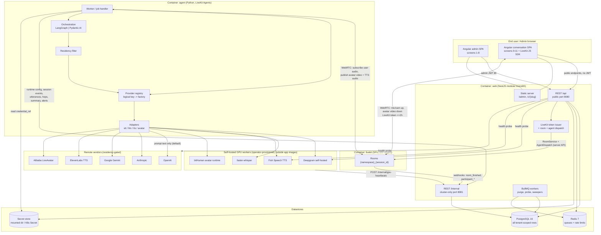

# Conversational Avatar Platform — High-Level Design (HLD)

**Status:** Approved for development
**Spec:** `docs/PRODUCT_SPECIFICATION.md` (authoritative; this document must not contradict it)
**Backlog:** `docs/BACKLOG.md`
**ADR:** `docs/architecture/adr/ADR-001-stack.md`
**LLD:** `docs/architecture/LLD.md`
**Deployment model:** SaaS (Multi-Tenant), row-level isolation

---

## 1. Architectural summary

| Dimension | Decision |
|---|---|
| Control plane | **NestJS** modular monolith, TypeScript, serves `/api` + both compiled Angular SPAs |
| Admin UI (screens 1–8) | **Angular** SPA (`admin`), served by NestJS at `/admin` |
| Conversation UI (screens 9–11) | **Angular** SPA (`conversation`), served by NestJS at `/c/{slug}`, uses **LiveKit JS SDK** |
| Agent runtime (media/AI loop) | **Python** process on **LiveKit Agents**, LangGraph *or* Pydantic AI selected per deployment |
| Transport / SFU | **LiveKit**, self-hosted, separate process |
| Datastores | **PostgreSQL 16** (single logical DB, row-level `tenant_id`), **Redis 7** (BullMQ queues + rate limits) |
| Secrets | Directory-mounted secret store (`SECRETS_DIR`), K8s projected Secret in production; `credential_ref` = key |
| Architecture style | **Modular monolith** for the control plane + **one additional deployable** for the agent runtime |
| Deployment topology | **Multi-container** (`web`, `agent`, `livekit`, `postgres`, `redis`) — escape hatch justified in ADR-001 §4 |
| API style | **REST** over HTTP/JSON under `/api`, OpenAPI 3 via `@nestjs/swagger` |
| Schema library | **TypeBox** (TypeScript: API + forms + shared contracts), **Pydantic v2** (Python: runtime config + structured LLM output) |

The system is deliberately **two brains, one product**: a stateless CRUD/policy control plane that never touches media, and a per-session media/AI worker that never owns product data. Everything they share crosses one narrow internal HTTP contract (`/internal/*`) plus the LiveKit room.

---

## 2. System architecture diagram

### 2.1 What each component owns

| Component | Owns | Explicitly does **not** |
|---|---|---|
| `web` / NestJS | Tenants, admin auth + RBAC, provider registry, Agent Builder YAML + validation, residency/alert policy, session **records**, transcripts/hops **storage**, dashboards, audit, LiveKit room creation + token issuance, agent dispatch, scheduled jobs | Attach to LiveKit as a media client; run STT/LLM/TTS/avatar; import vendor AI SDKs for the talk loop (FR-TRANSPORT-3, §9.1) |
| `agent` / Python | The conversation loop (STT → LLM(+tools) → TTS → avatar), provider adapter instantiation, retry/failover, degraded mode, residency stripping, hop measurement, post-call summary generation | Serve HTTP to browsers; own product CRUD; write to Postgres directly (writes go through `/internal`) |
| `livekit` | WebRTC signalling, SFU media routing, room lifecycle (`empty_timeout=900s`), agent job dispatch | Any product logic |
| GPU workers | Speech recognition, speech synthesis, avatar rendering | Anything tenant-aware — they are addressed per-tenant by `endpoint_url` from `ProviderCredential` |

---

## 3. Service boundaries

The control plane is a **modular monolith**: one NestJS process, one Postgres schema, hard module boundaries enforced by folder layout + ESLint import rules (LLD §3.4). Modules communicate only through each other's published application-layer ports — never by reaching into another module's repositories or Prisma models.

### 3.1 Control-plane modules

| Module | Responsibility | Key FRs |
|---|---|---|
| `platform` | Bootstrap, `@nestjs/config` + TypeBox env validation, health/readiness, OpenAPI, Pino logger, Prisma client + tenant guard extension | NFR-2, NFR-3 |
| `auth` | Login, refresh rotation, logout, seed bootstrap, invites/accept, JWT strategies (`admin-jwt`, `internal-token`), RBAC guards, cross-tenant 404 policy | FR-AUTH-1..5, FR-TENANT-5 |
| `tenants` | Tenant CRUD, slug immutability, pause/activate, optimistic locking, side-effect creation of empty config + default residency + default alert policy | FR-TENANT-1..5 |
| `admin-users` | AdminUser + AdminUserTenant membership, invite scoping, role-grant rules | FR-AUTH-3 |
| `providers` | `ProviderDefinition` catalog (seeded, operator can disable), per-tenant `ProviderCredential`, secret-in-body rejection, health probes | FR-PROVIDER-1..3, FR-PROVIDER-6 |
| `deployment-config` | Agent Builder YAML parse/generate, canonical schema validation, static combination validation, draft/publish, denormalized provider columns | FR-CONFIG-1..5, FR-PROVIDER-5, FR-PROVIDER-7 |
| `tools` | Operator-configured HTTP tool definitions referenced by `agent.tools[].api_ref` | FR-AGENT-2, FR-AGENT-5 |
| `residency` | `DataResidencyPolicy` CRUD + publish-time interaction with remote LLM rule | FR-PRIV-1..2 |
| `alerts` | `AlertPolicy` CRUD, `AlertEvent` list (7-day UI window), failover statistics | FR-ALERT-1..4 |
| `transport` | LiveKit room create/close, token minting (user + agent identities), explicit agent dispatch, LiveKit webhook ingestion | FR-AUTH-4, FR-TRANSPORT-1..4 |
| `sessions` | Session lifecycle + status machine, transcript utterances, latency hops, feedback, summary storage, search | FR-SESS-1..3, FR-TRANSPORT-4, FR-CALL-4..5 |
| `gpu` | Heartbeat ingestion, node health derivation (stale > 60s = unhealthy), autoscaler status constant | FR-GPU-1..3 |
| `dashboard` | Cross-tenant aggregates (volume, error rate, provider-health grid) scoped by RBAC | FR-DASH-1..2 |
| `audit` | Audit rows for every admin mutation, redacted payloads, 365-day retention | NFR-8 |
| `public` | Unauthenticated surface: preflight, session/token issue, summary read, feedback submit | FR-CALL-1, FR-CALL-4..5, FR-AUTH-4 |
| `internal` | Agent- and infrastructure-facing surface on the cluster-only listener: runtime config, session events, utterance/hop batches, summary write, alert raise, GPU heartbeats, LiveKit webhooks | FR-GPU-3, FR-PRIV-2, NFR-3 |
| `jobs` | BullMQ producers/consumers: transcript purge, provider probe scheduler, abandoned-session sweeper, room reaper safety net, retention pruning | FR-PRIV-3, FR-PROVIDER-3, FR-AUTH-4, FR-TRANSPORT-1, NFR-8 |
| `common` (shared kernel) | Error envelope + `AppError` taxonomy, TypeBox validation pipe, `Idempotency-Key` interceptor, tenant context (AsyncLocalStorage), pagination, secret-store port | §4 error contract |

### 3.2 Agent-runtime boundaries

The agent is **one deployable with internal layers**, not a microservice farm (ADR-001 §5). Layers:

`entrypoint` → `orchestration` → `ports` ← `registry` → `adapters` → vendor SDKs.

`orchestration` may only depend on `ports` (Protocol classes) and `registry`'s public resolve functions. **Only `adapters/*` may import a vendor SDK**, and only `registry` may import `adapters`. Enforced by `import-linter` (LLD §3.5).

### 3.3 The two cross-process contracts

1. **LiveKit room** — the media contract. Browser publishes mic (required) / camera (optional); agent subscribes to user audio and publishes avatar video (required) + TTS audio (optional). No product data flows here beyond room metadata (`tenant_id`, `session_id`).
2. **`/internal` HTTP** — the control contract. Agent pulls resolved runtime config at job start and pushes session state, transcript utterances, latency hops, alert events, and the post-call summary. Authenticated by an internal bearer token (mTLS in production ingress-free namespaces), listening on a port that no public ingress exposes (NFR-3).

There is no third path. The agent never opens a Postgres connection; the control plane never opens a WebRTC connection.

---

## 4. Multi-tenancy and isolation

### 4.1 Chosen strategy — row-level isolation (locked by spec §9.1)

Every tenant-scoped table carries `tenant_id uuid not null`; `AdminUser`, `RefreshToken`, `AdminInvite`, and `ProviderDefinition` are global. LiveKit rooms are namespaced `{room_namespace}_{session_id}` where `room_namespace = tenant.slug`, so a token minted for tenant A cannot address tenant B's room.

Enforcement is layered, and each layer is independently testable:

| Layer | Mechanism | Failure mode it catches |
|---|---|---|
| 1. Request context | `TenantContext` (AsyncLocalStorage) populated by `TenantScopeGuard` from path param + JWT `tenant_ids[]`; `operator` bypasses membership but still resolves a concrete `tenant_id` per request | Developer forgets to read tenant from the request |
| 2. Data access | Prisma client extension `tenantGuard` — for any model in the tenant-scoped list, a query without a `tenant_id` filter (or a `create` without `tenant_id`) throws `TenantScopeViolationError` (500, logged as a server defect per FR-TENANT-5) | Missing `where` clause in a repository |
| 3. Response policy | Cross-tenant id lookups return `404 TENANT_NOT_FOUND` / `SESSION_NOT_FOUND` — never `403` — so existence is not leaked | Enumeration probing |
| 4. Media | LiveKit token `video` grant is room-locked to one room name; agent token is publish-only for that same room | Token replay against another tenant |
| 5. QA gate | Mandatory negative integration suite: for every tenant-scoped endpoint, tenant-B credentials against tenant-A ids must produce 404 and zero rows read | Regression in any of the above |

Postgres RLS (`current_setting('app.tenant_id')`) is a documented **hardening option**, deferred: with a pooled connection and a single application role it buys defence-in-depth at the cost of per-transaction `SET LOCAL` on every query path. Layer 2 gives equivalent coverage with far less operational risk in v1. Recorded in ADR-001 §8.

### 4.2 Alternatives considered (documented, not used in v1 — spec §9.4)

| Strategy | Isolation strength | Cost | Why not v1 |
|---|---|---|---|
| **Row-level `tenant_id` (chosen)** | Application-enforced; one leaky query is a breach | One schema, one migration, one connection pool; cheapest for 500 tenants × 50 concurrent sessions (NFR-7) | — |
| Schema-per-tenant | Stronger (schema search_path per request) | 500 schemas × ~20 tables = 10k objects; every migration runs 500×; connection-pool churn | Spec §9.1/§9.4 explicitly excludes it from v1 |
| Database-per-tenant | Strongest (physical) | 500 databases, 500 pools, per-tenant backup/restore, cross-tenant dashboard (FR-DASH-1) needs fan-out or a warehouse | Kills the cross-tenant dashboard cheaply required in v1 |

Migration path if ever needed: because every table already has `tenant_id` and every query is tenant-filtered, moving to schema-per-tenant is a data-partitioning exercise plus a `search_path` resolver in layer 1 — no query rewrites. Keeping that path open is a reason to keep layer 2 strict.

---

## 5. Security model

### 5.1 Two token systems, deliberately disjoint

| | Admin JWT | LiveKit conversation token | LiveKit agent token | Internal token | Summary token |
|---|---|---|---|---|---|
| Audience | `avatar-platform/api` | LiveKit server | LiveKit server | `avatar-platform/internal` | `avatar-platform/summary` |
| Signature | RS256 (platform keypair) | HS256 with LiveKit API secret | HS256 with LiveKit API secret | opaque bearer (mounted secret) | opaque, hashed at rest |
| TTL | access 8h, refresh 7d (rotated) | `min(2h, session.max_duration)` | same as session | long-lived, rotated by ops | 30 min |
| Grants | `sub`, `email`, `roles[]`, `tenant_ids[]` | join + publish + subscribe on **one** room, identity `user_{...}` | join + publish on same room, identity `agent_{...}` | `/internal/*` only | read one session's transcript/summary, write one feedback |
| Reaches | `/api/*` admin routes | LiveKit only | LiveKit only | cluster-only listener :8081 | `/api/public/sessions/{id}/...` |

Guards make the separation explicit and testable: `AdminJwtGuard` rejects any token whose `aud` is not the API audience → `401 AUTH_UNAUTHORIZED` (FR-AUTH-5), so presenting a LiveKit token to `/api/tenants/...` fails on audience before any tenant logic runs. There is **no** `POST /auth/register` route, in any module, ever (FR-AUTH-3).

### 5.2 Authorization model — RBAC with tenant membership

Two roles, `operator` and `admin`, carried as an array (`roles[]`) because one human may hold both.

| Capability | `operator` | `admin` (assigned tenants only) |
|---|---|---|
| Create tenant, pause/activate | yes | no |
| Read tenant list | all tenants | assigned only (empty list, not 403, when unassigned — FR-TENANT-2) |
| Edit Agent Builder / residency / alerts | all | assigned only |
| Provider catalog enable/disable | yes | read-only |
| Provider credentials (endpoints, refs) | all | assigned only |
| Invite admins | yes, may grant `operator` | assigned tenants only, may **not** grant `operator` (`403 AUTH_ROLE_FORBIDDEN`) |
| Session logs / GPU / dashboard | all | assigned only |
| Audit log read | yes | no |

Implementation: `@Roles('operator')` decorator + `RolesGuard` for role gates; `TenantScopeGuard` for membership; both run before controllers, and the membership check resolves to `404` for unknown-or-unassigned so §5.1's non-enumeration rule holds. Every mutating admin route writes an `AuditLog` row through an interceptor, with payloads redacted by a shared key denylist (`api_key`, `apiKey`, `token`, `password`, `secret`, `credential_ref` values).

### 5.3 Secrets

- `ProviderCredential.credential_ref` is an opaque key. The **only** thing stored in Postgres is the key plus `endpoint_url` and non-secret `extra`.
- Secret store is a port with one v1 implementation: **directory-mounted secrets** — `SECRETS_DIR/{ref}` is a file whose content is the secret. On docker-compose this is a bind mount; in Kubernetes a projected `Secret` volume; a Vault-backed implementation is a drop-in later.
- The control plane only needs `exists(ref)` (to render `has_secret`) plus its own platform secrets (JWT keys, LiveKit API key/secret, DB/Redis URLs, internal token). **It never reads provider secrets and never forwards them.**
- The agent resolves `credential_ref` → secret itself, from its own mount. Secrets therefore never traverse an HTTP hop, never appear in `yaml_text`, previews, logs, transcripts, or audit payloads (FR-PROVIDER-2, FR-PROVIDER-7, NFR-3).
- Save-time defence: YAML and request bodies are scanned for secret-looking keys → `400 CONFIG_SECRET_IN_YAML` / `PROVIDER_SECRET_IN_BODY`.

### 5.4 Data locality (AI subsystem decision — mandatory, not implicit)

Where inference runs relative to tenant data, by hop:

| Hop | Where it runs by default | What leaves the tenant boundary | Control |
|---|---|---|---|
| Transport (LiveKit) | **On-prem**, self-hosted | nothing | v1 lock-in (FR-TRANSPORT-1) |
| STT (Deepgram self-hosted / faster-whisper) | **On-prem GPU** | nothing — raw audio never leaves the cluster | Both catalog entries are `self_hosted` |
| LLM (OpenAI / Anthropic / Google) | **Remote third-party API** | **Text only**: system prompt + memory-window text + current turn's final transcript text. Never audio, never recordings, never historical transcript export unless the tenant explicitly selects `prompt_and_transcript` | `DataResidencyPolicy.send_to_remote_llm`, default `prompt_text_only`; enforced by the agent's residency filter *before* the HTTP call; snapshot onto `Session.residency_snapshot` at start so a mid-session policy change cannot widen an in-flight session (FR-PRIV-2) |
| TTS (Fish Speech) | **On-prem GPU** | nothing | production default (FR-TTS-1) |
| TTS (ElevenLabs, optional) | Remote | assistant reply text | `hosting: remote` badge in Agent Builder; residual risk accepted per spec, surfaced to the operator at selection time (FR-PROVIDER-6) |
| Avatar (bitHuman) | **On-prem GPU** | nothing | production default (FR-AVATAR-1) |
| Avatar (Alibaba LiveAvatar, optional) | Remote/customer-hosted per vendor contract | TTS audio + rendered video round-trip | `hosting: remote` badge + documented feature gaps (FR-AVATAR-2) |
| Post-call summary LLM | **In the agent process**, same provider/residency policy as the conversation | same as conversation LLM | Written once at session end via `/internal`; the control plane only reads it (§7.3) |

The posture in one sentence: **media and speech stay on-prem; only text crosses to remote LLMs, under a per-tenant policy that is snapshotted per session.** Selecting a `remote` TTS or avatar provider is the only way to move audio/video off-prem, and that choice is visible in the UI and recorded in the session's `provider_stack` snapshot.

Additional AI-specific security rules (NFR-3): tool responses are untrusted text, capped at 32 KiB and credential-stripped; model output is never `eval`'d or executed server-side; STT text is never logged at `info` (FR-PRIV-4).

---

## 6. Data strategy

**PostgreSQL 16, relational, single logical database.** Justification against the spec's data model:

- 18 entities with dense referential integrity (Tenant → config/policies/credentials/sessions → utterances/hops/feedback) and per-tenant uniqueness constraints (`(tenant_id, provider_key, display_label)`, `unique room_name`) — constraints the spec states as *validation errors*, so they belong in the schema, not application code.
- Multi-field transactional invariants: FR-TENANT-1 creates Tenant + DeploymentConfig + DataResidencyPolicy + AlertPolicy atomically; FR-CONFIG-3 publish updates config + audit + alert policy atomically. One ACID transaction each.
- Optimistic locking on `updated_at` (FR-TENANT-3, FR-CONFIG-3) is a trivial `WHERE updated_at = ?` guard.
- Dashboard aggregates (FR-DASH-1) and hop percentiles (NFR-1, FR-SESS-3) are `GROUP BY` / `percentile_disc` queries over indexed columns at v1 volumes (50 concurrent sessions, 500 tenants).
- Transcript full-text search (FR-SESS-1 `q`) uses a Postgres GIN index on `to_tsvector('simple', text)` — no separate search engine needed at v1 scale.
- `jsonb` covers the intentionally schemaless fields (`provider_stack`, `residency_snapshot`, `extra`, audit `payload`) so NoSQL buys nothing here.

**Redis 7** is infrastructure, not a datastore of record: BullMQ queues (purge, probes, sweepers) and sliding-window rate limits (login 10/10min per IP+email, probes 30/min per tenant). Losing Redis degrades scheduling and rate limiting; it never loses product data.

Nothing else. No message broker (BullMQ over Redis covers async work), no time-series DB (`LatencyHop` in Postgres with retention pruning is sufficient for NFR-1 reporting at v1 volumes), no object storage (recordings are out of v1 — FR-PRIV-1).

Migrations are Prisma Migrate, forward-only, applied by an init container / `prisma migrate deploy` before the `web` process starts. Seeds (`ProviderDefinition` catalog, FR-PROVIDER-1) are idempotent upserts run on every boot.

---

## 7. API strategy

### 7.1 REST, not GraphQL or RPC

The spec dictates it in practice: §4 defines fixed HTTP status codes per failure (`400/401/403/404/409/422/429/503`), a single error envelope, `Idempotency-Key` semantics, and `If-Match`/`updated_at` optimistic concurrency. Those are HTTP-native. GraphQL would collapse the status taxonomy into `200 + errors[]` and force re-specifying every code the spec pins; gRPC/tRPC would not serve a browser-facing public surface without a gateway. Surfaces are also small and screen-shaped (11 screens), so REST resource routes map nearly 1:1 to screens with no over-fetching problem worth solving.

OpenAPI 3 is generated from TypeBox schemas via `@nestjs/swagger`, published at `/api/docs` (admin-authenticated in production).

### 7.2 Three HTTP surfaces, separated by trust

| Surface | Path prefix | Listener | Auth | Consumers |
|---|---|---|---|---|
| Admin API | `/api/*` (minus `/api/public`) | public :8080 | Admin JWT | admin SPA |
| Public API | `/api/public/*` | public :8080 | none, or `X-Summary-Token` | conversation SPA |
| Internal API | `/internal/*` | **cluster-only :8081** | internal bearer token (+ mTLS in prod) | agent, LiveKit webhooks, GPU heartbeat senders |

The separate internal listener is how NFR-3's "internal heartbeat/tool URLs not exposed on the public conversation origin" is satisfied structurally rather than by ingress rules alone: the routes are not mounted on the port the ingress can reach.

### 7.3 Post-call summary — one owner

**The agent generates and writes the summary; the control plane only reads it.** At session end the agent already holds the conversation state, the resolved LLM adapter, and the residency snapshot, so generating there requires no second provider path, no vendor SDK in NestJS, and no residency re-derivation. The agent `POST /internal/sessions/{id}/summary` writes `summary_text` + `summary_status`; screen 11 reads it via the summary token. If generation fails, `summary_status = unavailable` and screen 11 hides the summary but still shows the transcript (`SUMMARY_UNAVAILABLE`, non-blocking — FR-CALL-4). The control plane holds **no** LLM client of any kind.

---

## 8. Infrastructure, environments, CI/CD

### 8.1 Container inventory (what `nexus-deploy` must build)

| Container | Built from this repo | Base | Scales on | Notes |
|---|---|---|---|---|
| `web` | **yes** | `node:22-alpine` (multi-stage: build Angular + Nest, ship `dist` + `prisma`) | CPU / request concurrency | Serves `/api`, `/admin`, `/c`, plus `/internal` on :8081 and BullMQ workers in-process for v1 |
| `agent` | **yes** | `python:3.12-slim` (CUDA base only if an in-process GPU adapter is enabled) | concurrent sessions | LiveKit Agents worker, `agent_name=avatar-agent`, explicit dispatch |
| `livekit` | no (upstream `livekit/livekit-server`) | — | media load | Self-hosted, config-mounted, webhooks → `/internal/livekit/webhooks` |
| `postgres` | no (upstream `postgres:16`) | — | vertical | Managed instance in production |
| `redis` | no (upstream `redis:7`) | — | vertical | Queues + rate limits |
| GPU workers | no | — | independently, by the operator | Deepgram self-hosted, faster-whisper, Fish Speech, bitHuman — provisioned out of band (spec §9.3) and addressed via `ProviderCredential.endpoint_url` |

Two images. Not one (the runtimes differ), not seven (no per-provider services — ADR-001 §5).

### 8.2 Environments

| Env | Shape | Providers |
|---|---|---|
| `local` | docker-compose: `web`, `agent`, `livekit`, `postgres`, `redis`; secrets from `./secrets` bind mount | faster-whisper CPU or stub adapters; an OpenAI-compatible local endpoint (Ollama/vLLM) via `endpoint_url` where available |
| `ci` | compose subset (`web`, `postgres`, `redis`, `livekit`) for API + Playwright e2e; agent runs with stub adapters | deterministic stubs |
| `staging` / `production` | Kubernetes: `web` Deployment (HPA), `agent` Deployment (session-count-driven replicas), `livekit` StatefulSet or operator-managed, managed Postgres + Redis, projected Secret volumes | production baseline: LiveKit self-hosted + Deepgram self-hosted or faster-whisper + remote OpenAI/Anthropic/Google + Fish Speech + bitHuman (spec §9.2) |

Config is environment variables validated at bootstrap with TypeBox (`@nestjs/config`) — an invalid or missing variable fails the process at start, never at first request. The agent validates its own env with Pydantic `BaseSettings`.

### 8.3 CI/CD shape

GitHub Actions, one workflow, fail-fast per job:

1. `contracts` — build `packages/contracts`, export `agent-config.schema.json` as a workflow artifact.
2. `api` — `pnpm lint` (incl. import-boundary rules), `tsc --noEmit`, Jest unit, Jest+Supertest integration against ephemeral Postgres/Redis service containers.
3. `web` — `ng lint`, `ng test` (Jest), `ng build` both SPAs.
4. `agent` — `ruff check`, `ruff format --check`, `mypy`, `import-linter` (boundary contracts), `pytest` — including the **contract test** that the Pydantic runtime-config model accepts/rejects exactly the fixtures the TypeBox schema accepts/rejects, using the artifact from step 1. This is what keeps the YAML schema from drifting between the two languages.
5. `e2e` — compose up, seed, Playwright across the admin screens and a stub-adapter conversation; plus the cross-tenant isolation negative suite (§4.1 layer 5) and the accessibility pass (NFR-4, `@axe-core/playwright`).
6. `images` — build/push `web` and `agent` on green `main`, tagged with the commit SHA.
7. `deploy` — `prisma migrate deploy` as a pre-deploy Job, then rolling update of `web`, then `agent`. Order matters: migrations are forward-compatible so `web` old+new can overlap during the roll.

---

## 9. Scaling strategy

The whole reason for the multi-container split is that these three things scale on unrelated signals:

| Tier | Bottleneck | Scaling unit | v1 target | Mechanism |
|---|---|---|---|---|
| `web` | HTTP request concurrency; dashboard aggregate queries | stateless replicas | 2+ replicas | Kubernetes HPA on CPU; fully stateless (JWT-based, no sticky sessions). Cheap to scale, and it must stay cheap because it is the tier that fails closed with `503` for new joins (NFR-2) |
| `agent` | One job per session; each job holds a WebRTC connection, an STT stream, an LLM stream, a TTS stream, and an avatar session for the session's lifetime | replicas × `max_concurrent_jobs` per worker | 50 concurrent sessions (NFR-7 soft) | LiveKit worker registration + explicit dispatch spreads jobs across available workers. Replica count = `ceil(target_sessions / max_concurrent_jobs)` with headroom; workers drain gracefully (finish in-flight jobs, accept no new dispatch) so a deploy never kills a live conversation |
| `livekit` | Media bandwidth / participants | SFU nodes | 50 concurrent rooms × 2 participants | Self-hosted; `TRANSPORT_CAPACITY` `503` at token issue when LiveKit rejects (NFR-7) |
| GPU workers (STT/TTS/avatar) | GPU memory + compute per concurrent stream | operator-provisioned nodes | per baseline sizing | **Monitoring only in v1** — screen 6 shows utilization, node health, `autoscaler: not_configured`. No scale actions exist in the product (FR-GPU-1..2, spec §9.1) |
| `postgres` | Aggregate/search queries | vertical + indexes | — | Indexes in LLD §4; read replica is a post-v1 lever, not needed at these volumes |

Independence properties that fall out of this, and that QA should verify:

- **Control-plane downtime does not drop in-flight rooms** (NFR-2). Tokens already issued remain valid until TTL; LiveKit and the agent keep running. The agent buffers `/internal` writes (bounded in-memory queue with retry/backoff) so transcript and hop rows land after the control plane returns instead of being lost; if the buffer overflows, the session continues and the drop is logged — a conversation is never sacrificed for telemetry.
- **New joins fail closed**, not open: preflight and token issue return `503` when their dependency is down (`TRANSPORT_UNAVAILABLE`), and paused/unconfigured tenants are refused before any room is created.
- **Agent scaling is decoupled from web scaling**: a traffic spike on the admin dashboard cannot starve conversations, and a burst of conversations cannot slow the admin API, because they are different pods with different resource profiles (CPU-light I/O-bound vs. long-lived streaming with GPU-adjacent latency budgets).

### 9.1 Latency budget ownership (NFR-1)

Every hop budget lives in the agent, because every hop lives in the agent:

| Hop | p95 budget | Measured where | Recorded as |
|---|---|---|---|
| STT first-partial | < 400 ms | adapter callback in agent | `LatencyHop{hop:stt, first_partial_ms, total_ms}` |
| LLM first-token | < 1500 ms | first streamed token in agent | `LatencyHop{hop:llm, first_token_ms, total_ms, provider_key, used_fallback}` |
| TTS first-audio | < 500 ms | first audio frame in agent | `LatencyHop{hop:tts, first_audio_ms, total_ms}` |
| Avatar first-frame | < 400 ms | first published video frame | `LatencyHop{hop:avatar, first_frame_ms}` |
| E2E utterance-end → first motion | < 3.0 s | agent, per utterance cycle | `LatencyHop{hop:e2e, total_ms}` |

Hops are batched to `/internal/sessions/{id}/hops` (flush every 2 s or 20 rows) so instrumentation never sits in the critical path of the conversation. A completed cycle missing a hop row is a defect, not a gap (NFR-1) — except a legitimately skipped hop (empty LLM text → no TTS row, `TTS_SKIPPED_EMPTY`), which is omitted rather than zero-filled (FR-SESS-3).
