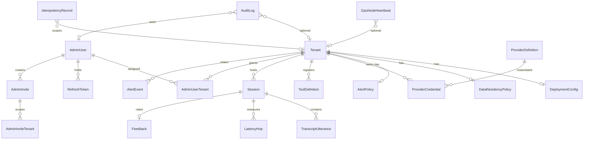
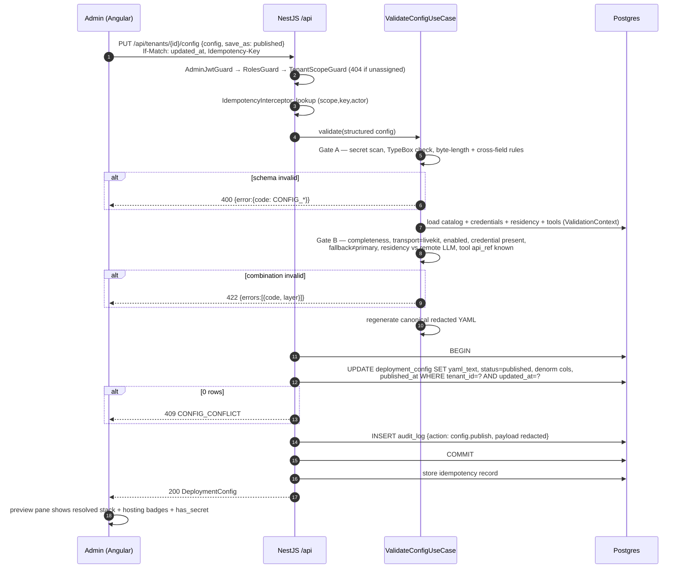
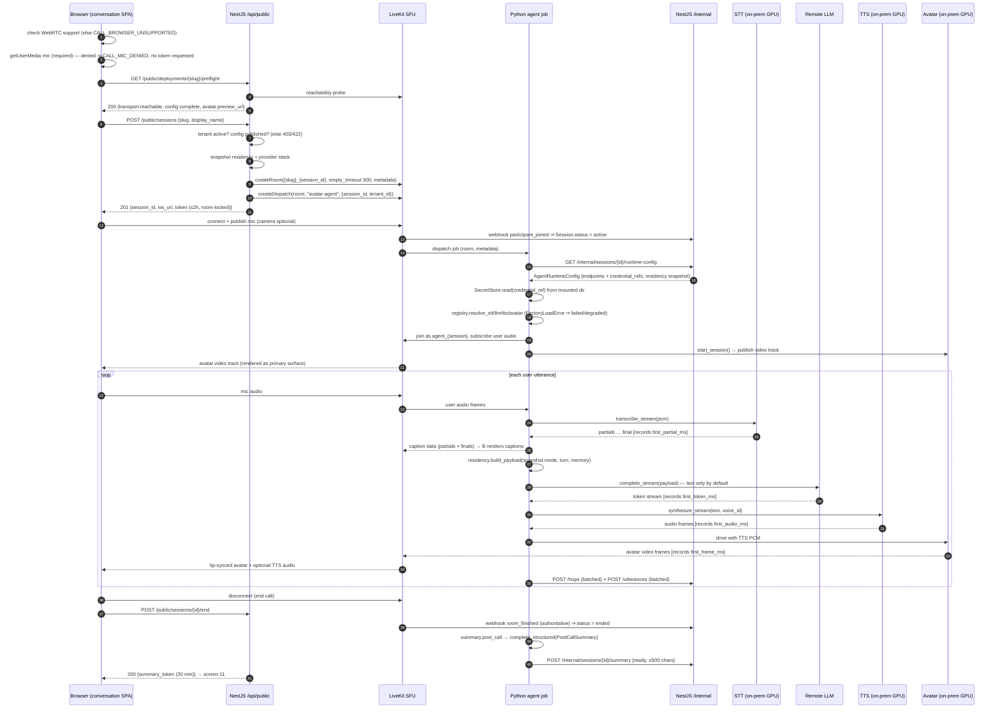
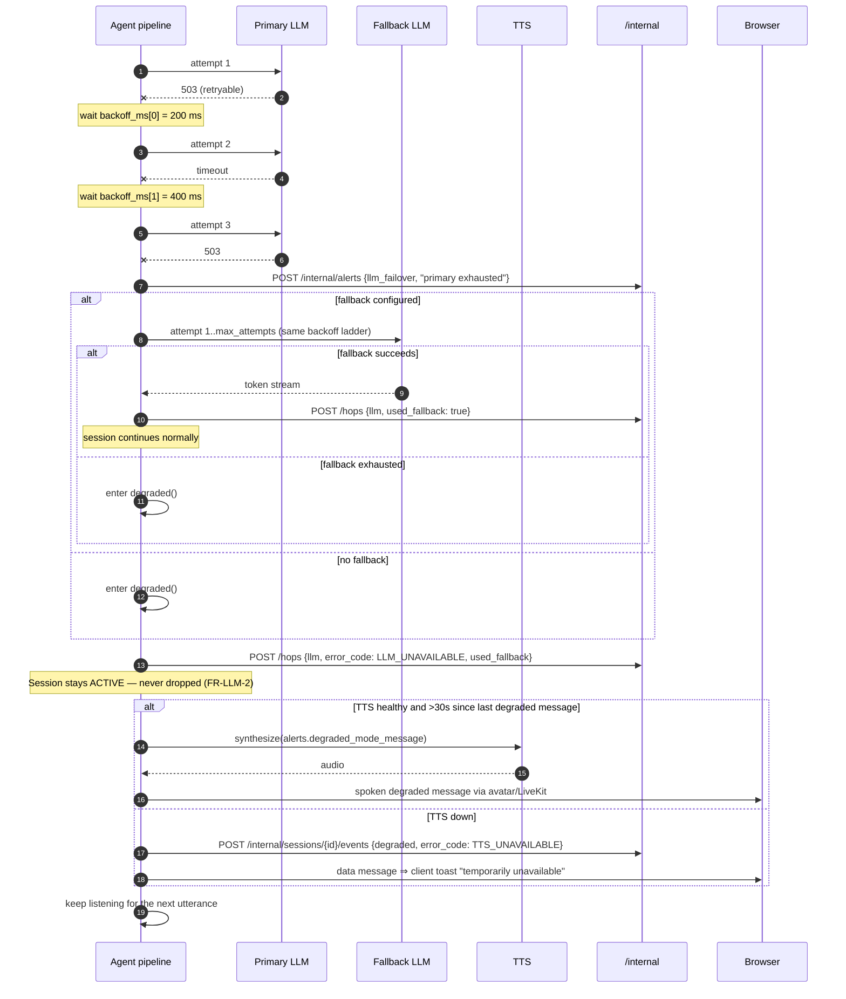

# Conversational Avatar Platform — Low-Level Design (LLD)

**Status:** Approved for development
**Spec:** `docs/PRODUCT_SPECIFICATION.md` · **HLD:** `docs/architecture/HLD.md` · **ADR:** `docs/architecture/adr/ADR-001-stack.md`

This document is prescriptive. `nexus-dev` implements what is written here and makes implementation judgment calls only inside the boundaries below. Where this document and the spec disagree, the spec wins and the discrepancy is a defect in this document.

---

## 1. Concrete library set

Chosen once, here, so it is never re-litigated per phase.

### 1.1 `apps/api` — NestJS control plane

| Concern | Package | Version policy |
|---|---|---|
| Framework | `@nestjs/common`, `@nestjs/core`, `@nestjs/platform-express` | ^11 |
| ORM | `prisma`, `@prisma/client` | ^7 (pure-TypeScript query engine) |
| Schema / validation | `@sinclair/typebox`, `@sinclair/typebox/value` | ^0.34 — **the** schema library on the TS side (AI subsystem present, ADR-001 §7) |
| Env config | `@nestjs/config` + TypeBox `Value.Check` at bootstrap | ^4 |
| Auth | `@nestjs/passport`, `passport`, `passport-jwt`, `@nestjs/jwt` | ^11 / ^4 |
| Password hashing | `@node-rs/argon2` (Argon2id) | ^2 |
| API docs | `@nestjs/swagger` | ^11 |
| Queues | `bullmq`, `@nestjs/bullmq` | ^5 |
| Logging | `nestjs-pino`, `pino`, `pino-http` (+ `pino-pretty` dev only) | ^4 / ^9 |
| Static serving | `@nestjs/serve-static` | ^5 |
| LiveKit server API | `livekit-server-sdk` | ^2 |
| YAML | `yaml` (eemeli) | ^2 — round-trip safe, no `js-yaml` unsafe loaders |
| Rate limiting | `@nestjs/throttler` with a Redis storage adapter | ^6 |
| Testing | `jest`, `ts-jest`, `supertest`, `@testcontainers/postgresql` (integration) | latest majors |

### 1.2 `apps/web` — Angular workspace (two SPAs)

| Concern | Package |
|---|---|
| Framework | `@angular/*` ^20, standalone components, no NgModules in new code |
| Local state | **Angular Signals** |
| Shared/cross-cutting state | **`@ngrx/signals`** (SignalStore) — auth, tenant context, Agent Builder editor, call session |
| UI components | **Angular Material** (`@angular/material`) + CDK |
| Forms | **Reactive Forms** |
| Validation | `@sinclair/typebox` via `packages/contracts` — the same schema objects the API validates with |
| HTTP | `HttpClient` + functional interceptors (auth, error-envelope unwrap, idempotency key) |
| Realtime media | `livekit-client` ^2 (conversation SPA only) |
| Unit tests | **Jest** (`jest-preset-angular`) + `@web/test-runner` for browser-dependent specs |
| E2E | **Playwright** + `@axe-core/playwright` (NFR-4) |

### 1.3 `apps/agent` — Python LiveKit Agents runtime

| Concern | Package | Notes |
|---|---|---|
| Package/dep manager | `uv` + `pyproject.toml` | lockfile committed |
| Python | 3.12 | |
| Agent runtime | `livekit-agents` ^1, `livekit` (RTC SDK) | the only WebRTC client in the product besides the browser |
| Orchestration A | `langgraph` | selected when `agent.runtime = langgraph` |
| Orchestration B | `pydantic-ai` | selected when `agent.runtime = pydantic-ai` |
| Schema / structured output | `pydantic` ^2, `pydantic-settings` | **the** schema library on the Python side (ADR-001 §7) |
| HTTP client | `httpx` | all adapter + `/internal` traffic; one shared async client with timeouts |
| Vendor SDKs (**only inside `adapters/`**) | `openai`, `anthropic`, `google-genai`, `deepgram-sdk`, `faster-whisper`, `elevenlabs`, `bithuman` SDK, Alibaba LiveAvatar client | import allowed nowhere else — enforced by `import-linter` |
| Lint / format / types | `ruff`, `mypy --strict` | |
| Boundaries | `import-linter` | layered contracts in §3.5 |
| Tests | `pytest`, `pytest-asyncio`, `respx` (httpx mocking) | |
| Logs | `structlog` → JSON to stdout | same field names as Pino for one log pipeline |

### 1.4 `packages/contracts` — shared TypeScript contracts

Pure TypeBox schemas + inferred types + error-code constants, consumed by `apps/api` *and* both Angular SPAs, and exported as JSON Schema for the Python contract test. Zero runtime dependencies beyond `@sinclair/typebox`.

### 1.5 Workspace tooling

pnpm workspaces (`pnpm-workspace.yaml`) — no Nx. Angular CLI manages `apps/web`; Nest CLI manages `apps/api`; `uv` manages `apps/agent`. Root scripts fan out. Rationale in ADR-001 §8.

---

## 2. Repository layout

```
LiveAvatar/
├─ apps/
│  ├─ api/                  # NestJS control plane (§3.1)
│  ├─ web/                  # Angular workspace, two SPAs (§3.2)
│  └─ agent/                # Python LiveKit Agents runtime (§3.3)
├─ packages/
│  └─ contracts/            # TypeBox schemas shared by api + web (§3.6)
├─ docs/
│  ├─ PRODUCT_SPECIFICATION.md
│  ├─ BACKLOG.md
│  ├─ NEXUS_STATE.md
│  └─ architecture/{HLD.md,LLD.md,adr/ADR-001-stack.md}
├─ deploy/                  # owned by nexus-deploy: Dockerfiles, compose, k8s, CI
├─ secrets/                 # local-only mounted secret dir, git-ignored
├─ pnpm-workspace.yaml
└─ package.json
```

---

## 3. Folder structure and module boundaries

### 3.1 `apps/api` — modular monolith, four layers per module

Every module has the same shape. No exceptions, including small modules — predictability is the point.

```
apps/api/
├─ prisma/
│  ├─ schema.prisma
│  ├─ migrations/
│  └─ seed.ts                       # idempotent ProviderDefinition catalog upserts
├─ src/
│  ├─ main.ts                       # public listener :8080
│  ├─ main-internal.ts              # bootstraps the internal listener :8081 (same app, second adapter)
│  ├─ app.module.ts
│  ├─ common/                       # shared kernel — importable by every module
│  │  ├─ errors/                    # AppError, ErrorCode union, error envelope filter
│  │  ├─ validation/                # TypeBoxValidationPipe, TypeBoxSchemaFactory (swagger bridge)
│  │  ├─ http/                      # pagination dto, IdempotencyInterceptor, IfMatch decorator
│  │  ├─ tenancy/                   # TenantContext (AsyncLocalStorage), TenantScopeGuard
│  │  ├─ auth/                      # AdminJwtGuard, RolesGuard, InternalTokenGuard, @Roles, @CurrentUser
│  │  ├─ audit/                     # AuditInterceptor + redaction denylist
│  │  ├─ secrets/                   # SecretStorePort + DirectorySecretStore
│  │  └─ prisma/                    # PrismaService + tenantGuard client extension
│  ├─ modules/
│  │  ├─ platform/                  # config schema, health, openapi, logger wiring
│  │  ├─ auth/
│  │  │  ├─ domain/                 # entities/VOs: AdminIdentity, RoleSet, TokenPair; ports: PasswordHasherPort, TokenSignerPort
│  │  │  ├─ application/            # LoginUseCase, RefreshUseCase, LogoutUseCase, SeedOperatorUseCase, InviteUseCase, AcceptInviteUseCase
│  │  │  ├─ infrastructure/         # PrismaAdminUserRepository, PrismaRefreshTokenRepository, Argon2Hasher, JwtSigner, passport strategies
│  │  │  ├─ interface/              # AuthController, HTTP schemas (TypeBox), response mappers
│  │  │  ├─ index.ts                # PUBLIC API of the module — the only importable path
│  │  │  └─ auth.module.ts
│  │  ├─ tenants/                   # same 4 layers
│  │  ├─ admin-users/
│  │  ├─ providers/
│  │  ├─ deployment-config/
│  │  ├─ tools/
│  │  ├─ residency/
│  │  ├─ alerts/
│  │  ├─ transport/
│  │  ├─ sessions/
│  │  ├─ gpu/
│  │  ├─ dashboard/
│  │  ├─ audit/
│  │  ├─ public/                    # interface-only module; composes other modules' application ports
│  │  ├─ internal/                  # interface-only module, mounted on :8081
│  │  └─ jobs/
│  └─ test/                         # e2e + isolation negative suite
└─ eslint.config.mjs
```

**Layer rules (per module):**

| Layer | May import | May **not** import |
|---|---|---|
| `domain/` | nothing but `common/errors` and other `domain/` files in the same module | Prisma, Nest decorators, HTTP, other modules |
| `application/` | own `domain/`, `common/*`, other modules' `index.ts` | Prisma client, `infrastructure/`, `interface/`, HTTP types |
| `infrastructure/` | own `domain/` (implements its ports), `common/*`, Prisma, vendor clients | own `application/`, own `interface/`, other modules' internals |
| `interface/` | own `application/`, `common/*`, `packages/contracts` | own `infrastructure/`, own `domain/` entities directly in HTTP shapes, other modules' internals |

Dependency inversion: `application/` depends on ports declared in `domain/`; `infrastructure/` provides them; `*.module.ts` wires the tokens. That is what makes each use case unit-testable without a database.

### 3.2 `apps/web` — Angular workspace

```
apps/web/
├─ angular.json                      # projects: admin, conversation, shared
├─ projects/
│  ├─ shared/src/lib/                # buildable library, imported by both SPAs
│  │  ├─ api/                        # generated-ish typed HTTP clients over packages/contracts
│  │  ├─ errors/                     # error-envelope parsing, code → message resolution
│  │  ├─ ui/                         # a11y-checked primitives: status-chip (icon + text, never colour alone), page-header, empty-state, confirm-dialog
│  │  └─ util/
│  ├─ admin/src/app/
│  │  ├─ core/                       # app config, interceptors, AuthStore, TenantContextStore, route guards, layout shell
│  │  ├─ shared/                     # admin-only reusable components (provider-badge, hosting-badge, yaml-viewer, latency-table)
│  │  └─ features/
│  │     ├─ auth/                    # screen: login, accept-invite
│  │     ├─ dashboard/               # screen 1
│  │     ├─ agent-builder/           # screen 2
│  │     ├─ deployments/             # screen 3
│  │     ├─ provider-registry/       # screen 4
│  │     ├─ session-logs/            # screen 5
│  │     ├─ gpu-monitor/             # screen 6
│  │     ├─ alerts/                  # screen 7
│  │     ├─ residency/               # screen 8
│  │     └─ admin-users/             # invite management
│  └─ conversation/src/app/
│     ├─ core/                       # LiveKitRoomService, CallSessionStore, SummaryTokenStore, browser-capability check
│     ├─ shared/
│     └─ features/
│        ├─ precall/                 # screen 9
│        ├─ call/                    # screen 10
│        └─ postcall/                # screen 11
```

**Feature rules:** a feature folder contains `pages/`, `components/`, `store/` (SignalStore if the feature has non-trivial shared state), `services/` (feature-scoped HTTP facades). A feature may import `core/`, `shared/`, and `projects/shared` — **never another feature**. Cross-feature navigation goes through the router; cross-feature data goes through `core/` stores.

Build output: `dist/admin` served at `/admin`, `dist/conversation` served at `/c` (both with SPA fallback), by `@nestjs/serve-static` in `apps/api`.

### 3.3 `apps/agent` — Python package

```
apps/agent/
├─ pyproject.toml                    # uv, ruff, mypy, import-linter config
├─ .importlinter
└─ src/avatar_agent/
   ├─ __main__.py                    # `python -m avatar_agent` → livekit worker bootstrap
   ├─ worker.py                      # WorkerOptions, agent_name="avatar-agent", prewarm, drain
   ├─ entrypoint.py                  # per-job handler: parse room metadata → fetch config → build pipeline → run
   ├─ settings.py                    # pydantic-settings: CONTROL_PLANE_INTERNAL_URL, INTERNAL_TOKEN, SECRETS_DIR, LIVEKIT_*, AI_* (§7.4)
   ├─ contracts/                     # Pydantic mirrors of the shared contracts
   │  ├─ runtime_config.py           # AgentRuntimeConfig (mirror of the YAML schema, §6)
   │  ├─ structured.py               # structured LLM outputs (PostCallSummary, ToolArgs…)
   │  └─ internal_api.py             # request models for /internal writes
   ├─ ports/                         # Protocol classes ONLY — no implementations, no vendor imports
   │  ├─ llm.py                      # ILLMProvider
   │  ├─ stt.py                      # ISTTProvider
   │  ├─ tts.py                      # ITTSProvider
   │  ├─ avatar.py                   # IAvatarProvider
   │  ├─ transport.py                # ITransportProvider
   │  └─ secrets.py                  # SecretStorePort
   ├─ registry/                      # THE ONLY module allowed to import `adapters`
   │  ├─ keys.py                     # LogicalProviderKey / LogicalModelRole enums (§7.2)
   │  ├─ registry.py                 # resolve_llm/stt/tts/avatar/transport(config) → port impl
   │  └─ errors.py                   # FactoryLoadError → degraded/abort per FR-PROVIDER-4
   ├─ adapters/                      # THE ONLY package allowed to import vendor SDKs
   │  ├─ llm/{openai.py,anthropic.py,google.py,_openai_compatible.py}
   │  ├─ stt/{deepgram.py,faster_whisper.py}
   │  ├─ tts/{fish_speech.py,elevenlabs.py}
   │  ├─ avatar/{bithuman.py,alibaba_liveavatar.py}
   │  └─ transport/livekit.py
   ├─ orchestration/
   │  ├─ pipeline.py                 # STT→LLM→TTS→avatar wiring, single in-flight utterance, queue depth 3
   │  ├─ graph_langgraph.py          # agent.runtime = langgraph
   │  ├─ graph_pydantic_ai.py        # agent.runtime = pydantic-ai
   │  ├─ failover.py                 # FR-LLM-2 retry/fallback state machine
   │  ├─ degraded.py                 # FR-ALERT-3 spoken degraded message, 30s throttle
   │  ├─ memory.py                   # FR-AGENT-3 session-scoped window
   │  ├─ rag.py                      # FR-AGENT-4 optional retrieval
   │  └─ tools.py                    # FR-AGENT-2/5 HTTP tools, 10s timeout, 32 KiB cap
   ├─ residency/filter.py            # FR-LLM-3 / FR-PRIV-2 payload stripping
   ├─ telemetry/
   │  ├─ hops.py                     # HopRecorder + batching
   │  ├─ control_plane.py            # /internal client with retry + bounded buffer
   │  └─ logging.py
   ├─ secrets/directory_store.py     # SecretStorePort impl (SECRETS_DIR/{ref})
   └─ summary/post_call.py           # FR-CALL-4 summary generation via registry
```

### 3.4 Boundary enforcement — TypeScript

`eslint.config.mjs` (flat config) at the repo root, using `eslint-plugin-import`'s `no-restricted-paths` (already a de-facto standard dependency; nothing exotic added):

```js
// apps/api — layer + module boundaries
'import/no-restricted-paths': ['error', {
  zones: [
    // domain is pure
    { target: './src/modules/*/domain', from: './src/modules/*/infrastructure' },
    { target: './src/modules/*/domain', from: './src/modules/*/interface' },
    { target: './src/modules/*/domain', from: './src/modules/*/application' },
    // application must not know about persistence or HTTP
    { target: './src/modules/*/application', from: './src/modules/*/infrastructure' },
    { target: './src/modules/*/application', from: './src/modules/*/interface' },
    // interface must not reach past application
    { target: './src/modules/*/interface', from: './src/modules/*/infrastructure' },
    // cross-module: only the module barrel is importable
    { target: './src/modules', from: './src/modules', except: ['*/index.ts'] },
    // nothing outside common/prisma may import the Prisma client
    { target: './src', from: './node_modules/@prisma/client', except: ['./common/prisma'] },
  ],
}],
// plus: no-restricted-imports blocks '@prisma/client' outside common/prisma and */infrastructure,
// and blocks 'openai' | '@anthropic-ai/sdk' | '@google/genai' | 'google-genai' anywhere in apps/api
// (the control plane holds no LLM client — HLD §7.3).
```

```js
// apps/web — feature isolation
zones: [
  { target: './projects/*/src/app/features/*', from: './projects/*/src/app/features/*', except: ['.'] },
  { target: './projects/*/src/app/core', from: './projects/*/src/app/features' },
  { target: './projects/shared', from: './projects/admin' },
  { target: './projects/shared', from: './projects/conversation' },
]
```

Two CI-enforced greps back these up (they are also what `nexus-qa` checks):
1. no `openai|anthropic|genai|@google/generative` import in `apps/api/**` or `apps/web/**`;
2. no `livekit-server-sdk` import outside `apps/api/src/modules/transport/infrastructure/**`.

### 3.5 Boundary enforcement — Python

`.importlinter`:

```ini
[importlinter]
root_package = avatar_agent

[importlinter:contract:layers]
name = Agent layering
type = layers
layers =
    avatar_agent.entrypoint
    avatar_agent.orchestration
    avatar_agent.registry
    avatar_agent.adapters
    avatar_agent.ports
containers = avatar_agent

[importlinter:contract:vendor-sdk-isolation]
name = Vendor SDKs only inside adapters
type = forbidden
source_modules =
    avatar_agent.orchestration
    avatar_agent.entrypoint
    avatar_agent.telemetry
    avatar_agent.residency
    avatar_agent.summary
    avatar_agent.contracts
    avatar_agent.ports
forbidden_modules =
    openai
    anthropic
    google.genai
    deepgram
    faster_whisper
    elevenlabs
    bithuman

[importlinter:contract:orchestration-uses-ports]
name = Orchestration depends on ports, not adapters
type = forbidden
source_modules = avatar_agent.orchestration
forbidden_modules = avatar_agent.adapters
```

`orchestration` receiving already-resolved port implementations (constructor-injected by `entrypoint`) is what makes the last contract satisfiable — and what makes the pipeline testable with fake adapters.

### 3.6 `packages/contracts` layout

```
packages/contracts/src/
├─ index.ts
├─ error-codes.ts        # every code string from the spec, as a const union
├─ common/               # Pagination, ErrorEnvelope, Idempotency header names
├─ agent-config/         # the canonical YAML schema (§6) — the single most important shared artifact
├─ tenants/  auth/  providers/  deployment-config/  sessions/  dashboard/  gpu/  alerts/  residency/  tools/  public/  internal/
└─ scripts/export-schema.ts   # writes dist/agent-config.schema.json for the Python contract test
```

---

## 4. Database schema (PostgreSQL 16, Prisma)

Conventions: `uuid` PKs (`gen_random_uuid()`), `timestamptz`, snake_case columns via `@map`, `tenant_id` on every tenant-scoped table, no cascading delete onto tenants except through explicit purge jobs (audit trails outlive their subjects).

### 4.1 Prisma schema

```prisma
generator client {
  provider        = "prisma-client-js"
  previewFeatures = ["postgresqlExtensions"]
}

datasource db {
  provider   = "postgresql"
  url        = env("DATABASE_URL")
  extensions = [citext, pgcrypto]
}

enum TenantStatus        { active paused }
enum ConfigStatus        { draft published }
enum ProviderCategory    { transport stt llm tts avatar }
enum ProviderHosting     { self_hosted remote }
enum ProbeStatus         { healthy degraded unreachable unknown }
enum ResidencyMode       { prompt_text_only prompt_and_transcript none }
enum AgentRuntime        { langgraph pydantic_ai }        // @map("pydantic-ai") on the value in YAML mapping
enum SessionStatus       { pending active ended failed abandoned degraded }
enum UtteranceRole       { user assistant }
enum HopKind             { stt llm tts avatar e2e }
enum GpuRole             { stt tts avatar }
enum AlertType           { llm_failover provider_unreachable session_failed gpu_unhealthy }
enum SummaryStatus       { none pending ready unavailable }

model Tenant {
  id             String        @id @default(dbgenerated("gen_random_uuid()")) @db.Uuid
  name           String        @db.VarChar(80)
  slug           String        @unique @db.VarChar(48)
  status         TenantStatus  @default(active)
  roomNamespace  String        @map("room_namespace") @db.VarChar(48)
  createdAt      DateTime      @default(now()) @map("created_at") @db.Timestamptz
  updatedAt      DateTime      @updatedAt @map("updated_at") @db.Timestamptz

  config         DeploymentConfig?
  residency      DataResidencyPolicy?
  alertPolicy    AlertPolicy?
  credentials    ProviderCredential[]
  sessions       Session[]
  memberships    AdminUserTenant[]
  tools          ToolDefinition[]
  alertEvents    AlertEvent[]

  @@index([status])
  @@index([updatedAt])
  @@map("tenant")
}

model AdminUser {
  id            String    @id @default(dbgenerated("gen_random_uuid()")) @db.Uuid
  email         String    @unique @db.Citext                    // max 254 enforced at validation
  passwordHash  String    @map("password_hash")
  roles         String[]                                        // subset of {operator, admin}
  disabled      Boolean   @default(false)
  createdAt     DateTime  @default(now()) @map("created_at") @db.Timestamptz

  memberships   AdminUserTenant[]
  refreshTokens RefreshToken[]
  invitesSent   AdminInvite[]  @relation("InviteCreator")

  @@index([disabled])
  @@map("admin_user")
}

model AdminUserTenant {
  adminUserId String    @map("admin_user_id") @db.Uuid
  tenantId    String    @map("tenant_id") @db.Uuid
  createdAt   DateTime  @default(now()) @map("created_at") @db.Timestamptz

  adminUser   AdminUser @relation(fields: [adminUserId], references: [id], onDelete: Cascade)
  tenant      Tenant    @relation(fields: [tenantId], references: [id], onDelete: Cascade)

  @@id([adminUserId, tenantId])
  @@index([tenantId])
  @@map("admin_user_tenant")
}

model AdminInvite {
  id          String    @id @default(dbgenerated("gen_random_uuid()")) @db.Uuid
  email       String    @db.Citext
  roles       String[]
  tokenHash   String    @unique @map("token_hash")
  expiresAt   DateTime  @map("expires_at") @db.Timestamptz          // created_at + 72h
  acceptedAt  DateTime? @map("accepted_at") @db.Timestamptz
  createdBy   String    @map("created_by") @db.Uuid
  createdAt   DateTime  @default(now()) @map("created_at") @db.Timestamptz

  creator     AdminUser @relation("InviteCreator", fields: [createdBy], references: [id])
  tenants     AdminInviteTenant[]

  @@index([email])
  @@index([expiresAt])
  @@map("admin_invite")
}

model AdminInviteTenant {
  inviteId String      @map("invite_id") @db.Uuid
  tenantId String      @map("tenant_id") @db.Uuid
  invite   AdminInvite @relation(fields: [inviteId], references: [id], onDelete: Cascade)

  @@id([inviteId, tenantId])
  @@index([tenantId])
  @@map("admin_invite_tenant")
}

model RefreshToken {
  id           String    @id @default(dbgenerated("gen_random_uuid()")) @db.Uuid
  adminUserId  String    @map("admin_user_id") @db.Uuid
  tokenHash    String    @unique @map("token_hash")
  familyId     String    @map("family_id") @db.Uuid
  expiresAt    DateTime  @map("expires_at") @db.Timestamptz          // 7 days
  revokedAt    DateTime? @map("revoked_at") @db.Timestamptz
  createdAt    DateTime  @default(now()) @map("created_at") @db.Timestamptz

  adminUser    AdminUser @relation(fields: [adminUserId], references: [id], onDelete: Cascade)

  @@index([adminUserId])
  @@index([familyId])
  @@index([expiresAt])
  @@map("refresh_token")
}

model ProviderDefinition {
  key                String            @id @db.VarChar(64)
  category           ProviderCategory
  displayName        String            @map("display_name") @db.VarChar(80)
  hosting            ProviderHosting
  interfaceName      String            @map("interface_name") @db.VarChar(48)   // e.g. ILLMProvider
  requiresCredential Boolean           @default(true) @map("requires_credential")
  enabled            Boolean           @default(true)
  featureGaps        String?           @map("feature_gaps")

  credentials        ProviderCredential[]

  @@index([category, enabled])
  @@map("provider_definition")
}

model ProviderCredential {
  id               String       @id @default(dbgenerated("gen_random_uuid()")) @db.Uuid
  tenantId         String       @map("tenant_id") @db.Uuid
  providerKey      String       @map("provider_key") @db.VarChar(64)
  displayLabel     String       @default("default") @map("display_label") @db.VarChar(80)
  endpointUrl      String       @map("endpoint_url") @db.VarChar(2048)
  credentialRef    String?      @map("credential_ref") @db.VarChar(256)
  extra            Json         @default("{}")                     // <= 8 KB, validated
  lastProbeStatus  ProbeStatus  @default(unknown) @map("last_probe_status")
  lastProbeAt      DateTime?    @map("last_probe_at") @db.Timestamptz
  lastProbeError   String?      @map("last_probe_error") @db.VarChar(500)
  createdAt        DateTime     @default(now()) @map("created_at") @db.Timestamptz
  updatedAt        DateTime     @updatedAt @map("updated_at") @db.Timestamptz

  tenant           Tenant             @relation(fields: [tenantId], references: [id], onDelete: Cascade)
  definition       ProviderDefinition @relation(fields: [providerKey], references: [key])

  @@unique([tenantId, providerKey, displayLabel])
  @@index([tenantId, providerKey])
  @@index([lastProbeStatus, lastProbeAt])
  @@map("provider_credential")
}

model DeploymentConfig {
  id                  String        @id @default(dbgenerated("gen_random_uuid()")) @db.Uuid
  tenantId            String        @unique @map("tenant_id") @db.Uuid
  yamlText            String        @map("yaml_text")                  // redacted; secrets rejected at save
  status              ConfigStatus  @default(draft)
  transportProvider   String?       @map("transport_provider") @db.VarChar(64)
  sttProvider         String?       @map("stt_provider") @db.VarChar(64)
  llmProvider         String?       @map("llm_provider") @db.VarChar(64)
  llmFallbackProvider String?       @map("llm_fallback_provider") @db.VarChar(64)
  ttsProvider         String?       @map("tts_provider") @db.VarChar(64)
  avatarProvider      String?       @map("avatar_provider") @db.VarChar(64)
  agentRuntime        AgentRuntime? @map("agent_runtime")
  publishedAt         DateTime?     @map("published_at") @db.Timestamptz
  updatedAt           DateTime      @updatedAt @map("updated_at") @db.Timestamptz   // optimistic lock
  updatedBy           String?       @map("updated_by") @db.Uuid

  tenant              Tenant        @relation(fields: [tenantId], references: [id], onDelete: Cascade)

  @@index([status])
  @@map("deployment_config")
}

model DataResidencyPolicy {
  tenantId              String        @id @map("tenant_id") @db.Uuid
  sendToRemoteLlm       ResidencyMode @default(prompt_text_only) @map("send_to_remote_llm")
  retainTranscriptsDays Int           @default(90) @map("retain_transcripts_days")   // 1..730
  recordingsEnabled     Boolean       @default(false) @map("recordings_enabled")
  updatedAt             DateTime      @updatedAt @map("updated_at") @db.Timestamptz

  tenant                Tenant        @relation(fields: [tenantId], references: [id], onDelete: Cascade)

  @@map("data_residency_policy")
}

model AlertPolicy {
  tenantId            String   @id @map("tenant_id") @db.Uuid
  retryMaxAttempts    Int      @default(3) @map("retry_max_attempts")        // 1..5
  retryBackoffMs      Int[]    @default([200, 400, 800]) @map("retry_backoff_ms")
  degradedModeMessage String   @default("I'm having trouble reaching the language service. Please wait a moment and try again.") @map("degraded_mode_message") @db.VarChar(500)
  updatedAt           DateTime @updatedAt @map("updated_at") @db.Timestamptz

  tenant              Tenant   @relation(fields: [tenantId], references: [id], onDelete: Cascade)

  @@map("alert_policy")
}

model ToolDefinition {
  id            String   @id @default(dbgenerated("gen_random_uuid()")) @db.Uuid
  tenantId      String   @map("tenant_id") @db.Uuid
  apiRef        String   @map("api_ref") @db.VarChar(64)      // referenced by agent.tools[].api_ref
  name          String   @db.VarChar(80)
  description   String?  @db.VarChar(500)
  method        String   @db.VarChar(8)                       // GET|POST|PUT|PATCH|DELETE
  url           String   @db.VarChar(2048)                    // https only
  credentialRef String?  @map("credential_ref") @db.VarChar(256)
  argsSchema    Json     @default("{}") @map("args_schema")   // JSON Schema for tool arguments
  enabled       Boolean  @default(true)
  createdAt     DateTime @default(now()) @map("created_at") @db.Timestamptz
  updatedAt     DateTime @updatedAt @map("updated_at") @db.Timestamptz

  tenant        Tenant   @relation(fields: [tenantId], references: [id], onDelete: Cascade)

  @@unique([tenantId, apiRef])
  @@index([tenantId, enabled])
  @@map("tool_definition")
}

model Session {
  id                     String         @id @default(dbgenerated("gen_random_uuid()")) @db.Uuid
  tenantId               String         @map("tenant_id") @db.Uuid
  roomName               String         @unique @map("room_name") @db.VarChar(128)
  status                 SessionStatus  @default(pending)
  errorCode              String?        @map("error_code") @db.VarChar(64)
  providerStack          Json           @map("provider_stack")            // snapshot at start
  residencySnapshot      Json           @map("residency_snapshot")        // snapshot at start (FR-PRIV-2)
  displayName            String?        @map("display_name") @db.VarChar(40)
  maxDurationSeconds     Int            @default(7200) @map("max_duration_seconds")
  startedAt              DateTime       @default(now()) @map("started_at") @db.Timestamptz
  joinedAt               DateTime?      @map("joined_at") @db.Timestamptz
  endedAt                DateTime?      @map("ended_at") @db.Timestamptz
  summaryTokenHash       String?        @unique @map("summary_token_hash")
  summaryTokenExpiresAt  DateTime?      @map("summary_token_expires_at") @db.Timestamptz
  summaryText            String?        @map("summary_text") @db.VarChar(500)   // FR-CALL-4, architecture-added (§4.3)
  summaryStatus          SummaryStatus  @default(none) @map("summary_status")
  transcriptPurged       Boolean        @default(false) @map("transcript_purged")
  recordingPresent       Boolean        @default(false) @map("recording_present")

  tenant                 Tenant         @relation(fields: [tenantId], references: [id], onDelete: Cascade)
  utterances             TranscriptUtterance[]
  hops                   LatencyHop[]
  feedback               Feedback?

  @@index([tenantId, startedAt(sort: Desc)])
  @@index([tenantId, status])
  @@index([status, startedAt])                                  // sweepers: pending > 15 min
  @@map("session")
}

model TranscriptUtterance {
  id         String        @id @default(dbgenerated("gen_random_uuid()")) @db.Uuid
  sessionId  String        @map("session_id") @db.Uuid
  tenantId   String        @map("tenant_id") @db.Uuid
  seq        Int
  role       UtteranceRole
  text       String?                                            // nulled on purge
  startedAt  DateTime      @map("started_at") @db.Timestamptz
  endedAt    DateTime?     @map("ended_at") @db.Timestamptz

  session    Session       @relation(fields: [sessionId], references: [id], onDelete: Cascade)

  @@unique([sessionId, seq])
  @@index([tenantId, sessionId, seq])
  @@map("transcript_utterance")
}

model LatencyHop {
  id             String   @id @default(dbgenerated("gen_random_uuid()")) @db.Uuid
  sessionId      String   @map("session_id") @db.Uuid
  tenantId       String   @map("tenant_id") @db.Uuid
  utteranceSeq   Int      @map("utterance_seq")
  hop            HopKind
  firstPartialMs Int?     @map("first_partial_ms")
  firstTokenMs   Int?     @map("first_token_ms")
  firstAudioMs   Int?     @map("first_audio_ms")
  firstFrameMs   Int?     @map("first_frame_ms")
  totalMs        Int?     @map("total_ms")
  providerKey    String?  @map("provider_key") @db.VarChar(64)
  usedFallback   Boolean  @default(false) @map("used_fallback")
  errorCode      String?  @map("error_code") @db.VarChar(64)
  createdAt      DateTime @default(now()) @map("created_at") @db.Timestamptz

  session        Session  @relation(fields: [sessionId], references: [id], onDelete: Cascade)

  @@unique([sessionId, utteranceSeq, hop])
  @@index([sessionId, utteranceSeq])
  @@index([tenantId, hop, createdAt])
  @@map("latency_hop")
}

model Feedback {
  id        String   @id @default(dbgenerated("gen_random_uuid()")) @db.Uuid
  sessionId String   @unique @map("session_id") @db.Uuid
  tenantId  String   @map("tenant_id") @db.Uuid
  rating    Int                                                   // 1..5
  comment   String?  @db.VarChar(1000)
  createdAt DateTime @default(now()) @map("created_at") @db.Timestamptz

  session   Session  @relation(fields: [sessionId], references: [id], onDelete: Cascade)

  @@index([tenantId, createdAt])
  @@map("feedback")
}

model GpuNodeHeartbeat {
  id             String   @id @default(dbgenerated("gen_random_uuid()")) @db.Uuid
  tenantId       String?  @map("tenant_id") @db.Uuid              // null = shared pool
  hostname       String   @db.VarChar(128)
  role           GpuRole
  gpuUtilPct     Decimal  @map("gpu_util_pct") @db.Decimal(5, 2)
  memUtilPct     Decimal  @map("mem_util_pct") @db.Decimal(5, 2)
  healthy        Boolean
  autoscalerNote String   @default("not_configured") @map("autoscaler_note") @db.VarChar(64)
  reportedAt     DateTime @map("reported_at") @db.Timestamptz

  @@index([hostname, reportedAt(sort: Desc)])
  @@index([role, reportedAt(sort: Desc)])
  @@index([tenantId])
  @@map("gpu_node_heartbeat")
}

model AlertEvent {
  id        String    @id @default(dbgenerated("gen_random_uuid()")) @db.Uuid
  tenantId  String    @map("tenant_id") @db.Uuid
  type      AlertType
  message   String    @db.VarChar(500)
  createdAt DateTime  @default(now()) @map("created_at") @db.Timestamptz

  tenant    Tenant    @relation(fields: [tenantId], references: [id], onDelete: Cascade)

  @@index([tenantId, createdAt(sort: Desc)])
  @@index([type, createdAt(sort: Desc)])
  @@map("alert_event")
}

model AuditLog {
  id                String   @id @default(dbgenerated("gen_random_uuid()")) @db.Uuid
  actorAdminUserId  String?  @map("actor_admin_user_id") @db.Uuid
  tenantId          String?  @map("tenant_id") @db.Uuid
  action            String   @db.VarChar(64)                      // e.g. config.publish
  payload           Json     @default("{}")                       // redacted
  createdAt         DateTime @default(now()) @map("created_at") @db.Timestamptz

  @@index([tenantId, createdAt(sort: Desc)])
  @@index([actorAdminUserId, createdAt(sort: Desc)])
  @@index([action])
  @@map("audit_log")
}

model IdempotencyRecord {
  id             String   @id @default(dbgenerated("gen_random_uuid()")) @db.Uuid
  key            String   @db.VarChar(64)                          // client Idempotency-Key (UUID)
  scope          String   @db.VarChar(128)                         // METHOD + route template
  actorId        String?  @map("actor_id") @db.Uuid
  tenantId       String?  @map("tenant_id") @db.Uuid
  requestHash    String   @map("request_hash") @db.VarChar(64)     // sha256 of canonical body
  responseStatus Int      @map("response_status")
  responseBody   Json     @map("response_body")
  createdAt      DateTime @default(now()) @map("created_at") @db.Timestamptz

  @@unique([scope, key, actorId])
  @@index([createdAt])
  @@map("idempotency_record")
}
```

### 4.2 Raw-SQL migration additions

Prisma cannot express these; they go in hand-written migration steps:

```sql
-- Full-text search for FR-SESS-1 `q`
ALTER TABLE transcript_utterance
  ADD COLUMN text_tsv tsvector
  GENERATED ALWAYS AS (to_tsvector('simple', coalesce(text, ''))) STORED;
CREATE INDEX transcript_utterance_tsv_idx ON transcript_utterance USING GIN (text_tsv);

-- Tenant/slug case-insensitive uniqueness safety net
CREATE UNIQUE INDEX tenant_slug_lower_idx ON tenant (lower(slug));

-- Guard rails the spec states as invariants
ALTER TABLE tenant            ADD CONSTRAINT tenant_slug_format
  CHECK (slug ~ '^[a-z][a-z0-9-]{1,47}$');
ALTER TABLE data_residency_policy ADD CONSTRAINT residency_retention_range
  CHECK (retain_transcripts_days BETWEEN 1 AND 730);
ALTER TABLE alert_policy      ADD CONSTRAINT alert_retry_range
  CHECK (retry_max_attempts BETWEEN 1 AND 5);
ALTER TABLE feedback          ADD CONSTRAINT feedback_rating_range
  CHECK (rating BETWEEN 1 AND 5);
ALTER TABLE gpu_node_heartbeat ADD CONSTRAINT gpu_pct_range
  CHECK (gpu_util_pct BETWEEN 0 AND 100 AND mem_util_pct BETWEEN 0 AND 100);
ALTER TABLE admin_user        ADD CONSTRAINT admin_user_roles_subset
  CHECK (roles <@ ARRAY['operator','admin']::text[] AND array_length(roles,1) >= 1);
```

Transcript search query (in `sessions/infrastructure`, the only raw-SQL site):

```sql
SELECT DISTINCT s.id FROM session s
JOIN transcript_utterance u ON u.session_id = s.id
WHERE s.tenant_id = $1 AND u.text_tsv @@ websearch_to_tsquery('simple', $2)
```

### 4.3 Tables and fields added by architecture (with the FR that requires them)

| Addition | Required by | Why the spec's §6 alone is insufficient |
|---|---|---|
| `ToolDefinition` | FR-AGENT-2 (`api_ref` → operator-configured HTTP tool: name, method, URL, credential_ref, allowed tenant), FR-AGENT-5, `CONFIG_TOOL_UNKNOWN` | The spec requires validating `api_ref` at publish and calling the tool at runtime; nothing in §6 can store the tool |
| `Session.summaryText`, `Session.summaryStatus` | FR-CALL-4 | The summary is generated once at end-call and read later by screen 11; §6 stores the summary *token* but not the summary |
| `Session.displayName`, `joinedAt`, `maxDurationSeconds` | FR-AUTH-4 (`display_name`, TTL = `min(2h, session.max_duration)`), FR-TRANSPORT-4 (`pending`→`active` on first join) | Referenced by the spec's own token/lifecycle rules |
| `ProviderCredential.lastProbeError` | FR-PROVIDER-3 (probe result message shown in UI) | Message must survive between probes |
| `IdempotencyRecord` | §4 idempotency contract (`IDEMPOTENCY_KEY_REUSED`) | Replay detection needs durable storage of key + body hash + original response |
| `DeploymentConfig.publishedAt` | FR-CONFIG-3, FR-TENANT-2 (last-modified column) | Distinguishes "edited draft" from "published" timestamps |

These are additive and consistent with the spec; no spec field was dropped or re-typed.

### 4.4 ER diagram (as built)



---

## 5. API contracts

### 5.1 Global conventions

- Base paths: `/api` (public listener), `/internal` (cluster listener :8081). Version is implicit v1; a future v2 gets `/api/v2`.
- **Success envelope:** resources are returned bare; collections as `{ "items": [...], "total": n, "page": n, "page_size": n }`.
- **Error envelope (always):**
  ```json
  { "error": { "code": "ERROR_CODE", "message": "Human-readable sentence.", "details": {} } }
  ```
  `details` carries field-level info for `400` (`{"fields":{"slug":"TENANT_SLUG_INVALID"}}`) and the validation list for `422` (`{"errors":[{"code":"CONFIG_INCOMPLETE","layer":"stt"}]}`).
- **Headers:** `Authorization: Bearer <admin JWT>` on admin routes; `Idempotency-Key: <uuid>` optional on mutating admin routes; `If-Match: <updated_at ISO>` required where noted; `X-Summary-Token` on post-call public routes; `X-Internal-Token` on `/internal`.
- **Status mapping** is fixed by the spec: `400` validation · `401` unauthenticated · `403` forbidden · `404` not found · `409` conflict · `422` semantically invalid combination · `429` rate limited · `503` dependency unavailable. `410 TRANSCRIPT_PURGED` is the one extra, mandated by FR-PRIV-3.
- **Cross-tenant rule:** unknown *or* unassigned tenant/session id → `404`, never `403` (`403` only for a *known-assigned-to-someone-else* action the spec names explicitly, e.g. `TENANT_FORBIDDEN` on update by an unassigned admin where the tenant id came from that admin's own list context).
- All list endpoints: `page` ≥ 1 default 1, `page_size` 1–100 default 25, `page_size > 100` → `400 PAGE_SIZE_INVALID`.

### 5.2 Auth — `/api/auth`

| Method | Path | Auth | Request | Success | Errors |
|---|---|---|---|---|---|
| POST | `/auth/login` | none | `{email(≤254), password(8–128)}` | `200 {access_token, expires_in:28800, refresh_token, user:{id,email,roles,tenant_ids}}` | `400 AUTH_EMAIL_INVALID` · `401 AUTH_INVALID_CREDENTIALS` · `403 AUTH_USER_DISABLED` · `429 AUTH_RATE_LIMITED` (10 fails / 10 min / IP+email) |
| POST | `/auth/refresh` | none | `{refresh_token}` | `200 {access_token, expires_in, refresh_token}` (rotated) | `401 AUTH_REFRESH_INVALID` (invalid, expired, or reused-after-rotation → whole family revoked) |
| POST | `/auth/logout` | admin JWT | `{refresh_token}` | `204` | `401 AUTH_UNAUTHORIZED` |
| GET | `/auth/me` | admin JWT | — | `200 {id,email,roles,tenant_ids}` | `401 AUTH_UNAUTHORIZED` |
| POST | `/auth/seed` | `X-Bootstrap-Secret` | `{email,password}` | `201 {id,email,roles:["operator"]}` — secret consumed | `409 AUTH_ALREADY_SEEDED` · `401 AUTH_UNAUTHORIZED` |
| POST | `/auth/invites` | admin JWT | `{email, roles[], tenant_ids[]}` | `201 {id,email,roles,tenant_ids,expires_at}` (+ invite token delivered out-of-band) | `400 AUTH_INVITE_INVALID` · `409 AUTH_EMAIL_EXISTS` · `403 TENANT_FORBIDDEN` · `403 AUTH_ROLE_FORBIDDEN` |
| GET | `/auth/invites` | admin JWT | `status?`,`page` | `200 {items,total}` | `401` |
| DELETE | `/auth/invites/{id}` | admin JWT | — | `204` | `404 AUTH_INVITE_INVALID` · `403 TENANT_FORBIDDEN` |
| POST | `/auth/invites/accept` | none | `{token, password(≥8, ≥1 letter + ≥1 digit)}` | `201 {access_token, refresh_token, user}` | `400 AUTH_INVITE_INVALID` (unknown/expired/already accepted) · `409 AUTH_EMAIL_EXISTS` |

`POST /auth/register` **does not exist**; a route-inventory test asserts its absence (FR-AUTH-3).

### 5.3 Tenants — `/api/tenants`

| Method | Path | Auth | Request | Success | Errors |
|---|---|---|---|---|---|
| POST | `/tenants` | `operator` | `{name(1–80), slug, status?}` + `Idempotency-Key?` | `201 Tenant` (+ empty config, default residency, default alert policy, `room_namespace = slug`, all in one transaction) | `400 TENANT_NAME_INVALID` · `400 TENANT_SLUG_INVALID` · `409 TENANT_SLUG_EXISTS` · `400 TENANT_LIMIT_REACHED` (500) · `409 IDEMPOTENCY_KEY_REUSED` |
| GET | `/tenants` | admin JWT | `q?(≤80), status?, page, page_size` | `200 {items:[{id,name,slug,status,provider_stack_summary,updated_at}],total,page,page_size}` — `operator` all, `admin` assigned only (empty list, not 403) | `400 PAGE_SIZE_INVALID` |
| GET | `/tenants/{id}` | admin JWT | — | `200 Tenant` | `404 TENANT_NOT_FOUND` |
| PATCH | `/tenants/{id}` | admin JWT | `{name?}` + `If-Match` | `200 Tenant` | `404 TENANT_NOT_FOUND` · `400 TENANT_SLUG_IMMUTABLE` (any `slug` in body) · `403 TENANT_FORBIDDEN` · `409 TENANT_CONFLICT` |
| POST | `/tenants/{id}/status` | admin JWT | `{status: active\|paused}` | `200 Tenant` (same-status is a `200` no-op) | `400 TENANT_STATUS_INVALID` · `404` · `403` |

Paused behaviour (FR-TENANT-4): new conversation tokens refused `403 TENANT_PAUSED`; in-flight sessions untouched; Agent Builder edits still allowed.

### 5.4 Provider catalog and credentials

| Method | Path | Auth | Request / Query | Success | Errors |
|---|---|---|---|---|---|
| GET | `/provider-definitions` | admin JWT | `category?, enabled?` | `200 {items:[{key,category,display_name,hosting,interface_name,requires_credential,enabled,feature_gaps}]}` | — |
| PATCH | `/provider-definitions/{key}` | `operator` | `{enabled}` | `200 ProviderDefinition` | `404 PROVIDER_UNKNOWN` · `422 PROVIDER_CATEGORY_EMPTY` (disabling the last enabled entry in a category) |
| GET | `/tenants/{id}/provider-credentials` | admin JWT | `category?, provider_key?` | `200 {items:[{...,credential_ref,has_secret,last_probe_status,last_probe_at}]}` — never the secret | `404 TENANT_NOT_FOUND` |
| POST | `/tenants/{id}/provider-credentials` | admin JWT | `{provider_key, endpoint_url(https, ≤2048), credential_ref?(1–256), display_label?, extra?(≤8 KB)}` | `201` | `404 PROVIDER_UNKNOWN` · `400 PROVIDER_ENDPOINT_INVALID` (non-https except `http://` loopback) · `400 PROVIDER_SECRET_IN_BODY` (key names `api_key`/`token`/`password`/`secret` in `extra`) · `409 PROVIDER_CREDENTIAL_EXISTS` · `403 TENANT_FORBIDDEN` |
| PATCH | `/tenants/{id}/provider-credentials/{credId}` | admin JWT | same, partial + `If-Match` | `200` | as above · `409` conflict |
| DELETE | `/tenants/{id}/provider-credentials/{credId}` | admin JWT | — | `204` | `404` · `422 CONFIG_CREDENTIAL_MISSING` if it would break a **published** config |
| POST | `/tenants/{id}/provider-credentials/{credId}/probe` | admin JWT | — | `200 {status: healthy\|degraded\|unreachable, error_code?, message?, probed_at}` — unreachable is still `200` | `404` · `429 PROVIDER_PROBE_RATE_LIMITED` (30/tenant/min) |

### 5.5 Deployment config (Agent Builder)

| Method | Path | Auth | Request | Success | Errors |
|---|---|---|---|---|---|
| GET | `/tenants/{id}/config` | admin JWT | — | `200 {id,tenant_id,yaml_text,status,denormalized providers,updated_at,updated_by,published_at}` | `404 TENANT_NOT_FOUND` |
| POST | `/tenants/{id}/config/validate` | admin JWT | `{yaml_text}` **or** `{config: <structured>}` | `200 {valid:bool, errors:[{code,layer?,field?,message}], resolved:{layer→{provider,hosting,has_secret,feature_gaps}}, redacted_yaml}` — always `200`; validity is in the body (drives the debounced live preview) | `400 CONFIG_YAML_PARSE` only when the YAML is unparseable |
| PUT | `/tenants/{id}/config` | admin JWT | `{yaml_text \| config, save_as: draft\|published}` + `If-Match` + `Idempotency-Key?` | `200 DeploymentConfig` | `400` schema codes (§5.5.1) · `422` combination codes (§5.5.2) · `409 CONFIG_CONFLICT` · `403 TENANT_FORBIDDEN` · `404` |

**5.5.1 Schema codes (`400`)** — `CONFIG_YAML_PARSE`, `CONFIG_YAML_UNKNOWN_KEY`, `CONFIG_VERSION_UNSUPPORTED`, `CONFIG_LANGUAGE_INVALID`, `CONFIG_MODEL_REQUIRED`, `CONFIG_VOICE_REQUIRED`, `CONFIG_AVATAR_ID_REQUIRED`, `CONFIG_PROMPT_TOO_LARGE`, `CONFIG_RAG_INDEX_REQUIRED`, `CONFIG_RETRY_INVALID`, `CONFIG_RETENTION_INVALID`, `CONFIG_SECRET_IN_YAML`.

**5.5.2 Combination codes (`422`, evaluated only after schema passes)** — `CONFIG_INCOMPLETE`, `CONFIG_TRANSPORT_UNSUPPORTED`, `CONFIG_PROVIDER_DISABLED`, `CONFIG_CREDENTIAL_MISSING`, `CONFIG_FALLBACK_IDENTICAL`, `CONFIG_RESIDENCY_BLOCKS_LLM`, `CONFIG_TOOL_UNKNOWN`.

Draft saves persist through `422` (incomplete is allowed) but **not** through `400` (malformed is never stored). Published saves must pass both gates.

### 5.6 Residency, alerts, tools

| Method | Path | Auth | Request | Success | Errors |
|---|---|---|---|---|---|
| GET | `/tenants/{id}/residency` | admin JWT | — | `200 {send_to_remote_llm, retain_transcripts_days, recordings_enabled, updated_at}` | `404` |
| PUT | `/tenants/{id}/residency` | admin JWT | `{send_to_remote_llm, retain_transcripts_days(1–730), recordings_enabled}` + `If-Match` | `200` (+ `warnings:["RECORDINGS_NOT_IMPLEMENTED"]` when `recordings_enabled=true`) | `400 CONFIG_RETENTION_INVALID` · `422 CONFIG_RESIDENCY_BLOCKS_LLM` (`none` while the published config has a remote LLM) · `409` |
| GET | `/tenants/{id}/alert-policy` | admin JWT | — | `200 {retry_max_attempts, retry_backoff_ms[], degraded_mode_message, llm_fallback:{provider,model,credential_ref}\|null}` | `404` |
| PUT | `/tenants/{id}/alert-policy` | admin JWT | `{retry_max_attempts(1–5), retry_backoff_ms[] (length = max_attempts), degraded_mode_message(1–500), llm_fallback?}` + `If-Match` | `200` — writes `AlertPolicy` **and** the `llm.fallback`/`llm.retry` block of the same `DeploymentConfig` in one transaction (single source of truth, FR-ALERT-1) | `400 CONFIG_RETRY_INVALID` · `422 CONFIG_FALLBACK_IDENTICAL` · `409 CONFIG_CONFLICT` |
| GET | `/tenants/{id}/alerts` | admin JWT | `type?, from?, to?, page` (default window 7 days) | `200 {items:[{id,type,message,created_at}],total}` | `400 SESS_RANGE_INVALID` |
| GET | `/tenants/{id}/failover-stats` | admin JWT | `range=1h\|24h\|7d` (default 24h) | `200 {primary_failures, fallback_successes, degraded_invocations}` | `404` |
| GET/POST | `/tenants/{id}/tools` | admin JWT | `{api_ref, name, description?, method, url(https), credential_ref?, args_schema?, enabled}` | `200/201` | `400 PROVIDER_ENDPOINT_INVALID` (non-https) · `409 TOOL_REF_EXISTS` · `403` |
| PATCH/DELETE | `/tenants/{id}/tools/{toolId}` | admin JWT | partial | `200/204` | `404 CONFIG_TOOL_UNKNOWN` · `422 CONFIG_TOOL_UNKNOWN` when deleting a tool referenced by a published config |

### 5.7 Sessions, dashboard, GPU, audit

| Method | Path | Auth | Query / Body | Success | Errors |
|---|---|---|---|---|---|
| GET | `/sessions` | admin JWT | `tenant_id` (required for `admin`, optional for `operator`), `q?(≤200 full-text)`, `from?`, `to?`, `status?`, `page`, `page_size` | `200 {items:[{id,tenant_id,tenant_slug,started_at,duration_ms,status,provider_stack,error_code,transcript_purged}],total}` | `400 SESS_RANGE_INVALID` · `400 SESS_QUERY_TOO_LONG` · `400 PAGE_SIZE_INVALID` |
| GET | `/sessions/{id}` | admin JWT | — | `200 {…, room_name, participant_identities[], recording_present, residency_snapshot, summary_status}` | `404 SESSION_NOT_FOUND` (also for cross-tenant) |
| GET | `/sessions/{id}/transcript` | admin JWT | — | `200 {items:[{seq,role,text,started_at,ended_at}]}` | `404 SESSION_NOT_FOUND` · `410 TRANSCRIPT_PURGED` |
| GET | `/sessions/{id}/hops` | admin JWT | — | `200 {cycles:[{utterance_seq, stt?, llm?, tts?, avatar?, e2e?}]}` — missing hops omitted, never zero-filled | `404 SESSION_NOT_FOUND` |
| GET | `/dashboard/summary` | admin JWT | `range=1h\|24h\|7d`, `tenant_id?` | `200 {active_deployments, sessions:{started,ended,failed,abandoned}, error_rate, range}` — zero tenants returns zeros, never an error | `400 RANGE_INVALID` |
| GET | `/dashboard/provider-health` | admin JWT | — | `200 {categories:[{category, state: green\|amber\|red\|unknown, providers:[{key,label,state,last_probe_at}]}]}` — probe older than 5 min ⇒ `unknown` | — |
| GET | `/gpu/nodes` | admin JWT | `role?, tenant_id?` | `200 {items:[{hostname,role,gpu_util_pct,mem_util_pct,healthy,last_heartbeat_at,autoscaler:"not_configured"\|"external"}],total}` — empty list is a valid state | — |
| GET | `/audit-logs` | `operator` | `tenant_id?, action?, actor?, from?, to?, page` | `200 {items,total}` | `403` for `admin` |

No endpoint anywhere exposes GPU scale actions (FR-GPU-2).

### 5.8 Public (conversation) — `/api/public`

| Method | Path | Auth | Request | Success | Errors |
|---|---|---|---|---|---|
| GET | `/public/deployments/{slug}/preflight` | none | — | `200 {deployment:{slug,name}, transport:{reachable:true, ws_url}, config:{complete:true}, avatar:{preview_url?}}` | `404 TENANT_NOT_FOUND` · `403 TENANT_PAUSED` · `422 CONFIG_INCOMPLETE` · `503 TRANSPORT_UNAVAILABLE` |
| POST | `/public/sessions` | none | `{slug \| tenant_id, display_name?(1–40), tab_key?}` | `201 {session_id, room_name, ws_url, token, expires_at}` — TTL `min(2h, max_duration)`, room-locked, identity `user_{session}`; agent token minted server-side only | `404 TENANT_NOT_FOUND` · `403 TENANT_PAUSED` · `422 CONFIG_INCOMPLETE` · `400 DISPLAY_NAME_INVALID` · `503 TRANSPORT_UNAVAILABLE` · `503 TRANSPORT_CAPACITY` |
| POST | `/public/sessions/{id}/end` | `X-Summary-Token`-less; body `{token}` (the LiveKit token) | — | `200 {status:"ended", summary_token, summary_token_expires_at}` — idempotent; the LiveKit `room_finished` webhook is authoritative and this is the fast path | `404 SESSION_NOT_FOUND` · `401 AUTH_UNAUTHORIZED` |
| GET | `/public/sessions/{id}/summary` | `X-Summary-Token` | — | `200 {status, summary_text?, summary_status, transcript?:[{role,text}], feedback_submitted:bool}` | `401 CALL_SUMMARY_EXPIRED` · `404 SESSION_NOT_FOUND` · `410 TRANSCRIPT_PURGED` |
| POST | `/public/sessions/{id}/feedback` | `X-Summary-Token` | `{rating(1–5), comment?(≤1000)}` | `201` | `400 FEEDBACK_INVALID` · `401 CALL_SUMMARY_EXPIRED` · `409 FEEDBACK_ALREADY_SUBMITTED` · `404 SESSION_NOT_FOUND` |

Client-side-only codes (never returned by the API, rendered by the SPA): `CALL_MIC_DENIED`, `CALL_RECONNECT_FAILED`, `CALL_BROWSER_UNSUPPORTED`.

### 5.9 Internal (`:8081`, `X-Internal-Token`, + mTLS in production)

| Method | Path | Caller | Request | Success | Notes |
|---|---|---|---|---|---|
| GET | `/internal/sessions/{id}/runtime-config` | agent | — | `200 AgentRuntimeConfig` (§6.3): resolved providers with `endpoint_url` + **`credential_ref` only**, residency snapshot, alert policy, enabled tools, `room_name`, `tenant_id` | Secrets are never in this response; the agent resolves refs from its own mount |
| POST | `/internal/sessions/{id}/events` | agent | `{type: joined\|active\|degraded\|failed\|ended, error_code?, at}` | `204` | Drives the status machine (§8.1); illegal transitions are ignored idempotently, not errors |
| POST | `/internal/sessions/{id}/utterances` | agent | `{items:[{seq,role,text,started_at,ended_at}]}` | `204` | Batch; upsert on `(session_id, seq)`; rejected with `409` on purged sessions |
| POST | `/internal/sessions/{id}/hops` | agent | `{items:[LatencyHop…]}` | `204` | Batch; upsert on `(session_id, utterance_seq, hop)` |
| POST | `/internal/sessions/{id}/summary` | agent | `{summary_status: ready\|unavailable, summary_text?(≤500)}` | `204` | Only writer of the summary (HLD §7.3) |
| POST | `/internal/alerts` | agent | `{tenant_id, type, message}` | `204` | `llm_failover`, `provider_unreachable`, `session_failed`, `gpu_unhealthy` |
| POST | `/internal/gpu-heartbeats` | GPU nodes | `{hostname, role, gpu_util_pct, mem_util_pct, healthy, tenant_id?, reported_at}` | `204` | `400 GPU_HEARTBEAT_INVALID` on bad payload |
| POST | `/internal/livekit/webhooks` | LiveKit | LiveKit webhook envelope (verified with the API key/secret) | `204` | `participant_joined` → `active` + `joinedAt`; `room_finished` → `ended` (authoritative); track events feed `TRANSPORT_MIC_MISSING` detection |

---

## 6. Agent Builder YAML — typed schema

The canonical YAML (spec FR-CONFIG-2) has exactly one source of truth: `packages/contracts/src/agent-config`. The Python side mirrors it with Pydantic and a CI contract test proves the two agree.

### 6.1 TypeBox definition (`packages/contracts/src/agent-config/schema.ts`)

```ts
import { Type as T, type Static } from '@sinclair/typebox';

export const TransportProviderKey = T.Literal('livekit');
export const SttProviderKey    = T.Union([T.Literal('deepgram'), T.Literal('faster-whisper')]);
export const LlmProviderKey    = T.Union([T.Literal('openai'), T.Literal('anthropic'), T.Literal('google')]);
export const TtsProviderKey    = T.Union([T.Literal('fish-speech'), T.Literal('elevenlabs')]);
export const AvatarProviderKey = T.Union([T.Literal('bithuman'), T.Literal('alibaba-liveavatar')]);
export const AgentRuntimeKey   = T.Union([T.Literal('langgraph'), T.Literal('pydantic-ai')]);
export const ResidencyMode     = T.Union([
  T.Literal('prompt_text_only'), T.Literal('prompt_and_transcript'), T.Literal('none'),
]);

const CredentialRef = T.String({ minLength: 1, maxLength: 256 });
const Bcp47 = T.String({ pattern: '^[A-Za-z]{2,3}(-[A-Za-z0-9]{2,8})*$' });

export const AgentConfigSchema = T.Object({
  version: T.Literal(1),
  deployment: T.Object({
    tenant_id: T.String({ format: 'uuid' }),          // server-owned
    name: T.String({ minLength: 1, maxLength: 80 }),
  }),
  transport: T.Object({
    provider: TransportProviderKey,
    credential_ref: T.Optional(CredentialRef),
    room_namespace: T.String({ pattern: '^[a-z][a-z0-9-]{1,47}$' }),   // server-owned, = tenant.slug
  }),
  stt: T.Object({
    provider: SttProviderKey,
    credential_ref: T.Optional(CredentialRef),
    language: T.String({ ...Bcp47, default: 'en-US' }),
    model: T.Optional(T.String({ maxLength: 128 })),
  }),
  llm: T.Object({
    primary: T.Object({
      provider: LlmProviderKey,
      credential_ref: T.Optional(CredentialRef),
      model: T.String({ minLength: 1, maxLength: 128 }),               // required
    }),
    fallback: T.Optional(T.Object({
      provider: LlmProviderKey,
      credential_ref: T.Optional(CredentialRef),
      model: T.String({ minLength: 1, maxLength: 128 }),
    })),
    retry: T.Object({
      max_attempts: T.Integer({ minimum: 1, maximum: 5, default: 3 }),
      backoff_ms: T.Array(T.Integer({ minimum: 0, maximum: 60000 }),
        { minItems: 1, maxItems: 5, default: [200, 400, 800] }),
    }),
  }),
  tts: T.Object({
    provider: TtsProviderKey,
    credential_ref: T.Optional(CredentialRef),
    voice_id: T.String({ minLength: 1, maxLength: 128 }),              // required
  }),
  avatar: T.Object({
    provider: AvatarProviderKey,
    credential_ref: T.Optional(CredentialRef),
    avatar_id: T.String({ minLength: 1, maxLength: 128 }),             // required
  }),
  agent: T.Object({
    runtime: AgentRuntimeKey,
    system_prompt: T.String({ maxLength: 32768 }),                     // bytes checked separately
    tools: T.Array(T.Object({
      name: T.String({ minLength: 1, maxLength: 80 }),
      api_ref: T.String({ minLength: 1, maxLength: 64 }),
      enabled: T.Boolean({ default: true }),
    }), { default: [] }),
    memory: T.Object({
      enabled: T.Boolean({ default: true }),
      window_turns: T.Integer({ minimum: 0, maximum: 64, default: 16 }),
    }),
    rag: T.Object({
      enabled: T.Boolean({ default: false }),
      index_ref: T.Optional(T.String({ minLength: 1, maxLength: 256 })),
    }),
  }),
  privacy: T.Object({
    send_to_remote_llm: ResidencyMode,
    retain_transcripts_days: T.Integer({ minimum: 1, maximum: 730, default: 90 }),
    recordings_enabled: T.Boolean({ default: false }),
  }),
  alerts: T.Object({
    degraded_mode_message: T.String({ minLength: 1, maxLength: 500 }),
  }),
}, { additionalProperties: false });   // unknown top-level key → CONFIG_YAML_UNKNOWN_KEY

export type AgentConfig = Static<typeof AgentConfigSchema>;
```

Notes that keep the error codes correct: `additionalProperties: false` yields `CONFIG_YAML_UNKNOWN_KEY`; `system_prompt` length is re-checked in **bytes** (`Buffer.byteLength > 32768` → `CONFIG_PROMPT_TOO_LARGE`) because TypeBox's `maxLength` counts UTF-16 units; `rag.index_ref` presence when `rag.enabled` and `backoff_ms.length === max_attempts` are cross-field rules in the validator (§9.2), not the schema, so each maps to its own spec code.

### 6.2 Error-code mapping from TypeBox errors

`Value.Errors(AgentConfigSchema, value)` produces JSON-Pointer paths. The validator owns a static path→code table so messages are the spec's exact sentences, not TypeBox's:

| Path | Code |
|---|---|
| `/version` | `CONFIG_VERSION_UNSUPPORTED` |
| `/stt/language` | `CONFIG_LANGUAGE_INVALID` |
| `/llm/primary/model` | `CONFIG_MODEL_REQUIRED` |
| `/tts/voice_id` | `CONFIG_VOICE_REQUIRED` |
| `/avatar/avatar_id` | `CONFIG_AVATAR_ID_REQUIRED` |
| `/agent/system_prompt` | `CONFIG_PROMPT_TOO_LARGE` |
| `/llm/retry/max_attempts`, `/llm/retry/backoff_ms` | `CONFIG_RETRY_INVALID` |
| `/privacy/retain_transcripts_days` | `CONFIG_RETENTION_INVALID` |
| unknown root key | `CONFIG_YAML_UNKNOWN_KEY` |

### 6.3 Python mirror (`apps/agent/src/avatar_agent/contracts/runtime_config.py`)

```python
class LlmLeg(BaseModel):
    provider: Literal["openai", "anthropic", "google"]
    credential_ref: str | None = None
    model: str

class AgentRuntimeConfig(BaseModel):
    model_config = ConfigDict(extra="forbid")
    version: Literal[1]
    tenant_id: UUID
    session_id: UUID
    room_name: str
    transport: TransportLeg
    stt: SttLeg
    llm: LlmBlock                  # primary, fallback | None, retry
    tts: TtsLeg
    avatar: AvatarLeg
    agent: AgentBlock              # runtime, system_prompt, tools[], memory, rag
    privacy: PrivacyBlock          # residency snapshot for THIS session
    alerts: AlertsBlock            # degraded_mode_message
    endpoints: dict[str, HttpUrl]  # provider_key -> endpoint_url, from ProviderCredential
```

`AgentRuntimeConfig` is the YAML config **plus** the session-resolution fields (`session_id`, `room_name`, `endpoints`) — it is what `/internal/sessions/{id}/runtime-config` returns, not the raw YAML. `extra="forbid"` means a control-plane change that adds a field fails the agent's parse loudly in CI rather than silently at 3 a.m.

**Contract test (CI job `agent`):** load `packages/contracts/dist/agent-config.schema.json` plus a shared fixture corpus (`fixtures/agent-config/{valid,invalid}/*.yaml`, used by *both* the Nest validator tests and the Python tests) and assert that TypeBox and Pydantic agree on accept/reject for every fixture. Divergence fails the build.

---

## 7. Provider registry (Python) — the AI boundary

### 7.1 Ports

```python
# ports/llm.py
class LlmChunk(TypedDict):
    delta: str
    done: bool

class ILLMProvider(Protocol):
    key: str
    async def complete_stream(
        self,
        messages: Sequence[ChatMessage],
        tools: Sequence[ToolSpec],
        residency: ResidencyPayload,     # already-filtered payload (§9.4)
    ) -> AsyncIterator[LlmChunk]: ...
    async def complete_structured[M: BaseModel](
        self, messages: Sequence[ChatMessage], schema: type[M], residency: ResidencyPayload
    ) -> M: ...                          # Pydantic-constrained; used by summary/post_call
    @property
    def first_token_ms(self) -> int | None: ...
```

`ISTTProvider.transcribe_stream(audio_pcm)` → partial/final events + `first_partial_ms`; `ITTSProvider.synthesize_stream(text, voice_id)` → frames + `first_audio_ms`; `IAvatarProvider.start_session(voice_track)` → video track + `first_frame_ms`; `ITransportProvider.create_room/issue_token/close_room` (agent side uses only room join). Signatures mirror FR-PROVIDER-4 exactly. An adapter that cannot satisfy its Protocol fails `registry` load at job start → `FactoryLoadError` → session `failed` or degraded per FR-PROVIDER-4/FR-ALERT-3.

### 7.2 Logical keys and model roles

```python
class LogicalProviderKey(StrEnum):
    TRANSPORT_LIVEKIT     = "transport.livekit"
    STT_DEEPGRAM          = "stt.deepgram"
    STT_FASTER_WHISPER    = "stt.faster-whisper"
    LLM_OPENAI            = "llm.openai"
    LLM_ANTHROPIC         = "llm.anthropic"
    LLM_GOOGLE            = "llm.google"
    LLM_OPENAI_COMPATIBLE = "llm.openai-compatible"   # on-prem/gateway via base_url (§7.4)
    TTS_FISH_SPEECH       = "tts.fish-speech"
    TTS_ELEVENLABS        = "tts.elevenlabs"
    AVATAR_BITHUMAN       = "avatar.bithuman"
    AVATAR_ALIBABA        = "avatar.alibaba-liveavatar"

class LogicalModelRole(StrEnum):
    CONVERSATION_PRIMARY  = "conversation.primary"
    CONVERSATION_FALLBACK = "conversation.fallback"
    SUMMARY               = "summary"
```

**No vendor model id appears anywhere in code.** Code asks for a *role*; the concrete id comes from the tenant's published config (`llm.primary.model`, operator-chosen — spec FR-LLM-1) or, when the config has no opinion (the `summary` role by default), from env (`AI_MODEL_SUMMARY`). Resolution order per role: tenant config → env default → `FactoryLoadError`. A grep for a literal like `gpt-4o` or `claude-3` outside a test fixture is a defect.

### 7.3 Registry shape

```python
# registry/registry.py — the ONLY module importing avatar_agent.adapters
_LLM_FACTORIES: dict[LogicalProviderKey, Callable[[ProviderRuntime], ILLMProvider]] = {
    LogicalProviderKey.LLM_OPENAI:            lambda rt: OpenAiLlmAdapter(rt),
    LogicalProviderKey.LLM_ANTHROPIC:         lambda rt: AnthropicLlmAdapter(rt),
    LogicalProviderKey.LLM_GOOGLE:            lambda rt: GoogleLlmAdapter(rt),
    LogicalProviderKey.LLM_OPENAI_COMPATIBLE: lambda rt: OpenAiCompatibleLlmAdapter(rt),
}

@dataclass(frozen=True)
class ProviderRuntime:
    """Everything an adapter needs, resolved: no adapter reads env or the config directly."""
    logical_key: LogicalProviderKey
    endpoint_url: str | None       # from ProviderCredential
    api_key: str | None            # resolved by SecretStorePort from credential_ref
    model: str | None              # role-resolved concrete id
    extra: Mapping[str, Any]
    timeouts: Timeouts

def resolve_llm(cfg: AgentRuntimeConfig, role: LogicalModelRole, secrets: SecretStorePort) -> ILLMProvider: ...
def resolve_stt(cfg, secrets) -> ISTTProvider: ...
def resolve_tts(cfg, secrets) -> ITTSProvider: ...
def resolve_avatar(cfg, secrets) -> IAvatarProvider: ...
```

Rules `nexus-qa` enforces by grep: vendor SDK imports appear only in `adapters/**`; `avatar_agent.adapters` is imported only by `registry/**`; no `os.environ`/`getenv` inside `adapters/**` (everything arrives via `ProviderRuntime`); no `json.loads` on a free-text completion anywhere (structured output goes through `complete_structured` + a Pydantic model).

### 7.4 Environment contract (agent)

| Variable | Purpose |
|---|---|
| `AI_PROVIDER` | Default logical LLM key when a tenant config is absent (dev/preview only) |
| `AI_MODEL_CONVERSATION`, `AI_MODEL_SUMMARY` | Default concrete model id per role |
| `AI_BASE_URL` | OpenAI-compatible base URL — **on-prem is first-class**: Ollama / vLLM / LM Studio / an internal gateway all work through `llm.openai-compatible` |
| `AI_API_KEY` | Default key for the above (dev); production keys come from `credential_ref` |
| `AI_REQUEST_TIMEOUT_MS`, `AI_CONNECT_TIMEOUT_MS` | Adapter timeouts |
| `CONTROL_PLANE_INTERNAL_URL`, `INTERNAL_TOKEN` | `/internal` client |
| `SECRETS_DIR` | Secret store mount |
| `LIVEKIT_URL`, `LIVEKIT_API_KEY`, `LIVEKIT_API_SECRET`, `AGENT_NAME`, `MAX_CONCURRENT_JOBS` | Worker registration |

Unreachable-provider behaviour: connect/read timeouts from the table above, then the FR-LLM-2 retry/fallback ladder for LLM; STT retries 3× then session `failed` (`STT_UNAVAILABLE`, FR-STT-1); TTS failure keeps the session alive with the avatar idle (`TTS_VOICE_NOT_FOUND` / `TTS_UNAVAILABLE`); avatar failure retries once after 2 s then degrades to audio-only (FR-AVATAR-5). The `llm.openai-compatible` key means "point at a reachable local model" is always an available operator remedy, even though an on-prem LLM is not in the v1 catalog (spec §7.2).

---

## 8. Component design for non-trivial subsystems

### 8.1 Session status machine (`sessions` module)

```
pending ──first user join──> active ──end-call / room_finished──> ended
   │                            │
   │                            ├── avatar dead after 1 retry, audio alive ──> degraded ──> ended
   │                            └── unrecoverable pipeline error ──> failed (error_code)
   └── no join within 15 min ──> abandoned
```

Implemented as an explicit transition table in `sessions/domain/session-status.ts`. Illegal transitions are **no-ops** (idempotent), not errors: duplicate end-call keeps `ended` (FR-TRANSPORT-4), and a late `failed` event after `ended` is dropped. Both the LiveKit webhook and the agent event endpoint funnel into the same `ApplySessionEventUseCase`, so there is exactly one writer of `Session.status`.

`degraded` is *avatar/LLM impairment with the session alive* — an LLM double-failure keeps the session `active` and plays the degraded message (FR-LLM-2), while a dead avatar with working audio sets `degraded` (FR-AVATAR-5). Two different spec rules, one status column; the transition table records which events set which.

### 8.2 Config validation engine (`deployment-config` module)

Two ordered gates behind one `ValidateConfigUseCase`, shared verbatim by `POST /config/validate` and `PUT /config` (FR-PROVIDER-5: same rules, no drift):

1. **Gate A — schema (`400`)**: YAML parse (`yaml` strict) → secret-key scan → TypeBox `Value.Check` → cross-field rules (`rag.index_ref`, `backoff_ms.length === max_attempts`, `system_prompt` byte length). Fails fast on the first *parse* error; otherwise collects all field errors.
2. **Gate B — combinations (`422`)**: each rule is a small pure function `(ctx: ValidationContext) => ConfigError[]`, registered in an array so adding a v2 rule is one file. `ValidationContext` is loaded once: catalog entries, tenant credentials, residency policy, tool definitions. Rules: completeness per layer → transport is `livekit` → provider enabled → credential exists when `requires_credential` → fallback differs from primary → residency vs. remote LLM → tool `api_ref` known.

Publishing additionally: writes `yaml_text` (regenerated canonically from the structured form so hand-edited YAML is normalized), denormalized provider columns, `status=published`, `publishedAt`, an `AuditLog` row, and bumps `updatedAt` — one transaction, optimistic-locked on the caller's `If-Match`.

### 8.3 LiveKit token issuance and agent dispatch (`transport` module)

`IssueConversationTokenUseCase`:

1. Resolve tenant by slug/id → `404` unknown, `403 TENANT_PAUSED`.
2. Load published config → `422 CONFIG_INCOMPLETE` if absent or draft.
3. Snapshot residency + provider stack.
4. `INSERT Session (status=pending, room_name = {room_namespace}_{session_id})` — the unique index on `room_name` is the collision guard.
5. LiveKit `RoomService.createRoom({ name, empty_timeout: 900, max_participants: 3, metadata: {tenant_id, session_id} })` → `503 TRANSPORT_UNAVAILABLE` on connection failure, `503 TRANSPORT_CAPACITY` on rejection.
6. Mint the **user** token: room-locked grant (`roomJoin`, `room`, `canPublish`, `canSubscribe`), identity `user_{session_id}`, TTL `min(2h, max_duration)`.
7. Mint the **agent** token (identity `agent_{session_id}`, publish-only) and `AgentDispatchService.createDispatch(room, AGENT_NAME, metadata)` — **explicit dispatch**, so the control plane decides which sessions get an agent and passes `session_id`/`tenant_id` in job metadata. Automatic dispatch is disabled.
8. Return only the user token to the browser. The agent token never leaves the cluster.

The 15-minute pre-call abandonment sweeper marks unjoined `pending` sessions `abandoned` and deletes their rooms (FR-AUTH-4).

### 8.4 LLM failover and degraded mode (`agent/orchestration`)

```
attempt(primary, i=1..max_attempts) with backoff_ms[i-1]
  ├─ success → stream tokens, LatencyHop{llm, used_fallback:false}
  └─ exhausted
       ├─ fallback configured → attempt(fallback, same policy)
       │     ├─ success → LatencyHop{llm, used_fallback:true} + AlertEvent{llm_failover}
       │     └─ exhausted → degraded()
       └─ no fallback → degraded()

degraded():
  LatencyHop{llm, error_code: LLM_UNAVAILABLE}; AlertEvent{llm_failover}
  session stays ACTIVE (never dropped — FR-LLM-2)
  if TTS alive: speak alerts.degraded_mode_message, at most once per 30s per session
  else: /internal event → client toast only
```

Retryable-vs-fatal classification lives in each adapter (`LlmError(retryable: bool)`), so a `401` from the vendor is not retried three times while a `429`/`503`/timeout is. `LLM_MODEL_NOT_FOUND` is retried once, then treated as exhausted (FR-LLM-1).

Concurrency (FR-LLM-2): one in-flight LLM call per session; further finals queue at depth 3; on overflow the **oldest pending** is dropped with `LLM_QUEUE_OVERFLOW` logged and no extra speech emitted. Implemented as an `asyncio.Queue(maxsize=3)` plus a single consumer task in `pipeline.py`.

### 8.5 Residency filter (`agent/residency/filter.py`)

A pure function, unit-tested exhaustively, that is the **only** way to build an LLM payload:

```python
def build_payload(mode: ResidencyMode, turn: Turn, memory: MemoryWindow,
                  system_prompt: str, retrieved: Sequence[TextChunk]) -> ResidencyPayload
```

| Mode | Included | Excluded (stripped, not merely omitted) |
|---|---|---|
| `prompt_text_only` (default) | system prompt, memory-window **text** only, this turn's final STT text, RAG **text chunks** | audio, recordings, any prior-session transcript, attachments, file refs |
| `prompt_and_transcript` | the above + prior stored transcript text for this tenant | audio, recordings, attachments |
| `none` | — | blocked at save for remote LLMs (`CONFIG_RESIDENCY_BLOCKS_LLM`); reaching runtime with `none` + remote is a defect → degraded mode |

`ILLMProvider.complete_stream` accepts **only** `ResidencyPayload` — there is no overload taking raw messages, so an adapter physically cannot attach something the filter removed. The mode comes from `Session.residency_snapshot`, not a live read, so a mid-session policy change cannot widen an in-flight session (FR-PRIV-2).

### 8.6 Idempotency and optimistic concurrency (`common/http`)

`IdempotencyInterceptor` on mutating admin routes: with `Idempotency-Key` present, compute `sha256(canonical body)`; look up `(scope, key, actorId)`. Miss → execute, store status+body. Hit with the same hash → replay the stored response verbatim. Hit with a different hash → `409 IDEMPOTENCY_KEY_REUSED`. Records are pruned after 24 h by a job.

`If-Match` carries the resource's `updated_at` (ISO-8601). Repositories perform `UPDATE … WHERE id = ? AND updated_at = ?`; zero rows affected → `409 TENANT_CONFLICT` / `CONFIG_CONFLICT`. No last-write-wins path exists on any admin resource.

### 8.7 Provider probes (`providers` module + `jobs`)

`ProbeProviderUseCase` dispatches by category to a probe strategy (HTTP `GET`/`HEAD` health path, TCP connect, or a vendor cheap call), 5 s timeout, writes `lastProbeStatus/At/Error`. Rate limited 30/tenant/min. The `provider-probe` repeatable BullMQ job re-probes every credential of every `active` tenant on a **2-minute** interval, chosen so that FR-DASH-2's "older than 5 minutes ⇒ unknown" rule tolerates one missed run before the dashboard greys out. Unreachable results also raise `AlertEvent{provider_unreachable}` (deduplicated per credential per hour).

### 8.8 Scheduled jobs (`jobs` module, BullMQ)

| Queue | Trigger | Work |
|---|---|---|
| `transcript-purge` | daily 03:00 UTC | Per tenant, null `text` on utterances older than `retain_transcripts_days`, set `transcriptPurged=true`. Idempotent (FR-PRIV-3) |
| `provider-probe` | every 2 min | §8.7 |
| `session-sweeper` | every 1 min | `pending` older than 15 min → `abandoned` + delete room; `active` past `max_duration` → `ended` |
| `room-reaper` | every 5 min | Safety net for LiveKit rooms whose `room_finished` webhook was missed |
| `retention-prune` | daily | `AlertEvent` > 30 d, `AuditLog` > 365 d, `LatencyHop` > 90 d, `IdempotencyRecord` > 24 h, expired `RefreshToken`/`AdminInvite` |

All jobs are idempotent and safe to run concurrently on multiple `web` replicas (BullMQ guarantees single delivery per job id; each job also re-checks its own preconditions).

---

## 9. State management

### 9.1 Frontend (Angular)

| Store | Project | Kind | Holds |
|---|---|---|---|
| `AuthStore` | admin/core | SignalStore | tokens, user, roles, `tenantIds`; silent refresh timer; `isOperator` computed |
| `TenantContextStore` | admin/core | SignalStore | selected tenant + its config status; drives deep links `/admin/tenants/{id}/builder` |
| `AgentBuilderStore` | admin/features/agent-builder | SignalStore | structured config draft, dirty flag, debounced (400 ms) `validate` result, resolved preview, redacted YAML, `If-Match` token |
| `SessionLogFilterStore` | admin/features/session-logs | SignalStore | query/date/status filters synced to URL query params |
| `CallSessionStore` | conversation/core | SignalStore | session id, LiveKit token, connection state, mic/camera state, captions on/off, caption buffer, banners |
| Everything else | both | plain `signal()` / `computed()` in components | ephemeral view state |

Rules: components never call `HttpClient` directly (feature services or store methods only); stores hold no `Observable` state (`toSignal` at the boundary); server errors are mapped once, in the HTTP interceptor, from the error envelope to a typed `AppErrorCode` so screens switch on codes rather than message strings.

### 9.2 Agent session state

Per-job state lives in one `SessionState` dataclass owned by `pipeline.py`: `utterance_seq`, in-flight utterance, `MemoryWindow` (bounded deque of `window_turns` role/text pairs, session-scoped only — FR-AGENT-3), degraded-message timestamp, per-hop timers, buffered `/internal` writes. No global mutable state, so one worker process can host `MAX_CONCURRENT_JOBS` independent sessions with no cross-talk. LangGraph/Pydantic AI graph state is confined to the orchestration module and never leaks into adapters.

### 9.3 Backend

The API is stateless (JWT, no server sessions, no sticky routing). Durable state is Postgres; ephemeral coordination is Redis (queues, rate-limit windows). This is what lets `web` scale horizontally and restart during a live conversation without dropping it (HLD §9).

---

## 10. Error handling and validation conventions

1. **One error type.** `AppError { code: ErrorCode, httpStatus, message, details? }` thrown from domain/application layers; `AppExceptionFilter` renders the envelope. Unmapped exceptions become `500 INTERNAL_ERROR` with a correlation id in the response and the stack in the log — never a leaked stack in the body.
2. **Codes are a closed union** in `packages/contracts/src/error-codes.ts`, and messages are the spec's exact sentences, held in one map. A code without a spec sentence is a defect. The Angular error interceptor imports the same union, so a renamed code breaks the build on both sides.
3. **Validation happens once, at the edge**, via `TypeBoxValidationPipe` (`Value.Clean` → `Value.Default` → `Value.Convert` → `Value.Check`, then `Value.Decode`). Controllers receive already-valid, already-typed data; application services re-assert only *invariants they own* (e.g. slug immutability), not shapes.
4. **`400` vs `422`.** `400` = the request is malformed or a field is out of range. `422` = every field is well-formed but the *combination* is semantically invalid. Config saving is the canonical example (§8.2's two gates). Getting this backwards is a spec violation, not a style preference.
5. **`404` over `403` for cross-tenant.** Enforced centrally in `TenantScopeGuard` and in every repository lookup that takes an id plus tenant context. `403` is reserved for the named cases: `TENANT_FORBIDDEN`, `TENANT_PAUSED`, `AUTH_USER_DISABLED`, `AUTH_ROLE_FORBIDDEN`.
6. **Server defects are not client errors.** A tenant-scoped query missing `tenant_id` throws `TenantScopeViolationError` → `500` + an error-level log tagged `security.tenant_scope` (FR-TENANT-5 calls this a server defect explicitly).
7. **Logging.** Pino/structlog JSON, one shared field set (`request_id`, `tenant_id`, `session_id`, `actor_id`, `code`). Never logged at any level: secret values, `Authorization` headers, LiveKit tokens, raw STT text at `info` or above (FR-PRIV-4). A redaction denylist is applied in both loggers' serializers, and the audit interceptor reuses it.
8. **Agent-side errors** map to hop error codes on `LatencyHop.error_code` plus an `AlertEvent` where the spec names one, and never propagate as an exception that kills the LiveKit job — the job's top-level handler converts anything unexpected into `failed` + `/internal` event so the session row always reaches a terminal state.

---

## 11. Sequence diagrams

### 11.1 Admin publishes an Agent Builder config



### 11.2 End user: pre-call → join → STT → LLM → TTS → avatar



### 11.3 LLM failover → degraded mode



### 11.4 Residency strip before the remote LLM call

```mermaid
sequenceDiagram
    autonumber
    participant S as Session start
    participant IN as /internal runtime-config
    participant AG as Pipeline
    participant RF as residency.build_payload (pure)
    participant AD as LLM adapter
    participant R as Remote LLM

    S->>IN: GET runtime-config
    IN-->>S: privacy = residency_snapshot taken at session start (NOT a live read)
    Note over S,AG: A mid-session policy change cannot widen this session (FR-PRIV-2)

    AG->>AG: STT final text for turn N
    AG->>RF: build_payload(mode, turn, memory_window, system_prompt, rag_chunks)
    alt mode = prompt_text_only (default)
        RF->>RF: keep system prompt + memory TEXT + this turn's text + RAG text chunks
        RF->>RF: drop audio buffers, recording refs, prior-session transcripts, attachments
    else mode = prompt_and_transcript
        RF->>RF: additionally allow stored transcript text for THIS tenant
    else mode = none
        RF--xAG: ResidencyViolation — cannot call a remote LLM (blocked at save; runtime ⇒ degraded)
    end
    RF-->>AG: ResidencyPayload (the only type the port accepts)
    AG->>AD: complete_stream(payload)
    AD->>AD: assert isinstance(payload, ResidencyPayload); no raw-message overload exists
    AD->>R: HTTPS request — text only
    R-->>AD: token stream
    AD-->>AG: chunks + first_token_ms
    AG->>IN: POST /hops {llm, provider_key, first_token_ms}
    Note over AG,R: Audio never leaves the cluster on any path in this diagram
```

---

## 12. Testing obligations (what `nexus-qa` will check)

| Area | Obligation |
|---|---|
| Tenant isolation | For every tenant-scoped endpoint: tenant-B admin against tenant-A ids ⇒ `404` and zero rows read. Plus a unit test that `tenantGuard` throws on an unfiltered query for each tenant-scoped model |
| Error contract | One test per spec error code asserting status **and** the exact message sentence |
| Config validation | The shared fixture corpus (§6.3) through both `POST /validate` and `PUT /config`, plus Example A and Example B from FR-PROVIDER-5 publishing successfully |
| Secrets | No secret value in `yaml_text`, preview, logs, audit payloads, or API responses; `CONFIG_SECRET_IN_YAML` / `PROVIDER_SECRET_IN_BODY` rejections |
| Auth | `POST /auth/register` absent from the route inventory; LiveKit token on `/api/*` ⇒ `401`; refresh reuse revokes the family |
| AI boundary | Vendor SDK imports only in `adapters/**`; `adapters` imported only by `registry`; no hand-parsed JSON from completions; no vendor model id literal outside fixtures; `import-linter` contracts green |
| Residency | Table-driven tests of `build_payload` for all three modes, asserting excluded content is absent from the serialized request body |
| Latency | Every completed utterance cycle in an e2e run has `stt`, `llm`, `tts`, `avatar`, `e2e` hop rows (minus legitimately skipped hops) |
| Accessibility | `@axe-core/playwright` on all 11 screens, keyboard-only traversal, status conveyed by icon + text (NFR-4) |
