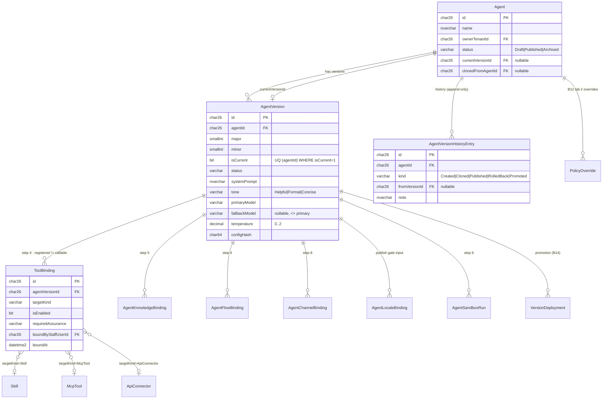
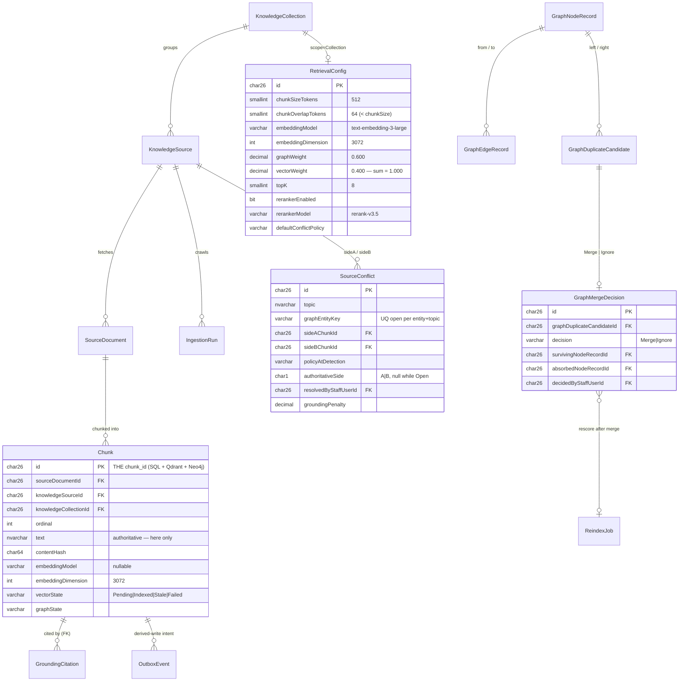
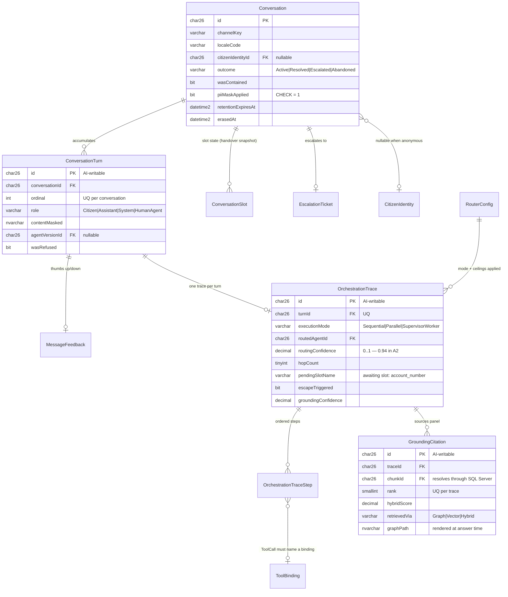
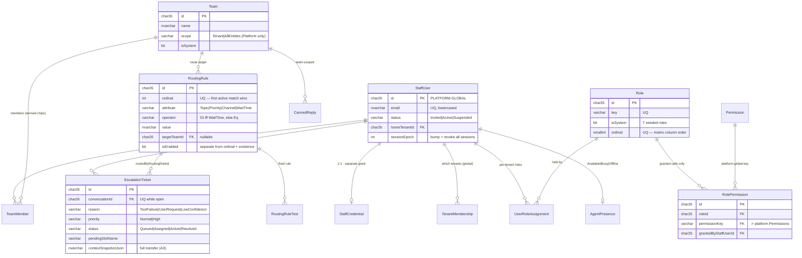
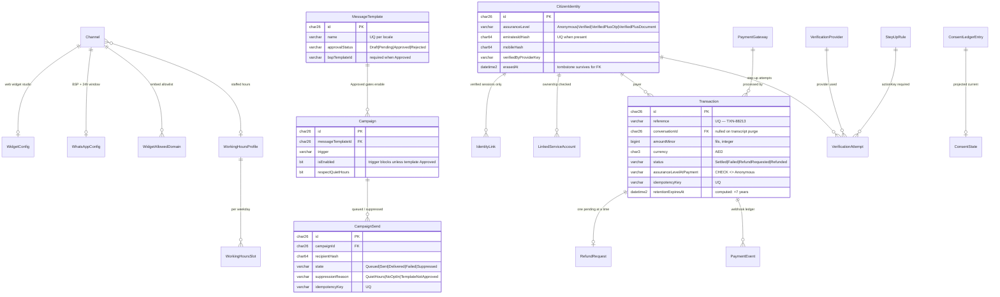
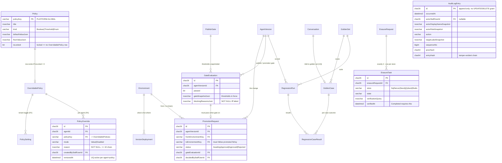

# SHJ3 — Data Model

> Status: **Accepted** · Last updated: 2026-09-08
> Binding. Derived from [`SHJ3-wireframes-guide.md`](./SHJ3-wireframes-guide.md) (the functional baseline), [`architecture.md`](./architecture.md) §5–§6, and [ADR-0002](./adr/0002-schema-per-tenant-isolation.md), [ADR-0003](./adr/0003-polyglot-persistence.md), [ADR-0005](./adr/0005-prisma-owns-schema-sqlalchemy-reads.md), [ADR-0007](./adr/0007-design-system-and-runtime-theming.md).
> Every entity below traces to a wireframe screen reference (`B6 tab 3`) or to an ADR. Where the wireframe is silent, a decision is made and marked **[ASSUMPTION]**.

---

## 1. Purpose & conventions

This document defines the complete persistence model across the four stores. It is the follow-up artefact that ADR-0002, ADR-0003 and ADR-0005 each name explicitly: which tables are per-tenant and which are platform-global, the `chunk_id` contract that joins three stores, the outbox table, and the three table groups `shj3-ai` may write.

### 1.1 Naming

One convention, applied everywhere. The relational store is SQL Server and the ADR-0002 example already fixed the table half (`sewa.Agents`), so that half is not open.

| Element | Convention | Example |
|---|---|---|
| Schema | lowercase tenant slug, or the reserved `platform` | `sewa`, `customs`, `platform` |
| Table | **PascalCase, plural** | `AgentVersions`, `AuditLogEntries` |
| Column | **camelCase, singular** | `ownerTenantId`, `createdAt`, `isCurrent` |
| Primary key column | always `id` | `id CHAR(26)` |
| Foreign key column | `<referencedEntityCamel>Id` | `agentVersionId`, `goldenSetId` |
| Boolean column | `is…` / `has…` / `…Enabled` prefix or suffix, never bare adjectives | `isCurrent`, `optInRequired` |
| Timestamp column | `…At` suffix, always UTC | `publishedAt`, `lastCrawledAt` |
| Index | `IX_<Table>_<cols>` | `IX_Chunks_sourceId_vectorState` |
| Unique index | `UQ_<Table>_<cols>` | `UQ_AgentVersions_agentId_current` |
| Check constraint | `CK_<Table>_<rule>` | `CK_RetrievalConfigs_weightsSumToOne` |
| Foreign key | `FK_<Table>_<Referenced>` | `FK_PolicyOverrides_OverridablePolicies` |
| Trigger | `TR_<Table>_<rule>` | `TR_AuditLogEntries_blockMutation` |

**Why camelCase columns against PascalCase tables.** Table names surface in DBA and ops contexts — migration SQL, grants, `sys.tables` queries, the per-tenant schema listing — and ADR-0002 already committed to PascalCase there. Column names surface almost exclusively inside generated code: TypeScript from Prisma and Python from the generation step in ADR-0005 §3. Choosing camelCase columns means Prisma model fields need **no `@map` directives** and the generated SQLAlchemy attributes can mirror the column name character-for-character. Every `@map` is a hand-maintained mapping, and a hand-maintained mapping is a drift vector in a project whose pre-commit hook exists specifically to prove no drift. Zero mappings is therefore not a style preference; it is what makes the drift check trivially total.

Consequence, stated so nobody is surprised: SQL written by hand (migration escape hatches, reconciliation queries, DBA scripts) must quote camelCase columns as `[ownerTenantId]` under a case-insensitive collation. Accepted.

### 1.2 Identifier strategy

**ULID, stored as `CHAR(26)` with collation `Latin1_General_100_BIN2`, generated client-side in both runtimes, clustered primary key.**

```prisma
model Agent {
  id String @id @db.Char(26)   // ULID, Crockford base32, lexicographically sortable
  // …
}
```

Justification, against the two alternatives:

| Option | Verdict |
|---|---|
| `INT IDENTITY` | **Rejected.** With schema-per-tenant the same logical row exists as id 7 in `sewa` and id 7 in `customs`. Any cross-schema artefact — the platform audit log, a cross-tenant analytics rollup (ADR-0002 escape hatch 2), an export handed to an entity admin, a support ticket quoting an id — becomes ambiguous without also carrying the tenant. Identity values also cannot survive the ADR-0002 "Positive" consequence of migrating a schema to its own database. And they leak volume: a sequential agent id tells an entity admin how many agents every other tenant has. |
| `UNIQUEIDENTIFIER` + UUIDv7 | **Rejected.** SQL Server compares `uniqueidentifier` in a mixed-endian byte order that scrambles UUIDv7's time prefix, so the property we wanted UUIDv7 for — monotonic insert into a clustered index — is destroyed the moment the column is the clustering key. Storing UUIDv7 as text instead works, but then it is 36 characters with hyphens and mixed case, and offers nothing ULID does not. |
| **ULID as `CHAR(26)`** | **Chosen.** Sorts correctly as a *string*, which is how SQL Server will actually compare it, so the clustered index takes monotonic appends and does not fragment — and it must not fragment, because index maintenance now runs N times, once per tenant schema. Globally unique, so ids are portable across schemas, across the SQL→Neo4j→Qdrant join, and into exports. Generated in application code, so a write needs no round-trip and no `NEWSEQUENTIALID()` default — which matters because `shj3-ai` writes turns and traces and must be able to construct the id before the insert in order to stream a turn id to the client. 26 bytes fixed, `BIN2` collation for byte comparison. |

No type prefix inside the column (`agt_…`); the table already types the row. API surfaces expose the bare ULID.

**Deterministic ids where a natural key exists.** Four tables use a stable string key instead of a ULID, because the value is code-referenced and must be identical in every tenant schema and in every environment: `platform.Permissions.key` (the 8 permissions of B9 tab 3), `platform.Policies.policyKey` (B12 tab 1), `platform.Environments.key` (B14 tab 1), `platform.Locales.code` (BCP-47, B10 tab 5). These are `VARCHAR(64)` / `VARCHAR(16)` primary keys. Code that references `'publish_agents'` or `'refuse_below_grounding'` must reference something legible, and a ULID in source code is a bug waiting to be pasted wrong.

### 1.3 Timestamps

| Column | Type | Rule |
|---|---|---|
| `createdAt` | `DATETIME2(3) NOT NULL` | Set by the application at insert. No `GETUTCDATE()` default — see below. |
| `updatedAt` | `DATETIME2(3) NOT NULL` | Set by the application on every update. Prisma `@updatedAt`. |
| `deletedAt` | `DATETIME2(3) NULL` | Soft-delete marker. `NULL` means live. |
| any other `…At` | `DATETIME2(3)` | Domain event time. |

- **Everything is UTC.** `DATETIME2` rather than `DATETIMEOFFSET`: the offset would be `+00:00` on every row in the system, costing 2 bytes and inviting someone to store a local time in it "just this once". The rule is enforced in one place — the data-access layer serialises only UTC instants — and the `…At` suffix is the reminder.
- **Millisecond precision (`(3)`).** Sufficient for audit ordering and cheaper than the default `(7)`. Where ordering must be *total* rather than merely near-total, ordering is by `(occurredAt, id)` — and because the id is a ULID, that tiebreak is itself time-ordered.
- **No database-side default.** With two runtimes and a clock-sensitive audit log, having some rows timestamped by the app and some by the server is a source of unexplainable skew. One clock source: the application.
- **Wall-clock business data is not a timestamp.** Working hours (B10 tab 1, `Sun–Thu 08:00–20:00`) and quiet hours (B10 tab 4, `21:00–07:00`) are `TIME(0)` plus an IANA zone column defaulting to `Asia/Dubai`. Converting them to UTC at rest would silently break across a DST boundary in any tenant that ever operates outside the Gulf, and would make the admin screen display something other than what was typed.

### 1.4 Soft-delete policy

Soft delete is not applied uniformly, because uniform soft delete means every query in the system carries a filter that someone will eventually forget.

**The rule: a row gets `deletedAt` if and only if a historical record or an audit entry can point at it.** Otherwise it is hard-deleted.

| Behaviour | Entities | Why |
|---|---|---|
| **Soft delete** (`deletedAt`) | `Agents`, `AgentVersions`, `Flows`, `FlowVersions`, `Skills`, `McpServers`, `McpTools` (`removedAt`), `ApiConnectors`, `Roles`, `Teams`, `StaffUsers`, `KnowledgeSources` (`removedAt`), `KnowledgeCollections`, `GoldenSets`, `GoldenCases`, `CannedReplies`, `MessageTemplates`, `Skins`, `TokenSets` | A conversation turn references an `agentVersionId`; a regression run references a `goldenCaseId`; an audit entry references a `roleId`. Hard-deleting the parent turns a historical record into a dangling reference, and B14 tab 2's log is required to remain intelligible forever. |
| **Status transition, not deletion** | `StaffUsers.status` = `Invited`/`Active`/`Suspended` (B9 tab 1), `Agents.status` = `Draft`/`Published`/`Archived` (B2), `Channels.state` = `Live`/`Disabled` (B10 tab 1) | The wireframe models these as reversible states, not removals. B2's **Archive** "removes the agent from the registry" — that is a status filter, not a delete, because B14 tab 1 still counts versions per environment. |
| **Hard delete** | `RoutingRules`, `WidgetAllowedDomains`, `WorkingHoursSlots`, `AgentWizardDrafts`, `TeamMembers`, `RolePermissions`, `UserRoleAssignments`, `AgentKnowledgeBindings`/`FlowBindings`/`ChannelBindings`/`LocaleBindings`, `ToolBindings`, `FlowNodes`, `FlowEdges`, `PolicySettings` | Configuration leaves and join rows. Nothing historical points at them: the audit entry records the *before/after* state as JSON, not a foreign key, precisely so that these can be deleted cleanly. `RoutingRules` is the load-bearing case — B8's **Delete** must actually remove the rule, because a soft-deleted rule that still occupies an ordinal would silently change routing precedence. |
| **Never deleted** | `AuditLogEntries`, `PlatformAuditLogEntries`, `Transactions`, `PaymentEvents`, `ConsentLedgerEntries`, `AgentVersionHistoryEntries`, `CircuitBreakerEvents`, `VerificationAttempts` | Append-only. §10 covers the two legitimate expiry paths (retention sweep, erasure) and the statutory carve-out that exempts `Transactions` from both for 7 years. |
| **Cascade-deleted with parent** | `ConversationTurns`, `MessageFeedback`, `OrchestrationTraces`, `OrchestrationTraceSteps`, `GroundingCitations`, `ConversationSlots` | Deleted only by a retention sweep or an erasure request, always with the parent `Conversation`, always as a set. `ON DELETE CASCADE` on the conversation FK. |

Soft-deleted rows are excluded by the repository adapters, not by callers. A Prisma extension applies `where: { deletedAt: null }` to every model that declares the field, and a repository that needs deleted rows (the audit-log renderer, the retention sweep) asks for them explicitly through a differently-named method. There is no `findMany` on a soft-deletable model that returns deleted rows by accident.

### 1.5 Enum handling

**Prisma does not support `enum` on SQL Server, and does not support `Json` on SQL Server.** Both facts shape the model, so both are handled once, mechanically, rather than worked around per table.

Enums live in one file and are emitted three ways:

```
packages/contracts/src/enums.ts        ← the single source
  ├─▶ TypeScript union types + const arrays   (consumed by Prisma models, Zod schemas, UI)
  ├─▶ CHECK constraint SQL                     (emitted into the Prisma migration)
  └─▶ Python StrEnum                           (emitted into the generated SQLAlchemy models)
```

- Column type is `VARCHAR(32)` (ASCII, `BIN2`) with a generated `CK_<Table>_<column>` check constraint listing the permitted values. The CHECK is written into the migration file as hand-authored SQL — sanctioned by ADR-0005's consequence *"where a feature is unavailable, the migration carries hand-written SQL in the migration file — still owned by Prisma's history."*
- The same generator emits the Zod enum used by React Hook Form (architecture §9) and the Python `StrEnum`, so a value added in one place cannot be missing in another. The pre-commit drift check (ADR-0005 §4) covers this generator too.

**Closed set → enum. Open set → table.** The discriminator is whether an administrator can add a member from inside the product.

| Kind | Examples | Storage |
|---|---|---|
| Closed, code-relevant | execution mode (`Sequential`/`Parallel`/`SupervisorWorker`, B4), node type (`Message`/`Question`/`ToolCall`/`Handover`/`Condition`, B7), assurance level (B11 tab 2), source type (B6 tab 1), template approval status (B10 tab 3) | Enum + CHECK. Adding a member is a code change *and* a migration, which is correct — a new flow node type needs an executor. |
| Open, admin-editable | roles (B9 tab 3 **+ Add custom role**), teams, locales, skills, canned replies, skins | Table with rows. |
| Closed but referenced by key | the 9 permissions (B9 tab 3 — 8 in the original wireframe; `appearance:manage` was added by the theming backend wave), the 5 global policies (B12 tab 1), the 3 environments (B14 tab 1) | **Platform-global table with a `VARCHAR` primary key**, seeded by migration or a dedicated seed script (`Permissions` specifically: `pnpm db:seed:iam`, B-2 — nothing seeded it before). Not an enum, because rows in a table can be foreign-keyed to — and §3.4 shows a foreign key doing real enforcement work that a CHECK constraint cannot do. |

**JSON columns** are `NVARCHAR(MAX)` with `CK_<Table>_<col>_isJson` asserting `ISJSON([col]) = 1`. JSON is used deliberately and narrowly — for tool input/output schemas, audit before/after snapshots, theme token sets, wizard draft state, and gate evaluation reasons — never for anything that is filtered, joined, or reported on. Anything queried gets a column.

**Filtered unique indexes** (`WHERE …`) are used heavily below to encode business rules. Prisma cannot express them, so each is hand-written SQL inside the owning migration. Every one is named and listed in §4 so they are auditable as a set.

---

## 2. Store map

Four stores, one role each, per ADR-0003. The "must not hold" column is the operative half: it is what prevents the same fact from living in two places and disagreeing.

| Store | Holds | Must **NOT** hold | Isolation unit | Written by | Backed up |
|---|---|---|---|---|---|
| **SQL Server** | System of record. All configuration, all records, all audit, all tenant metadata. Authoritative chunk **text**. Outbox. | Embeddings. Graph edges as a traversal structure. Ephemeral session or breaker state. Secrets (env only, architecture §10). | Schema per tenant (`sewa.Agents`) | `shj3-web` + `shj3-worker` via Prisma; `shj3-ai` on exactly 3 table groups (§3.6) | **Yes** |
| **Neo4j** | Knowledge graph: entity nodes (`Service`, `Provider`, `Fee`, `Document`, `Channel`) and their relationships. Chunk **reference** nodes carrying an id only. | Chunk text. Embeddings. Configuration. Anything that is not an entity, an edge, or an identifier. | **Logical partition inside one shared Community database** — tenant label `:Tenant_sewa` *and* `tenant_id` property on every node, behind a mandatory query builder (ADR-0009) | `shj3-ai` only | **Optional** — a backup only shortens recovery; re-index is the recovery path (ADR-0009) |
| **Qdrant** | Chunk embeddings (3072-dim) plus the minimal payload needed to *filter* and to *identify* a citation. | Authoritative source content — including any excerpt or title. Configuration. Anything a citation is rendered from. | Collection per tenant (`sewa_knowledge`) | `shj3-ai` only | **No** — rebuilt by re-index |
| **Redis** | Ephemeral only: chat session state, circuit-breaker live state, rate-limit counters, campaign queue, idempotency keys, staff sessions, config cache, presence heartbeats, job locks. | Anything whose loss is not acceptable. No durable record, ever. | Key prefix (`sewa:…`) | both runtimes | **No** — by decision, not oversight (ADR-0003 derived rule 2) |

Three consequences worth stating in full because they are load-bearing everywhere below:

1. **Neo4j and Qdrant are derived indexes.** Both must be fully rebuildable from SQL Server plus the original source documents by running re-index (ADR-0003 derived rule 1). Every fact placed in either store must therefore have an antecedent in SQL Server. This is why §4.8 includes `GraphNodeRecords`, `GraphEdgeRecords` and `GraphMergeDecisions` in SQL Server: B6 tab 2's **+ Add node** and **Merge** are *authored* decisions, and a decision that exists only in a derived store is a decision that a rebuild destroys.
2. **Qdrant holds no renderable content.** Not even a title or a preview. A citation is resolved by taking the `chunk_id` returned by the vector search and reading the row from SQL Server (§5). A stale payload can then produce a *wrong ranking*, which is a quality bug, but it can never produce a *fabricated citation*, which would be a correctness and trust failure in a government service.
3. **Neither derived store is a dependency of a conversation.** RISK-003 resolved in the negative — there is no Neo4j Enterprise licence — so the graph runs as a single Community instance with no clustering and therefore no HA (ADR-0009). Because it is derived, the store map absorbs that: graph unavailable → retrieval **degrades to vector-only from Qdrant**, with the degradation recorded on the trace and grounding confidence dropping accordingly, which correctly makes refusal and escalation *more* likely rather than serving an ungrounded answer; graph lost or corrupted → **rebuild by re-index** (B6), per tenant or wholesale. A citizen conversation must never fail because the graph is down. This is why the Neo4j "Backed up" cell reads *optional* rather than *yes*: a restore is merely faster than a re-index, so backup left the critical path.

---

## 3. Tenancy keys

The critical section. A tenant is a Sharjah government entity — the wireframe seeds four: **SEWA**, **Sharjah Customs**, **Sharjah Libraries**, and **Platform**, which has scope over all entities (B9 tab 2, ADR-0002).

### 3.1 Two SQL schema classes

| Class | Schema | Contents | Count |
|---|---|---|---|
| **Platform-global** | `platform` — a **reserved slug no tenant may claim** | Tenant registry, staff accounts and credentials, code-referenced key tables, the platform audit log, migration status, the vector-collection registry, system-default theme, the user guide | 1 schema, 22 tables |
| **Per-tenant** | the tenant's validated slug: `sewa`, `customs`, `libraries`, `sharjah_platform` | Everything else, replicated structurally into every tenant schema | N schemas, 110 tables each |

Note the naming care: the **Platform tenant** is a tenant like any other and gets a normal tenant schema, slug **`sharjah_platform`**. It is *not* the `platform` global schema. Conflating them is the mistake this naming exists to prevent — Platform-owned agents (B2's General FAQ Agent, owner `Platform`) and Platform-owned knowledge sources (B6 tab 1's Utilities providers directory, owner `Platform`) are tenant data and live in `sharjah_platform`, under tenant-scoped access control, exactly like SEWA's.

Reserved slugs, rejected at registration: `platform`, `dbo`, `sys`, `guest`, `INFORMATION_SCHEMA`, `db_owner` and the remaining fixed database roles. Slug pattern `^[a-z][a-z0-9_]{2,29}$`, validated at the registry and again before any slug reaches a connection string, a collection name **or a Cypher label** (ADR-0002 enforcement rule 4, which also closes the injection path). This pattern is deliberately *stricter* than ADR-0009's `^[a-z][a-z0-9_]{1,30}$` and therefore satisfies it: the graph tenant label is `Tenant_<slug>` built from a registry-derived slug that has already matched the pattern, never from interpolated input, which is what closes the label-interpolation injection path that logical graph partitioning would otherwise open (ADR-0009 rule 3).

### 3.2 What is platform-global, and why each one has to be

Getting this list wrong breaks isolation in one direction or breaks the product in the other. Each entry is justified individually, because "it felt shared" is not a justification.

| # | Global table(s) | Why it cannot be per-tenant |
|---|---|---|
| 1 | `platform.Tenants` | **Chicken-and-egg.** This table is what the tenant resolver reads to turn an authenticated principal into a schema name, a Neo4j **tenant label** (ADR-0009 — a database name until RISK-003 resolved negative), a Qdrant collection name and a Redis prefix. A registry stored inside a tenant schema could only be found by already knowing the schema. It is also the only place the four isolation-unit names are decided, and ADR-0002 rule 4 requires them to be *derived from the registry*, never interpolated from input. |
| 2 | `platform.TenantProvisioningSteps` | Tracks the four-store provisioning of a tenant that, mid-flight, has no usable schema. ADR-0002 rule 6 makes provisioning atomic: "a half-provisioned tenant is the one state where isolation reasoning breaks down." The record of that atomicity must survive a rollback that drops the tenant schema. |
| 3 | `platform.TenantMigrations`, `platform.MigrationRuns` | ADR-0005 §2 requires a per-tenant orchestrator that is **resumable after partial failure**. It must read the applied-migration state for a schema that may contain zero tables, or that a previous run left half-migrated. Status inside the schema being migrated is unreadable in exactly the failure case it exists for. |
| 4 | `platform.StaffUsers` | **Authentication happens before the tenant is known.** A staff member logs in with an email and a password (architecture §11); the system must find that account without a tenant context. Email is also globally unique across the backoffice — B9 tab 1 shows `@shj.ae` addresses across four teams — and a per-tenant users table cannot enforce that. A user is also *movable* between entities (B9 tab 1 **Edit** reassigns team, and B9's cross-module wiring updates tab 2 live); moving a row between schemas is a migration, whereas moving a membership row is an update. |
| 5 | `platform.StaffCredentials` | Split from `StaffUsers` as a separate table so it carries its own, narrower grant. Argon2id hashes, TOTP secrets and lockout counters are readable by the auth adapter and by nothing else. Keeping them in a separate table means a per-tenant export or an entity-admin-facing user listing physically cannot include them, rather than relying on a column projection someone must remember to write. |
| 6 | `platform.TenantMemberships` | The set of tenants a principal may resolve into. Read at login, i.e. pre-tenant-binding, to decide which schema the session may bind to. If this lived per-tenant, deciding whether a user may enter tenant B would require reading tenant B's schema, which is the very thing being authorised. |
| 7 | `platform.Permissions` | The 9 permissions of B9 tab 3 (`domain/permissions.ts`'s `PERMISSIONS`, colon-form keys) are **code-defined**: `users:manage` is enforced by a guard in a route handler or Server Action, not by anything a tenant can edit. A tenant cannot invent a permission, because a permission with no enforcement point is a lie in a matrix. `Roles` and `RolePermissions` *are* per-tenant, which is what makes B9's **+ Add custom role** work. |
| 8 | `platform.Policies`, `platform.OverridablePolicies` | B12 tab 1 is explicit: locked policies "cannot be toggled or overridden by any role" and are "the platform floor" that is "not negotiable per entity." A floor that each tenant stores its own copy of is not a floor. §3.4 shows the foreign key that turns this sentence into a database constraint. |
| 9 | `platform.Environments` | B14 tab 1's `Development → UAT → Production` chain mirrors the Kubernetes namespaces of architecture §12. It is a property of the deployment topology, identical for every tenant, and the symmetry between the in-product promotion flow and the pipeline is stated there as intentional. A tenant inventing a fourth environment would break that symmetry. The per-tenant half — which version sits in which environment — is `VersionDeployments`. |
| 10 | `platform.Locales` | The locale *catalogue* (BCP-47 code, English/native name, LTR/RTL direction, default TTS voice) is a reference list. Direction in particular is a property of the language, not of a tenant's opinion of it. The per-tenant half — enabled, translated %, fallback flag, voice override — is `LocaleSettings`, which is where B10 tab 5's 82% Arabic figure lives. |
| 11 | `platform.PlatformAuditLogEntries` | See §3.3. Some audited actions have no tenant to belong to, and one class of audited action **outlives the tenant schema it concerns**. |
| 12 | `platform.VectorCollectionRegistry` | Records, per tenant collection, which embedding model and dimension produced it (§7). Read by the provisioning path and by the re-index orchestrator, both of which operate on collections whose tenant may be mid-provision or mid-rebuild. Also the one place a *mixed-model collection* is detectable platform-wide. |
| 13 | `platform.TokenSets` (kind = `SystemDefault`), `platform.Skins` (the two shipped skins) | ADR-0007's resolution order is `user preference → tenant theme → system default`. The system default is the terminal fallback and must exist before any tenant does — it is what the tenant-provisioning screen itself renders with. Tenant skins and `TenantBranding` are per-tenant, which is what ADR-0002 means by "per-tenant branding cannot bleed, because tenant theme rows live in the tenant's own schema." |
| 14 | `platform.GuideSections`, `GuideEntries`, `GuideScreenshots`, `GuideAssets`, `GuideEntryTranslations`, `GuideCoverageChecks` | The Phase F user guide documents **the application**, and the application is one release shared by every tenant. A per-tenant copy would mean N screenshot sets to keep current against one UI, and the Phase F maintenance rule ("any PR that adds or changes a page must add or update its user-guide entry and screenshot in the same PR") would become N× work per PR. Per-tenant guide overrides are **not supported** — **[ASSUMPTION]**; the wireframe does not raise them, and adding them later is additive. |

Everything not in that table is **per-tenant**. The catalogue in §4 carries an explicit Scope column for every entity, so there is no entity whose class must be inferred.

### 3.3 The audit log is deliberately in two places

B14 tab 2 requires an immutable change record. It is split, and the split is not arbitrary:

| Log | Scope | Contents |
|---|---|---|
| `<tenant>.AuditLogEntries` | One tenant | Config changes, publishes, promotions, permission grants within the tenant, data exports — everything B14 tab 2 lists. Visible to that tenant's Entity Admins and Super Admin. |
| `platform.PlatformAuditLogEntries` | Cross-tenant / pre-tenant | Tenant provisioning and deprovisioning, migration runs, staff account and credential lifecycle, cross-tenant analytics rollups (ADR-0002's two audited escape hatches), locked-policy definition changes, **and the completion record of every erasure request**. |

Three reasons the platform log has to exist separately:

1. **A cross-tenant action has no single tenant schema to belong to.** Writing "Ahmed Saeed ran a cross-tenant rollup over SEWA, Customs and Libraries" into one of the three schemas either hides it from the other two or discloses the others' involvement to each. Neither is acceptable.
2. **Authentication events precede tenant binding.** A failed login, a password change, a TOTP re-enrolment: at the moment they occur there is no bound tenant.
3. **The erasure record must outlive the data.** §10 defines right-to-be-forgotten as dropping a SQL schema, a Qdrant collection and a Redis prefix, plus a proven batched delete of the tenant's graph partition (ADR-0009). If the proof of completeness were written into the tenant schema, the last step of the operation would destroy the evidence that the operation was performed. The proof therefore goes to `platform.PlatformAuditLogEntries` and `platform.ErasureRequests` — the only entities in the system whose location is chosen by what survives a drop.

Both tables are append-only by grant and by trigger; the mechanism is in §4.13.

### 3.4 A foreign key that enforces a business rule across the tenancy boundary

SQL Server schemas live inside one database, so a per-tenant table can carry a foreign key into `platform`. That is used once, for the single strongest rule in B12:

> **[rule]** Locked policies cannot be toggled or overridden by any role. Attempting to toggle them does nothing — the platform floor is not negotiable per entity. (B12 tab 1)

Rather than checking `locked` in application code — five screens and two runtimes could each forget — the *set of policies that may be overridden* is materialised as its own platform table, and the per-tenant tables foreign-key into it:

```sql
-- platform schema, seeded and maintained by migration
CREATE TABLE platform.Policies (
  policyKey        VARCHAR(64)   NOT NULL CONSTRAINT PK_Policies PRIMARY KEY,
  title            NVARCHAR(200) NOT NULL,
  detail           NVARCHAR(1000) NOT NULL,
  kind             VARCHAR(32)   NOT NULL,   -- Boolean | Threshold | Enum
  defaultValueJson NVARCHAR(MAX) NOT NULL,
  floorValueJson   NVARCHAR(MAX) NULL,       -- strictest value an override may take
  isLocked         BIT           NOT NULL,
  appliesTo        VARCHAR(32)   NOT NULL,   -- Runtime | Storage
  createdAt        DATETIME2(3)  NOT NULL,
  updatedAt        DATETIME2(3)  NOT NULL,
  CONSTRAINT CK_Policies_kind CHECK (kind IN ('Boolean','Threshold','Enum')),
  CONSTRAINT CK_Policies_defaultValueJson_isJson CHECK (ISJSON(defaultValueJson) = 1)
);

-- Contains a row ONLY for policies with isLocked = 0. Maintained by TR_Policies_syncOverridable.
CREATE TABLE platform.OverridablePolicies (
  policyKey VARCHAR(64) NOT NULL CONSTRAINT PK_OverridablePolicies PRIMARY KEY,
  CONSTRAINT FK_OverridablePolicies_Policies FOREIGN KEY (policyKey)
    REFERENCES platform.Policies(policyKey)
);
```

Every tenant's `PolicySettings` (the tenant-level toggle) and `PolicyOverrides` (the per-agent override of B12 tab 2) reference `platform.OverridablePolicies`, **not** `platform.Policies`:

```sql
CONSTRAINT FK_PolicySettings_OverridablePolicies FOREIGN KEY (policyKey)
  REFERENCES platform.OverridablePolicies(policyKey)
```

The result: an attempt to store a tenant toggle or a per-agent override for `mask_pii_in_transcripts` or `prompt_injection_filter` — B12's two locked policies — fails at the database with a foreign-key violation. There is no row to point at. Super Admin included; a grant cannot conjure a parent row. And because the effective-policy resolver computes `COALESCE(override, tenantSetting, platformDefault)` over these tables, a locked policy resolves to its platform default by construction rather than by a branch someone could invert. This is what architecture §7 means when it says steps 1 and 5 of the runtime pipeline are "structural, not configurable."

`TR_Policies_syncOverridable` keeps the subset table honest: inserting a policy with `isLocked = 0` inserts the key, flipping `isLocked` to 1 deletes it (cascading the tenant rows away, which is the correct behaviour — locking a policy retracts every existing override), and flipping to 0 re-inserts it.

### 3.5 Binding a Prisma client to a schema at request scope

**This is the implemented mechanism (ADR-0011), confirmed against a live database.** The two-schema-file split below was this section's original framing; the implementation that first shipped diverged from it into a single `prisma/schema.prisma` file using `multiSchema` for both `platform` and `tenant_template`, which silently broke tenant-scoped query routing (ADR-0010 found and confirmed the defect; ADR-0011 traced it to `multiSchema` specifically and restored this section's original two-file design — see either ADR for the live-database evidence). The illustrative code below predates both ADRs and is simplified pseudocode, not a literal transcription of `tenant-db.ts` (real file: `apps/web/src/modules/platform/adapters/outbound/sql/tenant-db.ts`; `getTenantDb()` is synchronous, not `Promise`-returning, and reads the already-validated slug from the bound `TenantContext` rather than re-querying the registry per call) — but its central claim, "two Prisma schemas, two generated clients, connection-string routing," is exactly what is implemented today.

Prisma has no way to template a schema name per query, and its `multiSchema` preview feature binds each model to one *statically named* schema — which is the opposite of what N tenant schemas need. The mechanism is therefore the connection, not the query.

**Two Prisma schemas, two generated clients:**

```
prisma/
├── platform/schema.prisma    → @prisma/client-platform   ONE instance, schema=platform
└── tenant/schema.prisma      → @prisma/client-tenant     N instances, schema=<slug>
```

The SQL Server connection URL carries a `schema` parameter, and Prisma uses it as the default schema for unqualified identifiers. A tenant client is therefore an ordinary `PrismaClient` whose datasource URL differs from its siblings in exactly one query-string value:

```ts
// modules/platform/infrastructure/tenant-db.ts — the ONLY file that constructs a tenant client.
const clients = new LRUCache<string, PrismaTenantClient>({ max: 32, dispose: c => c.$disconnect() });

/** Returns a Prisma client already bound to the caller's tenant schema. There is no other way in. */
export async function getTenantDb(): Promise<PrismaTenantClient> {
  const ctx = tenantContext.getStore();                 // AsyncLocalStorage, set by middleware
  if (!ctx) throw new NoTenantContextError();           // fail closed, never fall back
  const tenant = await tenantRegistry.requireActive(ctx.tenantId);  // validated slug from platform.Tenants
  return clients.get(tenant.slug) ?? clients.set(tenant.slug, new PrismaTenantClient({
    datasources: { db: { url: buildTenantUrl(tenant.sqlSchema) } },  // slug is registry-derived, never input
  })).get(tenant.slug)!;
}
```

The sequence per request, matching architecture §5 and ADR-0002 rules 1–3:

1. Middleware resolves the tenant **from the authenticated principal only** — never a header, query param, route param or body. A caller cannot name their own tenant.
2. The tenant id is bound to the request scope: `AsyncLocalStorage` in Node, `contextvars` in Python.
3. The data-access layer reads that context and hands back store handles already scoped. Tenant identity is never an argument threaded through application code, because an argument can be passed wrong.
4. The slug is looked up in the registry and validated against the slug pattern before it reaches a connection string.

**Why no unscoped client is exported.** `getPrismaClient()` does not exist. Nor does `prisma`, `neo4jDriver`, `qdrantClient` or `redis`. The module surface offers only `getTenantDb()`, `getTenantGraph()`, `getTenantVectors()`, `getTenantCache()`. The point is not that an unscoped client would be dangerous if misused — it is that **an application-layer author has no vocabulary in which to express a cross-tenant query**. A use case cannot accidentally omit a tenant filter, because there is no filter to omit; isolation is a property of the handle it was given. Isolation lives in the type system and the module structure, not in developer discipline. The barrel file exports the accessor functions and the eslint boundaries rule forbids deep-importing the construction module.

`getPlatformDb()` does exist — the platform module needs it for provisioning and migration — and it is guarded three ways: it is not re-exported from the module barrel, calling it requires the `Super Admin` permission at the inbound adapter, and every call site writes to `platform.PlatformAuditLogEntries`. Those are ADR-0002's two deliberate escape hatches (tenant provisioning, cross-tenant analytics rollups) and nothing else may use it.

Python is symmetrical: `get_tenant_session()` returns an `AsyncSession` whose engine was built with the tenant schema, `get_tenant_graph()` returns a **tenant-aware Cypher builder** bound to the request tenant, `get_tenant_vectors()` returns a wrapper whose collection name is fixed at construction, `get_tenant_cache()` returns a key-prefixing wrapper. The raw `AsyncEngine`, `Driver`, `QdrantClient` and `Redis` objects are module-private in every case.

**The graph handle is the one that changed, and the change is worth stating precisely.** Under ADR-0002 `get_tenant_graph()` returned a session against `neo4j://…/<slug>`, so isolation was a property of the *connection* and no query could reach another tenant whatever Cypher was sent. ADR-0009 removes that: there is one Community database, `neo4j`, shared by every tenant. So `get_tenant_graph()` now returns a builder that emits both encodings — the `:Tenant_<slug>` label and the `tenant_id` predicate — into every pattern it constructs, reading the slug from `contextvars` and never from an argument. The intent is identical to `getTenantDb()` (an application-layer author has no vocabulary in which to express a cross-tenant query), but the scoping now lives in the **builder** rather than in the connection string:

1. **No raw Cypher outside `adapters/outbound/graph/`.** A static check fails the build if a Cypher string literal — `MATCH`, `MERGE`, `CREATE`, `CALL db.` — appears anywhere else. With no CI (ADR-0008) it runs in pre-commit and in `verify`, alongside the drift checks of §11.4. This is mechanical, so the guarantee does not decay under delivery pressure the way a review convention would.
2. **The write path asserts agreement.** Every write sets label and property together through the builder, and a reconciliation query (§9.3) asserts that no node exists whose label set and `tenant_id` disagree, that none exists with neither, and that no relationship spans two tenants.
3. **Defence in depth on the way out.** Retrieval results are re-filtered against the request tenant *after* they leave the graph and before they can ground an answer — the same redundant-filter pattern §7.3 already applies to Qdrant payloads. A leak must therefore defeat the label, the predicate **and** the post-filter.

Community also has **no RBAC**, so — unlike SQL Server, where ADR-0005's narrow grant (§3.6) makes an AI-service write mistake fail at the database — there is no database-level second line for the graph. Three of four stores are defended by infrastructure; the graph is defended by a builder, a static check and a post-filter. That is a genuine weakening rather than an equivalent substitution, and it is carried as standing **RISK-024** (§14.1), not as an open question.

### 3.6 What `shj3-ai` may write

ADR-0005 §5 grants `shj3-ai` `SELECT` on everything and `INSERT`/`UPDATE` on exactly three table groups. Enumerated concretely, per tenant schema:

| Group | Tables | Grant |
|---|---|---|
| **1 · Conversation turns** | `ConversationTurns` | `INSERT`, `UPDATE` |
| **2 · Orchestration traces** | `OrchestrationTraces`, `OrchestrationTraceSteps`, `GroundingCitations` | `INSERT`, `UPDATE` |
| **3 · Re-index job status** | `ReindexJobs`, `IngestionRuns` | `INSERT`, `UPDATE` |

```sql
CREATE USER shj3_ai FOR LOGIN shj3_ai WITH DEFAULT_SCHEMA = [sewa];
GRANT SELECT ON SCHEMA::[sewa] TO shj3_ai;
GRANT INSERT, UPDATE ON [sewa].[ConversationTurns]      TO shj3_ai;
GRANT INSERT, UPDATE ON [sewa].[OrchestrationTraces]    TO shj3_ai;
GRANT INSERT, UPDATE ON [sewa].[OrchestrationTraceSteps] TO shj3_ai;
GRANT INSERT, UPDATE ON [sewa].[GroundingCitations]     TO shj3_ai;
GRANT INSERT, UPDATE ON [sewa].[ReindexJobs]            TO shj3_ai;
GRANT INSERT, UPDATE ON [sewa].[IngestionRuns]          TO shj3_ai;
DENY  SELECT ON SCHEMA::[platform] TO shj3_ai;   -- credentials, registry: not the runtime's business
GRANT SELECT ON platform.Policies         TO shj3_ai;   -- effective-policy resolution needs the floor
GRANT SELECT ON platform.OverridablePolicies TO shj3_ai;
GRANT SELECT ON platform.Environments     TO shj3_ai;
GRANT SELECT ON platform.Locales          TO shj3_ai;
-- No DELETE anywhere. No INSERT/UPDATE on any other table. Code review is not the control; the grant is.
```

**This grant is a design constraint, not just a safety net, and it has a visible consequence.** The runtime needs some durable state that falls outside the three groups — the pending slot of A2 step 3, the durable escalation ticket of B8, a circuit-breaker transition observed by the runtime (B5 tab 4). None of those tables are AI-writable. Three resolutions, applied consistently:

| Runtime need | Resolution |
|---|---|
| Pending slot (`awaiting slot: account_number`, A2 step 3) | Live value in Redis; the *fact* of the pending slot is recorded on `OrchestrationTraces.pendingSlotName`, which **is** AI-writable. The durable `ConversationSlots` row is written by `shj3-web` when it creates the escalation ticket, which is the only moment the slot must survive process loss (A3: "the pending slot transfers"). |
| Escalation ticket (B8) | `shj3-ai` calls `shj3-web`'s internal API to raise the ticket. `handover` is a web module (architecture §3), so the ticket, its context snapshot and its routing decision are written by the code that owns them. |
| Circuit-breaker transition (B5 tab 4) | Live state in Redis, written by both runtimes (that is why breaker state is shared — "a breaker tripped on one pod is tripped on all"). `shj3-worker`, a web-runtime deployment, drains transitions into `CircuitBreakerEvents`. |
| Service health samples (B14 tab 3) | Same pattern: OpenTelemetry → `shj3-worker` → `ServiceHealthSamples`. |

The general rule, stated so it is not rediscovered per feature: **if the runtime needs to persist something outside the three groups, it goes through `shj3-web`'s API.** The grant is deliberately narrow, and widening it requires a new ADR.

---

## 4. Entity catalogue

132 SQL Server entities across the 17 modules of architecture §3, plus the outbox substrate. Every table carries a **Scope** column: `G` = platform-global (in `platform`), `T` = per-tenant (replicated into every tenant schema).

Every table also carries the five convention columns unless stated otherwise — `id CHAR(26)`, `createdAt`, `updatedAt`, and `deletedAt` where §1.4 assigns soft delete. They are omitted from the field lists below to keep the tables readable; only deviations are noted.

### 4.1 `platform` — tenancy substrate

| Entity | Scope | Purpose | Key fields | Constraints & indexes | Source |
|---|---|---|---|---|---|
| `Tenants` | G | The registry. One row per Sharjah government entity; the only place the four isolation-unit names are decided. | `slug VARCHAR(30) NN`, `displayName NVARCHAR(200) NN`, `entityKind VARCHAR(32) NN` (`GovernmentEntity`\|`PlatformOperator`), `sqlSchema VARCHAR(30) NN`, `neo4jTenantLabel VARCHAR(38) NN`, `qdrantCollection VARCHAR(63) NN`, `redisPrefix VARCHAR(30) NN`, `dataResidency VARCHAR(32) NN`, `status VARCHAR(24) NN`, `activatedAt NULL`, `suspendedAt NULL`, `deprovisionedAt NULL` | `UQ_Tenants_slug`; `UQ_Tenants_neo4jTenantLabel`; `UQ_Tenants_qdrantCollection`; `CK_Tenants_slugPattern CHECK (slug LIKE '[a-z][a-z0-9_]%' AND slug NOT IN ('platform','dbo','sys','guest'))`; `CK_Tenants_status CHECK (status IN ('Provisioning','Active','Suspended','Deprovisioning','Deprovisioned'))`; `CK_Tenants_derivedNames CHECK (sqlSchema = slug AND redisPrefix = slug AND neo4jTenantLabel = 'Tenant_' + slug)` — names are *derived*, not typed | ADR-0002; ADR-0009; B9 tab 2 entity scopes |
| `TenantProvisioningSteps` | G | Proves the four-store provisioning was atomic, or records which store failed. | `tenantId NN`, `store VARCHAR(16) NN` (`SqlServer`\|`Neo4j`\|`Qdrant`\|`Redis`), `state VARCHAR(16) NN`, `attemptCount INT NN`, `startedAt NULL`, `completedAt NULL`, `rolledBackAt NULL`, `lastError NVARCHAR(2000) NULL` | `UQ_TenantProvisioningSteps_tenantId_store` — exactly four rows per tenant; `TR_Tenants_activationRequiresFourSteps` blocks `status='Active'` unless all four are `Completed` | ADR-0002 rule 6 |
| `TenantMigrations` | G | Per-tenant migration status; makes the N× run resumable. | `tenantId NN`, `migrationName VARCHAR(200) NN`, `checksum CHAR(64) NN`, `state VARCHAR(16) NN` (`Pending`\|`Applied`\|`Failed`\|`Skipped`), `migrationRunId NULL`, `appliedAt NULL`, `durationMs INT NULL`, `error NVARCHAR(MAX) NULL` | `UQ_TenantMigrations_tenantId_migrationName`; `IX_TenantMigrations_state_tenantId`; `CK_TenantMigrations_appliedHasTime CHECK (state <> 'Applied' OR appliedAt IS NOT NULL)` | ADR-0005 §2 |
| `MigrationRuns` | G | One orchestration pass over the tenant registry. | `migrationNamesJson NN`, `initiatedByStaffUserId NN`, `state VARCHAR(16) NN`, `tenantsTotal INT NN`, `tenantsApplied INT NN`, `tenantsFailed INT NN`, `startedAt NN`, `finishedAt NULL`, `resumedFromRunId NULL` | `IX_MigrationRuns_state_startedAt`; `CK_MigrationRuns_json` | ADR-0005 §2 |
| `Environments` | G | The promotion chain, mirroring the K8s namespaces. | **PK `key VARCHAR(16)`** (`development`\|`uat`\|`production`), `displayName NN`, `ordinal TINYINT NN`, `promotesToKey NULL` (self-FK), `isLive BIT NN` | `UQ_Environments_ordinal`; `UQ_Environments_isLive WHERE isLive = 1` — exactly one live environment; `CK_Environments_noSelfPromotion CHECK (promotesToKey <> [key])`; `CK_Environments_terminalIsLive CHECK ((promotesToKey IS NULL) = (isLive = 1))` | B14 tab 1; architecture §12 |
| `Permissions` | G | The 9 code-enforced permissions (`domain/permissions.ts`'s `PERMISSIONS`). Seeded by `pnpm db:seed:iam` (B-2) — not a schema migration, and not seeded at all before B-2; not admin-editable either way. | **PK `key VARCHAR(64)`**, `displayName NN`, `moduleKey VARCHAR(32) NN`, `ordinal TINYINT NN`, `description NN` | `UQ_Permissions_ordinal` — fixes the column order of B9's matrix | B9 tab 3 |
| `Policies` | G | The B12 tab 1 catalogue including the `isLocked` platform floor. | see §3.4 | see §3.4 | B12 tab 1 |
| `OverridablePolicies` | G | The unlocked subset. Existence *is* the permission to override. | **PK `policyKey`** | `FK_OverridablePolicies_Policies`; maintained by `TR_Policies_syncOverridable` | B12 tab 1 `[rule]` |
| `Locales` | G | Locale reference: code, names, direction, default voice. | **PK `code VARCHAR(16)`** (BCP-47), `englishName NN`, `nativeName NN`, `direction VARCHAR(3) NN` (`LTR`\|`RTL`), `defaultVoiceName NULL`, `isEnabledPlatformWide BIT NN` | `CK_Locales_direction`; `CK_Locales_codePattern` | B10 tab 5 |
| `VectorCollectionRegistry` | G | Which embedding model and dimension produced each tenant collection. | `tenantId NN`, `collectionName VARCHAR(63) NN`, `aliasName VARCHAR(63) NN`, `embeddingModel VARCHAR(64) NN`, `embeddingDimension INT NN`, `distance VARCHAR(16) NN`, `pointCount BIGINT NN`, `lastFullReindexAt NULL`, `state VARCHAR(16) NN` (`Building`\|`Active`\|`Retiring`\|`Retired`) | `UQ_VectorCollectionRegistry_collectionName`; `UQ_VectorCollectionRegistry_tenantId_active WHERE state = 'Active'` — a tenant has exactly one live collection; `CK_…_dimension CHECK (embeddingDimension IN (1536, 3072))` | §7; ADR-0003 |
| `PlatformAuditLogEntries` | G | Cross-tenant, pre-tenant and post-tenant audit. Append-only. | as `<tenant>.AuditLogEntries` (§4.14) plus `tenantId NULL`, `tenantSlugSnapshot NVARCHAR(30) NULL` | Append-only by grant + `TR_PlatformAuditLogEntries_blockMutation`; hash chain `prevHash`/`entryHash`; clustered on `(occurredAt, id)` | §3.3; B14 tab 2 |
| `OutboxEvents` | T | Derived-store write intents, committed in the same transaction as the domain change. | §9 | §9 | ADR-0003 rule 4 |
| `ReconciliationRuns` | T | Drift detection and repair between SQL Server and the two derived stores. | §9 | §9 | ADR-0003 follow-up |

**`neo4jTenantLabel` replaces `neo4jDatabase`** (ADR-0009). The registry still decides all four isolation-unit names — that is ADR-0002 rule 4 and it is unchanged — but for the graph the unit is now a label inside one shared database rather than a database of its own. The column is `VARCHAR(38)` because `Tenant_` plus a 30-character slug is 37, and it is constrained to be derived from the slug so a label can never be typed in by hand. `TenantProvisioningSteps.store = 'Neo4j'` therefore now records *"created the tenant's graph constraints and per-label indexes"* rather than *"created the database"*, and its rollback is a batched delete of the label rather than a `DROP DATABASE`; the four-row-per-tenant shape and `TR_Tenants_activationRequiresFourSteps` are untouched, so provisioning atomicity (ADR-0002 rule 6) still reads the same.

`TenantProfiles` (T) is the one-row-per-schema mirror of the tenant's own registry entry: `tenantId`, `slug`, `displayName`, `isPlatformTenant BIT`, `dataResidency`. It exists so that per-tenant triggers and queries can read tenant facts without a cross-schema join, and so a tenant schema is self-describing if it is ever restored in isolation. **Created at provisioning time** (`SqlStoreProvisioner.create()`, closed in B-2 — no call site created this row before then, so `TR_Teams_crossEntityScope` could never legitimately admit an `AllEntities`-scoped team for *any* tenant, including B9 tab 2's own "Platform → All entities" sample row) and kept in sync thereafter by `TR_Tenants_syncProfiles`. `UQ_TenantProfiles_singleton CHECK (singletonKey = 1)`.

**Singleton pattern.** Several per-tenant tables hold exactly one configuration row (`RouterConfigs`, `PublishGates`, `PrivacyConfigs`, `IdentityStitchingConfigs`, `VerificationConfigs`, `ReceiptConfigs`, `QuietHoursConfigs`, `HandoverConfigs`, `TenantBrandings`, `TenantProfiles`). All use the same shape — a `singletonKey TINYINT NOT NULL` column with `CK_<Table>_singleton CHECK (singletonKey = 1)` and `UQ_<Table>_singleton UNIQUE (singletonKey)`. This is preferred over "just don't insert a second row": a second `RouterConfig` would make routing non-deterministic in a way no screen would reveal.

### 4.2 `iam` — users, teams, roles, the 7×9 matrix

| Entity | Scope | Purpose | Key fields | Constraints & indexes | Source |
|---|---|---|---|---|---|
| `StaffUsers` | **G** | Backoffice account identity. Found at login, before any tenant is bound. | `email NVARCHAR(320) NN` (stored lowercased), `displayName NN`, `status VARCHAR(16) NN` (`Invited`\|`Active`\|`Suspended`), `homeTenantId NN`, `invitedByStaffUserId NULL`, `invitedAt NULL`, `acceptedAt NULL`, `lastLoginAt NULL`, `sessionEpoch INT NN DEFAULT 0`, `deletedAt NULL` | `UQ_StaffUsers_email WHERE deletedAt IS NULL`; `IX_StaffUsers_status`; `CK_StaffUsers_status`; `CK_StaffUsers_invitedHasNoLogin CHECK (status <> 'Invited' OR lastLoginAt IS NULL)` | B9 tab 1 |
| `StaffCredentials` | **G** | Secrets, in their own table so they can be granted separately and cannot appear in a user export. | **PK/FK `staffUserId`** (1:1), `passwordHash NVARCHAR(255) NN`, `passwordAlgorithm VARCHAR(24) NN DEFAULT 'argon2id'`, `passwordUpdatedAt NN`, `mustChangePassword BIT NN`, `totpSecretCipher VARBINARY(512) NULL`, `totpEnrolledAt NULL`, `failedAttemptCount TINYINT NN`, `lockedUntil NULL` | `CK_StaffCredentials_algorithm CHECK (passwordAlgorithm = 'argon2id')`; no read grant except to the auth adapter's DB role | architecture §11 |
| `TenantMemberships` | **G** | Which tenants a principal may resolve into. Read pre-binding at login. **B9's Remove action is `revokedAt` here** (B-2 — a tenant-scoped "no longer on this entity's roster"), not `StaffUsers.deletedAt`: status transitions (Suspend/Reactivate) already own the global, whole-person lifecycle, and B9 is a per-tenant screen — revoking one membership must not suspend a person's access to every other tenant they belong to. | `staffUserId NN`, `tenantId NN`, `isPrimary BIT NN`, `grantedByStaffUserId NN`, `grantedAt NN`, `revokedAt NULL` | `UQ_TenantMemberships_staffUserId_tenantId`; `UQ_TenantMemberships_primary (staffUserId) WHERE isPrimary = 1 AND revokedAt IS NULL` — exactly one home tenant | §3.2 #6 |
| `Teams` | T | B9 tab 2 teams with an entity scope. | `name NVARCHAR(120) NN`, `scope VARCHAR(16) NN` (`Tenant`\|`AllEntities`), `description NULL`, `isSystem BIT NN`, `deletedAt NULL` | `UQ_Teams_name WHERE deletedAt IS NULL`; `TR_Teams_crossEntityScope` — `scope='AllEntities'` is rejected unless `TenantProfiles.isPlatformTenant = 1`, which is how B9 tab 2's "Platform → All entities" row is legitimate and a SEWA-created equivalent is not | B9 tab 2 |
| `TeamMembers` | T | Team membership; B9 tab 2's chips are derived from this, live. | `teamId NN`, `staffUserId NN`, `isPrimary BIT NN`, `addedByStaffUserId NN`, `addedAt NN` | `UQ_TeamMembers_teamId_staffUserId`; `UQ_TeamMembers_primary (staffUserId) WHERE isPrimary = 1` — the registry's single "Team" column renders the primary | B9 tabs 1–2 |
| `Roles` | T | The 7 seeded roles plus custom ones. | `key VARCHAR(64) NN`, `displayName NN`, `isSystem BIT NN`, `ordinal SMALLINT NN`, `description NULL`, `deletedAt NULL` | `UQ_Roles_key WHERE deletedAt IS NULL`; `UQ_Roles_ordinal WHERE deletedAt IS NULL` — fixes matrix column order; `TR_Roles_blockSystemDelete` — a system role cannot be soft-deleted | B9 tab 3 |
| `RolePermissions` | T | The 7×9 matrix (7 seeded roles × 9 permissions — 8 in the original wireframe, plus `appearance:manage`). One row per **granted** cell. | `roleId NN`, `permissionKey NN`, `grantedByStaffUserId NN`, `grantedAt NN` | `UQ_RolePermissions_roleId_permissionKey`; `FK_RolePermissions_Permissions` → `platform.Permissions`; `TR_RolePermissions_protectSuperAdmin` — the `super_admin` row for `users:manage` cannot be revoked, or the tenant locks itself out (fixed in B-2: the trigger's literal was a stale `manage_users_teams`, a value no code path had ever persisted, so the protection could never have fired for any row this system could actually write) | B9 tab 3 |
| `UserRoleAssignments` | T | Which roles a user holds in this tenant. | `staffUserId NN`, `roleId NN`, `scopeTeamId NULL`, `assignedByStaffUserId NN`, `assignedAt NN` | `UQ_UserRoleAssignments_staffUserId_roleId`; `IX_UserRoleAssignments_roleId` | B9 tab 1 |

**Presence/absence encodes the grant, not a boolean.** `RolePermissions` stores only granted cells. B9 tab 3 renders `—` for a missing row. Storing `granted BIT` instead would create two representations of "no" (`0` and absent) and the effective-permission query would have to handle both. Deny by default (architecture §10) means absence is the only sensible encoding.

**Ambiguity, resolved and flagged.** B9 tab 1's table shows exactly one Team per user, while its **Edit** dialog offers "team pills" — plural, implying multi-select. Resolution: `TeamMembers` is a genuine many-to-many with an `isPrimary` flag; the registry column renders the primary. **[ASSUMPTION]** — this satisfies both readings and degrades to the single-team case with no schema change. B-2's `TeamRepository.setMemberships` resolves a second, narrower ambiguity the same way: saving the Edit dialog's pills **replaces** the user's whole team set rather than diffing add/remove, and the first id in the saved list becomes primary — the schema draws no distinction the screen needs that a patch-style operation would serve better.

### 4.3 `conversation` — sessions, turns, transcripts, feedback

| Entity | Scope | Purpose | Key fields | Constraints & indexes | Source |
|---|---|---|---|---|---|
| `Conversations` | T | One citizen conversation across one channel session. | `channelKey VARCHAR(24) NN`, `localeCode NN`, `citizenIdentityId NULL`, `primaryAgentId NULL`, `intentKey VARCHAR(64) NULL`, `outcome VARCHAR(16) NN` (`Active`\|`Resolved`\|`Escalated`\|`Abandoned`), `wasContained BIT NN`, `turnCount INT NN`, `externalSubjectHash CHAR(64) NULL`, `redisSessionKey NVARCHAR(120) NULL`, `startedAt NN`, `lastTurnAt NN`, `endedAt NULL`, `piiMaskApplied BIT NN`, `retentionExpiresAt NN`, `erasedAt NULL` | `IX_Conversations_startedAt_outcome` (B1 tab 2 filter); `IX_Conversations_channelKey_startedAt` (B1 tab 1 channel split); `IX_Conversations_retentionExpiresAt WHERE erasedAt IS NULL` (retention sweep, §10); `IX_Conversations_citizenIdentityId WHERE citizenIdentityId IS NOT NULL`; `CK_Conversations_piiMaskApplied CHECK (piiMaskApplied = 1)` | A1–A3; B1 tab 2 |
| `ConversationTurns` | T | One message. **AI-writable (group 1).** | `conversationId NN`, `ordinal INT NN`, `role VARCHAR(16) NN` (`Citizen`\|`Assistant`\|`System`\|`HumanAgent`), `contentMasked NVARCHAR(MAX) NN`, `contentFormat VARCHAR(16) NN` (`Text`\|`Markdown`\|`WhatsAppList`), `agentVersionId NULL`, `localeCode NN`, `inputTokens INT NULL`, `outputTokens INT NULL`, `latencyMs INT NULL`, `wasRefused BIT NN`, `refusalReason VARCHAR(48) NULL`, `createdAt NN` | `UQ_ConversationTurns_conversationId_ordinal`; `IX_ConversationTurns_agentVersionId`; `FK … ON DELETE CASCADE`; `CK_ConversationTurns_role`; `CK_ConversationTurns_refusalPaired CHECK ((wasRefused = 0) = (refusalReason IS NULL))` | A2; B1 tab 2 |
| `MessageFeedback` | T | 👍/👎 per assistant turn. | `turnId NN`, `rating VARCHAR(8) NN` (`Up`\|`Down`), `reasonTag VARCHAR(48) NULL`, `comment NVARCHAR(1000) NULL`, `submittedByCitizen BIT NN`, `createdAt NN` | `UQ_MessageFeedback_turnId` — one verdict per message, re-rating is an update; `IX_MessageFeedback_rating_createdAt` (B1 tab 3 queue) | A1 meta row; B1 tabs 2–3 |
| `ConversationSlots` | T | Durable record of a slot, written when it must survive process loss (handover). | `conversationId NN`, `name VARCHAR(64) NN`, `valueMasked NVARCHAR(256) NULL`, `status VARCHAR(16) NN` (`Pending`\|`Filled`\|`Abandoned`), `requiredAssurance VARCHAR(32) NN`, `openedAt NN`, `filledAt NULL` | `UQ_ConversationSlots_conversationId_name`; live value is in Redis (§8) — this row is the handover snapshot, written by `shj3-web` (§3.6) | A2 step 3; A3 |
| `QuickActions` | T | The five suggestion chips of A1, config-driven. | `label NVARCHAR(80) NN`, `localeCode NN`, `payloadIntentKey VARCHAR(64) NN`, `ordinal SMALLINT NN`, `channelScope VARCHAR(24) NN` (`All`\|`WebWidget`\|`WhatsApp`), `isEnabled BIT NN`, `agentId NULL` | `UQ_QuickActions_localeCode_channelScope_ordinal`; `CK_QuickActions_ordinalRange CHECK (ordinal BETWEEN 1 AND 10)` | A1; B7 Message node |

**Why `piiMaskApplied` has a `CHECK (… = 1)`.** Architecture §10 states PII masking is "applied before persistence, not on read — a transcript is never stored unmasked, so a later bug cannot leak it." A nullable or falsifiable flag would let an unmasked transcript exist as a valid row. The check makes the *unmasked* state unrepresentable, so the column is really an assertion that the masking step ran, and the constraint is what stops a code path from skipping it silently. `mask_pii_in_transcripts` is one of B12's two locked policies, which is why this can be a hard constraint rather than a configurable one.

### 4.4 `agents` — registry, versions, wizard configuration

The registry/version split is the spine of B2 and B3, and B2's `[rule]` is explicit: *"Rollback and environment promotion are distinct. Rollback changes which version is current; promotion (B14) moves a version between environments."* Those are two different pieces of state on two different entities — `AgentVersions.isCurrent` and `VersionDeployments.environmentKey` — and conflating them into one status column is the mistake this split exists to prevent.

| Entity | Scope | Purpose | Key fields | Constraints & indexes | Source |
|---|---|---|---|---|---|
| `Agents` | T | The registry row. Lifecycle, ownership, current pointer. | `name NVARCHAR(200) NN`, `slug VARCHAR(120) NN`, `description NULL`, `ownerTenantId NN`, `status VARCHAR(16) NN` (`Draft`\|`Published`\|`Archived`), `currentVersionId NULL`, `clonedFromAgentId NULL`, `createdByStaffUserId NN`, `archivedAt NULL`, `deletedAt NULL` | `UQ_Agents_slug WHERE deletedAt IS NULL`; `IX_Agents_status`; `CK_Agents_archivedPaired CHECK ((status = 'Archived') = (archivedAt IS NOT NULL))`; `CK_Agents_publishedHasVersion CHECK (status <> 'Published' OR currentVersionId IS NOT NULL)` | B2 |
| `AgentVersions` | T | An immutable-once-published configuration snapshot. Carries wizard steps 1–3 and 10. | `agentId NN`, `major SMALLINT NN`, `minor SMALLINT NN`, `label AS ('v'+…) PERSISTED`, `status VARCHAR(16) NN` (`Draft`\|`Published`\|`Archived`), `isCurrent BIT NN`, `systemPrompt NVARCHAR(MAX) NN`, `tone VARCHAR(16) NN` (`Helpful`\|`Formal`\|`Concise`), `primaryModel VARCHAR(120) NN`, `fallbackModel VARCHAR(120) NULL`, `temperature DECIMAL(3,2) NN`, `maxOutputTokens INT NN`, `changeSummary NVARCHAR(1000) NULL`, `configHash CHAR(64) NN`, `createdByStaffUserId NN`, `publishedAt NULL`, `publishedByStaffUserId NULL`, `clonedFromVersionId NULL`, `deletedAt NULL` | **`UQ_AgentVersions_agentId_current (agentId) WHERE isCurrent = 1`** — two current versions of one agent is unrepresentable; `UQ_AgentVersions_agentId_major_minor`; `CK_AgentVersions_temperature CHECK (temperature BETWEEN 0 AND 2)`; `CK_AgentVersions_publishedPaired CHECK ((status='Published') = (publishedAt IS NOT NULL))`; `CK_AgentVersions_fallbackDiffers CHECK (fallbackModel IS NULL OR fallbackModel <> primaryModel)`; `TR_AgentVersions_publishedImmutable` — a `Published` row's config columns cannot be updated (change means a new version) | B3 steps 1–3, 10; B2 |
| `AgentVersionHistoryEntries` | T | The inline history list of B2, append-only, newest first. | `agentId NN`, `agentVersionId NULL`, `kind VARCHAR(24) NN` (`Created`\|`Cloned`\|`Published`\|`Unpublished`\|`RolledBack`\|`Promoted`\|`Archived`), `note NVARCHAR(500) NN`, `fromVersionId NULL`, `actorStaffUserId NN`, `occurredAt NN` | `IX_AgentVersionHistoryEntries_agentId_occurredAt DESC`; append-only by grant (`DENY UPDATE, DELETE`) | B2 version history |
| `AgentKnowledgeBindings` | T | Wizard step 5: bound knowledge collections. | `agentVersionId NN`, `knowledgeCollectionId NN`, `isEnabled BIT NN`, `boundByStaffUserId NN`, `boundAt NN` | `UQ_AgentKnowledgeBindings_agentVersionId_knowledgeCollectionId` | B3 step 5 |
| `AgentFlowBindings` | T | Wizard step 6: bound flows, pinned to a flow version. | `agentVersionId NN`, `flowId NN`, `flowVersionId NN`, `isEnabled BIT NN`, `ordinal SMALLINT NN` | `UQ_AgentFlowBindings_agentVersionId_flowId`; `CK_…` a `Published` agent version may not bind a `Draft` flow version (`TR_AgentFlowBindings_publishedNeedsPublishedFlow`) — B3 step 6 lists "Update account details (Draft)" as bindable, so the block is at publish, not at bind | B3 step 6 |
| `AgentChannelBindings` | T | Wizard step 8: which surfaces this version runs on. | `agentVersionId NN`, `channelKey VARCHAR(24) NN`, `isEnabled BIT NN` | `UQ_AgentChannelBindings_agentVersionId_channelKey` | B3 step 8; B2 Channels column |
| `AgentLocaleBindings` | T | Which locales the version claims to serve. Read by the publish gate. | `agentVersionId NN`, `localeCode NN`, `isPrimary BIT NN` | `UQ_AgentLocaleBindings_agentVersionId_localeCode`; `UQ_…_primary (agentVersionId) WHERE isPrimary = 1` | B10 tab 5 `[rule]`; B13 tab 3 |
| `AgentSandboxRuns` | T | Wizard step 9: the pre-publish sandbox exchange. | `agentVersionId NN`, `transcriptJson NN`, `promptText NN`, `ranByStaffUserId NN`, `traceJson NULL`, `createdAt NN` | `IX_AgentSandboxRuns_agentVersionId_createdAt DESC`; `CK_…_isJson` | B3 step 9 |
| `AgentWizardDrafts` | T | Wizard state that persists between steps and between sessions. | `agentId NULL`, `agentVersionId NULL`, `ownerStaffUserId NN`, `lastStep TINYINT NN`, `stepStateJson NN`, `updatedAt NN` | `UQ_AgentWizardDrafts_ownerStaffUserId_agentId`; `CK_AgentWizardDrafts_lastStep CHECK (lastStep BETWEEN 1 AND 10)`; hard-deleted on publish | B3 "All state persists when moving between steps" — **[ASSUMPTION]** that it persists server-side, since the wireframe is in-memory only |

**Clone → `v0.1` Draft.** B2's **Clone** creates `<name> (copy)` as a Draft at v0.1 with a history entry "Cloned from …". Implemented as one transaction: insert `Agents` (`status='Draft'`, `clonedFromAgentId`), insert `AgentVersions` (`major=0, minor=1, status='Draft', isCurrent=1, clonedFromVersionId`), deep-copy the four binding tables and the `ToolBindings` rows for the source's current version, insert `AgentVersionHistoryEntries` (`kind='Cloned'`). Bindings are copied rather than shared: a binding is part of a version's configuration snapshot, and sharing rows would make editing the clone mutate the original.

**Rollback.** B2's **Roll back** on a non-current version is: clear `isCurrent` on the current row, set it on the target, prepend `AgentVersionHistoryEntries` (`kind='RolledBack'`, `fromVersionId`). It touches no `VersionDeployments` row — which is exactly the B2 `[rule]`, made mechanical by the fact that rollback and promotion write to different tables.

**Wizard step 7 has no table.** B3 step 7's three guardrail toggles (Mask PII ✓, Refuse below 60% grounding ✓, Allow competitor discussion ✗) are **not** agent columns. They are `PolicyOverrides` rows against `platform.OverridablePolicies` (§4.13). This is what B12's purpose sentence requires — *"central policy inherited by every agent, so a rule change lands everywhere at once rather than requiring per-agent edits"* — and it is why the wizard's Mask PII toggle is inert: `mask_pii_in_transcripts` is locked, has no `OverridablePolicies` row, and therefore cannot receive an override. The screen shows it ticked and non-negotiable, and the database agrees.

**Usage.** B2's `412/day` is not stored on `Agents`; it is read from `AgentUsageDaily` (§4.15). Denormalising a moving figure onto a configuration row means a config write and a metrics write contend for the same page.

### 4.5 `orchestration` — router config and traces

| Entity | Scope | Purpose | Key fields | Constraints & indexes | Source |
|---|---|---|---|---|---|
| `RouterConfigs` | T | Singleton. Everything B4 surfaces. | `singletonKey TINYINT NN`, `executionMode VARCHAR(24) NN` (`Sequential`\|`Parallel`\|`SupervisorWorker`), `routingStrategy VARCHAR(24) NN` (`IntentClassifier`\|`LlmRouter`\|`RuleFirst`), `agentSelectionScope VARCHAR(24) NN` (`AllPublished`\|`ChannelBound`\|`ExplicitList`), `agentScopeListJson NULL`, `maxHops TINYINT NN`, `maxLoopIterations TINYINT NN`, `costCeilingTokens INT NN`, `costCeilingMicroAed BIGINT NN`, `conflictResolution VARCHAR(32) NN` (`HighestConfidence`\|`PreferOwningEntity`\|`SupervisorArbitrates`), `responseMergePolicy VARCHAR(32) NN` (`ConcatenateInOrder`\|`DeduplicateOverlap`\|`SupervisorRewrite`), `fallbackAgentId NULL`, `minRoutingConfidence DECIMAL(5,4) NN` | `UQ_RouterConfigs_singleton`; `CK_RouterConfigs_maxHops CHECK (maxHops BETWEEN 1 AND 10)`; `CK_RouterConfigs_scopeListPaired CHECK ((agentSelectionScope = 'ExplicitList') = (agentScopeListJson IS NOT NULL))`; `CK_RouterConfigs_confidence CHECK (minRoutingConfidence BETWEEN 0 AND 1)` | B4 "Configuration surfaced" |
| `OrchestrationTraces` | T | One trace per turn: the routing decision and its envelope. **AI-writable (group 2).** | `conversationId NN`, `turnId NN`, `executionMode NN`, `routedAgentId NULL`, `routedAgentVersionId NULL`, `routingConfidence DECIMAL(5,4) NULL`, `hopCount TINYINT NN`, `totalInputTokens INT NN`, `totalOutputTokens INT NN`, `totalCostMicroAed BIGINT NN`, `pendingSlotName VARCHAR(64) NULL`, `escapeTriggered BIT NN`, `mergePolicyApplied VARCHAR(32) NULL`, `guardrailPreResult VARCHAR(16) NN`, `guardrailPostResult VARCHAR(16) NN`, `groundingConfidence DECIMAL(5,4) NULL`, `startedAt NN`, `durationMs INT NN` | `UQ_OrchestrationTraces_turnId` — one trace per turn; `IX_OrchestrationTraces_conversationId_startedAt`; `IX_OrchestrationTraces_routedAgentId_startedAt`; `CK_…_confidence CHECK (routingConfidence IS NULL OR routingConfidence BETWEEN 0 AND 1)`; `CK_…_hops CHECK (hopCount <= 10)` | A2 trace rail; B4 |
| `OrchestrationTraceSteps` | T | The individual lines of A2's trace rail, in order. **AI-writable (group 2).** | `traceId NN`, `ordinal SMALLINT NN`, `kind VARCHAR(24) NN` (`GuardrailPre`\|`Route`\|`AgentInvoke`\|`ToolCall`\|`Retrieval`\|`Merge`\|`GuardrailPost`\|`Handover`\|`FlowEscape`), `agentId NULL`, `toolBindingId NULL`, `label NVARCHAR(300) NN`, `argumentsMasked NVARCHAR(MAX) NULL`, `resultSummary NVARCHAR(1000) NULL`, `confidence DECIMAL(5,4) NULL`, `status VARCHAR(16) NN` (`Ok`\|`Failed`\|`Timeout`\|`Blocked`\|`Skipped`), `errorCode VARCHAR(64) NULL`, `isSecondaryAgent BIT NN`, `durationMs INT NN`, `startedAt NN` | `UQ_OrchestrationTraceSteps_traceId_ordinal`; `IX_…_toolBindingId_status` (feeds tool error rate, B1 tab 1); `FK … ON DELETE CASCADE`; `CK_…_argumentsMasked_isJson`; `CK_…_toolCallHasBinding CHECK (kind <> 'ToolCall' OR toolBindingId IS NOT NULL)` | A2 trace rail; B4 mode traces |
| `GroundingCitations` | T | What grounded the answer: chunk, score, rank, graph path. **AI-writable (group 2).** | `traceId NN`, `turnId NN`, `chunkId CHAR(26) NN`, `knowledgeSourceId NN`, `rank SMALLINT NN`, `vectorScore DECIMAL(6,5) NULL`, `graphScore DECIMAL(6,5) NULL`, `hybridScore DECIMAL(6,5) NN`, `rerankScore DECIMAL(6,5) NULL`, `retrievedVia VARCHAR(16) NN` (`Graph`\|`Vector`\|`Hybrid`), `graphPath NVARCHAR(500) NULL`, `wasCited BIT NN` | `UQ_GroundingCitations_traceId_rank`; `IX_GroundingCitations_chunkId`; `FK_GroundingCitations_Chunks` — **the citation is a foreign key into the authoritative text**, which is the §5 contract; `CK_…_rank CHECK (rank BETWEEN 1 AND 50)` | A2 Sources panel; B6 tab 3 playground |

**`CK_…_toolCallHasBinding` is the tool-permission boundary showing up in the trace.** A `ToolCall` step must name a `ToolBinding`, not a raw tool name. A tool that was discovered but never bound has no `ToolBinding` row, so a trace step recording its invocation cannot be inserted. B3's `[rule]` — *"Registered ≠ callable. A tool exists on the server once discovered, but the agent can only invoke it if explicitly bound"* — is therefore enforced at the point of *recording* as well as at the point of dispatch, which means an invocation that bypassed the binding check would be impossible to log and would fail loudly.

**Why `graphPath` is a string and not a relation.** A2 step 3's Sources panel shows `Entity: Service → Provider(SEWA)`. That path is a rendering of a Neo4j traversal, and Neo4j is a derived store. Materialising the traversal as SQL rows would put graph structure in the system of record, which ADR-0003 forbids. Storing the rendered path as text on the citation freezes what the user was actually shown — which is the right semantics for an audit of an answer, since a later graph merge must not retroactively change what a past answer claimed to have traversed.

### 4.6 `tools` — skills, MCP, connectors, bindings, breakers

B5's purpose sentence — *"the shared, platform-wide catalogue every agent draws from — the same data as wizard step 4, viewed as an estate rather than per-agent"* — means B3 step 4 and B5 tabs 1–3 are **one set of tables with two screens over them**. "Platform-wide" here means tenant-wide, not global: an MCP server endpoint with `mTLS` credentials belongs to the entity that operates it.

| Entity | Scope | Purpose | Key fields | Constraints & indexes | Source |
|---|---|---|---|---|---|
| `Skills` | T | The catalogue of callable capabilities. Native, or projected from a connector or MCP tool. | `key VARCHAR(96) NN`, `name NVARCHAR(200) NN`, `description NULL`, `category VARCHAR(48) NULL`, `invocationKind VARCHAR(24) NN` (`Native`\|`ApiConnector`\|`McpTool`), `apiConnectorId NULL`, `mcpToolId NULL`, `inputSchemaJson NN`, `outputSchemaJson NULL`, `rateLimitPolicyId NULL`, `isSystem BIT NN`, `isAttachedByDefault BIT NN`, `deletedAt NULL` | `UQ_Skills_key WHERE deletedAt IS NULL`; `UQ_Skills_apiConnectorId WHERE apiConnectorId IS NOT NULL` — one skill per connector; `UQ_Skills_mcpToolId WHERE mcpToolId IS NOT NULL`; `CK_Skills_exactlyOneSource CHECK (( CASE WHEN apiConnectorId IS NOT NULL THEN 1 ELSE 0 END + CASE WHEN mcpToolId IS NOT NULL THEN 1 ELSE 0 END ) = CASE WHEN invocationKind = 'Native' THEN 0 ELSE 1 END)`; `CK_Skills_connectorHasRateLimit CHECK (invocationKind <> 'ApiConnector' OR rateLimitPolicyId IS NOT NULL)` | B3 step 4A; B5 tab 1 |
| `McpServers` | T | A registered MCP endpoint and its connection state. | `name NVARCHAR(200) NN`, `endpoint NVARCHAR(500) NN`, `transport VARCHAR(16) NN` (`Stdio`\|`Sse`\|`StreamableHttp`), `authMode VARCHAR(32) NN` (`OAuth2ClientCredentials`\|`MutualTls`\|`ApiKey`\|`None`), `credentialSecretRef NVARCHAR(200) NULL`, `connectionState VARCHAR(16) NN` (`NotConnected`\|`Connected`\|`Failed`), `lastDiscoveryAt NULL`, `lastConnectedAt NULL`, `lastError NVARCHAR(2000) NULL`, `deletedAt NULL` | `UQ_McpServers_endpoint WHERE deletedAt IS NULL`; `CK_McpServers_authNeedsSecret CHECK (authMode = 'None' OR credentialSecretRef IS NOT NULL)`; `CK_McpServers_secretIsReference CHECK (credentialSecretRef NOT LIKE '%[!-~]%' OR credentialSecretRef LIKE 'env:%' OR credentialSecretRef LIKE 'k8s:%')` — the column holds a *reference*, never a secret (architecture §10) | B3 step 4B; B5 tab 2 |
| `McpTools` | T | A tool **discovered** on a server. Existence is not permission. | `mcpServerId NN`, `name VARCHAR(120) NN`, `description NULL`, `inputSchemaJson NN`, `discoveredAt NN`, `lastSeenAt NN`, `removedAt NULL` | `UQ_McpTools_mcpServerId_name`; `IX_McpTools_mcpServerId WHERE removedAt IS NULL`; a tool absent from a later discovery gets `removedAt` set, never a hard delete — bindings referencing it must remain resolvable so a trace stays readable | B3 step 4B |
| `ApiConnectors` | T | An HTTP endpoint the platform may call. | `name NVARCHAR(200) NN`, `method VARCHAR(8) NN`, `urlTemplate NVARCHAR(1000) NN`, `authMode VARCHAR(32) NN`, `credentialSecretRef NULL`, `headersJson NULL`, `requestSchemaJson NULL`, `responseSchemaJson NULL`, `timeoutMs INT NN`, `testState VARCHAR(16) NN` (`Untested`\|`Tested`\|`Failed`), `lastTestedAt NULL`, `sampleResponseJson NULL`, `rateLimitPolicyId NN`, `deletedAt NULL` | `UQ_ApiConnectors_method_urlTemplate WHERE deletedAt IS NULL`; `CK_ApiConnectors_method CHECK (method IN ('GET','POST','PUT','PATCH','DELETE'))`; `CK_ApiConnectors_httpsOnly CHECK (urlTemplate LIKE 'https://%')`; `CK_ApiConnectors_testedPaired CHECK ((testState = 'Untested') = (lastTestedAt IS NULL))`; `TR_ApiConnectors_projectSkill` — insert/undelete creates the paired `Skills` row | B3 step 4C; B5 tab 3 |
| `RateLimitPolicies` | T | Named throttles applied to callable things. | `name NVARCHAR(120) NN`, `requestsPerWindow INT NN`, `windowSeconds INT NN`, `burst INT NN`, `scope VARCHAR(24) NN` (`PerTenant`\|`PerConversation`\|`PerCitizen`\|`PerAgent`) | `UQ_RateLimitPolicies_name`; `CK_RateLimitPolicies_positive CHECK (requestsPerWindow > 0 AND windowSeconds > 0 AND burst >= 0)` | B3 step 4 `[rule]` |
| `ToolBindings` | T | **The permission boundary.** An agent version may invoke exactly what is bound here. | `agentVersionId NN`, `targetKind VARCHAR(16) NN` (`Skill`\|`McpTool`\|`ApiConnector`), `skillId NULL`, `mcpToolId NULL`, `apiConnectorId NULL`, `isEnabled BIT NN`, `argumentPolicyJson NULL`, `requiredAssurance VARCHAR(32) NN`, `rateLimitPolicyId NULL`, `boundByStaffUserId NN`, `boundAt NN` | `UQ_ToolBindings_skill (agentVersionId, skillId) WHERE skillId IS NOT NULL` (+ two siblings for the other target kinds); `CK_ToolBindings_exactlyOneTarget CHECK (( CASE WHEN skillId IS NOT NULL THEN 1 ELSE 0 END + CASE WHEN mcpToolId IS NOT NULL THEN 1 ELSE 0 END + CASE WHEN apiConnectorId IS NOT NULL THEN 1 ELSE 0 END ) = 1)`; `CK_ToolBindings_kindMatchesTarget`; `TR_ToolBindings_serverMustBeConnected` — a binding to an `McpTool` on a `NotConnected` server is rejected | B3 step 4 `[rule]`; B5 tabs 1–3 |
| `CircuitBreakerConfigs` | T | The configured breaker. **Live state is in Redis** (§8). | `targetKind VARCHAR(16) NN` (`ApiConnector`\|`McpServer`\|`Channel`\|`Internal`), `targetId CHAR(26) NULL`, `targetKey VARCHAR(64) NULL`, `failureThreshold SMALLINT NN`, `windowSeconds INT NN`, `cooldownSeconds INT NN`, `halfOpenProbes TINYINT NN`, `fallbackStrategy VARCHAR(32) NN` (`ApologiseOfferLiveAgent`\|`ServeCachedAnswer`\|`QueueAndRetry`\|`FailClosed`), `cachedAnswerMaxAgeSeconds INT NULL`, `serveCachedWhenDown BIT NN`, `degradedModeMessage NVARCHAR(500) NN`, `isEnabled BIT NN` | `UQ_CircuitBreakerConfigs_target (targetKind, targetId, targetKey)`; `CK_…_cachedStrategyNeedsMaxAge CHECK (fallbackStrategy <> 'ServeCachedAnswer' OR cachedAnswerMaxAgeSeconds IS NOT NULL)`; `CK_…_positive` | B5 tab 4 |
| `CircuitBreakerEvents` | T | Durable ledger of every transition, including manual trips and resets. Append-only. | `circuitBreakerConfigId NN`, `transition VARCHAR(12) NN` (`Open`\|`HalfOpen`\|`Closed`), `reason VARCHAR(32) NN` (`ThresholdBreached`\|`ManualTrip`\|`ManualReset`\|`CooldownElapsed`\|`ProbeSucceeded`\|`ProbeFailed`), `failureCount SMALLINT NULL`, `actorStaffUserId NULL`, `occurredAt NN` | `IX_CircuitBreakerEvents_configId_occurredAt DESC`; append-only by grant; `CK_…_manualHasActor CHECK (reason NOT IN ('ManualTrip','ManualReset') OR actorStaffUserId IS NOT NULL)` — a manual trip is attributable, an automatic one is not | B5 tab 4 **Reset / Trip manually**; B14 tab 3 |

**`ToolBindings` is a first-class entity, not a boolean on a skill.** The whole of B3's `[rule]` depends on this. A discovered `McpTool` row means "this exists on the server". A `ToolBinding` row means "this agent version may call it". Three properties follow that a boolean column could not give:

1. **The binding is versioned with the agent.** Rolling back to v1.3 restores v1.3's tool permissions, because the bindings hang off `agentVersionId`. A boolean on `McpTools` would be global and rollback would silently leave v1.4's permissions in place.
2. **The binding is attributable.** `boundByStaffUserId` / `boundAt` answer "who granted this agent the ability to call `create_payment_link`" — a question a government auditor will ask.
3. **The binding carries policy.** `requiredAssurance` lets a step-up rule (B11 tab 2) attach to the *binding* rather than to the tool, so `get_bill_status` can be anonymous for one agent and require OTP for another. `argumentPolicyJson` pins or constrains arguments (for example forcing `provider` to an entity the agent owns).

**Every API connector automatically becomes a callable skill.** B3's second `[rule]`. `TR_ApiConnectors_projectSkill` inserts the paired `Skills` row on connector insert, with `invocationKind='ApiConnector'`, `inputSchemaJson` derived from `requestSchemaJson`, and `rateLimitPolicyId` copied from the connector — which is why `CK_Skills_connectorHasRateLimit` can be a hard constraint. `UQ_Skills_apiConnectorId` guarantees the projection is 1:1 and idempotent. The connector's soft delete cascades to the skill's, and a soft-deleted skill cannot be newly bound (checked in `TR_ToolBindings_serverMustBeConnected`'s sibling), while existing bindings remain resolvable for trace readability.

**The seeded Open breaker.** B5 tab 4 seeds the SEWA bill API breaker **Open**, matching B14 tab 3's Degraded row — *"one incident, visible in two places."* In the data model that is one fact in one place: `CircuitBreakerConfigs` holds the configuration, Redis holds `state=open`, `ServiceHealthSamples` holds the p95/error-rate observation, and both screens read the same two sources. There is no second copy of "is it open" to drift.

### 4.7 `knowledge` — Graph RAG sources, chunks, retrieval, conflicts

The brief's mandated requirement (R6), and the module with the most cross-store obligations. Read §5, §6, §7 and §9 alongside this.

**One naming clarification first, because two things are both called "collection".** A **Qdrant collection** is per *tenant* (`sewa_knowledge`, ADR-0002). A **`KnowledgeCollection`** is a per-tenant *logical grouping of sources* — what B3 step 5 binds ("SEWA tariff schedule ✓, Utilities providers directory ✓"). A `KnowledgeCollection` is therefore **not** a Qdrant collection; it is a payload filter (`collection_id`) inside the tenant's single collection. Getting this backwards would produce a collection per knowledge group per tenant, which is exactly the proliferation ADR-0002 flags as a negative consequence.

| Entity | Scope | Purpose | Key fields | Constraints & indexes | Source |
|---|---|---|---|---|---|
| `KnowledgeCollections` | T | A bindable grouping of sources. Filter, not a Qdrant collection. | `name NVARCHAR(200) NN`, `slug VARCHAR(96) NN`, `description NULL`, `ownerTenantId NN`, `retrievalConfigId NULL`, `deletedAt NULL` | `UQ_KnowledgeCollections_slug WHERE deletedAt IS NULL` | B3 step 5; B6 tab 1 |
| `KnowledgeSources` | T | A source of truth to ingest. The rows of B6 tab 1. | `knowledgeCollectionId NN`, `name NVARCHAR(200) NN`, `sourceType VARCHAR(16) NN` (`Document`\|`UrlCrawler`\|`Database`\|`SharePoint`\|`ApiFeed`), `location NVARCHAR(1000) NN`, `ownerTenantId NN`, `schedule VARCHAR(12) NN` (`Manual`\|`Daily`\|`Weekly`), `status VARCHAR(16) NN` (`Idle`\|`Crawling`\|`Indexing`\|`Failed`), `documentCount INT NN`, `chunkCount INT NN`, `indexedChunkCount INT NN`, `indexedPercent AS (…) PERSISTED`, `lastCrawledAt NULL`, `nextScheduledAt NULL`, `lastError NULL`, `credentialSecretRef NULL`, `removedAt NULL` | `UQ_KnowledgeSources_knowledgeCollectionId_name WHERE removedAt IS NULL`; `IX_KnowledgeSources_nextScheduledAt WHERE schedule <> 'Manual' AND removedAt IS NULL`; `CK_…_countsCoherent CHECK (indexedChunkCount <= chunkCount)`; **`indexedPercent` is computed, never typed** — §9 explains why it is the UI surface of eventual consistency | B6 tab 1 |
| `SourceDocuments` | T | One fetched artefact from a source, with its content hash. | `knowledgeSourceId NN`, `externalRef NVARCHAR(1000) NN`, `title NVARCHAR(500) NULL`, `contentHash CHAR(64) NN`, `byteSize BIGINT NN`, `mimeType VARCHAR(120) NN`, `localeCode NULL`, `storageRef NVARCHAR(500) NN`, `fetchedAt NN`, `supersededByDocumentId NULL`, `supersededAt NULL` | `UQ_SourceDocuments_source_externalRef_live (knowledgeSourceId, externalRef) WHERE supersededAt IS NULL`; `IX_SourceDocuments_contentHash` — an unchanged hash skips re-chunking and re-embedding entirely | B6 tab 1 **Re-crawl now** |
| `Chunks` | T | **The `chunk_id` anchor (§5).** Authoritative text lives here and only here. | `id` **is the `chunk_id`**, `sourceDocumentId NN`, `knowledgeSourceId NN`, `knowledgeCollectionId NN`, `ordinal INT NN`, `text NVARCHAR(MAX) NN`, `tokenCount SMALLINT NN`, `charStart INT NN`, `charEnd INT NN`, `contentHash CHAR(64) NN`, `sectionPath NVARCHAR(500) NULL`, `pageNumber INT NULL`, `localeCode NN`, `embeddingModel VARCHAR(64) NULL`, `embeddingDimension INT NULL`, `embeddedAt NULL`, `vectorState VARCHAR(12) NN` (`Pending`\|`Indexed`\|`Stale`\|`Failed`), `graphState VARCHAR(12) NN`, `erasedAt NULL` | `UQ_Chunks_sourceDocumentId_ordinal`; `IX_Chunks_knowledgeSourceId_vectorState` (drives `indexedPercent` and the reconciliation scan); `IX_Chunks_knowledgeCollectionId_vectorState`; `CK_Chunks_embeddedPaired CHECK ((vectorState = 'Indexed') = (embeddedAt IS NOT NULL AND embeddingModel IS NOT NULL))`; `CK_Chunks_offsets CHECK (charEnd > charStart)`; `CK_Chunks_dimension CHECK (embeddingDimension IS NULL OR embeddingDimension = 3072)` | B6 tabs 1 & 3; ADR-0003 rule 3 |
| `IngestionRuns` | T | One crawl/ingest pass over one source. **AI-writable (group 3).** | `knowledgeSourceId NN`, `trigger VARCHAR(16) NN` (`Manual`\|`Schedule`\|`ReindexAll`\|`Reconciliation`), `state VARCHAR(12) NN`, `documentsSeen INT NN`, `documentsAdded INT NN`, `documentsUpdated INT NN`, `documentsRemoved INT NN`, `chunksWritten INT NN`, `chunksSkippedUnchanged INT NN`, `startedAt NN`, `finishedAt NULL`, `error NULL`, `ranByStaffUserId NULL` | `IX_IngestionRuns_knowledgeSourceId_startedAt DESC`; `UQ_IngestionRuns_activePerSource (knowledgeSourceId) WHERE state IN ('Queued','Running')` — one ingest per source at a time; the Redis lock (§8) is the fast path, this is the correctness backstop | B6 tab 1 |
| `ReindexJobs` | T | The B6 tab 3 job history. **AI-writable (group 3).** | `scope VARCHAR(16) NN` (`Tenant`\|`Collection`\|`Source`\|`Document`), `knowledgeSourceId NULL`, `knowledgeCollectionId NULL`, `reason VARCHAR(32) NN` (`Manual`\|`EmbeddingModelChange`\|`RetrievalConfigChange`\|`Reconciliation`\|`Restore`\|`GraphMerge`), `state VARCHAR(12) NN`, `progressPercent TINYINT NN`, `chunksTotal INT NULL`, `chunksProcessed INT NN`, `targetEmbeddingModel VARCHAR(64) NULL`, `startedAt NULL`, `finishedAt NULL`, `error NULL`, `ranByStaffUserId NULL` | `IX_ReindexJobs_state_createdAt DESC`; `UQ_ReindexJobs_activeTenantScope (scope) WHERE scope = 'Tenant' AND state IN ('Queued','Running')`; `CK_ReindexJobs_scopePaired`; `CK_ReindexJobs_progress CHECK (progressPercent BETWEEN 0 AND 100)` | B6 tab 3 **Re-index all sources now** |
| `RetrievalConfigs` | T | B6 tab 3 in full, plus the default conflict policy. | `scope VARCHAR(12) NN` (`Tenant`\|`Collection`), `knowledgeCollectionId NULL`, `chunkSizeTokens SMALLINT NN DEFAULT 512`, `chunkOverlapTokens SMALLINT NN DEFAULT 64`, `embeddingModel VARCHAR(64) NN DEFAULT 'text-embedding-3-large'`, `embeddingDimension INT NN DEFAULT 3072`, `graphWeight DECIMAL(4,3) NN DEFAULT 0.600`, `vectorWeight DECIMAL(4,3) NN DEFAULT 0.400`, `topK SMALLINT NN DEFAULT 8`, `rerankerEnabled BIT NN DEFAULT 1`, `rerankerModel VARCHAR(64) NULL DEFAULT 'rerank-v3.5'`, `rerankCandidateCount SMALLINT NN DEFAULT 40`, `minGroundingConfidence DECIMAL(5,4) NN DEFAULT 0.6000`, `defaultConflictPolicy VARCHAR(32) NN` (`PreferMostRecentlyUpdated`\|`PreferOwningEntitySource`\|`AlwaysAskAdmin`), `maxGraphHops TINYINT NN DEFAULT 3` | `UQ_RetrievalConfigs_tenantScope (scope) WHERE scope = 'Tenant'`; `UQ_RetrievalConfigs_knowledgeCollectionId WHERE knowledgeCollectionId IS NOT NULL`; **`CK_RetrievalConfigs_weightsSumToOne CHECK (graphWeight + vectorWeight = 1.000)`** — the B6 slider is one degree of freedom, so two independently-editable weights that fail to sum to 1 must be unrepresentable; `CK_…_overlapLessThanSize CHECK (chunkOverlapTokens < chunkSizeTokens)`; `CK_…_rerankerPaired CHECK ((rerankerEnabled = 0) = (rerankerModel IS NULL))`; `CK_…_dimensionMatchesModel CHECK ((embeddingModel = 'text-embedding-3-large' AND embeddingDimension = 3072) OR (embeddingModel <> 'text-embedding-3-large'))`; `CK_…_topK CHECK (topK BETWEEN 1 AND 50)`; `TR_RetrievalConfigs_modelChangeQueuesReindex` — changing `embeddingModel` or `embeddingDimension` enqueues a `ReindexJob` with `reason='EmbeddingModelChange'` (§7) | B6 tab 3; B6 tab 4 policy; ADR-0004 |
| `RetrievalPlaygroundRuns` | T | B6 tab 3's playground, kept so a tuning decision is reviewable. | `query NVARCHAR(2000) NN`, `configSnapshotJson NN`, `resultsJson NN`, `matchedSubgraph NVARCHAR(2000) NULL`, `topScore DECIMAL(6,5) NULL`, `ranByStaffUserId NN`, `durationMs INT NN` | `IX_RetrievalPlaygroundRuns_createdAt DESC`; retained 90 days then swept — **[ASSUMPTION]** | B6 tab 3 |
| `SourceConflicts` | T | Two indexed sources disagreeing about one graph entity. | `topic NVARCHAR(300) NN`, `graphNodeRecordId NULL`, `graphEntityKey VARCHAR(200) NN`, `sideAChunkId NN`, `sideAKnowledgeSourceId NN`, `sideAValue NVARCHAR(500) NN`, `sideASourceUpdatedAt NN`, `sideBChunkId NN`, `sideBKnowledgeSourceId NN`, `sideBValue NVARCHAR(500) NN`, `sideBSourceUpdatedAt NN`, `detectedAt NN`, `detectionMethod VARCHAR(32) NN`, `status VARCHAR(12) NN` (`Open`\|`Resolved`\|`Ignored`), `policyAtDetection VARCHAR(32) NN`, `authoritativeSide CHAR(1) NULL` (`A`\|`B`), `resolvedByStaffUserId NULL`, `resolvedAt NULL`, `groundingPenalty DECIMAL(4,3) NN` | `UQ_SourceConflicts_open (graphEntityKey, topic) WHERE status = 'Open'` — one open conflict per entity+topic, so repeated detection updates rather than duplicates; `IX_SourceConflicts_status_detectedAt`; `CK_SourceConflicts_differentSources CHECK (sideAKnowledgeSourceId <> sideBKnowledgeSourceId)`; `CK_SourceConflicts_resolvedHasSide CHECK ((status = 'Resolved') = (authoritativeSide IS NOT NULL AND resolvedByStaffUserId IS NOT NULL))`; `CK_SourceConflicts_penalty CHECK (groundingPenalty BETWEEN 0 AND 1)` | B6 tab 4 |
| `GraphNodeRecords` | T | The **authoritative** record of every graph entity, so Neo4j stays rebuildable. | `label VARCHAR(24) NN` (`Service`\|`Provider`\|`Fee`\|`Document`\|`Channel`), `canonicalKey VARCHAR(200) NN`, `canonicalName NVARCHAR(300) NN`, `aliasesJson NULL`, `propertiesJson NULL`, `origin VARCHAR(16) NN` (`Extracted`\|`Authored`), `authoredByStaffUserId NULL`, `firstSeenChunkId NULL`, `mergedIntoNodeRecordId NULL`, `mergedAt NULL`, `deletedAt NULL` | `UQ_GraphNodeRecords_label_canonicalKey WHERE deletedAt IS NULL`; `IX_GraphNodeRecords_mergedIntoNodeRecordId WHERE mergedIntoNodeRecordId IS NOT NULL`; `CK_GraphNodeRecords_label`; `CK_GraphNodeRecords_authoredHasActor CHECK (origin <> 'Authored' OR authoredByStaffUserId IS NOT NULL)`; `CK_GraphNodeRecords_noSelfMerge CHECK (mergedIntoNodeRecordId <> id)` | B6 tab 2 |
| `GraphEdgeRecords` | T | The authoritative edges. Same rebuildability argument. | `fromNodeRecordId NN`, `toNodeRecordId NN`, `relationshipType VARCHAR(32) NN`, `propertiesJson NULL`, `origin VARCHAR(16) NN`, `evidenceChunkId NULL`, `confidence DECIMAL(4,3) NULL`, `deletedAt NULL` | `UQ_GraphEdgeRecords_triple (fromNodeRecordId, toNodeRecordId, relationshipType) WHERE deletedAt IS NULL`; `CK_GraphEdgeRecords_noSelfEdge CHECK (fromNodeRecordId <> toNodeRecordId)`; `TR_GraphEdgeRecords_typeMatchesLabels` — enforces the five permitted label pairs of §6 | B6 tab 2 |
| `GraphDuplicateCandidates` | T | Detected duplicate pairs awaiting **Merge** / **Ignore**. | `leftNodeRecordId NN`, `rightNodeRecordId NN`, `similarity DECIMAL(4,3) NN`, `detectionMethod VARCHAR(32) NN` (`NormalizedName`\|`AliasOverlap`\|`FullTextSimilarity`\|`Manual`), `state VARCHAR(12) NN` (`Open`\|`Merged`\|`Ignored`), `detectedAt NN` | `UQ_GraphDuplicateCandidates_pair` on the *ordered* pair `(LEAST, GREATEST)` — computed persisted columns, so `SEWA↔SEWA A&W` and its mirror are one row; `CK_…_differentNodes`; `CK_…_similarity CHECK (similarity BETWEEN 0 AND 1)` | B6 tab 2 duplicate detection |
| `GraphMergeDecisions` | T | The durable, auditable outcome of a merge or ignore. | `graphDuplicateCandidateId NN`, `decision VARCHAR(8) NN` (`Merge`\|`Ignore`), `survivingNodeRecordId NULL`, `absorbedNodeRecordId NULL`, `aliasesAddedJson NULL`, `edgesRewiredCount INT NN`, `decidedByStaffUserId NN`, `decidedAt NN`, `reindexJobId NULL`, `revertedAt NULL`, `revertedByStaffUserId NULL` | `UQ_GraphMergeDecisions_candidate (graphDuplicateCandidateId) WHERE revertedAt IS NULL`; `CK_…_mergePaired CHECK ((decision = 'Merge') = (survivingNodeRecordId IS NOT NULL AND absorbedNodeRecordId IS NOT NULL))` | B6 tab 2 **Merge** / **Ignore** |

**Why `GraphNodeRecords` / `GraphEdgeRecords` / `GraphMergeDecisions` exist in SQL Server at all.** They look like graph data in the relational store, which the store map forbids. The distinction is between a *traversal structure* and an *authored decision record*:

- Neo4j holds the graph **as a traversable index** — that is its exclusive job, and multi-hop Cypher is why it exists (ADR-0003 option A rejection).
- SQL Server holds the graph's **provenance**: which nodes a human authored via B6 tab 2's **+ Add node**, which duplicate pairs a human merged or ignored, which chunk provided the evidence for an extracted edge.

Without the second, ADR-0003's derived rule 1 is false: re-indexing from sources would regenerate the extracted nodes but would **silently discard every human decision** — the merged `SEWA ↔ Sharjah Electricity & Water Authority`, the ignored `du ↔ du Telecom`, and the hand-added nodes. "Re-index all sources now" would then be a data-loss button rather than a recovery mechanism. So the rebuild is `sources → extraction → apply GraphMergeDecisions → apply Authored nodes and edges → Neo4j`, and the middle two steps read SQL Server. `GraphEdgeRecords` stores no adjacency query capability and is never traversed; it is a decision ledger that happens to be shaped like edges.

**The awkward second conflict is why `policyAtDetection` is stored.** B6 tab 4's `[rule]`: *"the more recent source holds the less authoritative value. It demonstrates why 'prefer most recent' cannot be the only policy available."* Recording which policy was in force when the conflict was detected — separately from the policy in force when it was resolved — is what lets an admin later see that an automatic resolution was made under a policy that has since been changed. Without it, a resolved conflict is indistinguishable from a correctly resolved one.

**Unresolved conflicts lower grounding confidence.** `groundingPenalty` is subtracted from the hybrid score of any citation whose chunk is on either side of an open conflict, which is the mechanism behind B6 tab 4's `[rule]` and its onward link to B12's refusal threshold. It is a stored column rather than a constant so the penalty is tunable without a deploy.

### 4.8 `flows` — flow definitions, nodes, edges, the free-text escape

| Entity | Scope | Purpose | Key fields | Constraints & indexes | Source |
|---|---|---|---|---|---|
| `Flows` | T | The flow registry row. | `name NVARCHAR(200) NN`, `slug VARCHAR(120) NN`, `description NULL`, `ownerTenantId NN`, `status VARCHAR(16) NN` (`Draft`\|`Published`\|`Archived`), `currentVersionId NULL`, `createdByStaffUserId NN`, `deletedAt NULL` | `UQ_Flows_slug WHERE deletedAt IS NULL`; `CK_Flows_publishedHasVersion CHECK (status <> 'Published' OR currentVersionId IS NOT NULL)` | B7; B3 step 6 |
| `FlowVersions` | T | An immutable-once-published canvas. Carries the escape guarantee. | `flowId NN`, `major SMALLINT NN`, `minor SMALLINT NN`, `status VARCHAR(16) NN`, `isCurrent BIT NN`, `entryNodeId NULL`, **`freeTextEscapeEnabled BIT NN DEFAULT 1`**, `escapeNodeId NULL`, `changeSummary NULL`, `createdByStaffUserId NN`, `publishedAt NULL`, `deletedAt NULL` | `UQ_FlowVersions_flowId_current (flowId) WHERE isCurrent = 1`; `UQ_FlowVersions_flowId_major_minor`; **`CK_FlowVersions_publishedHasEscape CHECK (status <> 'Published' OR (freeTextEscapeEnabled = 1 AND escapeNodeId IS NOT NULL))`**; `CK_FlowVersions_publishedHasEntry CHECK (status <> 'Published' OR entryNodeId IS NOT NULL)`; `TR_FlowVersions_publishedImmutable` | B7 purpose + `[rule]` |
| `FlowNodes` | T | One canvas node. Typed columns per node kind, not a JSON blob. | `flowVersionId NN`, `key VARCHAR(64) NN`, `type VARCHAR(16) NN` (`Message`\|`Question`\|`ToolCall`\|`Handover`\|`Condition`), `title NVARCHAR(200) NN`, `canvasX INT NN`, `canvasY INT NN`, `messageText NVARCHAR(MAX) NULL`, `quickActionSetKey VARCHAR(64) NULL`, `slotName VARCHAR(64) NULL`, `optionSourceKind VARCHAR(24) NULL` (`Static`\|`GraphEntityLabel`\|`ToolResult`), `optionSourceRef NVARCHAR(200) NULL`, `staticOptionsJson NULL`, `toolBindingId NULL`, `retryCount TINYINT NULL`, `retryOnTimeout BIT NULL`, `timeoutMs INT NULL`, `onFailureNodeId NULL`, `handoverReason VARCHAR(24) NULL`, `confidenceThreshold DECIMAL(5,4) NULL`, `conditionExpression NVARCHAR(1000) NULL`, `requiredAssurance VARCHAR(32) NULL` | `UQ_FlowNodes_flowVersionId_key`; `CK_FlowNodes_type`; `CK_FlowNodes_messageFields CHECK (type <> 'Message' OR messageText IS NOT NULL)`; `CK_FlowNodes_questionFields CHECK (type <> 'Question' OR (slotName IS NOT NULL AND optionSourceKind IS NOT NULL))`; **`CK_FlowNodes_toolCallFields CHECK (type <> 'ToolCall' OR (toolBindingId IS NOT NULL AND retryCount IS NOT NULL AND onFailureNodeId IS NOT NULL))`**; `CK_FlowNodes_handoverFields CHECK (type <> 'Handover' OR handoverReason IS NOT NULL)`; `CK_FlowNodes_conditionFields CHECK (type <> 'Condition' OR conditionExpression IS NOT NULL)`; `CK_FlowNodes_retryBounded CHECK (retryCount IS NULL OR retryCount BETWEEN 0 AND 3)` | B7 canvas + inspector |
| `FlowEdges` | T | A connection between two nodes, with branch ordering. | `flowVersionId NN`, `fromNodeId NN`, `toNodeId NN`, `label NVARCHAR(120) NULL`, `ordinal SMALLINT NN`, `conditionExpression NVARCHAR(1000) NULL`, `isDefaultBranch BIT NN` | `UQ_FlowEdges_from_ordinal (flowVersionId, fromNodeId, ordinal)` — branch evaluation order is deterministic; `UQ_FlowEdges_defaultBranch (flowVersionId, fromNodeId) WHERE isDefaultBranch = 1`; `CK_FlowEdges_noSelfLoop CHECK (fromNodeId <> toNodeId)`; `TR_FlowEdges_sameVersion` — both endpoints must belong to `flowVersionId`, so a canvas cannot reference another flow's node | B7 canvas |

**`CK_FlowVersions_publishedHasEscape` is B7's purpose made unrepresentable-to-violate.** B7 exists to *"author the dynamic journeys the brief calls for, while guaranteeing free-text escape"* (requirement R3), and A2 step 4's `[rule]` says the escape *"is available at every node, and context is preserved rather than discarded."* A guarantee enforced by a UI validation is a guarantee that survives until someone writes a flow through an API or a seed script. A published flow version without an escape node is here a constraint violation, so the guarantee holds for every write path including the migration seeds.

**`CK_FlowNodes_toolCallFields` encodes B7's retry contract.** The inspector for *Fetch bill by account #* reads: *"Retries once on timeout, then falls through to the condition node."* A tool-call node with no `onFailureNodeId` would be a node whose failure path is undefined — and that undefined path is precisely what B7's `[rule]` connects to B8: *"Tool call failed twice → escalation reason on Ahmed R.'s ticket."* Requiring the failure target at insert means the flow-to-queue agreement the `[rule]` asserts cannot be broken by an incomplete node.

**`handoverReason` values are the same enum as `EscalationTickets.reason`.** B7's `[rule]`: *"the handover node's two triggers correspond exactly to two of the three escalation reasons seeded in the Human agent workspace (B8) — the flow definition and the operational queue agree."* One shared enum (`ToolFailure`, `UserRequest`, `LowConfidence`) is how the agreement is maintained: the flow node names a reason from the same closed set the ticket records, so the two screens cannot drift apart. `UserRequest` is the third — the one no flow node produces, since it comes from the citizen, which is exactly why the flow node has *two* triggers and the queue has *three* reasons.

**Live flow state is not here.** The current node, filled slots and preserved escape context live in Redis (§8). Only the definition is relational. A flow run is not a record; a conversation is.

### 4.9 `handover` — escalation queue, presence, routing rules

| Entity | Scope | Purpose | Key fields | Constraints & indexes | Source |
|---|---|---|---|---|---|
| `EscalationTickets` | T | An escalated conversation with its full transferred context. | `conversationId NN`, `topic NVARCHAR(200) NN`, `topicKey VARCHAR(32) NN` (`Billing`\|`Customs`\|`Library`\|`General`), `channelKey NN`, `priority VARCHAR(8) NN` (`Normal`\|`High`), `reason VARCHAR(16) NN` (`ToolFailure`\|`UserRequest`\|`LowConfidence`), `reasonDetail NVARCHAR(500) NN`, `originFlowNodeId NULL`, `customerContextSummary NVARCHAR(1000) NULL`, `verificationState VARCHAR(32) NN`, `citizenIdentityId NULL`, `pendingSlotName VARCHAR(64) NULL`, `contextSnapshotJson NN`, `status VARCHAR(12) NN` (`Queued`\|`Assigned`\|`Active`\|`Resolved`\|`Abandoned`), `routedByRoutingRuleId NULL`, `routeTargetTeamId NULL`, `wasRequeued BIT NN`, `assignedStaffUserId NULL`, `queuedAt NN`, `assignedAt NULL`, `firstResponseAt NULL`, `resolvedAt NULL` | `UQ_EscalationTickets_openPerConversation (conversationId) WHERE status IN ('Queued','Assigned','Active')` — one open ticket per conversation; `IX_EscalationTickets_status_priority_queuedAt` (the queue ordering of B8); `IX_EscalationTickets_assignedStaffUserId WHERE status IN ('Assigned','Active')`; `CK_…_assignedPaired CHECK ((status IN ('Assigned','Active')) = (assignedStaffUserId IS NOT NULL))`; `CK_…_contextSnapshotJson_isJson` | B8; A3; B7 |
| `AgentPresence` | T | Live-agent availability. | **PK/FK `staffUserId`** (1:1), `status VARCHAR(12) NN` (`Available`\|`Busy`\|`Offline`), `statusChangedAt NN`, `activeTicketCount SMALLINT NN`, `maxConcurrentTickets SMALLINT NN`, `lastHeartbeatAt NN` | `IX_AgentPresence_status`; `CK_AgentPresence_capacity CHECK (activeTicketCount <= maxConcurrentTickets)`; `CK_AgentPresence_offlineHasNoTickets CHECK (status <> 'Offline' OR activeTicketCount = 0)`; the sub-90-second heartbeat lives in Redis (§8), this row is the settled value | B8 agent status |
| `RoutingRules` | T | Ordered rules; **first active match wins**. | **`ordinal INT NN`**, `attribute VARCHAR(16) NN` (`Topic`\|`Priority`\|`Channel`\|`WaitTime`), `operator VARCHAR(4) NN` (`Eq`\|`Gt`), `value NVARCHAR(64) NN`, `targetKind VARCHAR(16) NN` (`Team`\|`Requeue`), `targetTeamId NULL`, `alertSupervisor BIT NN`, **`isEnabled BIT NN`**, `createdByStaffUserId NN`, `updatedByStaffUserId NN` | **`UQ_RoutingRules_ordinal`** — precedence is a unique position, not a sort hint; `CK_RoutingRules_ordinalPositive CHECK (ordinal > 0)`; **`CK_RoutingRules_operatorMatchesAttribute CHECK ((attribute = 'WaitTime' AND operator = 'Gt') OR (attribute <> 'WaitTime' AND operator = 'Eq'))`**; `CK_RoutingRules_targetPaired CHECK ((targetKind = 'Team') = (targetTeamId IS NOT NULL))`; `CK_RoutingRules_waitTimeNumeric CHECK (attribute <> 'WaitTime' OR value NOT LIKE '%[^0-9]%')` | B8 routing rules manager |
| `RoutingRuleTests` | T | A recorded run of B8's tester, so a pre-live check is evidence. | `sampleJson NN`, `firedRoutingRuleId NULL`, `firedRuleOrdinal INT NULL`, `resolvedTarget NVARCHAR(200) NN`, `fellToDefaultQueue BIT NN`, `ruleSetHash CHAR(64) NN`, `ranByStaffUserId NN` | `IX_RoutingRuleTests_createdAt DESC`; `CK_…_firedPaired CHECK ((fellToDefaultQueue = 1) = (firedRoutingRuleId IS NULL))`; `ruleSetHash` pins which rule ordering was tested — **[ASSUMPTION]**, but without it a passed test cannot be tied to the configuration it passed against | B8 rule tester |
| `CannedReplies` | T | Editable pre-written replies, scoped by team/topic. | `name NVARCHAR(160) NN`, `body NVARCHAR(2000) NN`, `teamId NULL`, `topicKey VARCHAR(32) NULL`, `localeCode NN`, `ordinal SMALLINT NN`, `isEnabled BIT NN`, `createdByStaffUserId NN`, `deletedAt NULL` | `UQ_CannedReplies_name_localeCode WHERE deletedAt IS NULL`; `IX_CannedReplies_topicKey_localeCode WHERE isEnabled = 1 AND deletedAt IS NULL` | B8 canned replies |
| `HandoverConfigs` | T | Singleton. Queue defaults and the escalation SLA. | `singletonKey TINYINT NN`, `defaultQueueTeamId NN`, `maxWaitSecondsBeforeRequeue INT NN`, `supervisorAlertTeamId NULL`, `workingHoursProfileId NN`, `noAgentAvailableMessage NVARCHAR(500) NN`, `offerEscalationOutsideHours BIT NN` | `UQ_HandoverConfigs_singleton`; `CK_…_positive`; `CK_HandoverConfigs_offerRequiresMessage` | B8; B10 tab 1 `[rule]` |

**`UQ_RoutingRules_ordinal` is the most consequential index in this module.** B8 is explicit twice over: *"Rules evaluate top to bottom; first active match wins"*, and *"Because order determines the outcome, a Billing + High-priority ticket routes to the SEWA billing team, not Senior agents. Moving rule 2 above rule 1 changes that."* If the ordinal were merely a non-unique sort column, two rules could share position 2 and the routing outcome would depend on the database's tiebreak — which is not stable, not documented, and not something the rule tester could predict. Uniqueness makes precedence a fact about the data rather than an artefact of query planning, which is what makes B8's tester able to *prove* the outcome before the change goes live.

Reordering is therefore a transaction, not an update. **Move up** on the rule at ordinal 3:

```sql
BEGIN TRAN;
  UPDATE RoutingRules SET ordinal = -1, updatedAt = @now WHERE ordinal = 3;  -- park outside the unique range
  UPDATE RoutingRules SET ordinal =  3, updatedAt = @now WHERE ordinal = 2;
  UPDATE RoutingRules SET ordinal =  2, updatedAt = @now WHERE ordinal = -1;
COMMIT;
```

`CK_RoutingRules_ordinalPositive` is deliberately `> 0` and the park value is `-1`, so the parked state is itself invalid outside the transaction — a half-completed reorder cannot be committed. Under `SERIALIZABLE` (or with `UPDLOCK` hints) two concurrent reorders serialise rather than interleave into a duplicate ordinal.

**`isEnabled` is separate from deletion, and separate from ordinal.** B8 offers **Enable / Disable** alongside **Move up / Move down** and **Delete**, and its tester *"evaluates the live rule list — including any reordering, disabling or edits just made."* A disabled rule keeps its ordinal (so re-enabling restores its exact precedence) but is skipped by the first-match scan. That is three independent pieces of state — position, enabled, existence — and collapsing any two of them breaks one of the three actions.

**`CK_RoutingRules_operatorMatchesAttribute` mirrors the form.** B8's **+ Add rule** form *"auto-switches to `>` for Wait time, `=` otherwise."* The database asserts the same pairing, so a rule created by an import or a seed cannot carry `Topic > Billing`, which would be meaningless to the evaluator.

### 4.10 `channels` — surfaces, widget, WhatsApp, templates, campaigns, locales

| Entity | Scope | Purpose | Key fields | Constraints & indexes | Source |
|---|---|---|---|---|---|
| `Channels` | T | The four surfaces and their live state. | `key VARCHAR(24) NN` (`WebWidget`\|`WhatsApp`\|`MobileApp`\|`KioskIvr`), `displayName NN`, `boundAgentId NULL`, `state VARCHAR(12) NN` (`Live`\|`Disabled`), `availability VARCHAR(24) NN` (`TwentyFourSeven`\|`WorkingHours`), `workingHoursProfileId NULL`, `enabledAt NULL`, `disabledAt NULL` | `UQ_Channels_key`; `CK_Channels_liveNeedsAgent CHECK (state <> 'Live' OR boundAgentId IS NOT NULL)` — B10 tab 1 shows Disabled channels with `—` for agent and hours, so the pairing is real; `CK_Channels_disabledPaired`; `CK_Channels_workingHoursPaired CHECK ((availability = 'WorkingHours') = (workingHoursProfileId IS NOT NULL))` | B10 tab 1 |
| `WorkingHoursProfiles` | T | Named staffed-hours pattern, with holiday sync and the 24/7 override. | `name NVARCHAR(120) NN`, `timezone VARCHAR(64) NN DEFAULT 'Asia/Dubai'`, `publicHolidayAutoSync BIT NN`, `assistantAvailable247 BIT NN`, `noAgentAvailableMessage NVARCHAR(500) NN` | `UQ_WorkingHoursProfiles_name`; `CK_…_timezoneIana` | B10 tab 1 |
| `WorkingHoursSlots` | T | One open window on one weekday. | `workingHoursProfileId NN`, `dayOfWeek TINYINT NN` (0=Sun), `opensAt TIME(0) NN`, `closesAt TIME(0) NN` | `UQ_WorkingHoursSlots_profile_day_opensAt`; `CK_WorkingHoursSlots_dayOfWeek CHECK (dayOfWeek BETWEEN 0 AND 6)`; `CK_WorkingHoursSlots_ordered CHECK (closesAt > opensAt)` — an overnight window is two rows, which keeps the comparison trivial | B10 tab 1 |
| `PublicHolidays` | T | UAE holidays, auto-synced or manual. | `holidayDate DATE NN`, `name NVARCHAR(200) NN`, `origin VARCHAR(12) NN` (`AutoSync`\|`Manual`), `isObserved BIT NN`, `syncedAt NULL` | `UQ_PublicHolidays_holidayDate`; **[ASSUMPTION]** on the sync source | B10 tab 1 |
| `WidgetConfigs` | T | B10 tab 2 in full. 1:1 with the web widget channel. | **`channelId`** (1:1), `accentTokenKey VARCHAR(64) NN`, `launcherPosition VARCHAR(16) NN` (`BottomRight`\|`BottomLeft`), `defaultState VARCHAR(12) NN` (`Docked`\|`Expanded`), `disclaimerText NVARCHAR(500) NN`, `greetingText NVARCHAR(1000) NN`, `composerPlaceholder NVARCHAR(160) NN`, `showDisclaimerDismiss BIT NN`, `embedSnippetVersion SMALLINT NN` | `UQ_WidgetConfigs_channelId`; **`CK_WidgetConfigs_accentIsToken CHECK (accentTokenKey NOT LIKE '#%' AND accentTokenKey NOT LIKE 'rgb%')`** — see below | B10 tab 2 |
| `WidgetAllowedDomains` | T | The embed allowlist. Security-relevant, so attributable. | `channelId NN`, `domain NVARCHAR(253) NN`, `addedByStaffUserId NN`, `addedAt NN` | `UQ_WidgetAllowedDomains_channelId_domain`; `CK_…_noScheme CHECK (domain NOT LIKE '%://%' AND domain NOT LIKE '%/%')`; `CK_…_noWildcardTld` | B10 tab 2 |
| `WhatsAppConfigs` | T | BSP and session-window settings. 1:1 with the WhatsApp channel. | **`channelId`** (1:1), `phoneNumber VARCHAR(24) NN`, `phoneNumberId VARCHAR(64) NN`, `wabaId VARCHAR(64) NN`, `bspProvider VARCHAR(32) NN` (`MetaCloudApi`), `optInRequired BIT NN`, `sessionWindowHours TINYINT NN DEFAULT 24`, `credentialSecretRef NVARCHAR(200) NN`, `webhookVerifySecretRef NN` | `UQ_WhatsAppConfigs_channelId`; `UQ_WhatsAppConfigs_phoneNumberId`; `CK_…_sessionWindow CHECK (sessionWindowHours = 24)` — the 24-hour window is a Meta platform rule, not a preference, so it is pinned rather than made editable | B10 tab 3; A1 WhatsApp state |
| `MessageTemplates` | T | Outbound templates and their BSP approval status. | `name VARCHAR(120) NN`, `channelKey NN`, `category VARCHAR(32) NN`, `bodySample NVARCHAR(2000) NN`, `variablesJson NULL`, `localeCode NN`, `approvalStatus VARCHAR(12) NN` (`Draft`\|`Pending`\|`Approved`\|`Rejected`), `bspTemplateId VARCHAR(64) NULL`, `submittedByStaffUserId NULL`, `submittedAt NULL`, `reviewedAt NULL`, `rejectionReason NVARCHAR(500) NULL`, `deletedAt NULL` | `UQ_MessageTemplates_name_localeCode WHERE deletedAt IS NULL`; `IX_MessageTemplates_approvalStatus`; `CK_…_rejectedHasReason CHECK (approvalStatus <> 'Rejected' OR rejectionReason IS NOT NULL)`; `CK_…_approvedHasBspId CHECK (approvalStatus <> 'Approved' OR bspTemplateId IS NOT NULL)` | B10 tab 3 |
| `Campaigns` | T | Proactive messaging. **Blocked is derived, not stored.** | `name NVARCHAR(200) NN`, `messageTemplateId NN`, `trigger VARCHAR(32) NN` (`RelativeToDueDate`\|`OnBookingCreated`\|`OnPaymentSettled`\|`Manual`), `triggerOffsetHours INT NULL`, `audienceDefinitionJson NN`, `audienceLabel NVARCHAR(200) NN`, `isEnabled BIT NN`, `respectQuietHours BIT NN`, `sentThisMonth INT NN`, `lastSentAt NULL` | `UQ_Campaigns_name`; `IX_Campaigns_messageTemplateId`; **`TR_Campaigns_templateMustBeApproved`** — see below; `CK_Campaigns_offsetPaired CHECK ((trigger = 'RelativeToDueDate') = (triggerOffsetHours IS NOT NULL))` | B10 tab 4 |
| `CampaignSends` | T | One outbound attempt, with its send-time gate result. | `campaignId NN`, `messageTemplateId NN`, `recipientHash CHAR(64) NN`, `citizenIdentityId NULL`, `state VARCHAR(12) NN` (`Queued`\|`Sent`\|`Delivered`\|`Failed`\|`Suppressed`), `suppressionReason VARCHAR(32) NULL` (`QuietHours`\|`NoOptIn`\|`TemplateNotApproved`\|`Duplicate`\|`ChannelDisabled`), `idempotencyKey VARCHAR(120) NN`, `bspMessageId VARCHAR(120) NULL`, `queuedAt NN`, `sentAt NULL`, `deliveredAt NULL`, `failureCode VARCHAR(64) NULL` | **`UQ_CampaignSends_idempotencyKey`**; `IX_CampaignSends_campaignId_queuedAt`; `IX_CampaignSends_state WHERE state = 'Queued'`; `CK_…_suppressedPaired CHECK ((state = 'Suppressed') = (suppressionReason IS NOT NULL))` | B10 tab 4 `[rule]` |
| `QuietHoursConfigs` | T | Singleton. No sends 21:00–07:00. | `singletonKey TINYINT NN`, `isEnabled BIT NN`, `startsAt TIME(0) NN DEFAULT '21:00'`, `endsAt TIME(0) NN DEFAULT '07:00'`, `timezone VARCHAR(64) NN DEFAULT 'Asia/Dubai'` | `UQ_QuietHoursConfigs_singleton` | B10 tab 4 |
| `LocaleSettings` | T | The per-tenant half of B10 tab 5: enabled, voice, parity, fallback. | `localeCode NN` (FK → `platform.Locales`), `isEnabled BIT NN`, `voiceName NVARCHAR(80) NULL`, `translatedStringCount INT NN`, `totalStringCount INT NN`, `translatedPercent AS (…) PERSISTED`, `isFallback BIT NN` | `UQ_LocaleSettings_localeCode`; **`UQ_LocaleSettings_fallback (isFallback) WHERE isFallback = 1`** — exactly one fallback locale, because "fall back to whichever" is not a behaviour; `CK_…_fallbackMustBeEnabled CHECK (isFallback = 0 OR isEnabled = 1)`; `CK_…_countsCoherent CHECK (translatedStringCount <= totalStringCount)` | B10 tab 5 |
| `TranslationStrings` | T | What makes 82% a real number rather than a typed one. | `stringKey VARCHAR(200) NN`, `localeCode NN`, `value NVARCHAR(MAX) NULL`, `state VARCHAR(12) NN` (`Missing`\|`Draft`\|`Translated`\|`Reviewed`), `updatedByStaffUserId NULL`, `updatedAt NN` | `UQ_TranslationStrings_stringKey_localeCode`; `IX_TranslationStrings_localeCode_state`; `CK_…_valuePaired CHECK ((state = 'Missing') = (value IS NULL))`; `TR_TranslationStrings_recountLocale` maintains `LocaleSettings.translatedStringCount` | B10 tab 5; B13 tab 3 locale gate |

**`TR_Campaigns_templateMustBeApproved` — B10's dependency, enforced rather than described.** The wireframe is unusually explicit: *"A campaign whose template is not Approved shows **Blocked** and its toggle will not turn on. Approving `appointment_confirmation` in Tab 3 unblocks it — the dependency is enforced, not just described."* So `Blocked` is **not** a stored state; storing it would create two facts (the template's status and the campaign's block) that can disagree. The campaign stores only `isEnabled`, and the trigger rejects any insert or update that sets `isEnabled = 1` while the referenced template's `approvalStatus <> 'Approved'`. A second trigger on `MessageTemplates` forces `isEnabled = 0` on dependent campaigns when a template moves *out* of `Approved`. The UI's three-state badge is then a projection:

```sql
CREATE VIEW CampaignStates AS
SELECT c.id,
       CASE WHEN t.approvalStatus <> 'Approved' THEN 'Blocked'
            WHEN c.isEnabled = 1                THEN 'On'
            ELSE                                     'Off' END AS state
FROM Campaigns c JOIN MessageTemplates t ON t.id = c.messageTemplateId;
```

**Both gates are checked at send time, not only at configuration time** — B10 tab 4's second `[rule]`. `CampaignSends.suppressionReason` is the record of that re-check: a send whose template lost approval, whose recipient revoked consent, or which landed in quiet hours is written as `Suppressed` with the reason, rather than silently dropped. `UQ_CampaignSends_idempotencyKey` (derived from `campaignId + recipientHash + triggerOccurrenceKey`) is what makes a queue redelivery from Redis (§8) safe: the second attempt violates the unique index and is discarded rather than double-messaging a citizen.

**`CK_WidgetConfigs_accentIsToken` keeps the widget inside the design system.** B10 tab 2 offers 5 accent swatches with default `#1F6F5C`, and it is tempting to store the hex. ADR-0007's enforcement rule is that *"any component that hardcodes a color, radius, spacing, or font instead of consuming a token fails review"* — and a hex literal in a config table is a hardcoded colour that has merely moved from the code to the database, where the linter cannot see it. So `WidgetConfigs` stores a **token key** (`--brand-accent-1` … `--brand-accent-5`), resolved through the tenant's active `TokenSet` at render time. Consequence, and the point of doing it this way: re-skinning a tenant (Phase E) repaints the embedded widget too, with no widget-config edit and no re-issued embed snippet.

**Disabling a channel stops new conversations only.** B10 tab 1's `[rule]`. No schema support is needed beyond `Channels.state` — new conversations check the channel state at creation, and existing `Conversations` rows are untouched because they reference `channelKey` as a value, not as a live permission. That is deliberate: a foreign key to a "live channel" concept would make the open-conversation carve-out impossible to express.

**Assistant hours and human-agent hours are separate columns on separate entities.** `WorkingHoursProfiles.assistantAvailable247` governs the assistant; `HandoverConfigs.offerEscalationOutsideHours` governs whether escalation is offered. B10 tab 1's `[rule]` — *"otherwise users are promised a handover that cannot happen"* — is a cross-entity invariant, checked when the pair is saved rather than by a constraint, since the two rows are in different modules.

### 4.11 `verification` — providers, step-up, identity stitching

| Entity | Scope | Purpose | Key fields | Constraints & indexes | Source |
|---|---|---|---|---|---|
| `VerificationProviders` | T | The three rows of B11 tab 1. | `key VARCHAR(32) NN` (`UaePass`\|`OtpSms`\|`EmiratesIdScan`), `name NN`, `providerType VARCHAR(32) NN` (`NationalDigitalIdentity`\|`PossessionFactor`\|`DocumentCheck`), `note NVARCHAR(500) NULL`, `isEnabled BIT NN`, `ordinal TINYINT NN`, `configJson NULL`, `credentialSecretRef NULL`, `providesAssurance VARCHAR(32) NN` | `UQ_VerificationProviders_key`; `UQ_VerificationProviders_ordinal`; `CK_…_enabledNeedsCredential CHECK (isEnabled = 0 OR credentialSecretRef IS NOT NULL)` | B11 tab 1; ADR-0006 |
| `VerificationConfigs` | T | Singleton. Holds the single most consequential toggle in the prototype. | `singletonKey TINYINT NN`, **`accountOwnershipCheckEnabled BIT NN DEFAULT 1`**, `ownershipCheckDisabledReason NVARCHAR(500) NULL`, `ownershipCheckLastChangedByStaffUserId NULL`, `ownershipCheckLastChangedAt NULL`, `otpLengthDigits TINYINT NN`, `otpTtlSeconds INT NN`, `otpMaxAttempts TINYINT NN` | `UQ_VerificationConfigs_singleton`; **`CK_VerificationConfigs_disableNeedsReason CHECK (accountOwnershipCheckEnabled = 1 OR (ownershipCheckDisabledReason IS NOT NULL AND ownershipCheckLastChangedByStaffUserId IS NOT NULL))`** | B11 tab 1 `[rule]` |
| `StepUpRules` | T | Which assurance level each sensitive action demands. | `actionKey VARCHAR(48) NN` (`ViewBillBalance`\|`LinkUtilityAccount`\|`InitiatePayment`\|`ChangeRegisteredMobile`), `requiredAssurance VARCHAR(32) NN`, `isEnabled BIT NN`, `ordinal TINYINT NN` | `UQ_StepUpRules_actionKey`; `CK_StepUpRules_requiredAssurance` (the four levels below); `TR_StepUpRules_paymentFloor` — `InitiatePayment` may not be relaxed below `VerifiedPlusOtp` | B11 tab 2 |
| `IdentityStitchingConfigs` | T | Singleton. B11 tab 5's stitching and memory **scope** controls. Memory *lifetime* is not here — see the note below. | `singletonKey TINYINT NN`, `stitchAcrossChannels BIT NN`, `stitchingKey VARCHAR(32) NN` (`VerifiedEmiratesIdHash`\|`MobileNumber`\|`NeverStitch`), `conversationMemoryScope VARCHAR(32) NN` (`PerVerifiedIdentity`\|`PerChannelSession`\|`NoMemory`) | `UQ_IdentityStitchingConfigs_singleton`; `CK_…_neverStitchCoherent CHECK ((stitchingKey = 'NeverStitch') = (stitchAcrossChannels = 0))` — "stitch on, key = never" is a contradiction the screen cannot express, so neither can the table | B11 tab 5 |
| `CitizenIdentities` | T | A citizen, at the assurance level actually achieved. Only hashes and masks. | `assuranceLevel VARCHAR(32) NN`, `emiratesIdHash CHAR(64) NULL`, `mobileHash CHAR(64) NULL`, `displayNameMasked NVARCHAR(120) NULL`, `verifiedByProviderKey VARCHAR(32) NULL`, `verifiedAt NULL`, `verificationExpiresAt NULL`, `erasedAt NULL` | `UQ_CitizenIdentities_emiratesIdHash WHERE emiratesIdHash IS NOT NULL AND erasedAt IS NULL`; `IX_CitizenIdentities_mobileHash WHERE mobileHash IS NOT NULL`; **`CK_CitizenIdentities_verifiedHasEvidence CHECK (assuranceLevel = 'Anonymous' OR (verifiedByProviderKey IS NOT NULL AND verifiedAt IS NOT NULL))`**; `CK_CitizenIdentities_noPlaintextId CHECK (emiratesIdHash IS NULL OR LEN(emiratesIdHash) = 64)` | B11 tabs 1 & 5; A2 step 3 |
| `IdentityLinks` | T | One channel subject bound to one identity. The stitching join. | `citizenIdentityId NN`, `channelKey NN`, `channelSubjectHash CHAR(64) NN`, `assuranceLevelAtLink VARCHAR(32) NN`, `stitchingKeyUsed VARCHAR(32) NULL`, `linkedAt NN`, `unlinkedAt NULL` | `UQ_IdentityLinks_channelKey_channelSubjectHash WHERE unlinkedAt IS NULL`; `IX_IdentityLinks_citizenIdentityId`; **`CK_IdentityLinks_verifiedOnly CHECK (assuranceLevelAtLink <> 'Anonymous')`** | B11 tab 5 `[rule]` |
| `VerificationAttempts` | T | Every step-up attempt, successful or not. Append-only. | `conversationId NULL`, `citizenIdentityId NULL`, `providerKey NN`, `actionKey VARCHAR(48) NULL`, `requiredAssurance VARCHAR(32) NULL`, `result VARCHAR(16) NN` (`Success`\|`Failed`\|`Expired`\|`Cancelled`\|`RateLimited`), `failureReason VARCHAR(64) NULL`, `attemptedAt NN` | `IX_VerificationAttempts_conversationId_attemptedAt`; `IX_VerificationAttempts_result_attemptedAt` (brute-force detection); append-only by grant | B11 tabs 1–2 |
| `LinkedServiceAccounts` | T | A utility account a citizen has claimed, and whether ownership was proven. | `citizenIdentityId NN`, `providerKey VARCHAR(32) NN`, `accountNumberMasked NVARCHAR(48) NN`, `accountNumberHash CHAR(64) NN`, `ownershipVerified BIT NN`, `ownershipVerifiedAt NULL`, `ownershipVerifiedVia VARCHAR(32) NULL`, `linkedAt NN`, `unlinkedAt NULL` | `UQ_LinkedServiceAccounts_identity_provider_hash WHERE unlinkedAt IS NULL`; `IX_LinkedServiceAccounts_accountNumberHash`; **`CK_LinkedServiceAccounts_verifiedPaired CHECK ((ownershipVerified = 0) = (ownershipVerifiedAt IS NULL))`**; `CK_…_maskedNotFull CHECK (accountNumberMasked LIKE '%[*x]%')` | B11 tab 1 ownership check; A2 step 3 slot |

**`memoryRetentionDays` is gone from `IdentityStitchingConfigs`, by decision.** This document flagged it as a double-defined retention (RISK-022, §10.5): B11 tab 5's 30 d/90 d/1 y and B14 tab 4's 30 d/90 d/1 y/7 y both claimed authority over derived conversation memory, and the stricter-of-two resolution made B14's 7-year option unreachable. **Product owner decision 2026-09-08 accepted the recommendation and retired the column.** B11 tab 5 keeps `conversationMemoryScope` — *per verified identity / per channel session / no memory* — which is a genuinely different concern: **scope** decides *whose* memory a turn joins, **lifetime** decides how long it survives, and only the second was duplicated. `PrivacyConfigs.transcriptRetention` (§4.13) is now the single authority over transcripts and derived memory, and B11 tab 5 renders the resolved value read-only with B14 tab 4 named as its source. `CK_…_retentionDays` is dropped with the column.

**Four assurance levels.** B11 tab 2 names three requirements across four actions (`Anonymous allowed`, `Verified identity required`, `Verified identity + OTP`) and B11 tab 1 adds a document check for kiosk journeys. The enum is therefore four values, ordered, and the ordering matters because step-up is a comparison:

| Ladder | Enum value | Meaning | Satisfied by |
|---|---|---|---|
| **L0** | `Anonymous` | No identity asserted | any session |
| **L1** | `Verified` | Identity asserted by a national digital identity provider | UAE PASS |
| **L2** | `VerifiedPlusOtp` | Identity plus a possession factor | UAE PASS + OTP to registered mobile |
| **L3** | `VerifiedPlusDocument` | Identity plus a document check | UAE PASS + Emirates ID scan — the in-person kiosk path |

The stored column is the **enum value**; the `L`-number is the comparison rank, exposed on the `Principal` per FR-VERI-14 so feature modules gate on a level and never on a provider name. The comparison is `rank(session) >= rank(required)`, and `StepUpRules.requiredAssurance` stores the enum whose rank is the floor. `modules/identity/domain/assurance-mapping.ts` (B-8) is the code that carries this exact table as a bijection, on both runtimes (`apps/web`'s TypeScript and `apps/ai`'s `domain/identity.py`).

**RISK-006 is resolved — four distinct ranks, not two sharing L2.** This section previously proposed collapsing `VerifiedPlusOtp` and `VerifiedPlusDocument` onto a shared rank `L2`, reasoning that a document check and an OTP are alternative second factors rather than a hierarchy, and left `L3` reserved and unallocated. **`docs/requirements.md`'s RISK-006 row records a later, explicit product-owner decision that supersedes that proposal**: *"four levels L0–L3, with L3 (document-verified) defined for kiosk journeys and required by no seeded action."* `iam/domain/assurance.ts` (built to that decision, not to this section) implements exactly that — a real, distinct `L3` rank, gating nothing today (no step-up rule requires it), existing so the mock verification adapter's fourth level is exercised before a kiosk journey needs one (ADR-0006 rule 5). B-8 found the two documents disagreeing while wiring the runtime step-up gate and reconciled by trusting the later, more specific decision and the already-shipped, already-tested code built to it — this section is corrected in the same change rather than left to contradict both. `FR-PAY-06`'s payment floor (`VerifiedPlusOtp`, i.e. `L2`) is unaffected by this correction: `TR_StepUpRules_paymentFloor` still reads the enum value, never the rank.

**`CK_IdentityLinks_verifiedOnly` is B11 tab 5's `[rule]` made structural.** *"Stitching only ever joins verified sessions. An anonymous web chat is never merged into a verified WhatsApp identity."* The link row records the assurance level **at the moment of linking**, and the check forbids `Anonymous`. Storing the level at link time rather than reading the identity's current level matters: an identity's assurance can be re-established later, and that later verification must not retroactively legitimise a link that was anonymous when it was made. Anonymous sessions therefore carry no `IdentityLink` at all — they are keyed only by the Redis session (§8) and their `Conversations.citizenIdentityId` stays `NULL`.

**`CK_VerificationConfigs_disableNeedsReason` on the ownership check.** B11 tab 1: *"With ownership checking off, a user could look up or pay against an account they do not hold. This is the single most consequential toggle in the prototype."* Turning it off is permitted — the wireframe makes it a toggle — but it cannot be turned off *silently*: the row will not accept `accountOwnershipCheckEnabled = 0` without a reason and an attributed actor. Combined with the mandatory `AuditLogEntries` write on every config change, the disabled state always has a name and a stated justification attached to it.

### 4.12 `payments` — gateways, transactions, refunds

| Entity | Scope | Purpose | Key fields | Constraints & indexes | Source |
|---|---|---|---|---|---|
| `PaymentGateways` | T | B11 tab 3's two rows. | `key VARCHAR(32) NN`, `name NN`, `methodsJson NN`, `mode VARCHAR(12) NN` (`Live`\|`Sandbox`), `credentialSecretRef NN`, `isEnabled BIT NN`, `supportsRefunds BIT NN` | `UQ_PaymentGateways_key`; `CK_…_methodsJson_isJson`; `CK_PaymentGateways_liveNeedsRefundPolicy` | B11 tab 3 |
| `ReceiptConfigs` | T | Singleton. The three receipt switches. | `singletonKey TINYINT NN`, `sendInConversation BIT NN`, `emailPdfCopy BIT NN`, `allowRefundRequestsFromAssistant BIT NN` | `UQ_ReceiptConfigs_singleton` | B11 tab 3 |
| `Transactions` | T | The money record. **Statutory 7-year retention, exempt from transcript retention.** | `reference VARCHAR(24) NN` (`TXN-88213`), `conversationId NULL`, `citizenIdentityId NN`, `paymentGatewayId NN`, `serviceKey VARCHAR(48) NN`, `serviceLabel NVARCHAR(200) NN`, `linkedServiceAccountId NULL`, `amountMinor BIGINT NN`, `currency CHAR(3) NN DEFAULT 'AED'`, `status VARCHAR(20) NN` (`Initiated`\|`Pending`\|`Settled`\|`Failed`\|`Declined`\|`RefundRequested`\|`Refunded`), `gatewayReference VARCHAR(120) NULL`, `idempotencyKey VARCHAR(120) NN`, `assuranceLevelAtPayment VARCHAR(32) NN`, `initiatedAt NN`, `settledAt NULL`, `failureCode VARCHAR(64) NULL`, **`retentionExpiresAt AS DATEADD(YEAR, 7, initiatedAt) PERSISTED`** | `UQ_Transactions_reference`; **`UQ_Transactions_idempotencyKey`**; `IX_Transactions_status_initiatedAt DESC` (B11 tab 4); `IX_Transactions_citizenIdentityId`; **`CK_Transactions_verifiedOnly CHECK (assuranceLevelAtPayment <> 'Anonymous')`**; `CK_Transactions_amountPositive CHECK (amountMinor > 0)`; `CK_Transactions_settledPaired CHECK ((status IN ('Settled','RefundRequested','Refunded')) = (settledAt IS NOT NULL))`; `CK_Transactions_failurePaired`; **`TR_Transactions_blockDelete`** — see §10 | B11 tab 4; B14 tab 4 `[rule]` |
| `RefundRequests` | T | B11 tab 4's pending item and its resolution. | `transactionId NN`, `requestedByKind VARCHAR(16) NN` (`Citizen`\|`LiveAgent`\|`BackOffice`), `requestedByStaffUserId NULL`, `reason NVARCHAR(500) NN`, `amountMinor BIGINT NN`, `status VARCHAR(12) NN` (`Pending`\|`Approved`\|`Declined`), `decidedByStaffUserId NULL`, `decidedAt NULL`, `decisionNote NVARCHAR(500) NULL`, `requestedAt NN` | `UQ_RefundRequests_pendingPerTransaction (transactionId) WHERE status = 'Pending'`; `CK_…_decidedPaired CHECK ((status = 'Pending') = (decidedByStaffUserId IS NULL))`; `TR_RefundRequests_amountWithinTransaction` — the refund cannot exceed the settled amount less prior refunds | B11 tab 4 **Approve refund / Decline** |
| `PaymentEvents` | T | Gateway webhook ledger. Append-only, idempotent. | `transactionId NN`, `kind VARCHAR(32) NN`, `gatewayEventId VARCHAR(120) NN`, `payloadRedactedJson NN`, `signatureVerified BIT NN`, `occurredAt NN`, `receivedAt NN` | **`UQ_PaymentEvents_gatewayEventId`** — a redelivered webhook is discarded by the index, not by a code path; `IX_PaymentEvents_transactionId_occurredAt`; append-only by grant; `CK_…_signatureVerified CHECK (signatureVerified = 1)` — an unverified webhook is rejected at the adapter and never becomes a row | B11 tabs 3–4 |

**`amountMinor BIGINT`, never `DECIMAL` or float.** AED 412.00 is stored as `41200` fils. A currency amount that participates in refund arithmetic must be an exact integer; a rounding difference in a government payment record is a reconciliation incident.

**`CK_Transactions_verifiedOnly` closes the loop from A2 to B11.** A2 step 3's `[rule]` calls the `awaiting slot: account_number` line *"the visible seam between conversation and transaction — this is the point where Identity & transactions (B11) requires step-up verification before proceeding"*, and B11 tab 2's `[rule]` adds that the pause happens *"before the tool call is made — not after."* The check records the assurance level achieved at payment and refuses `Anonymous`. A transaction created without a completed step-up is therefore not merely a policy violation; it is a row that cannot exist. `assuranceLevelAtPayment` is stored on the transaction rather than read from the identity for the same reason `IdentityLinks` stores its level: the evidence must reflect the moment of the payment, not the identity's state at audit time.

### 4.13 `governance` — policies, environments, promotion, audit, privacy, ops

| Entity | Scope | Purpose | Key fields | Constraints & indexes | Source |
|---|---|---|---|---|---|
| `PolicySettings` | T | The tenant's toggle/threshold for an **unlocked** policy. | `policyKey NN`, `isEnabled BIT NN`, `valueJson NULL`, `updatedByStaffUserId NN`, `updatedAt NN` | `UQ_PolicySettings_policyKey`; **`FK_PolicySettings_OverridablePolicies`** → `platform.OverridablePolicies` (§3.4) — a locked policy has no parent row, so a tenant toggle for it cannot be inserted; `CK_…_valueJson_isJson` | B12 tab 1 |
| `PolicyOverrides` | T | A per-agent override, with a mandatory reason. | `agentId NN`, `policyKey NN`, `mode VARCHAR(12) NN` (`Value`\|`Disabled`), `valueJson NULL`, **`reason NVARCHAR(500) NN`**, `createdByStaffUserId NN`, `createdAt NN`, `removedByStaffUserId NULL`, `removedAt NULL` | `UQ_PolicyOverrides_active (agentId, policyKey) WHERE removedAt IS NULL`; **`FK_PolicyOverrides_OverridablePolicies`** — locked policies never appear here, per B12 tab 2; **`CK_PolicyOverrides_reasonSubstantive CHECK (LEN(LTRIM(RTRIM(reason))) >= 10)`**; `CK_PolicyOverrides_valuePaired CHECK ((mode = 'Value') = (valueJson IS NOT NULL))`; `TR_PolicyOverrides_respectFloor` — an override may not be *weaker* than `Policies.floorValueJson` | B12 tab 2 |
| `VersionDeployments` | T | Which agent version sits in which environment. The promotion half of B2's `[rule]`. | `agentId NN`, `agentVersionId NN`, `environmentKey NN` (FK → `platform.Environments`), `state VARCHAR(12) NN` (`Deployed`\|`Superseded`), `deployedAt NN`, `deployedByStaffUserId NN`, `supersededAt NULL`, `promotionRequestId NULL` | **`UQ_VersionDeployments_live (agentId, environmentKey) WHERE state = 'Deployed'`** — one version of one agent per environment, which is what makes B14 tab 1's `v1.3 / v2.1 / v2.4` column well-defined; `IX_VersionDeployments_environmentKey_state`; `CK_…_supersededPaired` | B14 tab 1 |
| `PromotionRequests` | T | A pending environment promotion awaiting approval. | `agentVersionId NN`, `fromEnvironmentKey NN`, `toEnvironmentKey NN`, `requestedByStaffUserId NN`, `requestedAt NN`, `status VARCHAR(20) NN` (`AwaitingApproval`\|`Approved`\|`Rejected`\|`Withdrawn`), `gateEvaluationId NULL`, `decidedByStaffUserId NULL`, `decidedAt NULL`, `decisionNote NVARCHAR(500) NULL` | `UQ_PromotionRequests_pending (agentVersionId, toEnvironmentKey) WHERE status = 'AwaitingApproval'`; `CK_…_differentEnvironments CHECK (fromEnvironmentKey <> toEnvironmentKey)`; `TR_PromotionRequests_followsChain` — `toEnvironmentKey` must equal `platform.Environments.promotesToKey` for `fromEnvironmentKey`, so UAT→Production is legal and Development→Production is not; **`TR_PromotionRequests_gateMustPass`** — see §4.14; `CK_…_decidedPaired`; **`TR_PromotionRequests_separationOfDuties`** — `decidedByStaffUserId <> requestedByStaffUserId`, so a requester cannot approve their own promotion (FR-GOV-15); `TR_PromotionRequests_auditOnDecision` writes the audit entry in the same transaction as the decision | B14 tab 1 |
| `AuditLogEntries` | T | The immutable change record. **Append-only, hash-chained.** | `occurredAt NN`, `actorStaffUserId NULL`, `actorDisplayNameSnapshot NVARCHAR(200) NN`, `actorRoleSnapshot NVARCHAR(120) NN`, `action VARCHAR(64) NN`, `targetKind VARCHAR(48) NN`, `targetId CHAR(26) NULL`, `targetLabelSnapshot NVARCHAR(300) NN`, `environmentKey NULL`, `beforeJson NULL`, `afterJson NULL`, `summary NVARCHAR(500) NN`, `correlationId CHAR(26) NN`, `requestId CHAR(26) NULL`, `ipHash CHAR(64) NULL`, `userAgentHash CHAR(64) NULL`, `sequenceNo BIGINT IDENTITY`, `prevHash CHAR(64) NULL`, `entryHash CHAR(64) NN` | Clustered on `(occurredAt, id)`; `IX_AuditLogEntries_actorStaffUserId_occurredAt`; `IX_AuditLogEntries_targetKind_targetId`; `IX_AuditLogEntries_action_occurredAt`; `UQ_AuditLogEntries_sequenceNo`; **`DENY UPDATE, DELETE ON AuditLogEntries TO PUBLIC`** plus `TR_AuditLogEntries_blockMutation`; `CK_…_beforeJson_isJson`, `CK_…_afterJson_isJson` | B14 tab 2 |
| `PrivacyConfigs` | T | Singleton. B14 tab 4. | `singletonKey TINYINT NN`, `consentLedgerEnabled BIT NN`, `honourErasureRequests BIT NN`, `transcriptRetention VARCHAR(12) NN` (`Days30`\|`Days90`\|`Year1`\|`Year7`), `dataResidency VARCHAR(32) NN` (`UaeSharjahDc`\|`UaeDubaiDc`\|`RegionFlexible`), `updatedByStaffUserId NN`, `updatedAt NN` | `UQ_PrivacyConfigs_singleton`; `CK_…_transcriptRetention`; **there is deliberately no transaction-retention column** — see §10 | B14 tab 4 |
| `ConsentLedgerEntries` | T | Append-only consent history. | `subjectKind VARCHAR(24) NN` (`CitizenIdentity`\|`ContactHash`), `citizenIdentityId NULL`, `subjectHash CHAR(64) NN`, `channelKey NN`, `purpose VARCHAR(48) NN` (`ProactiveMessaging`\|`TranscriptRetention`\|`IdentityStitching`), `action VARCHAR(12) NN` (`OptIn`\|`OptOut`), `evidenceKind VARCHAR(32) NN`, `evidenceRef NVARCHAR(300) NULL`, `occurredAt NN`, `sourceTurnId NULL` | `IX_ConsentLedgerEntries_subjectHash_purpose_occurredAt DESC`; append-only by grant; `CK_…_identityPaired` | B14 tab 4; B10 tab 4 `[rule]` |
| `ConsentStates` | T | Current consent, projected from the ledger for a fast send-time check. | `subjectHash CHAR(64) NN`, `channelKey NN`, `purpose NN`, `state VARCHAR(12) NN` (`OptedIn`\|`OptedOut`), `lastLedgerEntryId NN`, `effectiveAt NN` | `UQ_ConsentStates_subject_channel_purpose`; maintained by `TR_ConsentLedgerEntries_project`; a projection, so it is rebuildable from the ledger and never edited directly | B10 tab 4 |
| `ErasureRequests` | T **and** G | A right-to-be-forgotten request. **The completion record is written to `platform`.** | `subjectKind NN`, `subjectHash CHAR(64) NN`, `citizenIdentityId NULL`, `receivedVia VARCHAR(32) NN`, `requestedAt NN`, `status VARCHAR(16) NN` (`Received`\|`InProgress`\|`Completed`\|`Rejected`), `rejectionReason NVARCHAR(500) NULL`, `completedAt NULL`, `verificationEvidenceJson NULL` | `UQ_ErasureRequests_openPerSubject (subjectHash) WHERE status IN ('Received','InProgress')`; **`TR_ErasureRequests_completionRequiresAllStores`** — see §10; `CK_…_rejectedHasReason` | B14 tab 4 |
| `ErasureTasks` | T | One per store per request. Four rows, or the request cannot complete. | `erasureRequestId NN`, `store VARCHAR(16) NN` (`SqlServer`\|`Neo4j`\|`Qdrant`\|`Redis`), `scopeDescription NVARCHAR(500) NN`, `state VARCHAR(12) NN`, `affectedCount INT NULL`, `verificationQuery NVARCHAR(1000) NULL`, `verifiedAt NULL`, `startedAt NULL`, `finishedAt NULL`, `error NULL` | **`UQ_ErasureTasks_erasureRequestId_store`** — exactly four rows; `CK_ErasureTasks_completedIsVerified CHECK (state <> 'Completed' OR verifiedAt IS NOT NULL)` | §10; ADR-0002 |
| `RetentionSweepRuns` | T | A retention pass and exactly what it purged, per store. | `scope VARCHAR(24) NN`, `retentionSetting VARCHAR(12) NN`, `cutoffAt NN`, `conversationsPurged INT NN`, `turnsPurged INT NN`, `tracesPurged INT NN`, `derivedMemoryPurged INT NN`, `vectorsPurged INT NN`, `graphNodesPurged INT NN`, `redisKeysPurged INT NN`, `transactionsSkipped INT NN`, `state VARCHAR(12) NN`, `startedAt NN`, `finishedAt NULL` | `IX_RetentionSweepRuns_startedAt DESC`; `transactionsSkipped` is recorded, not silently omitted — the carve-out should be visible in the sweep record | B14 tab 4 `[rule]` |
| `ServiceHealthSamples` | T | B14 tab 3's four rows, as a time series. | `targetKind VARCHAR(16) NN`, `targetId CHAR(26) NULL`, `targetKey VARCHAR(64) NULL`, `displayName NVARCHAR(200) NN`, `windowStart NN`, `windowEnd NN`, `requestCount INT NN`, `p50LatencyMs INT NULL`, `p95LatencyMs INT NN`, `p99LatencyMs INT NULL`, `errorRate DECIMAL(6,5) NN`, `status VARCHAR(12) NN` (`Healthy`\|`Degraded`\|`Down`) | `UQ_ServiceHealthSamples_target_windowStart`; `IX_ServiceHealthSamples_windowStart DESC`; `CK_…_errorRate CHECK (errorRate BETWEEN 0 AND 1)`; `CK_…_window CHECK (windowEnd > windowStart)`; written by `shj3-worker` from OpenTelemetry (§3.6) | B14 tab 3 |

**How the audit log is actually append-only.** B14 tab 2's `[rule]` is absolute: *"Entries cannot be edited or deleted by any role, including Super Admin."* Architecture §10 restates it as *"no update or delete grant exists on the table, for any role."* Four mechanisms, layered, because each covers a hole the others leave:

```sql
-- 1. Grant. The application's DB user can insert and read. Nothing more, for anyone.
GRANT SELECT, INSERT ON [sewa].[AuditLogEntries] TO shj3_web;
DENY  UPDATE, DELETE ON [sewa].[AuditLogEntries] TO shj3_web;
DENY  UPDATE, DELETE ON [sewa].[AuditLogEntries] TO PUBLIC;

-- 2. Trigger. Covers a future db_owner connection, a migration, or a DBA session
--    that the grants above do not constrain.
CREATE TRIGGER TR_AuditLogEntries_blockMutation ON [sewa].[AuditLogEntries]
INSTEAD OF UPDATE, DELETE AS
BEGIN
  THROW 51001, 'AuditLogEntries is append-only. See B14 tab 2 and architecture.md §10.', 1;
END;

-- 3. Hash chain. Makes an out-of-band mutation — one that bypassed both of the above,
--    e.g. by disabling the trigger — detectable rather than merely forbidden.
--    entryHash = SHA256(prevHash || sequenceNo || occurredAt || actor || action || target || summary)
```

4. **No soft delete and no retention sweep.** `AuditLogEntries` is absent from every purge path in §10, including erasure — an erasure request removes the *citizen's* data, and an audit entry records a *staff member's* action on configuration. Where an audit entry references a citizen (the transcript export row in B14 tab 2), it references a count and a filter, never a subject.

A nightly verifier walks the chain per tenant and raises an alert on the first mismatch, surfaced next to the other rows in B14 tab 3. The chain is what turns "cannot be edited" from a permission statement into a provable one.

**Why `actorDisplayNameSnapshot`, `actorRoleSnapshot` and `targetLabelSnapshot` are denormalised.** B14 tab 2's entries must remain legible forever — *"Granted Entity Admin role to Lina Haddad"* has to read correctly after Lina's account is removed and after the Entity Admin role is renamed. Foreign keys alone would render as dangling ids or, worse, silently re-render with today's values and misstate what happened. The snapshot columns freeze the reading; the `actorStaffUserId` FK is nullable and kept only for filtering. This is also why the `beforeJson`/`afterJson` pair is JSON rather than a set of typed columns pointing at config rows: the audit entry must survive the deletion of what it describes, which is what allows §1.4 to hard-delete routing rules and binding rows.

**`TR_PromotionRequests_auditOnDecision`.** B14 tab 1: *"Approve / Reject — either action removes the item **and writes an entry to the audit log in real time**."* The audit write is in the same transaction as the status change, by trigger, rather than in an application service that could be bypassed by a second call site. The cross-module wiring table lists this as `B14 Tab 1 → Tab 2`; making it a trigger is what guarantees the two tabs can never disagree.

### 4.14 `evaluation` — golden sets, regression runs, the publish gate

| Entity | Scope | Purpose | Key fields | Constraints & indexes | Source |
|---|---|---|---|---|---|
| `GoldenSets` | T | B13 tab 1's four sets. | `name NVARCHAR(200) NN`, `ownerTenantId NN`, `description NULL`, `kind VARCHAR(24) NN` (`Journey`\|`LanguageParity`\|`RedTeam`\|`ToolAccuracy`), `localeCode NULL`, `caseCount INT NN`, `lastScore DECIMAL(5,4) NULL`, `lastRunAt NULL`, `deletedAt NULL` | `UQ_GoldenSets_name WHERE deletedAt IS NULL`; `CK_GoldenSets_parityHasLocale CHECK (kind <> 'LanguageParity' OR localeCode IS NOT NULL)`; `caseCount` maintained by `TR_GoldenCases_recount` — B1's **Add to golden set** must increment a figure B13 reads, and a stale count would break the wiring the wireframe demonstrates | B13 tab 1 |
| `GoldenCases` | T | One test case. May originate from a real transcript. | `goldenSetId NN`, `ordinal INT NN`, `prompt NVARCHAR(MAX) NN`, `expectedBehaviour NVARCHAR(MAX) NN`, `expectedToolCallsJson NULL`, `expectedCitationSourceIdsJson NULL`, `mustRefuse BIT NN`, `localeCode NN`, `sourceConversationId NULL`, `addedByStaffUserId NN`, `addedAt NN`, `isEnabled BIT NN`, `deletedAt NULL` | `UQ_GoldenCases_goldenSetId_ordinal WHERE deletedAt IS NULL`; **`UQ_GoldenCases_sourceConversation (goldenSetId, sourceConversationId) WHERE sourceConversationId IS NOT NULL AND deletedAt IS NULL`** — this is what makes B1's **Add to golden set** button *"disable itself with confirmation text"* a data fact rather than a UI memory; `CK_…_refusalHasNoTools CHECK (mustRefuse = 0 OR expectedToolCallsJson IS NULL)` | B13 tab 1; B1 tab 2 |
| `RegressionRuns` | T | B13 tab 2's rows: one set scored against one agent version. | `goldenSetId NN`, `agentId NN`, `agentVersionId NN`, `triggeredBy VARCHAR(16) NN` (`Manual`\|`Publish`\|`Promotion`\|`Schedule`), `state VARCHAR(12) NN`, `accuracy DECIMAL(5,4) NULL`, `groundedness DECIMAL(5,4) NULL`, `toolAccuracy DECIMAL(5,4) NULL`, `localeParity DECIMAL(5,4) NULL`, `result VARCHAR(12) NULL` (`Passed`\|`Failed`\|`Error`), `casesTotal INT NN`, `casesPassed INT NN`, `startedAt NN`, `finishedAt NULL`, `ranByStaffUserId NULL` | `IX_RegressionRuns_agentVersionId_startedAt DESC`; `IX_RegressionRuns_goldenSetId_startedAt DESC`; `UQ_RegressionRuns_active (goldenSetId, agentVersionId) WHERE state IN ('Queued','Running')`; `CK_…_scoresInRange` on all four metrics; `CK_…_finishedHasResult CHECK ((state = 'Completed') = (result IS NOT NULL))` | B13 tab 2 |
| `RegressionCaseResults` | T | Per-case outcome, so a failure names the case. | `regressionRunId NN`, `goldenCaseId NN`, `passed BIT NN`, `accuracyScore DECIMAL(5,4) NULL`, `groundednessScore DECIMAL(5,4) NULL`, `toolAccuracyScore DECIMAL(5,4) NULL`, `actualResponse NVARCHAR(MAX) NULL`, `actualToolCallsJson NULL`, `failureReason NVARCHAR(1000) NULL` | `UQ_RegressionCaseResults_run_case`; `IX_…_regressionRunId WHERE passed = 0`; `FK … ON DELETE CASCADE`; `CK_…_failedHasReason CHECK (passed = 1 OR failureReason IS NOT NULL)` | B13 tab 2 |
| `PublishGates` | T | Singleton. The five gate settings of B13 tab 3. | `singletonKey TINYINT NN`, `blockOnSuiteFailure BIT NN`, `minAccuracy DECIMAL(5,4) NN DEFAULT 0.8500`, `minGroundedness DECIMAL(5,4) NN DEFAULT 0.8000`, `redTeamMustScore100 BIT NN`, `blockOnBoundLocaleBelow100 BIT NN`, `updatedByStaffUserId NN`, `updatedAt NN` | `UQ_PublishGates_singleton`; `CK_PublishGates_thresholds CHECK (minAccuracy BETWEEN 0 AND 1 AND minGroundedness BETWEEN 0 AND 1)` | B13 tab 3 |
| `GateEvaluations` | T | A gate decision, with the reasons that produced it. | `agentVersionId NN`, `evaluatedAt NN`, `passed BIT NN`, `gateSnapshotJson NN`, `blockingReasonsJson NULL`, `evaluatedForKind VARCHAR(16) NN` (`Publish`\|`Promotion`), `promotionRequestId NULL` | `IX_GateEvaluations_agentVersionId_evaluatedAt DESC`; **`CK_GateEvaluations_failedHasReasons CHECK ((passed = 1) = (blockingReasonsJson IS NULL))`**; `CK_…_gateSnapshotJson_isJson` | B13 tab 3 `[rule]` |

**`CK_GateEvaluations_failedHasReasons` is B13's `[rule]` as a constraint.** *"The gate explains why something is blocked rather than only that it is — the blocking set, its score and the threshold it missed are all named."* A failed evaluation with a null reasons array cannot be inserted. `blockingReasonsJson` has a fixed shape, so the summary strip's live sentence is rendered from data rather than assembled by string concatenation at the call site:

```json
[{ "gate": "minAccuracy", "goldenSetId": "01J…", "goldenSetName": "Arabic language parity",
   "observed": 0.71, "threshold": 0.85, "regressionRunId": "01J…" }]
```

That row is precisely B13 tab 3's seeded consequence — *"General FAQ Agent v3.0 is currently blocked — Arabic parity at 71% is below the 85% floor"* — and `gateSnapshotJson` freezes the thresholds that were in force, so switching the gate off later does not rewrite the history of a past block.

**`TR_PromotionRequests_gateMustPass`.** Where `PublishGates.blockOnSuiteFailure = 1`, a `PromotionRequest` targeting the live environment must carry a `gateEvaluationId` whose row has `passed = 1` and whose `agentVersionId` matches. Turning the gate off changes the trigger's behaviour (B13: *"Any agent can be published regardless of test results"*), but it does so by reading the singleton inside the trigger — one place — rather than by each call site remembering to consult it.

**The locale gate is a cross-module join, not a copied number.** B10 tab 5's `[rule]`: *"With the locale gate enabled (B13), an agent bound to Arabic cannot publish until Arabic reaches 100%."* The evaluation reads `AgentLocaleBindings` ⋈ `LocaleSettings.translatedPercent`, and `translatedPercent` is a computed column over `TranslationStrings`. There is no stored "is this agent locale-ready" flag anywhere, because such a flag would be a fourth copy of a number that already exists once.

### 4.15 `analytics` — metrics, explorer, feedback queues, gaps

Rollups, not raw events. B1 tab 1 must render three date ranges instantly over 36,410 conversations, and it must do so without scanning the conversation table per page load.

| Entity | Scope | Purpose | Key fields | Constraints & indexes | Source |
|---|---|---|---|---|---|
| `ConversationMetricsDaily` | T | The KPI grid and channel split. | `metricDate DATE NN`, `channelKey NN`, `agentId NULL`, `conversationCount INT NN`, `containedCount INT NN`, `deflectedCount INT NN`, `escalatedCount INT NN`, `abandonedCount INT NN`, `turnCount INT NN`, `toolCallCount INT NN`, `toolErrorCount INT NN`, `thumbsUpCount INT NN`, `thumbsDownCount INT NN`, `avgFirstResponseMs INT NULL` | `UQ_ConversationMetricsDaily_date_channel_agent`; `IX_…_metricDate`; rates are computed on read, never stored — a stored `containmentRate` alongside its numerator and denominator is a third fact that can disagree with the first two | B1 tab 1 |
| `IntentMetricsDaily` | T | B1 tab 1's Top intents list. | `metricDate DATE NN`, `intentKey VARCHAR(64) NN`, `intentLabel NVARCHAR(200) NN`, `conversationCount INT NN`, `escalatedCount INT NN`, `resolvedCount INT NN` | `UQ_IntentMetricsDaily_date_intent`; `IX_…_metricDate_conversationCount DESC` | B1 tab 1 |
| `AgentUsageDaily` | T | B2's `412/day` column. | `metricDate DATE NN`, `agentId NN`, `agentVersionId NULL`, `conversationCount INT NN`, `turnCount INT NN`, `toolCallCount INT NN`, `inputTokens BIGINT NN`, `outputTokens BIGINT NN`, `costMicroAed BIGINT NN` | `UQ_AgentUsageDaily_date_agent_version`; `IX_…_agentId_metricDate DESC` | B2 Usage column |
| `FeedbackIssues` | T | B1 tab 3's thumbs-down review queue, clustered with a root cause. | `questionText NVARCHAR(1000) NN`, `clusterKey CHAR(64) NN`, `volume INT NN`, `rootCause VARCHAR(24) NN` (`MissingKnowledge`\|`StaleSource`\|`ToolFailure`\|`GuardrailRefusal`\|`Other`), `status VARCHAR(12) NN` (`Open`\|`Fixed`\|`Reopened`), `linkedKnowledgeSourceId NULL`, `linkedFlowId NULL`, `linkedGoldenCaseId NULL`, `firstSeenAt NN`, `lastSeenAt NN`, `fixedByStaffUserId NULL`, `fixedAt NULL` | `UQ_FeedbackIssues_clusterKey`; `IX_FeedbackIssues_status_volume DESC`; `CK_…_fixedPaired CHECK ((status = 'Fixed') = (fixedAt IS NOT NULL))` | B1 tab 3 |
| `UnansweredQuestions` | T | B1 tab 3's clustered gaps and their two resolutions. | `questionText NVARCHAR(1000) NN`, `clusterKey CHAR(64) NN`, `askCount INT NN`, `firstAskedAt NN`, `lastAskedAt NN`, `status VARCHAR(24) NN` (`Open`\|`ResolvedAsKnowledge`\|`ResolvedAsFlow`\|`Dismissed`), `resolutionKnowledgeSourceId NULL`, `resolutionFlowId NULL`, `resolvedByStaffUserId NULL`, `resolvedAt NULL` | `UQ_UnansweredQuestions_clusterKey`; `IX_UnansweredQuestions_status_askCount DESC`; **`CK_UnansweredQuestions_resolutionPaired CHECK ((status = 'ResolvedAsKnowledge') = (resolutionKnowledgeSourceId IS NOT NULL) AND (status = 'ResolvedAsFlow') = (resolutionFlowId IS NOT NULL))`** — B1 tab 3's `[rule]` says an unanswered question *"becomes either a knowledge entry or a new flow"*; the check makes "resolved, pointing at nothing" unrepresentable, so the improvement loop cannot be closed by clicking without doing | B1 tab 3 |
| `TranscriptExports` | T | The B14 tab 2 audit row *"Exported 42 conversation transcripts"*, as a record. | `requestedByStaffUserId NN`, `filterJson NN`, `rowCount INT NN`, `format VARCHAR(8) NN` (`Csv`\|`Json`), `redactionApplied BIT NN`, `storageRef NVARCHAR(500) NULL`, `expiresAt NN`, `downloadedAt NULL` | `IX_TranscriptExports_createdAt DESC`; `CK_TranscriptExports_redactionApplied CHECK (redactionApplied = 1)`; `TR_TranscriptExports_audit` writes the audit entry in the same transaction — a data export that is not audited is the failure mode B14 tab 2 exists to prevent | B1 tab 2 **Export**; B14 tab 2 |

Rollups are produced by `shj3-worker` on a schedule and are idempotent per `(metricDate, …)` key, so a re-run repairs a partial day rather than double-counting. They are also **rebuildable** from `Conversations`, `ConversationTurns` and `OrchestrationTraceSteps` for any date still inside the retention window — which means a rollup bug is fixable retroactively, and a retention sweep that removes transcripts does not remove the metrics derived from them. That asymmetry is deliberate: B14 tab 4's retention applies to *transcripts and derived memory*, not to aggregate counts, which carry no personal data once the conversation rows are gone.

### 4.16 `theming` — tokens, skins, branding, preferences

Phase E and ADR-0007. Resolution order is `user preference → tenant theme → system default`, which is exactly why the first tier is per-user, the second per-tenant, and the third platform-global.

| Entity | Scope | Purpose | Key fields | Constraints & indexes | Source |
|---|---|---|---|---|---|
| `TokenSets` | **G** and **T** | A resolved set of semantic token values for one mode. `kind='SystemDefault'` rows live in `platform`; tenant and user skins live in the tenant schema. | `name NVARCHAR(160) NN`, `kind VARCHAR(16) NN` (`SystemDefault`\|`TenantSkin`\|`UserSkin`), `mode VARCHAR(8) NN` (`Light`\|`Dark`), `schemaVersion SMALLINT NN`, `tokensJson NN`, `parentTokenSetId NULL`, `contrastValidatedAt NULL`, `contrastReportJson NULL`, `deletedAt NULL` | `UQ_TokenSets_kind_mode WHERE kind = 'SystemDefault'` — exactly one light and one dark system default; `CK_TokenSets_tokensJson_isJson`; **`CK_TokenSets_noPrimitiveLeak CHECK (tokensJson NOT LIKE '%--shj3-%')`** — a token set may only set *semantic* tokens (ADR-0007's three-layer contract: feature code and themes touch layer 2, never layer 1); `CK_TokenSets_contrastGate CHECK (deletedAt IS NOT NULL OR contrastValidatedAt IS NOT NULL)` | Phase E; ADR-0007 |
| `Skins` | **G** and **T** | A named preset pairing a light and a dark token set. Exportable/importable as JSON. | `name NVARCHAR(160) NN`, `description NULL`, `lightTokenSetId NN`, `darkTokenSetId NN`, `isSystem BIT NN`, `isTenantDefault BIT NN`, `status VARCHAR(12) NN` (`Draft`\|`Published`), `duplicatedFromSkinId NULL`, `exportSchemaVersion SMALLINT NN`, `createdByStaffUserId NULL`, `deletedAt NULL` | `UQ_Skins_name WHERE deletedAt IS NULL`; **`UQ_Skins_tenantDefault (isTenantDefault) WHERE isTenantDefault = 1`** — one default per tenant; `CK_Skins_modesDiffer CHECK (lightTokenSetId <> darkTokenSetId)`; `TR_Skins_blockSystemDelete` — the two shipped skins cannot be deleted, which is what keeps ADR-0007's one-click restore always available | Phase E |
| `TenantBrandings` | T | Singleton. The tenant tier of the resolution order. | `singletonKey TINYINT NN`, `activeSkinId NN`, `appTitle NVARCHAR(120) NN`, `logoLightAssetId NULL`, `logoDarkAssetId NULL`, `faviconAssetId NULL`, `defaultMode VARCHAR(8) NN` (`Light`\|`Dark`\|`System`), `defaultDirection VARCHAR(3) NN` (`LTR`\|`RTL`), `density VARCHAR(16) NN` (`Compact`\|`Comfortable`), `shadowDepth VARCHAR(8) NN`, `sidebarStyle VARCHAR(16) NN`, `whiteLabelEnabled BIT NN`, `updatedByStaffUserId NN`, `updatedAt NN` | `UQ_TenantBrandings_singleton`; `CK_TenantBrandings_whiteLabelNeedsLogos CHECK (whiteLabelEnabled = 0 OR (logoLightAssetId IS NOT NULL AND logoDarkAssetId IS NOT NULL))`; **isolation is inherited, not re-implemented** — the row is in the tenant's own schema, so "a tenant must never see another tenant's branding" holds by ADR-0002 rather than by a filter | Phase E; ADR-0007 |
| `BrandAssets` | T | Logo, favicon and other brand binaries. | `kind VARCHAR(16) NN` (`LogoLight`\|`LogoDark`\|`Favicon`\|`OgImage`), `fileName NVARCHAR(260) NN`, `mimeType VARCHAR(120) NN`, `byteSize INT NN`, `width SMALLINT NULL`, `height SMALLINT NULL`, `checksum CHAR(64) NN`, `storageRef NVARCHAR(500) NN`, `uploadedByStaffUserId NN` | `UQ_BrandAssets_checksum_kind`; `CK_BrandAssets_mimeAllowed CHECK (mimeType IN ('image/svg+xml','image/png','image/webp','image/x-icon'))`; `CK_BrandAssets_byteSize CHECK (byteSize <= 1048576)` | Phase E |
| `UserThemePreferences` | T | The highest-precedence tier. Per staff user, per tenant. | `staffUserId NN`, `skinId NULL`, `mode VARCHAR(8) NULL`, `density VARCHAR(16) NULL`, `direction VARCHAR(3) NULL`, `updatedAt NN` | `UQ_UserThemePreferences_staffUserId`; every preference column is nullable, and `NULL` means *defer to the tenant tier* — the alternative, copying tenant values into the user row, would freeze a user's theme against later tenant re-branding | Phase E; ADR-0007 |

**Why `UserThemePreferences` is per-tenant, not global like `StaffUsers`.** A user with membership in two tenants may legitimately want a different appearance in each — and more importantly, `skinId` references a skin that exists *inside a tenant schema*. A global preference row pointing at a tenant-local skin would either need a composite (tenantId, skinId) reference into an arbitrary schema, which is not expressible as a foreign key, or would break the moment the tenant is deprovisioned. Keeping it per-tenant makes the reference an ordinary FK and makes the preference vanish with the tenant, which is the correct lifecycle.

**Why the token payload is JSON and not a `Tokens` table.** A token set is read once per request, on the server, and inlined into `<head>` as a `<style>` block (ADR-0007). It is never queried by individual token, never aggregated, and never joined. A row-per-token table would turn one read into ~120 rows on the first-paint path for zero query benefit. `schemaVersion` plus a Zod schema validated on import is what keeps the blob honest — and ADR-0007 is explicit that *"an imported skin is untrusted input"*, so import runs the schema check and the contrast check before the row is written, which is why `CK_TokenSets_contrastGate` can require `contrastValidatedAt`.

**The contrast gate blocks, it does not warn.** ADR-0007 strengthens Phase E deliberately: contrast is computed for every foreground/background pair at save time and **blocks** the save for text pairs. `contrastReportJson` stores the computed pairs so the screen can show which pair failed, and `CK_TokenSets_contrastGate` means an unvalidated token set cannot be persisted at all — a save that skipped the check fails at the database rather than shipping an unreadable government service.

### 4.17 `userguide` — the in-product guide (Phase F)

All platform-global (§3.2 #14): the guide documents one application shared by every tenant.

| Entity | Scope | Purpose | Key fields | Constraints & indexes | Source |
|---|---|---|---|---|---|
| `GuideSections` | G | The side menu, mirroring real app navigation: module → submodule → page. | `parentSectionId NULL`, `title NVARCHAR(200) NN`, `slug VARCHAR(120) NN`, `ordinal SMALLINT NN`, `moduleKey VARCHAR(32) NULL`, `depth TINYINT NN`, `isPublished BIT NN` | `UQ_GuideSections_parent_slug`; `UQ_GuideSections_parent_ordinal`; `CK_GuideSections_depth CHECK (depth BETWEEN 0 AND 2)`; `CK_GuideSections_noSelfParent`; `TR_GuideSections_depthMatchesParent` | Phase F |
| `GuideEntries` | G | **One entry per page in the system.** | `guideSectionId NN`, `slug VARCHAR(160) NN`, `title NVARCHAR(200) NN`, `purpose NVARCHAR(2000) NN`, `walkthroughMarkdown NVARCHAR(MAX) NN`, `howToStepsJson NN`, `permissionNotesJson NULL`, **`appRoute NVARCHAR(300) NN`**, `screenRef VARCHAR(24) NULL` (`B6 tab 3`), `releaseVersion VARCHAR(24) NN`, `status VARCHAR(12) NN` (`Draft`\|`Published`), `updatedByStaffUserId NN`, `updatedAt NN` | **`UQ_GuideEntries_appRoute`** — one entry per page, no duplicates and no orphan second copy; `UQ_GuideEntries_slug`; full-text index on `(title, purpose, walkthroughMarkdown)` for the module's search; `CK_GuideEntries_howToStepsJson_isJson`; `CK_GuideEntries_appRouteAbsolute CHECK (appRoute LIKE '/%')` | Phase F |
| `GuideScreenshots` | G | The screenshot for a page, versioned against the app that produced it. | `guideEntryId NN`, `guideAssetId NN`, `caption NVARCHAR(300) NULL`, `localeCode NN`, `ordinal SMALLINT NN`, `capturedAt NN`, `capturedAppVersion VARCHAR(24) NN`, `isStale BIT NN` | `UQ_GuideScreenshots_entry_locale_ordinal`; `IX_GuideScreenshots_isStale WHERE isStale = 1` — the review queue for "kept current with the UI"; `TR_GuideScreenshots_markStaleOnRelease` sets `isStale` where `capturedAppVersion` falls behind the current release | Phase F |
| `GuideAssets` | G | Screenshot binaries. | `fileName NVARCHAR(260) NN`, `mimeType VARCHAR(120) NN`, `byteSize INT NN`, `width SMALLINT NN`, `height SMALLINT NN`, `checksum CHAR(64) NN`, `storageRef NVARCHAR(500) NN` | `UQ_GuideAssets_checksum`; `CK_GuideAssets_mimeAllowed CHECK (mimeType IN ('image/png','image/webp'))` | Phase F |
| `GuideEntryTranslations` | G | EN/AR parity for the guide itself. | `guideEntryId NN`, `localeCode NN`, `title NN`, `purpose NN`, `walkthroughMarkdown NN`, `howToStepsJson NN`, `state VARCHAR(12) NN` (`Missing`\|`Draft`\|`Translated`\|`Reviewed`), `updatedAt NN` | `UQ_GuideEntryTranslations_entry_locale`; `IX_…_localeCode_state` | Phase F |
| `GuideCoverageChecks` | G | The enforcement surface for the Phase F maintenance rule. | `appRoute NVARCHAR(300) NN`, `discoveredAt NN`, `guideEntryId NULL`, `hasEntry BIT NN`, `hasCurrentScreenshot BIT NN`, `lastCheckedAt NN`, `releaseVersion VARCHAR(24) NN` | `UQ_GuideCoverageChecks_appRoute`; `IX_…_hasEntry WHERE hasEntry = 0`; **[ASSUMPTION]**: rows are produced by a route-manifest scan in pre-commit — Phase F says *"a page with no guide entry fails review"*, and a review rule with no mechanical check is a review rule that lapses. Since there is no CI (ADR-0008), the pre-commit hook is the only place it can live | Phase F |

**`UQ_GuideEntries_appRoute` is the Phase F maintenance rule, as far as the schema can carry it.** The rule — *"any PR that adds or changes a page must add or update its user-guide entry and screenshot in the same PR"* — is a process rule, and no constraint can enforce a process. What the constraint *can* do is make the mapping between an app route and a guide entry total and unambiguous, so `GuideCoverageChecks` can compare the route manifest against `GuideEntries` and produce a definitive list of undocumented pages. Uniqueness on `appRoute` is what makes that comparison a set difference rather than a heuristic.

---

## 5. The `chunk_id` contract

The single join that spans three stores. ADR-0003 derived rule 3 states it; this is the specification.

| Store | Holds for a given `chunk_id` | Authority |
|---|---|---|
| **SQL Server** — `Chunks` | `id` (the `chunk_id`), the **text**, token count, char offsets, section path, page number, locale, content hash, source and document FKs, `vectorState`, `graphState` | **Authoritative for content and provenance** |
| **Qdrant** — `{slug}_knowledge` | The 3072-dim embedding, plus payload `chunk_id` and the filterable keys | Authoritative for *similarity*, for nothing else |
| **Neo4j** — one shared database, label `:Tenant_{slug}` | A `(:Tenant_{slug}:Chunk {chunkId, tenant_id})` reference node and its `MENTIONS` edges to entity nodes *of the same tenant* | Authoritative for *graph adjacency*, for nothing else |

The `chunk_id` is the ULID primary key of `Chunks`, generated in SQL Server when the chunk is written, and carried unchanged into both derived stores. It is generated exactly once, by the only writer that has a system of record, and never regenerated by a re-index — which is what makes a re-index repair an index rather than invalidate every stored citation.

```
                          ┌──────────────────────────────────────────────┐
                          │  SQL Server  sewa.Chunks                     │
   re-index reads  ◀──────│  id = 01JQ8F…   text = "Residential tariff…" │──────▶  citations resolve here
                          │  contentHash, sectionPath, sourceDocumentId  │
                          └───────────────┬──────────────────────────────┘
                                          │ chunk_id
                       ┌──────────────────┴───────────────────┐
                       ▼                                      ▼
   ┌───────────────────────────────────┐   ┌────────────────────────────────────────┐
   │ Qdrant  sewa_knowledge            │   │ Neo4j  db=neo4j  label :Tenant_sewa    │
   │ point id = uuid5(tenant, chunkId) │   │ (:Tenant_sewa:Chunk {chunkId: "01J…"}) │
   │ vector  = [3072 floats]           │   │   -[:MENTIONS]-> (:Provider {…})       │
   │ payload = { chunk_id, source_id,  │   │   -[:FROM_DOCUMENT]-> (:Document {…})  │
   │             collection_id, … }    │   │ tenant_id: "sewa" on every node        │
   │ no text                           │   │ no text, no embedding                  │
   └───────────────────────────────────┘   └────────────────────────────────────────┘
```

### 5.1 Why citations resolve through SQL Server

Retrieval returns identifiers; rendering reads content. The sequence for a grounded answer is:

1. **Vector half.** Qdrant search over the tenant collection with a payload filter → a list of `(chunk_id, score)`. No text is returned, because none is stored.
2. **Graph half.** Cypher traversal from matched entity nodes, built by the tenant-aware builder so the pattern carries `:Tenant_<slug>` and `tenant_id` (ADR-0009) → a list of `(chunk_id, hop distance)` plus the traversed path. No text is returned. If the graph is unavailable this half returns empty and the answer is grounded vector-only, with the degradation recorded on the trace (§2).
3. **Blend.** Both candidate sets are **re-filtered against the request tenant** before they are blended — the redundant post-filter of ADR-0009 rule 4 for the graph half and §7.3 for the vector half. Scores are then combined at the configured 60/40 weighting, reranked if `rerankerEnabled`, truncated to `topK`.
4. **Resolve.** A single `SELECT … FROM Chunks WHERE id IN (…)` reads the authoritative text, the section path, the page number and the owning source. The chunk rows drive the prompt context and the citation labels.
5. **Record.** `GroundingCitations` rows are inserted with a **foreign key to `Chunks`**, so the citation is a reference to real, current content rather than a copied string.

The reason this ordering is mandatory rather than merely tidy: **a stale vector payload must never be able to produce a fabricated citation.** Qdrant is not transactional with SQL Server (ADR-0003 rule 4 — no distributed transactions), so its payload can lag. If Qdrant carried a `source_title` or a text preview and the answer were rendered from it, then after a document was re-crawled and re-chunked the assistant could quote a passage that no longer exists, attributed to a source that no longer says it — with a plausible-looking citation attached. In a government service that is not a stale cache; it is the system asserting a false fact about official policy.

Three properties follow from the resolve-through-SQL rule:

- **A deleted chunk cannot be cited.** If step 4 returns no row for a `chunk_id`, the candidate is dropped from the context and a reconciliation marker is raised. The worst case is a slightly thinner answer, never a wrong one.
- **`FK_GroundingCitations_Chunks` makes the guarantee retroactive.** A citation row cannot be written for a `chunk_id` that does not exist, so the audit trail of past answers is composed only of resolvable references.
- **Changed content is visible, not silently substituted.** `Chunks.contentHash` is captured on the citation's source document, so a later audit can tell whether the cited text is the text the citizen saw.

### 5.2 State machine on a chunk

`Chunks.vectorState` and `Chunks.graphState` are the per-chunk view of the eventual consistency that §9 manages, and the aggregate that B6 tab 1's **Indexed %** renders.

| State | Meaning | Set by |
|---|---|---|
| `Pending` | Row written in SQL Server, outbox event enqueued, derived write not yet applied | the ingest transaction |
| `Indexed` | Derived write confirmed | the outbox worker |
| `Stale` | Text changed (`contentHash` differs) and the derived write for the new content has not landed | the ingest transaction on update |
| `Failed` | Derived write exhausted its retries | the outbox worker |

`CK_Chunks_embeddedPaired` ties `vectorState='Indexed'` to `embeddedAt` and `embeddingModel` being non-null, so an `Indexed` chunk always knows *which model* produced its vector — which is what makes the model-change re-index of §7 able to identify exactly which points are stale.

---

## 6. Neo4j graph model

**One shared Neo4j Community database, `neo4j`, logically partitioned per tenant** (ADR-0009, which amends ADR-0002's Neo4j row only). RISK-003 resolved in the negative — no Enterprise licence — so database-per-tenant is not implementable, and every statement in this section that used to rest on a connection boundary now rests on an encoding the query builder is obliged to emit. Entities and relationships only: no chunk text, no embeddings, no configuration.

**The partition is dual-encoded, and the two encodings must agree.** Every node carries both:

| Encoding | Form | What it buys |
|---|---|---|
| **Label** | `:Tenant_<slug>` — e.g. `:Tenant_sewa:Service` | Labels participate in index selection, so isolation rides along with the *access path*: a label-scoped query cannot scan another tenant's nodes even on a full label scan. |
| **Property** | `tenant_id: '<slug>'` | Scopes the *predicate*, makes every uniqueness constraint composite, and is what the post-filter (§3.5) re-checks after results leave the graph. |

Neither is optional and neither is sufficient. `Tenant_<slug>` is built from a registry-derived slug already validated against §3.1's pattern, never from interpolated input. A defect must defeat the label, the `tenant_id` predicate **and** the outbound post-filter to leak — three independent things, which is why option A of ADR-0009 (a single mandatory `WHERE`) was rejected on its own.

**Two structural rules follow, and they are the ones this section is written against:**

1. **Every relationship stays within one tenant.** A cross-tenant edge is invalid by definition — not merely unwanted — so no relationship type in §6.2 has a cross-tenant form, and the reconciliation job asserts that none exists.
2. **Every Cypher statement in this section is builder output, not application code.** All queries are produced by the tenant-aware builder in `adapters/outbound/graph/`; a static check fails the build if a Cypher literal appears anywhere else (§3.5). The snippets below are shown *with* their tenant scoping expanded so the shape of the emitted query is reviewable — application code never writes these strings.

### 6.1 Node labels

The five entity labels are fixed by B6 tab 2 (*"Entities: Service · Provider · Fee · Document · Channel"*). `Chunk` is a sixth, and its inclusion needs justifying against the store map. Each of the six is always co-labelled with exactly one `:Tenant_<slug>` partition label, which is not an entity label and is never counted as one.

Every node also carries `tenant_id`, listed first on every label below rather than left implicit — and it is asserted rather than assumed: the reconciliation query in §9.3 fails if any node's label set and `tenant_id` disagree, or if a node carries neither encoding.

| Label | Purpose | Properties |
|---|---|---|
| `Service` | A government service. `"Pay utilities bill"`. | `tenant_id`, `nodeRecordId` (ULID, = `GraphNodeRecords.id`), `canonicalKey`, `canonicalName`, `aliases: [String]`, `serviceCode`, `localeCodes: [String]`, `updatedAt` |
| `Provider` | The entity delivering it. SEWA / Etisalat / du. | `tenant_id`, `nodeRecordId`, `canonicalKey`, `canonicalName`, `aliases: [String]`, `providerKind`, `tenantOwned: Boolean`, `updatedAt` |
| `Fee` | A tariff or payment threshold. | `tenant_id`, `nodeRecordId`, `canonicalKey`, `canonicalName`, `amountMinor`, `currency`, `unit` (`kWh`, `flat`), `effectiveFrom`, `effectiveTo`, `updatedAt` |
| `Document` | A source passage's parent document, cited when explaining policy. | `tenant_id`, `nodeRecordId`, `canonicalKey`, `canonicalName` (title), `sourceDocumentId`, `knowledgeSourceId`, `fetchedAt`, `updatedAt` |
| `Channel` | The surface a service or fee is available on. | `tenant_id`, `nodeRecordId`, `canonicalKey`, `channelKey` (`WebWidget`\|`WhatsApp`\|…), `updatedAt` |
| `Chunk` | **Reference node only.** The bridge from a traversal to a `chunk_id`. | `tenant_id`, `chunkId`, `sourceDocumentId`, `knowledgeSourceId`, `knowledgeCollectionId`, `ordinal`, `updatedAt` — **no `text`, no `embedding`, no title** |

**On the `Chunk` label.** ADR-0003 says Neo4j must not hold *"chunk text; embeddings; anything that is not an entity or edge."* A `Chunk` node holding only an identifier is not chunk content — it is the edge endpoint that makes `(:Provider)←[:MENTIONS]-(:Chunk)` expressible. The alternative, storing `chunkIds: [String]` as an array property on each entity node, was rejected: arrays cannot be indexed for the reverse lookup, a chunk's removal would require rewriting every entity array that referenced it, and the traversal `entity → chunks → other entities co-mentioned` becomes impossible. The rule that keeps this honest is mechanical and testable: **the `Chunk` label has a fixed, closed property set, and none of those properties is renderable.** `tests/graph-schema.spec` asserts that no `:Chunk` node carries any property outside the list above — `tenant_id` is inside that closed set, and the same spec asserts the converse, that no `:Chunk` node lacks it. This is the same class of check as the vendor-import grep in architecture §4.

### 6.2 Relationship types

| Type | Pattern | Properties | Source |
|---|---|---|---|
| `PROVIDED_BY` | `(:Service)-[:PROVIDED_BY]->(:Provider)` | `confidence`, `evidenceChunkId`, `origin` | B6 tab 2 Service→Provider |
| `HAS_FEE` | `(:Service)-[:HAS_FEE]->(:Fee)` | `confidence`, `evidenceChunkId`, `origin`, `appliesTo` | B6 tab 2 Service→Fee |
| `DOCUMENTED_BY` | `(:Service)-[:DOCUMENTED_BY]->(:Document)` | `confidence`, `evidenceChunkId`, `origin` | B6 tab 2 Service→Document |
| `PAYABLE_VIA` | `(:Fee)-[:PAYABLE_VIA]->(:Channel)` | `origin` | B6 tab 2 Fee→Channel |
| `AVAILABLE_ON` | `(:Service)-[:AVAILABLE_ON]->(:Channel)` | `origin` | **[ASSUMPTION]** — B6 tab 2's Channel node means *"which surface the service is available on"*, which needs an edge from `Service`, but the relationship list names only `Fee→Channel`. Both are kept: the fee edge for payment surfaces, the service edge for availability. |
| `MENTIONS` | `(:Chunk)-[:MENTIONS]->(:Service\|:Provider\|:Fee\|:Channel)` | `salience`, `charStart`, `charEnd` | §5; B6 tab 3 matched subgraph |
| `FROM_DOCUMENT` | `(:Chunk)-[:FROM_DOCUMENT]->(:Document)` | `ordinal` | §5 |
| `MERGED_INTO` | `(:Provider)-[:MERGED_INTO]->(:Provider)` (any same label) | `decidedAt`, `decidedByStaffUserId`, `graphMergeDecisionId` | B6 tab 2 **Merge** |
| `SAME_AS` | `(:Provider)-[:SAME_AS]->(:Provider)` | `similarity`, `state: 'Ignored'` | B6 tab 2 **Ignore** |

**Every pattern above is implicitly same-tenant.** Read `(:Service)-[:PROVIDED_BY]->(:Provider)` as `(:Tenant_sewa:Service)-[:PROVIDED_BY]->(:Tenant_sewa:Provider)`: the builder emits the partition label on **both** endpoints of every relationship it creates, so a cross-tenant edge is unwritable through the only path that can write. There is no relationship type with a cross-tenant form and none is planned — ADR-0009 makes that a definition, not a preference, and a genuinely cross-entity graph link would need its own ADR. The reconciliation job (§9.3) runs the assertion that closes the loop:

```cypher
// Must return 0. A non-zero count is a leak precursor, not a data-quality warning.
MATCH (a)-[r]->(b) WHERE a.tenant_id <> b.tenant_id RETURN count(r) AS crossTenantEdges
```

`origin` is `'Extracted'` or `'Authored'` on every entity edge, mirroring `GraphEdgeRecords.origin`, so a re-index can distinguish what to regenerate from what to re-apply. `TR_GraphEdgeRecords_typeMatchesLabels` in SQL Server enforces the permitted label pairs on the authoritative side, and the graph adapter refuses any triple that would not have been storable — the two checks are the same table of pairs, generated from one source. Because `GraphNodeRecords` and `GraphEdgeRecords` live in a tenant *schema*, the authoritative side of every edge is already single-tenant by SQL Server's own isolation, which is why a cross-tenant edge can only ever arrive from a builder defect and never from the ledger.

### 6.3 Constraints and indexes

Logical partitioning changes this list in three ways, and each is a real schema change rather than a restatement:

1. **Every uniqueness constraint becomes composite on `(tenant_id, key)`.** Under database-per-tenant, `canonicalKey IS UNIQUE` was scoped by the database it lived in. In one shared database it is not: SEWA and Sharjah Customs may each legitimately hold a `Provider` whose canonical key is `sewa`, and a single-property constraint would have made the second write fail with a spurious conflict — the second tenant's ingest silently losing a node to the first tenant's data. Composite is therefore correctness, not defence: the constraint must be *keyed by the same thing the partition is keyed by*.
2. **Two existence constraints are lost.** Property-existence constraints are an Enterprise feature, so `service_name_exists` and `chunk_sourceDocument` cannot be created on Community. Both rules survive, but they move from the database into the builder and the reconciliation job.
3. **Indexes are created per tenant label, at provisioning time.** An index on `:Tenant_sewa` serves exactly one tenant's access paths, which is what makes the label a real access-path boundary rather than a decoration. The cost is that index object count grows with tenant count (ADR-0009's named negative consequence), so it is monitored.

**Global, created once by migration — 11 composite uniqueness constraints:**

```cypher
// Identity. nodeRecordId is the SQL-side ULID, so the graph and the record cannot diverge.
// Composite on tenant_id, so the same ULID space is partitioned rather than shared.
CREATE CONSTRAINT service_identity  IF NOT EXISTS FOR (n:Service)
  REQUIRE (n.tenant_id, n.nodeRecordId) IS UNIQUE;
CREATE CONSTRAINT provider_identity IF NOT EXISTS FOR (n:Provider)
  REQUIRE (n.tenant_id, n.nodeRecordId) IS UNIQUE;
CREATE CONSTRAINT fee_identity      IF NOT EXISTS FOR (n:Fee)
  REQUIRE (n.tenant_id, n.nodeRecordId) IS UNIQUE;
CREATE CONSTRAINT document_identity IF NOT EXISTS FOR (n:Document)
  REQUIRE (n.tenant_id, n.nodeRecordId) IS UNIQUE;
CREATE CONSTRAINT channel_identity  IF NOT EXISTS FOR (n:Channel)
  REQUIRE (n.tenant_id, n.nodeRecordId) IS UNIQUE;
CREATE CONSTRAINT chunk_identity    IF NOT EXISTS FOR (n:Chunk)
  REQUIRE (n.tenant_id, n.chunkId)      IS UNIQUE;

// Canonical key per label, per tenant. Prevents two nodes in ONE tenant claiming to be
// the same entity — the precondition for duplicate detection to be about genuine
// near-duplicates — while leaving two tenants free to use the same key for their own entity.
CREATE CONSTRAINT service_canonicalKey  IF NOT EXISTS FOR (n:Service)
  REQUIRE (n.tenant_id, n.canonicalKey) IS UNIQUE;
CREATE CONSTRAINT provider_canonicalKey IF NOT EXISTS FOR (n:Provider)
  REQUIRE (n.tenant_id, n.canonicalKey) IS UNIQUE;
// … same shape for Fee, Document, Channel
```

**Per tenant label, created by the provisioning path from a validated slug — 5 objects each:**

```cypher
// Search. Backs B6 tab 2's "Search entities — dims non-matching nodes live", and supplies
// the similarity signal for duplicate detection. Scoped to the tenant label rather than to
// the entity labels, so a full-text hit can never originate outside the partition — which
// matters because a full-text index is the one access path that does not take a label
// predicate from the caller. Chunk nodes carry no canonicalName, so they never match.
CREATE FULLTEXT INDEX entityNameSearch_sewa IF NOT EXISTS
  FOR (n:Tenant_sewa) ON EACH [n.canonicalName, n.aliases];

// Traversal support, per tenant label.
CREATE INDEX chunk_knowledgeSource_sewa IF NOT EXISTS FOR (n:Tenant_sewa) ON (n.knowledgeSourceId);
CREATE INDEX chunk_collection_sewa      IF NOT EXISTS FOR (n:Tenant_sewa) ON (n.knowledgeCollectionId);
CREATE INDEX fee_effective_sewa         IF NOT EXISTS FOR (n:Tenant_sewa) ON (n.effectiveFrom, n.effectiveTo);
CREATE INDEX document_source_sewa       IF NOT EXISTS FOR (n:Tenant_sewa) ON (n.knowledgeSourceId);
```

**The full-text index name is now tenant-derived, which makes it part of the injection surface.** `entityNameSearch` was a constant; `entityNameSearch_<slug>` is not, and `CALL db.index.fulltext.queryNodes($name, …)` takes the index name as a string. The builder resolves it from the registry-validated slug (§3.1) exactly as it resolves the label, and it is the only place the name is constructed.

**Where the two lost existence constraints went.** Neither rule is abandoned; both stop being enforced by the database:

| Lost constraint | Rule | Replacement |
|---|---|---|
| `service_name_exists` | A node with no `canonicalName` cannot be searched or merged. | The builder refuses an entity write with a null or empty `canonicalName`, and `SELECT` on `GraphNodeRecords.canonicalName NOT NULL` means the authoritative side cannot produce one. The reconciliation query asserts `count(n) = 0` for entity nodes missing it. |
| `chunk_sourceDocument` | Chunk reference nodes must be minimal *and* complete. | Same shape: builder-enforced on write, asserted by `tests/graph-schema.spec` and by the reconciliation job. |

This is the concrete face of ADR-0009's central negative — **there is no database-level fallback for the graph.** On SQL Server a missed application check still meets a `CHECK` constraint or a `DENY`; here it meets a reconciliation job that runs afterwards. An assertion that runs after the write is a detection mechanism, not a prevention mechanism, and the difference is why RISK-024 is reviewed every release (§14.1).

### 6.4 Duplicate detection and merge

B6 tab 2 seeds two pairs — `SEWA ↔ Sharjah Electricity & Water Authority` and `du ↔ du Telecom` — each with **Merge** / **Ignore**. The model splits detection (cheap, repeatable, in the graph) from decision (durable, attributable, in SQL Server).

**Detection** runs after each ingest, per label, and writes candidates to SQL Server:

```cypher
// Candidate pairs by name/alias similarity within one label, within one tenant.
// Same-label only: a Service is never a duplicate of a Provider.
// Same-tenant only: SEWA's "SEWA" and Customs' "SEWA" are two entities, not a duplicate pair —
// which is exactly the collision the composite constraint now permits, so the detector
// must not undo it. Both encodings are asserted, not just the label.
MATCH (a:Tenant_sewa:Provider)
CALL db.index.fulltext.queryNodes('entityNameSearch_sewa', a.canonicalName) YIELD node AS b, score
WHERE b:Tenant_sewa AND b:Provider
  AND a.tenant_id = 'sewa' AND b.tenant_id = 'sewa'            // predicate, redundant with the label by design
  AND a.nodeRecordId < b.nodeRecordId                          // ordered pair, so each pair appears once
  AND score >= $similarityThreshold
  AND NOT (a)-[:MERGED_INTO|SAME_AS]-(b)                       // already decided, either way
RETURN a.nodeRecordId AS leftNodeRecordId,
       b.nodeRecordId AS rightNodeRecordId,
       score          AS similarity
```

Two supplementary signals feed the same candidate table: **normalised-name equality** (case-folded, punctuation-stripped, corporate suffixes removed — this is what catches `du ↔ du Telecom`) and **alias overlap** (which catches `SEWA ↔ Sharjah Electricity & Water Authority` once the abbreviation appears as an alias on either side). `GraphDuplicateCandidates.detectionMethod` records which fired, because the three have very different precisions and an admin reviewing a queue deserves to know why a pair was proposed.

**Decision** is recorded in `GraphMergeDecisions` (SQL Server — authoritative, attributable, survives a rebuild) and then applied to the graph:

```cypher
// Merge: the surviving node absorbs aliases, all edges are rewired, the absorbed node
// is retained as a tombstone so historical citations and traces stay resolvable.
MATCH (surviving:Tenant_sewa:Provider {tenant_id: 'sewa', nodeRecordId: $survivingNodeRecordId}),
      (absorbed:Tenant_sewa:Provider  {tenant_id: 'sewa', nodeRecordId: $absorbedNodeRecordId})
SET surviving.aliases = apoc.coll.toSet(surviving.aliases + absorbed.canonicalName + absorbed.aliases),
    surviving.updatedAt = $now
WITH surviving, absorbed
CALL apoc.refactor.mergeNodes([surviving, absorbed],
     {properties: 'discard', mergeRels: true}) YIELD node
MERGE (absorbed)-[m:MERGED_INTO]->(surviving)
SET   m.decidedAt = $now, m.decidedByStaffUserId = $actorId,
      m.graphMergeDecisionId = $decisionId
RETURN node.nodeRecordId AS survivingNodeRecordId;
```

```cypher
// Ignore: record the decision so the pair stops resurfacing in the queue.
// An unlabelled MATCH (a {nodeRecordId: …}) would have been harmless under
// database-per-tenant and is a full-store scan across every tenant now. The builder
// cannot emit one: the partition label is not optional in any pattern it constructs.
MATCH (a:Tenant_sewa {tenant_id: 'sewa', nodeRecordId: $leftNodeRecordId}),
      (b:Tenant_sewa {tenant_id: 'sewa', nodeRecordId: $rightNodeRecordId})
MERGE (a)-[s:SAME_AS]->(b)
SET   s.state = 'Ignored', s.similarity = $similarity, s.decidedAt = $now
```

Three consequences worth being explicit about:

- **A merge is not a delete.** The absorbed node stays as a `MERGED_INTO` tombstone. `GroundingCitations` and `OrchestrationTraces` reference graph paths as rendered text (§4.5), and a past answer that traversed `Provider(Sharjah Electricity & Water Authority)` must remain explicable.
- **A merge invalidates retrieval scores.** `GraphMergeDecisions.reindexJobId` links to the `ReindexJob` (`reason='GraphMerge'`) that recomputes graph-half scores for affected chunks, since the hop distances changed.
- **A merge is revertible.** `GraphMergeDecisions.revertedAt` plus a full re-index from `GraphNodeRecords`/`GraphEdgeRecords` restores the pre-merge graph. This is only possible because the decisions are a ledger in the system of record and not state in the derived store.

### 6.5 The graph half of hybrid retrieval

Entities matched from the query, expanded up to `RetrievalConfigs.maxGraphHops`, scored with hop decay, returning `chunk_id`s and the traversed path — the path being what A2's Sources panel and B6 tab 3's **Matched subgraph** render.

```cypher
// Graph-half candidate generation. Returns identifiers and paths only;
// text is read from SQL Server afterwards (§5.1).
// Emitted by the builder for tenant 'sewa'; the label, the tenant_id predicates and the
// per-tenant index name are all derived from the registry slug, never from the request.
CALL db.index.fulltext.queryNodes('entityNameSearch_sewa', $queryText)
     YIELD node AS seed, score AS seedScore
WHERE seed:Tenant_sewa AND seed.tenant_id = 'sewa'
  AND (seed:Service OR seed:Provider OR seed:Fee OR seed:Document OR seed:Channel)

// Expand along semantic edges only. MENTIONS and FROM_DOCUMENT are traversed
// separately below; MERGED_INTO and SAME_AS are never traversed for retrieval.
// The tenant label joins the labelFilter with '+', so the expansion cannot walk out of
// the partition even though every edge it follows is same-tenant by construction (§6.2).
CALL apoc.path.subgraphNodes(seed, {
  relationshipFilter: 'PROVIDED_BY>|HAS_FEE>|DOCUMENTED_BY>|PAYABLE_VIA>|AVAILABLE_ON>',
  maxLevel: $maxGraphHops,
  labelFilter: '+Tenant_sewa'
}) YIELD node AS entity
WHERE entity:Service OR entity:Provider OR entity:Fee OR entity:Document OR entity:Channel

MATCH path = shortestPath((seed)-[*0..3]-(entity))
MATCH (c:Tenant_sewa:Chunk)-[m:MENTIONS]->(entity)
WHERE c.tenant_id = 'sewa'
  AND ($knowledgeCollectionIds IS NULL
   OR c.knowledgeCollectionId IN $knowledgeCollectionIds)    // B3 step 5 bindings

WITH c.chunkId                                   AS chunkId,
     seed.canonicalName                          AS seedName,
     max(seedScore * (1.0 / (1 + length(path))) * coalesce(m.salience, 1.0)) AS graphScore,
     collect(DISTINCT labels(entity)[0] + '(' + entity.canonicalName + ')')  AS entityPath
RETURN chunkId,
       graphScore,
       seedName + ' → ' + apoc.text.join(entityPath, ' → ') AS renderedPath
ORDER BY graphScore DESC
LIMIT $graphCandidateLimit
```

The blend, done in the application over both halves:

```
hybridScore(chunk) = 0.60 · normalise(graphScore)      // RetrievalConfigs.graphWeight
                   + 0.40 · normalise(vectorScore)      // RetrievalConfigs.vectorWeight
                   − groundingPenalty(chunk)            // SourceConflicts, if open
then rerank top rerankCandidateCount via Cohere rerank-v3.5 if rerankerEnabled
then truncate to topK (8)
```

`CK_RetrievalConfigs_weightsSumToOne` is what makes `normalise` sufficient rather than requiring a re-scaling step: the two weights are a single slider (B6 tab 3), so they always sum to 1 and the blended score stays on the same scale as `minGroundingConfidence` — the candidate filter of §14.1's RISK-005 reading, with refusal owned solely by the policy chain.

**Two things happen to this blend after the graph half returns, and both are ADR-0009's.**

*The post-filter.* Every `chunkId` the query above yields is re-checked against the request tenant before it can enter the blend — the third of the three independent barriers (§3.5). It reads as belt-and-braces because the label and the predicate should already have made it impossible, and that is the point: it is placed where a *defect* in the builder, not a mistake in a hand-written query, would otherwise surface as another entity's passage quoted back to a citizen. The check is cheap because §5.1 already resolves every `chunkId` through the tenant's own SQL schema, so a foreign `chunkId` returns no row and is dropped on the same read.

*Vector-only degradation.* The graph is a single Community instance with no clustering, so its unavailability is a normal operating state rather than an incident (§2). When the graph half is unavailable the blend collapses to `hybridScore = normalise(vectorScore) − groundingPenalty(chunk)`, `OrchestrationTraceSteps` records the step as degraded with its reason, and the answer's grounding confidence is scored on the vector half alone. Confidence therefore falls, which is the correct direction: a lower score is more likely to sit under the policy chain's refusal floor and route the turn to the refuse-or-escalate decision of RISK-005, rather than serving an answer that reads as well-grounded but traversed nothing. The one thing that must not happen — a conversation failing because a derived store is down — cannot, since no citizen-facing path treats the graph half as required.

---

## 7. Qdrant collection model

### 7.1 Collection naming and lifecycle

| Concern | Rule |
|---|---|
| Live name | `{tenantSlug}_knowledge_v{n}` — e.g. `sewa_knowledge_v1` |
| Alias | `{tenantSlug}_knowledge` — the only name application code ever uses |
| Derivation | From `platform.Tenants.qdrantCollection` / `VectorCollectionRegistry`, **never** interpolated from user input; the slug is validated against the registry first (ADR-0002 rule 4) |
| Handle | `getTenantVectors()` returns a wrapper whose collection name is fixed at construction; the raw `QdrantClient` is module-private (§3.5) |
| One live collection per tenant | `UQ_VectorCollectionRegistry_tenantId_active WHERE state = 'Active'` |

The alias indirection exists for exactly one purpose: an embedding-model change is a *build a new collection, then switch the alias* operation, so retrieval never runs against a half-populated index and never mixes vector spaces. See §7.4.

### 7.2 Vector parameters

```python
# shj3-ai/modules/knowledge/adapters/outbound/qdrant_vector_store.py — provisioning
client.create_collection(
    collection_name=f"{slug}_knowledge_v{n}",
    vectors_config={
        "text": VectorParams(
            size=3072,                       # OpenAI text-embedding-3-large (ADR-0004)
            distance=Distance.COSINE,        # matches the model's training objective
            on_disk=True,                    # 3072 × 4B = 12 KiB per raw vector
            hnsw_config=HnswConfigDiff(
                m=32,                        # higher than the default 16: recall matters more than
                                             # RAM here, and government answers are cited
                ef_construct=256,
                full_scan_threshold=10_000,  # small collections skip the index entirely
                on_disk=True,
            ),
        )
    },
    quantization_config=ScalarQuantization(
        scalar=ScalarQuantizationConfig(
            type=ScalarType.INT8,
            quantile=0.99,
            always_ram=True,                 # quantized vectors in RAM, raw on disk
        )
    ),
    optimizers_config=OptimizersConfigDiff(default_segment_number=4),
    on_disk_payload=False,                   # payload is small and used for filtering
)
```

**Why quantization is on by default.** A 3072-dimension float32 vector is 12 KiB. At a few hundred thousand chunks per tenant that is gigabytes of RAM per tenant, and ADR-0002 already warns that Qdrant resources multiply linearly with tenants. Scalar int8 quantization cuts the resident footprint ~4× with the raw vectors kept on disk for rescoring, so recall is preserved for the top candidates. Search is issued with `rescore=True` and `oversampling=2.0`. The reranker (Cohere `rerank-v3.5`) then re-orders the survivors, which makes the quantization loss doubly inconsequential — the vector half is a candidate generator, not the final ordering.

**Named vector `"text"`, not an unnamed default — as designed here.** Adding a second vector later (a multilingual dense vector for Arabic, or a sparse BM25 vector) becomes an additive change to the collection rather than a rebuild. Given RISK-001 in `architecture.md` §7 — embeddings may have to move to self-hosted BGE-M3 for residency — leaving that door open costs nothing today.

**Known drift (found 2026-09-09, not yet reconciled):** the real, already-provisioned collections this deployment runs (`QdrantProvisioner.create()`, `apps/ai/src/shj3_ai/adapters/outbound/vector/qdrant_provisioner.py`) use the **unnamed default vector**, confirmed directly against a live collection (`GET /collections/<name>` returns `vectors: {size, distance}` with no name key). B-4's point-level `VectorStore` adapter (`qdrant_vector_store.py`) targets the unnamed vector to match what is actually running, per this project's own precedent of trusting an already-tested sibling artifact over a doc when they disagree (`tasks/lessons.md`). Migrating every provisioned tenant collection to the named-vector shape this section describes — and updating `QdrantProvisioner` to match — is a real, deliberate follow-up, not done in this pass because it requires a collection rebuild across every tenant and was not required by B-4's own scope.

### 7.3 Payload schema

Minimal, per ADR-0003: enough to *filter* and to *identify a citation*, and nothing that could be rendered.

| Payload key | Type | Purpose | Indexed |
|---|---|---|---|
| `chunk_id` | keyword | **The join key.** The `Chunks.id` ULID. | ✔ keyword |
| `collection_id` | keyword | `KnowledgeCollections.id` — filters to the agent's bound collections (B3 step 5) | ✔ keyword |
| `source_id` | keyword | `KnowledgeSources.id` — per-source re-index and removal | ✔ keyword |
| `document_id` | keyword | `SourceDocuments.id` — supersede a document's points as a set | ✔ keyword |
| `locale` | keyword | Locale-scoped retrieval (B10 tab 5) | ✔ keyword |
| `embedding_model` | keyword | Which model produced this vector | ✔ keyword |
| `embedding_dimension` | integer | Belt-and-braces against a mixed collection | ✔ integer |
| `content_hash` | keyword | Detects a payload that lags its SQL row | — |
| `chunk_ordinal` | integer | Reassembles neighbouring chunks for context expansion | — |
| `is_stale` | bool | Set when the SQL row changed and the re-embed has not landed | ✔ bool |
| `embedded_at` | datetime | Freshness filtering and reconciliation windows | ✔ datetime |
| `effective_from` / `effective_to` | datetime, nullable | Time-bounded facts, e.g. a tariff's validity (`Fee.effectiveFrom`) | ✔ datetime |
| `source_owner_tenant` | keyword | Defence in depth: a second, redundant assertion of tenancy inside a collection that is already per-tenant | ✔ keyword |

**Explicitly absent, and the reason:** `text`, `preview`, `snippet`, `source_title`, `section_heading`, `page_label`, `url`. Every one of them is renderable, and a renderable payload field is a fabricated-citation vector the moment it lags (§5.1). The point id and `chunk_id` are all the vector index needs to contribute. `tests/vector-payload.spec` asserts the payload key set exactly, so a well-meaning "just add the title, it makes debugging easier" change fails a test rather than passing review.

**`source_owner_tenant` is redundant on purpose.** The collection is already per-tenant, so the filter is unnecessary — and it is applied anyway, on every search. ADR-0002 rejected option B (logical vector isolation) because *"one missing filter in one retrieval path leaks another entity's source passages into a citizen-facing answer."* Having chosen physical isolation, adding the logical filter as well costs one indexed keyword and means the two mechanisms would both have to fail. Cheap insurance on the highest-consequence path in the system — and the pattern ADR-0009 then borrowed wholesale for the graph, where it is no longer insurance but one of the three barriers the guarantee is actually made of (§6.5).

### 7.4 Point ids

**Qdrant point ids must be an unsigned 64-bit integer or a UUID. A ULID is neither.** So:

```python
POINT_NAMESPACE = uuid.UUID("…")   # fixed per deployment, checked into config

def point_id(tenant_slug: str, chunk_id: str) -> str:
    """Deterministic UUIDv5 from the tenant slug and the chunk_id ULID."""
    return str(uuid.uuid5(POINT_NAMESPACE, f"{tenant_slug}:{chunk_id}"))
```

Determinism is the requirement, not uniqueness alone. Because the id is a pure function of `(tenant, chunk_id)`:

- **Upsert is idempotent.** An outbox event redelivered after a worker crash overwrites the same point instead of creating a duplicate (§9). Without this, retry semantics would need a read-before-write on the hot ingest path.
- **Deletion needs no lookup.** Erasing or re-indexing a chunk computes its point id directly from the SQL row.
- **Reconciliation is a set comparison.** The expected point-id set is computable from `Chunks` alone, so drift detection does not require Qdrant to be the source of the question.

The tenant slug is included in the derivation even though collections are already per-tenant: it makes a point id from tenant A meaningless in tenant B's collection, so a mis-targeted upsert cannot silently overwrite a legitimate point.

### 7.5 The embedding-model rule

**The collection records the model and dimension that produced it, and changing the embedding model is a full re-index — never a partial one.**

Recorded in three places, deliberately: `platform.VectorCollectionRegistry` (authoritative, and the only place a *platform* operator can see every tenant's model at once), the `embedding_model` / `embedding_dimension` payload keys on every point, and `Chunks.embeddingModel` / `embeddingDimension` in the tenant schema.

Why a partial re-index is prohibited: **vectors from two different models are not comparable.** Cosine distance between a `text-embedding-3-large` vector and a `multilingual-e5` vector is a meaningless number that the index will nonetheless rank confidently. A collection containing both returns results whose ordering is arbitrary — and the failure is silent, produces no error, and surfaces only as answers that are subtly, unaccountably worse. Dimension changes at least fail loudly (Qdrant rejects a mismatched vector); a same-dimension model swap would not fail at all. That is the case the rule exists for.

The procedure, driven by `TR_RetrievalConfigs_modelChangeQueuesReindex`:

1. Admin changes `RetrievalConfigs.embeddingModel` (B6 tab 3). The trigger enqueues a `ReindexJob` with `reason='EmbeddingModelChange'` and `targetEmbeddingModel` set, in the same transaction as the config change.
2. Worker creates `{slug}_knowledge_v{n+1}` with the new model's dimension. `VectorCollectionRegistry` row inserted with `state='Building'`.
3. Every chunk in `Chunks` is re-embedded and upserted into the new collection. Progress on `ReindexJobs.progressPercent`, so B6 tab 3's job history shows a Running job.
4. Chunk counts are verified against `Chunks`. On mismatch the job fails and the alias is not touched.
5. Alias `{slug}_knowledge` is atomically switched to `v{n+1}`. Old row → `state='Retiring'`, new row → `state='Active'`.
6. After a retention window (7 days — **[ASSUMPTION]**, long enough to roll back by switching the alias again), `v{n}` is dropped and its row → `state='Retired'`.

Retrieval never pauses: the alias points at the old collection until step 5, and the old collection stays queryable through step 6. The rollback path is a single alias switch, which is the reason for the whole indirection.

`Chunks.embeddingModel` is also what makes the *reconciliation* case tractable: a chunk whose `embeddingModel` differs from the active registry row is stale regardless of its `vectorState`, so a re-index interrupted at step 3 resumes by selecting exactly those chunks rather than restarting.

---

## 8. Redis key model

All keys are tenant-prefixed by the wrapper returned from `getTenantCache()`; the raw client is module-private and cannot be reached from application code (§3.5). **Loss of Redis is acceptable.** If it is flushed, active conversations degrade to a fresh session, breakers reset to closed, rate-limit windows restart, queued campaign sends are re-enqueued from `CampaignSends` where `state='Queued'`, and idempotency keys are lost (with the unique indexes in SQL Server — `UQ_CampaignSends_idempotencyKey`, `UQ_Transactions_idempotencyKey`, `UQ_PaymentEvents_gatewayEventId` — as the durable backstop). **No record is destroyed. Redis is not backed up, by decision** (ADR-0003 derived rule 2).

| # | Key pattern | Type | Value shape | TTL | Purpose |
|---|---|---|---|---|---|
| 1 | `{slug}:conv:{conversationId}` | Hash | `agentVersionId`, `flowVersionId`, `currentNodeKey`, `locale`, `assuranceLevel`, `citizenIdentityId`, `turnOrdinal`, `escapeContextJson` | 24 h, sliding on each turn | Live chat session. 24 h matches the WhatsApp session window (B10 tab 3) so one TTL serves both channels |
| 2 | `{slug}:conv:{conversationId}:slots` | Hash | `slotName → {value, filledAt, requiredAssurance}` | same as #1, tied via `EXPIRE` | Slot state. A2 step 3's `awaiting slot: account_number`; the durable copy is written only at handover (§3.6) |
| 3 | `{slug}:conv:{conversationId}:buffer` | List | Recent turn payloads awaiting the SQL flush | 1 h | Streaming buffer. Loss costs the tail of an in-flight turn, never a persisted one |
| 4 | `{slug}:cb:{targetKind}:{targetId}` | Hash | `state` (`closed`\|`open`\|`half_open`), `openedAt`, `cooldownUntil`, `consecutiveProbeFailures` | 24 h, refreshed on write | **Circuit-breaker live state.** Shared across replicas — architecture §10: "a breaker tripped on one pod is tripped on all" |
| 5 | `{slug}:cb:{targetKind}:{targetId}:failures` | Sorted set | member = attempt id, score = epoch ms | `windowSeconds` + 60 s | Failure timestamps for the sliding window. `ZCOUNT` over the window vs `failureThreshold` is the trip test (B5 tab 4: 5 failures / 60 s) |
| 6 | `{slug}:cb:degraded` | String | `"1"` | `cooldownSeconds` | Degraded-mode flag; drives B5 tab 4's degraded-mode message |
| 7 | `{slug}:rl:{policyId}:{subjectHash}:{windowStart}` | String (counter) | integer | `windowSeconds` | Rate limiting per `RateLimitPolicies`. Fixed window; key includes the window start so expiry is the reset |
| 8 | `{slug}:campaign:queue` | Stream | `{campaignSendId, templateId, recipientHash, idempotencyKey}` | none (drained) | **Campaign queue** (B10 tab 4). Consumer group per worker; `XACK` on send. Durable truth is `CampaignSends` |
| 9 | `{slug}:campaign:dedupe:{idempotencyKey}` | String | `campaignSendId` | 7 d | Fast duplicate rejection ahead of the unique index |
| 10 | `{slug}:idem:{scope}:{idempotencyKey}` | String | `{status, resultRef}` JSON | 24 h | **Idempotency keys** for payment initiation, refunds, template submission, tool calls with side effects |
| 11 | `{slug}:sess:{sessionId}` | Hash | `staffUserId`, `sessionEpoch`, `roleKeys`, `teamIds`, `csrfToken`, `issuedAt` | 12 h absolute, 30 min idle | Staff backoffice sessions (architecture §11). Revocation is a `StaffUsers.sessionEpoch` bump — every session with a stale epoch is rejected on next use |
| 12 | `{slug}:presence:{staffUserId}` | String | `available`\|`busy`\|`offline` | 90 s, heartbeat-refreshed | Live-agent presence (B8). Expiry *is* going offline, so a crashed browser does not hold a queue slot. Settled value in `AgentPresence` |
| 13 | `{slug}:cfg:{configVersion}:agent:{agentVersionId}` | String | Resolved agent config JSON | 300 s | Hot-path config cache. `configVersion` is bumped on any config write, so invalidation is a version change and never a delete sweep |
| 14 | `{slug}:lock:{resource}` | String (`SET NX PX`) | holder id | 15 min | Job locks: `reindex:{sourceId}`, `ingest:{sourceId}`, `rollup:{date}`, `outbox:{shard}`. The fast path; `UQ_IngestionRuns_activePerSource` is the correctness backstop |

**Nothing durable lives here.** Every row in the table above is either (a) a cache of something in SQL Server, (b) live state whose loss degrades a conversation but destroys no record, or (c) a queue whose durable truth is a SQL table. The one category that would break the rule — a payment idempotency key that only exists in Redis — is explicitly covered by `UQ_Transactions_idempotencyKey`, so a flush during a payment cannot cause a double charge; the retry hits the unique index instead of the cache.

**Prefixing is not optional and not per-call.** `getTenantCache()` returns a wrapper that prepends `{slug}:` inside every command method. There is no path by which a key without a tenant prefix can be written, so ADR-0002's Redis isolation unit holds for the same structural reason the other three do.

---

## 9. Outbox & reconciliation

ADR-0003 derived rule 4: *"No distributed transactions. Writes are ordered SQL Server first, then derived stores, with an outbox and a reconciliation job. If a derived write fails, the source of truth is still correct and re-index repairs the index. Two-phase commit across four stores is not attempted."*

### 9.1 The outbox table

```prisma
// prisma/tenant/schema.prisma — replicated into every tenant schema
model OutboxEvent {
  id            String    @id @db.Char(26)
  aggregateKind String    @db.VarChar(48)   // Chunk | SourceDocument | GraphNodeRecord | GraphEdgeRecord | KnowledgeSource
  aggregateId   String    @db.Char(26)
  eventType     String    @db.VarChar(64)   // ChunkUpserted | ChunkDeleted | GraphNodeMerged | SourceRemoved | …
  targetStore   String    @db.VarChar(16)   // Neo4j | Qdrant | Both
  payloadJson   String    @db.NVarChar(Max)
  dedupeKey     String    @db.VarChar(160)
  state         String    @db.VarChar(12)   // Pending | InFlight | Applied | Failed | Dead
  attemptCount  Int       @default(0)
  maxAttempts   Int       @default(8)
  availableAt   DateTime  @db.DateTime2(3)  // backoff schedule
  lockedBy      String?   @db.VarChar(64)
  lockedUntil   DateTime? @db.DateTime2(3)
  lastError     String?   @db.NVarChar(Max)
  appliedAt     DateTime? @db.DateTime2(3)
  occurredAt    DateTime  @db.DateTime2(3)
  createdAt     DateTime  @db.DateTime2(3)
  updatedAt     DateTime  @db.DateTime2(3)

  @@map("OutboxEvents")
}
```

Hand-written additions in the migration:

```sql
-- Dedupe. A retried application-level operation produces the same intent once.
CREATE UNIQUE INDEX UQ_OutboxEvents_dedupeKey ON OutboxEvents(dedupeKey);

-- The worker's only query shape. Filtered so the index stays small as Applied rows accumulate.
CREATE INDEX IX_OutboxEvents_claimable ON OutboxEvents(availableAt, id)
  INCLUDE (targetStore, eventType, aggregateId)
  WHERE state IN ('Pending','Failed');

CREATE INDEX IX_OutboxEvents_aggregate ON OutboxEvents(aggregateKind, aggregateId, occurredAt);
CREATE INDEX IX_OutboxEvents_dead ON OutboxEvents(state) WHERE state = 'Dead';

ALTER TABLE OutboxEvents ADD CONSTRAINT CK_OutboxEvents_state
  CHECK (state IN ('Pending','InFlight','Applied','Failed','Dead'));
ALTER TABLE OutboxEvents ADD CONSTRAINT CK_OutboxEvents_appliedPaired
  CHECK ((state = 'Applied') = (appliedAt IS NOT NULL));
ALTER TABLE OutboxEvents ADD CONSTRAINT CK_OutboxEvents_lockPaired
  CHECK ((lockedBy IS NULL) = (lockedUntil IS NULL));
ALTER TABLE OutboxEvents ADD CONSTRAINT CK_OutboxEvents_deadIsExhausted
  CHECK (state <> 'Dead' OR attemptCount >= maxAttempts);
ALTER TABLE OutboxEvents ADD CONSTRAINT CK_OutboxEvents_payloadJson_isJson
  CHECK (ISJSON(payloadJson) = 1);
```

### 9.2 Write ordering

```
  ┌─ ONE SQL Server transaction ────────────────────────────────────────┐
  │  1. INSERT/UPDATE the domain rows                                   │
  │       Chunks (text, contentHash, vectorState='Pending',             │
  │               graphState='Pending')                                 │
  │       SourceDocuments, GraphNodeRecords, GraphEdgeRecords …         │
  │  2. INSERT OutboxEvents (state='Pending', availableAt=now)          │
  │  COMMIT ── the system of record is now correct and complete         │
  └─────────────────────────────────────────────────────────────────────┘
                                    │
                                    ▼   outbox worker (shj3-worker), polling
  ┌─────────────────────────────────────────────────────────────────────┐
  │  3. Claim a batch:                                                  │
  │       UPDATE TOP (64) OutboxEvents WITH (READPAST, UPDLOCK, ROWLOCK) │
  │       SET state='InFlight', lockedBy=@worker,                       │
  │           lockedUntil=DATEADD(MINUTE,5,@now), attemptCount+=1       │
  │       OUTPUT inserted.*                                             │
  │       WHERE state IN ('Pending','Failed') AND availableAt <= @now    │
  │  4. Apply to Qdrant  (deterministic point id → idempotent upsert)   │
  │  5. Apply to Neo4j   (builder MERGE on (tenant_id,id) → idempotent) │
  │  6. UPDATE Chunks SET vectorState/graphState = 'Indexed'            │
  │     UPDATE OutboxEvents SET state='Applied', appliedAt=@now          │
  └─────────────────────────────────────────────────────────────────────┘
```

The invariant that makes this safe: **the domain write and the outbox insert are the same transaction, so there is no window in which the record exists without its intent to index.** The reverse window — an intent that was applied but whose `state='Applied'` update was lost — is harmless because steps 4 and 5 are idempotent by construction: Qdrant point ids are `uuid5(tenant, chunk_id)` (§7.4) and Cypher writes are `MERGE` on the **composite** unique key `(tenant_id, nodeRecordId)` or `(tenant_id, chunkId)` through the tenant-aware builder, which sets the partition label in the same `MERGE` pattern (§6.3). A replayed event is a no-op, so at-least-once delivery is sufficient and exactly-once is not needed.

`READPAST` on the claim means concurrent workers skip locked rows instead of blocking, and `lockedUntil` lets a crashed worker's batch be reclaimed after five minutes without a distributed lock manager.

On failure: `state='Failed'`, `lastError` recorded, `availableAt` pushed out by exponential backoff (2^attemptCount seconds, capped at 1 hour, jittered). After `maxAttempts` the row becomes `Dead` and is left for reconciliation — never silently dropped. `IX_OutboxEvents_dead` is a monitored count; a non-zero value is an alert, not a metric.

### 9.3 How reconciliation repairs a failed derived write

The outbox handles transient failures. Reconciliation handles the cases the outbox cannot: a `Dead` row, an event lost before its insert (impossible by construction, but assumed possible anyway), and drift introduced outside the write path — a restored Neo4j backup, a manually dropped Qdrant collection, a worker that applied a write and then had its `Applied` update rolled back.

`ReconciliationRuns` (per tenant, hourly and on demand):

| Field | Purpose |
|---|---|
| `store` | `Neo4j` \| `Qdrant` |
| `scope` | `Tenant` \| `Collection` \| `Source` |
| `expectedCount`, `observedCount`, `driftFound`, `driftRepaired` | The comparison and its outcome |
| `deadOutboxRequeued` | `Dead` rows returned to `Pending` after their cause was fixed |
| `reindexJobId` | The scoped `ReindexJob` raised where drift exceeded the inline-repair threshold |
| `state`, `startedAt`, `finishedAt` | Run lifecycle |

The algorithm, per store, per source:

1. **Expected set** from SQL Server: `SELECT id FROM Chunks WHERE knowledgeSourceId = @s AND erasedAt IS NULL`. SQL Server is the system of record, so the question is always asked of it.
2. **Observed set** from the derived store — a Qdrant scroll over `source_id = @s` returning point ids and `content_hash`, or a Cypher count of `(:Tenant_<slug>:Chunk {tenant_id: '<slug>', knowledgeSourceId: $s})`.
3. **Three-way diff:**
   - *Missing* (in SQL, not in the derived store) → set `vectorState`/`graphState` back to `Pending` and insert a fresh `OutboxEvent`. The normal path then repairs it.
   - *Orphaned* (in the derived store, not in SQL) → delete from the derived store. Orphans are the dangerous direction: an orphan vector can be retrieved and will then fail to resolve in §5.1, and although that fails safe, it silently degrades every answer that touches it.
   - *Divergent* (present in both, `content_hash` differs) → mark `Stale` and enqueue a re-embed.
4. **Escalate on scale.** Above a threshold (>5% of a source's chunks, or any whole-collection mismatch), individual repairs are abandoned in favour of a scoped `ReindexJob` — which is the same code path as B6 tab 3's **Re-index all sources now**. This is what ADR-0003 means by *"re-index repairs the index"*: recovery is not a special-purpose script, it is a product feature that already exists and is already exercised.
5. **Requeue `Dead` rows** whose aggregate still exists in SQL Server, resetting `attemptCount`.
6. **Assert the graph partition, for the graph store only** (ADR-0009 rules 5 and 6). Three counts that must all be zero, run once per tenant rather than per source, because they are about the partition and not about a source's contents. Drift here is the early warning that precedes a leak, so a non-zero result is an alert of a different class from a chunk-count mismatch — it does not enqueue a `ReindexJob`, it pages:

```cypher
// (a) label and property disagree, (b) neither encoding present, (c) an edge spans tenants
MATCH (n:Tenant_sewa) WHERE n.tenant_id <> 'sewa'          RETURN count(n);
MATCH (n) WHERE n.tenant_id IS NULL                        RETURN count(n);
MATCH (a)-[r]->(b) WHERE a.tenant_id <> b.tenant_id        RETURN count(r);
```

`ReconciliationRuns.driftFound` therefore carries two kinds of drift for `store='Neo4j'`: an index that is behind the record, which is expected and repairable, and a partition that is malformed, which is neither. The second is the substitute for the constraints Community cannot enforce (§6.3), and it is the reason reconciliation is a release gate for the graph rather than a housekeeping job.

Reconciliation lag — the age of the oldest `Pending`/`Failed` outbox row per tenant — is a metric with an alert, surfaced in B14 tab 3 next to the other service-health rows (ADR-0003 follow-up).

### 9.4 B6 tab 1 is the UI surface of this eventual consistency

B6 tab 1 shows per-source **Indexed** (100% / 90% / 70% / 55%) and **Last crawled** (2 hours ago / 1 day ago / 3 days ago / 6 days ago). Those are not decoration and they are not a progress animation. They are the honest reading of a system in which the record is committed before the index is:

```sql
-- KnowledgeSources.indexedPercent, computed and persisted, maintained by TR_Chunks_recountSource
indexedPercent = CASE WHEN chunkCount = 0 THEN 0
                      ELSE (indexedChunkCount * 100) / chunkCount END
-- indexedChunkCount counts Chunks WHERE vectorState = 'Indexed' AND graphState = 'Indexed'
```

So a source at 70% means: every chunk's text is durably in SQL Server and citable, and 30% of them are not yet retrievable through the vector or graph index. That is a real, legitimate, temporary state — and the product's obligation, stated in ADR-0003's negative consequences, is that **the UI must keep surfacing indexing state rather than implying immediacy.** Three concrete requirements follow:

- **A source is never shown as simply "added".** The row appears immediately with `indexedPercent` at 0 and climbs. Hiding a source until it reached 100% would trade an honest partial state for a dishonest absence — and would make a failed ingest indistinguishable from a slow one.
- **`Indexed %` must not be faked by the UI.** The wireframe's **Re-crawl now** sets indexing to 100% and the timestamp to "just now" instantly, because the prototype has no backend. The real implementation must not: the button enqueues an `IngestionRun`, the percentage moves as chunks are indexed, and the row shows `status='Crawling'`/`'Indexing'` in between. A progress bar that lies is worse than no progress bar, because an admin will act on it.
- **An agent bound to a partially-indexed collection is a legitimate configuration**, and B3 step 5 must not block it. Retrieval simply draws on fewer chunks, which lowers grounding confidence, which may trip B12's refusal threshold — the correct, self-consistent behaviour rather than a special case.

`lastCrawledAt` is the companion figure: it is set from `IngestionRuns.finishedAt`, not from the click, so "3 days ago" against a `Weekly` schedule tells an admin the source is on schedule, while "6 days ago" against `Weekly` tells them the next run is imminent — and "6 days ago" with `status='Failed'` tells them something quite different. Three columns, one story, no invented immediacy.

---

## 10. Retention & erasure

### 10.1 Two clocks, deliberately different

| Data class | Retention | Configurable | Where |
|---|---|---|---|
| Transcripts (`Conversations`, `ConversationTurns`, `MessageFeedback`, `ConversationSlots`) and **derived memory** (`OrchestrationTraces`, `OrchestrationTraceSteps`, `GroundingCitations`, conversation memory in Redis) | 30 d · 90 d · 1 y · 7 y — **default 90 d** | ✔ `PrivacyConfigs.transcriptRetention` | B14 tab 4 |
| `Transactions`, `RefundRequests`, `PaymentEvents` | **7 years, always** | ✘ | B14 tab 4 `[rule]` |
| `AuditLogEntries`, `PlatformAuditLogEntries`, `ConsentLedgerEntries` | Indefinite | ✘ | B14 tab 2 |
| Aggregate rollups (`ConversationMetricsDaily`, `IntentMetricsDaily`, `AgentUsageDaily`) | Indefinite | ✘ | §4.15 — no personal data survives the transcript purge |
| Knowledge (`Chunks`, `SourceDocuments`, graph, vectors) | Until the source is removed | n/a | not personal data |

**The transaction carve-out is structural, not a code branch.** B14 tab 4: *"Retention applies to transcripts and derived memory. **Transaction records follow the statutory 7-year rule regardless of this setting** — a deliberate carve-out, since conversation data and financial records have different legal lifetimes."* Three mechanisms:

1. `PrivacyConfigs` has **no transaction-retention column.** A setting that does not exist cannot be misconfigured, and no screen can offer it.
2. `Transactions.retentionExpiresAt` is a **computed persisted column**, `DATEADD(YEAR, 7, initiatedAt)`. It is not writable, so it cannot be shortened by an update.
3. `TR_Transactions_blockDelete` rejects any delete where `retentionExpiresAt > SYSUTCDATETIME()`, whatever the caller's role:

```sql
CREATE TRIGGER TR_Transactions_blockDelete ON Transactions
INSTEAD OF DELETE AS
BEGIN
  IF EXISTS (SELECT 1 FROM deleted WHERE retentionExpiresAt > SYSUTCDATETIME())
    THROW 51002, 'Transactions are retained for 7 years (statutory). See B14 tab 4.', 1;
  DELETE t FROM Transactions t JOIN deleted d ON d.id = t.id;
END;
```

A conversation whose retention has expired but which has a transaction attached is therefore purged *asymmetrically*: turns, traces and citations go; the transaction stays, with `conversationId` set to `NULL` and the human-readable `serviceLabel` and `reference` intact. `RetentionSweepRuns.transactionsSkipped` records the count, so the carve-out is visible in the sweep record rather than being an invisible omission.

### 10.2 The retention sweep

Nightly, per tenant, driven by `PrivacyConfigs.transcriptRetention`. `Conversations.retentionExpiresAt` is stamped at creation from the setting in force *then* — so shortening the setting does not retroactively delete conversations the citizen was told would be kept for 90 days, and lengthening it does not resurrect what is gone. `IX_Conversations_retentionExpiresAt WHERE erasedAt IS NULL` is the sweep's driving index.

Order matters, because it must be safe to fail halfway:

1. **Derived stores first.** Delete the conversation's Qdrant points (there are none — conversations are not embedded) and any Neo4j conversation-derived nodes (also none: the graph holds knowledge, not conversations). In practice this step is a no-op for transcripts, which is a useful property of the store map: **transcripts exist in exactly one store**, so their purge is one delete.
2. **Redis.** Delete keys 1–3 for the conversation (usually already expired).
3. **Derived memory in SQL.** `GroundingCitations` → `OrchestrationTraceSteps` → `OrchestrationTraces`, then `MessageFeedback` → `ConversationSlots` → `ConversationTurns`. Cascades handle the ordering; the sweep deletes in batches of 1,000 to keep the log small.
4. **The conversation row.** `Conversations` is retained as a stub with `erasedAt` set and all narrative columns nulled, so `ConversationMetricsDaily` remains explicable and an audit entry referencing the conversation still resolves. Full-row deletion happens only in the erasure path (§10.4). **[ASSUMPTION]** — B14 tab 4 does not distinguish transcript purge from row deletion; keeping a metrics stub is the choice that preserves B1's analytics through a retention boundary.
5. **Detach and skip.** Transactions attached to purged conversations get `conversationId = NULL`; the count is recorded.

`RetentionSweepRuns` records per-store counts, so "did retention run" is answerable with a row rather than a log grep.

### 10.3 The consent ledger

`PrivacyConfigs.consentLedgerEnabled` (default on, B14 tab 4). `ConsentLedgerEntries` is append-only: an opt-out is a new entry, never an update or a deletion of the opt-in. `ConsentStates` is a projection maintained by trigger, giving the send-time check (B10 tab 4's `[rule]` — *"a recorded opt-in, checked at send time"*) a single indexed read.

Purposes are separate rows, because they are separately revocable: `ProactiveMessaging` (WhatsApp campaigns), `TranscriptRetention` (keeping the conversation beyond the session), `IdentityStitching` (joining channels per B11 tab 5). Collapsing them into one boolean would mean revoking marketing messages also revoked identity stitching, which is neither what the citizen asked nor what the screens model.

The ledger is never purged by retention. It is the evidence that a purge or a send was lawful, so its lifetime must exceed that of the data it authorises.

### 10.4 Right to be forgotten — a four-store operation

`PrivacyConfigs.honourErasureRequests` (default on). This is the operation ADR-0002 was partly chosen for: *"drop a schema, drop a database, drop a collection, drop a key prefix"* becomes bounded and provable.

**Three of those four are still drops. The graph one is not, and that is the material change ADR-0009 makes to this section.** With no Enterprise licence there is no per-tenant database to drop, so tenant graph erasure becomes a filtered delete inside a shared database — precisely the shape ADR-0002 rejected option C for, because *"per-tenant erasure and export become bulk filtered deletes with no way to prove completeness."* ADR-0009 accepts the shape and supplies the missing half: the delete is followed by an assertion that proves completeness, rather than by an absence of errors. Where ADR-0002 got its guarantee from the operation itself, the guarantee is now the proof.

Two scopes, and they are genuinely different operations:

**A. Tenant erasure (deprovisioning).** Three isolation units are dropped whole; the graph partition is deleted and then proved empty:

| Store | Operation | Verification — the completeness proof |
|---|---|---|
| SQL Server | `DROP SCHEMA [sewa]` after dropping its objects | `sys.schemas` returns no row for the slug |
| Neo4j | Batched `MATCH (n:Tenant_sewa) WITH n LIMIT 10000 DETACH DELETE n`, repeated until it deletes nothing, then drop the tenant's per-label indexes and the full-text index (§6.3) | **Both encodings must return zero, independently:** `MATCH (n:Tenant_sewa) RETURN count(n)` = 0 **and** `MATCH (n) WHERE n.tenant_id = 'sewa' RETURN count(n)` = 0, plus `SHOW INDEXES` listing no `*_sewa` object. Asserting only the label would miss a node whose label was somehow absent, which is exactly the drift §9.3 step 6 exists to detect — so erasure re-asserts it rather than trusting it |
| Qdrant | `DELETE /collections/sewa_knowledge_v{n}` for every registry row | `GET /collections` lists none |
| Redis | `SCAN` + `UNLINK` over `sewa:*` | a second `SCAN` returns zero keys |

`DETACH DELETE` is what makes the batching safe: it removes each node's relationships with it, and since every relationship is within one tenant (§6.2) there is no edge that outlives its endpoints and no edge belonging to another tenant that could be caught in the sweep. The batch size exists because a single `DETACH DELETE` over a large partition would exhaust the transaction's memory; the loop-until-zero condition is what makes a half-finished run resumable rather than silently partial.

So three of these four remain what ADR-0002 called tractable — one operation, one verification, nothing to prove about rows that might have been missed. The graph is now the fourth case: a filtered delete, with the two-encoding assertion standing in for the guarantee a `DROP DATABASE` gave for free. `ErasureTasks.verificationQuery` stores both graph assertions and `verificationEvidenceJson` carries both zero results, so the artefact handed to a regulator says *how* completeness was established and not merely that it was.

**B. Subject erasure (one citizen).** A filtered operation within a live tenant, and therefore the case that needs the completeness machinery. One `ErasureRequests` row and **exactly four** `ErasureTasks` rows, one per store, guaranteed by `UQ_ErasureTasks_erasureRequestId_store`:

| Store | Scope | Operation | Verification query |
|---|---|---|---|
| `SqlServer` | The subject's conversations, turns, traces, citations, slots, identity, links, linked accounts, verification attempts, feedback | Full-row delete for conversation data; `CitizenIdentities` retained as a tombstone with every hash and mask nulled and `erasedAt` set, because `Transactions.citizenIdentityId` must remain a resolvable FK for the statutory 7 years | `COUNT(*)` over each table for the subject = 0; the tombstone carries no identifying value |
| `Neo4j` | Nothing | No-op — the graph holds knowledge, not people. **Recorded as a Completed task with `affectedCount = 0` anyway**, because a store that was not checked is indistinguishable from a store that was found clean | `MATCH (n:Tenant_sewa) WHERE n.citizenIdentityId = $id RETURN count(n)` = 0 — tenant-scoped like every other graph query (ADR-0009), so the verification cannot accidentally answer for a different entity's partition |
| `Qdrant` | Nothing | No-op, same reasoning — citizen text is never embedded | scroll with a filter on the subject → 0 points |
| `Redis` | Session, slot, buffer, presence, idempotency and consent-cache keys for the subject | `UNLINK` by pattern and by known key | `SCAN` returns zero matching keys |

**How completeness is proven.** Not by the absence of an error:

```sql
CREATE TRIGGER TR_ErasureRequests_completionRequiresAllStores ON ErasureRequests
AFTER UPDATE AS
BEGIN
  IF EXISTS (
    SELECT 1 FROM inserted i
    WHERE i.status = 'Completed'
      AND (SELECT COUNT(*) FROM ErasureTasks t
           WHERE t.erasureRequestId = i.id
             AND t.state = 'Completed' AND t.verifiedAt IS NOT NULL) < 4)
    THROW 51003, 'An erasure request cannot complete until all four store tasks are verified.', 1;
END;
```

Combined with `CK_ErasureTasks_completedIsVerified` (a task cannot be `Completed` without `verifiedAt`), the chain is: a task is complete only if its verification query returned zero, and the request is complete only if all four tasks are. A missed store leaves the request `InProgress` — visible, alertable, and impossible to mistake for done. `verificationEvidenceJson` on the request stores the four queries and their zero results, which is the artefact handed to a regulator.

**And the completion record is written to `platform.PlatformAuditLogEntries`** (§3.3), because in the tenant-erasure case the tenant schema that would otherwise hold it no longer exists at the moment the operation succeeds. The proof of erasure is the one record that has to outlive the data it describes. This is FR-GOV-22's "report completion per store", and FR-GOV-22's second clause — *"records retained under statutory obligation are listed as retained with the obligation cited"* — is satisfied by `verificationEvidenceJson` carrying the `Transactions` count that was deliberately **not** erased, with `FR-PAY-08` named as the obligation. An erasure report that silently omits what it could not delete is not a report.

### 10.5 One retention clock over one body of data — RISK-022, decided

An earlier revision of this section documented a modelling conflict rather than a design: **two** independently configurable retention settings whose scopes overlapped.

| Setting | Options | Scope as written | Source |
|---|---|---|---|
| `PrivacyConfigs.transcriptRetention` | 30 d · 90 d · 1 y · **7 y** | "transcripts **and derived memory**" | B14 tab 4; FR-GOV-23 |
| ~~`IdentityStitchingConfigs.memoryRetentionDays`~~ | ~~30 d · 90 d · 1 y~~ | ~~"conversation memory"~~ | ~~B11 tab 5~~; **retired** |

They sat on different screens, were owned by different modules (`governance` and `verification`), had different option sets — B14 offered 7 years, B11 did not — and both claimed authority over derived conversation memory. `transcriptRetention = Year7` with `memoryRetentionDays = 30` was a legal state in both screens and meant two different things about the same rows. Implementing FR-VERI-13's *"the stricter of the two applies"* resolved the behaviour but exposed the defect underneath it: because the effective value was a minimum and `memoryRetentionDays` capped at 1 year, **B14 tab 4's 7-year option was unreachable** — an admin selecting 7 years would have seen transcripts purged at 365 days and reasonably called it a bug. This document's recommendation was to delete one of the two settings.

**Product owner decision 2026-09-08 accepted that recommendation. RISK-022 is resolved.** `IdentityStitchingConfigs.memoryRetentionDays` is removed from the model entirely (§4.11), and **`PrivacyConfigs.transcriptRetention` is the single authority over transcripts and derived memory.** B11 tab 5 keeps its *scope* control, `conversationMemoryScope` — per verified identity / per channel session / no memory — which was never duplicated: scope decides whose memory a turn joins, lifetime decides how long it survives, and only lifetime was defined twice.

The resolution the sweep needs therefore collapses to a lookup. There is no `LEAST`, no second input, and no precedence rule to get wrong:

```sql
-- Conversations.retentionExpiresAt is stamped at creation from the one setting in force then
-- (§10.2). One setting, one column, one deletion clock.
retentionExpiresAt = DATEADD(DAY,
    CASE PrivacyConfigs.transcriptRetention
         WHEN 'Days30' THEN 30 WHEN 'Days90' THEN 90
         WHEN 'Year1'  THEN 365 WHEN 'Year7' THEN 2555 END,
    createdAt)
```

Three consequences of the decision:

1. **All four B14 tab 4 options are now reachable**, including 7 years. That was the actual defect, and deleting the second setting is what fixes it — a UI change surfacing a resolved value would only have explained the unreachability, not removed it.
2. **B11 tab 5 displays the resolved retention read-only, with B14 tab 4 named as its source.** FR-PLAT-06's obligation to "record which level supplied each resolved value" still applies, but it is now a one-hop attribution rather than a contest between two settings.
3. **The statutory 7-year transaction carve-out is untouched.** It never went through this resolution at all: `Transactions.retentionExpiresAt` is a computed persisted column and `TR_Transactions_blockDelete` rejects an early delete whatever the caller's role (§10.1). Retiring a *configurable* setting cannot weaken a rule that was deliberately made non-configurable, and the asymmetric purge — turns and traces go, the transaction stays with `conversationId` nulled — behaves exactly as before.

A related, smaller instance of the same shape: FR-GOV-27 requires that *"a retention setting with no successful purge run in its period is an alertable condition."* `RetentionSweepRuns` is what makes that answerable — the alert is `MAX(finishedAt) WHERE state = 'Completed'` per tenant against the effective retention window, which is a query over one table rather than an inference from logs.

---

## 11. Migration strategy

### 11.1 One owner

**Prisma owns the SQL Server schema. Alembic is not used** (ADR-0005). `prisma/platform/schema.prisma` and `prisma/tenant/schema.prisma` are the single source of truth for tables, columns, indexes and relations; the CHECK constraints, filtered unique indexes, computed columns, triggers and grants that this document specifies are hand-written SQL **inside the Prisma migration files**, per ADR-0005's stated escape. They live in Prisma's history, so there is one lineage.

### 11.2 N× application, orchestrated and resumable

`prisma migrate deploy` is never run directly against the tenant schemas. The orchestrator is:

```
1. Acquire the global migration lock          sp_getapplock 'shj3:migrate', @LockMode='Exclusive'
2. Apply platform migrations                  once, schema=platform
3. Read the tenant registry                   platform.Tenants WHERE status IN ('Active','Suspended')
4. INSERT platform.MigrationRuns              state='Running', tenantsTotal=N
5. FOR EACH tenant, ordered by slug:
     a. Skip if platform.TenantMigrations says Applied with a matching checksum
     b. INSERT/UPDATE TenantMigrations         state='Pending'
     c. prisma migrate deploy                  schema=<slug>, inside a transaction where the
                                               migration permits it
     d. On success  → state='Applied', appliedAt, durationMs
        On failure  → state='Failed', error; continue or halt per --on-error
6. UPDATE MigrationRuns                       state='Completed' | 'PartiallyFailed'
7. Release the lock
```

| Property | How |
|---|---|
| **Resumable** | Step 5a. Re-running skips `Applied` tenants by name **and checksum**, so a run interrupted at tenant 7 of 12 resumes at 7. `MigrationRuns.resumedFromRunId` links the attempts. |
| **Partial failure is a first-class state** | ADR-0002: *"Partial-failure handling is required from the first migration, not retrofitted."* `PartiallyFailed` is a normal outcome, not an exception: `--on-error=halt` stops at the first failure (default for production), `--on-error=continue` completes the healthy tenants and reports the rest. Either way, per-tenant status is queryable rather than inferred from logs. |
| **Per-tenant status** | `platform.TenantMigrations`, unique on `(tenantId, migrationName)`. The checksum catches a migration edited after partial application — the failure mode that would otherwise leave two tenants with different definitions of the same named migration. |
| **Ordering** | Platform first, always. Tenant tables carry cross-schema FKs into `platform.OverridablePolicies`, `platform.Permissions`, `platform.Environments` and `platform.Locales` (§3.4), so the parent rows must exist first. |
| **New tenant** | Provisioning replays the full migration history against the fresh schema, then runs the seed. A tenant created today is structurally identical to one created a year ago, because both are the same ordered list of migrations. |
| **Concurrency** | `sp_getapplock` prevents two orchestrators overlapping, which would interleave DDL across schemas. |
| **Dry run** | `--dry-run` reports the per-tenant plan without applying. Given no CI (ADR-0008), a reviewed plan is the substitute for a pipeline gate. |

**The graph now has schema objects that migrate too, and they do not run through this orchestrator.** Under ADR-0002 a tenant's graph schema was created with its database, so there was nothing to co-ordinate. Under ADR-0009 there are two distinct classes of Cypher DDL and they belong in two different places:

| Class | Objects | When it runs | Why there |
|---|---|---|---|
| **Global** | The 11 composite uniqueness constraints of §6.3 | Once, with the platform migration step (step 2 above) | They are not per-tenant. Creating them N times is idempotent but pointless, and creating them *inside* a tenant's provisioning would make the first tenant's provisioning subtly different from the rest |
| **Per tenant label** | 1 full-text index + 4 traversal indexes, named `*_<slug>` | In the tenant's `TenantProvisioningSteps.store = 'Neo4j'` step (§4.1), from the validated slug | They are part of what makes a tenant *exist* in the graph, and their rollback is part of the compensating delete a failed provisioning runs |

Two properties follow. First, **graph index object count grows with tenant count** — 5 objects per tenant in one database, which is ADR-0009's named negative consequence and a monitored figure rather than an unbounded one at government-entity scale (10s). Second, **a new global constraint added later must be applied to a shared database holding every tenant's nodes at once**, so it is a windowed change in the sense of §11.5: a composite uniqueness constraint that the existing data violates fails outright, and it fails for all tenants together rather than one at a time. Pre-validating with the equivalent `MATCH … RETURN count(*)` before the DDL is therefore mandatory, exactly as it is for a unique index in the "Online with cost" class.

Runbook, including resuming a partially applied run: [`deployment.md`](./deployment.md) (ADR-0005 follow-up).

### 11.3 Prisma → SQLAlchemy generation

```
prisma/tenant/schema.prisma ──▶ scripts/generate-python-models.ts ──▶ shj3-ai/src/shj3_ai/generated/models.py
prisma/platform/schema.prisma ─┘                                  └──▶ shj3-ai/src/shj3_ai/generated/enums.py
packages/contracts/src/enums.ts ───────────────────────────────────────┘
```

- The generated file carries a `# DO NOT EDIT — generated from prisma/*/schema.prisma` header (ADR-0005 §3).
- SQLAlchemy attribute names **mirror the column names exactly** (§1.1) — the generator performs no case transformation, because a transformation is a rule that can be applied inconsistently.
- Enums are emitted as `StrEnum` from the same `enums.ts` source that produces the TypeScript unions and the CHECK-constraint SQL (§1.5), so all three representations of a closed set have one origin.
- Generated models are declared read-only except for the six tables of §3.6. The generator emits `__mapper_args__ = {"confirm_deleted_rows": False}` and a `_ReadOnlyMixin` that raises on flush for every other model — a fast local failure ahead of the database's `DENY`, so a developer sees the mistake before the grant has to.
- Schema binding is by connection, not by `__table_args__["schema"]`: generated models declare no schema, and the engine is built per tenant with the schema in the connection (§3.5). This is what lets one generated file serve N schemas.

### 11.4 The drift check

**ADR-0005 §4: drift is caught in pre-commit, and since there is no CI, that hook is the only enforcement — which makes it mandatory, not advisory.**

```bash
# .husky/pre-commit  (fragment)
pnpm prisma validate --schema prisma/platform/schema.prisma
pnpm prisma validate --schema prisma/tenant/schema.prisma

# 1. Schema vs migration history: does the declared schema match what the migrations produce?
pnpm prisma migrate diff \
  --from-migrations prisma/tenant/migrations \
  --to-schema-datamodel prisma/tenant/schema.prisma \
  --shadow-database-url "$SHADOW_DATABASE_URL" \
  --exit-code   # non-zero if a schema change has no migration

# 2. Generated Python models vs the Prisma schema: regenerate and require an empty diff.
pnpm tsx scripts/generate-python-models.ts
git diff --exit-code -- shj3-ai/src/shj3_ai/generated/

# 3. Enum triplet: TS unions, CHECK constraint SQL and Python StrEnums from one source.
pnpm tsx scripts/generate-enums.ts
git diff --exit-code -- packages/contracts/src/enums.generated.ts \
                        prisma/tenant/migrations/_generated/enum-checks.sql \
                        shj3-ai/src/shj3_ai/generated/enums.py

# 4. Hand-written SQL is present: every filtered index, CHECK, trigger and grant this document
#    specifies must appear in some migration. Asserted by name against a manifest.
pnpm tsx scripts/verify-sql-artifacts.ts   # reads docs/data-model.md constraint names

# 5. No raw Cypher outside the graph adapter (ADR-0009 rule 2). A tenancy guarantee that
#    lives in a query builder is only as good as the impossibility of bypassing it.
pnpm tsx scripts/verify-no-raw-cypher.ts   # MATCH|MERGE|CREATE|CALL db. outside adapters/outbound/graph/
```

Check 5 is the one this document's §6 depends on. Every other store's isolation survives a badly written query because the handle it was given cannot reach another tenant; the graph's does not (§3.5), so the absence of hand-written Cypher *is* the guarantee. It is listed here rather than left to review because a review convention decays and a failing commit does not — and with no CI (ADR-0008), pre-commit and `verify` are where it has to live.

Check 4 exists because the interesting half of this model — `UQ_AgentVersions_agentId_current`, `TR_Campaigns_templateMustBeApproved`, `FK_PolicyOverrides_OverridablePolicies`, `TR_AuditLogEntries_blockMutation`, `TR_ErasureRequests_completionRequiresAllStores` — is not expressible in `schema.prisma` and therefore invisible to checks 1–3. A constraint that encodes a business rule but is absent from the database is worse than no constraint, because the rule is then documented as enforced while being unenforced. The manifest makes its absence a failing commit.

The generation script is build-critical infrastructure and has its own test (ADR-0005 consequence).

### 11.5 Online vs windowed changes

With N schemas, a migration's blocking behaviour is multiplied by N — a change that holds a schema lock for 20 seconds holds it 20 × N seconds in aggregate, and the tenant migrated last waits the longest. So every migration is classified before it is written, and the class determines how it is deployed.

| Class | Change | Blocking behaviour | Deployment |
|---|---|---|---|
| **Online** | Add a nullable column; add a column with a **constant** default (SQL Server 2012+ metadata-only); add a new table; add a non-unique index `WITH (ONLINE = ON)`; add a `CHECK` or `FOREIGN KEY` `WITH NOCHECK`; add a trigger; add or alter a view; `GRANT`/`DENY` | Metadata-only or concurrent | Applied live, any time, no window |
| **Online with cost** | Add a filtered or unique index `WITH (ONLINE = ON)`; add a computed **persisted** column; enable a `CHECK`/`FK` (`WITH CHECK`) on a large table | Concurrent but I/O-heavy; a unique index build fails outright if the data already violates it | Applied live, off-peak, one tenant at a time with a pause between; pre-validated by a `SELECT` proving zero violations before the DDL runs |
| **Windowed** | Alter a column type, length or nullability; add a `NOT NULL` column with no default; drop or rename a column or table; change a primary key or clustering key; change a collation | `Sch-M` lock on the table — every reader blocks | Maintenance window; announced per `deployment.md`; never combined with an online migration in the same release |
| **Forbidden as a single migration** | Anything in the Windowed row on `Conversations`, `ConversationTurns`, `OrchestrationTraceSteps`, `Chunks`, `AuditLogEntries`, `Transactions` | These are the large tables and two of them are append-only | Must be expressed as expand/contract (below) |

Two rules follow from the tenancy model rather than from SQL Server:

- **A windowed change is windowed for every tenant, and the window is not concurrent.** The orchestrator applies schemas serially (§11.2), so a 30-second `Sch-M` lock across 12 tenants is a 6-minute rolling outage, not a 30-second one. Migration duration is therefore estimated per tenant from the largest tenant's row counts, not the average.
- **`shj3-ai` must tolerate both shapes of the schema.** Because it reads through generated models (§11.3) and is deployed independently of `shj3-web`, there is always an interval where the running Python reads a schema the running TypeScript has just changed. That is what makes expand/contract mandatory rather than merely tidy.

### 11.6 Expand/contract for breaking changes

Every change in the Windowed or Forbidden class is decomposed into three or four releases. Nothing else is permitted to break a column contract, because ADR-0005's generated-model arrangement means a column rename is simultaneously a TypeScript change, a Python change and a migration, deployed at three different moments.

```
Release 1 — EXPAND     add the new shape alongside the old
                       · add nullable newColumn (online)
                       · add a trigger or dual-write in the repository adapter
                         so every write populates BOTH columns
                       · nothing reads newColumn yet
                       ▸ rollback = drop newColumn. No data loss.

Release 2 — BACKFILL   populate newColumn for existing rows
                       · batched UPDATE (1,000 rows, WAITFOR between batches)
                       · idempotent and resumable per tenant, tracked in
                         platform.TenantMigrations like any other step
                       · verified by SELECT COUNT(*) WHERE newColumn IS NULL = 0
                       ▸ rollback = stop. Partial backfill is a valid state.

Release 3 — MIGRATE    switch readers, then enforce
                       · both runtimes read newColumn (shj3-ai regenerated first,
                         since it must tolerate both — §11.5)
                       · only now: ALTER COLUMN … NOT NULL, add the unique index,
                         add the CHECK WITH CHECK
                       ▸ rollback = revert the application, keep both columns.

Release 4 — CONTRACT   remove the old shape
                       · drop the dual-write
                       · drop oldColumn (windowed, but now on a column nothing reads)
                       ▸ rollback = none needed; the column is dead.
```

Three properties this buys, each of which matters specifically here:

1. **Each release is independently reversible**, which is the only rollback story available given ADR-0008's "no CI/CD yet" and RISK-002. Without a pipeline to gate a bad migration, the ability to revert the *application* and leave the schema alone is the safety net.
2. **A partial N-tenant failure is survivable at every step.** The dangerous shape is a single migration that leaves tenant 7 with a new column and tenants 8–12 without, while the application assumes one or the other. In expand/contract every intermediate state is valid for *both* schema shapes, so `MigrationRuns.state = 'PartiallyFailed'` (§11.2) degrades to "some tenants are ahead" rather than "some tenants are broken". This is the direct answer to ADR-0002's requirement that partial-failure handling exist from the first migration.
3. **The append-only tables can be evolved at all.** `AuditLogEntries` and `Transactions` carry `DENY UPDATE` and a mutation-blocking trigger (§4.13, §10.1), so a backfill `UPDATE` against them is *impossible by design* — which is correct, and which means a new column on either can only ever be nullable-with-no-backfill, or requires a new table plus a view union. Worth knowing before someone plans a schema change on the audit log and discovers the constraint at deploy time.

Two changes are explicitly out of reach and named so nobody attempts them as a migration:

- **Changing an `id` from `CHAR(26)` ULID to anything else.** The `chunk_id` contract (§5) spans three stores, and Qdrant point ids are `uuid5(tenant, chunk_id)` (§7.4). An id change is a full re-index of both derived stores plus a rewrite of every `GroundingCitations` row, i.e. a data-migration project rather than a migration.
- **Changing the embedding model** — which is not a SQL migration at all, but is the change most likely to be mistaken for one. It is the collection-rebuild-and-alias-switch of §7.5, driven from `RetrievalConfigs` by `TR_RetrievalConfigs_modelChangeQueuesReindex`, and FR-KNOW-13 requires the confirming UI to name the consequence before it is saved.

---

## 12. Entity-relationship overview

Six focused diagrams, one per aggregate cluster. Deliberately **not** one diagram of ~132 entities: legibility beats completeness, and a diagram nobody can read documents nothing. Convention columns (`createdAt`, `updatedAt`, `deletedAt`) and most scalar fields are omitted; each diagram shows the keys and the fields that carry a rule.

### 12.1 Agent authoring (B2, B3)



### 12.2 Knowledge / Graph RAG (B6)



### 12.3 Conversation & orchestration (A2, B1, B4)



### 12.4 Handover & IAM (B8, B9)



### 12.5 Channels, verification & payments (B10, B11)



### 12.6 Governance & evaluation (B12, B13, B14)



---

## 13. Entity count summary

| Store | Unit | Count |
|---|---|---|
| **SQL Server** | Tables | **132** — 22 platform-global (`platform` schema), 110 per-tenant (replicated into each tenant schema) |
| **Neo4j** | Databases | **1**, shared — `neo4j`, Community edition (ADR-0009; database-per-tenant until RISK-003 resolved negative) |
| | Node labels | **6 entity labels** — `Service`, `Provider`, `Fee`, `Document`, `Channel`, `Chunk` (reference only) — **plus 1 partition label per tenant**, `:Tenant_<slug>`, co-labelled on every node and never counted as an entity label |
| | Relationship types | **9** — `PROVIDED_BY`, `HAS_FEE`, `DOCUMENTED_BY`, `PAYABLE_VIA`, `AVAILABLE_ON`, `MENTIONS`, `FROM_DOCUMENT`, `MERGED_INTO`, `SAME_AS`. Every one is within a single tenant; none has a cross-tenant form |
| | Constraints | **11 composite uniqueness constraints**, global — 6 identity on `(tenant_id, nodeRecordId)`/`(tenant_id, chunkId)`, 5 canonical-key on `(tenant_id, canonicalKey)`. The 2 property-existence constraints of the previous revision are **not creatable on Community** and move to the builder plus the reconciliation job (§6.3) |
| | Indexes | **5 per tenant label** — 1 full-text (`entityNameSearch_<slug>`) + 4 traversal — created at provisioning, so object count is 5 × N and grows with tenant count (ADR-0009) |
| **Qdrant** | Collections | **1 per tenant** (`{slug}_knowledge` alias → `_v{n}`), 1 named vector `text` (3072, cosine) |
| | Payload keys | **14**, of which **9 indexed**; zero renderable fields |
| **Redis** | Key patterns | **14**, all tenant-prefixed, all ephemeral, none backed up |

Per-module SQL table counts: `platform` 11 · `iam` 9 (3 global) · `conversation` 5 · `agents` 9 · `orchestration` 4 · `tools` 8 · `knowledge` 13 · `flows` 4 · `handover` 6 · `channels` 13 · `verification` 8 · `payments` 5 · `governance` 12 · `evaluation` 6 · `analytics` 6 · `theming` 5 · `userguide` 6 · outbox substrate 2.

---

## 14. Open questions and assumptions

Every **[ASSUMPTION]** in this document, collected so none of them hides in prose. All are decisions, not deferrals — each is implemented as written, and each is cheap to revisit.

| # | Where | Assumption |
|---|---|---|
| 1 | §4.2 `TeamMembers` | B9 tab 1 shows one team per user but its Edit dialog offers plural "team pills". Modelled as many-to-many with `isPrimary`; the registry renders the primary. |
| 2 | §4.4 `AgentWizardDrafts` | B3's "state persists between steps" is in-memory in the prototype. Modelled as server-side per-user draft rows, so a wizard survives a refresh. |
| 3 | §4.9 `RoutingRuleTests.ruleSetHash` | The wireframe's tester is transient. Persisted with a hash of the rule ordering, so a passed test is attributable to a configuration. |
| 4 | §4.10 `PublicHolidays` | B10 tab 1's "UAE public-holiday auto-sync" names no source. Modelled as a cached table with `origin` = `AutoSync`\|`Manual`. |
| 5 | §4.11 `VerificationProviders` | A fourth assurance level, `VerifiedPlusDocument`, is introduced so B11 tab 1's Emirates ID scan provider is requirable by a step-up rule. |
| 6 | §4.17 `GuideCoverageChecks` | Phase F's "a page with no guide entry fails review" is given a mechanical surface: a route-manifest scan in pre-commit. |
| 7 | §3.2 #14 | Per-tenant user-guide overrides are not supported. The guide documents one shared release. |
| 8 | §6.2 `AVAILABLE_ON` | B6 tab 2 lists only `Fee→Channel`, but its Channel node means "which surface the service is available on". Both edges are kept. |
| 9 | §7.5 | The retired collection is dropped 7 days after an alias switch, long enough to roll back by switching the alias again. |
| 10 | §4.7 `RetrievalPlaygroundRuns` | Retained 90 days, then swept. |
| 11 | §10.2 step 4 | Retention leaves a `Conversations` stub with narrative columns nulled, so B1's rollups stay explicable across a retention boundary. Full-row deletion happens only in the erasure path. |

Two places where the wireframe was genuinely ambiguous about **ownership**. The first has since been decided; the second remains this document's resolution and is worth re-confirming with the product owner:

1. **`Skills`, `McpServers` and `ApiConnectors` — tenant-scoped or platform-shared? Decided: per-tenant** (product owner decision 2026-09-08, closing RISK-023 — this confirms what was already modelled, so no schema changes). B5's purpose calls the catalogue *"shared, platform-wide"*, yet B3 step 4B registers `mcp://customs.shj.ae` with mTLS credentials that plainly belong to Sharjah Customs, and B6 tab 1 establishes that sources are entity-owned and *"must not ground another entity's answers"* (ADR-0002). The decision reads **"platform-wide" as "estate-wide within the entity"**, which is the reading this model implemented: the three catalogues are per-tenant. A genuinely cross-entity gateway (B3's `mcp://sharjah-services.internal`, owner Platform) is registered in the `sharjah_platform` tenant like any other tenant's tools. **No cross-entity share mechanism exists, and one is not being added** — it would need its own ADR, because a shared tool binding would put one entity's credentials inside another's reach, and because it would be the second place after the graph where a tenancy guarantee stopped being structural. This is now a settled decision rather than an open ownership question.

2. **`Environments` and `ServiceHealthSamples` — one deployment or one per entity?** B14 tab 1 counts agents per environment without saying whose. `Environments` is global (the chain mirrors the K8s namespaces of architecture §12) while `VersionDeployments` is per-tenant, so each entity sees its own agents in a shared chain. `ServiceHealthSamples` is per-tenant, with platform-shared dependencies (Graph RAG retrieval, WhatsApp BSP) sampled into the `sharjah_platform` schema and surfaced to other tenants through the audited cross-tenant rollup path — the alternative, a global health table with a nullable `tenantId`, would have put an unfiltered cross-tenant read on an ordinary screen.

### 14.1 Risk register touchpoints

Nine risks land directly on this model. Four were **decided on 2026-09-08** and are recorded here with their resolution rather than removed — RISK-003 (closed, resolved negative), RISK-005, RISK-022 and RISK-023. One is **standing** — RISK-024, which is not a decision awaiting an answer but a property of the system, reviewed at every release. The remaining four are as they were. Where the schema resolves a risk, the resolving constraint is named; where it cannot, that is said.

| Risk | Bearing on the data model | Status here |
|---|---|---|
| **RISK-003** — Neo4j Enterprise licence | Database-per-tenant for the graph (ADR-0002's isolation table), and therefore the store map (§2), the graph handle (§3.5), all of §6, and tenant graph erasure (§10.4). | **Closed — resolved negative.** No Enterprise licence is available, so database-per-tenant is not implementable. ADR-0009 amends ADR-0002 for the graph store only: one shared Community database, dual-encoded logical partitioning (`:Tenant_<slug>` label **and** `tenant_id` property), composite uniqueness constraints on `(tenant_id, key)`, per-tenant-label indexes created at provisioning, all Cypher emitted by a tenant-aware builder with a static check forbidding raw Cypher elsewhere, and an outbound post-filter. Erasure changes from `DROP DATABASE` to a batched `DETACH DELETE` that proves completeness against both encodings. Every other store is untouched. Replaced as a live concern by RISK-024. |
| **RISK-024** — graph tenant isolation is enforced in application code with no infrastructure or database-level fallback | The whole of §6, and the guarantee behind §3.5's graph handle. Community offers neither a database boundary nor RBAC, so unlike SQL Server — where ADR-0005's narrow grant makes a write mistake fail at the database — the graph has no second line below the application. It also has no clustering, so it is a single point of failure for graph-grounded retrieval. | **Standing, for the life of the system. Not an open decision.** The model makes the code guarantee as close to structural as code can get: two independent encodings that must agree, a builder that cannot express an unscoped query, a static no-raw-Cypher check in pre-commit and `verify` (§11.4 check 5), an outbound post-filter (§6.5), and a reconciliation job asserting label/property agreement and the absence of cross-tenant edges (§9.3 step 6). Three things must fail together to leak. What cannot be claimed is prevention *by the database*: the reconciliation assertions detect after the fact where a `CHECK` would have refused. Reviewed every release; the isolation suite carries a negative test **per graph query path**, not per store. The availability half is absorbed by degradation to vector-only and recovery by re-index (§2), since Neo4j is a derived store. |
| **RISK-005** — grounding-threshold precedence | Three things can set a grounding floor: `platform.Policies` (`refuse_below_grounding`, B12 tab 1, 60%), `PolicyOverrides` (B12 tab 2, SEWA agent at 75%), and `RetrievalConfigs.minGroundingConfidence` (B6 tab 3). | **Resolved** (product owner decision 2026-09-08), and the resolution confirms this model's reading. Precedence within the policy chain is `PolicyOverride → PolicySetting → Policy.defaultValue`, with `TR_PolicyOverrides_respectFloor` forbidding an override weaker than `Policies.floorValueJson` — so an override can only ever tighten. `RetrievalConfigs.minGroundingConfidence` is confirmed as **a retrieval cutoff, a candidate filter and nothing more** (§6.5); refusal is owned solely by the policy chain, so the two are not two thresholds in contention. Below the threshold the decided behaviour is: **escalate automatically if the active flow has a handover node *and* human agents are staffed and available; otherwise refuse** and present the configured no-agent-available message. Both inputs to that branch are already modelled and need no schema change — the handover node is a `FlowNodes` row with `type='Handover'` and `handoverReason='LowConfidence'`, whose `confidenceThreshold` column already exists (§4.8); staffing is `WorkingHoursProfiles`/`WorkingHoursSlots` and `HandoverConfigs.offerEscalationOutsideHours` plus live `AgentPresence` and its Redis heartbeat (§4.9, §4.10, §8 key 12); and the refusal text is `HandoverConfigs.noAgentAvailableMessage`, already `NOT NULL` and already paired to `offerEscalationOutsideHours` by `CK_HandoverConfigs_offerRequiresMessage`. The precedence is therefore *the policy chain decides refuse-or-not; flow shape and live staffing decide refuse-or-escalate* — and B10 tab 1's cross-entity invariant (§4.10, *"otherwise users are promised a handover that cannot happen"*) is what stops the escalate branch being offered when it cannot be served. |
| **RISK-022** — two retention settings over one body of data | `PrivacyConfigs.transcriptRetention` (B14 tab 4) and `IdentityStitchingConfigs.memoryRetentionDays` (B11 tab 5) both claimed derived conversation memory, and stricter-of-two made B14's 7-year option unreachable. | **Resolved** (product owner decision 2026-09-08, accepting this document's recommendation). `memoryRetentionDays` is **removed** from the model (§4.11); `transcriptRetention` is the single authority over transcripts and derived memory; `Conversations.retentionExpiresAt` is now a lookup rather than a `LEAST` of two inputs (§10.5). B11 tab 5 keeps only its memory *scope* control, which was never duplicated. The statutory 7-year transaction carve-out is untouched — it was never configurable. |
| **RISK-023** — tool catalogue ownership | Whether `Skills`, `McpServers` and `ApiConnectors` are per-tenant or platform-shared (§4.6). | **Resolved** (product owner decision 2026-09-08) **as modelled — per-entity, no schema change.** "Platform-wide" in B5 reads as "estate-wide within the entity". No cross-entity share mechanism exists and adding one would need its own ADR (§14 ownership note 1). |
| **RISK-006** — assurance ladder L0–L3 | The `requiredAssurance` enum and its rank comparison. | **Open.** §4.11 issues L0–L2 and leaves L3 unallocated rather than inventing a tier no provider produces. Two enum values share rank L2 deliberately. |
| **RISK-008** — containment / deflection undefined | `ConversationMetricsDaily` stores `containedCount` and `deflectedCount`, and `Conversations.wasContained`. | **Deliberately deferred to definition, not to schema.** Numerators and denominators are stored as counts and the *rates* are computed on read (§4.15), so when the definitions are settled the rates change without a migration and without a backfill — only the rollup job's predicate changes, and rollups are rebuildable from `Conversations` for any date inside retention. Storing `containmentRate` would have made an undefined metric permanent. |
| **RISK-009** — publish vs deploy conflated | The `Agent` / `AgentVersion` / `VersionDeployment` split. | **Resolved by construction.** Three distinct pieces of state on three tables: `Agents.status` (Draft/Published/Archived) is the registry lifecycle; `AgentVersions.isCurrent`, guarded by `UQ_AgentVersions_agentId_current`, is *which version is current* and is what rollback moves; `VersionDeployments.environmentKey`, guarded by `UQ_VersionDeployments_live`, is *which environment holds which version* and is what promotion moves. B2's `[rule]` demands exactly this separation, and because rollback and promotion write to different tables neither can be performed by accident while doing the other. B14 tab 1's `v1.3 / v2.1 / v2.4` and B2's `v1.4` are then both correct simultaneously, which is the state the wireframe seeds. |
| **RISK-010** — four-store provisioning is a runbook, not an operation | `platform.TenantProvisioningSteps`, `TR_Tenants_activationRequiresFourSteps`. | **Partly resolved.** The schema makes provisioning *auditable and resumable* — exactly four rows per tenant by `UQ_TenantProvisioningSteps_tenantId_store`, and a tenant cannot reach `status='Active'` until all four are `Completed`, so a half-provisioned tenant cannot be mistaken for a live one (FR-PLAT-02). What the schema cannot supply is atomicity: there is no transaction spanning four stores (ADR-0003 rule 4), so rollback is compensating deletes driven by the step rows. The step table is what turns the runbook into something with state; it does not turn it into an operation. |

### 14.2 Requirement traceability

The requirements this document is the design response to, by module. Full traceability lives in `testing.md`; this table records only where a requirement's *persistence* obligation is discharged.

| Requirement | Discharged by |
|---|---|
| FR-PLAT-01, FR-PLAT-03 | §4.1 `Tenants` — `CK_Tenants_slugPattern`, `CK_Tenants_derivedNames`, reserved-slug list (§3.1) |
| FR-PLAT-02, FR-PLAT-04 | §4.1 `TenantProvisioningSteps`; §10.4 scope A |
| FR-PLAT-05 | §11.2 orchestrator; `platform.TenantMigrations`, `platform.MigrationRuns` |
| FR-PLAT-06 | §3.4 policy resolution chain; §10.5 effective-retention resolution |
| FR-PLAT-07, FR-PLAT-08 | §3.5 `getPlatformDb()` guards; §3.3 `PlatformAuditLogEntries` |
| FR-KNOW-01, FR-KNOW-05 | §4.7 `KnowledgeSources.indexedPercent` (computed); §9.4 |
| FR-KNOW-11 | §4.7 `RetrievalConfigs` defaults + `CK_RetrievalConfigs_weightsSumToOne` |
| FR-KNOW-13 | §7.5; `platform.VectorCollectionRegistry`; `TR_RetrievalConfigs_modelChangeQueuesReindex` |
| FR-KNOW-16 | §4.7 `ReindexJobs` — AI-writable group 3 (§3.6) |
| FR-KNOW-18, FR-KNOW-19 | §4.7 `SourceConflicts` — `policyAtDetection`, `authoritativeSide` |
| FR-KNOW-23 | §4.7 `GraphNodeRecords` / `GraphEdgeRecords` / `GraphMergeDecisions` — the provenance without which a rebuild loses human decisions |
| FR-KNOW-24 | ADR-0002 isolation; §7.3 redundant `source_owner_tenant` filter; §6 + §3.5 for the graph — ADR-0009's dual encoding, mandatory query builder and outbound post-filter, since the graph no longer has a connection boundary to rely on |
| FR-PLAT-02 (graph half), FR-GOV-22 (graph half) | §10.4 scope A Neo4j row — batched `DETACH DELETE` with the two-encoding completeness proof stored in `ErasureTasks.verificationQuery` and `verificationEvidenceJson` |
| FR-KNOW-25 | §9 outbox + reconciliation |
| FR-VERI-13 | §10.5 — **no longer stricter-of-two.** RISK-022 decided (2026-09-08): `IdentityStitchingConfigs.memoryRetentionDays` retired (§4.11), so the requirement's alignment clause is satisfied by there being one setting to align with — `PrivacyConfigs.transcriptRetention` drives `Conversations.retentionExpiresAt` directly. B11 tab 5 retains `conversationMemoryScope` only. The requirement text needs the same amendment in `requirements.md` |
| FR-VERI-14 | §4.11 assurance ladder on the `Principal` |
| FR-PAY-06 | §4.12 `CK_Transactions_verifiedOnly`; §4.11 `TR_StepUpRules_paymentFloor` |
| FR-PAY-08, FR-GOV-24 | §10.1 computed `retentionExpiresAt` + `TR_Transactions_blockDelete`; no config column exists |
| FR-GOV-01, FR-GOV-11 | §3.4 `platform.Policies` / `OverridablePolicies`; §4.13 `PolicySettings`, `PolicyOverrides` |
| FR-GOV-12, FR-GOV-13 | §4.1 `Environments`; §4.13 `VersionDeployments`, `PromotionRequests` |
| FR-GOV-14 | §4.13 `TR_PromotionRequests_auditOnDecision` — same transaction |
| FR-GOV-15 | `TR_PromotionRequests_separationOfDuties` — `decidedByStaffUserId <> requestedByStaffUserId`; **[ASSUMPTION]** consistent with the requirement's own |
| FR-GOV-16 | §4.13 `AuditLogEntries` — append-only by grant, trigger and hash chain |
| FR-GOV-21 | §10.3 `ConsentLedgerEntries` (append-only) + `ConsentStates` (projection) |
| FR-GOV-22 | §10.4 `ErasureRequests` / `ErasureTasks` — four rows, `TR_ErasureRequests_completionRequiresAllStores` |
| FR-GOV-23 | §10.1–10.2 `PrivacyConfigs.transcriptRetention`, `Conversations.retentionExpiresAt` |
| FR-GOV-25 | §4.13 `PrivacyConfigs.dataResidency`; §4.1 `Tenants.dataResidency` |
| FR-GOV-27 | §4.13 `RetentionSweepRuns`; §10.5 closing note (the alert query) |
| FR-AGENT-* (lifecycle) | §4.4 `UQ_AgentVersions_agentId_current`; §4.13 `UQ_VersionDeployments_live` — see RISK-009 |
| FR-CHAN-16 | §4.10 `TR_Campaigns_templateMustBeApproved`; `CampaignSends.suppressionReason`; §10.3 `ConsentStates` |
| FR-EVAL-* (gate) | §4.14 `CK_GateEvaluations_failedHasReasons`; `TR_PromotionRequests_gateMustPass` |
| FR-HAND-04 | §4.9 `EscalationTickets.contextSnapshotJson`, `pendingSlotName`; §3.6 who writes it |


