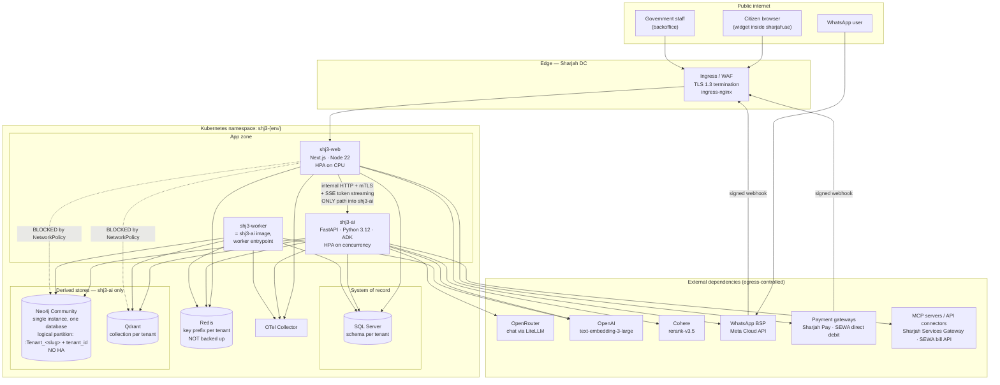

# SHJ3 — Deployment & Operations

> Status: **Accepted** · Last updated: 2026-09-08
> Binding upstream decisions: [ADR-0008](./adr/0008-deployment-targets.md) (targets), [ADR-0002](./adr/0002-schema-per-tenant-isolation.md) (tenancy), [ADR-0009](./adr/0009-logical-graph-partitioning.md) (graph tenancy — amends ADR-0002 for Neo4j only), [ADR-0003](./adr/0003-polyglot-persistence.md) (stores), [ADR-0005](./adr/0005-prisma-owns-schema-sqlalchemy-reads.md) (schema ownership), [`architecture.md`](./architecture.md) §5, §6, §12.
> This document expands those decisions into executable procedure. Where it appears to contradict an ADR, the ADR wins and this document is wrong — raise it.

---

## 1. Purpose & scope

### 1.1 What this document is

The deployment specification and the operational runbook for SHJ3. It is written to be executed at 02:00 by an engineer who did not write the code: numbered steps, explicit commands, a stated verification after every destructive action.

In scope:

- Two application deployables — `shj3-web` (Next.js App Router, TypeScript, Node 22) and `shj3-ai` (Python 3.12, FastAPI, Google ADK) — plus `shj3-worker`, which is the `shj3-ai` image with a different entrypoint, **not a third codebase** (ADR-0001 forbids a third deployable without a new ADR).
- Four stores: SQL Server (system of record), Neo4j **Community, single instance, single database** (knowledge graph — tenant isolation is logical, by label plus property, ADR-0009 having amended ADR-0002 for this store only), Qdrant (vectors), Redis (ephemeral, deliberately not backed up).
- Three environments: `development`, `uat`, `production`, deliberately the same three that B14 tab 1 promotes between.
- Selected targets: **Docker**, **Docker Compose**, **Kubernetes (Helm)**. Bare VM / IIS / systemd was not selected (ADR-0008).

Out of scope: application feature behaviour (see [`SHJ3-wireframes-guide.md`](./SHJ3-wireframes-guide.md)), the data model (`data-model.md`), and CI pipeline definitions — because there is no pipeline.

### 1.2 What is NOT automated — read this first

CI/CD was **explicitly declined** by the product owner (ADR-0008). This is a waiver of the project's own non-negotiable rule *"CI fails on lint, type, or test errors"*, and it changes the character of every procedure in this document. Be honest about what that means:

| Not automated | What actually happens instead | Failure mode this leaves open |
|---|---|---|
| Quality gate on a shared branch | Pre-commit hooks on the committer's machine | `git commit --no-verify` lands unverified code, including an unverified schema change (RISK-011) |
| Build of a release image | A human runs `scripts/release.sh` | Provenance depends on a person; no build attestation (RISK-019) |
| Test execution before deploy | A human runs `pnpm verify` / `make verify` and reads the output | "Green" is a claim, not a record |
| Dependency and image CVE scanning | A scheduled human task (RB-22) | CVEs are found late (RISK-002) |
| Migration execution | A human runs the N-tenant orchestrator (RB-06) | A migration can be forgotten for one tenant (RISK-014) |
| Tenant provisioning | A runbook, not a button (RB-09) | Half-provisioned tenant (RISK-013) |
| Backup verification | A quarterly manual restore drill (RB-16) | Backups are assumed good until proven otherwise (RISK-015) |
| Secret rotation | Manual (RB-18) | Long-lived credentials (RISK-018) |

The mitigations from ADR-0008 **are** the enforcement, so they are specified here as operational requirements rather than as advice:

1. **Pre-commit hooks are mandatory and load-bearing.** Installed by `scripts/bootstrap.sh`, and their presence is asserted by `pnpm verify`. The hook set:

   | Hook | Runs | Blocking |
   |---|---|---|
   | `format` | Prettier (TS/MD/YAML), Ruff format (Py) | yes |
   | `lint` | ESLint, Ruff | yes |
   | `typecheck` | `tsc --noEmit`, `mypy --strict` | yes |
   | `boundaries` | `eslint-plugin-boundaries` (web), `import-linter` (ai) — enforces `architecture.md` §3 module graph and §4 "no vendor import in `domain/`/`application/`" | yes |
   | `schema-drift` | regenerates SQLAlchemy models from `prisma/schema.prisma`; fails on non-empty diff (ADR-0005 rule 4) | yes |
   | `no-raw-cypher` | fails if a Cypher string literal — `MATCH`, `MERGE`, `CREATE`, `CALL db.` — appears anywhere outside `adapters/outbound/graph/`. **This check is the graph's tenant-isolation guarantee** (ADR-0009 rule 2, RISK-024); there is no database-level fallback behind it | yes |
   | `unit-changed` | unit tests for changed packages only | yes |
   | `secret-scan` | `gitleaks protect --staged` | yes |

2. **One verification command.** `pnpm verify` (repo root) and `make verify` (identical, Python-side entry) each run: lint → typecheck → boundaries → schema-drift → **no-raw-cypher** → unit → integration → E2E → security scan. There is exactly one definition of "green".

3. **The suite is written CI-ready.** No manual steps, no interactive prompts, deterministic seeds (§6.3), containerised dependencies. Adding a pipeline later must be a YAML file, not a test-suite refactor. This is the one thing that would be expensive to retrofit, so it is respected now.

4. **Release is a scripted, versioned artefact.** `scripts/release.sh` (§10.1) builds, labels, tags and pushes both images with one version. A laptop `docker build` is not a release path and images so built are rejected by the deploy procedure's provenance check (§10.4 step 3).

**[ASSUMPTION]** A private registry is available at `registry.shj.ae/shj3/*`, hosted inside the Sharjah data centre so image pulls do not leave the residency boundary (B14 tab 4).

---

## 2. Topology

### 2.1 Deployed system



### 2.2 The two ownership rules, enforced by network

These are `architecture.md` §2 ("what is explicitly forbidden") and ADR-0003 ("ownership by runtime") turned into infrastructure the code cannot violate:

| Rule | Enforcement | Verification |
|---|---|---|
| **Only `shj3-web` may reach `shj3-ai`.** No ingress path terminates on `shj3-ai`; no other pod is an allowed source. | `NetworkPolicy shj3-ai-ingress` — ingress from pods labelled `app=shj3-web` on port 8000 only, plus the collector scrape port from `app=otel-collector`. | §7.7 step 2 |
| **Only `shj3-ai` (and `shj3-worker`, same image and ServiceAccount label) may reach Neo4j and Qdrant.** The web tier never opens a graph or vector connection; B6's graph explorer calls the AI service's HTTP API. | `NetworkPolicy neo4j-ingress` / `qdrant-ingress` — ingress from `app in (shj3-ai, shj3-worker)` only. Plus: the Neo4j and Qdrant credentials are mounted into **no** `shj3-web` pod, so even a policy misconfiguration leaves the web tier without a credential. | §7.7 step 2 |

Two controls, not one, on the second rule: the NetworkPolicy is the boundary, the absent secret is the belt-and-braces. A NetworkPolicy is a cluster object an operator can edit; a secret that was never mounted requires a chart change and a review.

**These two rules are now the graph's *only* infrastructure-level controls, and they are coarse.** They say which pods may open a Bolt session; they say nothing about which tenant's subgraph that session may read. Under ADR-0002 the database boundary said the second part. Under ADR-0009 nothing in the infrastructure does — a single Neo4j Community database holds every tenant, and the partition is a `:Tenant_<slug>` label plus a `tenant_id` property enforced by the query builder in `adapters/outbound/graph/`. Read §16.4 and RISK-024 before assuming the graph is defended the way the other three stores are.

### 2.3 Network boundaries

| Boundary | Direction | Policy |
|---|---|---|
| Internet → edge | inbound | TLS 1.3 only, HSTS, WAF. Only `/`, `/api/*`, `/widget/*`, `/webhooks/whatsapp`, `/webhooks/payments` are routed. |
| Edge → app zone | inbound | ingress → `shj3-web:3000` exclusively. |
| App zone internal | east-west | Default-deny. Every allowed flow is an explicit NetworkPolicy (§7.7). |
| App zone → stores | outbound | `shj3-web` → SQL Server, Redis. `shj3-ai`/`shj3-worker` → SQL Server, Redis, Neo4j, Qdrant. |
| App zone → internet | egress | Default-deny. An `Egress` policy allows only the named external hosts, via a forward proxy so the egress set is auditable in one place. Model-provider egress is the RISK-001 surface and is logged. |
| Webhooks inbound | inbound | Signature-verified before any processing: HMAC-SHA256 with `WHATSAPP_APP_SECRET` (Meta `X-Hub-Signature-256`) and `PAYMENT_WEBHOOK_SIGNING_SECRET`. Unsigned or stale (>5 min skew) requests are dropped at the route handler, not at the WAF. |

---

## 3. Environments

Three environments, matching B14 tab 1's `Development → UAT → Production` promotion chain. The symmetry is deliberate (`architecture.md` §12): the promotion screen must not be a simulation of an ops process that works differently in reality.

### 3.1 Environment matrix

| | `development` | `uat` | `production` |
|---|---|---|---|
| **Purpose** | Feature work; the target of `docker compose up` locally and of a shared cluster namespace for integration | Pre-production verification, promotion staging, demo, acceptance against `requirements.md` | Live citizen traffic |
| **Hosting** | Local Docker Compose (primary) + `shj3-development` namespace on the shared cluster | `shj3-uat` namespace, Sharjah DC cluster | `shj3-production` namespace, Sharjah DC cluster, separate node pool |
| **SQL Server** | StatefulSet, 1 replica, `Developer` edition | Managed instance, single node, `Standard` | **Managed instance**, HA pair, `Enterprise`, PITR enabled |
| **Neo4j** | StatefulSet, 1 replica, **Community** | StatefulSet, 1 replica, Community | StatefulSet, **1 replica, Community — no cluster, no HA**. Community has no clustering, so this is a single point of failure for graph-grounded retrieval, accepted because the graph is a derived store: it degrades to vector-only (§15.4) and is rebuilt by re-index (RB-14). Self-hosted in the Sharjah DC because no managed offering is residency-compliant (RISK-017) |
| **Qdrant** | StatefulSet, 1 replica | StatefulSet, 1 replica | StatefulSet, 2 replicas, replication factor 2 |
| **Redis** | StatefulSet, 1 replica, no persistence | Managed, single node | Managed, HA with automatic failover. Still **not backed up** (ADR-0003 rule 2) |
| **`shj3-web` replicas** | 1 | 2 | 3 min → 10 max (HPA on CPU) |
| **`shj3-ai` replicas** | 1 | 2 | 3 min → 12 max (HPA on concurrency) |
| **`shj3-worker` replicas** | 1 | 1 | 2 (fixed; no HPA — re-index concurrency is bounded by job leases, not by pod count) |
| **Tenants provisioned** | `platform`, `sewa`, `customs`, `libraries` (all four; minimum two — §6.4) | same four | same four, plus real entities as onboarded (RB-09) |
| **Data** | **Synthetic** — the deterministic wireframe seed (§6.3). No real citizen data, ever | **Anonymised** — production-shaped volumes, transcripts masked at export and re-masked at import; Emirates ID hashes replaced with test hashes; no real mobile numbers | **Real** citizen data. Residency: UAE — Sharjah data centre (B14 tab 4 default) |
| **Who may deploy** | Any engineer, self-service | Platform engineer. Announce in `#shj3-ops` before deploying; UAT is a shared acceptance surface | **Two people**: release engineer executes, Super Admin approves (§10.6). Never a solo deploy |
| **Retention (B14 tab 4)** | 7 days transcripts (short, to keep seeds authoritative) | 30 days | 90 days transcripts (default), **7 years transactions** — statutory carve-out, independent of the transcript setting |

### 3.2 External dependencies: live vs sandboxed

| Dependency | `development` | `uat` | `production` |
|---|---|---|---|
| **OpenRouter** (chat) | Live key, cheap model pinned, daily cost ceiling USD 20 | Live key, production model set, ceiling USD 100 | Live, per-agent primary + fallback model from B3 step 3, ceiling per §14 |
| **OpenAI** (`text-embedding-3-large`) | Live — no sandbox exists for embeddings. Synthetic text only, so no residency exposure | Live — **anonymised** text leaves the boundary. Acceptable under RISK-001 only because it is anonymised | Live — **real citizen text leaves the residency boundary. This is RISK-001 and requires a signed exception or the self-hosted swap (§16.7)** |
| **Cohere** (`rerank-v3.5`) | Live | Live | Live — same RISK-001 exposure |
| **WhatsApp BSP** (Meta Cloud API) | Mocked (WireMock, §6.2). Meta test number available behind a feature flag | Dedicated test WABA + test number; templates submitted separately from production | Live: `+971 800 7342`, BSP Meta Cloud API (B10 tab 3) |
| **Sharjah Pay gateway** | Mocked | Gateway **sandbox** credentials | **Live** (B11 tab 3) |
| **SEWA direct debit** | Mocked | Sandbox | **Sandbox** — B11 tab 3 records this gateway's status as `Sandbox`, so production runs it in sandbox and the assistant must not offer direct debit as a settled payment method until the mandate integration is certified. Mirroring the wireframe here is intentional, not an oversight |
| **SEWA bill API** | Mocked, seeded to fail so its breaker is genuinely **Open** (§6.3) | Real endpoint, test accounts | Real endpoint. Currently degraded at 1,840 ms p95 / 6.1% errors (B14 tab 3) with its breaker Open (B5 tab 4) |
| **Sharjah Services Gateway (MCP)** | Mocked | Real, test scope, OAuth2 client credentials | Real, OAuth2 client credentials |
| **Sharjah Customs MCP** | Mocked | Real, mTLS | Real, mTLS |
| **UAE PASS** | Mock verification adapter (ADR-0006) | Mock adapter | **Mock adapter at launch** — UAE PASS onboarding is long-lead procurement (RISK-004). The step-up rules in B11 tab 2 are therefore enforced against a mock assurance level in production until credentials are issued; payments must remain gated on OTP possession-factor, which is real. **[ASSUMPTION]** OTP via a live SMS provider is available at launch |

### 3.3 Environment ≠ agent-version promotion

Two promotions exist in this system and conflating them causes incidents:

| | Code promotion | Content promotion |
|---|---|---|
| What moves | Container images + Helm release | Agent versions, flows, knowledge bindings, policies — **rows in SQL Server** |
| Mechanism | `helm upgrade` (§10) | B14 tab 1 Approve, which writes an audit entry in real time (B14 tab 2) |
| Example | `shj3-web:1.7.0` dev → uat | `SEWA & Utilities Billing Agent v1.4` UAT → Production (the pending promotion seeded in B14 tab 1) |
| Approver | Super Admin + release engineer (§10.6) | Entity Admin or Super Admin — B9 tab 3 grants `Publish agents` to those two roles only |

A Helm upgrade never moves agent versions, and approving a promotion never deploys code. Production can therefore legitimately run `shj3-web:1.7.0` while serving agent `v1.3` with `v1.4` pending in UAT — which is exactly the state B14 tab 1 depicts.

---

## 4. Configuration & secrets

### 4.1 Rules

1. **Secrets live in Kubernetes Secrets only.** Never in code, never in a `values-*.yaml`, never in this document, never in a compose file committed to the repo. The chart references secret *names* and *keys*; it contains no secret values (ADR-0008).
2. **Config is validated at boot and the process refuses to start if a required value is absent or malformed.** `shj3-web` validates with a Zod schema in `config/env.ts` evaluated at module load; `shj3-ai` with a Pydantic `Settings` model instantiated in the ASGI lifespan before any router is mounted. A missing required secret produces a non-zero exit and a single log line naming the variable — it does **not** produce a running pod that fails on first request. This is what makes the readiness probe meaningful.
3. **Fail loud, fail early, fail identically.** Both runtimes print the full list of invalid variables and exit 78 (`EX_CONFIG`). No partial start, no default-to-insecure.
4. **No secret is ever logged.** The config module holds secret values in a wrapper type whose `toString`/`__repr__` returns `[redacted]`; the log formatter additionally scrubs any value matching a known secret's content.
5. **Per-tenant connection details are NOT environment variables.** See §4.4.
6. **`development` may use a `.env` file; `uat` and `production` may not.** The boot validator refuses to read `.env` when `SHJ3_ENV != development`.

### 4.2 Environment-variable contract

**Review note added by the Kubernetes/Helm wave (2026-09-09) — read before citing a name from this table.** Building `infra/helm/shj3`'s ConfigMaps/Secrets required the *real* variable name for every var actual code reads, so every name below was cross-checked against `.env.example` and a direct grep of both runtimes rather than transcribed on trust. The table has drifted from the implementation in one systematic way: real code applies an `SHJ3_` prefix to every SHJ3-owned process-configuration variable, including several this table left unprefixed when it was written in Phase A. Confirmed real (not this table's name) for: `SHJ3_ENVIRONMENT` (not `SHJ3_ENV`, #1), `SHJ3_SQL_URL` (not `DATABASE_URL`, #28 — though `DATABASE_URL` is *also* real, kept in step for the Prisma CLI specifically, which only accepts that literal name), `SHJ3_SQL_MAX_RESIDENT_CLIENTS` (not `SHJ3_SQL_POOL_MAX`, #31), `SHJ3_NEO4J_URI`/`SHJ3_NEO4J_USERNAME`/`SHJ3_NEO4J_DATABASE`/`SHJ3_NEO4J_TENANT_LABEL_PREFIX` (not `NEO4J_*`, #34/#35/#37/#38 — `NEO4J_PASSWORD` unprefixed is *also* real, but as the neo4j container image's own admin-password variable, not the app's connection credential, which is `SHJ3_NEO4J_PASSWORD`), `SHJ3_QDRANT_URL`/`SHJ3_QDRANT_API_KEY` (not `QDRANT_*`, #40/#41), `SHJ3_REDIS_URL` (not `REDIS_URL`, #44), `SHJ3_OPENROUTER_API_KEY`/`SHJ3_OPENROUTER_BASE_URL` (not `OPENROUTER_*`, #47/#48), `SHJ3_OPENAI_API_KEY`/`SHJ3_OPENAI_EMBEDDING_MODEL`/`SHJ3_OPENAI_EMBEDDING_DIM` (not `OPENAI_*`, #50-52), `SHJ3_COHERE_API_KEY`/`SHJ3_COHERE_RERANK_MODEL` (not `COHERE_*`, #53/#54), `SHJ3_OTEL_EXPORTER_OTLP_ENDPOINT` (not `OTEL_EXPORTER_OTLP_ENDPOINT`, #67 — `OTEL_RESOURCE_ATTRIBUTES`, #68, is correctly unprefixed: it is a standard OpenTelemetry SDK variable, not this project's own to prefix). Variables belonging to features not yet built (WhatsApp, payments, mTLS) have no real code to confirm a name against and are unaffected — the chart uses this table's names for those, unchanged. `infra/helm/shj3/templates/config/configmap-{web,ai}.yaml` carry the same note at the point they apply the correction; not fixed row-by-row in the table below yet, to avoid a large mechanical edit under the same time pressure that would risk introducing a new transcription error — tracked in `tasks/todo.md`'s Phase C review for whoever next has full attention for it.

`W` = `shj3-web`, `A` = `shj3-ai`, `K` = `shj3-worker` (same image and secret set as `A` unless noted). **68 variables, 23 of them secret-bearing.**

ADR-0009 changed the Neo4j block without changing the count: `NEO4J_ADMIN_USERNAME`/`NEO4J_ADMIN_PASSWORD` are gone — Community has no RBAC, so there is no separate provisioning principal to hold — and #37/#38 are reused for what the tenant-aware query builder needs instead. Numbers are **not** renumbered, because every `#nn` reference in this document indexes this table. Dropping the admin password is why the secret-bearing count fell from 25 to 23.

#### Platform / common

| # | Name | Purpose | Req. | Format / example | Runtime |
|---|---|---|---|---|---|
| 1 | `SHJ3_ENV` | Environment identity; drives config strictness, `.env` permission, residency assertions | yes | `development` \| `uat` \| `production` | W A K |
| 2 | `SHJ3_RELEASE_VERSION` | Semver of the release; must equal the image's `org.opencontainers.image.version` label | yes | `1.7.0` | W A K |
| 3 | `SHJ3_GIT_SHA` | Commit the image was built from; surfaced on `/healthz` for provenance | yes | 40-hex | W A K |
| 4 | `SHJ3_LOG_LEVEL` | Log verbosity | no (`info`) | `debug` \| `info` \| `warn` \| `error` | W A K |
| 5 | `SHJ3_LOG_FORMAT` | Log encoding | no (`json`) | `json` \| `pretty` (`pretty` rejected when `SHJ3_ENV != development`) | W A K |
| 6 | `SHJ3_PLATFORM_SCHEMA` | SQL schema holding platform-global tables — tenant registry, audit destination, user accounts | no (`platform`) | identifier | W A K |
| 7 | `SHJ3_DATA_RESIDENCY` | Asserted residency; boot fails if it disagrees with the cluster region label | yes | `uae-sharjah-dc` \| `uae-dubai-dc` \| `region-flexible` | W A K |
| 8 | `SHJ3_RESIDENCY_EXCEPTION_REF` | Reference to the signed RISK-001 exception permitting model-provider egress. **Required in `production`**; boot fails without it when any external model provider is configured | cond. | `EXC-2026-014` | W A K |

#### `shj3-web` service

| # | Name | Purpose | Req. | Format / example | Runtime |
|---|---|---|---|---|---|
| 9 | `PORT` | HTTP listen port | no (`3000`) | `3000` | W |
| 10 | `SHJ3_PUBLIC_URL` | Canonical external origin; used for OAuth redirects, webhook URLs, widget embed snippet | yes | `https://assistant.shj.ae` | W |
| 11 | `SHJ3_SESSION_SECRET` | **secret** — signs staff session cookies (ADR-0006) | yes | ≥64-char random | W |
| 12 | `SHJ3_ENCRYPTION_KEY` | **secret** — envelope key encrypting tenant-held connector credentials at rest in SQL Server (API keys from B3 sub-tab C, MCP OAuth secrets) | yes | base64, 32 bytes | W |
| 13 | `SHJ3_WIDGET_ALLOWED_ORIGINS` | CSP `frame-ancestors` + CORS allowlist for the embeddable widget; mirrors B10 tab 2 "Allowed domains" | yes | `sharjah.ae,services.shj.ae` | W |
| 14 | `SHJ3_AI_BASE_URL` | The only address of `shj3-ai` that exists in configuration | yes | `https://shj3-ai.shj3-uat.svc:8000` | W |
| 15 | `SHJ3_AI_MTLS_CLIENT_CERT` | **secret** — client cert for the mTLS call into `shj3-ai` | yes (uat/prod) | PEM | W |
| 16 | `SHJ3_AI_MTLS_CLIENT_KEY` | **secret** — matching private key | yes (uat/prod) | PEM | W |
| 17 | `SHJ3_AI_MTLS_CA` | CA bundle validating `shj3-ai`'s server cert | yes (uat/prod) | PEM | W |
| 18 | `SHJ3_AI_TIMEOUT_MS` | Upper bound on a turn request; must exceed `shj3-ai`'s own ceiling or the SSE stream is cut mid-answer. Also bounds the internal provisioning calls of RB-09 steps 2 and 3 | no (`120000`) | ms | W |
| 69 | `SHJ3_AI_PLATFORM_TOKEN` | **secret** — platform-scope credential presented on the internal provisioning API (RB-09 steps 2 and 3). mTLS (#15–#17, #25) proves *which service* is calling; this proves the call is a sanctioned platform operation, which mTLS cannot, since `shj3-web` is also the caller for every tenant-scoped request. Provisioning is one of ADR-0002 rule 5's two audited cross-tenant paths. **An unset value closes those endpoints (503); it never opens them.** Same value on both services | yes | ≥32-char random | W A |

#### `shj3-ai` / `shj3-worker` service

| # | Name | Purpose | Req. | Format / example | Runtime |
|---|---|---|---|---|---|
| 19 | `SHJ3_AI_PORT` | HTTP listen port | no (`8000`) | `8000` | A |
| 20 | `SHJ3_AI_ROLE` | Entrypoint selector — the single variable that makes one image two workloads | yes | `api` (Deployment `shj3-ai`) \| `worker` (Deployment `shj3-worker`) | A K |
| 21 | `SHJ3_AI_MAX_CONCURRENT_TURNS` | Per-pod concurrency ceiling; the numerator of the HPA's concurrency metric and the readiness shed threshold | no (`24`) | int | A |
| 22 | `SHJ3_AI_MODEL_INIT_TIMEOUT_S` | Budget for model-client init at startup; must be below the startup probe's total budget (§7.4) | no (`90`) | seconds | A K |
| 23 | `SHJ3_AI_MTLS_SERVER_CERT` | **secret** — server cert presented to `shj3-web` | yes (uat/prod) | PEM | A |
| 24 | `SHJ3_AI_MTLS_SERVER_KEY` | **secret** — matching key | yes (uat/prod) | PEM | A |
| 25 | `SHJ3_AI_MTLS_CLIENT_CA` | CA that must have signed the caller's cert; this is the cryptographic half of "only `shj3-web` may reach `shj3-ai`" | yes (uat/prod) | PEM | A |
| 26 | `SHJ3_WORKER_QUEUES` | Which job classes this worker leases | no (`ingest,reindex,campaign,reconcile`) | csv | K |
| 27 | `SHJ3_WORKER_LEASE_TTL_S` | Job lease duration; a crashed worker's job becomes re-leasable after this | no (`900`) | seconds | K |

#### SQL Server (system of record)

| # | Name | Purpose | Req. | Format / example | Runtime |
|---|---|---|---|---|---|
| 28 | `DATABASE_URL` | Prisma connection for `shj3-web`. **secret.** App user: DML on tenant schemas, no DDL | yes | `sqlserver://host:1433;database=shj3;user=shj3_app;password=…;encrypt=true;trustServerCertificate=false` | W |
| 29 | `SHJ3_SQL_MIGRATOR_URL` | **secret** — separate, higher-privileged principal holding DDL. Mounted **only** into the migration Job (§8), never into a long-running pod. A running application cannot alter the schema | yes (migration Job) | same shape, `user=shj3_migrator` | migration Job |
| 30 | `SHJ3_SQL_AI_URL` | **secret** — `shj3-ai`'s least-privilege principal: `SELECT` on everything, `INSERT`/`UPDATE` on exactly conversation turns, orchestration traces, re-index job status (ADR-0005 rule 5) | yes | same shape, `user=shj3_ai_ro` | A K |
| 31 | `SHJ3_SQL_POOL_MAX` | Max pooled connections **per tenant handle**. Bounded because ADR-0002 warns a few dozen tenants otherwise exhaust the server | no (`10`) | int | W A K |
| 32 | `SHJ3_SQL_POOL_IDLE_TIMEOUT_S` | Reclaims idle per-tenant pools so an inactive tenant costs nothing | no (`300`) | seconds | W A K |
| 33 | `SHJ3_SQL_TLS_MODE` | Transport security | no (`require`) | `require` \| `verify-full` (`verify-full` mandatory in production) | W A K |

#### Neo4j (knowledge graph — `shj3-ai` only)

| # | Name | Purpose | Req. | Format / example | Runtime |
|---|---|---|---|---|---|
| 34 | `NEO4J_URI` | Bolt URI. **Single instance — `bolt+s://`, not `neo4j+s://`**: Community cannot cluster, so there is nothing for the routing driver to route to and a routing URI against a single instance fails with a confusing discovery error (ADR-0009) | yes | `bolt+s://neo4j.shj3-uat.svc:7687` | A K |
| 35 | `NEO4J_USERNAME` | Graph principal. Community has **no RBAC**, so this is the single administrative user — there is no scoped read/write principal and no separate provisioning principal to fall back on (§16.4, RISK-024) | yes | `neo4j` | A K |
| 36 | `NEO4J_PASSWORD` | **secret** | yes | opaque | A K |
| 37 | `NEO4J_DATABASE` | The one database. Community is single-database; boot **refuses to start** if this is anything but `neo4j`, because a per-tenant database name here would be a silent reversion to the superseded ADR-0002 model | no (`neo4j`) | `neo4j` | A K |
| 38 | `NEO4J_TENANT_LABEL_PREFIX` | Prefix the tenant-aware query builder prepends to a **registry-validated** slug to form the partition label, e.g. `Tenant_sewa`. Never composed from request input (ADR-0009 rule 3) | no (`Tenant_`) | `Tenant_` | A K |
| 39 | `NEO4J_MAX_POOL_SIZE` | Driver pool ceiling. One database, so one pool serves every tenant — this is a whole-instance ceiling, not a per-tenant one | no (`50`) | int | A K |

#### Qdrant (vectors — `shj3-ai` only)

| # | Name | Purpose | Req. | Format / example | Runtime |
|---|---|---|---|---|---|
| 40 | `QDRANT_URL` | Qdrant endpoint | yes | `https://qdrant.shj3-uat.svc:6333` | A K |
| 41 | `QDRANT_API_KEY` | **secret** | yes | opaque | A K |
| 42 | `QDRANT_TLS_CA` | CA for Qdrant's server cert | yes (prod) | PEM | A K |
| 43 | `QDRANT_COLLECTION_SUFFIX` | Appended to the derived collection name, e.g. `sewa_knowledge`. Never accepts user input — the tenant half is resolved from the registry (ADR-0002 rule 4) | no (`knowledge`) | slug | A K |

#### Redis (ephemeral — both)

| # | Name | Purpose | Req. | Format / example | Runtime |
|---|---|---|---|---|---|
| 44 | `REDIS_URL` | Connection | yes | `rediss://redis.shj3-uat.svc:6379` | W A K |
| 45 | `REDIS_PASSWORD` | **secret** | yes | opaque | W A K |
| 46 | `REDIS_KEY_NAMESPACE` | Environment prefix applied **above** the tenant prefix, giving `shj3-uat:sewa:session:{id}`. Prevents a misconfigured non-prod pod from reading production keys if it ever reaches the same instance | yes | `shj3-uat` | W A K |

#### Model providers (ADR-0004)

| # | Name | Purpose | Req. | Format / example | Runtime |
|---|---|---|---|---|---|
| 47 | `OPENROUTER_API_KEY` | **secret** — chat/reasoning via LiteLLM | yes | `sk-or-…` | A K |
| 48 | `OPENROUTER_BASE_URL` | Gateway endpoint; overridable to point at a self-hosted LiteLLM proxy | no (`https://openrouter.ai/api/v1`) | URL | A K |
| 49 | `LITELLM_CONFIG_PATH` | Path to the mounted LiteLLM router config (model aliases, retries, per-model timeouts) | no (`/etc/shj3/litellm.yaml`) | path | A K |
| 50 | `OPENAI_API_KEY` | **secret** — embeddings | yes | `sk-…` | A K |
| 51 | `OPENAI_EMBEDDING_MODEL` | Embedding model. Changing this invalidates every Qdrant collection (RISK-016) | no (`text-embedding-3-large`) | model id | A K |
| 52 | `OPENAI_EMBEDDING_DIM` | Vector dimension; asserted against each tenant collection's configured dimension at boot. Mismatch = refuse to start | no (`3072`) | int | A K |
| 53 | `COHERE_API_KEY` | **secret** — reranking | yes | opaque | A |
| 54 | `COHERE_RERANK_MODEL` | Reranker | no (`rerank-v3.5`) | model id | A |
| 55 | `SHJ3_MODEL_DAILY_COST_CEILING_USD` | Hard daily spend ceiling across providers; breach trips the cost breaker (§14, §15.4) | yes | `250` | A K |

#### Channels — WhatsApp BSP (B10 tab 3)

| # | Name | Purpose | Req. | Format / example | Runtime |
|---|---|---|---|---|---|
| 56 | `WHATSAPP_BSP` | Provider selector behind the channel port | no (`meta-cloud`) | `meta-cloud` \| `mock` | W |
| 57 | `WHATSAPP_PHONE_NUMBER_ID` | Sending number id | yes (if channel live) | numeric | W |
| 58 | `WHATSAPP_ACCESS_TOKEN` | **secret** — Cloud API token | yes (if channel live) | opaque | W |
| 59 | `WHATSAPP_APP_SECRET` | **secret** — verifies `X-Hub-Signature-256` on inbound webhooks | yes (if channel live) | opaque | W |
| 60 | `WHATSAPP_WEBHOOK_VERIFY_TOKEN` | **secret** — Meta subscription handshake | yes (if channel live) | opaque | W |

#### Payments (B11 tab 3)

| # | Name | Purpose | Req. | Format / example | Runtime |
|---|---|---|---|---|---|
| 61 | `SHARJAH_PAY_MODE` | Gateway mode | yes | `live` \| `sandbox` \| `mock` | W |
| 62 | `SHARJAH_PAY_BASE_URL` | Gateway endpoint | yes | URL | W |
| 63 | `SHARJAH_PAY_CLIENT_ID` | OAuth2 client id | yes | opaque | W |
| 64 | `SHARJAH_PAY_CLIENT_SECRET` | **secret** | yes | opaque | W |
| 65 | `SEWA_DIRECT_DEBIT_MODE` | Mandate gateway mode. **`sandbox` in all three environments** — B11 tab 3 records this gateway as Sandbox. Boot warns loudly if set to `live` without an accompanying certification reference | yes | `sandbox` \| `live` | W |
| 66 | `PAYMENT_WEBHOOK_SIGNING_SECRET` | **secret** — verifies settlement/refund callbacks | yes | opaque | W |

#### Observability

| # | Name | Purpose | Req. | Format / example | Runtime |
|---|---|---|---|---|---|
| 67 | `OTEL_EXPORTER_OTLP_ENDPOINT` | Collector address; the single trace id spanning web → ai → tool call arrives here (§13) | yes | `http://otel-collector.shj3-uat.svc:4317` | W A K |
| 68 | `OTEL_RESOURCE_ATTRIBUTES` | Resource labels; must carry `service.name`, `deployment.environment`, `service.version` so B14 tab 3 can group by service and environment | yes | `service.name=shj3-ai,deployment.environment=uat,service.version=1.7.0` | W A K |

Identity providers (UAE PASS OIDC client id/secret/issuer) are **not** in this table: ADR-0006 puts identity behind a port, and the provider rows in B11 tab 1 are tenant configuration in SQL Server, not process configuration. The live UAE PASS client secret is stored encrypted under `SHJ3_ENCRYPTION_KEY` (#12) alongside the other tenant-held connector credentials. Same for MCP server credentials (B3 sub-tab B) and API connector keys (B3 sub-tab C) — a new MCP server must be addable from the backoffice without a redeploy, so it cannot be an env var.

### 4.3 Secret inventory and where each lives

| Kubernetes Secret | Keys | Mounted into |
|---|---|---|
| `shj3-web-secrets` | 11, 12, 15, 16, 28, 44*, 45, 58, 59, 60, 64, 66 | `shj3-web` |
| `shj3-ai-secrets` | 23, 24, 30, 36, 41, 45, 47, 50, 53 | `shj3-ai`, `shj3-worker` |
| `shj3-migrator-secrets` | 29 | migration Job **only** |
| `shj3-tls` | 17, 25, 42 (CA bundles) | both, read-only |

`*` `REDIS_URL` is not itself secret but is co-located so the URL and password rotate together.

Notably absent from `shj3-web-secrets`: `NEO4J_*` and `QDRANT_*`. That absence is a control, not an omission (§2.2).

### 4.4 Per-tenant connection details come from the registry, not from env

This is the one configuration rule most likely to be broken by someone in a hurry, so state it plainly: **there is no `SEWA_DATABASE_URL`.** Adding a tenant must never require an env-var change or a redeploy — if it did, tenant onboarding would be a deploy, and RB-09 would be unrunnable without downtime.

Resolution order at request scope:

1. Middleware resolves the tenant from the **authenticated principal only** — never a header, query param, route param or body (ADR-0002 rule 1).
2. The tenant slug is looked up in the **tenant registry**, a platform-global table in `SHJ3_PLATFORM_SCHEMA` (#6). The registry row carries: `slug`, `display_name`, `sql_schema`, **`neo4j_label`** (`Tenant_<slug>` — the column was `neo4j_database` before ADR-0009; it is renamed, not repurposed, so a stale reader fails loudly), `qdrant_collection`, `redis_prefix`, `embedding_model`, `embedding_dim`, `status`, `provisioned_at`, `schema_version`.
3. A slug absent from the registry, or present with `status != active`, resolves to **no handle** and the request 403s. A tenant mid-provision therefore cannot serve traffic — which is the property that makes RB-09's rollback safe.
4. The data-access layer composes handles from the **server-level** credentials (#28/#30, #34–36, #40–41, #44–45) and the **tenant-level** names from the registry. Credentials are per-server; names are per-tenant. Nothing user-supplied ever reaches a connection string, a collection name or a **graph label** (ADR-0002 rule 4; ADR-0009 rule 3).
5. Tenant context is bound to the request scope — `AsyncLocalStorage` (Node), `contextvars` (Python) — and read by the data-access layer. Unscoped clients are not exported: `getTenantDb()`, `getTenantGraph()`, `getTenantVectors()`, `getTenantCache()` exist; `getPrismaClient()` does not. For the graph, `getTenantGraph()` returns **not a driver session but the tenant-aware query builder** — the session itself is unscoped now that there is one database, so handing it out would hand out every tenant (ADR-0009 rule 1).
6. The registry is cached in Redis for 60 s under `{namespace}:platform:registry`. Cache loss is harmless: Redis is allowed to be lost (ADR-0003 rule 2) and the registry re-reads from SQL Server.

**[ASSUMPTION]** Registry rows are readable by all pods but writable only by the `platform` module under `Super Admin`, and every write is audited (ADR-0002 rule 5).

---

## 5. Container images

Two images. `shj3-worker` is not a third image — it is `shj3-ai` with `SHJ3_AI_ROLE=worker` (#20).

### 5.1 Requirements applying to both

| Requirement | Why | How it is verified |
|---|---|---|
| Distinct build and runtime stages | No compiler, package manager or dev dependency in the shipped layer | `docker history` shows no `pnpm`/`pip` layer in final stage; RB-22 step 4 |
| Pinned base image **digests**, not tags | A floating tag makes "reproducible build" a fiction (ADR-0008) | `scripts/release.sh` refuses to build if any `FROM` lacks `@sha256:` |
| Non-root UID, numeric | A named user cannot be asserted by `runAsNonRoot` without a passwd lookup | `securityContext.runAsUser: 10001` + `runAsNonRoot: true` |
| Read-only root filesystem | Removes the write primitive from most container escapes | `readOnlyRootFilesystem: true` with explicit `emptyDir` for `/tmp` and the Next.js cache |
| `HEALTHCHECK` | Compose parity with Kubernetes probes; `depends_on: condition: service_healthy` needs it (§6) | `docker inspect --format '{{.Config.Healthcheck}}'` |
| OCI version + revision labels | A running pod must be traceable to a commit (ADR-0008) | `/healthz` echoes #2 and #3 and they must match the image labels |
| No shell in the runtime layer where practical | `shj3-web` ships on distroless (no shell). `shj3-ai` keeps a shell because `debugpy`/`neo4j-admin` need one — accepted, and compensated by read-only rootfs and dropped capabilities | image inspection |

### 5.2 `shj3-web` — Dockerfile (representative)

```dockerfile
# syntax=docker/dockerfile:1.7
# --- deps -------------------------------------------------------------------
FROM node:22.11.0-bookworm-slim@sha256:6b1a1ccd1d1eae9a3ea1e3dcd68b6b8d3ce0af9c9c8c0e1bb2c0b1a2c3d4e5f6 AS deps
# [ASSUMPTION] digest above is illustrative; scripts/release.sh pins the real one
WORKDIR /app
RUN corepack enable && corepack prepare pnpm@9.12.0 --activate
COPY pnpm-lock.yaml pnpm-workspace.yaml package.json ./
COPY apps/web/package.json apps/web/
COPY packages/ packages/
RUN --mount=type=cache,target=/pnpm/store pnpm install --frozen-lockfile

# --- build ------------------------------------------------------------------
FROM deps AS build
COPY . .
# Prisma clients are generated at build time; the schema is the source of truth (ADR-0005).
# Two schema files, two `prisma generate` invocations (ADR-0011) — see either schema
# file's header comment for why platform and tenant models cannot share one generated
# client.
RUN pnpm exec prisma generate --schema prisma/platform/schema.prisma \
 && pnpm exec prisma generate --schema prisma/tenant/schema.prisma \
 && pnpm --filter @shj3/web build          # next build, output: 'standalone'

# --- runtime ----------------------------------------------------------------
FROM gcr.io/distroless/nodejs22-debian12@sha256:1a2b3c4d5e6f7081920a1b2c3d4e5f60718293a4b5c6d7e8f90a1b2c3d4e5f60 AS runtime
ARG VERSION
ARG GIT_SHA
LABEL org.opencontainers.image.title="shj3-web" \
      org.opencontainers.image.version="${VERSION}" \
      org.opencontainers.image.revision="${GIT_SHA}" \
      org.opencontainers.image.source="https://git.shj.ae/shj3/shj3"
ENV NODE_ENV=production PORT=3000 SHJ3_RELEASE_VERSION=${VERSION} SHJ3_GIT_SHA=${GIT_SHA}
WORKDIR /app
# standalone output only: no node_modules tree, no pnpm, no toolchain
COPY --from=build --chown=10001:10001 /app/apps/web/.next/standalone ./
COPY --from=build --chown=10001:10001 /app/apps/web/.next/static ./apps/web/.next/static
COPY --from=build --chown=10001:10001 /app/apps/web/public ./apps/web/public
# Prisma migration artefacts travel with the image so the migration Job uses the same image (§8)
COPY --from=build --chown=10001:10001 /app/apps/web/prisma ./prisma
USER 10001:10001
EXPOSE 3000
# distroless has no shell and no curl — use the runtime that is already present
HEALTHCHECK --interval=15s --timeout=3s --start-period=20s --retries=3 \
  CMD ["/nodejs/bin/node","-e","fetch('http://127.0.0.1:'+(process.env.PORT||3000)+'/healthz').then(r=>process.exit(r.ok?0:1)).catch(()=>process.exit(1))"]
ENTRYPOINT ["/nodejs/bin/node","apps/web/server.js"]
```

Notes:
- `output: 'standalone'` is what allows the final image to carry no `node_modules` tree and no package manager.
- The Prisma migration folder is deliberately in the runtime image. The migration Job (§8) runs **this same image** with a different command, so a migration is always executed by the exact build that will serve traffic. Two artefacts would let them disagree.
- `/tmp` and `/app/.next/cache` are mounted `emptyDir` in Kubernetes because the rootfs is read-only.

### 5.3 `shj3-ai` — Dockerfile (representative)

```dockerfile
# syntax=docker/dockerfile:1.7
# --- build ------------------------------------------------------------------
FROM python:3.12.7-bookworm@sha256:2b3c4d5e6f708192a0b1c2d3e4f5061728394a5b6c7d8e9f0a1b2c3d4e5f6071 AS build
ENV UV_COMPILE_BYTECODE=1 UV_LINK_MODE=copy
WORKDIR /srv
RUN pip install --no-cache-dir uv==0.4.27
COPY apps/ai/pyproject.toml apps/ai/uv.lock ./
RUN --mount=type=cache,target=/root/.cache/uv uv sync --frozen --no-dev
COPY apps/ai/ ./
# Generated SQLAlchemy models must already be current; the drift check is a pre-commit
# hook (ADR-0005 rule 4) and is re-asserted here so a bypassed hook cannot ship.
RUN uv run python -m shj3_ai.tools.assert_models_current

# --- runtime ----------------------------------------------------------------
FROM python:3.12.7-slim-bookworm@sha256:3c4d5e6f708192a0b1c2d3e4f5061728394a5b6c7d8e9f0a1b2c3d4e5f6071829 AS runtime
ARG VERSION
ARG GIT_SHA
LABEL org.opencontainers.image.title="shj3-ai" \
      org.opencontainers.image.version="${VERSION}" \
      org.opencontainers.image.revision="${GIT_SHA}"
ENV PYTHONDONTWRITEBYTECODE=1 PYTHONUNBUFFERED=1 \
    PATH="/srv/.venv/bin:$PATH" \
    SHJ3_RELEASE_VERSION=${VERSION} SHJ3_GIT_SHA=${GIT_SHA} \
    SHJ3_AI_ROLE=api
RUN groupadd -g 10001 shj3 && useradd -u 10001 -g 10001 -M -s /usr/sbin/nologin shj3
WORKDIR /srv
COPY --from=build --chown=10001:10001 /srv/.venv /srv/.venv
COPY --from=build --chown=10001:10001 /srv/shj3_ai /srv/shj3_ai
USER 10001:10001
EXPOSE 8000
# /readyz reports 200 only after model clients have initialised (§7.4)
HEALTHCHECK --interval=15s --timeout=5s --start-period=120s --retries=3 \
  CMD ["python","-c","import sys,urllib.request;sys.exit(0 if urllib.request.urlopen('http://127.0.0.1:8000/healthz',timeout=4).status==200 else 1)"]
# One image, two workloads. The entrypoint dispatches on SHJ3_AI_ROLE (#20).
ENTRYPOINT ["python","-m","shj3_ai.entrypoint"]
```

Notes:
- **`shj3-ai` is the larger, slower image** — roughly 780 MB versus ~180 MB for `shj3-web` **[ASSUMPTION]**, driven by the ADK, LiteLLM, `neo4j`, `qdrant-client`, `sqlalchemy` and tokeniser data. Pull time on a cold node is the dominant term in its startup, before any application code runs.
- Startup is slow for a second reason: model client initialisation (LiteLLM router construction, provider handshakes, tokeniser load) takes tens of seconds. `--start-period=120s` here and the generous **startup probe** in §7.4 exist for exactly this. An aggressive liveness probe on this image produces a restart loop that looks like a crash and is actually a timeout (ADR-0008).
- `assert_models_current` in the build stage is a second line of defence for the ADR-0005 drift rule. If someone commits with `--no-verify`, the *image build* fails rather than a citizen conversation failing later. This is the cheapest available compensation for RISK-011.

### 5.4 Provenance

Every image carries `org.opencontainers.image.version` and `.revision`. Both runtimes expose them on `/healthz`:

```json
{"status":"ok","version":"1.7.0","gitSha":"9f2c1ab…","env":"production","residency":"uae-sharjah-dc"}
```

`scripts/verify-release.sh <version>` asserts, for both images: digest resolves, labels match the version and the git tag, no `FROM` used a floating tag, and the tag is not already published (§10.1 refuses to overwrite a published tag).

---

## 6. Local development with Docker Compose

Local development is **not a reduced configuration** (ADR-0008): all four stores, both runtimes, the worker, and real tenant provisioning for at least two tenants.

### 6.1 One command

```bash
git clone https://git.shj.ae/shj3/shj3 && cd shj3
./scripts/bootstrap.sh          # installs pnpm, uv, pre-commit hooks; writes .env from .env.example
docker compose up -d --wait     # --wait blocks until every healthcheck passes
pnpm verify                     # the single gate: lint, typecheck, unit, integration, E2E, scan
```

`docker compose up -d --wait` exits non-zero if any service fails its healthcheck, which is what makes it usable as a test-suite precondition rather than something a human watches.

### 6.2 Service list and ports

| Service | Image | Host port | Healthcheck | `depends_on` |
|---|---|---|---|---|
| `sqlserver` | `mcr.microsoft.com/mssql/server:2022-latest` (digest-pinned) | 1433 | `sqlcmd -Q "SELECT 1"` | — |
| `neo4j` | `neo4j:5.26-community` (digest-pinned) | 7474, 7687 | `cypher-shell "RETURN 1"` | — |
| `qdrant` | `qdrant/qdrant:v1.19.0` | 6333, 6334 | `GET /readyz` | — |
| `redis` | `redis:7.4-alpine` | 6379 | `redis-cli PING` | — |
| `mock-externals` | `wiremock/wiremock:3.9.1` | 8080 | `GET /__admin/health` | — |
| `otel-collector` | `otel/opentelemetry-collector-contrib:0.111.0` | 4317, 4318 | `GET :13133` | — |
| `jaeger` | `jaegertracing/all-in-one:1.62` | 16686 (UI) | `GET :14269` | — |
| `mailpit` | `axllent/mailpit:v1.21` | 8025 (UI), 1025 (SMTP) | `GET /readyz` | — |

`qdrant`'s version is not a free choice: `qdrant-client`'s resolved version must stay within one minor version of the server, and collection-level metadata — which `QdrantProvisioner` uses to record the embedding model and dimension a collection was built for, so a later mismatch fails rather than silently poisons retrieval (ADR-0004 rule 3, RISK-016) — is a server feature absent before Qdrant ~1.16. Verified directly against v1.12.4 and v1.15.4: both accept a `create_collection` call carrying `metadata` with no error, then return `config.metadata: None` on read, so the check passes `create` and fails `verify` with nothing in between to explain why. Bump the client and server together.
| `migrate` | `shj3-web:dev` | — | one-shot, `restart: "no"` | `sqlserver: service_healthy` |
| `provision` | `shj3-web:dev` | — | one-shot | `migrate: service_completed_successfully`, `neo4j`/`qdrant`/`redis` healthy |
| `seed` | `shj3-web:dev` | — | one-shot | `provision: service_completed_successfully`, `mock-externals` healthy |
| `shj3-web` | built locally | 3000 | `GET /healthz` | `seed: service_completed_successfully` |
| `shj3-ai` | built locally | 8000 | `GET /healthz` | `seed: service_completed_successfully` |
| `shj3-worker` | `shj3-ai:dev`, `SHJ3_AI_ROLE=worker` | 9100 (metrics) | `GET /healthz` on 9100 | `shj3-ai: service_healthy` |

Ordering is expressed with `condition:` rather than with sleeps — this matters because the E2E suite starts the moment `--wait` returns, and a race there produces a flaky suite that gets blamed on the tests:

```yaml
services:
  migrate:
    image: shj3-web:dev
    command: ["/nodejs/bin/node","scripts/migrate-all-tenants.mjs","--apply"]
    environment:
      SHJ3_ENV: development
      SHJ3_SQL_MIGRATOR_URL: ${SHJ3_SQL_MIGRATOR_URL}
    depends_on:
      sqlserver: { condition: service_healthy }
    restart: "no"

  provision:
    image: shj3-web:dev
    command: ["/nodejs/bin/node","scripts/provision-tenant.mjs",
              "--tenant","platform","--tenant","sewa",
              "--tenant","customs","--tenant","libraries"]
    depends_on:
      migrate:  { condition: service_completed_successfully }
      neo4j:    { condition: service_healthy }
      qdrant:   { condition: service_healthy }
      redis:    { condition: service_healthy }
    restart: "no"

  shj3-ai:
    build: { context: ., dockerfile: apps/ai/Dockerfile }
    environment:
      SHJ3_AI_ROLE: api
      SHJ3_AI_MODEL_INIT_TIMEOUT_S: "90"
    depends_on:
      seed: { condition: service_completed_successfully }
    healthcheck:
      test: ["CMD","python","-c","import sys,urllib.request;sys.exit(0 if urllib.request.urlopen('http://127.0.0.1:8000/healthz',timeout=4).status==200 else 1)"]
      interval: 10s
      timeout: 5s
      retries: 12          # 120s — mirrors the Kubernetes startup probe budget (§7.4)
      start_period: 30s
```

`mock-externals` (WireMock) stands in for the SEWA bill API, Sharjah Services Gateway MCP, Sharjah Customs MCP, the payment gateways and the WhatsApp BSP. Its stub set lives in `infra/wiremock/mappings/` and is version-controlled, because the seeded degraded states depend on it (§6.3). Model providers are **not** mocked by default — a developer uses real OpenRouter/OpenAI/Cohere keys with a low cost ceiling, because mocking an LLM produces tests that pass against a fiction. A `--profile offline` variant stubs them for airline work **[ASSUMPTION]**.

### 6.3 Deterministic seed data

Two points matter more than the contents:

1. **Seeds must be deterministic because the E2E suite depends on them** (ADR-0008), and because the wireframe's cross-module wiring — §6 of the wireframes guide, eleven cause-and-effect pairs — only demonstrates correctly from a known starting state. "Approve the `appointment_confirmation` template → its campaign unblocks" is only a demonstrable behaviour if the template starts `Pending` and the campaign starts `Blocked`.
2. **Determinism means fixed identity and derived time.** All primary keys are fixed UUIDv5 values derived from a namespace plus a stable name, so `sewa-billing-agent` has the same id on every machine. Timestamps are **relative to a seed-run reference instant** captured once as `SHJ3_SEED_CLOCK` (default: seed start), because the wireframe's data is expressed relatively — "last crawled 2 hours ago", "updated 6 days ago". Absolute timestamps would rot; recomputed relative ones hold, so an E2E assertion on "2 hours ago" is stable whenever the seed runs.

Seeded state, matched to the wireframe:

| Seeded | Detail | Wireframe ref |
|---|---|---|
| 4 tenants | `platform`, `sewa`, `customs`, `libraries` — the four entities | B9 tab 2 |
| 4 agents | SEWA & Utilities Billing v1.4 Published · Customs Enquiry v2.1 Published · Library Services v0.9 Draft · General FAQ v3.0 Published, with their version histories | B2 |
| 4 knowledge sources | SEWA tariff schedule 100% / 2h ago · Utilities providers directory 90% / 1d · Sharjah Customs handbook 70% / 3d · Library membership policy 55% / 6d | B6 tab 1 |
| 5 users | Sara Al Mazrouei (Agent Designer, Active) · Omar Khan (Live Agent, Active) · Priya Nair (Knowledge Manager, **Invited**) · Ahmed Saeed (Super Admin, Active) · Lina Haddad (Reviewer, **Suspended**) | B9 tab 1 |
| 2 source conflicts | SEWA residential tariff `0.23` vs `0.19` (recent source authoritative) and library membership `3 months` vs `1 month` (**recent source less authoritative** — the deliberately awkward one) | B6 tab 4 |
| **SEWA bill API breaker: Open** | Achieved two ways so it is genuinely open, not merely displayed: the seed writes breaker state `open` with a live cooldown into Redis, **and** the WireMock stub for `GET /v1/bills/{account}` returns 500 so any probe re-trips it. A breaker that a reset would silently "fix" would make the B14 tab 3 ↔ B5 tab 4 wiring untestable | B5 tab 4, B14 tab 3 |
| Other breakers | Sharjah Services Gateway 5/60s, 2 min cooldown, Closed · WhatsApp BSP 10/60s, 5 min cooldown, Closed | B5 tab 4 |
| **Pending promotion** | `SEWA & Utilities Billing Agent v1.4`, UAT → Production, requester Sara Al Mazrouei, status Awaiting approval. Environment rows: Development 4 agents/latest, UAT v1.4/v2.1/v3.0, Production v1.3/v2.1/v2.4 | B14 tab 1 |
| **General FAQ v3.0 blocked** | Publish gate active; Arabic language parity golden set at **71%** against an 85% accuracy floor, Arabic locale 82% translated. The gate must state *why*, naming set, score and threshold | B13 tabs 1–3, B10 tab 5 |
| Escalation queue | Ahmed R. 2m Normal (tool failed twice) · Fatima S. 6m **High** (user requested, frustrated) · Yousef M. 1m Normal (low grounding). Routing rules 1–4 in precedence order | B8 |
| Transactions | TXN-88213 Settled · TXN-88210 Settled · TXN-88204 **Refund requested** · TXN-88199 Failed | B11 tab 4 |
| Observability rows | MCP gateway 240 ms/0.2% Healthy · SEWA bill API 1,840 ms/6.1% **Degraded** · Graph RAG 310 ms/0.0% Healthy · WhatsApp BSP 190 ms/0.4% Healthy — seeded as real metric samples in the collector, not as literal table text | B14 tab 3 |
| Audit log | 5 entries, append-only | B14 tab 2 |

Seeding is **idempotent**: `scripts/seed.mjs` upserts by fixed id and is safe to re-run. `pnpm seed:reset` truncates tenant schemas and re-seeds without recreating tenants, which is the fast path between E2E runs. A full reset is `docker compose down -v && docker compose up -d --wait`.

### 6.4 Local dev provisions at least two tenants

Non-negotiable. **ADR-0002's isolation guarantee cannot be exercised against a single-tenant environment** — with one tenant, `tenant-isolation.spec` has nothing to attempt to cross into, and every cross-tenant assertion passes vacuously. The compose `provision` service therefore creates all four wireframe entities, and the isolation suite runs `sewa` against `customs` in both directions across all four stores, including a request payload that attempts to forge a tenant identifier (ADR-0002, required test).

A developer who deletes tenants to speed up startup has disabled the release gate. `pnpm verify` asserts `SELECT COUNT(*) FROM platform.Tenants WHERE status='active' >= 2` and fails with that explanation.

**The graph arm of that suite is now the largest and the weakest.** For SQL Server, Qdrant and Redis, two tenants in one environment prove a boundary that infrastructure already enforces. For Neo4j after ADR-0009 they share one database, so the suite must assert per **query path** rather than per store: for every read exposed by the graph adapter, a negative test that a `sewa`-scoped call returns no `customs` node under either encoding, plus the write-path agreement assertion (ADR-0009 rule 5) and the post-retrieval re-filter (rule 4). A single tenant makes all of these pass vacuously, which is why §6.4 is non-negotiable rather than merely tidy.

### 6.5 Volume strategy

| Volume | Contents | Reset policy |
|---|---|---|
| `shj3_sqlserver_data` | `/var/opt/mssql` | Survives `down`; destroyed by `down -v` |
| `shj3_neo4j_data` | `/data` | same |
| `shj3_neo4j_plugins` | APOC | same |
| `shj3_qdrant_data` | `/qdrant/storage` | same |
| Redis | **none — no volume, no AOF, no RDB.** Redis is ephemeral by design (ADR-0003 rule 2), and giving it persistence locally would let durable-looking behaviour creep in that production does not have | n/a |
| Source code | bind-mounted into `shj3-web`/`shj3-ai` under a `dev` profile for hot reload | n/a |

Redis having no local volume is a deliberate teaching device: if a feature breaks after `docker compose restart redis`, that feature has put something durable in Redis and violates ADR-0003. Finding that locally is much cheaper than finding it after a production failover.

---

## 7. Kubernetes / Helm

One chart, values per environment (ADR-0008). The chart contains no secrets — it references secret names.

### 7.1 Chart structure

```
infra/helm/shj3/
├── Chart.yaml                  # version = chart version; appVersion = release version (#2)
├── values.yaml                 # safe defaults; every environment overrides
├── values-development.yaml
├── values-uat.yaml
├── values-production.yaml
└── templates/
    ├── _helpers.tpl
    ├── web/            deployment.yaml service.yaml hpa.yaml pdb.yaml
    ├── ai/             deployment.yaml service.yaml hpa.yaml pdb.yaml
    ├── worker/         deployment.yaml pdb.yaml
    ├── migration/      job.yaml            # pre-upgrade hook, opt-in (§7.9)
    ├── stores/         sqlserver-sts.yaml neo4j-sts.yaml qdrant-sts.yaml redis-sts.yaml
    │                   # each gated on .Values.stores.<name>.mode == "in-cluster"
    ├── networkpolicy/  default-deny.yaml web.yaml ai.yaml stores.yaml egress.yaml
    ├── rbac/           serviceaccount-web.yaml serviceaccount-ai.yaml role-*.yaml
    ├── config/         configmap-web.yaml configmap-ai.yaml litellm-configmap.yaml
    ├── ingress.yaml
    └── servicemonitor.yaml
```

`Chart.yaml`'s `appVersion` is set by `scripts/release.sh` and must equal the image tag. `helm upgrade` with a mismatched `appVersion` and `image.tag` is rejected by a `fail` in `_helpers.tpl` — that mismatch is how a "deployed the wrong thing" incident starts.

### 7.2 Values per environment

```yaml
# values-production.yaml (excerpt)
global:
  env: production
  residency: uae-sharjah-dc
  imageRegistry: registry.shj.ae/shj3

web:
  image: { repository: shj3-web, tag: "" }     # tag injected by release.sh; empty = fail
  replicas: 3
  resources:
    requests: { cpu: 250m,  memory: 512Mi }
    limits:   { cpu: "1",   memory: 1Gi }
  hpa: { enabled: true, minReplicas: 3, maxReplicas: 10, targetCPUUtilizationPercentage: 65 }
  pdb: { minAvailable: 2 }

ai:
  image: { repository: shj3-ai, tag: "" }
  replicas: 3
  resources:
    requests: { cpu: "1",   memory: 3Gi }
    limits:   { cpu: "3",   memory: 6Gi }
  hpa:
    enabled: true
    minReplicas: 3
    maxReplicas: 12
    metric: { type: Pods, name: shj3_ai_active_turns, averageValue: "16" }
  pdb: { minAvailable: 2 }
  maxConcurrentTurns: 24
  startupBudgetSeconds: 180

worker:
  replicas: 2
  resources:
    requests: { cpu: "1", memory: 3Gi }
    limits:   { cpu: "4", memory: 8Gi }        # re-index is the spikiest workload
  pdb: { minAvailable: 1 }

stores:
  sqlserver: { mode: managed,    host: shj3-sql.privatelink.shj.ae }
  neo4j:     { mode: in-cluster, edition: community, replicas: 1, storage: 200Gi }
  #          ^ replicas is fixed at 1 and the chart `fail`s on any other value:
  #            Community cannot cluster (ADR-0009), and a 2-replica StatefulSet on one
  #            RWO volume would not be a cluster — it would be a second instance with
  #            no data and a service that load-balances half the queries into it.
  qdrant:    { mode: in-cluster, replicas: 2, storage: 300Gi }
  redis:     { mode: managed,    host: shj3-redis.privatelink.shj.ae }

migration: { runAsHook: false }                # production migrations are RB-06, never a hook
```

`values-development.yaml` differs in the ways that matter: `stores.*.mode: in-cluster` for all four, replicas 1, `hpa.enabled: false`, `pdb` omitted (a PDB with `minAvailable: 1` on a single replica blocks every node drain), and `migration.runAsHook: true` because a dev migration failing the upgrade is the desired feedback.

### 7.3 Resource shapes — why `shj3-ai` is materially larger

ADR-0001's entire justification is that these two have different resource shapes, so the values must reflect it rather than copy one to the other:

| | `shj3-web` | `shj3-ai` | `shj3-worker` |
|---|---|---|---|
| CPU request / limit | 250m / 1 | **1 / 3** | 1 / 4 |
| Memory request / limit | 512Mi / 1Gi | **3Gi / 6Gi** | 3Gi / 8Gi |
| Why | Request/response, sub-100 ms, CPU-light | Long-running multi-second turns, token streaming, tokenisers and model clients resident, concurrent Graph RAG retrievals | Re-index batches thousands of chunks and holds embedding batches in memory; the spikiest of the three |
| Scaling driver | Concurrent staff + page views | Concurrent conversations | Job leases, not pod count |

The memory limit on `shj3-ai` is 2× its request deliberately: embedding batches are bursty, and an OOMKill mid-turn drops a citizen conversation. The CPU limit is 3× request because a turn's tokenisation and merge phases are short CPU spikes between long I/O waits — throttling those inflates p95 latency, which is the number B14 tab 3 reports.

### 7.4 Probes — and the `shj3-ai` startup probe specifically

Three probes, three different questions. Confusing them is the most common cause of a self-inflicted outage.

| Probe | Question | On failure |
|---|---|---|
| `startupProbe` | "Has it finished booting?" | Keeps liveness and readiness suspended. Only on exhaustion is the container restarted |
| `readinessProbe` | "Should it receive traffic right now?" | Removed from Service endpoints. **Not restarted** |
| `livenessProbe` | "Is it wedged beyond recovery?" | Container restarted |

`shj3-web`:

```yaml
startupProbe:
  httpGet: { path: /healthz, port: 3000 }
  periodSeconds: 3
  failureThreshold: 20            # 60s
readinessProbe:
  httpGet: { path: /readyz, port: 3000 }
  periodSeconds: 5
  failureThreshold: 3
livenessProbe:
  httpGet: { path: /healthz, port: 3000 }
  periodSeconds: 15
  failureThreshold: 3
```

`shj3-ai` — **the generous startup probe, called out because getting this wrong produces a restart loop that is indistinguishable from a crash** (ADR-0008):

```yaml
# Model client init (LiteLLM router construction, provider handshakes, tokeniser load)
# takes tens of seconds, and the ~780MB image adds cold-pull time before that.
# Budget: 60 x 3s = 180s (ai.startupBudgetSeconds). SHJ3_AI_MODEL_INIT_TIMEOUT_S (#22)
# is 90s, so the APPLICATION gives up and logs a diagnosable error BEFORE the PROBE
# gives up and restarts the container. That ordering is the whole point.
startupProbe:
  httpGet: { path: /healthz, port: 8000 }     # process alive, config validated
  periodSeconds: 3
  failureThreshold: 60
  timeoutSeconds: 3
readinessProbe:
  httpGet: { path: /readyz, port: 8000 }      # model clients ready AND active turns < ceiling
  periodSeconds: 5
  failureThreshold: 3
  timeoutSeconds: 4
livenessProbe:
  httpGet: { path: /healthz, port: 8000 }
  periodSeconds: 20
  failureThreshold: 3
  timeoutSeconds: 5                            # never point liveness at /readyz
```

Rules encoded above, each learned the hard way:

1. **Liveness must never depend on a dependency.** `/healthz` checks only that the process is alive and its config validated. If liveness checked SQL Server, a database blip would restart every pod simultaneously and turn a 30-second degradation into a 5-minute outage.
2. **Readiness may depend on dependencies, and does.** `/readyz` returns 503 when model clients are not initialised, when the tenant registry is unreadable, or when `active_turns >= SHJ3_AI_MAX_CONCURRENT_TURNS` (#21) — the last of which sheds load to other pods instead of queueing inside one.
3. **The application timeout must be shorter than the probe budget.** 90 s < 180 s means a slow provider handshake produces a log line naming the provider, not a mysterious `CrashLoopBackOff`.
4. `terminationGracePeriodSeconds: 150` on `shj3-ai` — see §7.6.

### 7.5 HPAs — independent, and on different signals

```yaml
# shj3-web: CPU. Page rendering and BFF work are CPU-bound and short.
apiVersion: autoscaling/v2
kind: HorizontalPodAutoscaler
metadata: { name: shj3-web }
spec:
  scaleTargetRef: { apiVersion: apps/v1, kind: Deployment, name: shj3-web }
  minReplicas: 3
  maxReplicas: 10
  metrics:
    - type: Resource
      resource: { name: cpu, target: { type: Utilization, averageUtilization: 65 } }
---
# shj3-ai: concurrency. CPU is a terrible signal here — a pod holding 24 conversations
# waiting on OpenRouter is nearly idle on CPU while completely full.
apiVersion: autoscaling/v2
kind: HorizontalPodAutoscaler
metadata: { name: shj3-ai }
spec:
  scaleTargetRef: { apiVersion: apps/v1, kind: Deployment, name: shj3-ai }
  minReplicas: 3
  maxReplicas: 12
  metrics:
    - type: Pods
      pods:
        metric: { name: shj3_ai_active_turns }              # gauge, exported per pod
        target: { type: AverageValue, averageValue: "16" }  # 2/3 of the 24 ceiling
  behavior:
    scaleUp:   { stabilizationWindowSeconds: 30,  policies: [{ type: Percent, value: 100, periodSeconds: 30 }] }
    scaleDown: { stabilizationWindowSeconds: 600, policies: [{ type: Pods,   value: 1,   periodSeconds: 120 }] }
```

`scaleDown` on `shj3-ai` is deliberately slow (600 s window, one pod at a time). Scaling in aggressively terminates pods holding multi-second turns, and avoiding exactly that is why the concurrency metric exists. Requires `prometheus-adapter` exposing `shj3_ai_active_turns` **[ASSUMPTION]**.

`shj3-worker` has **no HPA**. Its throughput is bounded by job leases in Redis, so more pods do not mean more concurrent re-index work — they mean more idle pods. Worker capacity changes by editing `worker.replicas`, deliberately manual.

### 7.6 PodDisruptionBudgets and a rolling strategy that does not drop turns

```yaml
apiVersion: policy/v1
kind: PodDisruptionBudget
metadata: { name: shj3-ai }
spec:
  minAvailable: 2
  selector: { matchLabels: { app: shj3-ai } }
```

PDBs: `shj3-web` `minAvailable: 2`, `shj3-ai` `minAvailable: 2`, `shj3-worker` `minAvailable: 1`, Qdrant `maxUnavailable: 1`. **Omitted entirely in `development`** — a PDB on a single replica blocks node drains and cluster upgrades for no benefit.

**Neo4j has no PDB, in any environment.** The old `maxUnavailable: 1` existed to protect a 3-core causal cluster's quorum, and Community has no cluster to protect (ADR-0009). On a single replica the same reasoning as `development` applies: a PDB would block every node drain and cluster upgrade while protecting nothing, because there is no second replica for the workload to survive on. So a node drain **will** take the graph down for the duration of the reschedule, and that is handled where it belongs — in the application, by degrading to vector-only retrieval (§15.4) — not by a disruption budget that cannot deliver what it promises. Drain a node carrying `neo4j-0` during working hours only, and expect a P2 (alert #33).

The rolling strategy for `shj3-ai` is where in-flight conversation turns are protected:

```yaml
strategy:
  type: RollingUpdate
  rollingUpdate: { maxUnavailable: 0, maxSurge: 1 }
spec:
  terminationGracePeriodSeconds: 150
  containers:
    - name: ai
      lifecycle:
        preStop:
          exec:
            # 1. Flip /readyz to 503 so the Service stops sending new turns.
            # 2. Sleep past the endpoint-propagation window (~5s).
            # 3. Drain active turns, up to 120s, then let SIGTERM land.
            command: ["/bin/sh","-c","kill -USR1 1; sleep 5; python -m shj3_ai.tools.await_drain --timeout 120"]
```

The mechanism, in order — each step is required and the ordering is not arbitrary:

1. `maxUnavailable: 0, maxSurge: 1` — a new pod becomes Ready before an old one is touched. Capacity never dips during a rollout.
2. `preStop` fails readiness **first**. Endpoint removal is asynchronous in Kubernetes; without the 5-second sleep, requests keep arriving at a pod that has already decided to stop.
3. `await_drain` blocks while `active_turns > 0`, up to 120 s. A turn is seconds, not minutes, so draining essentially always completes.
4. `terminationGracePeriodSeconds: 150` > 5 + 120 — the grace period must exceed the preStop budget, or the kubelet SIGKILLs mid-drain and the whole mechanism is decorative.
5. Turn state lives in Redis, not pod memory, so a turn that *is* cut off is resumable on the client's SSE reconnect rather than lost.

`shj3-web` uses the same shape with a 20 s drain — its requests are short.

`shj3-worker` differs: jobs are leased, not requested. `preStop` stops leasing new jobs and finishes the current batch, up to 600 s (`terminationGracePeriodSeconds: 660`). A killed re-index batch is not data loss — the derived stores are rebuildable (ADR-0003 rule 1) and the job is re-leasable after `SHJ3_WORKER_LEASE_TTL_S` (#27) — but finishing it avoids repeating paid embedding work.

### 7.7 NetworkPolicies — §2.2's two rules as infrastructure

```yaml
# 0. Default deny, both directions, whole namespace.
apiVersion: networking.k8s.io/v1
kind: NetworkPolicy
metadata: { name: default-deny }
spec:
  podSelector: {}
  policyTypes: [Ingress, Egress]
---
# 1. ONLY shj3-web may reach shj3-ai.
apiVersion: networking.k8s.io/v1
kind: NetworkPolicy
metadata: { name: shj3-ai-ingress }
spec:
  podSelector: { matchLabels: { app: shj3-ai } }
  policyTypes: [Ingress]
  ingress:
    - from: [{ podSelector: { matchLabels: { app: shj3-web } } }]
      ports: [{ protocol: TCP, port: 8000 }]
    - from: [{ podSelector: { matchLabels: { app: otel-collector } } }]
      ports: [{ protocol: TCP, port: 9100 }]      # metrics scrape only
---
# 2. ONLY shj3-ai and shj3-worker may reach Neo4j and Qdrant (ADR-0003 ownership).
apiVersion: networking.k8s.io/v1
kind: NetworkPolicy
metadata: { name: derived-stores-ingress }
spec:
  podSelector: { matchExpressions: [{ key: app, operator: In, values: [neo4j, qdrant] }] }
  policyTypes: [Ingress]
  ingress:
    - from:
        - podSelector: { matchExpressions: [{ key: app, operator: In, values: [shj3-ai, shj3-worker] }] }
      ports:
        - { protocol: TCP, port: 7687 }   # bolt
        - { protocol: TCP, port: 6333 }   # qdrant http
        - { protocol: TCP, port: 6334 }   # qdrant grpc
---
# 3. Egress allowlist. Everything external goes through the forward proxy so the
#    external-dependency set is auditable in one object. RISK-001's surface is
#    exactly the model-provider entries reachable through it.
apiVersion: networking.k8s.io/v1
kind: NetworkPolicy
metadata: { name: shj3-ai-egress }
spec:
  podSelector: { matchExpressions: [{ key: app, operator: In, values: [shj3-ai, shj3-worker] }] }
  policyTypes: [Egress]
  egress:
    - to: [{ podSelector: { matchExpressions: [{ key: app, operator: In, values: [neo4j, qdrant, otel-collector] }] } }]
    - to: [{ ipBlock: { cidr: 10.42.0.0/16 } }]            # SQL Server + Redis private link
      ports: [{ port: 1433 }, { port: 6379 }]
    - to: [{ podSelector: { matchLabels: { app: egress-proxy } } }]
      ports: [{ protocol: TCP, port: 3128 }]
    - to: [{ namespaceSelector: { matchLabels: { kubernetes.io/metadata.name: kube-system } } }]
      ports: [{ protocol: UDP, port: 53 }, { protocol: TCP, port: 53 }]
```

**Verification of both rules — run after every chart change, and as smoke step 5 in §10.4:**

```bash
# Rule 1: a pod that is not shj3-web must not reach shj3-ai.
kubectl -n shj3-production run np-probe --rm -it --restart=Never \
  --image=curlimages/curl:8.10.1 --labels=app=np-probe -- \
  curl -m 5 -sS http://shj3-ai:8000/healthz ; echo "exit=$?"     # MUST be non-zero (timeout)

# Rule 2: shj3-web must not reach Neo4j or Qdrant. Exec inside a REAL web pod —
# probing from a scratch pod proves nothing about the web pod's own label set.
kubectl -n shj3-production exec deploy/shj3-web -- \
  /nodejs/bin/node -e "require('net').connect(7687,'neo4j').on('error',()=>process.exit(0)).on('connect',()=>process.exit(1))"
# exit 0 = correctly blocked. exit 1 = ISOLATION BREACH — stop the deploy.
```

Non-zero on the first and 0 on the second is the pass condition. Both are asserted by `tenant-isolation.spec`'s infrastructure arm, so they are also part of `pnpm verify`.

### 7.8 ServiceAccounts, ConfigMaps, Secrets

```yaml
apiVersion: v1
kind: ServiceAccount
metadata:
  name: shj3-ai
  annotations: { shj3.ae/purpose: "agent runtime; no Kubernetes API access required" }
automountServiceAccountToken: false      # neither runtime calls the Kubernetes API
```

- `automountServiceAccountToken: false` on all three workloads. Neither runtime talks to the Kubernetes API, so the token is pure attack surface.
- Only the **migration Job** has a distinct ServiceAccount, and it grants nothing in Kubernetes either — its privilege is the SQL principal in `shj3-migrator-secrets` (#29), not an RBAC role.
- ConfigMaps carry non-secret config: `configmap-web`, `configmap-ai`, and `litellm-configmap` (model aliases, per-model timeouts, retry policy — mounted at `LITELLM_CONFIG_PATH`, #49). A model swap is a ConfigMap edit plus a rollout, not a rebuild.
- Secrets are referenced by name via `envFrom.secretRef` and are **created out of band** (`kubectl create secret` from the vault export, or an External Secrets Operator sync **[ASSUMPTION]**). `scripts/verify-chart.sh` asserts `helm template` output contains no secret material.
- A ConfigMap or Secret change alone does **not** restart pods. Both Deployments carry `checksum/config` and `checksum/secret` annotations over the rendered objects, so `helm upgrade` rolls pods when either changes. Without that, a rotated secret sits unread until the next unrelated deploy — a rotation that silently did not take effect.

### 7.9 StatefulSets for the stores

```yaml
apiVersion: apps/v1
kind: StatefulSet
metadata: { name: neo4j }
spec:
  serviceName: neo4j
  replicas: 1                       # Community: single instance, not a value to tune (ADR-0009)
  podManagementPolicy: OrderedReady
  persistentVolumeClaimRetentionPolicy: { whenDeleted: Retain, whenScaled: Retain }
  template:
    spec:
      securityContext: { runAsUser: 7474, runAsGroup: 7474, fsGroup: 7474 }
      containers:
        - name: neo4j
          env:
            - { name: NEO4J_ACCEPT_LICENSE_AGREEMENT, value: "yes" }   # Community: "yes" accepts GPLv3
            - { name: NEO4J_dbms_memory_heap_max__size, value: "4G" }
          # Single-instance readiness. The previous probe hit /db/manage/server/core/available,
          # which is a CLUSTERING endpoint and does not exist on Community — pointing a probe
          # at it yields a pod that is never Ready and an outage that reads as a data problem.
          # Probe the thing the application actually uses instead: a Bolt query.
          readinessProbe:
            exec: { command: ["cypher-shell","-u","neo4j","-p","$(NEO4J_PASSWORD)","RETURN 1"] }
            periodSeconds: 10
            failureThreshold: 3
  volumeClaimTemplates:
    - metadata: { name: data }
      spec:
        accessModes: [ReadWriteOnce]
        storageClassName: {{ .Values.storageClass }}
        resources: { requests: { storage: {{ .Values.stores.neo4j.storage }} } }
```

Gating: every store template is wrapped in `{{- if eq .Values.stores.<name>.mode "in-cluster" }}`. In `production`, SQL Server and Redis are `managed` and their templates render nothing; Neo4j and Qdrant stay in-cluster (§3.1, RISK-017).

`neo4j-sts.yaml` carries no cluster configuration at all — no `NEO4J_dbms_mode`, no `causal_clustering.*` keys, no discovery Service, no headless peer resolution. Those keys are silently ignored by Community, which is the dangerous failure mode: a chart that appears to configure a cluster and runs a single instance is worse than one that never claimed to. `scripts/verify-chart.sh` greps the rendered output for `causal_clustering` and `dbms_mode` and fails on a hit.

`persistentVolumeClaimRetentionPolicy: whenDeleted: Retain` on all four. A `helm uninstall` must never be able to delete a database volume.

---

## 8. Database migration runbook

> **Reality check — 2026-09-09.** §8-§12 below were written in Phase A (2026-09-08), before any of
> this operational tooling was built, as a detailed target-state design. Some of it is now accurate;
> a lot of it still describes scripts, a live cluster and a cloud backup target that do not exist. This
> box is the single source of truth for what is real today — §9, §11 and §12 point back to it rather
> than repeating it.
>
> **Real and tested today:**
> - **`RunTenantMigrations`** (`apps/web/src/modules/platform/application/run-tenant-migrations.ts`) is
>   the real orchestrator this section describes in prose: platform-first ordering, a written work plan
>   before execution, per-tenant `Pending/Running/Applied/Failed` status via `MigrationStatusStore`,
>   checksum-conflict detection on an edited-and-reapplied migration (`MigrationChecksumConflictError`),
>   `stopAfterFailures` (1 in production, unbounded in development), and `assertNoDivergence()` as the
>   deploy-gate check named in RISK-014's mitigation. Tested directly — unit tests plus this repo's own
>   isolation suite against live containers (see this file's B-0 history in `tasks/todo.md`).
> - **`scripts/bootstrap-platform-schema.ts`** (`pnpm db:bootstrap-platform`) — real, tested, and
>   narrower than RB-06: creates the `shj3` database and applies every migration's `platform`/
>   `tenant_template` DDL plus `001_constraints.sql`'s platform section to a genuinely empty SQL Server
>   instance. This is what Docker Compose's `init` service actually runs — see §6.3.
> - **`ProvisionTenant`** (`apps/web/src/modules/platform/application/provision-tenant.ts`) is the real
>   four-store provisioning use case §9 describes: ordered steps, verify-after-create, compensating
>   rollback in reverse order on any failure, the registry-status flip as the single commit point.
>   Proven end to end against real containers for all four Sharjah-entity tenants via Docker Compose's
>   `init` service (`scripts/seed-iam-demo-data.ts`'s own `ensureTenantProvisioned()`).
> - **`helm rollback`** (§11.1) is stock Helm behaviour, not SHJ3-specific code — it will work exactly
>   as described the moment this chart is deployed to a real cluster, which has not happened yet (no
>   cluster is reachable in this development environment — see the Helm/Kubernetes review in
>   `tasks/todo.md`).
> - **Redis flush** (§11.4) needs no application code — `redis-cli FLUSHDB`/`UNLINK` behave exactly as
>   described today, with no prerequisite.
> - **SQL Server backup and restore** (§12) — real, tested, and now automated. See §12.4's rewrite.
>
> **NOT real** — named below as if they exist, and confirmed absent from this repository as of this
> date (checked by search, not assumed): `scripts/migrate-tenants.mjs` / `scripts/migrate-all-tenants.mjs`
> (§8.5-§8.8, RB-06/07/08 — `package.json`'s own `db:migrate` points at the former and it has never
> existed; `infra/helm/shj3/templates/migration/job.yaml`'s `command` names it too, so that Job would
> fail immediately the first time a real `helm upgrade` ever ran it), `scripts/provision-tenant.mjs`
> (§9.1, RB-09), `scripts/reindex.mjs` / `scripts/retrieval-check.mjs` (§11.3, RB-14),
> `scripts/compare-tenant-schemas.mjs` / `scripts/smoke-tenant.mjs` / `scripts/backup-census.mjs`
> (§8.7/§12.4), `scripts/release.sh` / `scripts/verify-release.sh` (§10.1, RB-02), `scripts/deploy.sh`
> (RISK-014's own mitigation column), `scripts/apply-suppression-list.sh` / `scripts/audit-backup-residency.sh`
> (§12.2/§12.6), the `shj3_ai.tools.graph_provision` / `graph_deprovision` / `await_drain` CLI modules
> (§9.1 step 2, §9.2, §11.3, and the Helm chart's own `ai/deployment.yaml` preStop hook — flagged there
> too), and every Azure Blob Storage URL shown in §8.4/§12.2/§12.4
> (`https://shj3backups.blob.core.windows.ae/...`) — no cloud backup target has been named, confirmed or
> provisioned anywhere in this repository; RISK-001 (residency) is still open and no ADR names a
> specific managed-storage or managed-SQL-Server product. **A live Kubernetes cluster** is assumed
> throughout (`kubectl -n shj3-production ...`) — none is reachable in this development environment.
>
> None of this makes §8/§9/§11 worthless: they are a carefully reasoned target design, and the
> class/use-case each describes (`RunTenantMigrations`, `ProvisionTenant`) already implements the real
> orchestration logic correctly, proven against real infrastructure. What both are missing is the same
> thing — an operator-facing CLI wrapper reachable outside a test file — plus, for a live deploy, an
> actual Kubernetes cluster. Building those CLI wrappers is real, valuable, scoped follow-on work, out
> of this pass (SQL Server backup automation — see §12), and tracked in `tasks/todo.md`.

**RB-06 / RB-07 / RB-08. The hardest operational procedure in this system.** Prisma owns the schema and Alembic is not used (ADR-0005). Because tenancy is schema-per-tenant (ADR-0002), a migration runs **N times, once per tenant schema** — orchestrated, resumable, with per-tenant status.

### 8.1 What makes this hard

| Property | Consequence |
|---|---|
| N schemas, one migration | A migration is not atomic across the system. It can succeed for `sewa` and fail for `customs` |
| One image serves all tenants | After a partial failure, one running build faces two different schema shapes simultaneously |
| A second consumer reads the schema | `shj3-ai`'s SQLAlchemy models are *generated* from the Prisma schema. If they assume the **new** shape and a tenant is still on the **old** one, that tenant's conversations fail (RISK-014) |
| Prisma tracks history per database, not per schema | `_prisma_migrations` lives in one place; per-**tenant** status is ours to track (§8.2) |

The rule that follows from row 3: **every migration must be backward compatible with the currently deployed application code.** That is the expand/contract pattern, and it is why §8.8 is mandatory rather than advisory.

### 8.2 Migration state table

Platform-global, in `SHJ3_PLATFORM_SCHEMA`, created by the first migration:

```sql
CREATE TABLE platform.TenantMigrations (
  tenant_slug     NVARCHAR(64)  NOT NULL,
  migration_name  NVARCHAR(255) NOT NULL,   -- Prisma folder, e.g. 20260908_add_reindex_status
  status          NVARCHAR(16)  NOT NULL,   -- pending|running|applied|failed|skipped
  attempt         INT           NOT NULL DEFAULT 0,
  started_at      DATETIME2     NULL,
  finished_at     DATETIME2     NULL,
  checksum        CHAR(64)      NOT NULL,   -- SHA-256 of the migration SQL
  error_text      NVARCHAR(MAX) NULL,
  run_id          UNIQUEIDENTIFIER NOT NULL,
  CONSTRAINT PK_TenantMigrations PRIMARY KEY (tenant_slug, migration_name)
);
CREATE INDEX IX_TenantMigrations_status ON platform.TenantMigrations(status, migration_name);
```

`checksum` is the safety interlock for resume: on resume the orchestrator recomputes each pending migration's checksum and **aborts if it differs from the stored value**. That catches the genuinely dangerous case — someone edited the migration file after it had already been applied to some tenants — which otherwise produces two permanently divergent schemas that both claim the same version.

`platform.Tenants.schema_version` carries the last successfully applied migration per tenant. A tenant whose `schema_version` lags the deployed release surfaces as a service-health row in B14 tab 3 **[ASSUMPTION]**, because a silently lagging tenant is precisely the failure this table exists to prevent.

### 8.3 Preconditions (all environments)

Do not skip any of these. Each corresponds to a real failure mode.

1. **Working tree is the released tag.** `git describe --exact-match --tags` returns the version being deployed.
2. **`pnpm verify` is green** on that tag, including `tenant-isolation.spec`.
3. **Migration classified** online-safe or window-required (§8.7), recorded in the migration folder's `README.md`. An unclassified migration does not run in `production`.
4. **Backup taken and verified** (§8.4) — not "a backup exists", but one taken *for this migration* and proven restorable.
5. **Tenant inventory captured**: `node scripts/migrate-all-tenants.mjs --list > /tmp/tenants-pre.json`. This is the denominator for verification.
6. **No re-index or campaign job running.** `SELECT COUNT(*) FROM platform.Jobs WHERE status='running'` must be 0 — a re-index writing `ReindexJobStatus` while that table is altered is a lock-contention incident. Pause with `kubectl scale deploy/shj3-worker --replicas=0`.
7. **Migration lock free.** The orchestrator holds `platform:migration:lock` in Redis, TTL 2 h. Two concurrent orchestrators across N schemas is unrecoverably bad. If held, find out who holds it — do not delete it.
8. **`SHJ3_SQL_MIGRATOR_URL` available** (#29) and the app user confirmed to hold no DDL:
   ```sql
   SELECT p.permission_name FROM sys.database_permissions p
     JOIN sys.database_principals dp ON p.grantee_principal_id = dp.principal_id
    WHERE dp.name = 'shj3_app' AND p.permission_name LIKE 'ALTER%';   -- must return zero rows
   ```
9. **A second person is on the call** for `production`. Non-negotiable.

### 8.4 Step 1 — Backup

```bash
STAMP=$(date +%Y%m%dT%H%M%S)
BAK="https://shj3backups.blob.core.windows.ae/sql/premigration-$MIGRATION-$STAMP.bak"

# 1. Full backup, tagged with the migration name.
sqlcmd -S "$SQL_HOST" -U shj3_migrator -Q "
  BACKUP DATABASE [shj3] TO URL = '$BAK'
  WITH COMPRESSION, CHECKSUM, STATS = 10;"

# 2. VERIFY IT. An unverified backup is not a backup.
sqlcmd -S "$SQL_HOST" -U shj3_migrator -Q "
  RESTORE VERIFYONLY FROM URL = '$BAK' WITH CHECKSUM;"
# Expect: "The backup set on file 1 is valid." Anything else: STOP.

# 3. Record the PITR marker in case forward-recovery beats a full restore.
sqlcmd -S "$SQL_HOST" -Q "SELECT SYSUTCDATETIME() AS pitr_marker;" | tee /tmp/pitr-marker.txt

# 4. Neo4j is NOT backed up here. Migrations never touch it — it is a derived store,
#    rebuildable by re-index (ADR-0003 rule 1). Do not add a 40-minute graph backup
#    to a migration window for zero recovery benefit.
```

**Verification:** `RESTORE VERIFYONLY` reports valid and `/tmp/pitr-marker.txt` exists. Both are attached to the change record.

**Rollback of this step:** none needed; taking a backup is non-destructive.

### 8.5 Step 2 — Apply an N-tenant migration (RB-06)

```bash
# Always run the orchestrator inside the release image, never from a laptop.
# The image carries prisma/ (§5.2), so migration files and app code are one artefact.
helm upgrade --install "shj3-migrate-$MIGRATION" infra/helm/shj3 \
  -n "shj3-$ENV" -f "infra/helm/shj3/values-$ENV.yaml" \
  --set migration.runNow=true --set image.tag="$VERSION" \
  --set migration.args="{--apply,--concurrency=3,--stop-after-failures=1,--timeout-per-tenant=300}"

kubectl -n "shj3-$ENV" logs -f "job/migrate-$MIGRATION"
```

Orchestrator algorithm. Each numbered property is load-bearing:

1. **Take the Redis lock** `platform:migration:lock`, TTL 2 h. Exit 75 (`EX_TEMPFAIL`) if held.
2. **Apply platform-global migrations first**, to `SHJ3_PLATFORM_SCHEMA`. The tenant registry must be able to describe the new world before any tenant enters it.
3. **Read the tenant list** from `platform.Tenants WHERE status IN ('active','provisioning') ORDER BY slug`. Deterministic order means a resumed run visits tenants in the same sequence as the original.
4. **Write the whole work plan first** — insert `status='pending'` rows with computed checksums for every (tenant, migration) pair not already `applied`. Writing the plan down before doing any of it is what makes resume possible.
5. **For each tenant**, bounded concurrency (`--concurrency 3`; higher risks lock escalation across schemas):
   a. `status='running'`, `attempt = attempt + 1`, `started_at = now()`.
   b. Bind the schema and run `prisma migrate deploy` scoped to it.
   c. Success → `status='applied'`, `finished_at`, bump `platform.Tenants.schema_version`.
   d. Failure → `status='failed'`, `error_text` = the driver error verbatim. **No automatic retry**: failed DDL can leave a half-altered table and a blind retry compounds it.
6. **Stop after the first failure** (`--stop-after-failures 1`) in `production`. Failing fast on tenant 3 of 12 leaves 9 untouched and consistent; grinding on produces 12 unknown states. In `development` use `--stop-after-failures 99` — seeing every failure at once is faster.
7. **Release the lock**, print a per-tenant summary table.
8. **Exit code**: 0 = all applied; 1 = at least one failed (partial state → §8.6); 75 = lock held.

**Verification after this step:**

```sql
SELECT status, COUNT(*) FROM platform.TenantMigrations
 WHERE migration_name = '$MIGRATION' GROUP BY status;
-- PASS: applied = |tenants|; zero rows in pending / running / failed.
```

Any row still `running` after the Job exited means the orchestrator was killed mid-tenant. Treat it as `failed` and go to §8.6 — that schema's state is unknown until inspected.

**Rollback of this step:** §8.8.

### 8.6 Step 3 — Resuming a partially applied migration (RB-07)

The state you will actually find at 2am.

**Preconditions:** the failing Job has exited; you have read `error_text`; the Redis lock is released; and the deployed code is still the **pre-migration** release. If the new code is already deployed, roll the application back first (§11.1) — new code cannot serve a tenant still on the old schema.

```bash
# 1. See exactly where it stopped. Never resume blind.
kubectl -n "shj3-$ENV" exec deploy/shj3-web -- \
  node scripts/migrate-all-tenants.mjs --status --migration "$MIGRATION"
```
```
tenant      status   attempt  error
platform    applied  1        -
customs     applied  1        -
libraries   applied  1        -
sewa        failed   1        Cannot insert the value NULL into column 'locale' ...
```

2. **Diagnose the tenant, not the migration.** The distinguishing question: is this failure **data-dependent** (this tenant holds a row violating a new constraint) or **structural** (the migration is wrong for everyone and the others passed by luck)?

```sql
-- Structural check: did the object partially materialise in the failed tenant?
SELECT c.name, t.name AS type_name, c.is_nullable
  FROM sys.columns c JOIN sys.types t ON c.user_type_id = t.user_type_id
 WHERE c.object_id = OBJECT_ID('sewa.Agents');

-- Data-dependent check: find the offending rows.
SELECT TOP 20 id, locale FROM sewa.Agents WHERE locale IS NULL;
```

3. **If structural** — the migration is wrong. Do **not** resume. Go to §8.8: either roll back the already-applied tenants, or forward-fix with a follow-up migration. Prefer forward-fix when the applied change is additive and harmless, because rolling back three tenants to fix one is more moving parts at 2am.

4. **If data-dependent** — repair the data, then resume:

```sql
BEGIN TRAN;
  UPDATE sewa.Agents SET locale = 'en' WHERE locale IS NULL;
  SELECT COUNT(*) AS remaining FROM sewa.Agents WHERE locale IS NULL;  -- must be 0
COMMIT;
```

5. **Reset the failed row to `pending`, then resume.** The orchestrator only ever touches non-`applied` rows, so resume is idempotent and re-visiting a succeeded tenant is impossible:

```bash
kubectl -n "shj3-$ENV" exec deploy/shj3-web -- \
  node scripts/migrate-all-tenants.mjs --reset-failed --migration "$MIGRATION" --tenant sewa

kubectl -n "shj3-$ENV" exec deploy/shj3-web -- \
  node scripts/migrate-all-tenants.mjs --resume --migration "$MIGRATION" --run-id "$(uuidgen)"
```

`--resume` re-verifies the migration SQL **checksum** against the stored value before doing anything. On mismatch it aborts with `CHECKSUM MISMATCH` and names the tenants already on the old version.

6. **If a tenant genuinely must be excluded** (e.g. mid-deprovision), mark it `skipped` with a reason rather than leaving it `failed`. `failed` blocks the deploy gate; `skipped` records a decision:

```bash
node scripts/migrate-all-tenants.mjs --skip --migration "$MIGRATION" \
  --tenant oldentity --reason "deprovisioning per CR-2026-118"
```

**Verification:**

```sql
SELECT status, COUNT(*) FROM platform.TenantMigrations
 WHERE migration_name='$MIGRATION' GROUP BY status;   -- applied + skipped = |tenants|

SELECT slug, schema_version FROM platform.Tenants WHERE status='active';
-- Every active tenant must report the SAME schema_version. Divergence here IS RISK-014
-- and blocks the deploy.
```

**Rollback of this procedure:** resume is not itself destructive. If it fails again on the same tenant, stop, leave it `failed`, and treat that tenant as degraded — it will 403 on write paths needing the new column. **Do not deploy the new application code while any active tenant is `failed`.**

### 8.7 Step 4 — Verify, and online vs window classification

```bash
# 1. Per-tenant status: applied + skipped == tenant count; zero failed/pending/running.
node scripts/migrate-all-tenants.mjs --verify --migration "$MIGRATION"

# 2. Schema-shape equality across tenants — catches drift a status table cannot see,
#    e.g. a hand-fixed schema that merely "looks applied".
node scripts/compare-tenant-schemas.mjs --baseline platform --tolerate-none

# 3. Prisma's own view agrees.
kubectl -n "shj3-$ENV" exec deploy/shj3-web -- npx prisma migrate status   # "up to date!"

# 4. Generated SQLAlchemy models match the live schema (ADR-0005). Cheap, and the only
#    check that catches the RISK-011 case of a --no-verify commit reaching an image.
kubectl -n "shj3-$ENV" exec deploy/shj3-ai -- python -m shj3_ai.tools.assert_schema_matches_models

# 5. Smoke a real read and a real write per tenant, through the app rather than through SQL.
for t in platform sewa customs libraries; do
  kubectl -n "shj3-$ENV" exec deploy/shj3-web -- node scripts/smoke-tenant.mjs --tenant "$t" \
    || echo "FAIL $t"
done
```

| Change | Online-safe? | Notes |
|---|---|---|
| `ADD COLUMN` nullable, no default | **Yes** | Metadata-only |
| `ADD COLUMN NOT NULL` with a constant default | **Yes** (SQL Server 2012+ Enterprise) | Metadata-only. Verify the default is constant — a non-deterministic default rewrites the table |
| `CREATE INDEX ... WITH (ONLINE = ON)` | **Yes — Enterprise only** | Production is Enterprise (§3.1); UAT's Standard edition blocks on the same statement. **Classify for the strictest environment the migration will run in**, not for production |
| `DROP COLUMN` | **Yes**, metadata-only — but only in the contract phase | Never in the same release as the code that stopped using it (§8.8) |
| Widening `NVARCHAR(50)→(200)` | **Yes** | Metadata-only in-place |
| Narrowing, or changing type | **Window** | Table rewrite plus validation |
| `ADD CONSTRAINT` / foreign key | **Window** | Full scan under a schema-modification lock, serially across N schemas |
| `RENAME` column or table | **Window, and never without expand/contract** | Breaks deployed code and the generated models the instant it lands |
| Data backfill > 100k rows | **Window, or batched** | Batched background job in `shj3-worker`; never inside the migration transaction |
| Anything on `platform.AuditLog` | **Window** | Append-only with no UPDATE/DELETE grant (`architecture.md` §10); altering it needs an explicit, audited grant change |

**Rule of thumb:** if a migration holds a lock longer than 5 seconds on any single tenant, it needs a window. Measure it in UAT — against production-shaped anonymised volumes, which is exactly why UAT holds anonymised rather than synthetic data (§3.1).

**Maintenance-window procedure (RB-23):** announce → set `platform.SystemFlags.maintenance_mode = 1` (the widget then renders B5 tab 4's degraded-mode message instead of a blank error) → `kubectl scale deploy/shj3-worker --replicas=0` → run RB-06 → verify (§8.7) → clear the flag → scale the worker back. Citizen conversations continue read-only where possible; payment initiation is blocked for the window's duration.

### 8.8 Step 5 — Rollback, and expand/contract for breaking changes (RB-08)

**Prisma has no `migrate down`.** There is no automatic reverse. Every migration folder therefore carries a hand-written `down.sql`, reviewed alongside the forward migration, or is explicitly marked `irreversible: true` with a stated reason.

```bash
# 1. Rollback is per-tenant and runs in REVERSE tenant order.
node scripts/migrate-all-tenants.mjs --rollback --migration "$MIGRATION" --confirm-destructive
# Refuses without --confirm-destructive; prints each tenant's down.sql before executing.

# 2. Verify.
node scripts/compare-tenant-schemas.mjs --baseline platform --tolerate-none
sqlcmd -S "$SQL_HOST" -Q "SELECT slug, schema_version FROM platform.Tenants;"
```

**When migration rollback is NOT possible.** Recognise these *before* promising a rollback in the change record:

| Situation | Why not | Instead |
|---|---|---|
| A column was dropped and it held data | The data is gone. `down.sql` recreates the column, not its contents | Restore from §8.4, or PITR to `/tmp/pitr-marker.txt`. Accept the loss window |
| A type narrowed and truncated values | Truncation is not reversible | Restore |
| A destructive backfill overwrote old values | Nothing retained | Restore. Better: write backfills to a **new** column, never over the old one — then rollback is free |
| Rows were inserted under the new shape | `down.sql` will violate the old constraints | Forward-fix; rollback now fails on the new rows |
| Migration applied to some tenants **and** the new code is deployed | Reverting schema under new code breaks the code | Roll the application back first (§11.1), then the schema |

**Expand/contract — mandatory for every breaking change. Three releases, never one:**

```
Release N   — EXPAND
  migration: add the new column/table, nullable, no constraint.
  code:      write BOTH old and new; read old, prefer new when present.
  rollback:  drop the new column. Free — nothing depends on it.

Release N+1 — MIGRATE
  job:       batched backfill in shj3-worker, resumable, no long lock.
  code:      read new, fall back to old; still writes old.
  rollback:  code rollback only. Schema untouched.
  gate:      do not proceed until backfill completeness is 100% for EVERY tenant:
             SELECT COUNT(*) FROM <tenant>.T WHERE new_col IS NULL  -- must be 0, per tenant

Release N+2 — CONTRACT
  migration: NOT NULL on the new column, then DROP the old column.
  code:      new only.
  rollback:  IRREVERSIBLE for the dropped column. Restore-only.
```

Worked example — renaming `Agents.entity` to `Agents.owning_entity_id` with a foreign key:

| Release | Migration | Code |
|---|---|---|
| N | `ADD owning_entity_id UNIQUEIDENTIFIER NULL` | Writes both; reads `owning_entity_id ?? entity` |
| N+1 | none | Backfill maps `entity` → registry id, per tenant, 5,000-row batches; reads prefer the new column |
| N+2 | `ALTER COLUMN … NOT NULL`; `ADD CONSTRAINT FK_…` (**window** — FK validation scans); `DROP COLUMN entity` | New column only |

Why this is not optional here: `shj3-ai`'s SQLAlchemy models are **generated** from the Prisma schema (ADR-0005), so a rename lands in both runtimes' type surfaces the moment the migration merges. `shj3-web` and `shj3-ai` roll independently and cannot be made atomic — without expand/contract there is **no ordering of the two deploys that leaves the system working**.

---

## 9. Tenant provisioning runbook

> **Reality check:** see §8's reality-check box for the full picture (shared across §8/§9/§11/§12). In
> short — `ProvisionTenant` (the real use case this section describes) is built, tested, and proven
> against real containers for all four stores; the standalone `scripts/provision-tenant.mjs` CLI §9.1
> shows does not exist — provisioning is invoked today only from `scripts/seed-iam-demo-data.ts`'s own
> composition root, not from a general-purpose operator script. RB-10/RB-12's `kubectl exec`,
> `graph_deprovision` and `verify-tenant.mjs` commands assume a live cluster and CLI tools that are
> equally aspirational.

**RB-09 / RB-10 / RB-11 / RB-12.** A tenant is a Sharjah government entity (ADR-0002). Provisioning is a **four-store operation and must be atomic — all four or roll back all four**. ADR-0002 rule 6 states why in one sentence: *a half-provisioned tenant is the one state where isolation reasoning breaks down.*

There are no distributed transactions here (ADR-0003 rule 4), so atomicity is achieved by **ordered steps with a compensating rollback for each, plus a registry row that gates traffic**. The registry row is the trick: until it flips to `active`, the tenant resolves to no handle and cannot serve a request (§4.4 step 3), so an incomplete tenant is invisible rather than dangerous.

### 9.1 RB-09 — Provision a tenant

**Preconditions**

1. Change record approved; the requesting entity, tenant slug and display name are recorded.
2. `Super Admin` role — this is one of ADR-0002's two audited escape hatches, and it writes to the audit log.
3. Slug validated: `^[a-z][a-z0-9-]{2,31}$`, not already present in `platform.Tenants`, and not a SQL Server reserved schema name (`dbo`, `sys`, `guest`, `INFORMATION_SCHEMA`, `db_*`).
4. **All existing tenants are at the same `schema_version`** (§8.6 verification). Provisioning into a system mid-migration produces a new tenant at a different version from the rest.
5. Capacity check: Qdrant collection count and SQL Server connection headroom. `SHJ3_SQL_POOL_MAX` (#31) × (N+1) must stay under the server's `max_connections` — ADR-0002 warns that a few dozen tenants otherwise exhaust it.
6. `platform:provisioning:lock:<slug>` is free in Redis.

**Procedure**

```bash
kubectl -n "shj3-$ENV" exec deploy/shj3-web -- \
  node scripts/provision-tenant.mjs \
    --slug sharjah-municipality \
    --display-name "Sharjah Municipality" \
    --embedding-model text-embedding-3-large \
    --embedding-dim 3072 \
    --theme default --actor ahmed.saeed@shj.ae
```

The script's steps, in this order. **The order is chosen so that every step before the registry flip is independently reversible**:

**Step 0 — Reserve.** Insert `platform.Tenants` with `status='provisioning'`. This claims the slug (unique index) and gives the rollback a single row to find. The tenant is not routable at this status.

**Step 1 — SQL Server schema + all migrations.**
```sql
CREATE SCHEMA [sharjah-municipality] AUTHORIZATION shj3_migrator;
```
Then apply the **full migration history** to the new schema via the orchestrator, writing `platform.TenantMigrations` rows exactly as RB-06 does:
```bash
node scripts/migrate-all-tenants.mjs --apply --tenant sharjah-municipality --from-zero
```
Then grant, per ADR-0005 rule 5 — **the grant is the control, not code review**:
```sql
GRANT SELECT, INSERT, UPDATE, DELETE ON SCHEMA::[sharjah-municipality] TO shj3_app;
GRANT SELECT ON SCHEMA::[sharjah-municipality] TO shj3_ai_ro;
-- shj3-ai writes exactly three table groups and nothing else.
GRANT INSERT, UPDATE ON [sharjah-municipality].[ConversationTurns]   TO shj3_ai_ro;
GRANT INSERT, UPDATE ON [sharjah-municipality].[OrchestrationTraces] TO shj3_ai_ro;
GRANT INSERT, UPDATE ON [sharjah-municipality].[ReindexJobStatus]    TO shj3_ai_ro;
-- Audit log is append-only for every principal, including Super Admin.
DENY UPDATE, DELETE ON [sharjah-municipality].[AuditLog] TO shj3_app, shj3_ai_ro;
```
*Verify:* `SELECT COUNT(*) FROM sys.schemas WHERE name='sharjah-municipality'` = 1; `--verify` reports the migration count equal to the history length; the negative grant test in step 5 of verification passes.

**Step 2 — Neo4j per-tenant label indexes and composite constraints.** There is **no `CREATE DATABASE`**: ADR-0009 supersedes ADR-0002 for this store, Community is single-database, and the tenant is a `:Tenant_<slug>` label plus a `tenant_id` property in the one `neo4j` database. Provisioning therefore creates **schema objects scoped to that tenant's label**, not a database.

The label is composed from the registry-validated slug (precondition 3) by the provisioning script, never from the command line — and note the slug shape: ADR-0009 rule 3 requires `^[a-z][a-z0-9_]{1,30}$` for a **label**, so a slug containing `-` (which precondition 3 permits for a SQL schema name) is mapped to `_` for the label and the mapping is recorded in the registry. `sharjah-municipality` → `Tenant_sharjah_municipality`.

```cypher
// Composite uniqueness on (tenant_id, key) rather than key alone, so two entities may
// each hold a Provider called 'SEWA' without collision (ADR-0009 data shape).
CREATE CONSTRAINT tsm_service_key IF NOT EXISTS
  FOR (s:Tenant_sharjah_municipality:Service)  REQUIRE (s.tenant_id, s.key) IS UNIQUE;
CREATE CONSTRAINT tsm_provider_key IF NOT EXISTS
  FOR (p:Tenant_sharjah_municipality:Provider) REQUIRE (p.tenant_id, p.key) IS UNIQUE;
CREATE CONSTRAINT tsm_fee_key IF NOT EXISTS
  FOR (f:Tenant_sharjah_municipality:Fee)      REQUIRE (f.tenant_id, f.key) IS UNIQUE;
CREATE CONSTRAINT tsm_document_key IF NOT EXISTS
  FOR (d:Tenant_sharjah_municipality:Document) REQUIRE (d.tenant_id, d.key) IS UNIQUE;
CREATE CONSTRAINT tsm_channel_key IF NOT EXISTS
  FOR (c:Tenant_sharjah_municipality:Channel)  REQUIRE (c.tenant_id, c.key) IS UNIQUE;

// tenant_id must be present on every node carrying the label. This is the constraint that
// makes rule 5's dual encoding enforceable rather than merely conventional — a write that
// sets the label without the property is rejected by the database, not caught in review.
CREATE CONSTRAINT tsm_tenant_id_exists IF NOT EXISTS
  FOR (n:Tenant_sharjah_municipality) REQUIRE n.tenant_id IS NOT NULL;

// Retrieval indexes. chunk_id is the join key across the three stores (ADR-0003 rule 3).
CREATE INDEX tsm_chunk IF NOT EXISTS
  FOR (n:Tenant_sharjah_municipality) ON (n.chunk_id);
CREATE INDEX tsm_tenant IF NOT EXISTS
  FOR (n:Tenant_sharjah_municipality) ON (n.tenant_id);
```

Run them through the provisioning entry point, not by hand — the label interpolation is the one place a bad slug becomes Cypher injection:

```bash
kubectl -n "shj3-$ENV" exec deploy/shj3-ai -- \
  python -m shj3_ai.tools.graph_provision --slug sharjah-municipality --apply
```

*Verify:* the index and constraint objects exist for this label, and the tenant is empty:
```cypher
SHOW CONSTRAINTS  YIELD name, labelsOrTypes WHERE 'Tenant_sharjah_municipality' IN labelsOrTypes;
SHOW INDEXES      YIELD name, labelsOrTypes WHERE 'Tenant_sharjah_municipality' IN labelsOrTypes;
MATCH (n:Tenant_sharjah_municipality) RETURN count(n) AS nodes;      // expect 0
MATCH (n {tenant_id: 'sharjah-municipality'}) RETURN count(n) AS by_property;   // expect 0
```
Expect 6 constraints, 2 indexes, and zero nodes under **either** encoding. `IF NOT EXISTS` makes every statement idempotent, so this step is re-runnable — which matters because unlike `CREATE DATABASE` it is not one atomic act but eight, and a failure at statement five must be recoverable by re-running rather than by cleaning up.

There is no `WAIT` clause any more and none is needed: index and constraint creation on a single instance returns when the object exists, with no other core to propagate to.

**Step 3 — Qdrant collection.** Name is **derived** — `<slug>_<QDRANT_COLLECTION_SUFFIX>` — never interpolated from input (ADR-0002 rule 4). **Record the embedding model and dimension that will populate it**, because they are not recoverable later by inspection and a mismatch silently poisons retrieval:
```bash
curl -sS -X PUT "$QDRANT_URL/collections/sharjah-municipality_knowledge" \
  -H "api-key: $QDRANT_API_KEY" -H 'content-type: application/json' -d '{
    "vectors": { "size": 3072, "distance": "Cosine" },
    "hnsw_config": { "m": 16, "ef_construct": 128 },
    "optimizers_config": { "default_segment_number": 2 }
  }'
# Payload indexes for citation resolution and filtering (chunk_id joins the three stores,
# ADR-0003 rule 3).
curl -sS -X PUT ".../collections/sharjah-municipality_knowledge/index" \
  -d '{"field_name":"chunk_id","field_schema":"keyword"}'
curl -sS -X PUT ".../collections/sharjah-municipality_knowledge/index" \
  -d '{"field_name":"source_id","field_schema":"keyword"}'
```
The `embedding_model` and `embedding_dim` are written to the registry row in step 5. `shj3-ai` asserts at boot that `OPENAI_EMBEDDING_DIM` (#52) equals every active tenant's recorded dimension and **refuses to start on mismatch** — that assertion is the guardrail for RISK-016.

*Verify:* `GET /collections/sharjah-municipality_knowledge` → `status: green`, `config.params.vectors.size` = 3072, both payload indexes present.

**Step 4 — Redis prefix.** Redis has no namespace concept, so "establishing the prefix" means two concrete things: write the sentinel key and register the prefix so the wrapper client can validate it.
```bash
redis-cli -u "$REDIS_URL" SET "$REDIS_KEY_NAMESPACE:sharjah-municipality:__provisioned" \
  "$(date -Iseconds)"
redis-cli -u "$REDIS_URL" SADD "$REDIS_KEY_NAMESPACE:platform:tenant-prefixes" \
  "sharjah-municipality"
```
No TTL on the sentinel. It is the cheapest possible check that the prefixed client wrapper is operating on a known tenant, and its loss is harmless (ADR-0003 rule 2) — RB-11 recreates it.

*Verify:* both keys exist; `getTenantCache('sharjah-municipality')` returns a working handle in the smoke test.

**Step 5 — Register in the tenant registry.** The commit point. One UPDATE, and only after steps 1–4 verified:
```sql
UPDATE platform.Tenants
   SET status = 'active',
       sql_schema = 'sharjah-municipality',
       neo4j_label = 'Tenant_sharjah_municipality',
       qdrant_collection = 'sharjah-municipality_knowledge',
       redis_prefix = 'sharjah-municipality',
       embedding_model = 'text-embedding-3-large',
       embedding_dim = 3072,
       schema_version = (SELECT MAX(migration_name) FROM platform.TenantMigrations
                          WHERE tenant_slug='sharjah-municipality' AND status='applied'),
       provisioned_at = SYSUTCDATETIME()
 WHERE slug = 'sharjah-municipality' AND status = 'provisioning';
```
Because §4.4 resolves handles only for `status='active'`, this single statement is the atomic-ish boundary: before it the tenant serves nothing, after it the tenant serves everything. That is how four non-transactional stores get a single visible commit.

**Step 6 — Seed defaults.** Inside the new schema: the default theme and skin (Phase E — tenant branding must never bleed, ADR-0002; theme rows live in the tenant's own schema), the 7 roles × 8 permissions matrix from B9 tab 3, the default team scoped to this entity, the default source-conflict resolution policy (`prefer_owning_entity` — B6 tab 4's second seeded conflict is precisely why `prefer_most_recent` is not the default), and the global guardrail policy inheritance from B12 tab 1 with locked policies locked.

**Step 7 — Audit.** Append to the audit log: actor, action `tenant.provisioned`, slug, all four store identifiers, and the change-record reference. Append-only, uneditable by any role including Super Admin (B14 tab 2).

**Step 8 — Invalidate the registry cache.** `DEL {namespace}:platform:registry`. Otherwise the new tenant is invisible for up to 60 s (§4.4 step 6) and the smoke test fails confusingly.

### 9.2 RB-10 — Provisioning rollback

Triggered automatically by `provision-tenant.mjs` on any step failure, and runnable manually. **Reverse order, and every step is idempotent** so a rollback that itself fails part-way can simply be re-run.

```bash
node scripts/provision-tenant.mjs --rollback --slug sharjah-municipality --confirm-destructive
```

| Reverse step | Action | Idempotent because |
|---|---|---|
| 8 | `DEL {namespace}:platform:registry` | Deleting an absent key is a no-op |
| 7 | Append `tenant.provisioning_rolled_back` to the audit log — **the audit entry is never removed**; the failed attempt is part of the record | Append-only |
| 6 | Rows die with the schema in reverse-step 1 | n/a |
| 5 | `UPDATE platform.Tenants SET status='failed' WHERE slug=…` — the row is **kept**, not deleted, so the slug stays claimed and the failure is visible | Conditional UPDATE |
| 4 | `DEL` the sentinel; `SREM` the prefix; `SCAN`+`UNLINK` any `{ns}:<slug>:*` keys in batches of 1,000 | `DEL`/`SREM` on absent members are no-ops |
| 3 | `DELETE /collections/<slug>_knowledge` | 404 treated as success |
| 2 | **Batched filtered delete, then drop the label's schema objects** — see below. No `DROP DATABASE`: there is no per-tenant database to drop (ADR-0009) | `DETACH DELETE` of an empty match set is a no-op; `DROP … IF EXISTS` on the objects |
| 1 | `DROP SCHEMA` after dropping its objects; delete this tenant's `platform.TenantMigrations` rows | Guarded by existence checks |

**Reverse step 2 in full.** This is the step that changed character most: it was one statement with a guarantee, and it is now a loop with a proof.

```bash
kubectl -n "shj3-$ENV" exec deploy/shj3-ai -- \
  python -m shj3_ai.tools.graph_deprovision \
    --slug sharjah-municipality --batch-size 10000 --confirm-destructive
```

What it runs, and why in batches — an unbatched `DETACH DELETE` over a large tenant builds a transaction bigger than the heap and takes the whole instance down, which on a single instance with no cluster means taking the graph down for every tenant:

```cypher
// Loop until zero rows are deleted. CALL {} IN TRANSACTIONS commits per batch.
MATCH (n:Tenant_sharjah_municipality)
CALL { WITH n DETACH DELETE n } IN TRANSACTIONS OF 10000 ROWS;

// Then the same by property, to catch any node whose label was never set — the exact
// drift ADR-0009 rule 5's reconciliation check exists to detect (§13.5).
MATCH (n {tenant_id: 'sharjah-municipality'})
CALL { WITH n DETACH DELETE n } IN TRANSACTIONS OF 10000 ROWS;

// Only once both return zero, drop this tenant's schema objects.
DROP CONSTRAINT tsm_service_key    IF EXISTS;
DROP CONSTRAINT tsm_provider_key   IF EXISTS;
DROP CONSTRAINT tsm_fee_key        IF EXISTS;
DROP CONSTRAINT tsm_document_key   IF EXISTS;
DROP CONSTRAINT tsm_channel_key    IF EXISTS;
DROP CONSTRAINT tsm_tenant_id_exists IF EXISTS;
DROP INDEX      tsm_chunk          IF EXISTS;
DROP INDEX      tsm_tenant         IF EXISTS;
```

Order matters: delete nodes **before** dropping the constraints. Dropping `tsm_tenant_id_exists` first would leave the by-property sweep unable to rely on the property being present at all.

**Verification of rollback:**
```bash
node scripts/verify-tenant.mjs --slug sharjah-municipality --expect absent
# PASS requires all five: no SQL schema, no Neo4j label/property residue, no Qdrant
# collection, no Redis keys under the prefix, and platform.Tenants.status = 'failed'.
```

The graph limb of that check is an **assertion of zero under both encodings**, because a filtered delete has no `DROP DATABASE`-style guarantee behind it (ADR-0009 rule 6):

```cypher
MATCH (n:Tenant_sharjah_municipality) RETURN count(n) AS by_label;         // MUST be 0
MATCH (n {tenant_id: 'sharjah-municipality'}) RETURN count(n) AS by_prop;  // MUST be 0
SHOW CONSTRAINTS YIELD labelsOrTypes
  WHERE 'Tenant_sharjah_municipality' IN labelsOrTypes RETURN count(*);    // MUST be 0
SHOW INDEXES YIELD labelsOrTypes
  WHERE 'Tenant_sharjah_municipality' IN labelsOrTypes RETURN count(*);    // MUST be 0
```

Non-zero on either count is **not** a rollback that needs re-running — it is a defect in the query builder or in a write path that set one encoding and not the other, and it is reported as such. Re-running the delete would hide it.

The row deliberately survives as `status='failed'`. Deleting it would free the slug for a retry that then collides with leftovers in a store the rollback failed to clean. A human clears a `failed` row explicitly after confirming all five stores are clean.

### 9.3 RB-11 — Verify a tenant is fully provisioned

Run after RB-09, after any restore, and as part of the production deploy smoke test (§10.4). **Completeness is proven across all four stores plus the registry; four out of five is a fail.**

```bash
node scripts/verify-tenant.mjs --slug sewa --expect complete --verbose
```

| # | Check | Pass condition |
|---|---|---|
| 1 | Registry row | `status='active'`; all five store identifiers non-null; `embedding_model`/`embedding_dim` present |
| 2 | SQL schema exists | `sys.schemas` contains it |
| 3 | Migration completeness | `COUNT(applied) = ` length of the migration history; zero `failed`/`pending`; `schema_version` equals every other active tenant's |
| 4 | Grants correct | `shj3_ai_ro` has `SELECT` on the schema and `INSERT/UPDATE` on exactly the three table groups. **Negative test:** as `shj3_ai_ro`, `INSERT INTO <tenant>.Agents …` **must fail** with permission denied. A positive-only grant test proves nothing |
| 5 | **Neo4j label schema present and node counts consistent** | The instance is up and `NEO4J_DATABASE` (#37) is `neo4j`. This tenant's label carries **6 constraints and 2 indexes** (`SHOW CONSTRAINTS`/`SHOW INDEXES` filtered on `Tenant_<slug>`), including the composite `(tenant_id, key)` constraints and the `tenant_id IS NOT NULL` constraint. **Consistency, not just presence:** `MATCH (n:Tenant_<slug>) RETURN count(n)` equals `MATCH (n {tenant_id:'<slug>'}) RETURN count(n)` — a divergence means the two encodings have drifted and rule 5 is already violated. And **zero cross-tenant edges**: `MATCH (a:Tenant_<slug>)-[]-(b) WHERE b.tenant_id <> '<slug>' RETURN count(*)` = 0. There is no `SHOW DATABASE` check any more; there is no per-tenant database (ADR-0009) |
| 6 | Qdrant collection green | `status: green`; vector size equals the registry's `embedding_dim`; `chunk_id` and `source_id` payload indexes present |
| 7 | Redis prefix | Sentinel key present; prefix in the tenant-prefix set |
| 8 | Defaults seeded | Default theme + skin present; 7 roles with the B9 tab 3 matrix; locked B12 policies locked; conflict policy set |
| 9 | **Isolation** | `tenant-isolation.spec --tenant sewa --against customs` passes in both directions across all four stores, including a forged-tenant payload (ADR-0002 required test). **The graph arm is per query path, not per store** (ADR-0009): every read exposed by the graph adapter gets its own negative assertion, because with one shared database there is no construction-level guarantee to lean on (§6.4, RISK-024) |
| 10 | End-to-end | `smoke-tenant.mjs` completes a real conversation turn: guardrail pre-check → route → retrieval → guardrail post-check → turn persisted → trace persisted |

Check 9 is why local development provisions at least two tenants (§6.4): with one tenant, check 9 has nothing to run against and passes vacuously.

### 9.4 RB-12 — De-provision a tenant (also the right-to-be-forgotten path at tenant scope)

This is the operation ADR-0002 was chosen to make tractable: *drop a schema, drop a collection, drop a key prefix* — bounded and provable, rather than a delete-by-filter with no way to prove completeness.

**ADR-0009 removed one of those four guarantees.** The graph limb was `DROP DATABASE`; it is now exactly the delete-by-filter that ADR-0002 was trying to avoid, and it is therefore **the only limb of this runbook that must prove its own completeness** rather than inheriting it from the operation. Three limbs are still structural. One now rests on an assertion. Treat the graph step as the one that can be silently incomplete, and read its proof rather than its exit code.

It remains the tenant-scope implementation of B14 tab 4's "Honour erasure requests".

**Preconditions**

1. Written authorisation from the entity **and** the data-protection owner, referencing the erasure or offboarding request. This step destroys data with no recovery path once step 7 completes.
2. `Super Admin`.
3. **Statutory carve-out settled first.** B14 tab 4: transaction records follow the 7-year rule *regardless* of the transcript retention setting. So before any drop:
   ```sql
   SELECT COUNT(*) FROM [sewa].[Transactions]
    WHERE created_at > DATEADD(year, -7, SYSUTCDATETIME());
   ```
   If non-zero, transactions are **exported to the statutory archive and the export verified** before proceeding. Dropping them is unlawful, not merely inconvenient. This is the single most common way this runbook goes wrong.
4. Channels disabled and open conversations drained. B10 tab 1's rule — disabling a channel stops *new* conversations immediately while open ones finish — applies here: set `status='suspended'` in the registry, wait for `active_turns` for that tenant to reach 0, then proceed.
5. A final backup taken and verified (§12), retained per the erasure authorisation. **[ASSUMPTION]** For an offboarding, the backup is retained 30 days; for a right-to-be-forgotten erasure, the authorisation states whether backups must also be purged, and if so §12.6 applies because backups are otherwise the one place erased data survives.

**Procedure**

```bash
node scripts/deprovision-tenant.mjs --slug sewa \
  --authorisation CR-2026-118 --actor ahmed.saeed@shj.ae \
  --confirm-destructive --confirm-slug sewa       # slug typed twice, deliberately
```

1. **Suspend** — `platform.Tenants.status='suspended'`. Traffic stops resolving handles immediately (§4.4 step 3). Invalidate the registry cache. *Verify:* a request scoped to the tenant returns 403.
2. **Export** — statutory transactions to the archive; audit-log rows for this tenant to the platform-global immutable archive (the audit log must survive the tenant, otherwise the record of the deletion dies with the deleted thing). *Verify:* export row count equals source count; archive checksum recorded.
3. **Drop Qdrant collection.** `DELETE /collections/sewa_knowledge`. *Verify:* `GET` returns 404.
4. **Erase the tenant's subgraph — filtered delete with a proof** (ADR-0009 rule 6). Same mechanism as RB-10 reverse step 2, and the same batching for the same reason: an unbatched `DETACH DELETE` on a single-instance Community graph takes the graph down for *every* tenant.
   ```bash
   kubectl -n shj3-production exec deploy/shj3-ai -- \
     python -m shj3_ai.tools.graph_deprovision \
       --slug sewa --batch-size 10000 --confirm-destructive --produce-evidence
   ```
   Which runs, until both loops report zero deleted, then drops the label's 6 constraints and 2 indexes:
   ```cypher
   MATCH (n:Tenant_sewa) CALL { WITH n DETACH DELETE n } IN TRANSACTIONS OF 10000 ROWS;
   MATCH (n {tenant_id: 'sewa'}) CALL { WITH n DETACH DELETE n } IN TRANSACTIONS OF 10000 ROWS;
   ```
   *Verify — and this verification is the erasure guarantee, not a formality:*
   ```cypher
   MATCH (n:Tenant_sewa) RETURN count(n) AS by_label;                 // MUST be 0
   MATCH (n {tenant_id: 'sewa'}) RETURN count(n) AS by_property;      // MUST be 0
   MATCH ()-[r]-() WHERE r.tenant_id = 'sewa' RETURN count(r) AS rels;// MUST be 0
   SHOW CONSTRAINTS YIELD labelsOrTypes
     WHERE 'Tenant_sewa' IN labelsOrTypes RETURN count(*);            // MUST be 0
   SHOW INDEXES YIELD labelsOrTypes
     WHERE 'Tenant_sewa' IN labelsOrTypes RETURN count(*);            // MUST be 0
   ```
   All five zero, or the erasure is **not complete** and step 7 must not run. Under ADR-0002 a dropped database needed no proof; the proof now replaces the guarantee, and an unread proof is not a proof.
5. **Purge Redis prefix.** `SCAN`-and-`UNLINK` all `{ns}:sewa:*` in batches of 1,000, then remove the prefix from the tenant-prefix set. `KEYS` is forbidden — it blocks the server. *Verify:* `SCAN` for the prefix returns zero keys on three consecutive passes.
6. **Drop the SQL schema.** Objects first, then the schema:
   ```sql
   -- generated per-object drops, then:
   DROP SCHEMA [sewa];
   ```
   *Verify:* `sys.schemas` omits it; `sys.objects` has no object in that schema.
7. **Finalise the registry.** `status='deprovisioned'`, store identifiers nulled, `deprovisioned_at` set, `authorisation_ref` recorded. The row itself is **retained** — it is the proof that the tenant existed and was erased, and a deleted row proves nothing.
8. **Audit.** `tenant.deprovisioned` with the authorisation reference, per-store confirmations from steps 3–6, and the export checksums from step 2.

**How completeness is proven**

```bash
node scripts/verify-tenant.mjs --slug sewa --expect deprovisioned --produce-attestation
```

Emits a signed attestation listing each of the five surfaces and the evidence: SQL schema absent (`sys.schemas` query result), **Neo4j residue absent (all five counts from step 4, quoted verbatim — the two node counts, the relationship count, and the constraint and index counts)**, Qdrant collection absent (404 response), Redis prefix empty (three consecutive zero-key scans), registry row `deprovisioned` with the authorisation reference. Plus a **negative retrieval test**: a `Platform`-scoped retrieval for a phrase unique to that tenant's corpus returns zero passages — evidence that nothing survives in the derived indexes.

That negative retrieval test was always good practice. Since ADR-0009 it is **load-bearing for the graph**, because it is the one check that exercises the real read path rather than the counts, and the graph's completeness is now asserted rather than structural.

Attestation stored with the erasure request. That artefact is the difference between "we deleted it" and "we can show that we deleted it". For SQL Server, Qdrant and Redis it rests on physical isolation. For the graph it rests on the counts above — a weaker footing, honestly stated, and the reason RISK-024 is a standing risk rather than a closed one.

**Rollback of RB-12:** **none after step 3.** The only recovery is a restore from the step-5 precondition backup, which for a right-to-be-forgotten request may itself have been purged. This is why the authorisation precondition is absolute and why the slug must be typed twice.

---

## 10. Deploy procedure

### 10.1 The release script (RB-02)

A release is a scripted, versioned artefact. A laptop `docker build` is not a release path (ADR-0008).

```bash
./scripts/release.sh 1.7.0
```

```bash
#!/usr/bin/env bash
set -euo pipefail
VERSION="$1"; REGISTRY="registry.shj.ae/shj3"
GIT_SHA="$(git rev-parse HEAD)"

# 1. Refuse to release anything unverifiable.
[[ -z "$(git status --porcelain)" ]]            || { echo "dirty tree"; exit 1; }
git describe --exact-match --tags >/dev/null    || { echo "HEAD is not tagged"; exit 1; }
[[ "$(git describe --exact-match --tags)" == "v$VERSION" ]] || { echo "tag != version"; exit 1; }
scripts/assert-no-floating-base-images.sh       # every FROM must carry @sha256:
pnpm verify                                     # the single gate — lint, types, unit, integration, E2E, scan

# 2. Refuse to overwrite a published tag. Immutable tags or provenance is meaningless.
for img in shj3-web shj3-ai; do
  ! crane manifest "$REGISTRY/$img:$VERSION" >/dev/null 2>&1 \
    || { echo "$img:$VERSION already published"; exit 1; }
done

# 3. Build both images from the same commit with the same version.
for img in web ai; do
  docker buildx build --platform linux/amd64 \
    -f "apps/$img/Dockerfile" \
    --build-arg "VERSION=$VERSION" --build-arg "GIT_SHA=$GIT_SHA" \
    -t "$REGISTRY/shj3-$img:$VERSION" -t "$REGISTRY/shj3-$img:sha-${GIT_SHA:0:12}" \
    --provenance=true --sbom=true --push .
done
# NOTE: no :latest tag is ever pushed. A mutable tag in a values file is how the
# wrong build reaches production.

# 4. Scan before anyone can deploy it (RISK-002: this is the only scan that happens).
for img in web ai; do
  trivy image --severity HIGH,CRITICAL --exit-code 1 "$REGISTRY/shj3-$img:$VERSION"
done

# 5. Stamp the chart and verify provenance.
yq -i ".appVersion = \"$VERSION\"" infra/helm/shj3/Chart.yaml
scripts/verify-release.sh "$VERSION"
echo "released $VERSION ($GIT_SHA)"
```

Both images always carry the same version even if only one changed. Divergent versions across two deployables make "what is running in production?" a research task.

### 10.2 Image tagging and versioning

| Tag | Meaning | Mutable? |
|---|---|---|
| `1.7.0` | The release. Referenced by `values-*.yaml` via `--set image.tag` | **No** — §10.1 step 2 refuses to overwrite |
| `sha-9f2c1ab34d5e` | Same image, addressed by commit. Used when bisecting | No |
| `latest` | **Never pushed.** | n/a |

Semver: MAJOR for a contract break (a `shj3-web` ↔ `shj3-ai` API change, or a contract-phase migration); MINOR for features; PATCH for fixes. **Any release containing a migration is at least MINOR** — a patch that changes the schema misleads whoever decides whether a window is needed.

### 10.3 Order of operations relative to migrations

The universal rule, which follows directly from §8.8: **expand-phase migrations run BEFORE the code that uses them; contract-phase migrations run AFTER the code that stopped using them.**

| Release contains | Order |
|---|---|
| No migration | Deploy. |
| Expand-only (additive, online-safe) | 1. Migrate (RB-06) → 2. Verify (§8.7) → 3. Deploy. Old code tolerates the new column because it is additive |
| Contract (drops, NOT NULL) | 1. Deploy code that no longer touches the old column → 2. Confirm it is healthy for **at least 24 h** → 3. Migrate → 4. Verify. Never both in one change window, because a rollback then needs a restore |
| Window-required migration | Maintenance procedure (§8.7), migration inside the window, deploy after, smoke inside the window |
| Migration **failed for any tenant** | **Do not deploy.** Resolve via RB-07 first. Deploying new code over a divergent schema is RISK-014 becoming an incident |

`scripts/deploy.sh` enforces the last row: it queries `platform.TenantMigrations` and `platform.Tenants.schema_version` and **refuses to run** if any active tenant is `failed` or if versions diverge.

### 10.4 Deploy to `development` (RB-03)

Preconditions: `pnpm verify` green locally; images pushed (§10.1) or built into the local cluster.

```bash
# 1. Diff first. Always.
helm diff upgrade shj3 infra/helm/shj3 \
  -n shj3-development -f infra/helm/shj3/values-development.yaml --set image.tag=1.7.0

# 2. Apply. In development the migration runs as a pre-upgrade hook (values: migration.runAsHook=true)
#    so a bad migration fails the upgrade loudly — which is what you want in dev.
helm upgrade --install shj3 infra/helm/shj3 \
  -n shj3-development -f infra/helm/shj3/values-development.yaml \
  --set image.tag=1.7.0 --wait --timeout 15m --atomic

# 3. Smoke.
scripts/smoke.sh development
```

`--atomic` auto-rolls-back on failure. Suitable in development, **not** in production (§10.6 rule 4).

Verification: `helm status shj3` is `deployed`; all pods Ready; `scripts/smoke.sh` exits 0.

Approver: none. Any engineer, self-service.

### 10.5 Promote to `uat` (RB-04)

Preconditions: the same image tag succeeded in `development` and has run there for at least 1 hour; migration classified (§8.7); `#shj3-ops` announced (UAT is a shared acceptance surface).

```bash
# 1. Migration first if the release contains an expand-phase migration.
scripts/migrate.sh uat 1.7.0                 # wraps RB-06; refuses on divergent schema_version

# 2. Deploy.
scripts/deploy.sh uat 1.7.0
#   → helm diff, then helm upgrade --wait --timeout 20m (NO --atomic; see §10.6 rule 4)

# 3. Smoke + the acceptance suite against the real running stack.
scripts/smoke.sh uat
pnpm test:e2e --env uat                      # Phase D: E2E against the real stack, no manual steps
```

Verification: smoke passes; the E2E suite passes; B14 tab 3's four service rows are Healthy except the known SEWA bill API degradation; no new error-rate alert within 15 minutes.

Approver: Platform engineer. Announce before, report after.

### 10.6 Promote to `production` (RB-05)

**Preconditions — all of them**

1. The identical image tag has passed in UAT and run there **≥ 24 hours**.
2. `pnpm verify` green on the released tag (recorded in the change record with the timestamp — with no CI, the record *is* the evidence).
3. Migration classified; a window scheduled if required; expand/contract phase identified (§10.3).
4. Backup taken and **verified** (§8.4 / §12) within the last hour.
5. Rollback plan written for **this specific release**, naming the previous Helm revision and stating whether the migration is reversible (§11).
6. **Super Admin approval recorded**, mapping onto B14's promotion approvals (§10.7).
7. Two people on the call: one executes, one observes dashboards.
8. Not a Thursday afternoon. Working week is Sun–Thu (B10 tab 1); a Thursday deploy means a weekend incident with the escalation team off shift.

**Procedure**

```bash
export ENV=production VERSION=1.7.0

# 1. Record the rollback target BEFORE changing anything. Write it down; do not rely on memory.
helm -n shj3-production history shj3 | tail -5 | tee /tmp/rollback-target.txt

# 2. Pre-flight: provenance, schema state, current health.
scripts/verify-release.sh "$VERSION"
scripts/preflight.sh production "$VERSION"
#   asserts: image digests resolve; labels match the git tag; every active tenant at the
#   same schema_version; zero failed migrations; all four B14 tab 3 rows within threshold;
#   no breaker open other than the known SEWA bill API (B5 tab 4).

# 3. Migration, if expand-phase (§10.3).
scripts/migrate.sh production "$VERSION"

# 4. Diff, then deploy. No --atomic: an auto-rollback races the migration and hides the
#    real error. Roll back deliberately (§11.1) after reading the failure.
helm diff upgrade shj3 infra/helm/shj3 -n shj3-production \
  -f infra/helm/shj3/values-production.yaml --set image.tag="$VERSION" | tee /tmp/helm-diff.txt

helm upgrade shj3 infra/helm/shj3 -n shj3-production \
  -f infra/helm/shj3/values-production.yaml --set image.tag="$VERSION" \
  --wait --timeout 25m
# 25m because shj3-ai's 180s startup budget x 3 replicas x maxSurge 1 is genuinely slow.

# 5. Watch the rollout, do not walk away.
kubectl -n shj3-production rollout status deploy/shj3-web    --timeout=10m
kubectl -n shj3-production rollout status deploy/shj3-ai     --timeout=15m
kubectl -n shj3-production rollout status deploy/shj3-worker --timeout=10m

# 6. Smoke.
scripts/smoke.sh production
```

**Smoke test — `scripts/smoke.sh <env>`.** Ten checks, each mapped to something a deploy can plausibly break. Any failure is a rollback decision, not a "watch it for a bit":

| # | Check | Pass condition |
|---|---|---|
| 1 | Provenance | `/healthz` on both runtimes reports the deployed `version` and `gitSha`, matching the image labels |
| 2 | Config validation | Zero pods in `CrashLoopBackOff`; no exit-78 in the last 10 min (a missing secret, §4.1 rule 2) |
| 3 | Store reachability | `/readyz` on both = 200. `shj3-ai`'s readiness covers Neo4j, Qdrant, SQL Server and model clients |
| 4 | Tenant completeness | `verify-tenant.mjs --all --expect complete` — all four stores + registry, every active tenant (RB-11) |
| 5 | **Isolation** | The two NetworkPolicy probes from §7.7 plus `tenant-isolation.spec --smoke`. **Failure here stops everything** |
| 6 | Conversation turn | A real turn end to end: guardrail pre-check → route (confidence recorded) → tool call → hybrid retrieval → guardrail post-check → turn + trace persisted. This is the B4/A2 canonical path |
| 7 | Trace continuity | The turn's trace shows **one trace id spanning web → ai → tool call** (§13.1). A broken trace means the deploy silently disabled observability |
| 8 | Backoffice | B1 command centre, B2 registry, B6 sources and B14 tab 3 render with data for a `Super Admin` and for an `Entity Admin`, proving the B9 permission matrix is live |
| 9 | Breaker state | Breakers match expectation: SEWA bill API **Open** (B5 tab 4, B14 tab 3), the other two Closed. A deploy that reset a breaker to Closed has cleared shared state it should not have touched |
| 10 | Webhooks | A signed WhatsApp webhook and a signed payment webhook are accepted; an unsigned one is rejected |

**Post-deploy watch:** 30 minutes minimum. Watch error rate, p95 per service against B14 tab 3's baselines, `shj3_ai_active_turns` versus the HPA target, escalation-queue wait time (B8's >5 min rule), and payment success rate. Deploy is "verified" only after this window is clean — a green smoke test 60 seconds after rollout has not yet seen a memory leak, a connection-pool exhaustion, or a cold cache.

**Rollback:** §11.1, decision criteria §11.5.

### 10.7 Who approves what — mapped onto B14

| Action | Who | Recorded where |
|---|---|---|
| Deploy to `development` | Any engineer | Nowhere. Deliberately frictionless |
| Deploy to `uat` | Platform engineer | `#shj3-ops` announcement + change log |
| Deploy to `production` | **Super Admin approves, release engineer executes.** Two people | Change record + audit log entry |
| Run a production migration | Super Admin approves; second engineer observes | Change record + `platform.TenantMigrations` run id |
| Provision a tenant (RB-09) | Super Admin only — ADR-0002's audited escape hatch | Audit log, `tenant.provisioned` |
| De-provision a tenant (RB-12) | Super Admin **and** the data-protection owner | Audit log + signed attestation |
| **Promote an agent version** UAT → Production | **Entity Admin or Super Admin** — B9 tab 3 grants `Publish agents` to exactly those two roles. Requester may be an Agent Designer (Sara Al Mazrouei in B14 tab 1), who cannot self-approve | Audit log, written in real time on approval (B14 tab 1 → tab 2) |
| Override a publish gate failure | Super Admin, with a written reason. B13 tab 3's gate blocks General FAQ v3.0 at 71% Arabic parity; switching the gate off is a governance act, not an ops convenience | Audit log |
| Emergency rollback | Release engineer alone, Super Admin notified within 15 min. **Availability beats process during an incident** | Post-incident record |

The separation in row 7 is B9 tab 3's separation of duties — Agent Designer builds, Entity Admin publishes — and infrastructure approvals mirror it: whoever builds a release does not approve it into production.

---

## 11. Rollback plan

> **Reality check:** see §8's reality-check box for the full picture. §11.1 (Helm rollback) and §11.4
> (Redis flush) are real mechanisms needing no SHJ3-specific code — they will behave exactly as
> described the moment there is a real release/cluster to roll back, respectively work today with no
> prerequisite at all. §11.2 depends on §8.8's `down.sql`/expand-contract discipline, which is real
> *design guidance* but has never been exercised in practice — this repo has exactly two migration
> folders so far (`20260908130800_init`, `20260908221045_theming_appearance_overrides`), and neither
> carries a `down.sql`. §11.3 (derived-store rebuild) assumes `scripts/reindex.mjs` and the graph
> provision/deprovision CLI tools named in §8's box — none of it built; a real re-index has never been
> run against this system.

Four components fail in four different ways and have four different rollback mechanisms. Reaching for the wrong one is how a 10-minute problem becomes a 4-hour one.

### 11.1 Application rollback — Helm (RB-13)

Fastest, safest, and the default action. Under a minute.

```bash
# 1. Identify the target revision. Do not guess.
helm -n shj3-production history shj3
# REVISION  UPDATED       STATUS      CHART        APP VERSION
# 41        2026-09-01    superseded  shj3-0.9.3   1.6.4
# 42        2026-09-08    deployed    shj3-0.9.4   1.7.0     <-- bad

# 2. Roll back one revision.
helm -n shj3-production rollback shj3 41 --wait --timeout 20m

# 3. Verify.
kubectl -n shj3-production rollout status deploy/shj3-web --timeout=10m
kubectl -n shj3-production rollout status deploy/shj3-ai  --timeout=15m
scripts/smoke.sh production
kubectl -n shj3-production exec deploy/shj3-web -- curl -s localhost:3000/healthz | jq .version
# MUST report 1.6.4. If it reports 1.7.0, the rollback did not take — check for an
# image.tag override still set in the release values.
```

**Preconditions:** the target revision's images still exist in the registry (they do — tags are immutable and never pruned within 12 months **[ASSUMPTION]**), and **the schema is compatible with the old code**. Which is the whole reason expand/contract is mandatory (§8.8): with it, a Helm rollback is always safe because release N's schema works with release N−1's code. Without it, a Helm rollback breaks immediately and you are in §11.2 instead.

**Rolls back:** images, resource limits, probes, HPA targets, NetworkPolicies, ConfigMaps rendered by the chart.
**Does NOT roll back:** the database schema (§11.2), Neo4j/Qdrant contents (§11.3), Redis (§11.4), out-of-band Secrets, or agent versions and configuration rows — those are content promotion (§3.3) and are reverted in B14, not by Helm.

### 11.2 Migration rollback — and when it is not possible (RB-08)

Procedure and the impossibility cases are in §8.8. The operational summary:

| Phase | Reversible? | Action |
|---|---|---|
| Expand (additive) | **Yes, free** | `--rollback`, or simply leave the unused column in place. Leaving it is usually correct: an unused nullable column costs nothing and each additional DDL under incident pressure adds risk |
| Migrate (backfill to a new column) | **Yes** | Nothing to reverse — the old column still holds the truth |
| Contract (drop / NOT NULL) | **No** | Restore-only (§12.4). This is why contract phases deploy alone, on a quiet day, ≥24 h after the code that stopped using the column |

**Order under pressure:** application first, schema second. Rolling the schema back under new code breaks the running system immediately; rolling the code back under a newer-but-compatible schema is a no-op. If both need reverting, do §11.1 then §11.2.

### 11.3 Derived-store recovery — Neo4j and Qdrant (RB-14)

**Neither is restored from backup as the primary path. Both are rebuilt.** ADR-0003 rule 1: SQL Server is the only system of record; Neo4j and Qdrant are derived indexes and must be fully rebuildable from SQL Server plus the original source documents by running re-index. **This is a product feature that already exists** — B6 tab 3's "Re-index all sources now" — which is why the recovery path is exercised in normal operation rather than discovered during an incident.

```bash
# 1. Scope the damage. One affected tenant = one Qdrant collection and one Neo4j LABEL
#    (ADR-0002 for the vector store; ADR-0009 for the graph). Note the asymmetry: a
#    corrupt Qdrant collection cannot touch another tenant, but a corrupt SHARED Neo4j
#    instance can, so scope the graph leg on evidence, not on the reported symptom.
node scripts/reindex.mjs --tenant sewa --all-sources --wait

# 2. Or rebuild everything.
node scripts/reindex.mjs --all-tenants --all-sources --wait

# 3. If the store is structurally broken rather than stale, recreate it empty first,
#    then re-index. Re-provisioning one store is RB-09 steps 2-3 in isolation.
node scripts/provision-tenant.mjs --slug sewa --repair-store qdrant

# 3b. Graph equivalent. "Recreate empty" is now a filtered delete plus a re-create of the
#     label's schema objects — NOT a DROP DATABASE (ADR-0009). It must NOT touch any other
#     tenant's nodes, so it runs the RB-10 reverse-step-2 delete and asserts zero under
#     both encodings before re-creating the constraints and indexes.
kubectl -n "shj3-$ENV" exec deploy/shj3-ai -- \
  python -m shj3_ai.tools.graph_deprovision --slug sewa --batch-size 10000 --confirm-destructive
kubectl -n "shj3-$ENV" exec deploy/shj3-ai -- \
  python -m shj3_ai.tools.graph_provision --slug sewa --apply
node scripts/reindex.mjs --tenant sewa --all-sources --wait
```

**One caution that did not exist before ADR-0009.** A wholesale graph repair — the case where the instance itself is broken rather than one tenant's subgraph — affects **every** tenant, because there is one database. `--all-tenants` is therefore the honest command for that case, and the degraded-retrieval window in §15.4 applies platform-wide, not to one entity. Do not repair a shared instance while telling one entity's staff that only they are affected.

Verification:

```bash
# Every source reports 100% indexed (B6 tab 1's Indexed % column is the real progress signal).
node scripts/reindex.mjs --status --tenant sewa
# Retrieval returns the expected shape — B6 tab 3's playground assertion, automated.
node scripts/retrieval-check.mjs --tenant sewa \
  --query "SEWA residential tariff" --expect-top-source "SEWA tariff schedule" \
  --expect-subgraph "Service(Pay utilities bill)->Provider(SEWA)->Fee"
```

Cost and duration: a full re-index re-embeds every chunk through OpenAI, so it costs money and takes time — **[ASSUMPTION]** roughly 45 minutes and USD 60 per tenant at the seeded corpus size. During a rebuild, retrieval degrades rather than failing, and it degrades in whichever direction the damage points: the graph leg answers while Qdrant is repopulating (§15.4's forced graph-only mode), and the **vector leg answers while Neo4j is repopulating** (§15.4's vector-only mode, new with ADR-0009). Announce degraded grounding confidence either way, because B12's 60% refusal threshold will refuse more answers than usual mid-rebuild, and that will look like a bug to staff watching B1.

**Rebuild is now the primary and, for the graph, effectively the only recovery path.** ADR-0009 moved Neo4j backup out of the critical path — a dump, if one was taken (§12.2), only makes a restore faster than a re-index; it is not a dependency. So there is no restore-versus-rebuild decision to agonise over for a single tenant, and for the graph even a many-tenant incident is a legitimate `--all-tenants` re-index. RB-17 exists for the case where a dump exists and the re-index time exceeds the outage budget, and it is an optimisation, not an obligation.

### 11.4 Redis — flushing is safe (RB-15)

By design (ADR-0003 rule 2): Redis holds nothing whose loss is unacceptable, which is precisely why it is not backed up (§12.1).

```bash
# Prefer the narrowest scope that fixes the problem.
redis-cli -u "$REDIS_URL" --scan --pattern "$REDIS_KEY_NAMESPACE:sewa:session:*" \
  | xargs -n 500 redis-cli -u "$REDIS_URL" UNLINK      # one tenant's sessions
redis-cli -u "$REDIS_URL" --scan --pattern "$REDIS_KEY_NAMESPACE:*:breaker:*" \
  | xargs -n 500 redis-cli -u "$REDIS_URL" UNLINK      # all breakers
# Last resort, and acceptable:
redis-cli -u "$REDIS_URL" FLUSHDB
```

Never `KEYS` — it blocks the server. `--scan` + `UNLINK` is non-blocking.

What a flush actually costs:

| Lost | Consequence |
|---|---|
| Chat session state | **Active conversations degrade** — the current turn's context is gone, the router re-evaluates from the next message. Transcripts are unaffected: they live in SQL Server |
| Circuit-breaker state | **Breakers reset to closed.** The SEWA bill API breaker (B5 tab 4, seeded Open) closes and immediately re-trips after 5 failures in 60 s — one burst of slow requests, then back to the fallback. Recovery is automatic and takes about a minute |
| Rate-limit counters | Reset. A brief window of higher allowance |
| Campaign queue | Pending outbound sends lost. **Re-derivable** from campaign definitions and triggers in SQL Server; B10 tab 4's quiet-hours rule still applies on re-queue |
| Tenant registry cache | Re-read from SQL Server on the next request (§4.4 step 6) |
| Staff sessions | Staff re-authenticate. Annoying, not damaging |
| **Payment idempotency locks** | **See RISK-012.** The durable idempotency key must live on the SQL Server transaction row; Redis holds only the short-lived in-flight lock. If any payment path relies on Redis alone for idempotency, a flush can permit a double charge. Verify before flushing during an active payment window; prefer a scoped `UNLINK` that excludes `*:payment:*` keys |

**Nothing is destroyed** — that is the design guarantee, with the single caveat above.

### 11.5 Rollback vs fix-forward — decision criteria

Decide fast. A 20-minute debate costs more than either action.

**Roll back immediately, no discussion, if any of these are true:**

| Trigger | Why |
|---|---|
| **Any tenant-isolation check fails** (§7.7 probes, `tenant-isolation.spec`) | Confidentiality breach in a government system. Nothing else outranks this |
| Error rate > 5% on `shj3-web` or `shj3-ai` for 5 minutes | Citizens are seeing failures |
| Pods in `CrashLoopBackOff` for 5 minutes after the startup budget | Capacity is gone and the startup probe already gave it 180 s |
| Payment failure rate above baseline | Money. Never debug this in production while it runs |
| Audit log not being written | The change record is the control (B14 tab 2); operating without it is unacceptable |
| p95 latency > 3× the B14 tab 3 baseline for 10 minutes | Effectively an outage |
| A guardrail is not firing — PII unmasked, or the injection filter bypassed | B12 locked policies are the platform floor and are structural. A release that bypasses one is not deployable |

**Fix forward if all of these hold:**

- Impact is limited to one backoffice screen and no citizen-facing path (B1's explorer misrendering, say).
- No data is being corrupted or lost, and nothing unmasked is being persisted.
- The fix is understood, small, and verifiable — not a hypothesis.
- A rollback would require a **contract-phase migration reversal** (§11.2), i.e. rollback is genuinely more dangerous than the bug.
- It can be released within one hour, with `pnpm verify` green. With no CI, "quick fix" carries more risk than usual: nothing but the pre-commit hooks and one human running one command stands between the fix and production (RISK-002).

**Ambiguous?** Roll back. The rollback is one command with a known outcome; the fix is a change with an unknown one. Debug in UAT with the anonymised dataset, which exists for exactly this.

**Never do these:** deploy a fix directly to production without passing through UAT (however small); roll back the schema without first rolling back the code; `helm rollback` while a migration Job is still running (wait for it, or delete the Job and read its logs first); or clear a circuit breaker to "make the dashboard green" — that removes the protection while the dependency is still broken.

---

## 12. Backup & restore

### 12.1 Scope — per ADR-0003

| Store | Backed up? | Why | Recovery mechanism |
|---|---|---|---|
| **SQL Server** | **Yes** | The only system of record. Everything else is derived from it or ephemeral | Restore + PITR (§12.4) |
| **Neo4j** | **Optional — a weekly dump, not relied upon. Automated (§12.5)** | **Changed by ADR-0009.** Derived and fully rebuildable (ADR-0003 rule 1); the dump's only value is that a restore is faster than a full re-index. Community also has no online backup, so a dump is a stop-the-instance operation — which on a single instance with no cluster means a graph outage to take it. That cost is why it is weekly and optional rather than nightly and incremental | Rebuild (RB-14) is primary; dump restore (§12.5) is the shortcut |
| **Qdrant** | **Optional — snapshots taken weekly, not relied upon** | Fully rebuildable from SQL Server plus source documents (ADR-0003 rule 1), and the rebuild path is a product feature (B6 tab 3). Backup is a convenience | Rebuild (RB-14) is primary; snapshot restore is the shortcut |
| **Redis** | **No — deliberately** | ADR-0003 rule 2: nothing whose loss matters is stored there. This is a decision, not an oversight | Flush and let it repopulate (RB-15) |

**SQL Server is the only store with a real backup obligation.** Both derived stores are now in the same optional category — which is the simplification ADR-0009 bought in exchange for the isolation weakening, and it is worth taking: one store to schedule, retain, encrypt, verify and restore-drill.

Do not "improve" this by adding Redis backups. Restoring stale sessions and stale breaker state is actively worse than starting clean: a restored breaker could report Closed for a dependency that is down. Equally, do not "improve" it by restoring Neo4j to a nightly obligation — a nightly stop-the-instance dump would deliberately create a graph outage every night to protect data that regenerates from SQL Server on demand.

### 12.2 Schedule, retention, encryption

> **Reality check:** the table below is the target design, not what runs today. What is real: a nightly
> (`0 2 * * *`) `CronJob` (`infra/helm/shj3/templates/stores/sqlserver-backup-cronjob.yaml`,
> `.Values.backup.sql`) that runs the identical `BACKUP DATABASE ... WITH COMPRESSION, CHECKSUM` /
> `RESTORE VERIFYONLY` sequence as `scripts/backup-sql.sh` below, full backups only, retained 14 days
> **on a single PVC** (not the 35-day/7-year, dual-region target this table describes) — and only when
> `stores.sqlserver.mode == in-cluster` (§3.1: `development` today; a managed uat/production SQL Server
> has its own cloud-native backup story, which this repository has never named or provisioned — see the
> CronJob template's own header). No differential or transaction-log backup exists (so there is no real
> 15-minute RPO — see §12.3's own note), no off-cluster/off-PVC secondary copy, and no encryption beyond
> whatever the storage class provides by default. `scripts/audit-backup-residency.sh` does not exist.
>
> **Neo4j is also real now** (§12.5 has the full account): a WEEKLY (`0 3 * * 0`, matching the row
> below exactly) `CronJob` (`infra/helm/shj3/templates/stores/neo4j-backup-cronjob.yaml`,
> `.Values.backup.neo4j`) that scales the neo4j StatefulSet to 0 (Community's offline-only backup —
> §12.5 corrects an earlier, wrong assumption that a Cypher `STOP DATABASE` command could avoid this),
> runs `neo4j-admin database dump` in a throwaway pod sharing its data volume, verifies the artifact
> (`neo4j-admin database load --info`), and scales back up — retained 14 days on a single PVC, matching
> the row below exactly. What is NOT real yet: `shj3-ai`/`shj3-worker` are **not** quiesced during the
> window (the row below's "writes quiesced" is not implemented — a named, deliberate simplification,
> see the CronJob's own header for why this is safe to defer), no off-cluster secondary copy, no
> encryption beyond the storage class default. `scripts/backup-neo4j.sh`/`restore-neo4j.sh` (the
> Docker-container equivalent, for local/drill use) are real and have been run end to end — full
> backup, corruption, restore, verification, both safety refusals proven — against an isolated
> container; the Helm CronJob's own orchestration has not run against a live cluster (no cluster is
> reachable in this environment), verified only by `helm lint`/`helm template`.

| Store | Frequency | Retention | Encryption | Location |
|---|---|---|---|---|
| SQL Server | Full nightly 02:00 GST; differential every 6 h; **transaction log every 15 min** (the log backup is what sets the 15-minute RPO) | 35 days rolling; monthly full retained **7 years** to cover the statutory transaction rule (B14 tab 4) | TDE at rest + `BACKUP … WITH ENCRYPTION` (AES-256); keys in the platform key vault, **never** in the backup account | Primary: Sharjah DC object storage. Secondary copy: **a second Sharjah DC availability zone** |
| Neo4j | **Optional.** `neo4j-admin database dump` weekly Sunday 03:00, in a maintenance window with `shj3-ai`/`shj3-worker` writes quiesced — Community has no `backup` (online) subcommand, only `dump` (offline). **No incremental tier**: incremental backup is Enterprise-only, so nightly incrementals were never available and the previous row promised something Community cannot do | 14 days | Encrypted at rest; archive encrypted with the platform key | Same |
| Qdrant | Snapshot weekly Sunday 04:00 | 14 days | At rest | Same |
| Redis | none | n/a | n/a | n/a |
| Kubernetes Secrets | Vault-native backup, separate credential domain from the data backups | 90 days | Vault transit key | Vault's own store |

**Residency (B14 tab 4, default `UAE — Sharjah data centre`):** every backup — primary and secondary copy — stays inside the UAE, in Sharjah. Cross-region replication to a non-UAE region is **prohibited**, which is why the secondary copy is a second availability zone rather than a second region, and why an object-storage lifecycle rule that tiers to a foreign region must never be enabled. `scripts/audit-backup-residency.sh` asserts every backup container's region monthly; it is part of RB-22's monthly sweep because nothing else will catch a console-side change.

The audit covers **whatever containers exist, not a fixed list** — including the optional Neo4j and Qdrant containers, which are the ones most likely to be created ad hoc during an incident and therefore the ones most likely to land in a default region. `audit-backup-residency.sh` enumerates the account's containers rather than iterating a hard-coded set, and a Neo4j dump written outside Sharjah is the same B14 tab 4 breach as a SQL Server backup written outside Sharjah — the store being derived reduces its recovery value, not its residency obligation. A graph dump is full of citizen-facing policy content and the entity relationships built from it.

Backups are **immutable** for their retention window (object-lock / WORM). Without that, ransomware or a mistaken `--rollback` can delete the recovery path — and with no CI and no automated verification, a deleted backup would be noticed only at restore time.

### 12.3 RPO / RTO per store

> **Reality check:** these are still target commitments, not measured numbers — there is no
> transaction-log backup (see §12.2's note), so SQL Server's real, current RPO is "since the last
> nightly full", not 15 minutes. The one number that IS now real is a restore duration: see §12.4's
> dated drill below for the actual, measured, end-to-end time.

| Store | RPO | RTO | Basis |
|---|---|---|---|
| **SQL Server** | **15 min** | **2 h** | Log backup interval; restore of full + differential + logs, then per-tenant verification (RB-11 for every tenant) |
| **Neo4j** | **No RPO commitment** — rebuild has an effective RPO of **0** | ~45 min per tenant to rebuild | **Changed by ADR-0009: the graph carries no RPO/RTO obligation.** It is a derived store whose rebuild regenerates from current truth, so the only number worth committing to is the rebuild's, and the optional weekly dump makes a restore faster without making it a dependency. Committing to a 24 h RPO would have been committing to a backup tier Community cannot provide |
| **Qdrant** | **No RPO commitment** — rebuild has an effective RPO of **0**; weekly snapshot as a shortcut | ~45 min per tenant to rebuild | Same reasoning; rebuild is the primary path |
| **Redis** | **n/a — total loss accepted** | ~1 min | ADR-0003 rule 2 |
| **Whole environment** | 15 min | **6 h** | SQL restore (2 h) → tenant verification (1 h) → derived-store rebuild in parallel per tenant (2 h) → smoke and sign-off (1 h) |

The system-wide RPO is SQL Server's 15 minutes, because everything durable lives there and everything else is regenerable from it. That is the concrete payoff of ADR-0003's non-overlapping roles: there is exactly one number to defend — and after ADR-0009, exactly one store to defend it in.

### 12.4 RB-16 — SQL Server backup and restore drill

**Real, built, and executed — 2026-09-09.** Unlike the rest of §8/§9/§11 (see §8's reality-check box),
this section now describes a mechanism that actually exists and has actually been run end to end, not
a Phase A target. The old target design (transaction-log shipping, Azure Blob URLs, a live-cluster
`kubectl`-driven drill) is preserved below as §12.4b, clearly marked as not yet built.

#### 12.4a — What is real today

Two scripts, both real, both tested for real, both wired into `package.json`:

- **`scripts/backup-sql.sh`** (`pnpm db:backup:sql --`) — full `BACKUP DATABASE ... WITH COMPRESSION,
  CHECKSUM`, then `RESTORE VERIFYONLY ... WITH CHECKSUM` (refuses to copy the artifact out if it does
  not report `is valid` — an unverified backup is not a backup), then `docker cp`s the verified `.bak`
  onto the **host** filesystem (never leaves the artifact only inside the source container's own
  volume) alongside a small JSON manifest (sha256, size, timestamp).
- **`scripts/restore-sql.sh`** (`pnpm db:restore:sql --`) — restores a `backup-sql.sh` artifact into a
  **new** target database (default `shj3_drill`) inside a running SQL Server container. Verifies the
  artifact's sha256 against its own manifest before touching the container (refuses a possibly-altered
  `.bak`). Reads the backup set's real logical file names via `RESTORE FILELISTONLY` rather than
  guessing them, so `MOVE` targets a genuinely new database file pair. **Refuses to target a database
  literally named `shj3`** without an explicit `--confirm-production-database` flag — the runbook's own
  "never the live server" rule, enforced as code rather than left as prose nobody reads at 2am.
- **Automated schedule**: `infra/helm/shj3/templates/stores/sqlserver-backup-cronjob.yaml` — a
  Kubernetes `CronJob` running the identical `BACKUP`/`RESTORE VERIFYONLY` sequence nightly
  (`0 2 * * *`), pruning anything past 14 days. Only renders when SQL Server is `in-cluster`
  (`development` today — §12.2's reality-check box explains why uat/production are out of scope for
  this CronJob). Chart-verified (`helm lint`/`helm template`/`pnpm chart:verify`, all green with the new
  resources), **not** live-cluster-proven — no reachable cluster exists in this environment (same
  standing gap the Helm/Kubernetes wave already recorded). A real, pre-existing NetworkPolicy gap was
  found and fixed while wiring this: `networkpolicy/stores.yaml` had no ingress rule for the `sqlserver`
  pod at all (only `derived-stores-ingress`, for neo4j/qdrant) — on a real cluster with NetworkPolicies
  enforced, `shj3-web`/`shj3-ai` would have been silently unable to reach the in-cluster SQL Server
  despite their own egress rules claiming to. Fixed narrowly (`sqlserver-ingress`, sources: shj3-web,
  shj3-ai/shj3-worker, this CronJob). **Not fixed, flagged instead**: `redis` has the identical gap and
  was left alone — out of this task's scope.

#### 12.4b — The real, executed drill (2026-09-09)

Run against an isolated, disposably-named container (`shj3backupdrill`, port 14330) — **not** the
shared `shj3-sqlserver-1` container this repo's other live-proof runs use, and never stopped or
touched. `docker ps` was checked first and confirmed the shared `shj3` compose stack was up throughout;
it was re-checked healthy and untouched at the end.

1. **Real schema, not a toy table.** `scripts/bootstrap-platform-schema.ts` run against the isolated
   container — the actual `platform` (23 tables) + `tenant_template` (112 tables) schema, from the
   actual migration files, via the actual bootstrap mechanism §6.3/§8's reality-check box already
   describe as real.
2. **A distinguishing probe dataset** — a `probe.Marker` table with 3 known rows — added so a restore's
   correctness could be checked by exact content, not just "the restore command exited 0".
3. **`scripts/backup-sql.sh`** — real `BACKUP DATABASE`, `RESTORE VERIFYONLY` reported `The backup set
   on file 1 is valid.`, artifact copied to the host (794,624 bytes), manifest written.
4. **Real corruption**, on the isolated container only: `DROP TABLE probe.Marker`, `DROP SCHEMA probe`,
   `DROP TABLE platform.TenantMigrations`. Confirmed: `platform` dropped from 23 to 22 tables, `probe`
   gone entirely.
5. **`scripts/restore-sql.sh --target-database shj3_drill`** — restored the pre-corruption backup into
   a new, isolated database on the same container (never overwriting the live/corrupted `shj3`).
   Restore completed, `sys.databases` confirmed `shj3_drill` / `ONLINE`.
6. **Verification — restored content matched the pre-corruption baseline exactly**: `platform` = 23
   tables (back from 22), `tenant_template` = 112 tables (unchanged throughout — never touched),
   `probe` = 1 table, `probe.Marker` held the same 3 rows with the same values, `platform.TenantMigrations`
   existed again. The original, corrupted `shj3` database was independently re-queried and confirmed
   **still** missing `probe` and `TenantMigrations` — proving the restore never touched it, exactly as
   `restore-sql.sh`'s own refusal is designed to guarantee.
7. **Both safety mechanisms proven, not just asserted**: `restore-sql.sh --target-database shj3` (no
   `--confirm-production-database`) refused with exit code 1 before touching the container; a
   deliberately corrupted manifest (`sha256` overwritten with zeros) was refused with exit code 1
   before the artifact was even copied into the container.
8. **Torn down cleanly**: `shj3_drill` dropped, the isolated `shj3backupdrill` container stopped and
   removed, local scratch backup files deleted. The shared `shj3` compose stack (`shj3-sqlserver-1` and
   the other three stores) was re-confirmed running and healthy throughout and after — never stopped,
   never restarted, never connected to.

**A real bug found and fixed by running this, not shipped**: GNU `sha256sum` prepends a literal `\` to
its ENTIRE output line when the hashed file's path needs escaping (contains a backslash or newline) —
hit for real with a Windows-style `--out-dir` path, and the naive `awk '{print $1}'` capture included
the leading backslash in the stored hash, silently corrupting every subsequent integrity check. Fixed
in both scripts (`sed 's/^\\//'` after the `awk`), confirmed clean on a re-run. A second, Windows-host-
specific fix: Git Bash (MSYS) rewrites bare POSIX absolute-path arguments (`/opt/mssql-tools18/...`)
into Windows paths before they reach `docker.exe`, breaking every `docker exec` call that names an
in-container path — fixed with a per-command `MSYS_NO_PATHCONV=1` prefix scoped to exactly the
`docker exec` calls (not exported globally, which would have broken `docker cp`'s HOST-side path
argument the same way, in the opposite direction — found by hitting that failure too). Both are real,
general Windows-dev-host gotchas, recorded in `tasks/lessons.md`.

**What this drill does NOT prove, stated plainly**: the CronJob (§12.4a) itself has never run against a
real cluster — only its rendered YAML has been checked. The drill above used the bash scripts directly
against a standalone container, which is the same command shape the CronJob runs, but is not the
CronJob. No transaction-log or differential backup exists, so this is a full-backup-only round trip,
not a point-in-time restore. No Neo4j backup exists at all (§12.5's own reality-check note).

#### 12.4c — Target design (aspirational, Phase A draft — NOT built)

The original quarterly, cloud-hosted, `kubectl`-driven drill this section described before 2026-09-09,
preserved as a real future target rather than deleted. Run **quarterly**, and after any change to the
backup configuration, once it exists:

```bash
# 1. Restore full + differential + logs to a point in time on the drill instance.
sqlcmd -S "$DRILL_HOST" -Q "
  RESTORE DATABASE [shj3_drill] FROM URL='.../full-20260901.bak'
    WITH MOVE 'shj3' TO '/data/shj3_drill.mdf',
         MOVE 'shj3_log' TO '/data/shj3_drill.ldf',
         NORECOVERY, REPLACE, CHECKSUM;
  RESTORE DATABASE [shj3_drill] FROM URL='.../diff-20260908.bak' WITH NORECOVERY, CHECKSUM;
  RESTORE LOG      [shj3_drill] FROM URL='.../log-20260908T1400.trn'
    WITH STOPAT='2026-09-08T14:07:00', RECOVERY;"

# 2. Structural verification: are all tenants present and at one schema version?
sqlcmd -S "$DRILL_HOST" -d shj3_drill -Q "
  SELECT slug, status, schema_version FROM platform.Tenants ORDER BY slug;
  SELECT COUNT(DISTINCT schema_version) AS versions FROM platform.Tenants WHERE status='active';"
# versions MUST be 1.

# 3. Content verification: row counts per tenant against the pre-drill census.
node scripts/backup-census.mjs --db shj3_drill --compare /var/lib/shj3/census-latest.json

# 4. Application verification — the check that actually matters. Point a throwaway
#    shj3-web at the restored database and run the tenant verification suite.
kubectl -n shj3-drill set env deploy/shj3-web DATABASE_URL="$DRILL_URL"
kubectl -n shj3-drill exec deploy/shj3-web -- node scripts/verify-tenant.mjs --all --expect complete
# Checks 5-7 of RB-11 (Neo4j, Qdrant, Redis) will FAIL and are expected to: this drill
# restores SQL Server only. Assert checks 1-4 and 8, and record the rest as not-applicable.

# 5. Audit-log integrity: append-only means the chain must be intact.
sqlcmd -S "$DRILL_HOST" -d shj3_drill -Q "EXEC platform.VerifyAuditChain;"

# 6. Tear down. A drill database left running becomes a shadow production copy holding
#    real citizen data — a residency and privacy exposure of its own.
sqlcmd -S "$DRILL_HOST" -Q "DROP DATABASE [shj3_drill];"
```

**Verification of the drill:** all six steps green, the achieved RTO recorded and compared against the 2-hour target, and the drill report filed. **A drill that was not timed did not test RTO.**

**Real restore differs in two ways:** stop application traffic first (scale `shj3-web`, `shj3-ai`, `shj3-worker` to 0 — a running app writing to a database being restored is unrecoverable), and after recovery run RB-14 to rebuild the derived stores, since SQL Server will have moved backwards relative to Neo4j and Qdrant. Skipping that leaves indexes referencing rows that no longer exist and citations that resolve to nothing — and per ADR-0003 rule 3, citations resolve through SQL Server, so the symptom is a fabricated-looking citation.

### 12.5 RB-17 — Neo4j restore (an optimisation, not a recovery dependency)

> **Reality check — built and proven at the script level; the cluster mechanism is real but
> cluster-unverified.** `scripts/backup-neo4j.sh`/`restore-neo4j.sh` exist, are wired as
> `pnpm db:backup:neo4j`/`db:restore:neo4j`, and have been run for real end to end against an isolated,
> disposable Neo4j 5.26-community container: full backup, real corruption (all marker data deleted),
> real restore, byte-for-byte verification, and both safety refusals (a tampered-manifest checksum
> mismatch, and restoring into the real shared `shj3` Docker Compose project without
> `--confirm-production-container`) proven to actually fire. A nightly — no, **weekly**, see below — Helm
> `CronJob` (`infra/helm/shj3/templates/stores/neo4j-backup-cronjob.yaml`) also exists, built on the
> identical, proven command sequence; its own orchestration (scaling the neo4j StatefulSet, running a
> throwaway worker pod) has never run against a live cluster, because none is reachable in this
> environment — verified only by `helm lint`/`helm template`. Treat the first real `helm upgrade` that
> actually triggers it as its true first live test, the same honesty bar §12.4 already holds the SQL
> CronJob to.
>
> **A real correction to this section's own prior text, found by actually running the commands rather
> than assuming Enterprise syntax carries over to Community:** the sequence this section used to show
> (`cypher-shell -d system "STOP DATABASE neo4j;"` followed by `kubectl exec neo4j-0 -- neo4j-admin
> database dump ...`) **does not work.** `STOP DATABASE` is an Enterprise-only administration command —
> Community returns `Unsupported administration command` on the real, pinned image
> (`neo4j:5.26-community`). And `neo4j-admin database dump`/`load` refuse outright against a database
> still mounted in a running server ("The database is in use."), so `kubectl exec`-ing into the
> still-running `neo4j-0` pod can never work either way, STOP DATABASE or not. The only way to make
> Community's one database "not in use" is to stop the whole server process — which for this
> single-instance StatefulSet means scaling it to **0 replicas**, not issuing a command inside its pod.
> The corrected sequence below is what `scripts/backup-neo4j.sh`/`restore-neo4j.sh` and the CronJob both
> actually do, and what the drill above actually ran.

**Read this first: RB-14 is the recovery path; this runbook is a shortcut.** ADR-0009 took Neo4j backup out of the critical path, so a restore is never *required* — it is chosen only when a weekly dump happens to exist and a re-index would exceed the outage budget. If there is no dump, or if it is stale, or if anything about it is in doubt: **go to RB-14 and re-index.** That is not a fallback, it is the designed path.

The scope also changed. Community is single-database, so **a restore is all-or-nothing across every tenant** — there is no per-tenant database to restore. This is the sharpest operational consequence of ADR-0009 in this section, and it inverts the old decision rule: a restore was once the *cheap* option for a many-tenant incident and the expensive one for a single tenant. It is now the *only* option that touches every tenant, and it can therefore roll one entity's graph backwards to fix another's. **Never run RB-17 for a single-tenant problem — use RB-14 scoped to that tenant.**

**Preconditions**

1. The incident affects the graph **instance**, not one tenant's subgraph. A single-tenant problem is RB-14, full stop.
2. A dump exists and its age is known. `neo4j-admin database load` overwrites the whole database with the dump's contents, so every tenant is rolled back to that timestamp.
3. `shj3-ai` and `shj3-worker` scaled to 0. There is no second core to serve reads meanwhile — retrieval is vector-only for the entire window (§15.4), which staff should be told about before it starts, not after. (Community's `load` itself requires the **neo4j-0 pod stopped**, not merely the app writers — see the corrected sequence below; the earlier draft of this runbook conflated the two.)
4. A dump of the **damaged** database taken first (below), so a restore of the wrong dump set is still recoverable.
5. An estimate of the alternative: `scripts/reindex.mjs --all-tenants --estimate`. If a re-index fits the outage budget, prefer it — it lands on current truth and needs no reconciliation step.

The corrected sequence — proven for real by `scripts/backup-neo4j.sh`/`restore-neo4j.sh` against an isolated container, and adapted here to `kubectl` for a real cluster (not itself cluster-tested; see this section's reality-check box):

```bash
STAMP=$(date +%Y%m%dT%H%M%S)
NS=shj3-production

# 0. Stop writers. Then stop the WHOLE neo4j-0 POD, not just the database — Community has no
#    Enterprise `STOP DATABASE` command to quiesce just the database (confirmed: it returns
#    "Unsupported administration command"), and `neo4j-admin` refuses to touch a database still
#    mounted in a running server either way. Scaling to 0 is the only way to make it "not in use".
kubectl -n "$NS" scale deploy/shj3-ai deploy/shj3-worker --replicas=0
kubectl -n "$NS" scale statefulset/neo4j --replicas=0
kubectl -n "$NS" wait --for=delete pod/neo4j-0 --timeout=300s

# 1. Preserve the damaged state BEFORE overwriting it, and load the chosen dump — both via a
#    throwaway pod sharing neo4j-0's own data PVC (it must be a SEPARATE pod: a Kubernetes volume
#    attaches before any container in a pod starts, so the pod doing the scale-down cannot also be
#    the one using the freed volume). Same shape as neo4j-backup-cronjob.yaml's own worker pod.
cat <<PODYAML | kubectl -n "$NS" apply -f -
apiVersion: v1
kind: Pod
metadata:
  name: neo4j-restore-worker
spec:
  restartPolicy: Never
  securityContext: { runAsUser: 7474, runAsGroup: 7474, fsGroup: 7474 }
  containers:
    - name: worker
      image: "neo4j:5.26-community"
      command: ["/bin/bash", "-c"]
      args:
        - |
          set -euo pipefail
          mkdir -p "/backup/pre-restore-$STAMP"
          neo4j-admin database dump neo4j --to-path="/backup/pre-restore-$STAMP" --overwrite-destination
          neo4j-admin database load neo4j --from-path=/backup/2026-09-07 --overwrite-destination
      volumeMounts:
        - { name: data, mountPath: /data }
        - { name: backup, mountPath: /backup }
  volumes:
    - { name: data, persistentVolumeClaim: { claimName: data-neo4j-0 } }
    - { name: backup, persistentVolumeClaim: { claimName: shj3-neo4j-backup } }
PODYAML
kubectl -n "$NS" wait --for=jsonpath='{.status.phase}'=Succeeded pod/neo4j-restore-worker --timeout=1800s
kubectl -n "$NS" logs pod/neo4j-restore-worker
kubectl -n "$NS" delete pod neo4j-restore-worker

# 2. Start it back up and confirm it answers.
kubectl -n "$NS" scale statefulset/neo4j --replicas=1
kubectl -n "$NS" wait --for=condition=Ready pod/neo4j-0 --timeout=600s
kubectl -n "$NS" exec neo4j-0 -- cypher-shell "RETURN 1;"
```

**Verification — three checks, and the third is the one people skip:**

```cypher
// a. Every active tenant's label schema survived the load.
SHOW CONSTRAINTS YIELD labelsOrTypes RETURN labelsOrTypes;   // 6 per active tenant
SHOW INDEXES     YIELD labelsOrTypes RETURN labelsOrTypes;   // 2 per active tenant

// b. Per-tenant node counts within tolerance of the pre-incident census, PER TENANT —
//    a whole-database count hides one tenant restored empty behind another's bulk.
MATCH (n) WHERE n.tenant_id IS NOT NULL
RETURN n.tenant_id AS tenant, count(n) AS nodes ORDER BY tenant;

// c. Dual-encoding agreement and no cross-tenant edges (ADR-0009 rule 5). A dump taken
//    while a defective write path was live restores the drift along with the data.
MATCH (n) WHERE n.tenant_id IS NULL RETURN count(n) AS unlabelled;          // MUST be 0
MATCH (a)-[]-(b) WHERE a.tenant_id <> b.tenant_id RETURN count(*) AS cross; // MUST be 0
```

Then `node scripts/verify-tenant.mjs --all --expect complete` (RB-11 check 5 per tenant) and a retrieval check per tenant (`retrieval-check.mjs`, §11.3) proving the graph leg answers.

**Then reconcile — mandatory, and it is per tenant.** A loaded graph is as of the dump while SQL Server is current, so **every** tenant is behind by up to a week (the dump is weekly now, not nightly — §12.2). Run an incremental re-index for sources changed since the dump timestamp:

```bash
kubectl -n shj3-production scale deploy/shj3-ai deploy/shj3-worker --replicas=1
node scripts/reindex.mjs --all-tenants --changed-since 2026-09-07T03:00:00Z --wait
```

Skipping this leaves the graph silently stale, and the symptom — answers grounded in outdated policy text — looks like a knowledge-quality problem rather than an incomplete restore. With a weekly dump the staleness window is up to seven days, which makes the reconciliation step more important than it was under nightly incrementals, not less.

**Rollback of a restore:** load the step-1 pre-restore dump. That is why step 1 is not optional — and if step 1 was skipped, the rollback is RB-14 across all tenants.

### 12.6 Backups and the right to be forgotten

An unresolved tension worth naming: B14 tab 4 requires honouring erasure requests, and §12.2 keeps immutable backups for 35 days (7 years for monthly fulls). Erased data therefore survives in backups after RB-12 completes.

Decision **[ASSUMPTION]**, to be confirmed with the data-protection owner:

1. Erasure is executed in the live stores immediately (RB-12) and the attestation records the completion time.
2. Backups are **not** rewritten — they are immutable, and rewriting them destroys the integrity property that makes them a valid recovery path.
3. A **suppression list** of erased tenant slugs and subject identifiers is maintained in the platform schema and applied automatically on any restore: `scripts/apply-suppression-list.sh` runs as a mandatory post-restore step and re-erases suppressed subjects **before** the restored database accepts traffic.
4. Erased data therefore ages out of backups naturally within 35 days (7 years for the statutory monthly set, which for transactions is required to be retained regardless — the same carve-out as B14 tab 4).
5. The erasure attestation states this explicitly, so nobody is told data is gone from backups when it is not.

Step 3 is the load-bearing one, and it must be in the restore runbook rather than in someone's memory: a restore that silently resurrects erased data is a reportable breach.

---

## 13. Observability

### 13.1 One trace id, web → ai → tool call

This is what makes B14 tab 3 real rather than decorative (`architecture.md` §10), so it is specified as a contract rather than a hope.

OpenTelemetry in both runtimes, W3C `traceparent` propagated end to end:

```
trace 4bf92f3577b34da6a3ce929d0e0e4736
├── span shj3-web  POST /api/conversations/{id}/turns        [server]      12ms
│   └── span shj3-web  http.client POST /v1/conversations/…  [client]    2840ms
│       └── span shj3-ai  POST /v1/conversations/{id}/turns  [server]    2835ms
│           ├── span shj3-ai  guardrail.pre_check            [internal]     8ms
│           ├── span shj3-ai  orchestration.route            [internal]   140ms  agent=billing confidence=0.94
│           ├── span shj3-ai  tool.call                      [client]     310ms  tool=get_bill_status server=mcp:sharjah-services
│           ├── span shj3-ai  knowledge.retrieve             [internal]   310ms
│           │   ├── span shj3-ai  graph.query                [client]     120ms  label=Tenant_sewa
│           │   ├── span shj3-ai  vector.search              [client]      95ms  collection=sewa_knowledge
│           │   ├── span shj3-ai  embedding.create           [client]      60ms  provider=openai
│           │   └── span shj3-ai  rerank                     [client]      95ms  provider=cohere
│           ├── span shj3-ai  model.chat                     [client]    1900ms  provider=openrouter
│           ├── span shj3-ai  guardrail.post_check           [internal]    12ms
│           └── span shj3-ai  persist.turn                   [client]      45ms
```

Rules that make this hold:

1. **Propagation is in the HTTP client wrapper, not per call site.** `shj3-web`'s only route into `shj3-ai` is one wrapper (`SHJ3_AI_BASE_URL`, #14), so injecting `traceparent` there covers every call by construction.
2. **SSE keeps the span open.** Token streaming means the server span must stay open until the last token, or every turn appears to take 12 ms. The span ends on stream close, and a `first_token_ms` event marks perceived latency separately from total.
3. **Tool calls carry the trace.** MCP calls and API connector calls inject `traceparent` outbound. When the SEWA bill API times out, the trace shows *where* — this is what makes the B14 tab 3 ↔ B5 tab 4 relationship diagnosable instead of merely displayed.
4. **Every span carries `tenant.slug`** as an attribute; never as a metric label (§13.3).
5. **Worker jobs continue the trace** that created them: the trace id is stored on the job row so a re-index triggered from B6 links back to the click that started it.
6. **Sampling:** 100% of errors and of turns exceeding 5 s; 10% of the rest in production; 100% in development and UAT. Tail-based, at the collector, so the decision is made after an error is known.

### 13.2 Metrics feeding B14 tab 3

B14 tab 3's table is per-service p95 latency, error rate and status. Its own seeded numbers are the reference values these metrics must reproduce:

| Service | p95 reference | Error-rate reference | Status |
|---|---|---|---|
| Sharjah Services Gateway (MCP) | 240 ms | 0.2% | Healthy |
| **SEWA bill API** | **1,840 ms** | **6.1%** | **Degraded** |
| Graph RAG retrieval | 310 ms | 0.0% | Healthy |
| WhatsApp BSP | 190 ms | 0.4% | Healthy |

Metric definitions:

```
# Per-dependency latency and errors — one histogram serves all four rows.
shj3_dependency_request_duration_seconds{dependency, kind, tenant_class, outcome}
  kind ∈ {mcp, api_connector, bsp, payment, model, graph, vector, rerank, embedding}
  histogram buckets: .05 .1 .25 .5 1 2 5 10 30
shj3_dependency_requests_total{dependency, kind, outcome}     # outcome ∈ {ok, error, timeout, breaker_open}

# The two numbers the screen renders, as recording rules:
p95:   histogram_quantile(0.95, sum by (le, dependency)
         (rate(shj3_dependency_request_duration_seconds_bucket[5m])))
error: sum by (dependency)(rate(shj3_dependency_requests_total{outcome!="ok"}[5m]))
     / sum by (dependency)(rate(shj3_dependency_requests_total[5m]))
```

Status derivation — B14 tab 3 shows only Healthy and Degraded, so `Down` is added **[ASSUMPTION]** because "degraded" is a poor label for a dependency answering nothing:

| Status | Condition |
|---|---|
| **Healthy** | error rate < 1% **and** p95 < 1.5× the 7-day baseline **and** breaker closed |
| **Degraded** | error rate ≥ 1% **or** p95 ≥ 1.5× baseline **or** breaker open |
| **Down** | no successful call in 5 minutes while calls were attempted |

Check against the seeded data: SEWA bill API at 6.1% ≥ 1% → **Degraded**, and its breaker is Open (B5 tab 4) → Degraded by two independent conditions. WhatsApp BSP at 0.4% and 190 ms → Healthy. Graph RAG at 0.0% and 310 ms → Healthy. MCP gateway at 0.2% and 240 ms → Healthy. The thresholds reproduce the screen, which is the test.

Additionally, **`Graph RAG retrieval` is an internal composite**, not one dependency: its p95 is the `knowledge.retrieve` span, which contains graph + vector + embedding + rerank. It is reported as one row because that is how B6's 60/40 hybrid retrieval behaves operationally, with sub-metrics per leg available when the row goes red.

Runtime and store metrics behind the same screen:

```
shj3_http_request_duration_seconds{service, route, status_class}
shj3_ai_active_turns{pod}                       # the shj3-ai HPA signal (§7.5)
shj3_ai_turn_duration_seconds{outcome, mode}    # mode ∈ {sequential, parallel, supervisor} (B4)
shj3_ai_first_token_seconds                     # perceived latency, distinct from total
shj3_sql_pool_in_use{tenant_class}              # against SHJ3_SQL_POOL_MAX (#31)
shj3_store_up{store}                            # sqlserver|neo4j|qdrant|redis
shj3_tenant_schema_version_lag{tenant_class}    # non-zero = RISK-014 forming
```

There are **no Neo4j cluster-health metrics** — no core count, no leader identity, no quorum gauge. Community does not cluster (ADR-0009), so `shj3_store_up{store="neo4j"}` is the whole availability picture for the graph: it is 1 or the graph is gone. A dashboard panel implying a core count would be reporting on a topology that does not exist.

#### 13.2.1 Graph isolation and availability signals (ADR-0009)

Three signal groups the graph did not need while isolation was a database boundary. They exist because the boundary is now code, and the only way to know code is holding is to measure it.

```
# 1. AVAILABILITY AND DEGRADATION. Neo4j is a single instance with no HA, so an outage
#    is expected eventually and is designed to be survivable (§15.4). What must be
#    visible is that the system degraded rather than failed.
shj3_retrieval_degraded_total{mode}          # mode ∈ {vector_only, graph_only, unreranked}
shj3_retrieval_mode_ratio{mode}              # share of turns served in each mode, 5m window
shj3_graph_unavailable_seconds                # cumulative; drives alert #33's escalation

# 2. ISOLATION RECONCILIATION — the early-warning signals. Each is a defect indicator,
#    not a capacity one: a non-zero value means ADR-0009 rule 5 is already violated.
shj3_graph_encoding_mismatch_nodes           # label set and tenant_id disagree
shj3_graph_unpartitioned_nodes               # neither encoding present
shj3_graph_cross_tenant_edges                # a relationship spanning two tenants
shj3_graph_reconciliation_last_run_timestamp

# 3. PROVISIONING HEALTH. Per-tenant-label schema objects, which under ADR-0002 were a
#    database that either existed or did not.
shj3_graph_tenant_constraints{tenant_class}  # expected 6 per active tenant
shj3_graph_tenant_indexes{tenant_class}      # expected 2 per active tenant
shj3_graph_tenant_schema_complete            # count of active tenants failing the above
```

The reconciliation queries behind group 2 run in `shj3-worker` on the **hourly** sweep alongside §13.5's `chunk_id` comparison, and they are cheap because each is an index-backed count:

```cypher
MATCH (n) WHERE n.tenant_id IS NULL                     RETURN count(n);  // unpartitioned
MATCH (n) WHERE NOT ('Tenant_' + replace(n.tenant_id,'-','_')) IN labels(n)
                                                        RETURN count(n);  // mismatch
MATCH (a)-[]-(b) WHERE a.tenant_id <> b.tenant_id       RETURN count(*);  // cross-tenant
```

**Why these three are worth a sweep of their own.** A leak is not detectable after the fact — retrieval output is quoted back to a citizen, so by the time anyone notices, the disclosure has happened and is in a transcript. Drift in the encodings is the state that *precedes* a leak: a node with a `tenant_id` and no label is invisible to a label-scoped read and visible to a property-scoped one, which is exactly the inconsistency a defective query path exploits. So these metrics are monitored not because drift is itself a breach but because it is the only leading indicator available (ADR-0009 follow-up). Per the §13.3 cardinality rule they carry `tenant_class`, never `tenant.slug`; the offending tenant and node ids go to the log line and the ticket.

### 13.3 Product metrics behind B1

B1's command centre reports Conversations, Containment rate, Deflection rate, Tool error rate over Today / 7 days / 30 days. These are **product** metrics: computed from SQL Server (the system of record) and *also* emitted as telemetry so an alert can fire on them.

| B1 metric | Definition | Source | Reference (B1) |
|---|---|---|---|
| Conversations | Distinct sessions with ≥1 citizen turn | SQL Server | 1,284 today · 8,940 / 7d · 36,410 / 30d |
| **Containment rate** | Conversations resolved with **no** escalation to a human, ÷ all conversations | SQL Server | 78% · 81% · 83% |
| **Deflection rate** | Conversations resolved without any handover **and** without a channel switch, ÷ all | SQL Server | 64% · 67% · 69% |
| **Tool error rate** | Tool invocations with `outcome != ok`, ÷ all invocations. Distinct from §13.2's per-dependency rate: this is the citizen-visible aggregate | `shj3_dependency_requests_total{kind=~"mcp\|api_connector"}` | 3.1% · 2.4% · 2.0% |
| Channel split | Sessions by channel | SQL Server | 7-bar chart |
| Top intents | Sessions by routed intent | SQL Server | 5 intents |

Containment and deflection are computed in SQL, not from metrics, because they are business figures that must reconcile with the conversation explorer row-for-row. A dashboard number that cannot be traced to the transcripts behind it will not be trusted by the people using B1.

Also exported, because they drive alerts (§14): escalation queue depth and wait time (B8's >5 min rule), publish-gate outcomes (B13), payment success rate (B11 tab 4), thumbs-down volume by root cause (B1 tab 3), and per-provider model spend.

**Cardinality rule: `tenant.slug` is a trace attribute and a log field, never a metric label.** Metrics use `tenant_class` (`platform` | `entity`) instead. With N tenants × M dependencies × outcomes, per-tenant labels would blow up the time series and the first symptom would be the monitoring system failing during an incident. Per-tenant breakdowns come from traces and from SQL.

### 13.4 Log format and PII rules

Structured JSON, one object per line, both runtimes, identical field names:

```json
{"ts":"2026-09-08T14:07:02.184Z","level":"info","service":"shj3-ai","version":"1.7.0",
 "env":"production","trace_id":"4bf92f3577b34da6a3ce929d0e0e4736","span_id":"00f067aa0ba902b7",
 "tenant":"sewa","actor_type":"citizen","session_id":"s_01J…","module":"orchestration",
 "event":"route.decided","agent":"billing_agent","confidence":0.94,"duration_ms":140}
```

Required on every line: `ts`, `level`, `service`, `version`, `env`, `trace_id`, `module`, `event`. `tenant` on every request-scoped line. `trace_id` is what joins a log line to the §13.1 trace — a log without it is orphaned and useless during an incident.

**PII rules — the hard ones:**

1. **Transcripts are masked before persistence** (B12 tab 1, locked policy; `architecture.md` §10: "applied before persistence, not on read"). Therefore **logs must never carry raw citizen text**. There is no masked-log path to fall back on: unmasked text must not exist outside the request's memory.
2. **No message content in logs, ever.** Not at `debug`, not behind a flag, not in development — a developer habit becomes a production log line. Log the shape instead: `{"event":"turn.received","chars":42,"lang":"ar","has_attachment":false}`.
3. **Never log** Emirates ID (raw or hashed), account numbers, card numbers, mobile numbers, verified names, OTP codes, session cookies, or API keys. B12's masking list is the minimum, not the ceiling.
4. **Identifiers instead of values.** Log `session_id`, `turn_id`, `transaction_ref` — the value is retrievable from SQL Server under an audited access path (B14 tab 2 records exports; Omar Khan's "Exported 42 conversation transcripts" is exactly that control working).
5. **Tool call arguments are allowlisted, not denylisted.** `get_bill_status(provider="SEWA", account_number="…")` logs `provider` and `account_number_present: true`. A denylist fails the day a new tool takes a new PII-shaped parameter.
6. **Errors are scrubbed.** Driver exceptions echo parameter values; SQL Server errors quote the offending value (§8.6's `Cannot insert the value NULL into column 'locale'` is benign, but the same message shape can carry a citizen's data). The log formatter runs a scrubber over `error.message` and `error.stack` for Emirates-ID, card and long-numeric patterns before emission.
7. **Retention:** application logs 30 days; audit log per B14 tab 4 (append-only, no UPDATE/DELETE grant for any role, including Super Admin); traces 7 days; metrics 400 days (so year-on-year comparison in B1 is possible).
8. **Log residency:** logs and traces stay in the Sharjah DC, same constraint as backups (§12.2). A hosted log SaaS outside the UAE is not permitted without the same signed exception RISK-001 requires.

### 13.5 Reconciliation lag — required by ADR-0003

ADR-0003's follow-up: *"Reconciliation lag needs a metric and an alert, surfaced in B14 tab 3 alongside the other service health rows."* Writes are ordered SQL Server first, then the derived stores, with an outbox and a reconciliation job (rule 4). Lag is the visible consequence of that eventual consistency, and it is a product-visible concern — B6 tab 1's per-source **Indexed %** and *Last crawled* are the UI surface of the same fact.

```
# Age of the oldest unprocessed outbox row. THE headline number.
shj3_outbox_lag_seconds{tenant_class, target}          # target ∈ {neo4j, qdrant}
shj3_outbox_pending_rows{tenant_class, target}
shj3_outbox_failed_rows{tenant_class, target}          # exhausted retries — needs a human

# Reconciliation sweep: does SQL Server agree with each derived store?
shj3_reconciliation_last_run_timestamp{target}
shj3_reconciliation_mismatch_count{target}             # chunk_id present in one store, absent in the other
shj3_reindex_backlog_chunks{tenant_class}
shj3_source_indexed_ratio{tenant_class, source_id}     # B6 tab 1's Indexed % — same number, one source
```

The reconciliation sweep runs hourly in `shj3-worker`, comparing `chunk_id` sets across SQL Server, Neo4j and Qdrant — the shared join key from ADR-0003 rule 3. Mismatches are repaired by re-indexing the affected sources, never by writing directly to a derived store.

Thresholds **[ASSUMPTION]**: lag < 60 s normal; > 300 s warning; > 1800 s page (§14). `shj3_outbox_failed_rows > 0` is always a ticket — a permanently failed outbox row means SQL Server and the index have diverged with no automatic path back, and B6 will keep showing a source as indexed when it is not.

B14 tab 3 gains a fifth row from this: `Knowledge reconciliation` with lag-as-latency and mismatch-count-as-error-rate, using the same Healthy/Degraded/Down derivation as §13.2 **[ASSUMPTION]**. It belongs on that screen because a stale index is a service-health fact that changes the answers citizens receive.

---

## 14. Alerting

The wireframe names this as a known gap — §8: *"Notifications & alerting: who gets told when a breaker trips or a suite fails."* It is defined here.

### 14.1 Severity model

| Severity | Meaning | Route | Response |
|---|---|---|---|
| **P1 — page** | Citizens cannot be served, money is at risk, or data isolation is in question | On-call phone, 24/7. Second page to the platform lead if unacknowledged in 10 min | Acknowledge 5 min, mitigate 30 min |
| **P2 — notify** | Degraded but serving; a fallback is carrying it | On-call chat channel, working hours (Sun–Thu 08:00–20:00, Sat 09:00–14:00 — B10 tab 1's staffed hours). Out of hours it waits unless it escalates to P1 | Same working day |
| **P3 — ticket** | Needs a human, not urgently | Queue, reviewed daily | Within the week |

**[ASSUMPTION]** On-call is a single platform engineer with the platform lead as secondary. With no CI and a small team, deliberately few things page: an alert that pages and did not need to is how a team learns to ignore pages.

### 14.2 What pages, what notifies, what tickets

| # | Condition | Sev | Threshold | Why | Runbook |
|---|---|---|---|---|---|
| 1 | **Tenant isolation check fails** | **P1** | any | Confidentiality breach in a government system. Outranks everything | §11.5, RB-13 |
| 2 | Both `shj3-web` replicas unavailable | P1 | 2 min | Total outage | RB-13 |
| 3 | `shj3-ai` error rate > 5% | P1 | 5 min | Citizen conversations failing | §11.5 |
| 4 | SQL Server unreachable | P1 | 1 min | System of record gone; everything degrades | §12.4 |
| 5 | **Migration partial failure** | **P1** | any tenant `failed` | RISK-014. Tenants on divergent schemas while one image serves all. Blocks deploys | **RB-07** |
| 6 | **Tenant provisioning failure** | **P1** | any tenant stuck `provisioning` > 15 min | RISK-013. ADR-0002 rule 6: the one state where isolation reasoning breaks down | **RB-10** |
| 7 | Payment failure rate > 5% or 3 consecutive failures | P1 | 5 min | Money. B11 tab 4's Failed transactions are citizen-visible | §15.5 |
| 8 | **Cost ceiling breach** (RB-24) — model spend ≥ 100% of `SHJ3_MODEL_DAILY_COST_CEILING_USD` (#55) | P1 | immediate | The cost breaker trips and conversations degrade. Named in the wireframe's own gap list ("Cost & quota management") | §15.4, RB-24 |
| 9 | Model provider total failure — OpenRouter primary **and** per-agent fallback both failing | P1 | 3 min | No chat model = no assistant. Fallback exhaustion is the trigger, not a single provider error | §15.1 |
| 10 | Audit log write failure | P1 | any | B14 tab 2's immutable record is a control; operating without it is not acceptable | escalate to governance |
| 11 | Reconciliation lag > 1800 s | P1 | 5 min | Citizens are being answered from a stale index; B6 shows sources as indexed when they are not | RB-14, RB-21 |
| 12 | **Circuit breaker opens** | **P2** | on transition | The fallback is working as designed — that is the point of B5 tab 4. Notify, do not page: paging on a working safety mechanism trains people to ignore pages. **Escalates to P1** if open > 30 min, or if two or more breakers are open at once | RB-19 |
| 13 | Reconciliation lag > 300 s | P2 | 10 min | Forming problem | RB-21 |
| 14 | `shj3_outbox_failed_rows > 0` | P2 | any | Divergence with no automatic recovery | RB-21 |
| 15 | Model provider degraded — elevated errors but the fallback is serving | P2 | 5 min | Working, more expensively or more slowly | §15.1 |
| 16 | Cohere rerank unavailable | P2 | 5 min | Degrades to unreranked results and **must never fail a conversation** (§15.3). Quality drop, not an outage | §15.3 |
| 17 | OpenAI embeddings unavailable | P2 | 5 min | Vector leg dies; retrieval forced to graph-only; ingestion pauses. Escalates to P1 after 60 min because the re-index backlog then threatens B6's freshness | §15.2 |
| 18 | WhatsApp BSP breaker open | P2 | on transition | Sends queue and retry (B5 tab 4). **Escalates to P1 at 20 h** — the 24-hour session window (B10 tab 3) closes and queued free-form replies become undeliverable without an approved template | §15.4 |
| 19 | **Escalation queue wait > 5 min** (RB-25) | **P2** | any ticket | B8 routing rule 4 already re-queues and raises a supervisor alert — this is that alert, wired to a real destination. Routes to the **handover supervisor**, not the platform on-call: it is a staffing signal, not an infrastructure one | B8 |
| 20 | Escalation queue wait > 15 min, or queue depth > 20 | P1 | 2 min | Citizens promised a handover that is not happening (B10 tab 1's rule) | B8 |
| 21 | **Publish gate failure** | **P3** | on run | B13 tab 3 blocking General FAQ v3.0 at 71% Arabic parity is the gate working. Notifies the **agent owner and Entity Admin**, not the platform on-call | B13 |
| 22 | Cost at 80% of the daily ceiling | P2 | immediate | Warning before #8 | §15.4 |
| 23 | HPA at max replicas | P2 | 15 min | Out of headroom; scale limits or investigate | §7.5 |
| 24 | `shj3-ai` pod restarts > 3 in 15 min | P2 | — | Usually a startup-probe or OOM problem, not a crash (§7.4) | §7.4 |
| 25 | Certificate expiry < 14 days | P2 | daily check | mTLS between the runtimes expiring is a self-inflicted outage | RB-18 |
| 26 | Backup job failed | P2 | any | Escalates to P1 after two consecutive failures — two misses means the RPO is already breached | §12 |
| 27 | Backup residency check failed | P2 | monthly | A backup outside the UAE breaches B14 tab 4 | §12.2 |
| 28 | HIGH/CRITICAL CVE in a running image | P3 | weekly scan | RISK-002: with no CI this is found by RB-22, i.e. late | RB-22 |
| 29 | Qdrant snapshot failed | P3 | any | Optional backup; the store is rebuildable | RB-14 |
| 30 | Redis unreachable | P2 | 2 min | Sessions and breakers degrade but nothing durable is lost (ADR-0003 rule 2). **P2, not P1** — deliberately, because Redis is designed to be losable. Escalates to P1 if conversation error rate then crosses #3 | RB-15 |
| 31 | Thumbs-down volume 3× the 7-day baseline | P3 | daily | Quality regression signal, feeding B1 tab 3's review queue | B1 |
| 32 | Tenant `schema_version` lag non-zero | P2 | 10 min | RISK-014 forming; blocks the next deploy | RB-07 |
| 33 | **Graph unavailable — retrieval degraded to vector-only** | **P2** | 2 min | `shj3_store_up{store="neo4j"} == 0`, or `shj3_retrieval_mode_ratio{mode="vector_only"} > 0.1`. **The service continues**, degraded: retrieval falls to Qdrant alone, grounding confidence drops, refusal and escalation become more likely (§15.4). P2 by the same rule as #12 and #16 — a working fallback notifies. **Escalates to P1 at 60 min**, because Neo4j is a single instance with no HA (ADR-0009) and an hour of vector-only answers is a measurable quality regression across every tenant, not a blip | §15.4, RB-14 |
| 34 | **Graph tenant-encoding drift** — `shj3_graph_encoding_mismatch_nodes > 0`, `shj3_graph_unpartitioned_nodes > 0`, or `shj3_graph_cross_tenant_edges > 0` | **P1** | any | Per §14.1, P1 covers *data isolation in question*, and this is precisely that. The graph's isolation is code-only with no database-level fallback (ADR-0009, RISK-024), so drift in the dual encoding is the **leading indicator of a leak** — the state a defective query path would exploit. Unlike #1 it is not yet a breach, which is exactly why it pages: it is the last point at which the breach is still preventable. Do **not** repair by hand — a manual `SET n:Tenant_x` hides the defect and leaves the next node to drift the same way; quarantine, find the write path, then re-index the affected sources via RB-14 | §13.2.1, RB-14; escalate to the platform lead |
| 35 | Per-tenant graph schema incomplete — `shj3_graph_tenant_schema_complete > 0` | P2 | 15 min | An active tenant is missing label indexes or composite constraints. Retrieval still works but unindexed and without uniqueness enforcement, so `(tenant_id, key)` collisions become possible. Usually a half-run RB-09 step 2 or a dropped object from a mistimed RB-10 | RB-09 step 2, RB-11 check 5 |

### 14.3 Alerting hygiene

Rules that keep the above usable:

1. **Every alert names a runbook.** An alert with no runbook is deleted or given one. No exceptions.
2. **Alert on symptoms citizens feel, not on causes.** "Conversation error rate > 5%" pages; "CPU > 80%" does not.
3. **A working fallback notifies; it does not page** (#12, #16). Then escalate on *duration*, because a fallback that has been carrying traffic for an hour is no longer a fallback, it is the system.
4. **Route by owner, not by severity.** Publish-gate failures go to the agent owner (#21), escalation waits to the handover supervisor (#19), infrastructure to the platform on-call. Sending everything to one channel is the same as sending it nowhere.
5. **Inhibition rules:** SQL Server down (#4) suppresses #3, #5, #11, #13, #14, #32. Graph unavailable (#33) suppresses #35 — a stopped instance cannot report its constraint objects, and the absence is not a provisioning defect. #33 does **not** suppress #34, and #34 is never inhibited by anything: an isolation signal is not deduplicated away behind an availability incident. One incident, one page — except for isolation.
6. **Alert rules live in the chart** (`templates/servicemonitor.yaml` and a `PrometheusRule`) so they version with the code that emits the metrics. An alert rule that drifts from its metric is worse than no alert.
7. **Silence with an expiry, always.** An open-ended silence is how an alert is lost permanently — and with no CI, nothing else would notice.

```yaml
# templates/prometheusrule.yaml (excerpt)
groups:
  - name: shj3-critical
    rules:
      - alert: MigrationPartialFailure
        expr: shj3_tenant_migration_failed_total > 0
        for: 0m
        labels: { severity: P1, runbook: "deployment.md#86-step-3--resuming-a-partially-applied-migration-rb-07" }
        annotations:
          summary: "Migration {{ $labels.migration }} failed for {{ $value }} tenant(s)"
          description: "Tenants are on divergent schemas (RISK-014). Deploys are blocked. Run RB-07."
      - alert: TenantProvisioningStuck
        expr: shj3_tenant_provisioning_duration_seconds > 900
        for: 0m
        labels: { severity: P1, runbook: "deployment.md#92-rb-10--provisioning-rollback" }
        annotations:
          summary: "Tenant {{ $labels.tenant }} stuck in provisioning"
          description: "Half-provisioned tenant (ADR-0002 rule 6, RISK-013). Run RB-10 to roll back all four stores."
      - alert: GraphTenantEncodingDrift
        expr: shj3_graph_encoding_mismatch_nodes + shj3_graph_unpartitioned_nodes
              + shj3_graph_cross_tenant_edges > 0
        for: 0m
        labels: { severity: P1, runbook: "deployment.md#1321-graph-isolation-and-availability-signals-adr-0009" }
        annotations:
          summary: "Graph tenant encoding drift: {{ $value }} node(s)/edge(s)"
          description: "ADR-0009 rule 5 violated. The graph's isolation is code-only (RISK-024) and this is the leading indicator of a leak. Do not repair by hand — find the write path."
  - name: shj3-degraded
    rules:
      - alert: CircuitBreakerOpen
        expr: shj3_circuit_breaker_state{state="open"} == 1
        for: 1m
        labels: { severity: P2, runbook: "deployment.md#15-resilience--degraded-operation" }
        annotations:
          summary: "Breaker OPEN for {{ $labels.dependency }} — fallback active"
      - alert: CircuitBreakerOpenTooLong
        expr: shj3_circuit_breaker_state{state="open"} == 1
        for: 30m
        labels: { severity: P1, runbook: "deployment.md#15-resilience--degraded-operation" }
      - alert: GraphUnavailableVectorOnlyRetrieval
        expr: shj3_store_up{store="neo4j"} == 0
        for: 2m
        labels: { severity: P2, runbook: "deployment.md#154-what-happens-when-each-external-dependency-fails" }
        annotations:
          summary: "Neo4j down — retrieval degraded to vector-only for ALL tenants"
          description: "Single instance, no HA (ADR-0009). Conversations continue with lower grounding confidence; more refusals and escalations are expected. Rebuild path is RB-14."
      - alert: GraphUnavailableTooLong
        expr: shj3_store_up{store="neo4j"} == 0
        for: 60m
        labels: { severity: P1, runbook: "deployment.md#113-derived-store-recovery--neo4j-and-qdrant-rb-14" }
```

---

## 15. Resilience & degraded operation

B5 tab 4 is not a mock-up of a concept — it is the deployed configuration of a real mechanism. This section is that screen's data expressed as operational fact.

### 15.1 Breakers as deployed configuration

The three seeded breakers, verbatim from B5 tab 4, plus the ones the architecture requires but the wireframe did not surface:

| Dependency | Trips at | Cooldown | Half-open probe | Fallback | Seeded state |
|---|---|---|---|---|---|
| **SEWA bill API** | 5 failures / 60 s | 2 min | 1 request | Apologise + offer live agent | **Open — fallback active** (B5 tab 4; matches B14 tab 3's Degraded row) |
| **Sharjah Services Gateway (MCP)** | 5 failures / 60 s | 2 min | 1 request | Serve cached answer if under 24 h old | Closed — healthy |
| **WhatsApp BSP** | 10 failures / 60 s | 5 min | 1 request | Queue and retry | Closed — healthy |
| OpenRouter (chat) | 5 failures / 60 s | 1 min | 1 request | Per-agent fallback model (B3 step 3) → platform fallback → degraded message | Closed |
| OpenAI (embeddings) | 5 failures / 60 s | 2 min | 1 request | Force graph-only retrieval; pause ingestion (§15.3) | Closed |
| Cohere (rerank) | 5 failures / 60 s | 2 min | 1 request | **Unreranked results, widened top-K. Never fails a conversation** (§15.4) | Closed |
| **Neo4j (graph leg)** | 5 failures / 30 s | 30 s | 1 request | **Vector-only retrieval from Qdrant. Never fails a conversation** (§15.4) | Closed |
| Payment gateway | 3 failures / 60 s | 5 min | **manual reset only** | Block new payment initiation; existing settlements unaffected (§15.6) | Closed |
| Cost ceiling | spend ≥ `SHJ3_MODEL_DAILY_COST_CEILING_USD` (#55) | until 00:00 GST | n/a | Cheapest model tier, then degraded message | Closed |

Three deliberate departures from the uniform pattern, all worth understanding before changing them:

- **Payment: 3 failures, and no automatic half-open probe.** A half-open probe against a payment gateway is a real payment attempt. Recovery is a human action (RB-19) after confirming with the gateway, because the cost of a wrong automatic retry is a double charge, not a failed request.
- **Cost breaker cooldown is a clock, not a duration.** Spend does not recover on a timer; it resets at midnight GST. A duration-based cooldown would re-open the tap on a budget that is still exhausted.
- **Neo4j: a tight window and a short cooldown — 5 failures / 30 s, 30 s cooldown.** The opposite tuning to every external dependency, and deliberately so. Neo4j is an in-cluster single instance one network hop away (ADR-0009), so its failures are fast and its recoveries are fast — a pod reschedule is tens of seconds. A 2-minute cooldown would hold every tenant in vector-only retrieval long after the graph came back, turning a 40-second reschedule into a two-minute quality regression. The breaker exists here not to protect Neo4j from load but to stop each turn paying a connection timeout before falling through to the vector leg.

Neo4j is the one **internal** store with a breaker. SQL Server has none — it is the system of record and there is nothing to degrade to; Redis fails open to a local in-memory breaker (§15.2). The graph gets one precisely because it is derived, so there is a defined lesser answer to fall back to.

Configuration lives in SQL Server (`tools` module, per B5 tab 4's editable fields), **not** in env vars — an operator must be able to change a threshold from the backoffice at 2am without a deploy. Env only carries the cost ceiling, because it is a financial control that should require a change-managed deploy to raise.

### 15.2 Breaker state is shared across replicas via Redis

`architecture.md` §10: *"Circuit breakers — `tools`, state in Redis. Shared across replicas — a breaker tripped on one pod is tripped on all."* Per-pod in-memory breakers would mean, with 3 `shj3-ai` replicas, that a dead dependency gets three independent chances to trip and citizens on pods 2 and 3 keep waiting for a timeout that pod 1 already knows about.

```
{namespace}:{tenant}:breaker:{dependency}          HASH   state, opened_at, failure_count, last_error
{namespace}:{tenant}:breaker:{dependency}:window   ZSET   failure timestamps, sliding 60s window
{namespace}:{tenant}:breaker:{dependency}:halfopen  STRING SET NX EX <cooldown>  — the probe token
```

Mechanics, and why each detail is there:

1. **Failure recording is a sliding window, not a counter.** `ZADD` the timestamp, `ZREMRANGEBYSCORE` older than 60 s, `ZCARD` to compare against the trip threshold. A plain counter with a TTL trips on 5 failures spread over 59 minutes; B5 tab 4 says *5 failures / 60 s* and means it.
2. **Trip is a Lua script**, so window-trim, count and state transition are one atomic operation. Three replicas failing simultaneously must produce one trip, not three interleaved partial writes.
3. **Half-open admits exactly one probe, cluster-wide.** `SET …:halfopen <pod-id> NX EX <cooldown>` — whichever pod wins the `NX` sends the single probe. Success closes the breaker for everyone; failure re-opens it and restarts the cooldown. Without the `NX` token, all replicas probe at once and a recovering dependency is immediately re-flattened.
4. **Breakers are per-tenant — except the graph.** SEWA's bill API failing must not open Customs' breaker on a different endpoint, so the key carries the tenant prefix (ADR-0002). The **Neo4j** breaker is the one exception and is keyed **platform-wide** (`{namespace}:platform:breaker:neo4j`): there is one Community instance shared by every tenant (ADR-0009), so if it is down it is down for all of them, and per-tenant keys would make each tenant discover that independently by paying its own five timeouts.
5. **Redis unavailable ⇒ fail open, locally.** If Redis cannot be reached the breaker falls back to a per-pod in-memory breaker and logs `breaker.degraded_to_local`. Refusing all tool calls because the *breaker store* is down would convert a Redis blip into a full outage — the wrong trade for a store that is explicitly allowed to be lost (ADR-0003 rule 2).
6. **State survives a pod restart and does not survive a flush** — both correct. A rolling deploy must not reset the SEWA breaker to Closed and re-expose citizens to a 1,840 ms dependency; a flush resetting it is acceptable because it re-trips within a minute (§11.4).
7. **Manual controls** from B5 tab 4 — *Reset breaker* / *Trip manually (test)* — write the same keys and are audited (B14 tab 2). The test control is a real feature: it is how the fallback path gets demonstrated and how RB-19 gets rehearsed.

```
shj3_circuit_breaker_state{dependency, tenant_class, state}   # 1 for the current state
shj3_circuit_breaker_trips_total{dependency}
shj3_circuit_breaker_open_seconds{dependency}                 # drives alert #12's 30-min escalation
```

### 15.3 The degraded-mode message

One message, from B5 tab 4, shown whenever any citizen-visible fallback is active:

> "Some services are slow right now — I can still answer questions, but payments may be delayed."

Rules:

- It is **content, not code**: a localised string (EN/AR, B10 tab 5) in the tenant's schema, editable in the backoffice. Hard-coding it would make it unfixable during the incident where it matters.
- Shown **once per session**, not per turn. Repeating it every turn reads as a broken assistant.
- It is honest about the specific limitation: the assistant still answers, payments may be delayed. A generic "something went wrong" tells a citizen nothing and increases escalations, which is the opposite of what a degraded system needs.
- The **"serve cached answers while a source is down"** toggle (B5 tab 4) gates the MCP gateway's cached fallback. When cached content is served, the answer carries its age — B6's citation surface already shows source freshness, and a 20-hour-old answer presented as current is a grounding failure.
- Degraded mode **never suppresses handover.** If human agents are on shift (B10 tab 1's staffed hours), the offer of a live agent stays available; that is the fallback of last resort for every branch below.

### 15.4 What happens when each external dependency fails

The governing principle, from B12's locked policies and B5 tab 4's rule: **degrade the answer, never drop the conversation.** A citizen conversation may become less good; it may not become an error page.

**OpenRouter (chat / reasoning) — the only hard dependency**

1. LiteLLM retries the primary model twice with jittered backoff (retries are LiteLLM config, `LITELLM_CONFIG_PATH`, #49).
2. Fall to the agent's **fallback model** — B3 step 3 already models this as configuration (`claude-sonnet-5` primary, `claude-haiku-4.5` fallback), so this path is per-agent data, not a platform default.
3. Fall to the platform fallback model list.
4. All exhausted → trip the breaker, emit the degraded message, offer a live agent, persist the turn with `outcome=model_unavailable`. **Never queue a citizen turn** — a conversation is synchronous and a reply 10 minutes later is worse than an honest failure.
5. Alert #9 (P1) fires only on step-4 exhaustion, not on step-1 retries.

There is no fallback for "no chat model at all": this is the one dependency whose total loss stops the assistant, which is why the fallback ladder has three rungs before the cliff.

**OpenAI embeddings — retrieval degrades, ingestion pauses**

Query-time embedding is required for the vector leg of B6's hybrid retrieval, so an OpenAI outage has two distinct effects:

1. **Retrieval:** the 60/40 graph/vector weighting (B6 tab 3) is **forced to 100/0 — graph-only** for the duration. The graph leg needs no embedding, so retrieval keeps working with reduced recall. The trace records `retrieval.degraded=graph_only` and the turn's grounding confidence is computed from the graph evidence alone.
2. **Ingestion and re-index:** **paused, not failed.** Jobs stay leased and resume when the breaker closes. A partially embedded source keeps its true `Indexed %` in B6 tab 1 rather than claiming 100% — the UI must keep surfacing indexing state rather than implying immediacy (ADR-0003 consequences).
3. Do **not** apply an artificial grounding penalty for degraded retrieval. It is tempting and it is wrong: B12's 60% refusal threshold would then convert an embeddings outage into a refusal storm, and the SEWA agent's stricter 75% override (B12 tab 2) would refuse almost everything. Report the degradation on the trace; let the actual evidence set the confidence.
4. Alert #17: P2, escalating to P1 after 60 minutes because the re-index backlog then threatens source freshness.

**Neo4j graph leg — retrieval degrades to vector-only, and a conversation never fails**

The mirror image of the branch above, and the one ADR-0009 made necessary: Community is single-instance, so the graph *will* be unavailable sometimes — a pod reschedule, a node drain (§7.6), a restore window (RB-17), a repair (RB-14). Neo4j is nonetheless a **derived** store (ADR-0003 rule 1), which is what makes the loss absorbable rather than fatal.

1. **Retrieval:** the 60/40 graph/vector weighting (B6 tab 3) is **forced to 0/100 — vector-only** from Qdrant for the duration. Embeddings and rerank are unaffected, so the vector leg is fully functional; what is lost is multi-hop traversal, so relational answers ("which provider owns this fee, and what documents does it need") degrade further than lookup answers.
2. **The degradation is recorded and surfaced, not swallowed.** The trace records `retrieval.degraded=vector_only`, `shj3_retrieval_degraded_total{mode="vector_only"}` increments, and B14 tab 3's `Graph RAG retrieval` row goes Degraded because its graph sub-metric is answering nothing (§13.2). A silent degradation is the failure mode here: staff reading B1 would see refusals rise with no cause on screen.
3. **Grounding confidence drops accordingly — and that is the correct behaviour, not a problem to compensate for.** Confidence is computed from the evidence actually retrieved, so with the graph leg absent it is genuinely lower, and B12's 60% refusal threshold (75% for the SEWA agent, B12 tab 2) will refuse and escalate more often. That is the system declining to answer from thinner evidence rather than answering ungroundedly, which is exactly what a government assistant should do. **Do not add an artificial penalty and do not suppress one** — the same reasoning as the embeddings branch, arrived at from the other direction: there, an artificial penalty would have caused a refusal storm; here, suppressing the natural drop would serve confident-sounding answers off half the evidence.
4. **A citizen conversation must never fail because the graph is down.** Not a timeout, not an error page, not a dropped turn. If Qdrant is *also* unavailable, retrieval returns empty, confidence is near zero, and the turn refuses and offers a live agent (§15.3) — still an answer, still a path forward.
5. **No degraded-mode message for the graph alone**, on the same reasoning as rerank: the citizen sees a less richly grounded answer or an honest refusal, both of which are legitimate outputs. The degraded-mode message is reserved for limitations the citizen must *act* on, principally payments.
6. Alert #33: P2, escalating to P1 at 60 minutes. And note what the escalation is for — not to restore HA, which does not exist, but to decide between waiting, RB-17 and RB-14.

**Cohere rerank — must never fail a conversation**

This is the softest dependency in the system and its failure handling is correspondingly strict:

1. On breaker open, return the retrieval results **unreranked**, in hybrid-score order.
2. **Widen top-K from 8 to 12** to compensate for the loss of ordering quality — more candidate passages reaching the model partly offsets worse ordering. This is the only compensation applied; no confidence penalty, for the reason in the previous branch.
3. Annotate the trace `rerank.degraded=true` and increment `shj3_rerank_degraded_total`.
4. **No degraded-mode message.** The citizen sees a slightly less well-ordered answer, which is not a service degradation worth announcing. Announcing it would train citizens to distrust correct answers.
5. Alert #16: P2. The B6 tab 3 reranker toggle stays "On" in configuration — the breaker is a runtime state, not a config change, and silently flipping the stored setting would hide the incident from whoever looks at the screen afterwards.

**WhatsApp BSP — queue and retry, with a 24-hour cliff**

1. Breaker per B5 tab 4: 10 failures / 60 s, 5 min cooldown, fallback **queue and retry**.
2. Outbound messages queue in Redis. Inbound webhooks are unaffected — Meta retries them itself.
3. **The 24-hour session window (B10 tab 3) is the real deadline.** Free-form replies are permitted only inside the window; once it closes, re-opening requires an approved template. A queued free-form reply delivered at hour 25 is undeliverable. Therefore: queued messages carry the session deadline, and a message whose window has expired is **converted to an approved template send or dropped with a logged reason** — never silently retried forever.
4. Alert #18: P2, **escalating to P1 at 20 hours** — four hours of margin to act before the window closes.
5. Campaign sends (B10 tab 4) respect quiet hours 21:00–07:00 on re-queue. A BSP recovery at 22:00 must not flush a backlog of bill reminders into citizens' evenings.

**Payment gateway — fail closed, never auto-retry**

The one place where refusing service is the correct behaviour:

1. Breaker: 3 failures / 60 s, **manual reset only** (§15.1).
2. Open ⇒ **block new payment initiation**. The assistant says payments are temporarily unavailable and offers a live agent. B11 tab 2's step-up rules still gate everything before the tool call, so nothing was charged.
3. **In-flight payments are never retried automatically.** Reconciliation queries the gateway for the transaction's terminal status and updates the record; it does not re-submit. Retrying a payment whose outcome is unknown is how a citizen gets charged twice.
4. **Idempotency is durable in SQL Server, not in Redis.** The idempotency key is written to the transaction row before the gateway call; Redis holds only a short-lived in-flight lock. This is **RISK-012** — if any payment path relies on Redis alone for idempotency, a flush (§11.4) or a Redis failover can permit a double charge. Verify this before any Redis flush during an active payment window.
5. Settlement and refund webhooks continue to be accepted while the breaker is open — they report outcomes for payments already made, and rejecting them would lose the record. B11 tab 4's `Refund requested` state must still be reachable.
6. Alert #7: P1 immediately.

**SEWA bill API and the MCP gateway — the seeded case**

The SEWA bill API breaker is **Open** in the seeded state (B5 tab 4) and its B14 tab 3 row reads 1,840 ms / 6.1% / Degraded. This is one incident visible in two places, and the operational behaviour is: fail fast to "apologise + offer live agent" rather than holding the conversation for a 1,840 ms p95 that fails 6% of the time. B7's flow already models the consequence — the tool-call node retries once on timeout then falls through to the condition node, and the handover node fires on two failures, producing exactly the escalation reason on Ahmed R.'s ticket in B8. Flow definition, breaker configuration and operational queue agree, which is the property to preserve when changing any of the three.

The MCP gateway's fallback differs — *serve cached answer if under 24 h old* — because a service-centre directory is safely cacheable while a bill balance is not. Do not make these uniform.

### 15.5 RB-19 — Manually trip or reset a breaker

**Preconditions:** you know why. Resetting a breaker while the dependency is still broken removes the protection and re-exposes citizens to timeouts. For the payment breaker, confirm terminal status with the gateway operator first.

```bash
# Inspect first. Never reset blind.
redis-cli -u "$REDIS_URL" HGETALL "$REDIS_KEY_NAMESPACE:sewa:breaker:sewa_bill_api"

# Prefer the backoffice control (B5 tab 4) — it is audited (B14 tab 2). CLI is the
# break-glass path when the backoffice is unavailable.
redis-cli -u "$REDIS_URL" DEL \
  "$REDIS_KEY_NAMESPACE:sewa:breaker:sewa_bill_api" \
  "$REDIS_KEY_NAMESPACE:sewa:breaker:sewa_bill_api:window"
```

**Verification:** B5 tab 4 shows the breaker Closed; `shj3_circuit_breaker_state{state="closed"} == 1`; a real tool call succeeds; and after 5 minutes the breaker is **still** closed. A breaker that re-opens immediately means the dependency was not fixed — go back to the dependency.

**Rollback:** trip it again manually (the same control, or the Lua trip script). Nothing is destroyed; breaker state is ephemeral by design.

### 15.6 RB-21 — Reconciliation lag remediation

**Preconditions:** alert #11 or #13 fired; you have `shj3_outbox_lag_seconds` and `shj3_outbox_failed_rows` to hand.

1. **Is the worker running?** `kubectl -n shj3-$ENV get deploy shj3-worker`. The commonest cause is a worker scaled to 0 for a migration (§8.3 precondition 6) and never scaled back. Scale it up; lag drains on its own.
2. **Is a derived store rejecting writes?** Check `shj3_store_up{store="qdrant"}` / `{store="neo4j"}` and the worker logs for `outbox.write_failed`. A full disk on the Qdrant PVC is the classic version of this.
3. **Are rows permanently failed?** `SELECT target, COUNT(*) FROM platform.Outbox WHERE attempts >= max_attempts GROUP BY target;` A non-zero count means SQL Server and the index have diverged with no automatic path back.
4. **Repair by re-indexing the affected sources — never by writing directly to a derived store.** Direct writes bypass the outbox and make the next reconciliation sweep disagree with itself:
   ```bash
   node scripts/reindex.mjs --tenant sewa --sources-from-outbox-failures --wait
   ```
5. **Then clear the failed rows** and force a sweep:
   ```bash
   node scripts/outbox.mjs --clear-resolved --tenant sewa
   node scripts/reconcile.mjs --tenant sewa --now
   ```

**Verification:** `shj3_outbox_lag_seconds < 60`; `shj3_outbox_failed_rows = 0`; `shj3_reconciliation_mismatch_count = 0`; B6 tab 1 shows the expected `Indexed %` per source. **Rollback:** none needed — every step is additive or a re-derivation of truth already held in SQL Server.

---

## 16. Security posture

### 16.1 Image scanning — and the honest note

`scripts/release.sh` runs `trivy image --severity HIGH,CRITICAL --exit-code 1` on both images and **fails the release** on a finding (§10.1 step 4). That is the only automatic gate that exists.

The honest part: **with no CI (RISK-002), nothing scans an image after it is built.** An image built clean on 8 September is running with three-week-old CVE data by the end of the month, and nothing will say so. Container CVEs will be found late — ADR-0008 records this consequence explicitly.

**RB-22 — manual security sweep. Weekly, calendared, owned by a named person** (an unowned recurring task does not recur):

```bash
# 1. Scan what is ACTUALLY RUNNING, not what is in the repo. Read the tags off the cluster.
for env in development uat production; do
  kubectl -n "shj3-$env" get pods -o jsonpath='{range .items[*].spec.containers[*]}{.image}{"\n"}{end}' \
    | sort -u
done | sort -u | while read -r img; do trivy image --severity HIGH,CRITICAL "$img"; done

# 2. Dependency audit, both runtimes.
pnpm audit --audit-level high
uv run pip-audit --strict

# 3. Base image freshness — the usual source of findings.
scripts/check-base-image-updates.sh     # compares pinned digests to upstream latest patch

# 4. Runtime hardening still in force? Drift here is silent.
kubectl -n shj3-production get pods -o json | jq -r '.items[].spec.containers[] |
  select(.securityContext.readOnlyRootFilesystem != true or .securityContext.runAsNonRoot != true)
  | .name'                                # MUST output nothing

# 5. Secret material in the chart?
scripts/verify-chart.sh                   # helm template + secret pattern scan

# 6. Backup residency (§12.2) and certificate expiry (alert #25).
scripts/audit-backup-residency.sh
scripts/check-cert-expiry.sh --warn-days 30
```

**Verification:** the sweep's output is filed with a date and a disposition per finding — patch now, patch next release, or accepted with a reason and a review date. An unfiled sweep is indistinguishable from a skipped one. **[ASSUMPTION]** HIGH/CRITICAL in a citizen-facing path is patched within 7 days; everything else within 30.

### 16.2 Network policies

Default-deny both directions, per-flow allowlists, and the two ownership rules from §2.2 (only `shj3-web` reaches `shj3-ai`; only `shj3-ai`/`shj3-worker` reach Neo4j and Qdrant). Full manifests and their verification commands are in §7.7. Egress is default-deny through a forward proxy so the external-dependency set is auditable in one object — which matters because that object is also the complete inventory of where citizen text can go (§16.7).

Note the limit of what these buy for the graph: they control **which pods** may open a Bolt session, and since ADR-0009 nothing at the network or database layer controls **which tenant** that session may read. The graph is the one store where a NetworkPolicy is the outermost *and* the only infrastructure control (§2.2).

### 16.3 TLS and mTLS

| Hop | Protection | Notes |
|---|---|---|
| Citizen/staff → ingress | TLS 1.3, HSTS, modern cipher suite only | Certificates via the platform PKI; expiry alerted at 14 days (#25) |
| **`shj3-web` → `shj3-ai`** | **mTLS**, both directions verified | Not merely TLS. `SHJ3_AI_MTLS_CLIENT_CA` (#25) means `shj3-ai` requires a certificate signed by the SHJ3 internal CA — the cryptographic half of "only `shj3-web` may reach `shj3-ai`", and the half that survives a NetworkPolicy misconfiguration |
| App → SQL Server | TLS, `encrypt=true`, `verify-full` in production (#33) | `trustServerCertificate=false`. Trusting any certificate here defeats the encryption |
| App → Neo4j | `bolt+s://` (TLS, verified) | #34. `bolt+s`, not `neo4j+s`: single instance, nothing to route (ADR-0009) |
| App → Qdrant | HTTPS with a pinned CA (#42) | |
| App → Redis | `rediss://` (#44) | |
| App → external | TLS 1.2+ via the egress proxy | Certificate validation never disabled, in any environment. A disabled check in dev becomes a disabled check in prod |
| Webhooks inbound | HMAC signature verification before processing (§2.3) | Signature, not source IP. BSP source IPs change |

Certificate rotation: server and client certificates for the internal mTLS hop are 90-day, rotated at 60 days (RB-18). Both runtimes reload on `SIGHUP` and the chart's `checksum/secret` annotation (§7.8) forces a rollout on change, so a rotation cannot silently fail to take effect.

### 16.4 Least-privilege database users

Four SQL principals, and the separation is the control — not code review (ADR-0005 rule 5):

| Principal | Grants | Used by |
|---|---|---|
| `shj3_migrator` | DDL on all schemas; `CREATE SCHEMA` | **Migration Job and provisioning only.** Never mounted into a long-running pod (§4.3). A running application cannot alter the schema |
| `shj3_app` | `SELECT/INSERT/UPDATE/DELETE` on tenant schemas; **no DDL**; `DENY UPDATE, DELETE` on `AuditLog` | `shj3-web` |
| `shj3_ai_ro` | `SELECT` on everything; `INSERT/UPDATE` on **exactly three table groups** — conversation turns, orchestration traces, re-index job status; `DENY` elsewhere | `shj3-ai`, `shj3-worker` |
| `shj3_reader` | `SELECT` on the analytics views only | Reporting / ad-hoc **[ASSUMPTION]** |

The `shj3_ai_ro` grant is checked positively **and negatively** in RB-11 check 4: an `INSERT INTO <tenant>.Agents` as that principal **must fail**. A positive-only test proves the grant exists, not that it is bounded — and the bound is the entire point. Per ADR-0005: *"Code review is not the control; the grant is."*

Equivalents in the other stores: Qdrant's API key is scoped to the collections the service owns; Redis uses an ACL restricted to the environment's key namespace (#46). The audit log has no UPDATE or DELETE grant for **any** principal, including Super Admin — B14 tab 2's immutability is a database fact, not a UI restriction.

**Neo4j has no equivalent, and this is the honest part of this section.** Community edition has no fine-grained RBAC (ADR-0009): there are no roles, no per-label or per-property grants, and no way to create a scoped read/write principal. There is one administrative user (#35), and it can read and write every tenant's subgraph. The previous version of this document described a scoped graph principal plus a separate `CREATE DATABASE` provisioning principal; **neither exists and neither can**, which is why #37/#38 were repurposed (§4.2).

The consequence, stated plainly because it is easy to gloss over:

| | SQL Server | Neo4j |
|---|---|---|
| Isolation boundary | Schema per tenant, enforced by the database | A `:Tenant_<slug>` label and a `tenant_id` property, enforced by application code |
| If the AI service issues a write it should not | **Fails at the database.** `shj3_ai_ro` has no grant on `Agents`, so the statement is rejected regardless of what the code intended (ADR-0005 rule 5) | **Succeeds.** There is no grant to withhold. The only thing that stopped it was the query builder |
| If a query omits its tenant scope | Cannot happen — the handle is bound to one schema | Returns another entity's subgraph, and retrieval output is quoted back to a citizen |

So for the graph, ADR-0005's principle — *"code review is not the control; the grant is"* — has **no grant to point at.** The controls that replace it are all code or build-time, and they are listed in the next subsection because that is where they belong. Nobody should read §16.4 and come away believing the graph has a database-level backstop. It does not. That gap is **RISK-024**, it is reviewed at every release, and it does not close.

### 16.5 Secret rotation (RB-18)

**Preconditions:** a rotation window agreed; the new credential provisioned and tested against the target store from a scratch pod **before** anything in the cluster changes; a rollback credential still valid.

Rotate everything on this schedule **[ASSUMPTION]**: internal mTLS certs 90 days; database and store passwords 180 days; external API keys (OpenRouter, OpenAI, Cohere, BSP, payment) 180 days or immediately on suspicion; `SHJ3_SESSION_SECRET` 180 days; `SHJ3_ENCRYPTION_KEY` **never rotated casually** — it encrypts tenant-held connector credentials at rest and rotating it requires re-encrypting every row (§16.6).

```bash
# 1. Create the new credential; keep the old one valid (dual-validity window).
# 2. Update the Kubernetes secret.
kubectl -n shj3-production create secret generic shj3-ai-secrets \
  --from-env-file=/secure/ai-secrets.env --dry-run=client -o yaml | kubectl apply -f -

# 3. Force a rollout. The checksum/secret annotation does this on helm upgrade, but a
#    direct secret edit does NOT restart pods — that is how a rotation silently no-ops.
kubectl -n shj3-production rollout restart deploy/shj3-ai deploy/shj3-worker
kubectl -n shj3-production rollout status  deploy/shj3-ai --timeout=15m

# 4. Verify BEFORE revoking the old credential.
scripts/smoke.sh production
# 5. Only now revoke the old credential at the provider, then re-verify.
scripts/smoke.sh production
```

**Verification:** smoke green after step 3 and again after step 5. **Rollback:** re-apply the previous secret and restart — possible only while the old credential is still valid, which is why step 5 comes last. Revoking before verifying converts a rotation into an outage.

This is manual, and there are 23 secret-bearing variables (§4.2) — down from 25, because ADR-0009 removed the Neo4j provisioning principal that Community cannot support. Two fewer credentials to rotate is a real if small reduction in RISK-018's surface, and it arrives as a side effect of losing RBAC, so it is not a security improvement: the same change removed the graph's only database-level permission boundary (§16.4). That is still **RISK-018**.

### 16.6 Application-level protections carried by the deployment

| Control | Where |
|---|---|
| PII masked **before** persistence | B12 tab 1 locked policy; enforced in the runtime pipeline, not on read. Logs therefore never carry raw citizen text (§13.4) |
| Prompt-injection filter | B12 tab 1, locked. Structural in the pipeline (`architecture.md` §7 steps 1 and 5), not per-agent configuration |
| Tenant-held credentials encrypted at rest | Envelope-encrypted with `SHJ3_ENCRYPTION_KEY` (#12): MCP OAuth secrets, API connector keys, the UAE PASS client secret. Rotating that key means re-encrypting every row — a scripted, one-off procedure, not part of the routine schedule |
| Widget origin restriction | `SHJ3_WIDGET_ALLOWED_ORIGINS` (#13) + CSP `frame-ancestors`, mirroring B10 tab 2's allowed-domains list. The widget is embeddable, which makes this a real boundary |
| Webhook signature verification | §2.3, before any processing |
| RBAC | B9's 7×8 matrix, checked in the route handler **and** the component tree; the server check is the real one |
| Audit log | Append-only at the database level (§16.4), covering config changes, publishes, permission grants and data exports (B14 tab 2) |
| Account-ownership check | B11 tab 1's most consequential toggle. In production it is **on**; a deployment that ships it off allows payment against an account the user does not hold |
| **Static no-raw-Cypher check** | Pre-commit hook `no-raw-cypher` and `pnpm verify` step (§1.2): the build **fails** if a Cypher literal — `MATCH`, `MERGE`, `CREATE`, `CALL db.` — appears outside `adapters/outbound/graph/`. Mechanical, so it does not decay under delivery pressure the way a review convention would (ADR-0009 rule 2). It is the closest thing the graph has to the SQL grant, and unlike the grant it runs at build time rather than at query time |
| **Mandatory tenant-aware graph query builder** | The only exported graph handle is the builder (§4.4 step 5); it reads the request-scoped tenant from `contextvars` and emits **both** the `:Tenant_<slug>` label and the `tenant_id` predicate. Application code has no way to express an unscoped graph query (ADR-0009 rule 1) |
| **Post-retrieval tenant re-filter** | Graph results are re-filtered against the request tenant after they leave the adapter and before they can ground an answer, so a leak must defeat the label, the predicate **and** the post-filter (ADR-0009 rule 4). Same redundant-filter pattern already applied to Qdrant payloads |
| **Graph label composed from a validated slug only** | Labels are built from registry slugs matching `^[a-z][a-z0-9_]{1,30}$` (§9.1 step 2), never from interpolated request input — label interpolation is the Cypher-injection path ADR-0009 rule 3 closes |
| **Hourly graph encoding reconciliation** | Asserts label/property agreement and zero cross-tenant edges (§13.2.1); drift pages as alert #34 because it is the only leading indicator of a graph leak |

### 16.7 RISK-001 — the residency conflict, stated plainly

B14 tab 4 sets data residency to **UAE — Sharjah data centre** by default. The request path sends citizen text to three providers outside that boundary (ADR-0004):

| Provider | What leaves | When |
|---|---|---|
| **OpenRouter** (chat) | The citizen's message, conversation context, and retrieved passages | Every turn |
| **OpenAI** (`text-embedding-3-large`) | Every query at retrieval time, and every source chunk at ingestion | Every turn + every re-index |
| **Cohere** (`rerank-v3.5`) | The query and candidate passages | Every reranked retrieval |

Everything else complies: compute, all four stores, backups (§12.2), logs and traces (§13.4) stay in Sharjah.

**This cannot be resolved operationally.** Two paths, and the architecture is built to make the second cheap:

1. **Signed residency exception.** A documented, time-bounded exception from the data-protection authority naming the three providers, the data categories, and the retention terms. Configuration enforces the paperwork: `SHJ3_RESIDENCY_EXCEPTION_REF` (#8) is **required in production** and both runtimes refuse to start without it when an external model provider is configured (§4.1 rule 2). An expired or absent reference is a boot failure, not a warning — a residency breach must not be able to run.
2. **Swap to self-hosted models.** BGE-M3 for embeddings and `bge-reranker-v2-m3` for rerank, inside the Sharjah DC. All three providers sit behind ports — `ChatModel`, `EmbeddingProvider`, `Reranker` (`architecture.md` §4) — so this is an adapter swap with no domain change. That port abstraction is precisely what makes this affordable. Two operational consequences: GPU nodes in the Sharjah DC, and **re-embedding every tenant's corpus** because the vector dimension changes (RISK-016 — every Qdrant collection is invalidated; §9.1 step 3's recorded dimension is what makes the mismatch detectable rather than silent). Chat has no comparable self-hosted answer at the required quality, so OpenRouter would likely remain under a narrower exception.

**Decision required before production launch, not after.** Mitigations already in place: egress is proxied and logged so the exposure is measurable; no provider is granted training rights **[ASSUMPTION]**; and B14 tab 4's residency setting is displayed to staff, so the conflict is visible rather than hidden in a config file.

---

## 17. Operational risks

Risk register for deployment and operations. **RISK-001 to RISK-004** are carried from `architecture.md` and the ADRs; **RISK-005 to RISK-009** are product/requirements risks owned by [`requirements.md`](./requirements.md) and are listed here only to keep the numbering unambiguous; **RISK-010 onward** are operational.

| ID | Risk | Sev | Source | Mitigation | Owner |
|---|---|---|---|---|---|
| **RISK-001** | **Residency vs external model providers.** Chat, embeddings and rerank send citizen text to OpenRouter, OpenAI and Cohere, conflicting with B14 tab 4's *UAE — Sharjah data centre* default | **High** | ADR-0004, `architecture.md` §7 | Signed, time-bounded exception (`SHJ3_RESIDENCY_EXCEPTION_REF` #8, required in production and enforced at boot) **or** swap to self-hosted BGE-M3 + `bge-reranker-v2-m3` behind the existing ports. Egress proxied and logged. **Decide before launch** (§16.7) | Product owner + DPO |
| **RISK-002** | **No CI/CD.** Nothing enforces lint, typecheck or tests on a shared branch; no automated build, scan or deploy | **High** | ADR-0008 | Mandatory pre-commit hooks; one `pnpm verify` gate; CI-ready suite; scripted release (§1.2). Revisit **before a second person commits** — with one committer discipline contains it; with two it does not | Platform lead |
| **RISK-003** | ~~**Neo4j Enterprise licence is a hard dependency.**~~ **CLOSED 2026-09-08 — resolved NEGATIVE.** No Enterprise licence is available. The row is retained, not deleted: it is the record of why the graph's isolation model changed | **High** | ADR-0002, ADR-0003 | **Resolved.** The contingency this row named was executed: ADR-0002 is amended for the graph store by [ADR-0009](./adr/0009-logical-graph-partitioning.md), and the graph moved to logical dual-encoded partitioning. Community's three absences each landed somewhere concrete — no multi-database → §9.1 step 2 creates label indexes and composite constraints instead of a database; no RBAC → §16.4 has no graph grant to point at; no clustering → §3.1/§7.6 single instance, no HA, absorbed by §15.4. **This risk did not disappear, it converted into RISK-024**, which is standing rather than pending | Product owner |
| **RISK-004** | **UAE PASS onboarding is long-lead procurement.** Verified identity gates B11's step-up rules and payment initiation | Medium | ADR-0006 | Mock verification adapter behind `VerificationProvider`; the tests written against the mock validate the real adapter. Production launches on the mock with **real OTP** as the possession factor for payments (§3.2). Start procurement now | Product owner |
| RISK-005 | Grounding-threshold precedence | — | `requirements.md` | — | Product |
| RISK-006 | Assurance ladder | — | `requirements.md` | — | Product |
| RISK-007 | Arabic readiness reported as two numbers | — | `requirements.md` | — | Product |
| RISK-008 | Containment / deflection undefined | — | `requirements.md` | — | Product |
| RISK-009 | Publish vs deploy conflated | — | `requirements.md` | — | Product |
| **RISK-010** | **Four stores × N tenants makes tenant onboarding a runbook, not an operation.** Provisioning is a four-store non-transactional procedure with no pipeline automating it; a half-provisioned tenant is the one state where isolation reasoning breaks down (ADR-0002 rule 6) | **High** | ADR-0008 consequences, ADR-0002 | Scripted, ordered provisioning with a compensating rollback per step (RB-09/RB-10); the registry `status` flip as the single visible commit point (§9.1 step 5); 10-point completeness verification (RB-11); P1 alert on a tenant stuck `provisioning` > 15 min (#6). **Automate as the first CI candidate** | Platform |
| **RISK-011** | **Pre-commit bypass defeats the Prisma→SQLAlchemy drift check.** `git commit --no-verify` lands an unreviewed schema change, and that hook is the *only* enforcement of ADR-0005's drift rule with no CI | **High** | ADR-0005 rule 4, ADR-0008 | Defence in depth: the `shj3-ai` **image build** re-asserts model currency (§5.3), and the migration verification asserts models match the live schema (§8.7 step 4). Neither catches an uncommitted local bypass on a developer machine — only CI would | Platform lead |
| **RISK-012** | **Payment idempotency durability.** ADR-0003 lists idempotency keys as Redis content, but Redis is deliberately not backed up. A flush or failover mid-payment could permit a double charge | **High** | ADR-0003 rule 2, §11.4 | The durable idempotency key lives on the SQL Server transaction row, written **before** the gateway call; Redis holds only the short-lived in-flight lock. Never auto-retry a payment (§15.4). Verify before any Redis flush during a payment window. **Add an explicit test** asserting a double-submit after a Redis flush is rejected | Platform + payments |
| **RISK-013** | **Half-provisioned tenant.** Four stores, no distributed transaction; a failure between steps leaves a tenant partially present | High | ADR-0002 rule 6 | Ordered steps, per-step compensating rollback, registry-gated traffic so an incomplete tenant serves nothing (§9.1); RB-10 idempotent rollback; RB-11 completeness proof; alert #6 | Platform |
| **RISK-014** | **Partially applied N-tenant migration.** Migrations run N times; a failure leaves tenants on divergent schemas while one image serves all of them | High | ADR-0002, ADR-0005 | `platform.TenantMigrations` per-tenant status with checksums; `--stop-after-failures 1` in production; resumable RB-07; `schema_version` equality asserted before every deploy (`scripts/deploy.sh` refuses on divergence); P1 alert #5; expand/contract mandatory so old code tolerates the new schema | Platform |
| **RISK-015** | **Backups unverified between quarterly drills.** No automation verifies restorability; a backup configuration change could silently break recovery for up to three months | High | ADR-0008, §12.4 | Quarterly timed restore drill (RB-16) with a filed report; `RESTORE VERIFYONLY` on every pre-migration backup (§8.4); P2 alert on a failed backup job escalating to P1 on two consecutive failures (#26); monthly residency audit (#27). **Shorten to monthly once a pipeline exists** | Platform |
| **RISK-016** | **Changing the embedding model or dimension invalidates every Qdrant collection.** A silent mismatch poisons retrieval rather than failing it | Medium | ADR-0004, §9.1 | `embedding_model` and `embedding_dim` recorded per tenant at provisioning; `shj3-ai` asserts `OPENAI_EMBEDDING_DIM` (#52) against every active tenant at boot and **refuses to start** on mismatch. A deliberate change is a planned full re-embed per tenant, costed and scheduled — and it is the operational tail of RISK-001's option 2 | Platform |
| **RISK-017** | **Neo4j is a self-hosted single instance with no HA — reframed by ADR-0009, not closed.** The original wording was about operating a *cluster* we owned, and that half is **obsolete**: Community cannot cluster, so there is no quorum, no rolling core upgrade and no cluster failure mode to operate. What survives is narrower and sharper: the graph is a **single point of failure** for graph-grounded retrieval, and a node drain, reschedule, upgrade or restore takes it down for **every tenant at once**. Self-hosted because no managed Neo4j is residency-compliant for the Sharjah DC | Medium | §3.1, §7.6, ADR-0009, B14 tab 4 | Severity stays Medium — deliberately, because the exposure is a **quality** regression, not an outage: retrieval degrades to vector-only, conversations continue, grounding confidence drops honestly and refusal/escalation absorb the rest (§15.4). No PDB, because one on a single replica blocks drains while protecting nothing (§7.6). Recovery is rebuild-by-re-index (RB-14), which is a product feature exercised in normal operation. Backup is now an optimisation, not a dependency (§12.1), so the operational burden this row used to carry — weekly fulls, nightly incrementals, restore drills for a derived store — is **gone**. Alert #33 makes the degraded state visible, escalating at 60 min. **Watch for:** hop-depth measurements in UAT, because ADR-0009's follow-up would move the graph into SQL Server if traversals prove shallow, closing this row entirely | Platform |
| **RISK-018** | **Manual secret rotation across 23 secret-bearing variables** (was 25; ADR-0009 removed the two Neo4j admin credentials Community cannot support — §16.5). Rotation is a hand-run procedure; a missed rotation is invisible until a credential expires | Medium | §4.2, §16.5 | RB-18 with dual-validity windows and verify-before-revoke; `checksum/secret` annotations so a rotation cannot silently no-op; certificate-expiry alert at 14 days (#25). **Adopt External Secrets Operator with scheduled rotation** as the second CI-era improvement | Platform |
| **RISK-019** | **Image provenance depends on a human running the release script.** No automated build; nothing prevents an image built some other way from being deployed | Medium | ADR-0008 | `release.sh` refuses a dirty tree, an untagged HEAD, a floating base image or an already-published tag; buildx `--provenance --sbom`; immutable tags; no `:latest`; `verify-release.sh` asserts labels match the git tag as production preflight step 2 (§10.6) | Release engineer |
| **RISK-020** | **WhatsApp's 24-hour session window turns a long BSP outage into undeliverable replies.** Queued free-form messages expire; re-opening requires an approved template, and `appointment_confirmation` is still Pending review (B10 tab 3/4) | Medium | B10 tab 3, B5 tab 4 | Queued messages carry the session deadline and convert to an approved template or drop with a logged reason — never retry forever; alert #18 escalates to P1 at 20 h, leaving four hours of margin; keep at least one approved re-engagement template at all times | Channels owner |
| **RISK-021** | **Per-tenant connection pooling multiplies with tenant count.** `SHJ3_SQL_POOL_MAX` × N tenants can exhaust SQL Server connections and Qdrant resources at a few dozen tenants | Medium | ADR-0002 consequences | Bounded per-tenant pools (#31) with idle reclamation (#32); a capacity precondition in RB-09 step 5; `shj3_sql_pool_in_use` monitored. Revisit the pooling model, or move to database-per-tenant (ADR-0002 option D), before ~40 tenants | Platform |
| **RISK-024** | **Graph tenant isolation is enforced in application code, with no infrastructure or database-level fallback.** Three of four stores are defended by infrastructure, or by a wrapper that makes an unscoped handle unreachable. Since ADR-0009 the graph is not: one Neo4j Community database holds every tenant, Community has no RBAC, and the partition is a `:Tenant_<slug>` label plus a `tenant_id` property maintained by application code. Unlike SQL Server — where ADR-0005's grant makes an AI-service write mistake **fail at the database** — a graph query that omits its tenant scope **succeeds** and returns another entity's subgraph. Retrieval output is quoted back to a citizen, so the failure mode is a confidentiality breach with a transcript behind it. **Standing for the life of the system**: not a decision awaiting an answer, a permanent property of the chosen design. Replaces the closed RISK-003 | **High** | **ADR-0009**, §16.4, §2.2 | Six controls, none sufficient alone: (1) **dual encoding** — label *and* `tenant_id`, with a per-label `tenant_id IS NOT NULL` constraint (§9.1 step 2), so a defect must defeat both; (2) **mandatory tenant-aware query builder** — the only exported graph handle, reading tenant from `contextvars` and emitting both encodings, so an unscoped query is inexpressible (§4.4 step 5); (3) **static ban on raw Cypher** outside `adapters/outbound/graph/`, in pre-commit and `pnpm verify` (§1.2) — mechanical, so it does not decay under delivery pressure the way a review convention would; (4) **post-retrieval re-filter** before results can ground an answer (§16.6); (5) **hourly reconciliation** asserting label/property agreement and zero cross-tenant edges, paging as **P1 alert #34** on any drift, because drift is the only leading indicator of a graph leak (§13.2.1); (6) **expanded graph isolation tests** — a negative assertion per **query path** rather than per store: more tests, proving something weaker (§6.4, RB-11 check 9). Plus labels built only from registry-validated slugs, closing label interpolation as an injection path (§9.1 step 2). **Reviewed every release.** Revisit ADR-0009 option D — graph in SQL Server, physical isolation restored — if UAT shows traversals are one or two hops | Platform lead |

Review cadence: RISK-001 to RISK-004, RISK-010 to RISK-012 and **RISK-024** at every release; the remainder monthly. RISK-024 joins the every-release set permanently, and for a different reason from the others: RISK-001 to RISK-004 are reviewed often because they are **unresolved decisions** that should eventually close, whereas RISK-024 will never close — it is reviewed every release because the controls holding it are code, and code changes every release. The review question is not "is this still a risk?" but "are all six controls still in place, and did anything this release weaken one?" RISK-003 is **closed** and drops out of the cadence; its review obligation is what RISK-024 inherits. A risk with no review date is a risk nobody owns.

---

## 18. Runbook index

| ID | Procedure | When you need this | § |
|---|---|---|---|
| **RB-01** | Local full-stack bring-up | Starting work: all four stores, both runtimes, the worker, deterministic seeds, ≥2 tenants | §6.1 |
| **RB-02** | Build and publish a release | Cutting a version — the only sanctioned way to produce a deployable image | §10.1 |
| **RB-03** | Deploy to `development` | Getting a change onto the shared dev namespace | §10.4 |
| **RB-04** | Promote to `uat` | The change is ready for acceptance and the E2E suite against a real stack | §10.5 |
| **RB-05** | Promote to `production` | Going live: two-person, Super Admin approved, smoke-tested, watched for 30 min | §10.6 |
| **RB-06** | Apply an N-tenant migration | The release contains a schema change; applies it once per tenant with per-tenant status | §8.5 |
| **RB-07** | **Resume a partially applied migration** | A migration failed for some tenants and the schemas have diverged. The 2am procedure | §8.6 |
| **RB-08** | Migration rollback / expand-contract | A migration must be reversed, or a breaking change must be sequenced across three releases | §8.8 |
| **RB-09** | **Provision a tenant** | Onboarding a Sharjah government entity across all four stores atomically. **Step 2 changed (ADR-0009):** no `CREATE DATABASE` — it creates the tenant's label indexes and composite `(tenant_id, key)` constraints in the shared graph | §9.1 |
| **RB-10** | Provisioning rollback | Provisioning failed part-way and a half-provisioned tenant must be removed. **Reverse step 2 changed:** a batched `MATCH (n:Tenant_<slug>) DETACH DELETE n` plus dropping that label's objects, and it must **prove** zero nodes under either encoding — there is no `DROP DATABASE` guarantee behind it | §9.2 |
| **RB-11** | Verify a tenant is fully provisioned | After provisioning, after any restore, and as production smoke step 4. **Check 5 changed:** asserts the label's 6 constraints and 2 indexes exist and that label and property node counts agree, instead of asserting a Neo4j database is online | §9.3 |
| **RB-12** | **De-provision a tenant** (right to be forgotten at tenant scope) | An entity is offboarding, or an erasure request must be honoured and proven. **Step 4 changed:** the graph limb is a batched filtered delete whose five-count proof *is* the erasure guarantee — the one limb of this runbook that can be silently incomplete | §9.4 |
| **RB-13** | Application rollback (Helm) | A release is bad. The default action; under a minute | §11.1 |
| **RB-14** | **Derived-store rebuild (re-index)** | Neo4j or Qdrant is corrupt or stale. Rebuild from SQL Server — B6's own feature. **Now the primary and, for the graph, effectively the only recovery path** (ADR-0009): backup left the critical path, and a shared graph instance means a wholesale repair affects every tenant | §11.3 |
| **RB-15** | Redis flush | Sessions, breakers or the campaign queue are wedged. Safe by design — check RISK-012 first | §11.4 |
| **RB-16** | **SQL Server backup and restore drill** | Quarterly, and after any backup change. **Real as of 2026-09-09**: `scripts/backup-sql.sh`/`scripts/restore-sql.sh`, a nightly in-cluster Helm CronJob, and one real, executed, verified drill — see §12.4a/§12.4b. §12.4c is the still-aspirational quarterly/cloud/PITR target | §12.4 |
| **RB-17** | Neo4j restore — **an optimisation, not a dependency; built and script-level proven, CronJob cluster-unverified** | A weekly dump exists **and** a re-index would exceed the outage budget. Community is single-database, so a `load` restores **every tenant** to the dump's timestamp — never run it for a single-tenant problem, use RB-14 scoped to that tenant. Offline operation (the whole server, not just the database — §12.5's own correction); mandatory post-restore incremental re-index for all tenants. `scripts/backup-neo4j.sh`/`restore-neo4j.sh` run for real end to end against an isolated container; the weekly Helm `CronJob` and this runbook's `kubectl` sequence are real but never run against a live cluster — §12.5's own reality-check note | §12.5 |
| **RB-18** | Secret rotation | Scheduled rotation, or a suspected credential compromise | §16.5 |
| **RB-19** | Trip or reset a circuit breaker | Demonstrating a fallback, or closing a breaker after a dependency is genuinely fixed | §15.5 |
| **RB-20** | Model provider failover | OpenRouter, OpenAI or Cohere is failing and the fallback ladder needs checking | §15.4 |
| **RB-21** | Reconciliation lag remediation | `shj3_outbox_lag_seconds` or failed outbox rows crossed threshold; the index is drifting from truth | §15.6 |
| **RB-22** | Manual security sweep | Weekly. Scans what is actually running, audits dependencies, checks hardening drift and backup residency | §16.1 |
| **RB-23** | Maintenance window | A migration cannot run online: flag on, worker down, migrate, verify, flag off | §8.7 |
| **RB-24** | Cost ceiling breach | Model spend hit the daily ceiling and the cost breaker tripped | §15.1, §15.4 |
| **RB-25** | Escalation queue surge | Wait times past B8's 5-minute rule; a staffing action routed to the handover supervisor | §14.2 #19–20 |

---

## Appendix — document conventions

- **Every runbook states preconditions, a verification, and a rollback.** A procedure missing one of the three is incomplete and should be raised as a defect against this document.
- **[ASSUMPTION]** marks a decision made here in the absence of an authoritative source. Each is a decision, not a TODO — it can be changed by a new ADR or a confirmed fact, but nothing is left undecided.
- Wireframe references (`B14 tab 3`, `B5 tab 4`) point at [`SHJ3-wireframes-guide.md`](./SHJ3-wireframes-guide.md); ADR references at [`adr/`](./adr/). Where this document and an ADR disagree, the ADR wins.
- Environment-variable references (`#12`, `#55`) index the contract table in §4.2, which is the single source for the 68-variable configuration surface (23 of them secret-bearing). Numbers are **never** reused for an unrelated variable and **never** renumbered — when ADR-0009 retired the two Neo4j admin variables, #37 and #38 were reassigned within the same store's block rather than shifting every later number, because every `#nn` in this document would otherwise silently point somewhere else.
- Per the project's documentation rule, `docs/` is updated in the same commit as the change it describes. A deploy procedure that changed in practice but not here is an outage waiting for whoever reads this next.
