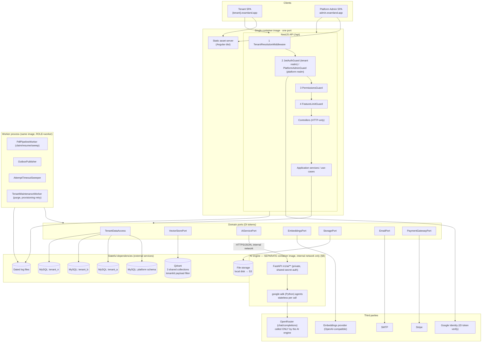
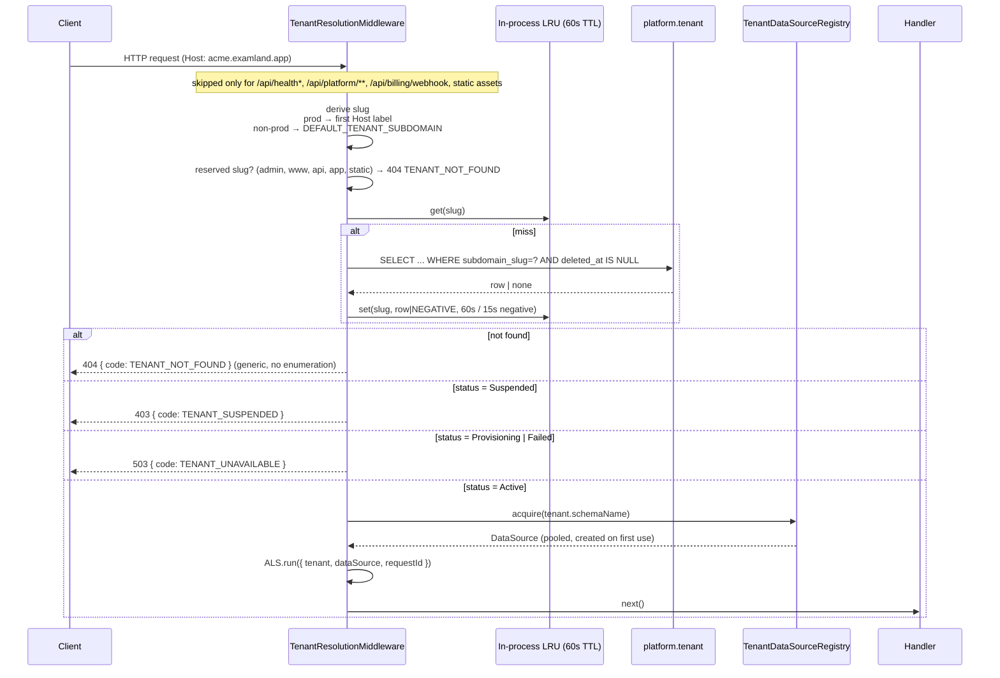
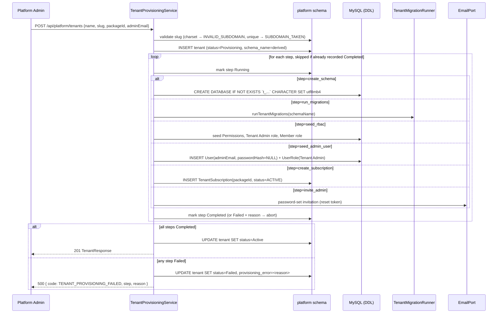

# ExamLand — High-Level Design (HLD)

**Status:** Canonical architecture for the Nexus pipeline build of ExamLand.
**Inputs:** `docs/PRODUCT_SPECIFICATION.md` (canonical spec), `docs/BACKLOG.md` (build order),
`docs/NEXUS_STATE.md` (binding constraints), `docs/raw input/*` (informative reference).
**Deployment model:** SaaS, multi-tenant, schema-per-tenant on one MySQL server instance.
**Companion:** `docs/architecture/LLD.md` (concrete modules, DDL, API contracts, sequences).

> **Reading rule for `nexus-dev`:** anything stated here or in the LLD is a decision, not a
> suggestion. Where an item is explicitly marked **OPEN (user)** it is blocked and must not be
> guessed at — those items are listed in §14 and were reported to the orchestrator.

> **AMENDED 2026-08-08 (targeted, post-Phase-1).** Two spec amendments (FR-AI-1..3, NFR-10, FR-MT-10)
> triggered a scoped rewrite of the AI subsystem plus an additive tenant-branding design. **The AI
> subsystem is now a standalone Python service** (`services/ai-engine`, Google ADK for Python +
> OpenRouter) behind `AiServicePort`. The previous in-process TypeScript-ADK design
> (`@google/adk`, `AiStepPort`, `PlainAiStep`, `LlmPort`) is **removed** — **§8.0 is the authoritative
> list of what is dead**; read it before touching anything AI-related. Sections changed: §1, §1.1, §2,
> §2.1, §3, §4.7 (new), §6.1a (new), §7.1, §8 (rewritten), §13.1, §14 item 6, §14a (new), §15.
> **Nothing already built and QA-green (tenancy, provisioning, auth, RBAC, Platform Admin console)
> is redesigned by this amendment** — see LLD §14.1 for the small set of shipped files it does touch.

> **AMENDED 2026-08-08 (final AI-subsystem decisions — supersedes three interim defaults above).**
> The user has answered §14a's open items. Three decisions changed and are now **final, not interim**:
> **(1)** the approved-model allowlist is **migration-seeded** with `anthropic/claude-3.5-haiku` as the
> platform default (§8.6, LLD §4.1) — it no longer ships empty/fail-closed; **(2)** **mTLS is now
> REQUIRED** between the API/worker containers and the AI engine (§8.3 rewritten, §8.5) — no longer
> deferred; **(3)** an **AI-less production deployment is explicitly permitted with no override flag**
> — `ALLOW_AI_DISABLED_IN_PROD` is deleted from the design entirely (§8.4). Sections changed: §8.3,
> §8.4, §8.5, §8.6, §13.1, §14a (items 1/3/4 now closed). LLD changes: §2, §2.1, §4.1, §7.10, §7.11,
> §9.9, §9.10, §14.1. Everything else in the 2026-08-08 amendment stands as written.

---

## 1. Stack and rationale

This is a greenfield repository (no package manifest, no `src/`, no prior code — only `docs/`).
The stack is therefore chosen fresh, but constrained by the binding mandates in
`docs/NEXUS_STATE.md` and spec §9.2.

| Layer | Choice | Options considered | Why chosen / rejected |
|---|---|---|---|
| Backend runtime | Node.js **24 LTS**, TypeScript 5.9 | Node 20 LTS, Node 22, Node 24 | Originally chosen because the TypeScript ADK required Node ≥ 24.13. **That reason is void as of the 2026-08-08 amendment (§8.0)** — the TypeScript ADK is gone. Node 24 is **retained** anyway: it is the current LTS line, it is already shipped and CI-pinned (`engines.node >= 24.13`), and downgrading a QA-green, deployed runtime for no benefit would be gratuitous churn. Nothing about AI depends on the Node version any more. |
| Backend framework | **NestJS 11** (`platform-express` adapter), modular monolith | NestJS, Fastify+custom, Express+custom | **Mandated** (spec §9.2). Independently the right call: DI-bound ports (NFR-6), guards/interceptors/pipes for the four stacked cross-cutting concerns this product needs (tenant resolution → auth → permission → feature limit), and one process that can also host the background workers behind a role flag. `platform-express` (not Fastify) because Stripe raw-body handling, `ServeStaticModule`, and HTTP range/stream file delivery are all best-trodden on Express. |
| Frontend | **Angular 20**, standalone components, signals | **Mandated** (spec §9.2) | Mandated. Fits the product: two admin-console-shaped surfaces (Platform Admin, Tenant Admin) plus one focused end-user flow (exam taking). |
| Database | **MySQL 8.4 LTS**, `utf8mb4` / `utf8mb4_0900_ai_ci` | **Mandated** (spec §9.2) | Mandated. Fits the data model in spec §6: fully relational, heavily joined, integrity-constrained, no document-shaped aggregates that would justify NoSQL. All flexible payloads (`optionsJson`, `applicableModulesJson`, outbox payloads) are narrow and are stored as MySQL `JSON` columns rather than motivating a second engine. |
| Tenant isolation | **Schema-per-tenant** (one MySQL database per tenant + one shared `platform` schema) on **one** MySQL server instance | Shared schema with `tenant_id`; database-per-server | **Mandated and closed** (spec §9.2, FR-MT-3). Not re-litigated. See §4. |
| ORM / data access | **TypeORM 0.3.x** over `mysql2`, one `DataSource` per tenant schema | Prisma (used by the reference implementation), Drizzle, raw `mysql2` + Kysely | **Deviation from the reference implementation — see §4.6 for the full argument.** Short form: FR-MT-5 requires an in-process, per-tenant, dry-run-capable, continue-on-error migration runner with a per-tenant success/failure report. TypeORM exposes migrations as a programmatic API on a `DataSource`; Prisma requires shelling out `prisma migrate deploy` once per tenant with a swapped `DATABASE_URL`, which makes dry-run and structured reporting awkward and adds a CLI dependency to a production code path. Second reason: a per-tenant `DataSource` is a thin `mysql2` pool over shared entity metadata, whereas a per-tenant `PrismaClient` instantiates its own query engine — materially heavier at "tens to low hundreds of tenants" (spec §9.4). |
| Vector store | **Qdrant 1.x** (REST), shared collections, mandatory `tenantId` payload filter | **Mandated** (spec §9.2) | Mandated, including the payload-filter partitioning shape. Isolation call made explicit and justified in §6. |
| LLM access | **OpenRouter** (`https://openrouter.ai/api/v1`, OpenAI-compatible), called **only from the Python AI engine** | **Mandated** (spec §9.2) | Mandated. **Amended 2026-08-08:** the `LlmPort`/`OpenRouterLlmAdapter` seam inside `apps/api` is removed (§8.0); the credential and the call both move into `services/ai-engine`. The model is still configuration rather than code, but it is now *per-tenant governed data* from the FR-AI-2 allowlist, not per-task env config (§8.6). |
| Embeddings | **Separate OpenAI-compatible embeddings provider** behind `EmbeddingsPort`; default `text-embedding-3-small` (1536 dims) | OpenRouter embeddings; self-hosted TEI/Ollama; Cohere/Voyage | Resolves the open item in `NEXUS_STATE.md` / spec §9.2. See §7.2 for the decision and the evidence. |
| AI orchestration | **Google ADK for Python (`google-adk`) in a standalone service** `services/ai-engine` (FastAPI/uvicorn, its own container image), reached over internal HTTP/JSON behind `AiServicePort`; durable cross-step orchestration stays in NestJS | ~~ADK for TypeScript (`@google/adk`) in-process~~ (**superseded**); Python service via gRPC; Python worker behind a message broker | **Mandated** (spec §4.6/FR-AI-1, user-directed 2026-08-08). The in-process TypeScript-ADK design is **removed** — see §8.0 for the full list of retired artifacts. Transport and rejected alternatives argued in §8.2; deployment shape in §8.5. |
| AI service ↔ API transport | **HTTP/1.1 + JSON (REST)**, one POST per operation, internal network, shared-secret bearer | gRPC/protobuf; message broker; SSE streaming | Matches every other integration in the system (no new toolchain/format), trivially mockable — which the existing e2e suite depends on — and payloads are small. Full argument and rejections in §8.2. |
| AI model governance | **Platform-schema allowlist** (`approved_ai_model`) + per-tenant assignment, resolved in NestJS and passed per request | Per-task env model chains (the original design); tenant free-text model entry | **Mandated** (FR-AI-2/FR-AI-3). Free-text tenant selection explicitly forbidden by the spec. §8.6. |
| Payments | **Stripe** (Checkout + webhooks) behind `PaymentGatewayPort` | Inherited decided choice (spec §9.3) | Carried forward. |
| Email | **Nodemailer/SMTP** behind `EmailPort`, no-op when unconfigured | Inherited decided choice (spec §9.3) | Carried forward. |
| File storage | **Local disk** behind `StoragePort`, S3-compatible adapter as designed target | Inherited decided choice (spec §9.3) | Carried forward. |
| Logging | **pino** (`nestjs-pino`) + `pino-roll` dated file sink + AsyncLocalStorage request context | winston + daily-rotate | pino for throughput and structured output; `pino-roll` gives the dated durable file NFR-6a demands with a non-throwing failure mode. |
| Packaging / hosting | **One container image**, one process, one port: Nest serves the compiled Angular `dist/` as static assets and the API under `/api`. A `ROLE=worker` env flag runs the same image as the background-worker process. | Split SPA on CDN + separate API service | Single unit chosen per the project default and spec §16: same-origin removes CORS for `{tenant}.examland.app`, one TLS/routing edge, one artifact for `nexus-deploy`. No requirement in the spec calls for independent frontend scaling or CDN placement. The worker is the *same image* with a different role flag, not a second artifact. |

### 1.1 Explicitly rejected alternatives worth recording

- **Microservices.** Rejected: exam authoring, the AI pipeline, and exam delivery share the tenant
  data handle and the question bank; splitting them would create distributed transactions across
  the finalize flow for no scaling gain at the stated scale (spec §9.4).
  - **Still true after the 2026-08-08 amendment.** The Python AI engine is **not** a step toward
    microservices: it owns no data, participates in no transaction, and is a *stateless compute
    function* behind one port (§8). The modular monolith remains the architecture; there are exactly
    two deployable images and only one of them has a database.
- **A second datastore for AI/vector metadata.** Rejected: everything except embeddings fits MySQL.
- **Redis.** Not adopted in the MVP; see §11.2 for the tenant-resolution cache trade-off this
  creates and §14 for the question it raises.
- **A durable job queue (BullMQ/SQS).** Explicitly deferred by spec §7.3/BL-38. Replaced by
  leased, DB-claimed interval workers (§10), which are multi-replica-safe without new infra.

---

## 2. System architecture



### 2.1 Component inventory

| Component | Kind | Responsibility | Scaling |
|---|---|---|---|
| Static asset server | In-process (Nest `ServeStaticModule`) | Serves Angular `dist/browser`, SPA fallback to `index.html` for non-`/api` paths | With API |
| API process | Stateless HTTP | All request-serving | Horizontal, N replicas behind LB |
| Worker process | Stateless polling | 4 interval workers, all DB-claim-leased | Horizontal (leases make it safe); default 1 replica |
| **AI engine** (`services/ai-engine`) | **Separate image**, stateless HTTP (FastAPI/uvicorn) | Executes one AI reasoning operation per request via `google-adk` (Python) → OpenRouter. Owns **no** database, **no** Qdrant client, **no** tenant data. Not reachable from the public internet. | Horizontal, independent of the API (NFR-10); default 1 replica, scale on AI load only |
| MySQL (one server) | Stateful | `platform` schema + one schema per tenant | Vertical first; read replica is the identified next step |
| Qdrant | Stateful | 3 shared collections | Single node MVP; Qdrant cluster is the upgrade path |
| File storage | Stateful | Uploaded PDFs, ZIPs, avatars, extracted images | Local disk (single volume) → S3-compatible |

---

## 3. Service and module boundaries

One deployable, but hard internal boundaries. A **module may only be reached through its
application-service interface**; no module imports another module's TypeORM entities or
repositories.

| Bounded context | Nest modules | Data scope | Depends on (allowed) |
|---|---|---|---|
| **Platform** | `PlatformAdminAuth`, `Tenants`, `TenantProvisioning`, `TenantMigrations`, `Features`, `Packages`, `Subscriptions`, `Billing`, `FeatureUsage` | `platform` schema only | Ports only |
| **Tenancy runtime** | `Tenancy` (resolution middleware, `TenantContext`, `TenantDataSourceRegistry`) | Reads `platform.tenant`; hands out tenant handles | `Tenants` (read), ports |
| **Identity** | `Auth`, `Users`, `Profile`, `PasswordRecovery` | Tenant schema | `AccessControl`, `Email`, `Storage`, `Tenants` (read: registration settings) |
| **Access control** | `AccessControl` (roles, permissions, guards) | Tenant schema | — |
| **Taxonomy** | `Taxonomy` | Tenant schema | — |
| **Exam authoring** | `ExamTypes` (incl. ZIP import, question-bank writer) | Tenant schema | `Taxonomy`, `Storage`, `VectorStore`, `Curricula` (link only) |
| **AI pipeline** | `PdfProcessing`, `Ai` (`AiServicePort` client + model resolution), `Generation` strategies | Tenant schema | `ExamTypes` (finalize/append), `Curricula` (retrieval + reference indexing), `Media`, `FeatureUsage` |
| **AI engine** (out-of-process) | *not a Nest module* — `services/ai-engine`, Python | **none** (stateless, receives everything per request) | OpenRouter only |
| **Curriculum / RAG** | `Curricula`, `Retrieval` | Tenant schema | `Storage`, `VectorStore`, `Embeddings` |
| **Practice** | `PromptPractice`, `LessonPractice` (P1) | Tenant schema | `Retrieval`, `Ai`, `ExamTypes` (bank read) |
| **Delivery** | `Attempts` | Tenant schema | `ExamTypes` (bank read) |
| **Media / files** | `Media`, `Files` (signed delivery) | Tenant schema | `Storage` |
| **Reliability** | `Outbox`, `Workers` | Tenant + platform schema | Everything (as consumers) |
| **Cross-cutting** | `Config`, `Logging`, `Health`, `Common` | — | — |

**Forbidden edges (enforced by review + an ESLint boundary rule):**

- No module in *Identity / Taxonomy / Exam authoring / AI pipeline / Curriculum / Practice /
  Delivery / Media* may inject `PlatformDataSource` or any platform repository. They read platform
  facts only via `TenantContext` (already-resolved tenant metadata) or the `FeatureUsage` /
  `Subscriptions` service interfaces.
- No module outside `src/infrastructure/**` may `import` `stripe`, `@qdrant/*`, `nodemailer`,
  `mysql2`, or `google-auth-library`. Domain and application code depend on ports.
- **`@google/adk` (TypeScript) is no longer a dependency of this repository at all** (§8.0). No
  file in `apps/api` may import it; the lint rule that previously confined it to
  `infrastructure/ai/adk/**` becomes a flat ban. No NestJS file calls OpenRouter directly either —
  `infrastructure/ai/ai-service/**` (the `AiServicePort` HTTP client) is the only place that talks
  to the AI engine, and the AI engine is the only thing that talks to OpenRouter.

---

## 4. Multi-tenancy made concrete

Isolation strategy is **fixed** at schema-per-tenant (spec §9.2). There is no
`TENANT_ISOLATION_MODE` switch and no shared-schema strategy stub in this build — the reference
implementation's configurable-strategy ADR (`docs/raw input/architecture/tenant-isolation-strategies.md`)
is superseded: a port with exactly one permitted implementation is indirection without benefit.
The `TenantDataAccess` abstraction still exists (services receive a handle, never a global
connection), which is what FR-MT-3 and NFR-4 actually require.

### 4.1 Naming and physical layout

| Item | Rule |
|---|---|
| Platform schema | `EXAMLAND_PLATFORM_SCHEMA`, default `examland_platform` |
| Tenant schema | `t_{sanitizedSlug(≤20)}_{first8(uuidNoDashes)}` — e.g. `t_acme_medical_9f3b21ac`. Deterministic, generated once at provisioning, stored in `platform.tenant.schema_name`, immutable. |
| Why not `tenant_{slug}` | MySQL identifiers cap at 64 chars; the slug alone may be 63 (FR-MT-1). The suffix also removes any chance of a name collision with a reserved/previous schema after a tenant delete+recreate on the same slug. |
| Sanitization | lowercase, `[a-z0-9]` kept, `-` → `_`, leading digits prefixed with `t_` (already true), collapse repeated `_` |
| Server settings required | `lower_case_table_names=1`, `max_connections ≥ 500`, `sql_mode` includes `STRICT_TRANS_TABLES`, `innodb_file_per_table=ON`, default charset `utf8mb4` |
| Charset/collation | `utf8mb4` / `utf8mb4_0900_ai_ci` on every schema and table. This collation is accent- and case-insensitive, which is what makes FR-TAX-2's case-insensitive duplicate detection and per-tenant email uniqueness fall out of plain unique indexes. |

Because every tenant schema lives on **one** MySQL server, a single connection can address any
schema with a qualified name (`` `platform`.`tenant_work_hint` ``). That property is used in
exactly one place by design — the outbox work hint (§10.3) — and is otherwise prohibited: a
tenant `DataSource` is created with `database: <tenantSchema>` and all its entity metadata is
unqualified, so an accidental cross-tenant query is not expressible through it.

### 4.2 Tenant resolution (FR-MT-2)



Key points:

- Resolution is the **first** middleware, before any guard or body parsing (FR-MT-2).
- The resolved context lives in an `AsyncLocalStorage` store, not on `req` alone, so worker code
  and logging use the identical accessor and no service ever reads `req`.
- The cache stores tenant metadata only — never credentials, never the `DataSource`.
- Negative caching (15s) exists so subdomain scanning cannot be used to hammer the platform store.
- **Platform Admin routes (`/api/platform/**`) are excluded from tenant resolution entirely.** They
  are served on any host; the SPA presents the console on `admin.examland.app`. A platform request
  never acquires a tenant handle except through the explicit, audited
  `TenantAdminOperationsService` used by provisioning/migration.

### 4.3 Connection management (FR-MT-3)

`TenantDataSourceRegistry` — a singleton, the only thing in the system that constructs a tenant
`DataSource`.

| Property | Value | Rationale |
|---|---|---|
| Structure | `Map<schemaName, {dataSource, lastUsedAt, refCount}>` + LRU eviction | FR-MT-3 mandates pooling + LRU |
| `TENANT_POOL_MAX` per tenant | 3 (default) | 3 × 30 resident tenants = 90 connections, comfortably under a tuned `max_connections=500` with headroom for the platform pool (10), the worker process (its own registry), and admin sessions |
| `TENANT_REGISTRY_MAX` resident tenants | 30 (default) | Bounded memory/connection footprint independent of tenant count |
| Eviction | Least-recently-used, **never while `refCount > 0`**; evicted `DataSource.destroy()` is awaited off the request path | Prevents destroying a pool mid-request |
| Creation | Lazy, on first request for that tenant; concurrent creations de-duplicated by an in-flight promise map | Avoids a thundering herd of `CREATE`s on cold start |
| Idle reaping | A `DataSource` unused for `TENANT_IDLE_TTL` (default 15 min) is destroyed even if under the LRU cap | Keeps idle tenants from holding connections overnight |
| Health | `mysql2` `enableKeepAlive`, `connectTimeout` 10s; on a fatal pool error the entry is discarded and rebuilt on next use | Survives MySQL restarts without a process restart |
| Metadata | **One shared `EntityMetadata` set**: all tenant `DataSource`s are built from the same entity array and the same migration array; only `database` and pool size differ | This is what guarantees every tenant schema is structurally identical |

Escape hatch documented, not built: if resident-tenant churn ever makes the registry thrash, the
next design is a *single* `mysql2` pool where each acquired connection issues `USE <schema>`
before the unit of work (`ChangeUserOrUse` strategy). It is rejected today because TypeORM cannot
express per-query schema switching on a shared `DataSource` without dropping to raw SQL for
everything, which would forfeit the entity/migration guarantees above.

### 4.4 Provisioning (FR-MT-4)

Idempotent, resumable, step-recorded. The step ledger (`platform.tenant_provisioning_step`) is
what makes "re-run resumes rather than duplicates" true without relying on inspecting the tenant
schema.



- The tenant is **never** `Active` before every step completes, so end users cannot reach a
  half-provisioned tenant (FR-MT-4).
- Retry endpoint: `POST /api/platform/tenants/:id/provisioning/retry` — allowed only from
  `Provisioning` or `Failed`; replays from the first non-`Completed` step. Every step is written to
  be independently idempotent (`CREATE DATABASE IF NOT EXISTS`, upsert-by-natural-key seeds,
  `INSERT ... ON DUPLICATE KEY UPDATE`).
- `TenantMaintenanceWorker` also retries tenants stuck in `Provisioning` with a stale
  `provisioning_heartbeat_at`, so a crashed API instance mid-provision self-heals.
- Cross-store atomicity is impossible (MySQL DDL is non-transactional, email is external), so the
  design is *forward-recovery with a ledger*, not a distributed transaction. That is exactly what
  FR-MT-4's "atomic, retriable workflow" is satisfiable as.

### 4.5 Migration rollout (FR-MT-5)

Two independent, versioned migration sets, never mixed:

| Set | Location | Applied to | Runner |
|---|---|---|---|
| Platform | `src/infrastructure/database/migrations/platform/*` | `examland_platform` | On API boot (guarded by an advisory lock row) and via CLI |
| Tenant | `src/infrastructure/database/migrations/tenant/*` | every tenant schema | CLI/ops endpoint only — **never** implicitly on boot |

`TenantMigrationRunner.runAll(options)`:

```
options: { mode: 'halt-on-error' | 'continue-on-error' (default halt),
           dryRun: boolean, tenantIds?: string[], concurrency: 1 }
```

- Sequential by default (FR-MT-5), `concurrency` fixed at 1 in the MVP.
- Per tenant: acquire a short-lived `DataSource` (not the request registry), take a MySQL named
  lock `examland_migrate_<schema>` so two operators cannot collide, run
  `dataSource.runMigrations({ transaction: 'each' })`, record the outcome in
  `platform.tenant_migration_run_item`.
- `dryRun` reports `pendingMigrations` per tenant and applies nothing — and still produces the
  full summary report (FR-MT-5 requires a summary "including in dry-run mode").
- Output: `platform.tenant_migration_run` (id, startedAt, finishedAt, mode, dryRun, totals) +
  one `tenant_migration_run_item` per tenant (status, appliedMigrations, error). This is the
  "which tenants already received the change" answer FR-MT-5 demands.
- **Backward-compatible-migration rule for `nexus-dev`:** because API replicas roll while tenant
  migrations are mid-batch, every tenant migration must be additive-safe (add nullable column →
  backfill → make non-null in a later release; never rename in one step). This is a hard
  convention, stated in the LLD §12.

### 4.6 Why TypeORM rather than Prisma (the reference implementation's choice)

Recorded because it is a deliberate divergence from the inherited material:

1. **FR-MT-5 is a first-class product requirement here**, not an ops afterthought: dry-run,
   continue-on-error, per-tenant structured results. TypeORM's `DataSource.showMigrations()` /
   `runMigrations()` / `undoLastMigration()` are ordinary in-process async calls returning data.
   Prisma's equivalent is a child-process `prisma migrate deploy` per tenant, whose only structured
   output is exit code + stdout, and whose "diff/dry-run" path is a separate `migrate diff`
   invocation. Wrapping a CLI N times per rollout inside the product is a worse foundation.
2. **Per-tenant client cost.** `new PrismaClient({datasources})` per tenant instantiates a query
   engine per client; a TypeORM `DataSource` reuses one compiled metadata graph and adds only a
   `mysql2` pool. With 30 resident tenants the difference is real memory, not theory.
3. **DDL and multi-schema access.** Provisioning needs raw `CREATE DATABASE` and named locks;
   TypeORM's `query()` on a bootstrap `DataSource` is the natural home. Prisma discourages raw DDL.
4. **Nest integration.** Request-scoped `EntityManager` from an ALS-held `DataSource` is a
   two-line provider; the equivalent Prisma pattern is a hand-rolled client registry anyway — so
   Prisma's ergonomic advantage (its main selling point) does not apply to this build's shape.

Accepted costs: TypeORM's typing is weaker than Prisma's generated client, and `synchronize` must
be **hard-off in every environment** (enforced in config validation — see LLD §12.1) because it
would silently diverge tenant schemas. Both are acknowledged and mitigated.

---

### 4.7 Tenant branding (FR-MT-10) — added by the 2026-08-08 amendment

Branding is **tenant configuration, not tenant business data**, so it lives on the existing
`platform.tenant` row alongside `logo_url` (which already existed) — no new table, no tenant-schema
change, and it is served by the already-public `GET /api/tenant/public-config` that the login screen
already fetches before render (LLD §10.2 `TenantConfigStore`). Concretely:

| Concern | Decision |
|---|---|
| Storage | `platform.tenant.logo_url` (existing) + new `platform.tenant.accent_color_override CHAR(6) NULL` (normalized uppercase `RRGGBB`, no `#`). `NULL` = platform default accent. |
| Override scope | Logo + accent only (FR-MT-10). The primary/secondary palette and the light/dark surface treatment come from `nexus-ux`'s baseline and are **not** tenant-configurable — there is deliberately no column for them. |
| Who writes it | Tenant Admin, for their own tenant only. Because `modules/**` may not touch platform repositories (§3 forbidden edges), the tenant-realm branding endpoints are **controllers hosted inside the `platform/tenants` module**, guarded by the tenant realm JWT + a `tenant.settings.manage` permission, operating on the already-resolved `TenantContext.tenantId` — never on a client-supplied tenant id. Platform Admins keep their existing `PATCH /api/platform/tenants/:id` path. |
| Validation | Server-side, always (never client-only): hex format → `INVALID_COLOR_FORMAT`; WCAG 2.2 AA non-text contrast (≥ 3:1) computed against **both** the light and dark surface colors of the baseline palette → `INSUFFICIENT_COLOR_CONTRAST` naming the computed ratio, the required minimum, and which surface failed. Never clamped to a "nearest passing" color. |
| Serving | Resolved (override-or-default) accent + logo URL are returned by `GET /api/tenant/public-config`; the SPA sets one CSS custom property (`--brand-accent`) on `:root`. FR-MT-7 email templates read the same resolved value, so in-app and email branding cannot drift. |
| Cache | A branding write invalidates `TenantResolutionCache` for that tenant, exactly as suspend/reactivate already do (§9.1) — the cached tenant row is what `public-config` is served from. |

---

## 5. Security model

### 5.1 Two structurally separate authentication realms (spec §3, NFR-4)

| | Tenant User token | Platform Admin token |
|---|---|---|
| Issued by | `POST /api/auth/login`, `POST /api/auth/google` | `POST /api/platform/auth/login` |
| Signing secret | `JWT_TENANT_SECRET` | `JWT_PLATFORM_SECRET` (**different secret**) |
| Algorithm | HS256 | HS256 |
| `iss` / `aud` | `examland` / `tenant` | `examland` / `platform` |
| Claims | `sub` = User.id, `tid` = tenant id, `tsl` = tenant slug, `typ` = `tenant-user`, `jti`, `iat`, `exp` | `sub` = PlatformAdmin.id, `typ` = `platform-admin`, `jti`, `iat`, `exp` |
| Roles/permissions | **Not** in the token. Resolved per request from the tenant schema. | n/a (single implicit super-scope) |
| Verified by | `JwtAuthGuard` (tenant secret + `aud=tenant` + `typ` check + **`tid` must equal the resolved tenant**) | `PlatformAdminGuard` (platform secret + `aud=platform` + `typ` check) |
| Lifetime | `JWT_TENANT_TTL`, default 60m, no refresh (spec §9.3) | `JWT_PLATFORM_TTL`, default 60m |

Three independent barriers make cross-realm replay structurally impossible: different secret
(signature fails), different `aud` (claim check fails), different `typ` (guard check fails). The
`tid`-vs-resolved-tenant check additionally prevents replaying `acme`'s token against
`globex.examland.app` even though both are tenant-realm tokens.

Permissions are deliberately **not** embedded in the token: FR-IAM-5/FR-IAM-7 allow a Tenant Admin
to revoke a role, and a 60-minute stale-permission window on a revocation is unacceptable. The
per-request resolution cost is one indexed two-join query, memoized for the request's lifetime.

### 5.2 Authorization model

**RBAC with fine-grained permissions** (FR-IAM-5), fail-closed:

```
User ──*─* Role ──*─* Permission        effective = union(roles → permissions)
```

- Guard order (each cheapest-and-most-decisive first, per spec §15):
  `TenantResolutionMiddleware` → `JwtAuthGuard` → `PermissionsGuard(@RequiresPermission)` →
  `FeatureLimitGuard(@RequiresFeature)`.
- `@RequiresPermission('exams.create')` — absent decorator on an authenticated route means
  "authentication only"; this is a conscious, reviewable default. Absence of a *grant* is always
  denial (`FORBIDDEN`).
- **Ownership (ABAC-ish) checks are not guards.** Per-record ownership (a Member's own Curriculum,
  own Attempt) is enforced inside the application service, because it needs the record. FR-CUR-1a
  is **decided as 403 `NOT_CURRICULUM_OWNER`** (not 404) for a non-owner inside the same tenant,
  applied consistently to Curricula, Curriculum documents, Attempts, and processing sessions:
  existence of a sibling record is not sensitive within a tenant, the spec names the code, and a
  403 is the actionable answer. Cross-tenant access cannot occur (different schema) so no 404
  variant is needed.
- Persona mapping:

| Persona | Realm | Mechanism |
|---|---|---|
| Platform Admin | platform | `PlatformAdminGuard`; reaches only `/api/platform/**`; never receives a tenant `DataSource` except via the audited provisioning/migration services |
| Tenant Admin | tenant | Seeded `Tenant Admin` role holding every tenant-scoped permission; `LAST_ADMIN_PROTECTED` invariant (FR-IAM-6) enforced in `UsersService` and `RolesService` |
| Member | tenant | Seeded `Member` role: `exams.read`, `attempts.*` (own), `curricula.*` (own), `practice.*`; ownership enforced per record |

### 5.3 Other security decisions

| Concern | Decision |
|---|---|
| Password hashing | bcrypt, cost `BCRYPT_COST` default 12; min 8 chars + configurable complexity, validated server-side (`WEAK_PASSWORD` naming the unmet rule) |
| Login enumeration | Single `INVALID_CREDENTIALS` for unknown email and wrong password; constant-ish work (a dummy bcrypt compare is run when the user is absent) |
| Reset tokens | 32 random bytes; **only the SHA-256 hash is stored**; single-use (cleared on use); 1h TTL; distinct `RESET_TOKEN_EXPIRED` vs `RESET_TOKEN_INVALID` |
| Google sign-in | `google-auth-library` `verifyIdToken({audience: GOOGLE_CLIENT_ID})`; requires `email_verified`; per-tenant toggle (`GOOGLE_SIGNIN_DISABLED` 403); unconfigured server → specific 401 |
| Rate limiting | `@nestjs/throttler`, in-memory per instance: 10/min on login/register/forgot-password per IP+email, 60/min default elsewhere. Per-instance only — documented limitation, Redis-backed store is the upgrade path |
| Signed file URLs | HMAC-SHA256 over `"{storageKey}|{expEpoch}"` with `FILE_SIGNING_SECRET`; base64url; `timingSafeEqual`; path normalized and asserted to stay under the storage root **before** signature checking (traversal rejected regardless of signature); `LINK_INVALID_OR_EXPIRED` distinct from 404 |
| Tenant-controlled strings in email | HTML-escaped before interpolation (FR-MT-7); logo URL validated as `http(s)` absolute URL |
| Uploads | Magic-byte checks (`%PDF-` for PDF, `PK\x03\x04` for ZIP, image sniffing for avatars), extension check, size cap, zip-slip rejection on every ZIP entry name |
| Secrets | Env only, validated at boot by a zod schema that **fails the process** on a missing required secret in production |
| Transport | TLS terminated at the edge (LB/reverse proxy); app sets HSTS, `X-Content-Type-Options`, `Referrer-Policy`, CSP for the SPA via `helmet` |
| CORS | Not needed for the tenant app (same origin). Enabled only for `CORS_ALLOWED_ORIGINS` (dev `localhost:4200`) |
| Audit | Every platform-admin mutation and every tenant-provisioning/migration action writes an `platform.audit_log` row (actor, action, target, before/after summary, ip) — required to make NFR-9 demonstrable |

### 5.4 Isolation auditability (NFR-9)

`GET /api/platform/tenants/:id/isolation-report` returns `{schemaName, mysqlHost, tableCount,
rowCountsByTable, qdrantPointCountsByCollection, storagePrefix}` computed live from
`information_schema` and Qdrant counts — the "demonstrate exactly which physical schema a tenant's
data lives in, and enumerate it independent of the application" requirement. The `schema_name` is
also printed in the isolation report and in every log line's context, so a DBA can run
`SELECT * FROM t_acme_9f3b21ac.user` with no application involvement.

---

## 6. Vector store: Qdrant deployment and tenant isolation

### 6.1 Decision

**Three shared collections for all tenants, partitioned by a mandatory `tenantId` payload filter
with `is_tenant: true` tenant indexing — not collection-per-tenant.**

| Collection | Vector | Payload (indexed fields in bold) | Purpose |
|---|---|---|---|
| `examland_chunks` | 1536, Cosine | **tenantId**, **curriculumId**, **documentId**, pageNumber, chunkIndex, fileName, text, embeddingModel | Curriculum document chunks — RAG retrieval (FR-CUR-2/3/4) |
| `examland_doc_fingerprints` | 1536, Cosine | **tenantId**, **fileHash**, sessionId, documentId | Whole-document semantic fingerprints — dedup (FR-PDF-2, P1 tier) |
| `examland_question_bank` | 1536, Cosine | **tenantId**, **scopeKey**, **examTypeId**, questionKey, moduleName, kind | Packaged questions — adaptive/lesson practice, similar-question tooling |

- `scopeKey = "{stageId}|{normalizedSubjectName}"` (carried forward from the reference design) so a
  single equality filter covers the (stage, subject) pair.
- **Point IDs are UUIDv5 in a per-tenant namespace**: `uuidv5(logicalKey, uuidv5(tenantId, NS_EXAMLAND))`.
  Deterministic (re-index upserts in place, per FR-PDF-7/FR-AUTH-6 idempotency) *and* collision-free
  across tenants, so even an ID-only operation cannot touch another tenant's point.
  - `examland_chunks`: `logicalKey = "{documentId}:{chunkIndex}"`
  - `examland_doc_fingerprints`: `logicalKey = "{fileHash}"`
  - `examland_question_bank`: `logicalKey = "{examTypeId}/{questionKey}"` (module name excluded, so a
    subject re-mapping overwrites the payload instead of orphaning a point)

### 6.1a Which service owns the Qdrant client (amendment decision, 2026-08-08)

**Decision: Qdrant and `EmbeddingsPort` stay entirely on the NestJS side. The Python AI engine has
no Qdrant client, no embeddings client, and no vector-store credentials.** NestJS resolves grounding
context *before* invoking an AI operation and passes the retrieved chunks inline in the request body
(§8.2). `retrieve_context` is therefore **no longer an agent tool** — it is a caller-side step.

Why, judged against the isolation bar in §6.2:

1. The whole isolation guarantee here is structural, not procedural: one adapter file, no method that
   accepts a raw filter, a mandatory `TenantScope` on every call, per-tenant UUIDv5 point-id
   namespacing, and post-filter leak alarms. Moving the client into Python would require
   **re-implementing and independently re-proving all five of those properties in a second language
   and a second test suite**, and would create a second place a defect could leak across tenants.
   That is a strict regression in a P0 isolation guarantee bought for no functional gain.
2. FR-AI-1 mandates the Python service be stateless with respect to tenant/business data. A Qdrant
   client scoped by a `tenantId` the service received over the wire *is* tenant data access — it
   would make the engine a tenant-data reader and put the burden of "did the caller send the right
   tenant id?" on a service that has no way to verify it. Keeping retrieval caller-side means the
   engine literally cannot address another tenant's data, because it holds no handle to any.
3. Vector concerns are already welded to NestJS-owned invariants that would have to be split:
   `vector_collection_meta` dimension guard at boot (§7.3), tenant purge (`purgeTenant`), the NFR-9
   isolation report's per-tenant point counts, FR-CUR-8 cascade deletes, and the question-bank
   write-through on finalize/append. None of those are AI-reasoning concerns.
4. Embeddings follow Qdrant for the same reason: an embedding is only ever produced to be written to
   or queried against a collection NestJS owns, and the model/dims must match the guard.

**Cost of this choice, stated plainly:** the agent cannot decide *mid-reasoning* to fetch more
context. Accepted, and it costs nothing today — every flow in LLD §8.3 already resolves grounding
once per document/batch at a fixed top-K (lesson 5, extraction 12, prompt practice 12) before the
model call, so no MVP behavior changes. If agent-driven iterative retrieval is ever wanted, the
designed upgrade path is a **callback channel** (the engine calls back to a dedicated, internal-token-
authenticated `POST /api/internal/ai/retrieve` on NestJS, which re-derives the tenant scope from the
request's own signed invocation token rather than trusting a body field) — deliberately **not** built
now, and explicitly not to be pre-built by `nexus-dev`.

### 6.2 Why shared collections clear the same isolation bar as MySQL

The MySQL decision buys isolation by never handing a service a handle capable of reaching another
tenant. The equivalent structural guarantee here is a **single chokepoint**:

1. `QdrantVectorStoreAdapter` is the only file in the codebase permitted to import the Qdrant
   client, and it exports **no** method that accepts a raw filter. Every method takes a
   `TenantScope` (obtained from `TenantContext`, never from a request body) and composes
   `must: [{key:'tenantId', match:{value: scope.tenantId}}, ...callerFilter]` internally.
2. The adapter is obtained through `VectorStorePort`; the concrete client is `private readonly` and
   never leaked. A caller *cannot express* an unfiltered query — the type system has no parameter
   for it.
3. **Defense in depth:** every search/scroll result is post-filtered on `payload.tenantId ===
   scope.tenantId`; a mismatch drops the point and emits a `vector.tenant_leak_suspected` error log
   + metric. A leak becomes a loud alarm, not silent data disclosure.
4. Deletes and scrolls have the same shape, so tenant purge is `deleteByFilter({tenantId})` per
   collection.
5. QA gets a specific mandated test: seed two tenants, assert every retrieval/search/scroll/delete
   surface returns nothing cross-tenant, and assert the adapter rejects a scope-less call at
   compile time (a `@ts-expect-error` test) — this is the analogue of "enforced at the data-access
   layer" in NFR-4.

Against the alternative:

| Option | Verdict |
|---|---|
| **Collection per tenant** (`examland_chunks__t_acme`) | **Rejected.** (a) Spec §9.2 explicitly mandates payload-filter partitioning, "not per-tenant collections". (b) Qdrant's own multi-tenancy guidance is a single collection with a tenant payload index for exactly this scale; per-collection segment/HNSW/memory overhead multiplies by tenant count × 3 collections (a 200-tenant deployment = 600 collections), and collection creation becomes a step in the provisioning workflow that can fail independently. (c) It would *weaken* the operational story: 600 collections to migrate on a dimension change. |
| **Separate Qdrant instance per tenant** | Rejected: absurd at this scale, and contradicts the mandate. |
| **Shared collections, tenant filter, `is_tenant: true`** | **Chosen.** With `is_tenant: true` on the `tenantId` keyword index, Qdrant physically co-locates each tenant's vectors on disk, which recovers most of the locality benefit of separate collections while keeping one collection to operate. |

Residual risk accepted and stated plainly: a defect *inside the single adapter file* could leak
across tenants, whereas in MySQL it would take a defect in the connection registry. Both are
single, small, heavily-tested files; the exposure is comparable and the mandate is respected.

### 6.3 Operational rules

- Collections are created idempotently at boot by a `VectorBootstrapService` (one `ensureCollection`
  call site per collection), including payload indexes. Boot **fails** if an existing collection's
  vector size ≠ configured `EMBEDDING_DIMS` (see §7.3).
- All hot-path vector **writes** (question-bank write-through on finalize/append/re-map/ZIP import)
  are fire-and-forget after the authoritative MySQL write, logged on failure. A Qdrant outage
  never fails an exam-authoring write (NFR-3, spec §17).
- All vector **reads** degrade: retrieval returning zero chunks is a valid state
  (ungrounded generation with lowered confidence per spec §13.10), not an error.
- Backfill/reindex CLI: `npm run vector:reindex -- --tenant=<id|all> [--collection=] [--dryRun]`.

---

## 7. LLM and embeddings integration

### 7.1 OpenRouter for chat/completions

**Amended 2026-08-08: this whole seam now lives inside the Python AI engine (§8), not in NestJS.
`LlmPort` and `OpenRouterLlmAdapter` are removed from `apps/api`.** NestJS holds no OpenRouter
credential and makes no model call. The behaviors below are unchanged as *requirements* — they are
now requirements on `services/ai-engine`:

- Base URL `OPENROUTER_BASE_URL` (default `https://openrouter.ai/api/v1`), OpenAI-compatible
  `POST /chat/completions`. Auth `Authorization: Bearer $OPENROUTER_API_KEY`, plus the attribution
  headers OpenRouter expects (`HTTP-Referer`, `X-Title`). **These env vars now belong to the AI
  engine's container, not the API container.**
- **Model selection is no longer per-task config; it is per-tenant governed data (FR-AI-2/FR-AI-3).**
  The `LLM_CHAIN_CLASSIFY_CONTENT`/`_GENERATE_QUESTIONS`/`_EXTRACT_ANSWERS`/`_QUALITY_CHECK`/
  `_CLASSIFY_SUBJECT` env vars are **removed/superseded**. NestJS resolves the tenant's effective
  model from the platform allowlist (§8.6) and sends `model` (and `fallbackModel` = the platform
  default, when it differs) in every request body. The engine never chooses a model on its own and
  never reads a model id from its own environment.
- Resilience inside the engine, carried forward unchanged from spec §13.6: primary model →
  bounded retry (2 attempts, 1s/2s backoff) restricted to 429/5xx/network → then, only for a hard
  model-level rejection (400/404 "no such model"/"model unavailable"), one attempt on
  `fallbackModel` → hard 90s per-attempt wall-clock timeout raced independently of the HTTP client.
  The engine's total budget must stay below the caller's `AI_SERVICE_TIMEOUT_MS` (§8.4).
- **Cost accounting is reported, not owned.** The engine sends `usage: { include: true }`, and
  returns a `usage` block (`model`, `promptTokens`, `completionTokens`, `costUsd|null`,
  `costUnavailable`, `latencyMs`, `attempts`) in every response, including error responses where a
  billable call was made. **NestJS remains the system of record**: it writes the `ai_call_log` row
  and increments the session's `tokens_used`/`total_cost` from that block, so NFR-7/FR-PDF-12
  auditability does not depend on the engine having a database. If a `/models` price lookup is
  unavailable, the engine reports `costUsd: null, costUnavailable: true` rather than guessing.
- **Structured output**: the engine requests JSON via `response_format: {type:'json_schema'}` when
  the model advertises support (cached `GET /models` capability list, 24h), else strict-JSON
  prompting + fence-stripping. Either way the result is validated against the operation's pydantic
  schema *inside* the engine, and a per-item validation failure drops that item only and reports it
  in `droppedItems` (FR-PDF-4). NestJS additionally re-validates the response envelope with zod at
  the port boundary — two-sided validation, because the engine is now an untrusted network peer.

### 7.2 Embeddings — resolution of the open item

**Decision: embeddings do NOT go through OpenRouter. `EmbeddingsPort` is bound to a separate,
OpenAI-compatible embeddings provider, configured by base URL + model + dimensions.**

Reasoning:

1. OpenRouter's API surface is chat/completions-oriented (`/chat/completions`, `/completions`,
   `/models`, plus auxiliary generation/credit endpoints). It does **not** expose a stable,
   general-purpose `/embeddings` route equivalent to OpenAI's, and the platform's model catalog is
   organized around chat/multimodal generation. Building FR-CUR-2 (every ingestion), FR-CUR-3
   (every search), and FR-PDF-2 (fingerprints) on an endpoint we cannot rely on being present is an
   unacceptable dependency for a P0 feature.
2. The mandate's *intent* — "model-agnostic gateway, not a direct provider SDK, so the model is
   configuration" — is fully preserved: the embeddings adapter is itself provider-agnostic (any
   OpenAI-compatible `/embeddings` endpoint), so OpenRouter remains swappable and, if OpenRouter
   ships an embeddings route later, the change is `EMBEDDINGS_BASE_URL` + `EMBEDDINGS_MODEL` in
   config with **zero code change**.
3. Spec §9.2 explicitly authorizes this: "bind the embeddings port to a separate
   embeddings-capable provider behind the same port abstraction (NFR-6)".

Concrete binding:

```
EmbeddingsPort  (domain)
  embed(texts: string[]): Promise<number[][]>       // batched, order-preserving
  readonly model: string
  readonly dims: number

OpenAiCompatibleEmbeddingsAdapter   (default, HTTP POST {base}/embeddings)
  EMBEDDINGS_BASE_URL   default https://api.openai.com/v1
  EMBEDDINGS_API_KEY    required
  EMBEDDINGS_MODEL      default text-embedding-3-small
  EMBEDDING_DIMS        default 1536
  EMBEDDINGS_BATCH_SIZE default 100      // results re-ordered to input order
LocalTeiEmbeddingsAdapter (alternative binding, same port: HuggingFace TEI / Ollama, no external vendor)
NullEmbeddingsAdapter     (dev/test only: deterministic hash-based pseudo-vectors, refuses to load when NODE_ENV=production)
```

Default target provider is OpenAI `text-embedding-3-small` (1536 dims) — carried forward from the
reference implementation's proven parameters (spec §13.8) so chunking, top-K and the 0.97
fingerprint threshold remain calibrated. **OPEN (user):** which embeddings vendor/credential to
actually use in production (§14, item 1) — the code is vendor-neutral either way, but a key must
be supplied or `LocalTeiEmbeddingsAdapter` selected.

### 7.3 Embedding-model/version safety

An embedding model change invalidates every stored vector. Guarded structurally:

- `platform.vector_collection_meta(collection, embedding_model, dims, created_at)` records what a
  collection was built with.
- Boot compares config ↔ `vector_collection_meta` ↔ live Qdrant collection config. Any mismatch
  **fails startup** with a message naming the required action (`npm run vector:reindex`).
- Every chunk payload also carries `embeddingModel`, so a partial reindex is detectable.

---

## 8. AI subsystem: the standalone Python AI engine

### 8.0 What this section replaces (REMOVED / SUPERSEDED — read this first)

This section was rewritten on **2026-08-08** by a targeted architecture amendment following the spec
amendment that added **FR-AI-1..3** and **NFR-10** (spec §4.6, §9.2). The following are **dead
design. They are removed from this architecture and must not be implemented, referenced, or
resurrected:**

| Removed artifact | Status |
|---|---|
| `@google/adk` (the **TypeScript** ADK) as an `apps/api` dependency | **REMOVED.** Not a dependency of this repository. The Python `google-adk` package is used instead, and only inside `services/ai-engine`. |
| `AiStepPort<TIn, TOut>` | **REMOVED.** Replaced by `AiServicePort` (§8.2, LLD §3). |
| `AdkAiStep`, `src/infrastructure/ai/adk/**`, `agent-definitions/`, `tools/retrieve-context.tool.ts`, `tools/emit-questions.tool.ts` | **REMOVED.** No ADK code exists in `apps/api`. |
| `PlainAiStep`, the `AI_ENGINE=plain` fallback, and the whole "two implementations of one step port" de-risking scheme | **REMOVED.** The Python service is the single implementation. `AI_ENGINE` survives only as `enabled|disabled` (fail-closed switch, FR-AI-1). |
| `LlmPort` / `OpenRouterLlmAdapter` in `apps/api`, and the `LLM_CHAIN_*` per-task model config | **REMOVED.** NestJS makes no LLM call and holds no OpenRouter key; model choice is per-tenant governed data (§8.6), not per-task env config. |
| "Node 24 is adopted **precisely so ADK runs in-process with no sidecar**" | **SUPERSEDED.** Node 24 remains the pinned engine (it is already shipped and CI-pinned), but the *reason* is void: there **is** now a separate service. Nothing about the Node version is load-bearing for AI any more. |
| `retrieve_context` as an agent tool | **REMOVED.** Grounding is retrieved by NestJS and passed inline (§6.1a). |
| HLD §14 item 6 ("accept `@google/adk` as a P0 dependency") and the `ADK-SPIKE` task framing | **SUPERSEDED** by §14 item 6 as rewritten below. |

What is **explicitly unchanged** by this amendment, and re-confirmed here because FR-AI-1 says so:
**NestJS retains sole ownership of durable cross-step state** — `pdf_processing_session.status`, the
`last_completed_page` watermark, `heartbeat_at`/`worker_id` leases, `resume_attempts`, and the
per-session token/cost budget. The service boundary changes *where a reasoning step executes*, not
*which side owns durable state*. Every design rule in §10.3 and LLD §9.2/§10.1 stands as written.

### 8.1 The boundary decision

| Concern | Owner | Why |
|---|---|---|
| Durable pipeline state, watermark, lease, heartbeat, resume, budget | **NestJS** | FR-REL-2/FR-REL-3 need durable, leasable, SQL-queryable, HTTP-pollable job state. Unchanged from the original design. |
| Cross-step iteration (page 1..N, batch 1..M, watermark between units) | **NestJS** | Each unit is persisted before the watermark advances (FR-REL-2). |
| Budget check before each unit | **NestJS** | FR-PDF-12's graceful `Completed` outcome must be decided by the state owner, not by the thing being budgeted. |
| Grounding retrieval (embed query → Qdrant search) | **NestJS** | §6.1a — preserves the single-chokepoint tenant-isolation guarantee. |
| **One AI reasoning operation** (classify content, one lesson-generation batch, one exam-extraction page, one subject-classification batch, one prompt-practice generation) | **Python AI engine** (`google-adk`) | This is the only thing that moves. Agent construction, typed-tool output, intra-operation generate→review rounds, prompt assembly, and the OpenRouter call all live here. |
| Model call, model retry/fallback, structured-output coercion, usage reporting | **Python AI engine** | §7.1. |
| Tenant/business data of any kind | **NestJS** | The engine has no DB, no Qdrant, no tenant table. Everything it needs arrives in the request body. |

**Rule for `nexus-dev`:** application services depend on **`AiServicePort` only**. There is no
second AI path, no direct HTTP call to the engine from application code, and no in-process LLM call
anywhere in `apps/api`.

### 8.2 Transport and integration contract

**Chosen transport: synchronous HTTP/1.1 + JSON (REST), one `POST` per AI operation, over the
internal container network.** Base URL `AI_SERVICE_BASE_URL` (e.g. `http://ai-engine:8081`),
route shape `POST /v1/ai/{operation}`.

Why REST, with the alternatives judged:

| Option | Verdict |
|---|---|
| **HTTP/JSON REST** | **Chosen.** Every other integration in this system is REST/JSON (OpenRouter, embeddings, Qdrant, Stripe), so it adds no new operational concept, no new toolchain, and no new failure mode to reason about. It is trivially curl-testable and mockable, which matters because LLD §12.4's e2e suite already stubs the AI boundary. FastAPI + pydantic on the Python side and one typed client + zod on the Nest side give schema validation on both ends with no codegen step. Request/response bodies are small (a page of text, a handful of chunks, ≤10 questions) — well inside comfortable JSON territory. |
| gRPC / protobuf | Rejected. Would introduce a `.proto` toolchain, codegen, and a second serialization format into a repo whose contract layer (`packages/contracts`) is deliberately zero-dependency TypeScript types. The wins (streaming, binary framing) buy nothing here: payloads are small and the results are batch objects, not token streams. |
| Message queue / broker (RabbitMQ, Redis Streams) | Rejected. NestJS **already** owns durable work distribution via DB-leased sessions + `tenant_work_hint` (§10.1/§10.2), specifically chosen so no broker is needed (spec §7.3 defers queues). Adding a broker only for AI calls would create a *second*, parallel durability mechanism for the same jobs — exactly the "second system of record" failure the original design avoided — and would break FR-CUR-5's synchronous prompt-practice request path. |
| SSE/WebSocket streaming | Rejected for MVP. No requirement streams partial AI output to a user; progress is already polled per session (FR-PDF-1). Left as a non-breaking future addition (a new route), not designed now. |

**Contract shape (full DTOs in LLD §3 / §7.11):** every request body is
`{ meta, model, budget?, input }`, and every response is
`{ ok: true, usage, data } | { ok: false, usage?, error: { code, message, details? } }`.

- `meta = { tenantId, correlationId, processingSessionId?, userId?, operation }` — `tenantId` is
  carried **for logging, quota attribution, and leak-tracing only**; the engine performs no lookup
  with it. This is what keeps the engine stateless with respect to tenant data (FR-AI-1).
- `model = { primary: string, fallback?: string }` — resolved OpenRouter model ids supplied by
  NestJS from the platform allowlist (§8.6, FR-AI-3). The engine **rejects a request with no
  `model.primary`** (`AI_MODEL_NOT_SUPPLIED`, 400) rather than substituting a default of its own —
  fail-closed, so a NestJS resolution bug can never silently bill an unapproved model.
- `budget = { tokensRemaining, costRemainingUsd }` — **advisory**, so the engine can cap
  `max_tokens` sensibly. The authoritative FR-PDF-12 decision stays in NestJS before each unit.
- `input` is operation-specific and **already includes any grounding**:
  `grounding: [{ text, fileName, pageNumber, score }]` retrieved caller-side (§6.1a). An empty array
  is a valid, expected state (ungrounded generation with lowered confidence, LLD §9.3).
- `usage = { model, promptTokens, completionTokens, costUsd|null, costUnavailable, latencyMs, attempts }`
  is returned on **both** success and failure whenever a billable call was made, so a failed call is
  still accounted for (NFR-7).
- Confidence *calibration* stays in NestJS (`calibrateConfidence`, LLD §9.3) — the engine returns
  raw model-reported confidence plus `answerSource`, and never the final stored score. One pure
  function remains the single authority.

**The five operations** (unchanged in behavior from the original §8.3 — only the execution location
moves):

| Operation route | FR | Grounding passed in | Notes |
|---|---|---|---|
| `POST /v1/ai/classify-content` | FR-PDF-3 | none | Unrecognized label is returned as-is; NestJS raises `UNRECOGNIZED_CONTENT_TYPE`, never coerces |
| `POST /v1/ai/generate-lesson-batch` | FR-PDF-4, FR-PDF-13 | topK 5 | ≤10 questions/call; `coveredConcepts` (cap 80) passed in by the orchestrator; optional review round (≤2) internal to the operation |
| `POST /v1/ai/extract-exam-page` | FR-PDF-5 | topK 12, resolved once per document by the caller | Emits `answerSource: provided\|inferred`; pages <20 chars are skipped by NestJS and never sent |
| `POST /v1/ai/classify-subject` | FR-PDF-7, FR-AUTH-6 | none | Batched; caller filters already-mapped questions → idempotent |
| `POST /v1/ai/prompt-practice` | FR-CUR-5 | topK 12 | Synchronous request path, ≤30 questions |

### 8.3 Service-to-service authentication and network exposure

> **AMENDED 2026-08-08 (final): mTLS is REQUIRED.** The earlier "plain internal network + shared
> secret, mTLS deferred" default is **superseded** by an explicit user decision. All internal
> NestJS→engine traffic is now **HTTPS with mutual certificate authentication**. The shared-secret
> bearer is **retained as defense in depth** (see the rationale below), so this is an *addition*, not
> a swap.

This is **internal, non-tenant-facing traffic**. Three independent controls, **all required**:

1. **Network isolation.** The engine publishes **no host port**. In docker-compose it is
   attached only to the internal `examland-internal` network with no `ports:` mapping; in Kubernetes
   it is a `ClusterIP` Service with **no Ingress/Route**, plus a `NetworkPolicy` whose only allowed
   ingress source is the pods labelled `app=examland-api` (both `ROLE=api` and `ROLE=worker`), and
   whose egress is limited to DNS + OpenRouter (443). `nexus-deploy` must not expose it.
2. **mTLS (§8.3.1).** The engine listens **only on TLS** (`https://ai-engine:8443`) and accepts a
   `/v1/**` request only from a client presenting a certificate issued by the deployment's internal
   CA whose subject CN matches `AI_SERVICE_CLIENT_CN`. NestJS in turn verifies the engine's server
   certificate against the same CA, with hostname verification on.
3. **Shared-secret bearer token (defense in depth, retained).** Every request carries
   `Authorization: Bearer $AI_SERVICE_TOKEN`. The engine compares it with a **constant-time**
   comparison, returns `401 AI_UNAUTHORIZED` with no detail on mismatch, and **refuses to start** if
   the variable is empty or shorter than 32 chars (fail-closed, mirroring the API's own production
   secret assertions). The token is a deploy-time secret shared by exactly the two containers; it is
   never sent to a browser, never logged, and rotated by redeploying both.
   - `X-Request-Id` (the NestJS `correlationId`) is forwarded so one request is greppable across
     both services' logs.

**Why keep the bearer token now that mTLS exists?** It is not redundant in practice, and it costs one
already-implemented header comparison:
- The two controls fail *independently*. A CA/PKI failure mode (a mis-scoped internal CA, a leaf
  certificate mounted into the wrong pod, a cert-manager `Issuer` accidentally shared with another
  workload, an operator temporarily loosening TLS to debug) does not also hand over the token, and a
  leaked token does not yield a valid client certificate.
- It gives a **readable, non-PKI failure mode**: a missing token is a crisp `401 AI_UNAUTHORIZED`
  from application code with a log line, whereas a TLS handshake failure surfaces as an opaque
  transport error. During BL-12a development this materially shortens the debugging loop.
- It keeps the engine's own auth check meaningful when TLS is terminated by a sidecar/mesh in some
  future topology, where the engine would otherwise see only plaintext localhost traffic.
- Removing it would mean deleting an already-designed, already-specified control to gain nothing.
  **Decision: both are mandatory; neither may be disabled in staging or production.**

#### 8.3.1 Certificate issuance, trust and rotation (binding input for `nexus-deploy`)

The design deliberately uses **one private CA per deployment** (not per environment shared, not a
public CA), because the only relying parties are two containers we own, and a private CA makes the
authorization decision ("was this leaf issued by *our* CA, for *our* expected identity") exact.

| Concern | Kubernetes / Helm (staging + production) | docker-compose (local dev + CI) |
|---|---|---|
| CA | **cert-manager**: a bootstrap `Issuer{selfSigned}` issues one long-lived (10-year) CA `Certificate` into `Secret/examland-internal-ca`, which backs a namespace-scoped `Issuer{ca}` named `examland-internal`. Nothing outside the namespace can use it. | A one-shot **`certs-init`** service (image `smallstep/step-cli`) runs `step certificate create` to produce a self-signed CA plus the two leaves into a shared named volume `examland-certs`. Both services declare `depends_on: {certs-init: {condition: service_completed_successfully}}`, so certs always exist before either process starts. |
| Engine server cert | `Certificate/ai-engine-server` from that `Issuer`: `dnsNames: [ai-engine, ai-engine.<ns>.svc, ai-engine.<ns>.svc.cluster.local]`, `usages: [server auth]`, `duration: 2160h` (90d), `renewBefore: 720h` (30d). Mounted at `/etc/examland/tls/`. | `ai-engine.crt/.key` with SAN `ai-engine`,`localhost`, 90-day validity. |
| API client cert | `Certificate/examland-api-client`: `commonName: examland-api`, `usages: [client auth]`, same duration/renewal. Mounted into **both** the `ROLE=api` and `ROLE=worker` pods at `/etc/examland/tls/`. | `examland-api.crt/.key`, `CN=examland-api`. |
| Trust distribution | Both workloads mount `ca.crt` from their own cert Secret (cert-manager writes the issuing CA into each). No cluster-wide trust bundle, no OS trust-store mutation. | `ca.crt` in the same shared volume. |
| Leaf rotation | **Automatic and non-disruptive**: cert-manager rewrites the Secret at 2/3 lifetime; the engine and the Nest client both **re-read their cert/key/CA files on file-mtime change** (a watcher that rebuilds the TLS context / `https.Agent`), so rotation needs no restart. A restart is also always safe, so a deployment that prefers `reloader`-style pod recycling is acceptable. |
| CA rotation | **Manual, with an overlap window**, and deliberately rare (10-year CA). Procedure: issue the new CA → distribute a **concatenated two-CA trust bundle** to both sides → re-issue both leaves from the new CA → remove the old CA from the bundle. Both sides therefore must accept a `ca.crt` file containing **multiple** PEM blocks. Documented so a CA change is never a big-bang outage. |
| Revocation | **No CRL/OCSP.** With exactly two leaves in a private namespace, revocation is "re-issue the CA and rotate" (above). Building CRL distribution for a two-party PKI would be unjustified complexity. |
| Verification, engine side | uvicorn is started with `ssl_certfile`/`ssl_keyfile`/`ssl_ca_certs` and `ssl_cert_reqs=CERT_OPTIONAL` — the TLS layer validates a presented client chain against the CA but does not reject a bare connection at handshake time, **so container/kubelet health probes still work**. A FastAPI middleware then **requires** a verified peer certificate whose CN equals `AI_SERVICE_CLIENT_CN` (default `examland-api`) for every `/v1/**` route, returning `401 AI_UNAUTHORIZED` otherwise. `/healthz` and `/readyz` are the only exempt routes, and they expose nothing. This split is what keeps "mandatory client auth on every real request" true without inventing a second plaintext listener. |
| Verification, NestJS side | One `https.Agent` (`ca`, `cert`, `key`, `rejectUnauthorized: true`, `servername: AI_SERVICE_TLS_SERVER_NAME`) constructed once in `AiServiceClient` (LLD §9.9) — hostname verification stays **on**; `rejectUnauthorized: false` is banned and asserted against in config validation. A TLS failure is classified as a **connection error**, so it retries and trips the breaker exactly like a dead engine (§8.4) rather than becoming a new failure mode. |
| Local dev escape hatch | `AI_TLS_REQUIRED=false` (engine) + an `http://` base URL is permitted **only** when `NODE_ENV`/`ENV` is `local`/`test`, so unit tests and a contributor's laptop are not forced through a PKI. Production and staging config validation **hard-fail** if TLS is off or the base URL is not `https://` — the same fail-fast posture as the existing secret assertions. |

**`nexus-deploy` must therefore provision certs in both targets**: a `certs-init` one-shot service +
shared volume in `docker/docker-compose.dev.yml`, and cert-manager `Issuer`/`Certificate` resources +
Secret volume mounts (into the api pod, the worker pod, **and** the engine pod) in the Kubernetes/Helm
manifests. This is a new deploy-time responsibility introduced by this amendment and is called out
again in §8.5 and §13.1.

### 8.4 Durability, timeouts, retries, circuit breaking (FR-AI-1, FR-REL-2/3)

NestJS treats an AI-engine call as **exactly what it is: one network call to an unreliable external
dependency** — the same category as OpenRouter was before, not a new category. The orchestration
model of §10.3/LLD §9.2 is untouched: one unit = one engine call = one transaction that persists the
unit *and* advances the watermark.

| Control | Value / behavior |
|---|---|
| Per-call timeout | `AI_SERVICE_TIMEOUT_MS`, default **120000** — deliberately **greater** than the engine's own 90s per-model-attempt budget, so the inner model retry/fallback owns model-level failure and the outer timeout only ever fires on a genuinely wedged engine. Enforced with an `AbortController`, raced independently of the HTTP agent. |
| Connect timeout | `AI_SERVICE_CONNECT_TIMEOUT_MS`, default 3000 — a down engine is detected fast, not after 2 minutes. |
| Retry | 2 attempts total, 1s then 2s backoff with ±20% jitter, **only** on connection error, timeout, 429, or 5xx. Never on 4xx (a 4xx from the engine is our bug, not a transient). |
| Circuit breaker | Per-process, per-engine: 5 consecutive failures inside 60s → **open for 30s** → half-open (1 probe). While open, calls fail **immediately** with `AI_SERVICE_UNAVAILABLE` and cost no wall-clock time — this is what stops a dead engine from burning every worker tick on timeouts. |
| Idempotency | Every operation is a pure function of its request body (no engine-side state), so a retry after an ambiguous timeout is safe. Duplicate *cost* is possible on a retried in-flight call; accepted and bounded by the retry cap, and visible because `usage` is logged per attempt. |

**Failure semantics, per FR-AI-1:**

- **Background pipeline (FR-PDF-*)**: `AI_SERVICE_UNAVAILABLE` after retries ⇒ the unit is **not**
  persisted, the watermark does **not** advance, the error is logged with the session id, and the
  worker **releases the session leaving `status='Processing'`**. `StaleSessionRecoveryWorker` re-claims
  it after the heartbeat lapses and resumes from `last_completed_page` (FR-REL-3) — i.e. an AI outage
  is automatically retried later with zero lost work. After `MAX_RESUME_ATTEMPTS` it becomes `Failed`
  with `SESSION_RECOVERY_EXHAUSTED`, exactly as already designed. It **never** crashes the worker and
  never fabricates output.
- **Synchronous paths (FR-CUR-5 prompt practice)**: `503 AI_SERVICE_UNAVAILABLE`, with a
  `Retry-After: 30` header when the breaker is open.
- **Budget exhaustion** is decided before the call, so it still produces a graceful `Completed` +
  `budget_exhausted=1` (FR-PDF-12) and is not affected by any of the above.
- **Not configured at all** (`AI_ENGINE=disabled`, or `AI_SERVICE_BASE_URL`/`AI_SERVICE_TOKEN`
  empty): **fails closed** *per feature*. Every AI-dependent endpoint returns `503 AI_DISABLED`
  immediately, no call is attempted, and no session leaves `Pending`. Everything else — auth, exam
  taking, authoring, taxonomy, billing, the Platform Admin console — is fully functional.
  - **AMENDED 2026-08-08 (final): an AI-less production deployment is explicitly PERMITTED, with no
    override flag.** `ALLOW_AI_DISABLED_IN_PROD` is **removed from the design entirely** (it is not a
    config var, not a production assertion, and must not be implemented). `AI_ENGINE=disabled` is a
    first-class, supported production topology: the operator simply does not deploy the
    `examland-ai-engine` image, and the platform runs as an AI-free product. Production config
    validation must **not** fail, warn-and-exit, or require any acknowledgement for it.
    - This required **no new design**, only a deletion: `/api/health/ready` already reports AI as a
      **non-fatal `degraded` field** (§12/LLD §7.10) precisely so an absent or dead engine cannot pull
      the deployment out of the load balancer, and NFR-10 already requires that an AI outage degrade
      only AI-dependent features. When `AI_ENGINE=disabled` the readiness payload reports AI as
      `disabled` (not `degraded`, not an error) and readiness stays `true`.
    - The only remaining safety property is the one that still matters: a *misconfiguration* must not
      silently masquerade as a deliberate opt-out. So `AI_ENGINE=enabled` with a missing/invalid
      `AI_SERVICE_BASE_URL`, `AI_SERVICE_TOKEN`, or TLS material still **fails startup** in
      production. "AI off" is only ever reached by setting `AI_ENGINE=disabled` explicitly, never by
      dropping a variable.
    - **Flagged for a later dev/UX phase (not fixed here):** UI surfaces built for AI-dependent
      features (PDF generation wizard, prompt practice, AI-model visibility in tenant settings) must
      not assume AI is always present. They need a defined empty/disabled state driven off a
      capability flag rather than rendering a control that always 503s. That is a `nexus-ux` +
      `nexus-dev` concern for the phases that build those screens (BL-13/14/15/18/25 and BL-09a's
      tenant-facing read-only model view), and is deliberately **not** resolved in this architecture
      amendment.
- **Engine-reported malformed model output** (`AI_OUTPUT_INVALID`, 422): treated as
  "this unit produced nothing" — logged, items dropped, **not** retried, the pipeline continues
  (FR-PDF-4's per-item tolerance). This is a content failure, not an availability failure, and must
  not open the circuit breaker.

### 8.5 Deployment shape of the AI engine (binding input for `nexus-deploy`)

The main application keeps its **one image / one process / one port** model (§13.1) unchanged. The AI
engine is a **second, independent image** — this is the point of FR-AI-1/NFR-10, not a deviation to
be reconciled.

```
services/ai-engine/Dockerfile            # multi-stage
  stage build   : python:3.12-slim → pip install into a venv (pyproject.toml + lockfile)
  stage runtime : python:3.12-slim
                  /app/.venv                (deps only, copied from build)
                  /app/src/ai_engine/**     (application)
                  non-root user (uid 10001), read-only root filesystem friendly
                  /etc/examland/tls/**      (read-only mount: tls.crt, tls.key, ca.crt — §8.3.1)
                  EXPOSE 8443               (container-internal only; never published)
                  ENV AI_SERVICE_PORT=8443 UVICORN_WORKERS=2 AI_TLS_REQUIRED=true
                  CMD ["python","-m","ai_engine.entrypoint"]   # builds the uvicorn ssl_* args from
                                                              # config, then runs uvicorn (§9.10)
HEALTHCHECK curl -fsk https://localhost:8443/healthz
```

**Amended 2026-08-08:** the engine is a **TLS listener on 8443**, not plaintext on 8081 (§8.3.1). The
`HEALTHCHECK` uses `-k` (no client cert, no server verification) deliberately — `/healthz` is the one
route exempt from client-cert enforcement, and a probe is not an authenticated caller.

| Aspect | Decision |
|---|---|
| Image name / tag | `examland-ai-engine:<commit-sha>` — tagged with the **same** commit SHA as the API image, built by the same CI run, so a deploy is one consistent pair. Independent *scaling* (NFR-10) does not require independent *versioning*, and pinning them together removes contract-skew risk entirely. |
| How NestJS reaches it | By **service name on an internal network over mTLS** — `AI_SERVICE_BASE_URL=https://ai-engine:8443` (amended 2026-08-08). docker-compose: service `ai-engine` on network `examland-internal`, no `ports:`, sharing the `examland-certs` volume. Kubernetes: `Service/ai-engine` (ClusterIP, port 8443) in the same namespace, `NetworkPolicy` per §8.3, cert Secrets mounted per §8.3.1. |
| Certificates (**new deploy responsibility**) | `nexus-deploy` must provision an internal CA and two leaf certs per §8.3.1: a `certs-init` one-shot service + shared volume for docker-compose, cert-manager `Issuer{selfSigned}`→CA→`Issuer{ca}`→two `Certificate` resources + Secret mounts (api pod, worker pod, engine pod) for Kubernetes/Helm. Without this the API cannot talk to the engine at all in staging/production. |
| Health probes | `GET /healthz` (liveness: process up, no dependency check) and `GET /readyz` (readiness: config valid + OpenRouter key present + TLS material loadable; deliberately does **not** call OpenRouter, so an upstream blip cannot mass-restart pods). Both are served over TLS and are the **only** routes exempt from client-certificate enforcement, so Kubernetes probes use `scheme: HTTPS` with no client cert. |
| AI-optional deployments | The engine, its image, its Service/NetworkPolicy and its certs may be **omitted entirely**; set `AI_ENGINE=disabled` on the API/worker and the platform runs AI-free with no override flag (§8.4, amended 2026-08-08). In that topology none of the mTLS material above needs to exist. |
| Scaling | Independent replica count, sized on AI concurrency. Stateless, so any replica serves any request; no session affinity. `UVICORN_WORKERS` ≥2 because ADK/httpx work is I/O-bound with CPU-bound JSON handling. |
| Blast radius (NFR-10) | The engine holds the OpenRouter credential and nothing else. If it dies, only AI-dependent features degrade (§8.4); auth, exam taking, authoring, billing and the Platform Admin console are unaffected. |
| Local dev | Added to `docker/docker-compose.dev.yml` alongside mysql/qdrant/mailhog, so `AI_ENGINE=enabled` works locally; `AI_ENGINE=disabled` remains the offline default for contributors without an OpenRouter key. |
| CI | A parallel CI job: `ruff` + `mypy` + `pytest` for `services/ai-engine`, then `docker build` + a container smoke test hitting `/healthz` and one operation against a **stubbed** OpenRouter. The API e2e suite continues to stub `AiServicePort` (LLD §12.4) and must not require a live engine. |
| Contract drift guard | One shared JSON-Schema fixture set under `services/ai-engine/tests/contract/` is asserted by **both** suites (pydantic on the Python side, zod on the Nest side), so a unilateral shape change fails CI in the other language. |

### 8.6 Model allowlist and per-tenant assignment (FR-AI-2 / FR-AI-3)

**This is platform-level configuration data, so it lives in the platform schema and is owned by
NestJS. The Python engine never stores, validates, or looks up the allowlist.**

> **AMENDED 2026-08-08 (final): the allowlist is migration-seeded, not empty.** The earlier
> "ships empty + fail-closed until a Platform Admin approves the first model" default is
> **superseded** by an explicit user decision. One row is seeded at migration time —
> **`anthropic/claude-3.5-haiku`**, `isEnabled=1`, `isPlatformDefault=1` — so a fresh platform
> deployment has a working default model with **no Platform Admin action required first**. Seed DDL and
> idempotency rules in LLD §4.1. Everything else in §8.6 is unchanged: the row is ordinary allowlist
> data, mutable through the normal FR-AI-2 endpoints (it can be disabled, replaced as default, or
> removed once another model is approved), and `AiModelResolver` remains the sole chokepoint with no
> hard-coded model id anywhere in code.
>
> **This does not remove the need for a real OpenRouter credential.** Seeding an allowlist row grants
> *permission to use* a model; it provisions no access. If the row exists but the engine is
> unconfigured or has no valid `OPENROUTER_API_KEY`, the failure surfaces through the **existing**
> paths and introduces **no new failure mode**:
> - `AI_ENGINE=disabled` (engine not deployed) ⇒ `503 AI_DISABLED` per §8.4, readiness reports AI as
>   `disabled`, readiness stays `true`.
> - `AI_ENGINE=enabled` but `OPENROUTER_API_KEY` missing/blank ⇒ the **engine refuses to start**
>   (§2.1 is fail-closed at import), so NestJS gets connection errors ⇒ retries ⇒ breaker opens ⇒
>   `503 AI_SERVICE_UNAVAILABLE`, and `/api/health/ready` reports AI as the **non-fatal `degraded`**
>   field. The rest of the product is unaffected.
> - `OPENROUTER_API_KEY` present but rejected by OpenRouter (revoked/out of credit) ⇒ the engine
>   returns an upstream error, which NestJS already classifies as an availability failure ⇒ the same
>   `AI_SERVICE_UNAVAILABLE` + `degraded` path, with the pipeline resuming from its watermark (§8.4).
>
> So the only behavior change from seeding is that `AI_NOT_CONFIGURED` (503, "no approved model
> exists") is now an unreachable state on a fresh install rather than the default state. The code path
> and the error code **stay** — a Platform Admin can still remove every row, and the resolver must
> still fail closed if they do.

- New table `platform.approved_ai_model` (DDL in LLD §4) — `openRouterModelId` (unique),
  `displayName`, `isEnabled`, `isPlatformDefault` (exactly one true at all times once any row
  exists, enforced by a generated-column unique index, the same pattern already used for
  `tenant.is_default`).
- New column `platform.tenant.assigned_ai_model_id` (nullable FK, `ON DELETE RESTRICT` — which is
  what gives `MODEL_IN_USE` teeth at the database level, not only in service code).
- **`AiModelResolver`** (in `platform/ai-models`) is the single resolution chokepoint:
  `resolve(tenantId) → { primary, fallback }` = the tenant's explicit assignment if present, else the
  current platform default; `fallback` is the platform default when it differs from `primary`.
  Resolution is cached 60s per tenant and invalidated on any allowlist or assignment mutation (the
  same invalidation discipline as `TenantResolutionCache`). If **no** approved model exists at all,
  resolution throws `AI_NOT_CONFIGURED` → 503 fail-closed, never a hard-coded model id.
- A **disabled** model is hidden from future assignment but still resolves for tenants already on it
  (FR-AI-2), so disabling cannot silently break a configured tenant. Deletion is blocked while
  referenced (`MODEL_IN_USE`, with the affected tenant count) and the current default can never be
  removed or unset without a designated replacement in the same action (`DEFAULT_MODEL_REQUIRED`).
- Per-request flow: `AiServiceClient` calls `AiModelResolver` and puts the ids in `model` (§8.2). The
  engine consumes them and validates only their *shape*, never their approval status — the allowlist
  is authoritative in exactly one place.
- Tenant Admins get **read-only** visibility of the effective model (FR-AI-3); no tenant-realm write
  path to model selection exists in the API surface at all, which is a structural rather than a
  guard-based guarantee.

### 8.7 Reconfirmation: Qdrant and embeddings ownership

Decided in **§6.1a**: both stay NestJS-side, the mandatory-`tenantId`-filter chokepoint with no
raw-filter escape hatch is preserved verbatim, and grounding is passed to the engine inline. The
engine has no vector or embeddings credential. Nothing about §6.1–6.3 or §7.2–7.3 changes.

---

## 9. Database strategy

- **SQL (MySQL), single server, schema-per-tenant.** Mandated; also correct for this data model:
  spec §6 is ~25 entities with dense referential integrity (roles↔permissions, exam types↔modules↔
  questions, attempts↔attempt questions, sessions↔generated questions), transactional invariants
  (single in-progress attempt, atomic usage upsert, last-admin protection, atomic finalize), and
  reporting-style aggregate queries (attempt history, usage, review stats). No NoSQL engine
  improves any of that.
- **JSON columns, not a document store**, for `optionsJson`, `applicable_modules_json`,
  `outbox.payload`, `detected_topics`. All are opaque-to-query leaf data.
- **Vectors are the one non-relational concern**, and they live in Qdrant (§6).
- **Two schema shapes, versioned separately** (§4.5): platform and tenant.
- **No cross-schema foreign keys.** `platform.tenant.id` is referenced from tenant schemas only
  implicitly (a tenant schema *is* the tenant). Soft references that FR-IAM-7 requires
  (`attempt.user_id` surviving a user hard-delete) are modeled as **no FK constraint + documented
  soft reference**, rendered as "deleted user".
- **Purge on tenant deletion** is a two-phase design: `deleted_at` set (invisible to end users,
  resolution returns 404), then, after `TENANT_RETENTION_DAYS` (default 30), an explicit purge
  drops the schema, deletes Qdrant points by `tenantId`, and removes the storage prefix. Automatic
  purge is **off by default** (`TENANT_PURGE_ENABLED=false`); the maintenance worker only lists
  purge-eligible tenants for a Platform Admin to confirm (§14, item 5).

---

## 10. Background processing, jobs and reliability

### 10.1 Topology

Same image, `ROLE=worker`, its own `TenantDataSourceRegistry`. Four interval workers, each with a
configurable tick and a **DB-lease claim**, so running more than one worker replica is safe (this
is cheap insurance beyond spec §16's single-replica assumption, and it is what makes FR-REL-3's
"eligible for recovery by another worker pass" literally true).

| Worker | Tick | Claim mechanism | Responsibility |
|---|---|---|---|
| `PdfPipelineWorker` | 5s | `UPDATE pdf_processing_session SET worker_id=?, heartbeat_at=NOW(), status='Extracting' WHERE id=? AND status='Pending'` (affected-rows=1 wins) | Picks up `Pending`; runs dedup → extract → classify → branch → subject-map → fingerprint → `Completed`/`Failed`; refreshes `heartbeat_at` every 30s during long steps |
| `StaleSessionRecoveryWorker` (part of the same worker, separate sweep) | 60s | Same conditional-update pattern on sessions whose `heartbeat_at < NOW() - 5min` and status ∈ in-flight | FR-REL-3: resume from `last_completed_page` if `resume_attempts < MAX_RESUME_ATTEMPTS` (default 3), else `Failed` with a clear reason |
| `OutboxPublisher` | 10s | `UPDATE outbox_message SET locked_by=?, locked_until=NOW()+30s WHERE processed_at IS NULL AND available_at<=NOW() AND (locked_until IS NULL OR locked_until<NOW()) LIMIT 50` | FR-REL-1: at-least-once publication to in-process consumers; exponential backoff via `available_at`, `attempts`, `last_error`; consumers idempotent via `processed_event(consumer, event_id)` |
| `AttemptTimeoutSweeper` | 60s | Conditional update on `attempt.status='InProgress' AND deadline < NOW()` | FR-TAKE-6 belt-and-braces (the lazy path in §10.4 is the primary) |
| `TenantMaintenanceWorker` | 300s | Named MySQL lock | Retry stuck `Provisioning`, list purge-eligible tenants, prune expired reset tokens, delete files scheduled for cleanup (FR-IAM-4) |

### 10.2 Multi-tenant sweeping without O(tenants) polling

Naively, every tenant-scoped worker must poll every tenant schema. At "tens to low hundreds of
tenants" that is thousands of idle queries per minute. Solution — a work hint in the platform
schema, written **in the same transaction** as the tenant-side row (possible because all schemas
share one MySQL server, so a qualified cross-schema write is in the same transaction):

```sql
-- inside the same tx as the tenant-side INSERT
INSERT INTO `examland_platform`.`tenant_work_hint` (tenant_id, kind, pending_since)
VALUES (?, 'pdf_session', NOW())
ON DUPLICATE KEY UPDATE pending_since = LEAST(pending_since, VALUES(pending_since));
```

Workers read hints (a single small indexed query), touch only the hinted tenants, and delete a
hint when that tenant's queue is drained. A safety-net full sweep runs every
`WORKER_FULL_SWEEP_INTERVAL` (default 10 min) so a lost hint delays work by minutes, never loses
it. This cross-schema write is the **only** sanctioned exception to §4.1's no-qualified-names rule
and is confined to `OutboxRepository`/`WorkHintRepository`.

### 10.3 Long-running job durability (FR-REL-2)

Unit of work = one page batch (exam extraction) or one generation batch (lesson/full-bank). Per
unit: generate → **persist `GeneratedQuestion` rows + usage in one transaction** → advance
`last_completed_page` in the *same* transaction. A crash between generate and persist re-does that
unit (never skips it). Resume reads `last_completed_page` and continues.

### 10.4 Attempt timing

Server-authoritative. `attempt.deadline_at = start_time + exam_type.total_minutes` is persisted at
attempt creation. Any read or write touching an `InProgress` attempt whose `deadline_at` has passed
triggers scoring and `status='TimedOut'` **before** serving the response (lazy path), and the
sweeper closes abandoned ones (eager path). The client timer is display-only, derived from
server-sent `startTime`/`deadlineAt`, and is never trusted for enforcement.

---

## 11. Caching

| Cache | Location | TTL | Invalidation | Rationale / accepted limitation |
|---|---|---|---|---|
| Tenant resolution (metadata) | In-process LRU per API instance | 60s (positive), 15s (negative) | Explicit local invalidation on tenant update/suspend/delete performed by that instance | FR-MT-2 mandates the cache and 60s TTL. **Limitation:** a suspend performed on instance A propagates to instance B in ≤60s. Accepted (bounded, small, and a suspension is not a security-critical instant revocation); Redis pub/sub is the named upgrade path (§14, item 2). |
| Effective permissions | Per-request memo (ALS) | request | n/a | Removes N repeated permission queries per request while keeping revocation instant across requests |
| OpenRouter model catalog/pricing | In-process | 24h | Boot / TTL | Cost computation fallback |
| Exam-type question bank manifest | In-process LRU, keyed `tenantId:examTypeId` | 5 min | Explicit invalidation on any exam-type/question mutation and on delete (FR-AUTH-5's "cache entries derived from it") | Attempt generation reads the bank on every start |
| Static SPA assets | HTTP | `index.html` no-store; hashed assets `immutable, max-age=31536000` | Content hash | Standard |

No Redis in the MVP. Every cache above is per-instance, bounded, and safe to lose.

---

## 12. Observability

- **Logging**: `nestjs-pino` (JSON) with two sinks — stdout and a dated rolling file via `pino-roll`
  (`LOG_DIR/examland-YYYY-MM-DD.log`, daily, `LOG_RETENTION_DAYS` default 14). The file transport
  runs in a worker thread with an error handler that logs-and-continues, so a full disk never fails
  a request (NFR-6a). Every line carries `requestId`, `tenantId`, `tenantSchema`, `userId`, `route`,
  `durationMs` from AsyncLocalStorage. Secrets/PII (`authorization`, `password`, `token`,
  `passwordHash`) are redacted by a pino redact path list.
- **Correlation**: inbound `X-Request-Id` honored, else generated; echoed on the response and
  attached to every outbound LLM/vector/Stripe call log.
- **Health**: `GET /api/health` (liveness, no dependency I/O) and `GET /api/health/ready`
  (platform MySQL ping, Qdrant `/readyz`, storage writability, worker heartbeat freshness). The AI
  engine is reported as a **non-fatal** field only — `disabled` when `AI_ENGINE=disabled`, `degraded`
  when enabled but failing — and never affects the readiness verdict (§8.4, LLD §7.10).
- **Metrics**: `GET /api/metrics` (Prometheus text, `PLATFORM_METRICS_TOKEN`-guarded) with
  counters/histograms for: request latency by route, tenant-resolution cache hit ratio, resident
  tenant `DataSource` count and pool saturation, per-task LLM latency/tokens/cost/failures, vector
  op latency/failures, `vector.tenant_leak_suspected`, pipeline sessions by status, outbox lag,
  feature-limit rejections.
- **Errors**: a single `AllExceptionsFilter` produces the standard error envelope (LLD §10) and
  logs `warn` for 4xx and `error` with stack for 5xx. Sentry-compatible hook left as an optional
  adapter, not wired.

---

## 13. Deployment, environments and CI/CD

### 13.1 Single-image serving shape (for `nexus-deploy`)

**One container image, one process, one port.** Nest serves `/api/**` and the Angular build output
for everything else, with SPA fallback to `index.html`.

```
Dockerfile (multi-stage)
  stage build-web : node:24-alpine → npm ci → nx-less `npm run build:web`  → /out/public
  stage build-api : node:24-alpine → npm ci → `npm run build:api`          → /out/api
  stage runtime   : node:24-alpine
                    /app/dist/api/**            (compiled Nest)
                    /app/dist/public/**         (Angular browser build, served static)
                    /app/node_modules           (prod deps only)
                    EXPOSE 3000
                    ENV ROLE=api PORT=3000
                    CMD ["node","dist/api/main.js"]     # ROLE=worker → dist/api/worker.js
HEALTHCHECK curl -f http://localhost:3000/api/health
Non-root user; /app/storage and /app/logs are declared volumes.
```

Two runtime roles from the identical image: `ROLE=api` (N replicas, behind the LB) and
`ROLE=worker` (≥1 replica; leases make >1 safe).

**Amended 2026-08-08 — a deployment is now TWO images, not one:** the single-image rule above still
governs the whole user-facing application (API + workers + Angular), and is unchanged. Alongside it,
`nexus-deploy` must also build and deploy **`examland-ai-engine`** from
`services/ai-engine/Dockerfile` (§8.5): same commit-SHA tag, internal network only, **no published
port and no ingress route**, reachable from the API/worker containers as
`https://ai-engine:8443` **over mTLS**, with its own independent replica count (NFR-10). The AI engine
is the only holder of `OPENROUTER_API_KEY`; the API container no longer needs it. `AI_SERVICE_TOKEN` is
a deploy-time secret injected into **both** images.

**Amended 2026-08-08 (final) — two additional deploy facts:**
- **Certificates are a deploy-time deliverable.** `nexus-deploy` must provision the internal CA and
  the two leaf certificates described in §8.3.1 — a `certs-init` one-shot service + shared volume in
  docker-compose (dev/CI), and cert-manager `Issuer`/`Certificate` resources with Secret volume mounts
  into the **api, worker and engine** workloads in Kubernetes/Helm (staging/prod). The API↔engine link
  does not function without them.
- **The second image is optional.** A production deployment may ship **only** the
  main application image with `AI_ENGINE=disabled` and no engine, no engine certs and no engine
  NetworkPolicy (§8.4). No override flag exists or is needed.

### 13.2 Environments

| Env | Tenant resolution | Data | Notes |
|---|---|---|---|
| local | `DEFAULT_TENANT_SUBDOMAIN` (no subdomain routing) — FR-MT-2 | docker-compose: MySQL 8.4, Qdrant, MailHog | `AI_ENGINE`, embeddings may use `NullEmbeddingsAdapter` |
| staging | Subdomain routing on a staging apex | Own MySQL + Qdrant | Real OpenRouter/embeddings keys with low budgets; Stripe test mode |
| production | Subdomain routing on `*.examland.app` | Managed/self-hosted MySQL 8.4 + Qdrant + object storage | Wildcard TLS + wildcard DNS required (§14, item 3) |

Identical image across environments; every difference is configuration (spec §16). Config is
validated at boot by a zod schema; production additionally asserts: `synchronize=false`,
all secrets present, `NullEmbeddingsAdapter` refused, `DEFAULT_TENANT_SUBDOMAIN` unused.

### 13.3 CI/CD shape

1. **PR**: install → typecheck → lint (incl. the import-boundary rule) → unit tests (services)
   → build web + api → API e2e against ephemeral MySQL+Qdrant containers, including the
   two-tenant isolation test suite and a tenant-provisioning test.
2. **Main**: the above → build and push a single image tagged with the commit SHA.
3. **Deploy**: run **platform** migrations as a pre-deploy job → roll API replicas → roll the
   worker replica → run **tenant** migrations as an explicit post-deploy job
   (`npm run migrate:tenants -- --mode=halt-on-error`), preceded by a `--dryRun` in staging. Tenant
   migrations are never implicit on boot, so a bad migration cannot take down every replica's
   startup.
4. **Rollback**: redeploy the previous image tag. Because tenant migrations are additive-safe
   (§4.5), the previous image runs against the new schema.

---

## 14. Open items requiring a user decision

These change system behavior or require credentials/infrastructure the spec does not settle. Each
has a documented interim default so development is **not** blocked, but each needs confirmation.

1. **Embeddings provider and credential.** The port is vendor-neutral (§7.2); production needs a
   concrete choice: OpenAI (`text-embedding-3-small`, default in config), another OpenAI-compatible
   vendor, or self-hosted TEI/Ollama (no external key, more infra). *Interim default:* OpenAI-compatible
   config pointing at OpenAI, key required at deploy.
2. **Redis (or equivalent) for cross-instance state.** Without it: tenant suspension propagates in
   ≤60s across API replicas, and rate limiting is per-instance (§11, §5.3). *Interim default:* no
   Redis, limitations accepted and documented.
3. **Google Sign-In on tenant subdomains.** FR-MT-6 mandates one platform-wide Google OAuth client,
   but Google requires exact (non-wildcard) authorized JavaScript origins / redirect URIs. With
   `{tenant}.examland.app`, every new tenant would need a manual origin registration in the Google
   console — which breaks self-serve provisioning. *Designed mitigation (needs approval):* run the
   Google flow on a single fixed origin (`auth.examland.app`), then hand the verified ID token back
   to the tenant subdomain for exchange at `POST /api/auth/google`. This is an extra hop the spec
   does not describe. *Interim default:* the mitigation is designed in the LLD but the tenant-subdomain
   registration constraint must be confirmed.
4. **Production domain, wildcard DNS/TLS, and reserved subdomains.** `{tenant}.examland.app` is
   assumed from spec FR-MT-2. Reserved slugs are decided as
   `admin, www, api, app, auth, static, mail, status` (rejected at tenant creation and at
   resolution). Confirm the apex domain and that the Platform Admin console lives at
   `admin.<apex>`.
5. **Automatic hard purge after the retention window.** FR-MT-1 mandates retention then "physical
   purge". *Interim default:* purge is Platform-Admin-confirmed, not automatic
   (`TENANT_PURGE_ENABLED=false`), because an automatic irreversible schema drop is the riskiest
   possible default. Confirm whether automatic purge is wanted.
6. **~~ADK maturity/licensing acceptance~~ — SUPERSEDED 2026-08-08.** The original item (accept
   `@google/adk` TypeScript as a P0 dependency behind `AiStepPort`/`PlainAiStep`) is void: the user
   has mandated the Python `google-adk` package in a standalone service (FR-AI-1), and the
   TypeScript ADK, `AiStepPort` and `PlainAiStep` are removed (§8.0). Replacement open items
   arising from the amendment, each with a non-blocking interim default, are listed in §14a.
7. **Stripe price representation.** Spec models price on the `Package` row (`priceCents`,
   `currency`) with no Stripe `price_id`. *Decision taken (not blocking):* Checkout Sessions are
   created with inline `price_data` (monthly recurring, single line item) so no catalog sync job is
   needed; a `stripe_price_id` column is added nullable for a future switch. Flagging only so the
   user knows no Stripe dashboard product setup is required.

---

## 14a. Open items from the 2026-08-08 AI-subsystem amendment

> **STATUS 2026-08-08 (final): items 1, 3 and 4 are now CLOSED by user decision** — two of them
> *against* the recommended interim default. Item 2 was already decided (visibility only). **Item 5 is
> the only open item left in this list**, and it is a sequencing dependency on `nexus-ux`, not a
> question for the user. Nothing here blocks BL-09a or BL-12a.

Same rule as §14: each has a documented interim default so `nexus-dev` is not blocked, but each
should be confirmed. **None of these blocks starting BL-09a or BL-12a.**

1. **~~Seed content of the approved-model allowlist~~ — CLOSED 2026-08-08 (diverges from the interim
   default).** The user decided the allowlist is **pre-seeded** with **`anthropic/claude-3.5-haiku`**
   as the approved, enabled platform default at migration time, so a fresh deployment works without a
   Platform Admin action. The recommended "empty + fail-closed" default is **rejected/superseded**.
   Design folded into §8.6 and LLD §4.1; the `AI_NOT_CONFIGURED` fail-closed path is retained for the
   case where an admin removes every row.
2. **Python runtime and packaging toolchain.** *Decided, not blocking, flagged for visibility:*
   Python 3.12 (`python:3.12-slim`), FastAPI + uvicorn, pydantic v2, `google-adk` pinned to an exact
   version with a committed lockfile, `httpx` for OpenRouter, `structlog` for JSON logs, `ruff` +
   `mypy` + `pytest` in CI. Raise it only if the deployment target constrains the Python version.
3. **~~mTLS between the two services~~ — CLOSED 2026-08-08 (diverges from the interim default).** The
   user decided **mTLS is required**. The recommended "private network + shared secret only" default is
   **rejected/superseded**. Full design — private CA, issuance in both docker-compose and
   cert-manager/Kubernetes, mutual validation, automatic leaf rotation, manual overlapping CA rotation,
   and the decision to **keep** the shared-secret bearer as defense in depth — is in §8.3/§8.3.1, with
   config in LLD §2/§2.1 and client/server implementation in LLD §9.9/§9.10. **`nexus-deploy` gains a
   new responsibility: provisioning and wiring these certs in both docker-compose and Helm/Kubernetes**
   (§8.5, §13.1).
4. **~~Whether an AI-disabled production deploy is ever legitimate~~ — CLOSED 2026-08-08 (diverges from
   the interim default).** The user decided an **AI-optional production deployment is permitted with no
   override flag**. `ALLOW_AI_DISABLED_IN_PROD` is **deleted from the design** and must not be
   implemented (§8.4). This needed no new mechanism — `/api/health/ready` already reports AI as a
   non-fatal field. One follow-on is flagged in §8.4 for a later dev/UX phase: AI-dependent **UI**
   surfaces must render a defined disabled state instead of assuming AI is always available.
5. **The dark-surface color used for the FR-MT-10 contrast check.** The accent override must pass
   ≥3:1 against *both* surface modes (§4.7), so the two concrete surface hex values are inputs to a
   server-side validator. *Interim default:* the light/dark surface values from `nexus-ux`'s baseline
   palette, exposed as `THEME_SURFACE_LIGHT`/`THEME_SURFACE_DARK` config with those values as
   defaults, so changing the baseline palette does not require a code change. Requires `nexus-ux` to
   have published the two values before Dev-7 implements the check — the one genuine sequencing
   dependency this amendment introduces.

---

## 15. Traceability: requirement → design home

| Requirement group | Design |
|---|---|
| FR-MT-1..5 | §4 (all), §10.1, §13.3 |
| FR-MT-6..8 | §5.3, LLD §5 (Identity), §14 item 3 |
| FR-MT-9 | §3, §5.1 |
| FR-MT-10 | §4.7, LLD §4 (`tenant.accent_color_override`), LLD §7.3a, LLD §9.11 |
| FR-AI-1 | §8 (all), §8.4 (failure/durability), LLD §3 (`AiServicePort`), LLD §9.9/§9.10 |
| FR-AI-2 / FR-AI-3 | §8.6, LLD §4 (`approved_ai_model`), LLD §7.1, LLD §9.12 |
| NFR-10 | §8.5, §2.1 |
| FR-PKG-1..7 | LLD §6; guard order §5.2; atomic upsert §9 / LLD §12.4 |
| FR-IAM-1..7 | §5.1–5.3, LLD §5 |
| FR-TAX-1..4 | §4.1 (collation → case-insensitive uniqueness), LLD §7 |
| FR-AUTH-1..6 | LLD §8; question-bank write-through §6.3 |
| FR-PDF-1..13 | §7, §8, §10.1–10.3, LLD §9 |
| FR-CUR-1..8 | §5.2 (ownership 403), §6, §7.2, LLD §9.5 |
| FR-TAKE-1..9 | §10.4, LLD §10 |
| FR-FILE-1..3 | §5.3, LLD §11 |
| FR-REL-1..3 | §10 |
| NFR-1 | §11, §4.3, index design LLD §3 |
| NFR-2 | §2.1, §10.1, §4.3 |
| NFR-3 | §6.3, §7.1, §10.3 |
| NFR-4 | §4, §5, §6.2 |
| NFR-5 | LLD §13 (Angular), error envelope LLD §14 |
| NFR-6 | §3 (forbidden edges), ports in §2, §7.2, §8.2 |
| NFR-6a | §12 |
| NFR-7 | §7.1, §10.3 |
| NFR-8 | §13.3 |
| NFR-9 | §5.4, §4.1 |
