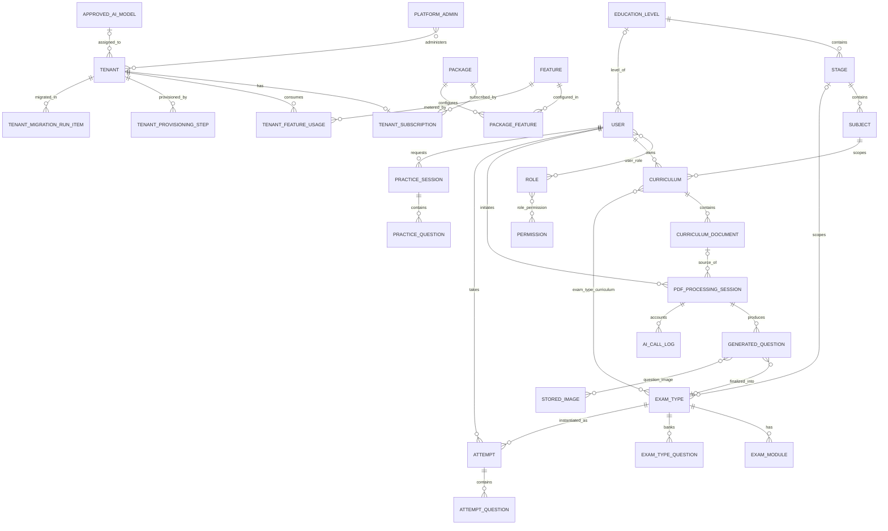
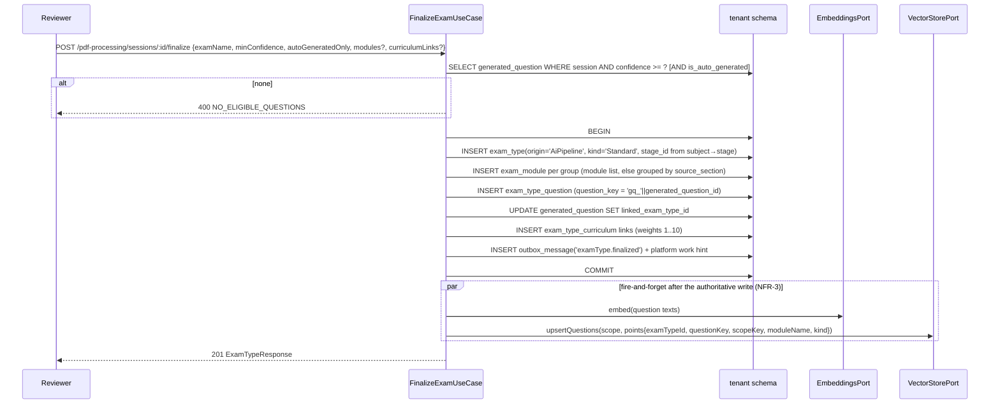

# ExamLand — Low-Level Design (LLD)

**Companion to:** `docs/architecture/HLD.md` (read that first — stack, isolation, AI-service/OpenRouter
and Qdrant decisions are made there and are not repeated here).

**Amended 2026-08-08** (targeted, post-Phase-1): the AI subsystem is now a standalone Python service
(`services/ai-engine`, `google-adk` + OpenRouter) behind `AiServicePort`, and tenant brand theming
(FR-MT-10) is added. The in-process `@google/adk`/`AiStepPort`/`PlainAiStep`/`LlmPort` design is
**removed** — see HLD §8.0 for the authoritative list of retired artifacts, and §14.1 below for the
small set of already-shipped files this amendment touches. Sections changed: §1, §1.1, §1.4, §2, §2.1,
§3, §4, §4.1, §6, §7.1, §7.3a, §7.10, §7.11, §8.3, §8.10, §9.9–§9.12, §10.1, §10.2, §12.2, §12.4,
§13.2, §14, §14.1.
**Amended 2026-08-08 (final AI-subsystem decisions — supersedes three interim defaults above).** The
user answered HLD §14a; three answers are now final and two diverge from the recommended interim
default: **(1)** `approved_ai_model` is **migration-seeded** with `anthropic/claude-3.5-haiku` as the
approved platform default (§4.1) instead of shipping empty; **(2)** **mTLS is REQUIRED** on the
NestJS↔engine link, with the shared-secret bearer **retained** as defense in depth (HLD §8.3.1, §2,
§2.1, §7.11, §9.9, §9.10); **(3)** an **AI-less production deployment is permitted with no override
flag** — `ALLOW_AI_DISABLED_IN_PROD` is **deleted** and must not be implemented (§2, §7.10, §14.1).
Sections changed by this final pass: §2, §2.1, §4 (seed DDL), §4.1, §7.10, §7.11, §9.9, §9.10, §14,
§14.1.

**Authority:** every rule in this document is binding on `nexus-dev`. Where a decision was left
open it is marked **OPEN (user)** and cross-referenced to HLD §14.

---

## 1. Repository layout

npm workspaces monorepo. **Two deployable images** (HLD §13.1 as amended): the Node application
(API + workers + Angular) and the Python AI engine.

```
/
├─ package.json                     # workspaces: apps/*, packages/*  ; engines.node >= 24.13
├─ tsconfig.base.json
├─ .eslintrc.cjs                    # incl. import-boundary rule (§1.4)
├─ docker/
│  ├─ Dockerfile                    # multi-stage, single image (Node app)
│  └─ docker-compose.dev.yml        # mysql:8.4, qdrant, mailhog, ai-engine, + certs-init (one-shot
│                                   # internal-CA/leaf generation into the examland-certs volume,
│                                   # added 2026-08-08 for mTLS — HLD §8.3.1)
├─ docs/…
├─ packages/
│  └─ contracts/                    # ZERO runtime deps. Shared API contract only.
│     └─ src/
│        ├─ dto/                    # request/response interfaces per module
│        │  └─ ai-service/          # the NestJS↔AI-engine wire contract (§7.11) — types only
│        ├─ enums/                  # TenantStatus, SessionStatus, AttemptStatus, …
│        ├─ error-codes.ts          # the single ErrorCode union (§14.2)
│        └─ index.ts
├─ apps/
│  ├─ api/                          # NestJS
│  └─ web/                          # Angular
└─ services/
   └─ ai-engine/                    # Python. NOT an npm workspace, NOT in tsconfig, own CI job (§9.10)
```

**`services/ai-engine` is deliberately a sibling of `apps/`, not a member of `apps/`**: it shares no
build tooling, no lockfile, and no `tsconfig` with the Node workspaces, and `npm ci`/`npm run build`
at the repo root must remain completely unaware of it. One repository (so the wire contract is
reviewed in one PR and tagged with one commit SHA), two independent toolchains.

`packages/contracts` is imported by **both** api and web. It must contain no classes with
decorators, no Nest/Angular imports, no runtime dependencies — only types, enums, and const
objects. This is what keeps the client and server contract from drifting without adding a codegen
step.

### 1.1 `apps/api` structure

```
apps/api/src/
├─ main.ts                          # ROLE=api bootstrap (Nest + static + rawBody for Stripe)
├─ worker.ts                        # ROLE=worker bootstrap (Nest app context, no HTTP listener)
├─ app.module.ts
├─ worker.module.ts
│
├─ config/
│  ├─ env.schema.ts                 # zod schema, single source of truth for every env var (§2)
│  ├─ configuration.ts              # typed namespaces: app, db, jwt, llm, embeddings, vector, storage, mail, stripe, worker, logging
│  └─ config.module.ts
│
├─ common/
│  ├─ errors/                       # DomainError base + subclasses, ErrorCode mapping table
│  ├─ filters/all-exceptions.filter.ts
│  ├─ interceptors/                 # logging, response-envelope-free passthrough, timeout
│  ├─ pipes/                        # global ValidationPipe config
│  ├─ decorators/                   # @CurrentUser, @CurrentTenant, @RequiresPermission, @RequiresFeature, @Public
│  ├─ pagination/                   # PageQueryDto, Paginated<T> helper
│  ├─ context/request-context.ts    # AsyncLocalStorage store + accessors
│  └─ util/                         # hash, slug, timing-safe compare, escape-html, zip-safety
│
├─ infrastructure/                  # THE ONLY place third-party SDKs may be imported
│  ├─ database/
│  │  ├─ platform/                  # PlatformDataSource provider, platform entities
│  │  ├─ tenant/                    # TenantDataSourceRegistry, tenant entity list, TenantEntityManager provider
│  │  ├─ migrations/platform/*.ts
│  │  └─ migrations/tenant/*.ts
│  ├─ ai/                                    # AMENDED 2026-08-08 (HLD §8.0)
│  │  ├─ ai-service/                         # the ONLY place that talks to the Python AI engine
│  │  │  ├─ ai-service.client.ts             # AiServicePort impl: fetch + timeout + retry + breaker
│  │  │  ├─ ai-service.circuit-breaker.ts    # per-process breaker (HLD §8.4)
│  │  │  ├─ ai-service.schemas.ts            # zod response validation at the boundary
│  │  │  └─ ai-service.disabled.ts           # AI_ENGINE=disabled binding → always AI_DISABLED 503
│  │  ├─ embeddings/openai-compatible.adapter.ts | local-tei.adapter.ts | null.adapter.ts
│  │  └─ usage/ai-usage-recorder.ts          # writes ai_call_log from the engine's `usage` block
│  │  # REMOVED (do not create): llm/openrouter.adapter.ts, adk/**, plain/plain-ai-step.ts
│  ├─ vector/qdrant.adapter.ts                # VectorStorePort (single chokepoint, HLD §6.2)
│  ├─ storage/{local-disk,s3}.adapter.ts      # StoragePort
│  ├─ mail/{smtp,noop}.adapter.ts             # EmailPort
│  ├─ payments/stripe.adapter.ts              # PaymentGatewayPort
│  ├─ pdf/{pdfjs-text-extractor,pdf-image-extractor}.ts
│  ├─ zip/yauzl-archive-reader.ts
│  └─ logging/logger.module.ts
│
├─ tenancy/
│  ├─ tenant-resolution.middleware.ts
│  ├─ tenant-context.service.ts
│  ├─ tenant-resolution-cache.ts
│  ├─ provisioning/{tenant-provisioning.service.ts, steps/*.ts}
│  └─ migrations/tenant-migration-runner.service.ts
│
├─ platform/                        # platform-schema bounded context
│  ├─ auth/           ├─ tenants/   ├─ features/   ├─ packages/
│  ├─ subscriptions/  ├─ billing/   ├─ usage/      ├─ audit/
│  └─ ai-models/                    # FR-AI-2/3 allowlist + AiModelResolver (§9.12)
│
├─ modules/                         # tenant-schema bounded contexts
│  ├─ auth/  ├─ users/  ├─ access-control/  ├─ taxonomy/
│  ├─ exam-types/  ├─ curricula/  ├─ retrieval/  ├─ pdf-processing/
│  ├─ practice/  ├─ attempts/  ├─ media/  ├─ files/  └─ outbox/
│
├─ workers/
│  ├─ pdf-pipeline.worker.ts  ├─ stale-session.worker.ts
│  ├─ outbox.worker.ts        ├─ attempt-timeout.worker.ts
│  └─ tenant-maintenance.worker.ts
└─ health/
```

### 1.2 Mandatory per-module layering

Every module directory under `modules/` and `platform/` uses exactly this shape:

```
modules/<module>/
├─ <module>.module.ts               # Nest module: imports, providers, exports
├─ api/                             # HTTP edge ONLY
│  ├─ *.controller.ts               # no business logic, no repository access, no entity imports
│  └─ dto/*.dto.ts                  # class-validator request DTOs + response mappers
├─ application/                     # use-cases / services — the only place business rules live
│  └─ *.service.ts
├─ domain/                           # framework-free
│  ├─ *.types.ts                    # domain models, value objects
│  ├─ ports/*.port.ts               # interfaces this module owns (if any)
│  └─ errors.ts                     # module-specific DomainError subclasses
└─ infrastructure/
   ├─ entities/*.entity.ts          # TypeORM entities (this module's tables only)
   └─ repositories/*.repository.ts  # thin data access over the tenant EntityManager
```

**Tiering (to avoid ceremony where it buys nothing):**

- **Tier A — full four layers required:** `pdf-processing`, `curricula`, `retrieval`, `attempts`,
  `exam-types`, `auth`, `access-control`, `platform/billing`, `platform/usage`, `tenancy/*`.
- **Tier B — `domain/` may hold only `errors.ts` and types; `application/` may call TypeORM
  repositories directly:** `taxonomy`, `users`, `profile`, `media`, `files`, `platform/features`,
  `platform/packages`, `platform/tenants`.
- In **both** tiers: controllers stay thin, entities never leave `infrastructure/`, and external
  SDKs are never imported outside `infrastructure/` (top-level or module-level).

**Repository-port rule (decided, do not over-abstract):** NFR-6 requires ports for *external
dependencies* — data-access **handle**, vector store, LLM, embeddings, storage, email, payments.
It does **not** require an interface in front of every table repository. Application services may
depend on concrete TypeORM repository classes within their own module; they must **not** depend on
another module's repository.

### 1.3 Tenant data access from a service

```ts
// infrastructure/database/tenant/tenant-entity-manager.provider.ts
export const TENANT_EM = Symbol('TENANT_EM');
{
  provide: TENANT_EM,
  scope: Scope.REQUEST,          // also resolvable inside worker jobs via runWithTenant()
  useFactory: (ctx: TenantContextService) => ctx.requireDataSource().manager,
  inject: [TenantContextService],
}
```

Rules:
- No service ever injects a `DataSource` or `Connection` directly.
- Worker code enters tenant scope explicitly:
  `await tenantScope.runFor(tenantId, async (em) => { … })` — the same ALS store as HTTP requests,
  so logging/permissions/vector scoping behave identically.
- Multi-statement invariants use `em.transaction(async (trx) => …)`. The transactions that are
  **mandatory** (not optional): ZIP exam creation, PDF finalize/append, attempt creation, attempt
  submit/score, role/permission set replacement, outbox write + work hint, generated-question
  persist + watermark advance.

### 1.4 Import-boundary lint rule (must be configured, CI-failing)

| Rule | Enforcement |
|---|---|
| **`@google/adk` banned repo-wide** in `apps/api` and `apps/web` (was: "importable only from `infrastructure/ai/adk/**`") — HLD §8.0 | `no-restricted-imports`, flat deny, **and** the package must not appear in any `package.json` |
| No file outside `infrastructure/ai/ai-service/**` may reference `AI_SERVICE_BASE_URL`, construct an AI-engine URL, or `fetch` the engine | `no-restricted-imports` zone + `no-restricted-syntax` on the literal `/v1/ai/` |
| `Tier B`+ rule: `modules/**` may not import `platform/ai-models/**/infrastructure/**`; it reaches models only via `AiServicePort` (which resolves them internally) | same |
| `stripe`, `@qdrant/js-client-rest`, `nodemailer`, `mysql2`, `google-auth-library`, `pdfjs-dist`, `yauzl`, `bcrypt` importable only from `infrastructure/**` | same |
| `modules/**` may not import `platform/**/infrastructure/**` or `PlatformDataSource` | same |
| `api/**` may not import `infrastructure/entities/**` | same |
| `domain/**` may not import `@nestjs/*` (except `@nestjs/common` `Inject`/`Injectable` tokens are also banned — use plain classes/interfaces) | same |
| `packages/contracts` may not import anything runtime | dependency-cruiser or `no-restricted-imports` with `**` deny + type-only allowance |

---

## 2. Configuration contract

All env vars, validated by one zod schema at boot; production adds the extra assertions in HLD
§13.2. `nexus-dev` must not read `process.env` outside `config/`.

| Var | Default | Notes |
|---|---|---|
| `NODE_ENV` | `development` | |
| `ROLE` | `api` | `api` \| `worker` |
| `PORT` | `3000` | |
| `PUBLIC_APEX_DOMAIN` | `examland.app` | Used for subdomain parsing and signed-URL bases |
| `RESERVED_SUBDOMAINS` | `admin,www,api,app,auth,static,mail,status` | Rejected at create + resolution |
| `DEFAULT_TENANT_SUBDOMAIN` | `default` | Non-production only; forbidden in production |
| `DB_HOST/PORT/USER/PASSWORD` | — | Required. User needs `CREATE`, `DROP`, `ALTER` (provisioning) |
| `DB_PLATFORM_SCHEMA` | `examland_platform` | |
| `DB_PLATFORM_POOL_MAX` | `10` | |
| `TENANT_POOL_MAX` | `3` | Per-tenant pool size |
| `TENANT_REGISTRY_MAX` | `30` | LRU resident tenants |
| `TENANT_IDLE_TTL_MS` | `900000` | Idle DataSource reaping |
| `TENANT_CACHE_TTL_MS` / `_NEG_TTL_MS` | `60000` / `15000` | FR-MT-2 |
| `TENANT_RETENTION_DAYS` | `30` | FR-MT-1 |
| `TENANT_PURGE_ENABLED` | `false` | HLD §14 item 5 |
| `JWT_TENANT_SECRET`, `JWT_PLATFORM_SECRET` | — | Required, must differ (asserted) |
| `JWT_TENANT_TTL`, `JWT_PLATFORM_TTL` | `60m` | |
| `BCRYPT_COST` | `12` | |
| `PASSWORD_MIN_LENGTH` | `8` | |
| `PASSWORD_REQUIRE_UPPER/LOWER/DIGIT/SYMBOL` | `true/true/true/false` | Server-side, per FR-IAM-2 |
| `RESET_TOKEN_TTL_MIN` | `60` | |
| `GOOGLE_CLIENT_ID` | empty | Empty ⇒ `GOOGLE_NOT_CONFIGURED` 401 (FR-MT-6) |
| ~~`OPENROUTER_BASE_URL`~~ | — | **MOVED to the AI engine's container** (§2.1). Must be *removed* from `apps/api`'s schema. |
| ~~`OPENROUTER_API_KEY`~~ | — | **MOVED to the AI engine's container.** `apps/api` must no longer require, read, or assert it — this is a change to the already-shipped Dev-0a config module (see §14 note). |
| ~~`OPENROUTER_APP_TITLE`, `OPENROUTER_REFERER`~~ | — | **MOVED to the AI engine's container.** |
| ~~`LLM_CHAIN_*`, `LLM_TIMEOUT_MS`, `LLM_MAX_RETRIES_PER_MODEL`~~ | — | **REMOVED.** Per-task model chains are superseded by the FR-AI-2 allowlist (HLD §8.6); the engine owns model-level timeout/retry. |
| `AI_ENGINE` | `enabled` | `enabled` \| `disabled`. **`adk`/`plain` are removed values.** `disabled` ⇒ every AI endpoint returns 503 `AI_DISABLED` and no call is attempted (fail closed, FR-AI-1). |
| ~~`ALLOW_AI_DISABLED_IN_PROD`~~ | — | **REMOVED 2026-08-08 (final).** An AI-less production deploy is explicitly permitted with no flag (HLD §8.4). Do **not** implement this var and do **not** add any production assertion that `AI_ENGINE=enabled`. |
| `AI_SERVICE_BASE_URL` | `https://ai-engine:8443` | Internal service URL. Required when `AI_ENGINE=enabled`. **Amended 2026-08-08: must be `https://` in staging/production (asserted); `http://` is permitted only when `NODE_ENV` is `local`/`test`.** Production also asserts it is **not** a public hostname (must not resolve through `PUBLIC_APEX_DOMAIN`). |
| `AI_SERVICE_TOKEN` | — | Required when `AI_ENGINE=enabled`; ≥32 chars asserted. Shared with the engine container only. Never logged. Retained **alongside** mTLS as defense in depth (HLD §8.3). |
| `AI_SERVICE_TLS_CA_FILE` | `/etc/examland/tls/ca.crt` | **Added 2026-08-08.** PEM trust bundle used to verify the engine's server cert. **May contain multiple PEM blocks** (CA-rotation overlap, HLD §8.3.1). Required when `AI_ENGINE=enabled` and the base URL is `https://`; asserted readable at boot. |
| `AI_SERVICE_TLS_CLIENT_CERT_FILE` | `/etc/examland/tls/tls.crt` | **Added 2026-08-08.** The API/worker client certificate (`CN=examland-api`). Required with `https://`; asserted readable. |
| `AI_SERVICE_TLS_CLIENT_KEY_FILE` | `/etc/examland/tls/tls.key` | **Added 2026-08-08.** Client private key. Required with `https://`; asserted readable. Never logged, never included in an error message. |
| `AI_SERVICE_TLS_SERVER_NAME` | `ai-engine` | **Added 2026-08-08.** SNI/hostname verified against the engine cert's SANs. Hostname verification is always on; there is **no** `rejectUnauthorized:false` option and no env var that can disable it. |
| `AI_SERVICE_TIMEOUT_MS` | `120000` | Per call, `AbortController`, raced independently. Must exceed the engine's own per-attempt budget. |
| `AI_SERVICE_CONNECT_TIMEOUT_MS` | `3000` | Fast detection of a down engine |
| `AI_SERVICE_MAX_RETRIES` | `2` | Connection/timeout/429/5xx only; never 4xx |
| `AI_SERVICE_BREAKER_FAILURES` / `_WINDOW_MS` / `_OPEN_MS` | `5` / `60000` / `30000` | HLD §8.4 circuit breaker |
| `AI_MODEL_CACHE_TTL_MS` | `60000` | `AiModelResolver` per-tenant cache (§9.12) |
| `EMBEDDINGS_BASE_URL` | `https://api.openai.com/v1` | HLD §7.2 |
| `EMBEDDINGS_API_KEY` | — | Required unless provider `local`/`null` |
| `EMBEDDINGS_PROVIDER` | `openai-compatible` | \| `local-tei` \| `null` (non-prod only) |
| `EMBEDDINGS_MODEL` | `text-embedding-3-small` | |
| `EMBEDDING_DIMS` | `1536` | Must match live collections or boot fails |
| `EMBEDDINGS_BATCH_SIZE` | `100` | |
| `QDRANT_URL` | `http://localhost:6333` | |
| `QDRANT_API_KEY` | empty | |
| `VECTOR_COLLECTION_PREFIX` | `examland` | |
| `FINGERPRINT_SIMILARITY_THRESHOLD` | `0.97` | FR-PDF-2 |
| `NEAR_DUPLICATE_THRESHOLD` | `0.93` | FR-CUR-6 diversity |
| `CHUNK_SIZE_CHARS` / `CHUNK_OVERLAP_CHARS` | `1500` / `200` | |
| `RETRIEVAL_TOPK_LESSON` / `_EXTRACTION` / `_PROMPT` | `5` / `12` / `12` | |
| `STORAGE_DRIVER` | `local` | \| `s3` |
| `STORAGE_ROOT` | `/app/storage` | |
| `FILE_SIGNING_SECRET` | — | Required |
| `SIGNED_URL_TTL_SEC` | `900` | |
| `MAX_PDF_SIZE_BYTES` | `52428800` | FR-PDF-1 (50MB) |
| `MAX_ZIP_SIZE_BYTES` | `104857600` | |
| `MAX_AVATAR_SIZE_BYTES` | `5242880` | FR-IAM-4 |
| `PDF_MAX_TOKENS_PER_SESSION` | `400000` | FR-PDF-12 |
| `PDF_MAX_COST_PER_SESSION_USD` | `2.00` | FR-PDF-12 |
| `PDF_QUESTIONS_MIN` / `_MAX` / `_BATCH_SIZE` | `10` / `200` / `10` | FR-PDF-4 |
| `REVIEW_FLAG_CONFIDENCE_THRESHOLD` | `0.75` | |
| `SMTP_HOST/PORT/USER/PASSWORD/FROM` | empty | Empty ⇒ `NoopEmailAdapter` (FR-MT-7) |
| `STRIPE_SECRET_KEY`, `STRIPE_WEBHOOK_SECRET` | empty | Empty ⇒ billing endpoints return `BILLING_NOT_CONFIGURED` 503 |
| `FALLBACK_PACKAGE_KEY` | `starter` | FR-PKG-6 canceled fallback |
| `WORKER_PDF_TICK_MS` | `5000` | |
| `WORKER_OUTBOX_TICK_MS` | `10000` | |
| `WORKER_SWEEP_TICK_MS` | `60000` | |
| `WORKER_FULL_SWEEP_INTERVAL_MS` | `600000` | HLD §10.2 |
| `SESSION_HEARTBEAT_STALE_MS` | `300000` | FR-REL-3 (5 min) |
| `MAX_RESUME_ATTEMPTS` | `3` | |
| `LOG_LEVEL`, `LOG_DIR`, `LOG_RETENTION_DAYS` | `info`, `/app/logs`, `14` | NFR-6a |
| `PLATFORM_METRICS_TOKEN` | — | Guards `/api/metrics` |
| `THEME_SURFACE_LIGHT` / `THEME_SURFACE_DARK` | `FFFFFF` / `121212` | FR-MT-10 contrast validation surfaces (§9.11). Defaults must be replaced with `nexus-ux`'s published baseline values — HLD §14a item 5. |
| `ACCENT_CONTRAST_MIN_RATIO` | `3.0` | WCAG 2.2 AA non-text contrast minimum (FR-MT-10) |

### 2.1 The AI engine's own configuration (`services/ai-engine`, pydantic-settings)

Separate process, separate env. Validated at import time; the process **refuses to start** on any
violation (fail closed).

| Var | Default | Notes |
|---|---|---|
| `AI_SERVICE_PORT` | `8443` | Container-internal only. **Amended 2026-08-08: TLS listener** (was plaintext `8081`). |
| `AI_SERVICE_TOKEN` | — | **Required**, ≥32 chars asserted at startup. Constant-time compared per request. Retained **alongside** mTLS as defense in depth (HLD §8.3). |
| `AI_TLS_REQUIRED` | `true` | **Added 2026-08-08.** `false` is permitted **only** when `ENV` is `local`/`test` (asserted); any other value of `ENV` with `AI_TLS_REQUIRED=false` is a startup failure. |
| `AI_TLS_CERT_FILE` | `/etc/examland/tls/tls.crt` | **Added 2026-08-08.** Engine server certificate (SANs: `ai-engine`, `ai-engine.<ns>.svc`, …). Required when `AI_TLS_REQUIRED=true`. |
| `AI_TLS_KEY_FILE` | `/etc/examland/tls/tls.key` | **Added 2026-08-08.** Server private key. Required when TLS is on; never logged. |
| `AI_TLS_CLIENT_CA_FILE` | `/etc/examland/tls/ca.crt` | **Added 2026-08-08.** CA bundle that client certificates must chain to. **May contain multiple PEM blocks** (CA rotation). Required when TLS is on. |
| `AI_SERVICE_CLIENT_CN` | `examland-api` | **Added 2026-08-08.** The exact subject CN the verified client certificate must present for any `/v1/**` request. A CA-signed leaf with any other CN is `401 AI_UNAUTHORIZED` — being issued by our CA is necessary but not sufficient. |
| `AI_TLS_RELOAD_ON_CHANGE` | `true` | **Added 2026-08-08.** Watch the three TLS files by mtime and rebuild the SSL context on change, so cert-manager's automatic leaf renewal needs no restart (HLD §8.3.1). |
| `OPENROUTER_BASE_URL` | `https://openrouter.ai/api/v1` | |
| `OPENROUTER_API_KEY` | — | **Required.** The only holder of this secret in the whole system. |
| `OPENROUTER_APP_TITLE` / `OPENROUTER_REFERER` | `ExamLand` / `https://examland.app` | Attribution headers |
| `LLM_ATTEMPT_TIMEOUT_MS` | `90000` | Per model attempt, raced independently of httpx |
| `LLM_MAX_RETRIES_PER_MODEL` | `2` | 429/5xx/network only, 1s/2s backoff |
| `MODELS_CATALOG_TTL_SEC` | `86400` | `GET /models` capability+price cache |
| `UVICORN_WORKERS` | `2` | |
| `LOG_LEVEL` | `info` | structlog JSON to stdout; **never** logs prompt bodies, grounding text, or the bearer token |
| `MAX_REQUEST_BODY_BYTES` | `2097152` | Rejects an oversized body before parsing (2MB) |

**No database URL, no Qdrant URL, no embeddings key exists in this table by design** (HLD §6.1a). If
`nexus-dev` finds itself wanting one, the design is being violated — stop and raise it.

---

## 3. Ports (domain-owned interfaces)

```ts
// TENANT DATA ACCESS — HLD §4.3
interface TenantDataAccess {
  entityManager(): EntityManager;                       // for the ALS-resolved tenant
  transaction<T>(fn: (em: EntityManager) => Promise<T>): Promise<T>;
}

// VECTOR — the ONLY vector surface; no method accepts a raw filter (HLD §6.2)
interface TenantScope { readonly tenantId: string }
interface VectorPoint { id: string; vector: number[]; payload: Record<string, unknown> }
interface ScoredPoint { id: string; score: number; payload: Record<string, unknown>; vector?: number[] }
interface VectorStorePort {
  upsertChunks(s: TenantScope, pts: VectorPoint[]): Promise<void>;
  searchChunks(s: TenantScope, q: number[], f: { curriculumId?: string; documentId?: string }, limit: number, scoreThreshold?: number): Promise<ScoredPoint[]>;
  scrollChunks(s: TenantScope, f: { curriculumId?: string; documentId?: string }, opts: { limit: number; withVector?: boolean }): Promise<ScoredPoint[]>;
  deleteChunks(s: TenantScope, f: { curriculumId?: string; documentId?: string }): Promise<void>;
  upsertFingerprint(s: TenantScope, p: VectorPoint): Promise<void>;
  searchFingerprint(s: TenantScope, q: number[], threshold: number): Promise<ScoredPoint[]>;
  upsertQuestions(s: TenantScope, pts: VectorPoint[]): Promise<void>;
  searchQuestions(s: TenantScope, q: number[], f: { scopeKey?: string; examTypeId?: string }, limit: number): Promise<ScoredPoint[]>;
  scrollQuestions(s: TenantScope, f: { scopeKey?: string; examTypeId?: string }, opts: { limit: number; withVector?: boolean }): Promise<ScoredPoint[]>;
  deleteQuestions(s: TenantScope, f: { examTypeId?: string; questionKeys?: string[] }): Promise<void>;
  purgeTenant(s: TenantScope): Promise<void>;
  countsForTenant(s: TenantScope): Promise<Record<string, number>>;  // NFR-9
}

// EMBEDDINGS — HLD §7.2 (unchanged; stays NestJS-side per HLD §6.1a)
interface EmbeddingsPort { embed(texts: string[]): Promise<number[][]>; readonly model: string; readonly dims: number }

// ── AI ─────────────────────────────────────────────────────────────────────
// REMOVED 2026-08-08 (HLD §8.0): LlmPort, LlmTask, LlmCallResult, AiStepPort<TIn,TOut>.
// Replaced by AiServicePort — the ONLY surface application code uses for AI.

interface AiInvocationContext {                    // unchanged shape, still passed per call
  tenantId: string; userId?: string; processingSessionId?: string; correlationId: string;
  budget: { tokensRemaining: number; costRemainingUsd: number };
}
interface GroundingChunk { text: string; fileName: string; pageNumber: number; score: number }
interface AiUsage {
  model: string; promptTokens: number; completionTokens: number;
  costUsd: number | null; costUnavailable: boolean; latencyMs: number; attempts: number;
}
/**
 * One method per AI operation (HLD §8.2) — NOT a generic run<T>(), deliberately:
 * each operation has a distinct, statically-typed contract that must be zod-validated
 * at the boundary, and a generic port would erase exactly the types that matter.
 * Every method: resolves the tenant's model internally, calls the engine once,
 * records usage into ai_call_log, and throws AiServiceUnavailableError on
 * timeout/connection/5xx-after-retries/open-breaker (HLD §8.4).
 */
interface AiServicePort {
  classifyContent(input: ClassifyContentIn, ctx: AiInvocationContext): Promise<AiResult<ClassifyContentOut>>;
  generateLessonBatch(input: LessonBatchIn, ctx: AiInvocationContext): Promise<AiResult<GeneratedQuestionDraft[]>>;
  extractExamPage(input: ExtractPageIn, ctx: AiInvocationContext): Promise<AiResult<ExtractedQuestionDraft[]>>;
  classifySubject(input: SubjectMapIn, ctx: AiInvocationContext): Promise<AiResult<SubjectMapOut>>;
  promptPractice(input: PromptPracticeIn, ctx: AiInvocationContext): Promise<AiResult<GeneratedQuestionDraft[]>>;
  readonly available: boolean;                     // false when AI_ENGINE=disabled
}
type AiResult<T> = { data: T; usage: AiUsage; droppedItems: number };
// Full request/response DTOs: §7.11.

// STORAGE
interface StoragePort {
  put(key: string, data: Buffer | Readable, contentType?: string): Promise<{ key: string; size: number }>;
  getStream(key: string, range?: { start: number; end: number }): Promise<{ stream: Readable; size: number; contentType: string }>;
  stat(key: string): Promise<{ size: number; contentType: string } | null>;
  delete(key: string): Promise<void>;
  deletePrefix(prefix: string): Promise<void>;
  exists(key: string): Promise<boolean>;
}

// EMAIL / PAYMENTS / CLOCK
interface EmailPort { send(msg: { to: string; subject: string; html: string; text?: string }): Promise<void> } // never throws
interface PaymentGatewayPort {
  ensureCustomer(t: { tenantId: string; name: string; email?: string; existingCustomerId?: string | null }): Promise<string>;
  createCheckoutSession(a: { customerId: string; packageKey: string; packageName: string; priceCents: number; currency: string; successUrl: string; cancelUrl: string; tenantId: string }): Promise<{ id: string; url: string }>;
  verifyAndParseWebhook(rawBody: Buffer, signature: string): { id: string; type: string; data: unknown };
}
interface ClockPort { now(): Date }
```

---

## 4. Platform schema DDL (`examland_platform`)

All tables `ENGINE=InnoDB DEFAULT CHARSET=utf8mb4 COLLATE=utf8mb4_0900_ai_ci`. UUIDs are
`CHAR(36)`. Timestamps are `DATETIME(3)` in UTC (the application always writes UTC; no
`TIMESTAMP` columns, to avoid server-timezone conversion surprises).

```sql
CREATE TABLE tenant (
  id                        CHAR(36)      NOT NULL,
  name                      VARCHAR(200)  NOT NULL,
  subdomain_slug            VARCHAR(63)   NOT NULL,
  schema_name               VARCHAR(64)   NOT NULL,
  status                    ENUM('Provisioning','Active','Suspended','Failed') NOT NULL DEFAULT 'Provisioning',
  is_default                TINYINT(1)    NOT NULL DEFAULT 0,
  allow_email_registration  TINYINT(1)    NOT NULL DEFAULT 1,
  allow_google_sign_in      TINYINT(1)    NOT NULL DEFAULT 0,
  default_self_register_role VARCHAR(100) NULL,            -- FR-IAM-2 default role name
  logo_url                  VARCHAR(1024) NULL,
  provisioning_error        TEXT          NULL,
  provisioning_heartbeat_at DATETIME(3)   NULL,
  created_at                DATETIME(3)   NOT NULL DEFAULT CURRENT_TIMESTAMP(3),
  updated_at                DATETIME(3)   NOT NULL DEFAULT CURRENT_TIMESTAMP(3) ON UPDATE CURRENT_TIMESTAMP(3),
  deleted_at                DATETIME(3)   NULL,
  purge_after_at            DATETIME(3)   NULL,
  PRIMARY KEY (id),
  UNIQUE KEY uq_tenant_slug   (subdomain_slug),
  UNIQUE KEY uq_tenant_schema (schema_name),
  KEY ix_tenant_status (status),
  KEY ix_tenant_purge  (deleted_at, purge_after_at)
);
-- Only one default tenant: enforced by a generated column + unique index.
ALTER TABLE tenant
  ADD COLUMN default_flag TINYINT(1) GENERATED ALWAYS AS (CASE WHEN is_default = 1 THEN 1 ELSE NULL END) VIRTUAL,
  ADD UNIQUE KEY uq_tenant_single_default (default_flag);

-- ── ADDED 2026-08-08 amendment ────────────────────────────────────────────
-- FR-AI-2: platform-curated OpenRouter model allowlist.
CREATE TABLE approved_ai_model (
  id                    CHAR(36)     NOT NULL,
  open_router_model_id  VARCHAR(200) NOT NULL,      -- 'provider/model[:variant]'
  display_name          VARCHAR(200) NOT NULL,
  is_enabled            TINYINT(1)   NOT NULL DEFAULT 1,   -- disabled: hidden from new assignment,
                                                           -- but existing assignees keep using it
  is_platform_default   TINYINT(1)   NOT NULL DEFAULT 0,
  created_at            DATETIME(3)  NOT NULL DEFAULT CURRENT_TIMESTAMP(3),
  updated_at            DATETIME(3)  NOT NULL DEFAULT CURRENT_TIMESTAMP(3) ON UPDATE CURRENT_TIMESTAMP(3),
  PRIMARY KEY (id),
  UNIQUE KEY uq_aim_model (open_router_model_id),    -- ⇒ MODEL_ALREADY_APPROVED
  KEY ix_aim_enabled (is_enabled)
);
-- Exactly one platform default: same generated-column trick as tenant.is_default.
ALTER TABLE approved_ai_model
  ADD COLUMN default_flag TINYINT(1) GENERATED ALWAYS AS (CASE WHEN is_platform_default = 1 THEN 1 ELSE NULL END) VIRTUAL,
  ADD UNIQUE KEY uq_aim_single_default (default_flag);
-- NOTE: the DB can enforce "at most one" but not "at least one". "Exactly one at all times once any
-- row exists" (FR-AI-2) is enforced in AiModelsService by making every mutation that could remove
-- the default require a designated replacement in the same transaction → DEFAULT_MODEL_REQUIRED.

-- AMENDED 2026-08-08 (final, user decision): seed exactly ONE row as the platform default, so a
-- fresh deployment has a working model without a Platform Admin action first. Idempotent: safe to
-- re-run, and it will NOT resurrect a row an admin later deleted (see §4.1 for the full rules).
INSERT INTO approved_ai_model (id, open_router_model_id, display_name, is_enabled, is_platform_default)
SELECT '00000000-0000-4000-8000-000000000a01',
       'anthropic/claude-3.5-haiku', 'Claude 3.5 Haiku', 1, 1
WHERE NOT EXISTS (SELECT 1 FROM approved_ai_model);
--        ^^ guarded on the table being EMPTY, not on this id being absent, so the seed can never
--           collide with uq_aim_single_default or overwrite an operator's chosen default.

-- FR-AI-3 + FR-MT-10: two additive nullable columns on the existing tenant table.
ALTER TABLE tenant
  ADD COLUMN assigned_ai_model_id  CHAR(36) NULL,   -- NULL ⇒ resolves to the platform default
  ADD COLUMN accent_color_override CHAR(6)  NULL,   -- normalized uppercase RRGGBB, no '#'
  ADD KEY ix_tenant_ai_model (assigned_ai_model_id),
  ADD CONSTRAINT fk_tenant_ai_model FOREIGN KEY (assigned_ai_model_id)
      REFERENCES approved_ai_model(id) ON DELETE RESTRICT,
  ADD CONSTRAINT chk_tenant_accent CHECK (accent_color_override IS NULL
      OR accent_color_override REGEXP '^[0-9A-F]{6}$');
-- ON DELETE RESTRICT is what gives MODEL_IN_USE teeth at the storage layer, not just in service code.

CREATE TABLE tenant_provisioning_step (
  id           CHAR(36) NOT NULL,
  tenant_id    CHAR(36) NOT NULL,
  step         ENUM('create_schema','run_migrations','seed_rbac','seed_admin_user','create_subscription','invite_admin') NOT NULL,
  status       ENUM('Pending','Running','Completed','Failed') NOT NULL DEFAULT 'Pending',
  attempts     INT NOT NULL DEFAULT 0,
  error        TEXT NULL,
  started_at   DATETIME(3) NULL,
  completed_at DATETIME(3) NULL,
  PRIMARY KEY (id),
  UNIQUE KEY uq_prov_step (tenant_id, step),
  CONSTRAINT fk_prov_tenant FOREIGN KEY (tenant_id) REFERENCES tenant(id) ON DELETE CASCADE
);

CREATE TABLE platform_admin (
  id            CHAR(36)     NOT NULL,
  email         VARCHAR(320) NOT NULL,
  password_hash VARCHAR(100) NOT NULL,
  name          VARCHAR(200) NOT NULL,
  is_active     TINYINT(1)   NOT NULL DEFAULT 1,
  last_login_at DATETIME(3)  NULL,
  created_at    DATETIME(3)  NOT NULL DEFAULT CURRENT_TIMESTAMP(3),
  PRIMARY KEY (id),
  UNIQUE KEY uq_platform_admin_email (email)
);

CREATE TABLE feature (
  id           CHAR(36)     NOT NULL,
  `key`        VARCHAR(100) NOT NULL,          -- domain.action, immutable once referenced
  name         VARCHAR(200) NOT NULL,
  description  VARCHAR(500) NULL,
  unit         VARCHAR(50)  NOT NULL,
  reset_period ENUM('NONE','DAILY','MONTHLY') NOT NULL DEFAULT 'MONTHLY',
  created_at   DATETIME(3)  NOT NULL DEFAULT CURRENT_TIMESTAMP(3),
  PRIMARY KEY (id),
  UNIQUE KEY uq_feature_key (`key`)
);

CREATE TABLE `package` (
  id              CHAR(36)     NOT NULL,
  `key`           VARCHAR(100) NOT NULL,
  name            VARCHAR(200) NOT NULL,
  description     VARCHAR(500) NULL,
  price_cents     INT          NOT NULL DEFAULT 0,
  currency        CHAR(3)      NOT NULL DEFAULT 'usd',
  stripe_price_id VARCHAR(255) NULL,            -- unused by default (HLD §14 item 7)
  is_active       TINYINT(1)   NOT NULL DEFAULT 1,
  sort_order      INT          NOT NULL DEFAULT 0,
  created_at      DATETIME(3)  NOT NULL DEFAULT CURRENT_TIMESTAMP(3),
  updated_at      DATETIME(3)  NOT NULL DEFAULT CURRENT_TIMESTAMP(3) ON UPDATE CURRENT_TIMESTAMP(3),
  PRIMARY KEY (id),
  UNIQUE KEY uq_package_key (`key`),
  KEY ix_package_active_sort (is_active, sort_order)
);

CREATE TABLE package_feature (
  id          CHAR(36) NOT NULL,
  package_id  CHAR(36) NOT NULL,
  feature_id  CHAR(36) NOT NULL,
  `limit`     INT      NULL,                    -- NULL = unlimited
  enabled     TINYINT(1) NOT NULL DEFAULT 1,
  PRIMARY KEY (id),
  UNIQUE KEY uq_pkg_feature (package_id, feature_id),
  KEY ix_pf_feature (feature_id),
  CONSTRAINT fk_pf_package FOREIGN KEY (package_id) REFERENCES `package`(id) ON DELETE CASCADE,
  CONSTRAINT fk_pf_feature FOREIGN KEY (feature_id) REFERENCES feature(id)  ON DELETE RESTRICT
);

CREATE TABLE tenant_subscription (
  id                       CHAR(36) NOT NULL,
  tenant_id                CHAR(36) NOT NULL,
  package_id               CHAR(36) NOT NULL,
  status                   ENUM('ACTIVE','PAST_DUE','CANCELED') NOT NULL DEFAULT 'ACTIVE',
  provider_customer_id     VARCHAR(255) NULL,
  provider_subscription_id VARCHAR(255) NULL,
  current_period_start     DATETIME(3) NULL,
  current_period_end       DATETIME(3) NULL,
  created_at               DATETIME(3) NOT NULL DEFAULT CURRENT_TIMESTAMP(3),
  updated_at               DATETIME(3) NOT NULL DEFAULT CURRENT_TIMESTAMP(3) ON UPDATE CURRENT_TIMESTAMP(3),
  PRIMARY KEY (id),
  UNIQUE KEY uq_sub_tenant (tenant_id),
  UNIQUE KEY uq_sub_provider (provider_subscription_id),
  KEY ix_sub_package (package_id),
  CONSTRAINT fk_sub_tenant  FOREIGN KEY (tenant_id)  REFERENCES tenant(id)    ON DELETE CASCADE,
  CONSTRAINT fk_sub_package FOREIGN KEY (package_id) REFERENCES `package`(id) ON DELETE RESTRICT
);

CREATE TABLE tenant_feature_usage (
  id         CHAR(36)    NOT NULL,
  tenant_id  CHAR(36)    NOT NULL,
  feature_id CHAR(36)    NOT NULL,
  period_key VARCHAR(20) NOT NULL,             -- 'YYYY-MM' | 'YYYY-MM-DD' | 'lifetime'
  count      INT         NOT NULL DEFAULT 0,
  updated_at DATETIME(3) NOT NULL DEFAULT CURRENT_TIMESTAMP(3) ON UPDATE CURRENT_TIMESTAMP(3),
  PRIMARY KEY (id),
  UNIQUE KEY uq_usage (tenant_id, feature_id, period_key),
  CONSTRAINT fk_usage_tenant  FOREIGN KEY (tenant_id)  REFERENCES tenant(id)  ON DELETE CASCADE,
  CONSTRAINT fk_usage_feature FOREIGN KEY (feature_id) REFERENCES feature(id) ON DELETE CASCADE
);

CREATE TABLE tenant_migration_run (
  id           CHAR(36) NOT NULL,
  mode         ENUM('halt-on-error','continue-on-error') NOT NULL,
  dry_run      TINYINT(1) NOT NULL DEFAULT 0,
  started_at   DATETIME(3) NOT NULL,
  finished_at  DATETIME(3) NULL,
  total        INT NOT NULL DEFAULT 0,
  succeeded    INT NOT NULL DEFAULT 0,
  failed       INT NOT NULL DEFAULT 0,
  skipped      INT NOT NULL DEFAULT 0,
  initiated_by VARCHAR(200) NULL,
  PRIMARY KEY (id)
);

CREATE TABLE tenant_migration_run_item (
  id                  CHAR(36) NOT NULL,
  run_id              CHAR(36) NOT NULL,
  tenant_id           CHAR(36) NOT NULL,
  schema_name         VARCHAR(64) NOT NULL,
  status              ENUM('Succeeded','Failed','Skipped','Pending') NOT NULL DEFAULT 'Pending',
  applied_migrations  JSON NULL,
  pending_migrations  JSON NULL,                -- populated in dry-run mode
  error               TEXT NULL,
  duration_ms         INT NULL,
  PRIMARY KEY (id),
  UNIQUE KEY uq_run_tenant (run_id, tenant_id),
  CONSTRAINT fk_item_run FOREIGN KEY (run_id) REFERENCES tenant_migration_run(id) ON DELETE CASCADE
);

CREATE TABLE tenant_work_hint (                 -- HLD §10.2
  tenant_id     CHAR(36) NOT NULL,
  kind          ENUM('pdf_session','outbox','attempt_timeout') NOT NULL,
  pending_since DATETIME(3) NOT NULL,
  PRIMARY KEY (tenant_id, kind),
  KEY ix_hint_kind_since (kind, pending_since)
);

CREATE TABLE vector_collection_meta (           -- HLD §7.3
  collection      VARCHAR(100) NOT NULL,
  embedding_model VARCHAR(100) NOT NULL,
  dims            INT NOT NULL,
  created_at      DATETIME(3) NOT NULL DEFAULT CURRENT_TIMESTAMP(3),
  PRIMARY KEY (collection)
);

CREATE TABLE audit_log (
  id           CHAR(36)     NOT NULL,
  actor_type   ENUM('PlatformAdmin','TenantUser','System') NOT NULL,
  actor_id     VARCHAR(64)  NULL,
  tenant_id    CHAR(36)     NULL,
  action       VARCHAR(100) NOT NULL,
  target_type  VARCHAR(100) NULL,
  target_id    VARCHAR(64)  NULL,
  summary      JSON         NULL,
  ip           VARCHAR(64)  NULL,
  created_at   DATETIME(3)  NOT NULL DEFAULT CURRENT_TIMESTAMP(3),
  PRIMARY KEY (id),
  KEY ix_audit_tenant_time (tenant_id, created_at),
  KEY ix_audit_action_time (action, created_at)
);

CREATE TABLE platform_lock (                    -- boot-migration + maintenance mutual exclusion
  name       VARCHAR(100) NOT NULL,
  holder     VARCHAR(100) NOT NULL,
  acquired_at DATETIME(3) NOT NULL,
  expires_at  DATETIME(3) NOT NULL,
  PRIMARY KEY (name)
);
```

### 4.1 Seeded platform data (migration-seeded, idempotent)

**Features** (`key`, unit, reset):
`exams.create` (exams, MONTHLY), `exams.total` (exams, NONE), `pdf.generations` (generations,
MONTHLY), `pdf.pages` (pages, MONTHLY), `curricula.total` (curricula, NONE),
`curricula.documents` (documents, MONTHLY), `practice.prompt` (sessions, DAILY),
`users.total` (users, NONE), `attempts.monthly` (attempts, MONTHLY).

**Packages**: `starter` (0¢, the `FALLBACK_PACKAGE_KEY`), `pro`, `enterprise` — with
`package_feature` rows for each; features absent from a package are disabled by default-deny
(FR-PKG-3).

**`approved_ai_model`: seeded with exactly ONE row — AMENDED 2026-08-08 (final, user decision;
supersedes the previous "seeded with NOTHING, deliberately").**

| Column | Seeded value |
|---|---|
| `id` | `00000000-0000-4000-8000-000000000a01` — a fixed, reserved UUID so the row is recognizable and the seed is re-runnable |
| `open_router_model_id` | **`anthropic/claude-3.5-haiku`** |
| `display_name` | `Claude 3.5 Haiku` |
| `is_enabled` | `1` |
| `is_platform_default` | `1` |

Rules `nexus-dev` must implement exactly (each is a QA-testable invariant):

1. **Guarded on emptiness, not on the id.** The seed runs `WHERE NOT EXISTS (SELECT 1 FROM
   approved_ai_model)`. Consequences, all intentional: it is idempotent; it cannot violate
   `uq_aim_single_default`; it never demotes an operator's chosen default; and it does **not**
   resurrect this row if a Platform Admin deliberately removed it and approved something else.
2. **It is ordinary allowlist data, not privileged.** The row can be disabled, replaced as default, or
   deleted through the normal FR-AI-2 endpoints, subject to the unchanged `DEFAULT_MODEL_REQUIRED` /
   `MODEL_IN_USE` rules. Nothing in the code special-cases this id.
3. **No model id is hard-coded in application code.** The literal appears in exactly one place — this
   migration file. `AiModelResolver` still has no model of last resort, and still throws
   `AI_NOT_CONFIGURED` (503) if an admin empties the table (§9.12 rule 3 is unchanged, just no longer
   the state of a fresh install).
4. **Seeding grants permission, not access — `OPENROUTER_API_KEY` is still required for the model to
   actually work.** The row makes the model *selectable*; the engine still needs a real OpenRouter
   credential. If the credential is absent or invalid the failure surfaces through **existing** paths
   and no new failure mode is introduced (HLD §8.6):
   - `AI_ENGINE=disabled` (no engine deployed) ⇒ `503 AI_DISABLED`; `/api/health/ready` reports AI as
     `disabled`; readiness stays `true`.
   - `AI_ENGINE=enabled`, engine deployed without `OPENROUTER_API_KEY` ⇒ the engine **refuses to
     start** (§2.1 fail-closed at import) ⇒ NestJS sees connection errors ⇒ retry ⇒ breaker opens ⇒
     `503 AI_SERVICE_UNAVAILABLE`, reported as the non-fatal `degraded` field (§7.10).
   - Key present but rejected upstream (revoked / no credit) ⇒ engine returns an upstream error ⇒
     already classified as an availability failure ⇒ same `AI_SERVICE_UNAVAILABLE` + `degraded` path,
     pipeline resumes from its watermark.
   - **`nexus-dev` must not add a new "model approved but credential missing" error code or check.**
     There is deliberately no code path in NestJS that can observe the engine's credential state.

**Migration mechanics for this amendment:** `approved_ai_model` and the two `tenant` columns ship as
**new, additive platform migration files**. The Dev-1/Dev-2 migrations that created `tenant` are
already applied in QA-green environments and must **not** be edited (§12.1 rule 2/3).

---

## 5. Tenant schema DDL (identical in every tenant schema)

```sql
-- ── TAXONOMY ──────────────────────────────────────────────────────────────
CREATE TABLE education_level (
  id INT NOT NULL AUTO_INCREMENT, name VARCHAR(150) NOT NULL,
  created_at DATETIME(3) NOT NULL DEFAULT CURRENT_TIMESTAMP(3),
  PRIMARY KEY (id), UNIQUE KEY uq_edu_name (name)          -- ai_ci ⇒ case-insensitive (FR-TAX-2)
);
CREATE TABLE stage (
  id INT NOT NULL AUTO_INCREMENT, education_level_id INT NOT NULL, name VARCHAR(150) NOT NULL,
  created_at DATETIME(3) NOT NULL DEFAULT CURRENT_TIMESTAMP(3),
  PRIMARY KEY (id), UNIQUE KEY uq_stage_name (education_level_id, name),
  CONSTRAINT fk_stage_edu FOREIGN KEY (education_level_id) REFERENCES education_level(id) ON DELETE RESTRICT
);
CREATE TABLE subject (
  id INT NOT NULL AUTO_INCREMENT, stage_id INT NOT NULL, name VARCHAR(150) NOT NULL,
  created_at DATETIME(3) NOT NULL DEFAULT CURRENT_TIMESTAMP(3),
  PRIMARY KEY (id), UNIQUE KEY uq_subject_name (stage_id, name),
  CONSTRAINT fk_subject_stage FOREIGN KEY (stage_id) REFERENCES stage(id) ON DELETE RESTRICT
);

-- ── IDENTITY & RBAC ───────────────────────────────────────────────────────
CREATE TABLE `user` (
  id CHAR(36) NOT NULL,
  email VARCHAR(320) NOT NULL,
  first_name VARCHAR(100) NOT NULL,
  last_name  VARCHAR(100) NOT NULL,
  password_hash VARCHAR(100) NULL,                  -- NULL for OAuth-only / invited accounts
  phone VARCHAR(40) NULL, occupation VARCHAR(150) NULL, company_name VARCHAR(200) NULL,
  country VARCHAR(100) NULL, education_level_id INT NULL,
  pic VARCHAR(512) NULL,                            -- storage key
  is_active TINYINT(1) NOT NULL DEFAULT 1,
  password_reset_token_hash CHAR(64) NULL,          -- SHA-256 of the token, never the token
  password_reset_token_expiry DATETIME(3) NULL,
  created_at DATETIME(3) NOT NULL DEFAULT CURRENT_TIMESTAMP(3),
  updated_at DATETIME(3) NOT NULL DEFAULT CURRENT_TIMESTAMP(3) ON UPDATE CURRENT_TIMESTAMP(3),
  last_login_at DATETIME(3) NULL,
  PRIMARY KEY (id),
  UNIQUE KEY uq_user_email (email),                 -- per-tenant by construction (FR-IAM-2)
  KEY ix_user_reset (password_reset_token_hash),
  KEY ix_user_created (created_at),
  CONSTRAINT fk_user_edu FOREIGN KEY (education_level_id) REFERENCES education_level(id) ON DELETE SET NULL
);
CREATE TABLE role (
  id INT NOT NULL AUTO_INCREMENT, name VARCHAR(100) NOT NULL, description VARCHAR(300) NULL,
  is_system TINYINT(1) NOT NULL DEFAULT 0,          -- seeded roles cannot be deleted
  created_at DATETIME(3) NOT NULL DEFAULT CURRENT_TIMESTAMP(3),
  PRIMARY KEY (id), UNIQUE KEY uq_role_name (name)
);
CREATE TABLE permission (
  id INT NOT NULL AUTO_INCREMENT, name VARCHAR(100) NOT NULL, description VARCHAR(300) NULL,
  `group` VARCHAR(50) NOT NULL,
  created_at DATETIME(3) NOT NULL DEFAULT CURRENT_TIMESTAMP(3),
  PRIMARY KEY (id), UNIQUE KEY uq_perm_name (name), KEY ix_perm_group (`group`)
);
CREATE TABLE user_role (
  user_id CHAR(36) NOT NULL, role_id INT NOT NULL,
  PRIMARY KEY (user_id, role_id), KEY ix_ur_role (role_id),
  CONSTRAINT fk_ur_user FOREIGN KEY (user_id) REFERENCES `user`(id) ON DELETE CASCADE,
  CONSTRAINT fk_ur_role FOREIGN KEY (role_id) REFERENCES role(id)   ON DELETE RESTRICT
);
CREATE TABLE role_permission (
  role_id INT NOT NULL, permission_id INT NOT NULL,
  PRIMARY KEY (role_id, permission_id), KEY ix_rp_perm (permission_id),
  CONSTRAINT fk_rp_role FOREIGN KEY (role_id) REFERENCES role(id) ON DELETE CASCADE,
  CONSTRAINT fk_rp_perm FOREIGN KEY (permission_id) REFERENCES permission(id) ON DELETE RESTRICT
);

-- ── EXAM AUTHORING ────────────────────────────────────────────────────────
CREATE TABLE exam_type (
  id CHAR(36) NOT NULL,
  name VARCHAR(200) NOT NULL,
  description VARCHAR(1000) NULL,
  total_questions INT NOT NULL,
  total_minutes   INT NOT NULL,
  storage_path VARCHAR(512) NULL,
  stage_id INT NULL,
  storage_mode ENUM('LocalDisk','ObjectStore') NOT NULL DEFAULT 'LocalDisk',
  kind ENUM('Standard','LessonPractice','LessonAssessment') NOT NULL DEFAULT 'Standard',
  origin ENUM('ZipImport','AiPipeline') NOT NULL,   -- FR-PDF-10 APPEND_NOT_SUPPORTED_FOR_LEGACY_ZIP
  created_by_user_id CHAR(36) NULL,                 -- soft reference
  pending_delete_at DATETIME(3) NULL,               -- FR-AUTH-5 deferred deletion
  created_at DATETIME(3) NOT NULL DEFAULT CURRENT_TIMESTAMP(3),
  updated_at DATETIME(3) NOT NULL DEFAULT CURRENT_TIMESTAMP(3) ON UPDATE CURRENT_TIMESTAMP(3),
  PRIMARY KEY (id),
  UNIQUE KEY uq_exam_name (name),                   -- unique within tenant (FR-AUTH-1)
  KEY ix_exam_stage_kind (stage_id, kind),
  KEY ix_exam_pending_delete (pending_delete_at),
  CONSTRAINT fk_exam_stage FOREIGN KEY (stage_id) REFERENCES stage(id) ON DELETE RESTRICT
);
CREATE TABLE exam_module (
  id CHAR(36) NOT NULL, exam_type_id CHAR(36) NOT NULL,
  module_name VARCHAR(200) NOT NULL, question_count INT NOT NULL,
  PRIMARY KEY (id), UNIQUE KEY uq_module (exam_type_id, module_name),
  CONSTRAINT fk_module_exam FOREIGN KEY (exam_type_id) REFERENCES exam_type(id) ON DELETE CASCADE
);
CREATE TABLE exam_type_question (
  id CHAR(36) NOT NULL,
  exam_type_id CHAR(36) NOT NULL,
  module_name VARCHAR(200) NOT NULL,
  question_key VARCHAR(200) NOT NULL,               -- stable identity for adaptive history (§10.3)
  question_text TEXT NOT NULL,
  options_json JSON NOT NULL,                       -- {"A":"…","B":"…",…}
  correct_answer VARCHAR(10) NOT NULL,
  explanation TEXT NULL,
  source_generated_question_id CHAR(36) NULL,       -- soft reference to generated_question
  created_at DATETIME(3) NOT NULL DEFAULT CURRENT_TIMESTAMP(3),
  updated_at DATETIME(3) NOT NULL DEFAULT CURRENT_TIMESTAMP(3) ON UPDATE CURRENT_TIMESTAMP(3),
  PRIMARY KEY (id),
  UNIQUE KEY uq_etq_key (exam_type_id, question_key),  -- makes append idempotent (FR-PDF-10)
  KEY ix_etq_module (exam_type_id, module_name),
  KEY ix_etq_src (source_generated_question_id),
  CONSTRAINT fk_etq_exam FOREIGN KEY (exam_type_id) REFERENCES exam_type(id) ON DELETE CASCADE
);
CREATE TABLE exam_type_curriculum (
  exam_type_id CHAR(36) NOT NULL, curriculum_id CHAR(36) NOT NULL,
  context_weight TINYINT NOT NULL DEFAULT 5,        -- 1..10, CHECK below
  applicable_modules_json JSON NULL,
  PRIMARY KEY (exam_type_id, curriculum_id),
  KEY ix_etc_curriculum (curriculum_id),
  CONSTRAINT chk_ctx_weight CHECK (context_weight BETWEEN 1 AND 10),
  CONSTRAINT fk_etc_exam FOREIGN KEY (exam_type_id) REFERENCES exam_type(id) ON DELETE CASCADE,
  CONSTRAINT fk_etc_cur  FOREIGN KEY (curriculum_id) REFERENCES curriculum(id) ON DELETE CASCADE
);

-- ── CURRICULUM / RAG ──────────────────────────────────────────────────────
CREATE TABLE curriculum (
  id CHAR(36) NOT NULL,
  name VARCHAR(200) NOT NULL, description VARCHAR(1000) NULL,
  subject_id INT NOT NULL,
  owner_user_id CHAR(36) NOT NULL,                  -- soft reference (FR-IAM-7 keeps it on delete)
  created_at DATETIME(3) NOT NULL DEFAULT CURRENT_TIMESTAMP(3),
  updated_at DATETIME(3) NOT NULL DEFAULT CURRENT_TIMESTAMP(3) ON UPDATE CURRENT_TIMESTAMP(3),
  PRIMARY KEY (id),
  KEY ix_cur_owner (owner_user_id), KEY ix_cur_subject (subject_id),
  CONSTRAINT fk_cur_subject FOREIGN KEY (subject_id) REFERENCES subject(id) ON DELETE RESTRICT
);
CREATE TABLE curriculum_document (
  id CHAR(36) NOT NULL, curriculum_id CHAR(36) NOT NULL,
  file_name VARCHAR(255) NOT NULL, title VARCHAR(255) NULL,
  content_type ENUM('Reference') NOT NULL DEFAULT 'Reference',
  storage_key VARCHAR(512) NOT NULL,
  file_hash CHAR(64) NOT NULL,
  page_count INT NULL, chunk_count INT NOT NULL DEFAULT 0,
  uploaded_at DATETIME(3) NOT NULL DEFAULT CURRENT_TIMESTAMP(3),
  PRIMARY KEY (id), KEY ix_doc_cur (curriculum_id), KEY ix_doc_hash (file_hash),
  CONSTRAINT fk_doc_cur FOREIGN KEY (curriculum_id) REFERENCES curriculum(id) ON DELETE CASCADE
);

-- ── AI PIPELINE ───────────────────────────────────────────────────────────
CREATE TABLE pdf_processing_session (
  id CHAR(36) NOT NULL,
  initiated_by_user_id CHAR(36) NULL,               -- soft reference
  source_file_name VARCHAR(255) NOT NULL,
  content_type_hint ENUM('Lesson','Exam','Reference') NULL,
  content_type      ENUM('Lesson','Exam','Reference') NULL,
  status ENUM('Pending','Extracting','Classifying','Processing','Completed','Failed') NOT NULL DEFAULT 'Pending',
  error_message TEXT NULL, error_code VARCHAR(60) NULL,
  total_questions INT NOT NULL DEFAULT 0,
  successful_questions INT NOT NULL DEFAULT 0,
  detected_topics JSON NULL,
  estimated_questions_per_page DECIMAL(5,2) NULL,
  storage_key_prefix VARCHAR(512) NOT NULL,
  source_storage_key VARCHAR(512) NOT NULL,
  subject_id INT NULL,
  curriculum_id CHAR(36) NULL,
  curriculum_document_id CHAR(36) NULL,
  file_hash CHAR(64) NOT NULL,
  force_reprocess TINYINT(1) NOT NULL DEFAULT 0,
  reused_from_session_id CHAR(36) NULL,
  page_count INT NULL,
  tokens_used INT NOT NULL DEFAULT 0,
  total_cost DECIMAL(10,6) NOT NULL DEFAULT 0,
  budget_exhausted TINYINT(1) NOT NULL DEFAULT 0,   -- FR-PDF-12 graceful completion marker
  last_completed_page INT NOT NULL DEFAULT 0,       -- FR-REL-2 watermark
  covered_concepts JSON NULL,                       -- rolling list, cap 80 (FR-PDF-4)
  resume_attempts INT NOT NULL DEFAULT 0,
  worker_id VARCHAR(100) NULL,
  heartbeat_at DATETIME(3) NULL,                    -- FR-REL-3
  created_at DATETIME(3) NOT NULL DEFAULT CURRENT_TIMESTAMP(3),
  updated_at DATETIME(3) NOT NULL DEFAULT CURRENT_TIMESTAMP(3) ON UPDATE CURRENT_TIMESTAMP(3),
  completed_at DATETIME(3) NULL,
  PRIMARY KEY (id),
  KEY ix_sess_status_created (status, created_at),
  KEY ix_sess_hash_status (file_hash, status),       -- FR-PDF-2 exact-hash dedup
  KEY ix_sess_heartbeat (status, heartbeat_at),      -- FR-REL-3 sweep
  KEY ix_sess_user (initiated_by_user_id),
  CONSTRAINT fk_sess_subject FOREIGN KEY (subject_id) REFERENCES subject(id) ON DELETE SET NULL,
  CONSTRAINT fk_sess_doc FOREIGN KEY (curriculum_document_id) REFERENCES curriculum_document(id) ON DELETE SET NULL
);
CREATE TABLE generated_question (
  id CHAR(36) NOT NULL,
  processing_session_id CHAR(36) NOT NULL,
  subject_id INT NULL,
  question_text TEXT NOT NULL,
  options_json JSON NOT NULL,
  correct_answer VARCHAR(10) NOT NULL,
  explanation TEXT NULL,
  question_type VARCHAR(50) NOT NULL DEFAULT 'multiple_choice',
  blooms_level TINYINT NULL,
  source_page_range VARCHAR(50) NULL,
  source_section VARCHAR(200) NULL,
  answer_source ENUM('provided','inferred') NULL,   -- FR-PDF-5 reviewer visibility
  confidence_score DECIMAL(4,3) NOT NULL DEFAULT 0.800,
  generation_method VARCHAR(50) NOT NULL,           -- lesson_generation | exam_extraction_with_key | exam_extraction_inferred | reused_from_cache | regenerated | prompt_practice
  is_auto_generated TINYINT(1) NOT NULL DEFAULT 1,
  is_human_edited   TINYINT(1) NOT NULL DEFAULT 0,  -- FR-PDF-8 distinct from review flag
  is_review_flagged TINYINT(1) NOT NULL DEFAULT 0,
  notes VARCHAR(1000) NULL,
  linked_exam_type_id CHAR(36) NULL,
  batch_index INT NULL,
  created_at DATETIME(3) NOT NULL DEFAULT CURRENT_TIMESTAMP(3),
  updated_at DATETIME(3) NOT NULL DEFAULT CURRENT_TIMESTAMP(3) ON UPDATE CURRENT_TIMESTAMP(3),
  PRIMARY KEY (id),
  KEY ix_gq_session (processing_session_id, created_at),
  KEY ix_gq_conf (processing_session_id, confidence_score),
  KEY ix_gq_linked (linked_exam_type_id),
  CONSTRAINT chk_conf CHECK (confidence_score BETWEEN 0 AND 1),
  CONSTRAINT chk_blooms CHECK (blooms_level IS NULL OR blooms_level BETWEEN 1 AND 6),
  CONSTRAINT fk_gq_session FOREIGN KEY (processing_session_id) REFERENCES pdf_processing_session(id) ON DELETE CASCADE,
  CONSTRAINT fk_gq_subject FOREIGN KEY (subject_id) REFERENCES subject(id) ON DELETE SET NULL
);
CREATE TABLE ai_call_log (                          -- NFR-7 auditability
  id CHAR(36) NOT NULL,
  processing_session_id CHAR(36) NULL,
  task VARCHAR(40) NOT NULL, model VARCHAR(120) NOT NULL,
  prompt_tokens INT NOT NULL DEFAULT 0, completion_tokens INT NOT NULL DEFAULT 0,
  cost_usd DECIMAL(10,6) NULL, cost_unavailable TINYINT(1) NOT NULL DEFAULT 0,
  latency_ms INT NOT NULL, outcome ENUM('Success','Failed') NOT NULL,
  error VARCHAR(500) NULL, correlation_id VARCHAR(64) NULL,
  created_at DATETIME(3) NOT NULL DEFAULT CURRENT_TIMESTAMP(3),
  PRIMARY KEY (id), KEY ix_call_session (processing_session_id), KEY ix_call_time (created_at)
);

-- ── PRACTICE SESSIONS (FR-CUR-5/6) ────────────────────────────────────────
CREATE TABLE practice_session (
  id CHAR(36) NOT NULL, user_id CHAR(36) NOT NULL,
  kind ENUM('Prompt','LessonDocument','LessonSubject') NOT NULL,
  prompt TEXT NULL, curriculum_id CHAR(36) NULL, curriculum_document_id CHAR(36) NULL,
  subject_id INT NULL, requested_count INT NOT NULL,
  status ENUM('Generating','Completed','Failed') NOT NULL DEFAULT 'Generating',
  error_code VARCHAR(60) NULL, error_message VARCHAR(500) NULL,
  grounding_chunks_found INT NOT NULL DEFAULT 0,
  reused_from_bank INT NOT NULL DEFAULT 0, generated_new INT NOT NULL DEFAULT 0,
  created_at DATETIME(3) NOT NULL DEFAULT CURRENT_TIMESTAMP(3),
  completed_at DATETIME(3) NULL,
  PRIMARY KEY (id), KEY ix_ps_user (user_id, created_at)
);
CREATE TABLE practice_question (
  id CHAR(36) NOT NULL, practice_session_id CHAR(36) NOT NULL, position INT NOT NULL,
  question_text TEXT NOT NULL, options_json JSON NOT NULL, correct_answer VARCHAR(10) NOT NULL,
  explanation TEXT NULL, confidence_score DECIMAL(4,3) NOT NULL DEFAULT 0.800,
  source ENUM('Bank','Generated') NOT NULL, source_ref VARCHAR(200) NULL,
  selected_option VARCHAR(10) NULL, is_correct TINYINT(1) NULL,
  PRIMARY KEY (id), UNIQUE KEY uq_pq_pos (practice_session_id, position),
  CONSTRAINT fk_pq_session FOREIGN KEY (practice_session_id) REFERENCES practice_session(id) ON DELETE CASCADE
);

-- ── EXAM DELIVERY ─────────────────────────────────────────────────────────
CREATE TABLE attempt (
  id CHAR(36) NOT NULL,
  user_id CHAR(36) NOT NULL,                        -- soft reference (FR-IAM-7)
  exam_type_id CHAR(36) NOT NULL,
  start_time DATETIME(3) NOT NULL,
  deadline_at DATETIME(3) NOT NULL,                 -- server-authoritative (FR-TAKE-6)
  end_time DATETIME(3) NULL,
  status ENUM('InProgress','Submitted','TimedOut') NOT NULL DEFAULT 'InProgress',
  total_questions INT NOT NULL, answered_count INT NOT NULL DEFAULT 0,
  correct_count INT NOT NULL DEFAULT 0, wrong_count INT NOT NULL DEFAULT 0,
  score_percent DECIMAL(4,1) NULL,
  created_at DATETIME(3) NOT NULL DEFAULT CURRENT_TIMESTAMP(3),
  -- FR-TAKE-2: at most ONE InProgress attempt per (user, examType), enforced by the DB
  active_key VARCHAR(80) GENERATED ALWAYS AS
    (CASE WHEN status = 'InProgress' THEN CONCAT(user_id,':',exam_type_id) ELSE NULL END) STORED,
  PRIMARY KEY (id),
  UNIQUE KEY uq_attempt_active (active_key),
  KEY ix_attempt_user_time (user_id, created_at),
  KEY ix_attempt_exam (exam_type_id, status),
  KEY ix_attempt_deadline (status, deadline_at),
  CONSTRAINT fk_attempt_exam FOREIGN KEY (exam_type_id) REFERENCES exam_type(id) ON DELETE RESTRICT
);
CREATE TABLE attempt_question (
  id CHAR(36) NOT NULL, attempt_id CHAR(36) NOT NULL,
  question_index INT NOT NULL,                      -- 0-based display order
  subject_name VARCHAR(200) NULL,
  question_key VARCHAR(200) NOT NULL,               -- = exam_type_question.question_key
  question_text TEXT NOT NULL, options_json JSON NOT NULL,
  correct_answer VARCHAR(10) NOT NULL,
  selected_option VARCHAR(10) NULL, is_correct TINYINT(1) NULL,
  explanation TEXT NULL, answered_at DATETIME(3) NULL,
  PRIMARY KEY (id),
  UNIQUE KEY uq_aq_index (attempt_id, question_index),
  KEY ix_aq_key (question_key),                     -- adaptive history lookup (§10.3)
  CONSTRAINT fk_aq_attempt FOREIGN KEY (attempt_id) REFERENCES attempt(id) ON DELETE CASCADE
);

-- ── MEDIA ─────────────────────────────────────────────────────────────────
CREATE TABLE stored_image (
  id CHAR(36) NOT NULL, file_name VARCHAR(255) NOT NULL, original_file_name VARCHAR(255) NULL,
  content_type VARCHAR(100) NOT NULL, file_size INT NOT NULL, file_hash CHAR(64) NOT NULL,
  storage_key VARCHAR(512) NOT NULL, source_page_number INT NULL,
  source_document_id CHAR(36) NULL, generated_alt_text VARCHAR(500) NULL,
  width INT NULL, height INT NULL,
  extracted_at DATETIME(3) NOT NULL DEFAULT CURRENT_TIMESTAMP(3),
  usage_count INT NOT NULL DEFAULT 0,
  PRIMARY KEY (id), UNIQUE KEY uq_image_hash (file_hash)     -- FR-PDF-11 dedup by content hash
);
CREATE TABLE question_image (
  id CHAR(36) NOT NULL, generated_question_id CHAR(36) NOT NULL, image_id CHAR(36) NOT NULL,
  sequence_order INT NULL, caption VARCHAR(500) NULL, alt_text VARCHAR(500) NOT NULL,
  position ENUM('question_text','option','explanation') NOT NULL,
  option_key VARCHAR(10) NULL, width INT NULL, height INT NULL,
  PRIMARY KEY (id), UNIQUE KEY uq_qi (generated_question_id, image_id, position, option_key),
  KEY ix_qi_image (image_id),
  CONSTRAINT fk_qi_gq FOREIGN KEY (generated_question_id) REFERENCES generated_question(id) ON DELETE CASCADE,
  CONSTRAINT fk_qi_img FOREIGN KEY (image_id) REFERENCES stored_image(id) ON DELETE RESTRICT
);

-- ── RELIABILITY ───────────────────────────────────────────────────────────
CREATE TABLE outbox_message (
  id CHAR(36) NOT NULL, event_type VARCHAR(100) NOT NULL, payload JSON NOT NULL,
  created_at DATETIME(3) NOT NULL DEFAULT CURRENT_TIMESTAMP(3),
  available_at DATETIME(3) NOT NULL DEFAULT CURRENT_TIMESTAMP(3),
  processed_at DATETIME(3) NULL, attempts INT NOT NULL DEFAULT 0,
  last_error VARCHAR(1000) NULL,
  locked_by VARCHAR(100) NULL, locked_until DATETIME(3) NULL,
  PRIMARY KEY (id),
  KEY ix_outbox_pending (processed_at, available_at),
  KEY ix_outbox_lock (locked_until)
);
CREATE TABLE processed_event (                      -- FR-REL-1 at-least-once ⇒ idempotent consumers
  consumer VARCHAR(100) NOT NULL, event_id CHAR(36) NOT NULL,
  processed_at DATETIME(3) NOT NULL DEFAULT CURRENT_TIMESTAMP(3),
  PRIMARY KEY (consumer, event_id)
);
CREATE TABLE file_cleanup_queue (                   -- FR-IAM-4 deferred file deletion
  id CHAR(36) NOT NULL, storage_key VARCHAR(512) NOT NULL,
  scheduled_at DATETIME(3) NOT NULL DEFAULT CURRENT_TIMESTAMP(3),
  deleted_at DATETIME(3) NULL, attempts INT NOT NULL DEFAULT 0,
  PRIMARY KEY (id), KEY ix_cleanup_pending (deleted_at, scheduled_at)
);
CREATE TABLE idempotency_key (                      -- FR-PDF-10 append idempotency
  `key` VARCHAR(120) NOT NULL, scope VARCHAR(60) NOT NULL,
  response_hash CHAR(64) NULL, created_at DATETIME(3) NOT NULL DEFAULT CURRENT_TIMESTAMP(3),
  PRIMARY KEY (scope, `key`)
);
```

### 5.1 Seeded tenant data (provisioning step `seed_rbac`)

Permission names, grouped (FR-IAM-5): `Users`: `users.read/create/update/delete`,
`users.assign_roles`; `Roles`: `roles.read/create/update/delete`; `Permissions`:
`permissions.read`; `Exams`: `exams.read/create/update/delete`, `exams.review`,
`exams.finalize`, `exams.remap_subjects`; `Taxonomy`: `taxonomy.read/create/delete`;
`Curricula`: `curricula.read_all`, `curricula.manage_own`; `Attempts`: `attempts.take`,
`attempts.read_own`, `attempts.read_all`; `Pipeline`: `pdf.upload`, `pdf.review`;
`Billing`: `billing.read`.

Roles: `Tenant Admin` (`is_system=1`, all permissions) and `Member` (`is_system=1`:
`exams.read`, `attempts.take`, `attempts.read_own`, `curricula.manage_own`, `taxonomy.read`,
`pdf.upload`, `pdf.review`).

---

## 6. Entity relationships



Relationship notes added by the 2026-08-08 amendment:

- `TENANT 0..1 → APPROVED_AI_MODEL` via `assigned_ai_model_id`, `ON DELETE RESTRICT`. Absent ⇒ the
  tenant resolves to whichever `APPROVED_AI_MODEL` row has `is_platform_default = 1` (FR-AI-3).
  Changing the platform default therefore changes the effective model for **unassigned tenants only**
  — explicitly-assigned tenants are unaffected, which falls out of the schema rather than needing a
  service-layer rule.
- `AI_CALL_LOG` gains no relationship to `APPROVED_AI_MODEL`: it stores the **model id string** that
  was actually used, denormalized on purpose, so historical cost auditing survives a model being
  removed from the allowlist (NFR-7).
- The Python AI engine appears **nowhere** in this diagram, because it owns no entity.

Non-relational side (Qdrant, HLD §6.1): `examland_chunks` keyed by
`(tenantId, curriculumId, documentId, chunkIndex)`; `examland_doc_fingerprints` by
`(tenantId, fileHash)`; `examland_question_bank` by `(tenantId, examTypeId, questionKey)` with
`scopeKey`.

---

## 7. API surface

**Conventions:** base path `/api`. All tenant routes require the tenant realm bearer token unless
marked `@Public`. `PageQuery` = `?page=1&pageSize=20&sort=field:asc&q=search`. All list responses
are `{ items: T[], page, pageSize, total }`. Errors follow §14.1.

### 7.1 Platform realm — `/api/platform/**` (no tenant resolution; `PlatformAdminGuard`)

| Method | Path | Purpose | Success | Notable errors |
|---|---|---|---|---|
| POST | `/platform/auth/login` | Platform admin login (`@Public`) | 200 `{token, admin}` | 401 `INVALID_CREDENTIALS` |
| GET | `/platform/auth/me` | Current platform admin | 200 | 401 |
| GET | `/platform/tenants` | List/search tenants | 200 paginated | |
| POST | `/platform/tenants` | Create + provision (FR-MT-4) | 201 `TenantResponse` | 400 `INVALID_SUBDOMAIN`, 409 `SUBDOMAIN_TAKEN`, 400 `TENANT_NAME_REQUIRED`, 404 `PACKAGE_NOT_FOUND`, 500 `TENANT_PROVISIONING_FAILED` |
| GET | `/platform/tenants/:id` | Detail incl. provisioning steps | 200 | 404 `TENANT_NOT_FOUND` |
| PATCH | `/platform/tenants/:id` | name, logoUrl, registration toggles, defaultSelfRegisterRole | 200 | 404, 400 `SUBDOMAIN_IMMUTABLE` |
| POST | `/platform/tenants/:id/suspend` | → `Suspended` | 200 | 409 `INVALID_TENANT_STATE` |
| POST | `/platform/tenants/:id/activate` | → `Active` | 200 | 409 |
| DELETE | `/platform/tenants/:id` | Soft delete + retention window | 202 `{purgeAfterAt}` | 409 |
| POST | `/platform/tenants/:id/purge` | Explicit hard purge (FR-MT-1) | 202 | 409 `TENANT_NOT_PURGE_ELIGIBLE` |
| POST | `/platform/tenants/:id/provisioning/retry` | Resume provisioning | 202 | 409 `INVALID_TENANT_STATE` |
| GET | `/platform/tenants/:id/isolation-report` | NFR-9 | 200 | 404 |
| GET | `/platform/tenants/:id/usage` | Usage/quota for a tenant | 200 | |
| POST | `/platform/tenants/:id/billing/checkout-session` | FR-PKG-6 | 201 `{url}` | 503 `BILLING_NOT_CONFIGURED`, 404 `PACKAGE_NOT_FOUND`, 409 `PACKAGE_INACTIVE` |
| PUT | `/platform/tenants/:id/subscription` | Reassign package (FR-PKG-4) | 200 | 404 |
| POST | `/platform/tenants/:id/usage/reset` | Explicit usage reset (FR-PKG-4) | 200 | |
| GET/POST | `/platform/features` | Catalog list/create | 200/201 | 409 `FEATURE_KEY_EXISTS` |
| PATCH | `/platform/features/:id` | Update (key immutable if referenced) | 200 | 409 `FEATURE_KEY_IMMUTABLE` |
| DELETE | `/platform/features/:id` | | 204 | 409 `FEATURE_IN_USE` |
| GET/POST | `/platform/packages` | Catalog list/create | 200/201 | 409 `PACKAGE_KEY_EXISTS` |
| PATCH | `/platform/packages/:id` | Update | 200 | |
| PUT | `/platform/packages/:id/features` | **Atomic full replace** (FR-PKG-3) | 200 | 404 `FEATURE_NOT_FOUND` |
| GET | `/platform/migrations/tenants/pending` | Dry-run summary | 200 | |
| POST | `/platform/migrations/tenants/run` | `{mode, dryRun, tenantIds?}` (FR-MT-5) | 202 `{runId}` | 409 `MIGRATION_RUN_IN_PROGRESS` |
| GET | `/platform/migrations/runs/:id` | Full report incl. per-tenant items | 200 | |
| GET | `/platform/audit-log` | Filterable audit trail | 200 | |
| GET | `/platform/ai-models` | Allowlist (FR-AI-2); `?includeDisabled=true` | 200 `{items:[ApprovedAiModelResponse]}` | |
| POST | `/platform/ai-models` | Approve `{openRouterModelId, displayName}`. First-ever approval auto-becomes default | 201 | 400 `INVALID_MODEL_ID`, 409 `MODEL_ALREADY_APPROVED` |
| PATCH | `/platform/ai-models/:id` | `{displayName?, isEnabled?}` | 200 | 404 `MODEL_NOT_FOUND`, 409 `DEFAULT_MODEL_REQUIRED` (disabling the current default without a replacement) |
| PUT | `/platform/ai-models/:id/default` | Designate default (atomic swap: clears the old one and sets this one in one transaction) | 200 | 404 `MODEL_NOT_FOUND`, 409 `MODEL_DISABLED` |
| DELETE | `/platform/ai-models/:id` | Hard delete | 204 | 409 `MODEL_IN_USE` (`details.tenantCount`), 409 `DEFAULT_MODEL_REQUIRED` |
| PUT | `/platform/tenants/:id/ai-model` | Assign (FR-AI-3) `{approvedAiModelId}` | 200 `{effectiveModel}` | 404 `TENANT_NOT_FOUND`, 409 `MODEL_NOT_APPROVED` (unknown **or** disabled — one code, no enumeration of disabled ids) |
| DELETE | `/platform/tenants/:id/ai-model` | Revert to platform default; **idempotent, always 200** even if already unassigned (FR-AI-3) | 200 `{effectiveModel}` | 404 `TENANT_NOT_FOUND` |
| PATCH | `/platform/tenants/:id/branding` | Platform-Admin branding write: `{logoUrl?, accentColorOverride?}` — same validator as the tenant-realm route (§7.3a) | 200 | 400 `INVALID_COLOR_FORMAT`, 422 `INSUFFICIENT_COLOR_CONTRAST` |

`PATCH /platform/tenants/:id` (existing) is **not** extended with model or accent fields — both get
dedicated routes so the audit-log action names (`aiModel.assigned`, `tenant.branding_updated`) stay
distinguishable from a generic tenant edit.

### 7.2 Billing webhook (no auth, signature-verified, raw body)

| Method | Path | Behavior |
|---|---|---|
| POST | `/api/billing/webhook` | Verify signature → 401 (no reason disclosed) on failure. Known events processed (FR-PKG-6); unknown event types → 200 ignored; unmatched `provider_subscription_id` → 200 logged+ignored. Excluded from the global JSON body parser (`rawBody: true`). |

### 7.3 Tenant realm — auth & identity

| Method | Path | Auth | Purpose | Errors |
|---|---|---|---|---|
| POST | `/auth/register` | Public | FR-IAM-2 | 403 `REGISTRATION_DISABLED`, 409 `EMAIL_ALREADY_REGISTERED`, 400 `WEAK_PASSWORD` (names unmet rule) |
| POST | `/auth/login` | Public | FR-IAM-1 | 401 `INVALID_CREDENTIALS`, 403 `USER_INACTIVE` |
| POST | `/auth/google` | Public | `{idToken}` (FR-MT-6) | 403 `GOOGLE_SIGNIN_DISABLED`, 401 `GOOGLE_NOT_CONFIGURED`, 401 `GOOGLE_TOKEN_INVALID` |
| POST | `/auth/forgot-password` | Public | Always 200 (FR-IAM-3) | — |
| POST | `/auth/reset-password` | Public | `{token,newPassword}` | 400 `RESET_TOKEN_EXPIRED`, 400 `RESET_TOKEN_INVALID`, 400 `WEAK_PASSWORD` |
| POST | `/auth/change-password` | User | `{currentPassword,newPassword}` | 400 `CURRENT_PASSWORD_INCORRECT` |
| GET | `/auth/me` | User | User + effective permissions | 401 |
| GET | `/tenant/public-config` | Public | `{name, logoUrl, allowEmailRegistration, allowGoogleSignIn, googleClientId?}` — drives the login screen (FR-MT-6 "frontend hides the entry point") | 404/403 from resolution |
| GET/PATCH | `/profile` | User | FR-IAM-4 | 400 field validation |
| POST | `/profile/picture` | User | multipart | 400 `UNSUPPORTED_IMAGE_TYPE`, 413 `FILE_TOO_LARGE` |
| GET | `/users` | `users.read` | Paginated search/sort | |
| POST | `/users` | `users.create` | FR-IAM-7 | 409 `EMAIL_ALREADY_REGISTERED` |
| GET/PATCH/DELETE | `/users/:id` | `users.read/update/delete` | | 409 `LAST_ADMIN_PROTECTED` |
| PUT | `/users/:id/roles` | `users.assign_roles` | Full replace | 409 `LAST_ADMIN_PROTECTED`, 404 `ROLE_NOT_FOUND` |
| GET/POST | `/roles` | `roles.read/create` | | 409 `ROLE_NAME_EXISTS` |
| PATCH/DELETE | `/roles/:id` | `roles.update/delete` | | 409 `ROLE_IN_USE`, 409 `SYSTEM_ROLE_PROTECTED` |
| PUT | `/roles/:id/permissions` | `roles.update` | Atomic full replace | 404 `PERMISSION_NOT_FOUND` |
| GET | `/permissions` | `permissions.read` | Grouped list | |
| GET | `/tenant/billing/status` | User | FR-PKG-6 banner | |
| GET | `/tenant/usage` | `billing.read` | Own usage/quota (FR-PKG-5) | |

### 7.3a Tenant-realm settings added by the 2026-08-08 amendment

**Hosting rule (important):** these three routes read/write `platform.tenant`, so per HLD §3's
forbidden edges they are implemented as controllers **inside the `platform/tenants` and
`platform/ai-models` modules** — not in `modules/**` — while being guarded by the *tenant* realm
(`JwtAuthGuard` + `PermissionsGuard`). They always act on `TenantContext.tenantId`; **no route takes
a tenant id from the client**, which makes cross-tenant branding/model tampering structurally
impossible rather than guard-dependent.

| Method | Path | Auth | Purpose | Errors |
|---|---|---|---|---|
| GET | `/tenant/branding` | `tenant.settings.manage` | Current override + the resolved effective values | 401/403 |
| PATCH | `/tenant/branding` | `tenant.settings.manage` | FR-MT-10: `{accentColorOverride?: string\|null, logoUrl?: string\|null}`. Accepts `#RRGGBB` or `RRGGBB`, any case; stored normalized uppercase without `#`. Explicit `null` = clear (idempotent, always succeeds). | 400 `INVALID_COLOR_FORMAT`, 422 `INSUFFICIENT_COLOR_CONTRAST` (`details:{ratio, required, failingSurface:'light'\|'dark'}`) |
| POST | `/tenant/branding/logo` | `tenant.settings.manage` | multipart logo upload → `StoragePort` + signed delivery; sets `logo_url` | 400 `UNSUPPORTED_IMAGE_TYPE`, 413 `FILE_TOO_LARGE` |
| GET | `/tenant/ai-model` | `billing.read` | **Read-only** effective model (FR-AI-3): `{source:'assigned'\|'platform_default', openRouterModelId, displayName}` | 503 `AI_NOT_CONFIGURED` when the allowlist is empty |

There is deliberately **no** tenant-realm write route for model selection at all (FR-AI-3) — the
absence of the endpoint is the enforcement, not a permission check on one.

`GET /tenant/public-config` (existing, `@Public`) is extended to return
`{…, logoUrl, accentColor}` where `accentColor` is the **resolved** 6-digit hex (override, else the
platform default accent). It is served from the same cached tenant row as tenant resolution, so a
branding write must invalidate `TenantResolutionCache` (HLD §4.7). New permission
`tenant.settings.manage` is added to the `Tenant Admin` system role via an additive tenant migration
+ an idempotent re-seed (it must also be granted in **already-provisioned** tenant schemas, not only
in newly provisioned ones — a backfill step in the same migration).

### 7.4 Taxonomy (FR-TAX)

| Method | Path | Auth | Notes |
|---|---|---|---|
| GET | `/taxonomy/education-levels` \| `/stages?educationLevelId=` \| `/subjects?stageId=` | `taxonomy.read` | |
| POST | same three | `taxonomy.create` | **Create-or-fetch**: existing name under the same parent → **200** with the existing entry; new → **201**. 400 `INVALID_NAME` (trim, 2–150) |
| DELETE | `/taxonomy/{level}/:id` | `taxonomy.delete` | 409 `TAXONOMY_ENTRY_IN_USE` |

### 7.5 Exam authoring

| Method | Path | Auth / feature | Notes |
|---|---|---|---|
| GET | `/exam-types` | `exams.read` | Paginated; Member sees `Standard` kinds only |
| GET | `/exam-types/:id` | `exams.read` | Incl. modules, curricula links, question counts |
| POST | `/exam-types/zip` | `exams.create` + `@RequiresFeature('exams.create')` | multipart ZIP + `{name,totalQuestions,totalMinutes,stageId,modules[]}`. 400 `INVALID_ZIP_STRUCTURE`, 400 `INVALID_QUESTION_FILE` (names file+field), 400 `EMPTY_MODULE` (names module), 400 `QUESTION_COUNT_MISMATCH`, 409 `EXAM_TYPE_NAME_EXISTS` |
| PATCH | `/exam-types/:id` | `exams.update` | name/description/duration/modules |
| DELETE | `/exam-types/:id` | `exams.delete` | 409 `EXAM_TYPE_HAS_ACTIVE_ATTEMPTS` → sets `pending_delete_at` and returns 202 |
| PUT | `/exam-types/:id/curricula` | `exams.update` | Full replace of links. 400 `INVALID_CONTEXT_WEIGHT`, 404 `CURRICULUM_NOT_FOUND` |
| POST | `/exam-types/:id/fix-subject-mapping` | `exams.remap_subjects` | FR-AUTH-6, idempotent; 202 + summary |
| GET | `/exam-types/:id/questions` | `exams.read` | Paginated bank view |

### 7.6 PDF processing pipeline

| Method | Path | Auth / feature | Notes |
|---|---|---|---|
| POST | `/pdf-processing/upload` | `pdf.upload` + `@RequiresFeature('pdf.generations')` | multipart + `{contentTypeHint?, subjectId?, curriculumId?, forceReprocess?}`. **202** `{sessionId,status}` before any AI work (FR-PDF-1). 400 `INVALID_FILE_SIGNATURE` / `INVALID_EXTENSION` / `EMPTY_FILE`, 413 `FILE_TOO_LARGE` |
| GET | `/pdf-processing/sessions` | `pdf.review` | Own sessions (Member) / all (`exams.review`) |
| GET | `/pdf-processing/sessions/:id` | owner or `exams.review` | Poll: status, counts, tokens, cost, `budgetExhausted`, `reusedFromSessionId` |
| GET | `/pdf-processing/sessions/:id/questions` | idem | Paginated review list (FR-PDF-8) |
| PATCH | `/pdf-processing/questions/:id` | `pdf.review` | Edit → sets `is_human_edited=1` |
| POST | `/pdf-processing/questions/:id/flag` \| `/unflag` | `pdf.review` | Review flag toggle |
| POST | `/pdf-processing/sessions/:id/questions/bulk-delete` | `pdf.review` | `{ids[]}`; empty list → **200 no-op** |
| POST | `/pdf-processing/sessions/:id/questions/regenerate` | `pdf.review` | `{ids[]}`; empty → 200 no-op; preserves count |
| POST | `/pdf-processing/sessions/:id/finalize` | `exams.finalize` + `@RequiresFeature('exams.create')` | `{examName, description?, totalMinutes, totalQuestions, minConfidence, autoGeneratedOnly?, modules[]?, curriculumLinks[]?}` → 201 ExamType. 400 `NO_ELIGIBLE_QUESTIONS`, 409 `EXAM_TYPE_NAME_EXISTS` |
| POST | `/pdf-processing/sessions/:id/append` | `exams.finalize` | `{examTypeId, ids[]}` + `Idempotency-Key` header (P1). 409 `APPEND_NOT_SUPPORTED_FOR_LEGACY_ZIP` |
| DELETE | `/pdf-processing/sessions/:id` | owner or `exams.review` | Cascades questions + storage prefix |

### 7.7 Curriculum & RAG

| Method | Path | Auth | Notes |
|---|---|---|---|
| GET/POST | `/curricula` | `curricula.manage_own` | List = own (+ all with `curricula.read_all`). 404 `SUBJECT_NOT_FOUND` |
| GET/PATCH/DELETE | `/curricula/:id` | owner or `curricula.read_all` | **403 `NOT_CURRICULUM_OWNER`** for non-owner (HLD §5.2). DELETE cascades vectors, files, sessions, solely-derived exam types (FR-CUR-8) |
| POST | `/curricula/:id/documents` | owner + `@RequiresFeature('curricula.documents')` | multipart, **multiple files**; returns **per-file result list** (FR-CUR-2): `{results:[{fileName, status:'ok'|'failed', documentId?, code?}]}`, HTTP 207-equivalent semantics expressed as 200 with per-item status. Per-file 400 `NO_EXTRACTABLE_TEXT` |
| DELETE | `/curricula/:id/documents/:docId` | owner | Removes vectors + file + row (FR-CUR-8) |
| GET | `/curricula/:id/search?q=&limit=` | owner or `curricula.read_all` | FR-CUR-3; empty `q` → **200 `{items: []}`** |
| POST | `/practice/prompt` | `attempts.take` + `@RequiresFeature('practice.prompt')` | `{curriculumId, prompt, count}` synchronous (≤30). 400 `EMPTY_PROMPT`, 400 `INVALID_QUESTION_COUNT`, 404 `CURRICULUM_NOT_FOUND`, 422 `NO_QUESTIONS_GENERATED` |
| POST | `/practice/lesson` | `attempts.take` | P1 (FR-CUR-6): `{stageId, subjectId, documentId?, count}`. 422 `EMPTY_QUESTION_BANK` |
| GET | `/practice/sessions/:id` | owner | Practice set + answers |
| POST | `/practice/sessions/:id/answer` | owner | `{position, selectedOption}` |

### 7.8 Exam taking

| Method | Path | Auth | Notes |
|---|---|---|---|
| GET | `/attempts/available-exams` | `attempts.take` | FR-TAKE-1 |
| GET | `/exam-types/:id/instructions` | `attempts.take` | Modules, totals, duration |
| POST | `/attempts` | `attempts.take` + `@RequiresFeature('attempts.monthly')` | `{examTypeId}` → 201 attempt + first question. 409 `ATTEMPT_ALREADY_IN_PROGRESS` (body carries the resumable `attemptId`), 422 `INSUFFICIENT_QUESTION_BANK` (`{module, available, required}`) |
| GET | `/attempts/:id` | owner | Header state: name, index, total, `startTime`, `deadlineAt`, `serverNow` |
| GET | `/attempts/:id/questions/:index` | owner | 404 `QUESTION_NOT_FOUND` for out-of-range/foreign (never clamped) |
| POST | `/attempts/:id/questions/:index/answer` | owner | `{selectedOption}`; 409 `ATTEMPT_NOT_IN_PROGRESS`, 404 `QUESTION_NOT_FOUND` |
| POST | `/attempts/:id/submit` | owner | 200 result summary; 409 `ATTEMPT_NOT_IN_PROGRESS` |
| GET | `/attempts/:id/review?filter=all\|wrong` | owner or `attempts.read_all` | Ordered by `question_index` regardless of filter (FR-TAKE-8) |
| GET | `/attempts?examTypeId=` | `attempts.read_own` | Own history |
| GET | `/admin/attempts?examTypeId=&userId=` | `attempts.read_all` | Tenant-wide (FR-TAKE-9) |

### 7.9 Files

| Method | Path | Auth | Notes |
|---|---|---|---|
| POST | `/files/sign` | User | `{storageKey}` → `{url, expiresAt}`; authorization to that key is checked here, once |
| GET | `/files/d/*path?exp=&sig=` | `@Public` | Signature+expiry verified; traversal rejected before signature check; HTTP `Range` supported (FR-FILE-2); 403 `LINK_INVALID_OR_EXPIRED` |
| POST/DELETE | `/media/questions/:gqId/images` | `pdf.review` | FR-FILE-3 (P1); `usage_count` maintained |

### 7.10 Health / ops

`GET /api/health`, `GET /api/health/ready`, `GET /api/metrics` (bearer `PLATFORM_METRICS_TOKEN`).

`/api/health/ready` gains an **AI engine** check: when `AI_ENGINE=enabled`, it reports the breaker
state and the last successful call time as a **non-fatal** `degraded` field. It must **not** fail
readiness on an AI outage — the app is genuinely usable without AI (NFR-10), and failing readiness
would take the whole deployment out of the load balancer over a degraded optional dependency.

**Amended 2026-08-08 (final):** since an **AI-less production deployment is now explicitly permitted
with no override flag** (HLD §8.4), this field has one more state and readiness is never affected:

```jsonc
"ai": { "state": "disabled" }                                   // AI_ENGINE=disabled — expected, not an error
"ai": { "state": "up",       "breaker": "closed", "lastSuccessAt": "…" }
"ai": { "state": "degraded", "breaker": "open",   "lastSuccessAt": "…", "lastError": "AI_SERVICE_UNAVAILABLE" }
```

Binding: `state: "disabled"` must be logged at most once at boot (not per probe), must **not** be
rendered as a warning or an error, and the overall readiness verdict is computed from MySQL / Qdrant /
storage / worker-heartbeat **only**. There is no configuration under which the AI engine can fail
readiness.

---

## 7.11 Internal API: NestJS → Python AI engine

**Not part of the public API.** Base `AI_SERVICE_BASE_URL`, all routes `POST /v1/ai/{operation}`,
`Content-Type: application/json`, headers `Authorization: Bearer <AI_SERVICE_TOKEN>` and
`X-Request-Id: <correlationId>`. Plus `GET /healthz`, `GET /readyz` (both unauthenticated, since they
expose nothing and must work for a container probe).

**Transport, amended 2026-08-08 (final): mutual TLS is mandatory.** The base URL is
`https://ai-engine:8443`; the client presents `CN=examland-api` and verifies the server against the
internal CA with hostname verification on; the engine requires a CA-verified client certificate with
that exact CN on every `/v1/**` route (HLD §8.3.1). `/healthz` and `/readyz` are the **only** routes
exempt from client-certificate enforcement (probes are not authenticated callers) and are still served
over TLS. The `Authorization: Bearer` header is unchanged and still required — mTLS is layered on top
of it, not a replacement (HLD §8.3). No request/response body shape below changes.

These types live in `packages/contracts/src/dto/ai-service/` (TypeScript, types only) and are
mirrored **by hand** as pydantic models in `services/ai-engine/src/ai_engine/contracts/`, with the
shared JSON fixtures in `services/ai-engine/tests/contract/` asserted by both suites (HLD §8.5).

```ts
// ── envelope (every operation) ────────────────────────────────────────────
interface AiRequestMeta {
  operation: 'classify-content'|'generate-lesson-batch'|'extract-exam-page'|'classify-subject'|'prompt-practice';
  tenantId: string;            // logging/attribution/leak-tracing ONLY — the engine performs no lookup
  correlationId: string;
  processingSessionId?: string;
  userId?: string;
}
interface AiModelSelection { primary: string; fallback?: string }        // resolved by AiModelResolver
interface AiBudgetHint    { tokensRemaining: number; costRemainingUsd: number }   // advisory only

interface AiRequest<TInput> { meta: AiRequestMeta; model: AiModelSelection; budget?: AiBudgetHint; input: TInput }

type AiResponse<TData> =
  | { ok: true;  usage: AiUsage; data: TData; droppedItems: number; warnings?: string[] }
  | { ok: false; usage?: AiUsage; error: { code: AiEngineErrorCode; message: string; details?: object } };

type AiEngineErrorCode =
  | 'AI_UNAUTHORIZED'            // 401  bad/missing bearer
  | 'AI_BAD_REQUEST'             // 400  body failed pydantic validation (⇒ our bug)
  | 'AI_MODEL_NOT_SUPPLIED'      // 400  model.primary missing (⇒ our bug, fail closed)
  | 'AI_OUTPUT_INVALID'          // 422  model output unusable after in-engine retry
  | 'AI_UPSTREAM_FAILED'         // 502  OpenRouter 5xx/refusal after retry+fallback
  | 'AI_UPSTREAM_RATE_LIMITED'   // 429  OpenRouter 429 after retry
  | 'AI_UPSTREAM_TIMEOUT'        // 504  per-attempt wall clock exceeded
  | 'AI_ENGINE_NOT_CONFIGURED';  // 503  should be impossible (startup fails first) — belt and braces

// ── grounding (passed IN; the engine never retrieves — HLD §6.1a) ─────────
interface GroundingChunk { text: string; fileName: string; pageNumber: number; score: number }

// ── 1. POST /v1/ai/classify-content   (FR-PDF-3) ──────────────────────────
interface ClassifyContentIn  { sampleText: string /* first 4000 chars */; fileName: string }
interface ClassifyContentOut { contentType: string /* raw label, NOT coerced */; topics: string[]; estimatedQuestionsPerPage: number }
// NestJS raises UNRECOGNIZED_CONTENT_TYPE if contentType ∉ {lesson,exam,reference}. The engine
// returns whatever the model said, deliberately, so the error can name the unrecognized label.

// ── 2. POST /v1/ai/generate-lesson-batch   (FR-PDF-4, FR-PDF-13) ──────────
interface LessonBatchIn {
  excerpt: string; sourceSection?: string; pageRange?: string;
  targetQuestionCount: number;          // ≤ 10, enforced both sides
  coveredConcepts: string[];            // rolling, cap 80, supplied by the orchestrator
  grounding: GroundingChunk[];          // topK 5
  reviewRounds?: 0|1|2;                 // default 1 — the in-operation generate→critique loop
  language?: string;
}
interface GeneratedQuestionDraft {
  questionText: string;
  options: { key: string; text: string }[];    // 4–5
  correctAnswer: string;                        // must be one of options[].key
  explanation: string;                          // 2–3 sentences
  bloomsLevel: number;                          // 1–6
  modelConfidence: number;                      // 0–1, RAW. calibrateConfidence() (§9.3) owns the stored value.
  concept: string;                              // fed back into coveredConcepts by the orchestrator
  sourcePageRange?: string; sourceSection?: string;
}
// Response data: GeneratedQuestionDraft[]. Items failing schema validation are dropped in-engine and
// counted in `droppedItems` — one malformed question never discards the batch (FR-PDF-4).

// ── 3. POST /v1/ai/extract-exam-page   (FR-PDF-5) ─────────────────────────
interface ExtractPageIn {
  pageNumber: number; pageText: string;         // caller guarantees ≥20 chars
  grounding: GroundingChunk[];                  // topK 12, resolved once per document by the caller
  answerKeyHints?: string;                      // e.g. a detected answer-key section
}
interface ExtractedQuestionDraft extends GeneratedQuestionDraft {
  answerSource: 'provided'|'inferred';          // FR-PDF-5, retained on the question record
  groundingStrength: 'strong'|'weak'|'none';    // input to calibrateConfidence (§9.3)
}

// ── 4. POST /v1/ai/classify-subject   (FR-PDF-7 / FR-AUTH-6) ──────────────
interface SubjectMapIn {
  candidates: { subjectId: number; name: string }[];      // the tenant's real taxonomy, sent per call
  items: { ref: string; questionText: string }[];         // caller already filtered mapped ones
}
interface SubjectMapOut { mappings: { ref: string; subjectId: number | null; confidence: number }[] }
// subjectId null = "cannot determine" → caller leaves it unmapped. NEVER a guessed fallback subject.

// ── 5. POST /v1/ai/prompt-practice   (FR-CUR-5) ───────────────────────────
interface PromptPracticeIn {
  prompt: string; count: number;                // 1–30, validated in NestJS first
  grounding: GroundingChunk[];                  // topK 12; empty array is valid
  subjectName?: string;
}
// Response data: GeneratedQuestionDraft[].
```

**NestJS→engine error mapping (in `AiServiceClient`, one table, no ad-hoc handling):**

| Engine outcome | NestJS behavior |
|---|---|
| connection refused / DNS fail / socket hangup / `AI_SERVICE_TIMEOUT_MS` exceeded | retryable → after retries: `AiServiceUnavailableError` (`AI_SERVICE_UNAVAILABLE`, 503) |
| `AI_UPSTREAM_FAILED` / `AI_UPSTREAM_TIMEOUT` / `AI_UPSTREAM_RATE_LIMITED` (502/504/429) | retryable → same as above; counts toward the breaker |
| `AI_OUTPUT_INVALID` (422) | **not** retryable, **does not** trip the breaker: treated as "this unit produced nothing" — logged, `droppedItems` recorded, pipeline continues (FR-PDF-4) |
| `AI_UNAUTHORIZED` / `AI_BAD_REQUEST` / `AI_MODEL_NOT_SUPPLIED` (400/401) | **our** bug: not retried, logged at `error` with the operation name, surfaced as `INTERNAL_ERROR` (500). Never retried, because retrying a misconfiguration just burns the budget. |
| response body fails the boundary zod schema | same as `AI_OUTPUT_INVALID`, plus a distinct `ai.contract_violation` error log (this is the contract-drift alarm) |
| breaker open | immediate `AI_SERVICE_UNAVAILABLE`, no network call, `Retry-After: 30` on synchronous paths |

---

## 8. Sequence flows (architecturally significant)

### 8.1 Login → authorized tenant request

```mermaid
sequenceDiagram
  participant C as Angular
  participant MW as TenantResolution
  participant A as AuthService
  participant DB as tenant schema
  participant G as JwtAuthGuard
  participant P as PermissionsGuard
  participant F as FeatureLimitGuard
  participant S as ExamTypesService

  C->>MW: POST /api/auth/login (Host: acme.…)
  MW->>MW: resolve tenant (cache/platform) → ALS
  MW->>A: next
  A->>DB: SELECT user WHERE email=?
  alt user missing
    A->>A: bcrypt.compare(pw, DUMMY_HASH)   %% constant work, no enumeration
    A-->>C: 401 INVALID_CREDENTIALS
  else
    A->>A: bcrypt.compare
    A->>DB: UPDATE user SET last_login_at=NOW()
    A-->>C: 200 {token(sub,tid,tsl,typ=tenant-user,aud=tenant), user, permissions}
  end

  C->>MW: POST /api/exam-types/zip (Bearer)
  MW->>G: tenant resolved
  G->>G: verify(JWT_TENANT_SECRET, aud=tenant, typ=tenant-user)
  G->>G: assert claims.tid === resolvedTenant.id  %% cross-tenant replay blocked
  G->>DB: load user (is_active) + effective permissions (memoized per request)
  G->>P: user in ALS
  P->>P: 'exams.create' ∈ permissions ? else 403 FORBIDDEN
  P->>F: ok
  F->>F: resolve effective PackageFeature (ACTIVE/PAST_DUE → own package; CANCELED → FALLBACK_PACKAGE_KEY, missing → fail closed)
  F->>F: read usage(periodKey) → at limit ? 429 FEATURE_LIMIT_REACHED {feature,limit,resetsAt}
  F->>F: INSERT … ON DUPLICATE KEY UPDATE count = count + 1   %% atomic
  F->>S: handler runs
```

### 8.2 Tenant provisioning

See HLD §4.4 (full diagram). Additional LLD-level details: each step is a class implementing
`ProvisioningStep { readonly name; run(ctx: ProvisioningContext): Promise<void> }`, registered in a
fixed ordered array; the runner reads `tenant_provisioning_step`, skips `Completed`, wraps each in
try/catch, sets `Failed` + reason, and re-raises. `run_migrations` uses a **short-lived**
`DataSource` (not the request registry) so provisioning never consumes a resident slot.

### 8.3 PDF upload → pipeline → Qdrant

**Amended 2026-08-08:** the `AI` participant is now the **out-of-process Python engine reached over
internal HTTP** via `AiServicePort`, not an in-process ADK step. Two consequences visible in the
diagram below: (a) grounding is retrieved by NestJS (`RET`) *before* each AI call and passed inline
(HLD §6.1a), so `retrieve_context` is no longer a tool the agent invokes; (b) each `W->>AI` arrow is
an external network call subject to timeout/retry/breaker (HLD §8.4), whose failure leaves the
watermark untouched for `StaleSessionRecoveryWorker` to resume. Everything about the dedup gate,
watermark, transactions, budget checks and heartbeat is **unchanged**.

```mermaid
sequenceDiagram
  autonumber
  participant C as Client
  participant API as PdfProcessingController
  participant ST as StoragePort
  participant DB as tenant schema
  participant HINT as platform.tenant_work_hint
  participant W as PdfPipelineWorker
  participant EMB as EmbeddingsPort
  participant V as VectorStorePort (Qdrant)
  participant RET as RetrievalService (NestJS)
  participant AI as AiServicePort → ai-engine (Python, HTTP)
  participant OR as OpenRouter

  C->>API: POST /pdf-processing/upload (multipart)
  API->>API: extension + magic bytes (%PDF-) + size + non-empty
  API->>API: sha256(file) → fileHash
  API->>ST: put(tenants/{tid}/pdf/{sessionId}/source.pdf)
  API->>DB: BEGIN; INSERT session(status=Pending, fileHash, …)
  API->>HINT: upsert hint(tenantId,'pdf_session'); COMMIT
  API-->>C: 202 {sessionId, status:'Pending'}

  W->>HINT: read hints (or full sweep every 10 min)
  W->>DB: UPDATE session SET worker_id,heartbeat_at,status='Extracting' WHERE id AND status='Pending'
  Note over W: affected_rows=1 ⇒ this worker owns the session (lease)

  rect rgb(245,245,245)
  Note over W,V: Dedup gate — BEFORE any LLM call (FR-PDF-2)
  W->>DB: tier 1 — SELECT session WHERE file_hash=? AND status='Completed' (unless forceReprocess)
  alt exact hit
    W->>DB: clone generated_question rows, generation_method='reused_from_cache', reused_from_session_id
    W->>DB: status='Completed'; delete hint → END
  else miss (P1 tier 2)
    W->>EMB: embed(first 4000 chars)
    W->>V: searchFingerprint(scope, vec, 0.97)
    alt semantic hit → same clone path
    end
  end
  end

  W->>W: extract text + per-page text (pdfjs-dist); page_count persisted
  alt contentTypeHint present
    W->>W: skip classification (FR-PDF-3)
  else
    W->>DB: status='Classifying'
    W->>W: AiModelResolver.resolve(tenantId) → {primary, fallback}
    W->>AI: POST /v1/ai/classify-content {meta, model, input:{sampleText}}
    AI->>OR: chat/completions (engine-side retry + fallback)
    AI-->>W: {ok:true, data:{contentType,topics,estQuestionsPerPage}, usage}
    W->>DB: INSERT ai_call_log(usage); UPDATE tokens_used,total_cost
    W->>W: label ∉ {lesson,exam,reference} → Failed UNRECOGNIZED_CONTENT_TYPE
    W->>W: AI_SERVICE_UNAVAILABLE → release lease, status stays 'Classifying', no watermark change
  end
  W->>DB: status='Processing'

  alt contentType = Reference (FR-PDF-6)
    W->>DB: resolve/auto-create Curriculum for subject (named from file)
    W->>W: chunk (1500/200, page-tagged)
    W->>EMB: embed(chunks, batch 100)
    W->>V: upsertChunks(scope, points)
    W->>DB: curriculum_document row + chunk_count
  else contentType = Lesson (FR-PDF-4)
    loop per batch (≤10 questions), while page/section remain
      W->>W: budget check (tokens/cost) → exhausted ⇒ break gracefully, budget_exhausted=1
      W->>RET: retrieve(excerpt, topK=5)
      RET->>V: searchChunks(scope, …)   %% tenant filter enforced in the adapter
      RET-->>W: grounding[]
      W->>AI: POST /v1/ai/generate-lesson-batch {model, input:{excerpt, coveredConcepts, grounding}}
      AI-->>W: {ok:true, data:drafts[], droppedItems, usage}   %% boundary zod re-validation
      W->>DB: BEGIN; INSERT generated_question…(calibrateConfidence §9.3); INSERT ai_call_log; UPDATE last_completed_page, covered_concepts, tokens_used, total_cost; COMMIT
      W->>W: AI_SERVICE_UNAVAILABLE ⇒ abort loop, no watermark advance → resumed later (FR-REL-3)
    end
  else contentType = Exam (FR-PDF-5)
    W->>RET: retrieve(document summary, topK=12) once per document
    RET-->>W: grounding[]  %% reused for every page of this document
    loop per page with ≥20 chars, from last_completed_page+1
      W->>W: budget check
      W->>AI: POST /v1/ai/extract-exam-page {model, input:{pageNumber,pageText,grounding}}
      AI-->>W: {ok:true, data:drafts[] with answerSource+groundingStrength, usage}
      W->>DB: BEGIN; INSERT …(confidence per §9.3); INSERT ai_call_log; UPDATE last_completed_page; COMMIT
    end
  end

  opt questions produced
    W->>AI: POST /v1/ai/classify-subject (batched, only unmapped, tenant taxonomy sent inline) (FR-PDF-7)
    W->>DB: UPDATE generated_question.subject_id
    W->>EMB: embed(fingerprint sample)
    W->>V: upsertFingerprint(scope, point)
  end
  W->>DB: status='Completed', completed_at, successful_questions
  W->>HINT: delete hint if queue drained
  C->>API: GET /pdf-processing/sessions/:id (poll ~2s) → status/progress
```

Failure/interruption: `heartbeat_at` is refreshed every 30s. `StaleSessionRecoveryWorker` re-claims
sessions whose heartbeat lapsed >5 min, increments `resume_attempts`, and resumes from
`last_completed_page`; beyond `MAX_RESUME_ATTEMPTS` it marks `Failed` with
`SESSION_RECOVERY_EXHAUSTED` (FR-REL-3).

### 8.4 Curriculum ingestion (multi-file, per-file isolation — FR-CUR-2)

```mermaid
sequenceDiagram
  participant C as Client
  participant S as CurriculaService
  participant ST as StoragePort
  participant EX as TextExtractor
  participant CH as ChunkingService
  participant EMB as EmbeddingsPort
  participant V as VectorStorePort
  participant DB as tenant schema

  C->>S: POST /curricula/:id/documents (files[])
  S->>DB: load curriculum; owner check → 403 NOT_CURRICULUM_OWNER
  loop each file (independent try/catch)
    S->>S: signature/size checks
    S->>EX: extract text + pages
    alt no usable text
      S->>S: record {status:'failed', code:'NO_EXTRACTABLE_TEXT'}  %% no embedding cost
    else
      S->>ST: put(tenants/{tid}/curricula/{cid}/{docId}/source.pdf)
      S->>CH: chunk(text, pages) → chunks[]
      S->>EMB: embed(texts, batch 100)   %% order-preserving
      S->>V: upsertChunks(scope, points{curriculumId,documentId,pageNumber,chunkIndex,text,embeddingModel})
      S->>DB: INSERT curriculum_document(chunk_count,…)
      S->>S: record {status:'ok', documentId}
    end
  end
  S-->>C: 200 {results:[…]}   %% one bad file never blocks the rest
```

### 8.5 Finalize into an Exam Type (FR-PDF-9)



`question_key = "gq_<generatedQuestionId>"` for the AI path and the source `.json` file's
relative path for the ZIP path. It is the stable identity used by adaptive selection (§9.2) and by
the question-bank vector point id, and `uq_etq_key` is what makes append idempotent.

### 8.6 Attempt start (adaptive selection — FR-TAKE-2/3)

```mermaid
sequenceDiagram
  participant C as Member
  participant A as AttemptsService
  participant DB as tenant schema

  C->>A: POST /attempts {examTypeId}
  A->>DB: SELECT attempt WHERE user AND examType AND status='InProgress'
  alt exists
    A-->>C: 409 ATTEMPT_ALREADY_IN_PROGRESS {attemptId}   %% resume, never a 2nd concurrent attempt
  end
  A->>DB: load exam_type + modules (cached 5 min)
  A->>DB: history: latest answer per question_key for this user<br/>SELECT aq.question_key, aq.is_correct FROM attempt_question aq JOIN attempt at ON …<br/>WHERE at.user_id=? AND at.exam_type_id=? ORDER BY at.start_time DESC → keep first per key
  loop each module
    A->>DB: SELECT question_key,… FROM exam_type_question WHERE exam_type_id AND module_name
    A->>A: bucket: never-seen | last-answer-wrong | last-answer-correct
    A->>A: shuffle each bucket independently; take in that priority order until questionCount filled
    A->>A: shortfall ⇒ 422 INSUFFICIENT_QUESTION_BANK {module, available, required}
  end
  A->>A: concat modules → shuffle across modules → assign question_index 0..n-1
  A->>DB: BEGIN; INSERT attempt(deadline_at = NOW() + total_minutes); INSERT attempt_question × n; COMMIT
  Note over DB: uq_attempt_active (generated column) makes a concurrent duplicate start fail at the DB
  A-->>C: 201 {attemptId, totalQuestions, startTime, deadlineAt, serverNow}
```

### 8.7 Submit / auto-submit (FR-TAKE-6/7)

```mermaid
sequenceDiagram
  participant C as Member
  participant A as AttemptsService
  participant DB as tenant schema
  participant W as AttemptTimeoutSweeper

  C->>A: POST /attempts/:id/submit
  A->>DB: SELECT attempt FOR UPDATE
  alt status != 'InProgress'
    A-->>C: 409 ATTEMPT_NOT_IN_PROGRESS
  end
  A->>A: expired := now > deadline_at
  A->>DB: UPDATE attempt_question SET is_correct = (LOWER(selected_option)=LOWER(correct_answer))
  A->>A: score = round(correct / total_questions * 100, 1); total=0 ⇒ 0
  A->>DB: UPDATE attempt SET status = expired ? 'TimedOut' : 'Submitted', end_time, counts, score_percent
  A-->>C: 200 {answered, correct, wrong, scorePercent, status}
  W->>DB: every 60s: same transition for InProgress attempts past deadline_at (abandoned clients)
```

### 8.8 Stripe webhook (FR-PKG-6)

```mermaid
sequenceDiagram
  participant S as Stripe
  participant W as BillingWebhookController
  participant PG as StripeAdapter
  participant DB as platform schema

  S->>W: POST /api/billing/webhook (raw body + Stripe-Signature)
  W->>PG: verifyAndParseWebhook(raw, sig)
  alt invalid signature
    W-->>S: 401 (no reason disclosed)
  end
  alt event type unknown
    W-->>S: 200 (ignored)
  end
  W->>DB: find tenant_subscription by provider_subscription_id (or metadata.tenantId on checkout.session.completed)
  alt no match
    W->>W: log; W-->>S: 200 (no endless retries)
  else checkout.session.completed
    W->>DB: status='ACTIVE', provider_customer_id, provider_subscription_id, period dates
  else customer.subscription.updated
    W->>DB: map status (active/trialing→ACTIVE; past_due/unpaid/incomplete→PAST_DUE; canceled/incomplete_expired→CANCELED; unknown→PAST_DUE) + period dates
  else customer.subscription.deleted
    W->>DB: status='CANCELED'
  end
  W->>DB: audit_log row
  W-->>S: 200
```

### 8.9 Cross-tenant migration rollout (FR-MT-5)

```mermaid
sequenceDiagram
  participant PA as Platform Admin
  participant R as TenantMigrationRunner
  participant P as platform schema
  participant My as MySQL

  PA->>R: POST /platform/migrations/tenants/run {mode, dryRun, tenantIds?}
  R->>P: INSERT tenant_migration_run; acquire platform_lock('tenant_migration')
  R->>P: SELECT tenants (status Active|Suspended, deleted_at IS NULL) ordered by created_at
  loop each tenant, concurrency = 1
    R->>P: INSERT run_item(status=Pending)
    R->>My: GET_LOCK('examland_migrate_<schema>')
    R->>My: short-lived DataSource(database=<schema>)
    alt dryRun
      R->>My: showMigrations() → pending list
      R->>P: run_item(status='Skipped', pending_migrations)
    else
      R->>My: runMigrations({transaction:'each'})
      R->>P: run_item(status='Succeeded', applied_migrations, duration_ms)
    end
    R->>My: destroy DataSource; RELEASE_LOCK
    alt failure
      R->>P: run_item(status='Failed', error)
      alt mode = halt-on-error
        R->>P: finish run (partial totals); break
      end
    end
  end
  R->>P: UPDATE tenant_migration_run(finished_at, totals); release platform_lock
  PA->>R: GET /platform/migrations/runs/:id → full report (also produced for dry runs)
```

---

### 8.10 One AI operation as an external step invocation (FR-AI-1, added 2026-08-08)

This is the flow every `AiServicePort` method follows. It is the *only* place retry/timeout/breaker
logic exists — no caller implements any of it.

```mermaid
sequenceDiagram
  autonumber
  participant CALLER as Caller (orchestrator / practice service)
  participant P as AiServiceClient (AiServicePort)
  participant MR as AiModelResolver (platform schema)
  participant CB as CircuitBreaker (per process)
  participant E as ai-engine (Python, internal net)
  participant OR as OpenRouter
  participant DB as tenant schema

  CALLER->>P: generateLessonBatch(input, ctx)
  alt AI_ENGINE=disabled
    P-->>CALLER: throw AI_DISABLED (503) — fail closed, no call attempted
  end
  P->>MR: resolve(ctx.tenantId)            %% 60s cache
  alt no approved model exists
    MR-->>P: none
    P-->>CALLER: throw AI_NOT_CONFIGURED (503) — never a hard-coded model
  end
  MR-->>P: {primary, fallback}
  P->>CB: canAttempt()
  alt breaker open
    CB-->>P: no
    P-->>CALLER: throw AI_SERVICE_UNAVAILABLE (503, Retry-After: 30) — 0 ms, no socket
  end
  loop attempt 1..AI_SERVICE_MAX_RETRIES+1
    P->>E: POST /v1/ai/generate-lesson-batch (Bearer AI_SERVICE_TOKEN, X-Request-Id)
    Note over P: AbortController @ AI_SERVICE_TIMEOUT_MS (120s) > engine's 90s/attempt
    E->>E: constant-time token compare → 401 on mismatch
    E->>E: build agent per request (google-adk), no cross-request state
    E->>OR: chat/completions (model.primary; retry 2×; then model.fallback on hard model error)
    OR-->>E: completion + usage
    E->>E: validate typed tool output (pydantic); drop bad items → droppedItems
    E-->>P: {ok, usage, data, droppedItems}
    alt 5xx / 429 / timeout / connection error
      P->>CB: recordFailure()
      P->>P: backoff 1s → 2s (±20% jitter), retry
    else 422 AI_OUTPUT_INVALID
      P->>CB: recordSuccess()   %% content failure, NOT availability — must not open the breaker
      P-->>CALLER: empty data + droppedItems (unit produced nothing, pipeline continues)
    else 400/401
      P-->>CALLER: throw INTERNAL_ERROR (500), logged loudly — our bug, never retried
    else 2xx
      P->>CB: recordSuccess()
    end
  end
  P->>P: zod-validate the response envelope → mismatch = ai.contract_violation alarm
  P->>DB: ai_call_log row from `usage` (also on the failure paths that made a billable call)
  P-->>CALLER: {data, usage, droppedItems}
```

Note the deliberate asymmetry that makes FR-AI-1 work: **availability failures are retried and can
open the breaker; content failures are neither.** Conflating them would let a run of low-quality
model output disable AI platform-wide.

---

## 9. Component design for non-trivial subsystems

### 9.1 `TenantDataSourceRegistry`

```ts
class TenantDataSourceRegistry implements OnModuleDestroy {
  private readonly entries = new Map<string, Entry>();      // schemaName → Entry
  private readonly inFlight = new Map<string, Promise<DataSource>>();
  // Entry = { ds: DataSource; lastUsedAt: number; refCount: number }

  async acquire(schemaName: string): Promise<DataSource>;   // ++refCount, touch LRU, create if absent
  release(schemaName: string): void;                        // --refCount
  private async evictIfNeeded(): Promise<void>;              // LRU, skips refCount>0, destroys off-path
  private reapIdle(): void;                                  // interval, TENANT_IDLE_TTL_MS
  async destroyFor(schemaName: string): Promise<void>;       // used on suspend/delete/purge
  stats(): { resident: number; byTenant: Record<string, {refCount:number; pool:number}> };  // /api/metrics
}
```

Invariants (QA must test each): (1) two concurrent first-requests for the same tenant create
exactly one `DataSource`; (2) an entry with `refCount>0` is never destroyed; (3) exceeding
`TENANT_REGISTRY_MAX` evicts the least-recently-used *idle* entry; (4) a destroyed pool is
transparently rebuilt on the next request; (5) middleware always `release()`s in a `finally`.

### 9.2 `PdfProcessingOrchestrator` (Tier A)

```ts
interface ContentStrategy {                                  // one per content type (spec §13.3)
  readonly contentType: 'Lesson' | 'Exam' | 'Reference';
  process(input: {
    session: PdfProcessingSession;
    doc: ExtractedDocument;                                  // {text, pages[], images[]}
    resumeFrom: number;                                      // last_completed_page watermark
  }, ctx: AiInvocationContext): AsyncIterable<UnitResult>;    // one yield = one durable unit
}
type UnitResult = { unitIndex: number; questions: GeneratedQuestionDraft[]; tokens: number; costUsd: number|null };
```

The orchestrator is a fixed six-step sequence regardless of content type — dedup gate → extract →
classify → strategy iteration → subject classification → fingerprint — and is the **only** writer
of `status` and `last_completed_page`. It persists each yielded `UnitResult` in one transaction
with the watermark advance (FR-REL-2), checks the budget before requesting the next unit
(FR-PDF-12 ⇒ graceful `Completed` + `budget_exhausted=1`, never `Failed`), and refreshes
`heartbeat_at` every 30s.

### 9.3 Confidence calibration (carried forward from spec §13.10, implemented as one pure function)

```
lesson_generation                        → model value if present else 0.85
prompt_practice, grounding found          → 0.80–0.95 scaled by best chunk score
prompt_practice, no grounding             → 0.50–0.75
exam_extraction, answerSource=provided    → max(0.95, model value)
exam_extraction, inferred, strong ground   → 0.75–0.90
exam_extraction, inferred, weak/none       → 0.60–0.75 (always review-flagged)
reused_from_cache                          → inherited verbatim
is_review_flagged = confidence < REVIEW_FLAG_CONFIDENCE_THRESHOLD (0.75)
```

Implemented as `calibrateConfidence(input): {score, reviewFlagged}` in
`pdf-processing/domain/confidence.ts` — pure, unit-tested, no I/O.

### 9.4 `RetrievalService` (single grounding chokepoint — FR-CUR-4)

```ts
interface RetrievalService {
  retrieve(scope: { curriculumId?: string; documentId?: string }, queryText: string, topK: number)
    : Promise<RetrievedChunk[]>;   // {text, fileName, pageNumber, score}
}
```
One implementation, one call site per feature (lesson topK 5, extraction topK 12, prompt practice
topK 12). It embeds the query, calls `VectorStorePort.searchChunks`, and returns chunks **with
their scores retained** (the reference implementation discarded them) so the P2 relevance floor
and reranking (BL-29) drop in here with no caller changes. Zero results is a valid outcome that
lowers confidence (§9.3), never an error.

**Amended 2026-08-08:** `RetrievalService` becomes *more* central, not less. It stays entirely
NestJS-side (HLD §6.1a) and is now the **sole supplier of grounding to the AI engine** — every caller
resolves grounding here and passes the resulting chunks inline in the AI request (§7.11). The engine
has no retrieval tool and no vector client, so this remains the single grounding chokepoint FR-CUR-4
requires, with the tenant filter still structurally inexpressible to omit.

### 9.5 `FeatureUsageService` (FR-PKG-5)

```ts
checkAndIncrement(tenantId, featureKey):
  sub  := subscription(tenantId)                       // none ⇒ zero features (FR-PKG-4)
  pkg  := sub.status === 'CANCELED' ? packageByKey(FALLBACK_PACKAGE_KEY) : sub.package
  if !pkg → throw FeatureNotEnabled (fail closed)      // FR-PKG-6
  pf   := packageFeature(pkg, feature)                 // absent ⇒ disabled (default-deny, FR-PKG-3)
  if !pf?.enabled → 403 FEATURE_NOT_ENABLED
  periodKey := MONTHLY→YYYY-MM | DAILY→YYYY-MM-DD | NONE→'lifetime'    // derived, never stored
  count := usage(tenantId, feature, periodKey)
  if pf.limit !== null && count >= pf.limit → 429 FEATURE_LIMIT_REACHED {feature, limit, resetsAt}
  INSERT INTO tenant_feature_usage … ON DUPLICATE KEY UPDATE count = count + 1   // atomic
```
Accepted trade-off recorded verbatim from FR-PKG-5: read-then-upsert can overrun by a small amount
under a burst at the exact boundary; the upgrade path is a single compare-and-swap
`UPDATE … SET count=count+1 WHERE count < :limit`. Do **not** "fix" this speculatively.

### 9.6 Signed file delivery (FR-FILE-1/2)

```
sign(storageKey, ttl):  exp = now + ttl
                        sig = base64url(HMAC_SHA256(FILE_SIGNING_SECRET, `${storageKey}|${exp}`))
                        url = /api/files/d/${encodePath(storageKey)}?exp=${exp}&sig=${sig}

verify(path, exp, sig): 1. normalize+resolve path; assert it stays under STORAGE_ROOT
                           → 400 PATH_TRAVERSAL_REJECTED   (checked BEFORE the signature)
                        2. exp < now                       → 403 LINK_INVALID_OR_EXPIRED
                        3. timingSafeEqual(sig, expected)  → 403 LINK_INVALID_OR_EXPIRED
                        4. stream with Accept-Ranges: bytes; Range → 206 + Content-Range;
                           unsatisfiable range → 416
```
Signed URLs are deliberately anonymous-but-unguessable so `` works without a header. The
tenant id is part of every storage key (`tenants/{tenantId}/…`), and `POST /files/sign` is the
single place that authorizes a caller for a key.

### 9.7 Storage key layout

```
tenants/{tenantId}/avatars/{userId}/{uuid}.{ext}
tenants/{tenantId}/pdf/{sessionId}/source.pdf
tenants/{tenantId}/pdf/{sessionId}/images/{imageHash}.{ext}
tenants/{tenantId}/curricula/{curriculumId}/{documentId}/source.pdf
tenants/{tenantId}/exam-types/{examTypeId}/zip/…            (extracted ZIP tree)
```
Tenant purge = `StoragePort.deletePrefix('tenants/{tenantId}/')`.

### 9.8 Outbox + consumers (FR-REL-1)

Publish: `OutboxRepository.enqueue(em, eventType, payload)` **must** be called with the caller's
transactional `EntityManager`, and in the same statement batch upserts
`platform.tenant_work_hint`. Consume: `OutboxPublisher` claims ≤50 rows with a 30s lock, dispatches
to in-process handlers registered by event type, and marks `processed_at`. Handlers **must** be
idempotent and guard with `processed_event(consumer, event_id)`. Backoff:
`available_at = now + min(2^attempts, 300)s`; after 10 attempts the row is left unprocessed with
`last_error` and surfaced on `/api/metrics` (`outbox_dead_letters`).
MVP events: `user.created`, `user.deleted`, `examType.finalized`, `examType.deleted`,
`curriculumDocument.deleted`, `tenant.provisioned`, `attempt.submitted`.

---

### 9.9 `AiServiceClient` (the only `AiServicePort` implementation) — added 2026-08-08

```ts
class AiServiceClient implements AiServicePort {
  // deps: HttpService|fetch, AiModelResolver, AiCircuitBreaker, AiUsageRecorder, Config, Logger
  get available(): boolean;                                  // AI_ENGINE === 'enabled'

  // ONE private generic core; the five public methods are thin, typed wrappers over it.
  private async invoke<TIn, TOut>(
    operation: AiOperation,
    input: TIn,
    ctx: AiInvocationContext,
    schema: ZodType<TOut>,
  ): Promise<AiResult<TOut>>;
  // invoke() does, in order: availability gate → model resolve → breaker gate → attempt loop
  // (abort-controller timeout, jittered backoff, error classification per §7.11) → envelope zod
  // validation → usage recording → return. NOTHING else in the codebase does any of this.
}
```

**mTLS wiring — added 2026-08-08 (final).** `AiServiceClient` owns the one and only TLS agent in the
codebase:

```ts
// constructed ONCE (module init) when AI_ENGINE=enabled and the base URL is https://
new https.Agent({
  ca:   readFileSync(cfg.AI_SERVICE_TLS_CA_FILE),        // may hold multiple PEM blocks (CA rotation)
  cert: readFileSync(cfg.AI_SERVICE_TLS_CLIENT_CERT_FILE),
  key:  readFileSync(cfg.AI_SERVICE_TLS_CLIENT_KEY_FILE),
  rejectUnauthorized: true,                              // NEVER configurable
  servername: cfg.AI_SERVICE_TLS_SERVER_NAME,
  keepAlive: true,
});
```

Binding rules:
- `rejectUnauthorized: false` must appear **nowhere** in `apps/api`; add it to the repo-wide lint/grep
  ban alongside the ADK ban (§1.4).
- A small `TlsMaterialWatcher` re-reads the three files on mtime change and swaps the agent, so
  cert-manager's automatic renewal (HLD §8.3.1) needs no restart. Swapping is atomic (build the new
  agent, then reassign) and in-flight requests finish on the old agent.
- A TLS/handshake/certificate error is classified as a **connection error** — retried and
  breaker-counted exactly like a dead engine — so an expired or mis-issued cert degrades AI the same
  way an outage does, rather than becoming an unhandled exception in a worker tick.
- The private key is read once and never logged, never serialized into an error, and never included in
  a health/metrics payload.

Invariants QA must test: (1) `AI_ENGINE=disabled` throws `AI_DISABLED` **without opening a socket**
(assert with a listener-less port); (2) a 4xx is never retried; (3) a 422 does not increment the
breaker; (4) 5 consecutive 503s open the breaker and the 6th call returns in <10 ms with no network
I/O; (5) the breaker half-opens after `AI_SERVICE_BREAKER_OPEN_MS` and one probe closes it;
(6) `AI_SERVICE_TOKEN` never appears in any log line or error message (assert by scanning captured
log output); (7) a response with an extra/missing field fails zod and emits
`ai.contract_violation`; (8) `ai_call_log` gets a row even when the call ultimately fails with a
billable `usage` block. **Added 2026-08-08 (mTLS):** (9) a client with **no** certificate, and a client
with a certificate signed by a **different** CA, are both rejected by the engine with
`401 AI_UNAUTHORIZED` and neither reaches an operation handler; (10) a CA-signed certificate with the
**wrong CN** is also rejected (proves CN checking, not just chain validation); (11) a server
certificate whose SAN does not match `AI_SERVICE_TLS_SERVER_NAME` is rejected by the **client**
(proves hostname verification is on); (12) a TLS failure increments the breaker and is surfaced as
`AI_SERVICE_UNAVAILABLE`, never as an unhandled exception; (13) a rotated leaf written over the mounted
files is picked up without a restart; (14) a two-PEM-block `ca.crt` validates leaves from **either**
CA (proves the CA-rotation overlap path); (15) neither the private key nor the bearer token appears in
any log line, error envelope, health payload or metrics output.

### 9.10 `services/ai-engine` internal structure (Python) — added 2026-08-08

Prescriptive, at the same level of authority as §1.1/§1.2 is for NestJS. Layering intent mirrors the
Nest side: `api/` is HTTP-only, `agents/` holds the reasoning logic, `llm/` is the only place that
knows OpenRouter exists, `contracts/` is framework-free.

```
services/ai-engine/
├─ pyproject.toml                 # deps pinned + committed lockfile: google-adk (exact ==),
│                                 # fastapi, uvicorn[standard], pydantic>=2, pydantic-settings,
│                                 # httpx, structlog. dev: pytest, pytest-asyncio, respx, ruff, mypy
├─ Dockerfile                     # HLD §8.5
├─ .env.example
├─ src/ai_engine/
│  ├─ main.py                     # create_app(): FastAPI factory, lifespan (httpx client, models
│  │                              # catalog cache), router mounts, /healthz, /readyz
│  ├─ entrypoint.py               # ADDED 2026-08-08: builds uvicorn's ssl_certfile/ssl_keyfile/
│  │                              # ssl_ca_certs + ssl_cert_reqs=CERT_OPTIONAL from config and runs
│  │                              # the server. The ONLY place TLS is configured. Refuses to run
│  │                              # without TLS unless ENV is local/test (§2.1 AI_TLS_REQUIRED).
│  ├─ tls_reload.py               # ADDED 2026-08-08: mtime watcher → rebuild SSL context on leaf
│  │                              # renewal, no restart (HLD §8.3.1)
│  ├─ config.py                   # pydantic-settings (§2.1). Raises at import on any violation.
│  ├─ api/
│  │  ├─ deps.py                  # require_internal_token(): constant-time compare → 401
│  │  │                           # + require_client_cert(): ADDED 2026-08-08 — asserts a VERIFIED
│  │  │                           # peer cert whose subject CN == AI_SERVICE_CLIENT_CN, on every
│  │  │                           # /v1/** route; /healthz + /readyz exempt. Both deps are applied
│  │  │                           # to the router, so no route can forget either one.
│  │  ├─ routes_ai.py             # the 5 POST routes; each: parse → dispatch → envelope
│  │  ├─ envelope.py              # AiResponse construction; the ONLY place that shapes ok/error
│  │  └─ middleware.py            # X-Request-Id binding into structlog, body-size cap, access log
│  ├─ contracts/                  # pydantic mirrors of packages/contracts/dto/ai-service (§7.11)
│  │  ├─ envelope.py  requests.py  responses.py  errors.py
│  ├─ agents/                     # ONE module per operation. No shared mutable state, ever.
│  │  ├─ base.py                  # AgentSpec: instruction template + output tool + defaults
│  │  ├─ classify_content.py  generate_lesson_batch.py  extract_exam_page.py
│  │  ├─ classify_subject.py  prompt_practice.py
│  │  ├─ factory.py               # build(operation, model, request) -> Runner+Agent, PER REQUEST
│  │  ├─ prompts/*.j2             # instruction templates, versioned; grounding rendered here
│  │  └─ tools/                   # typed output tools (pydantic schemas) — emit_questions,
│  │                              # emit_classification, emit_subject_mappings. NO retrieval tool.
│  ├─ llm/
│  │  ├─ openrouter_model.py      # the ADK model binding: OpenAI-compatible base_url =
│  │  │                           # OPENROUTER_BASE_URL, per-request model id, attribution headers
│  │  ├─ retry.py                 # 2 attempts 1s/2s on 429/5xx/network, then model.fallback once
│  │  │                           # on a hard model-level rejection only
│  │  ├─ catalog.py               # GET /models cache (24h): json_schema capability + price table
│  │  └─ usage.py                 # builds the AiUsage block; costUsd=None + costUnavailable=True
│  │                              # rather than ever guessing a price
│  └─ observability/logging.py    # structlog JSON; redaction allowlist — prompts, grounding text,
│                                 # model output and the bearer token are NEVER logged
└─ tests/
   ├─ unit/                       # agents with a stubbed model; retry/fallback/timeout matrix
   ├─ contract/                   # the shared fixtures asserted by BOTH languages (HLD §8.5)
   └─ integration/                # respx-mocked OpenRouter through the real FastAPI app
```

**Binding rules for `nexus-dev` inside this service** (the Python analogue of §1.2/§1.4):

1. **Per-request construction, no module-scoped state.** The agent, its tools, and its ADK
   `Runner`/session service are built inside the request handler from `factory.build(...)` and
   discarded when the response is returned. Nothing tenant-derived is ever stored at module scope.
   This is the single most important rule in this service — it is what makes "stateless per call"
   (FR-AI-1) structural rather than aspirational.
2. **ADK persistence is disabled.** `InMemorySessionService` (or equivalent), instantiated per
   request. No `DatabaseSessionService`, no memory bank, no artifact store. The engine must never
   become a second system of record.
3. **The model id comes only from `request.model`.** No module, config value, or prompt may name a
   model. A missing `model.primary` is `AI_MODEL_NOT_SUPPLIED` (400), never a default.
4. **No client for anything except OpenRouter.** No DB driver, no `qdrant-client`, no embeddings
   client, no cloud SDK may appear in `pyproject.toml`. Adding one means the boundary is being
   violated (HLD §6.1a).
5. **`tenant_id` is a log/attribution field only.** It must never be used to select, filter, or
   fetch anything. There is nothing in this process to filter.
6. `ruff` (lint+format) and `mypy --strict` on `src/`, and ≥80% pytest coverage — the same bar the
   Node side is held to.
7. **Added 2026-08-08 — TLS is enforced by the router, not by individual handlers.** Both
   `require_internal_token` and `require_client_cert` are attached as dependencies of the `/v1` router
   itself, so adding a sixth operation cannot accidentally ship unauthenticated. `AI_TLS_REQUIRED=false`
   is legal only for `ENV in {local, test}` and must be asserted in `config.py` at import time (fail
   closed, like every other setting). `/healthz` and `/readyz` are the only routes on a separate,
   dependency-free router; they must never return configuration values, cert subjects, or the
   OpenRouter key's presence in a form that distinguishes it from absence beyond a boolean.

### 9.11 Accent-color contrast validation (FR-MT-10) — added 2026-08-08

One pure function, no I/O, unit-tested, in `platform/tenants/domain/color-contrast.ts`:

```ts
normalizeHex(input: string): string            // strips '#', uppercases; throws InvalidColorFormat
                                               // unless /^[0-9A-F]{6}$/ after stripping
relativeLuminance(hex: string): number         // WCAG 2.x: sRGB → linearize → 0.2126R+0.7152G+0.0722B
contrastRatio(a: string, b: string): number    // (Llighter+0.05)/(Ldarker+0.05)

validateAccent(hex: string, cfg): void
  // ratios against BOTH surfaces; if either < ACCENT_CONTRAST_MIN_RATIO (3.0) →
  // InsufficientColorContrastError { ratio: round(worst,2), required: 3.0,
  //                                  failingSurface: 'light' | 'dark' }
```

Rules: validation runs **server-side on every write**, in the application service (never only in the
DTO and never only in Angular); the value is **rejected**, never clamped or auto-corrected
(FR-MT-10); the ratio is reported rounded to 2 dp so the message is actionable
("contrast 2.31:1 against the dark surface, minimum 3:1"); `null` (clear) skips validation entirely
and always succeeds (idempotent).

### 9.12 `AiModelResolver` (FR-AI-2 / FR-AI-3) — added 2026-08-08

```ts
class AiModelResolver {
  // { primary, fallback? } — the ONLY source of a model id anywhere in the system
  async resolve(tenantId: string): Promise<AiModelSelection>;
  invalidate(tenantId?: string): void;     // called by every allowlist/assignment mutation
}
```

Resolution order — deliberately only two steps, with no third fallback:

1. `tenant.assigned_ai_model_id` → that row, **even if `is_enabled = 0`** (FR-AI-2: disabling must
   not break an already-configured tenant).
2. else the row with `is_platform_default = 1` (which is always enabled — the service refuses to set
   a disabled model as default, `MODEL_DISABLED`).
3. else **throw `AI_NOT_CONFIGURED` (503)**. There is no hard-coded model of last resort, by design.

`fallback` = the platform default's model id when it differs from `primary`; otherwise omitted.
Cached `AI_MODEL_CACHE_TTL_MS` (60 s) per tenant, invalidated synchronously by
`AiModelsService`/tenant-assignment writes — the same pattern and the same reasoning as
`TenantResolutionCache` (HLD §9.1), including that a 60 s worst-case staleness window on a
model change is acceptable and documented.

`AiModelsService` transaction rules (each is a QA-testable invariant):
- Approve: `INSERT`; if `SELECT COUNT(*) = 0` before it, set `is_platform_default = 1` in the **same
  transaction** (FR-AI-2 "first approval auto-becomes default").
- Set default: clear the old default and set the new one in one transaction (the unique index on the
  generated column means a non-atomic order would transiently violate it — the clear must come
  first, in the same transaction).
- Disable / delete: count referencing tenants first; `MODEL_IN_USE` with `details.tenantCount` on
  delete; `DEFAULT_MODEL_REQUIRED` if the target is the current default and no replacement was named
  in the same request.
- Every mutation writes an `audit_log` row (`aiModel.approved|updated|default_changed|removed`,
  `aiModel.assigned|unassigned`) — model choice is a spend decision and must be attributable.

---

## 10. State management

### 10.1 Backend job/workflow state

The only durable workflow states are DB columns, never in-memory:
`pdf_processing_session.status` (`Pending → Extracting → Classifying → Processing →
Completed|Failed`), `last_completed_page` (watermark), `heartbeat_at`/`worker_id` (lease),
`resume_attempts`; `attempt.status`; `tenant.status` + `tenant_provisioning_step.status`;
`outbox_message.processed_at`. **Amended 2026-08-08:** the AI engine holds **no** state of any kind —
it is a stateless request/response function, so there is no in-memory AI session to reason about at
all. This is stronger than the previous "ADK sessions are authoritative for nothing", and it is what
makes an engine restart, redeploy, or crash mid-pipeline a pure retry (HLD §8.4) with no reconciliation
step. Durable state ownership is unchanged in every respect (FR-AI-1).

### 10.2 Frontend state (Angular)

- **Signals-first.** Each feature owns a `*Store` service (`providedIn` the lazy route) exposing
  `readonly` signals + `computed` derivations + async command methods. RxJS is used only at the
  `HttpClient` boundary and for `debounceTime` on search inputs; no NgRx (the state is
  small, server-owned, and per-route).
- **`AuthStore`** (root): `token`, `user`, `permissions: Set<string>`, `isAuthenticated`. Token in
  `localStorage` under a **tenant-slug-scoped key** (`el.tok.{slug}`) plus a separate
  `el.tok.platform` for the console, so the two realms cannot collide in one browser.
- **`TenantConfigStore`** (root): fetches `GET /tenant/public-config` before the login screen
  renders; drives hiding the registration button and the Google button (FR-MT-6). **Amended
  2026-08-08 (FR-MT-10):** it also applies branding, by setting exactly **one** CSS custom property —
  `document.documentElement.style.setProperty('--brand-accent', '#' + cfg.accentColor)` — and exposing
  `logoUrl` as a signal consumed by the shells. The baseline palette (primary/secondary, light/dark
  surfaces) stays in the stylesheet and is **not** overridable, so there is deliberately no
  runtime-theming machinery beyond that single property: every component that needs the accent
  consumes `var(--brand-accent)`, never a hard-coded accent hex. Because the server has already
  validated contrast (§9.11), the client performs no contrast check and applies the value as given.
- **`AttemptStore`** (exam-taking route): `attempt`, `currentIndex`, `answers`, `remainingSeconds`.
  The countdown is computed from `deadlineAt` and a one-time `serverNow - clientNow` **skew
  offset**, recomputed on every server response; reaching zero triggers `submit()` and the UI
  never blocks on the local timer being right (the server decides — §8.7).
- **Polling**: the PDF review route polls `GET /pdf-processing/sessions/:id` every 2s with
  exponential slow-down to 10s, stopping on `Completed`/`Failed` and on route destroy.
- **Interceptors**: `authInterceptor` (bearer + `X-Request-Id`), `errorInterceptor` (maps the error
  envelope to a typed `ApiError`, 401 → clear token + redirect to login, 429
  `FEATURE_LIMIT_REACHED` → upgrade-prompt toast, 403 `TENANT_SUSPENDED` → dedicated page),
  `loadingInterceptor` (global progress signal).
- **Guards**: `authGuard`, `permissionGuard(...perms)`, `platformAdminGuard`,
  `unsavedAttemptGuard` (confirm before leaving an in-progress attempt).

### 10.3 `apps/web` structure

```
apps/web/src/app/
├─ app.config.ts  app.routes.ts
├─ core/
│  ├─ auth/{auth.store.ts, auth.service.ts, auth.guard.ts, permission.guard.ts}
│  ├─ tenant/{tenant-config.store.ts}
│  ├─ http/{auth.interceptor.ts, error.interceptor.ts, loading.interceptor.ts}
│  ├─ api/                       # one typed client service per backend module, using packages/contracts
│  └─ errors/{api-error.ts, error-message.map.ts}   # ErrorCode → user-facing copy (NFR-5)
├─ shared/ui/                    # buttons, table, paginator, modal, toast, file-drop, empty-state
├─ layouts/{tenant-shell, platform-shell, auth-shell, exam-shell}
├─ features/
│  ├─ auth/            login, register, forgot-password, reset-password
│  ├─ dashboard/
│  ├─ exam-types/      list, detail, zip-upload wizard, module editor, curriculum links
│  ├─ pdf-processing/  upload, session-status, review (paginated editor), finalize wizard
│  ├─ curricula/       list, detail, document upload (per-file results), semantic search
│  ├─ practice/        prompt-practice, lesson-practice, practice-runner
│  ├─ attempts/        available-exams, instructions, runner (one question at a time), review, history
│  ├─ admin/           users, roles, permissions, tenant-settings, usage & billing status
│  └─ profile/
└─ platform/           login, tenants (list/create/detail/isolation report), features, packages,
                       subscriptions & checkout, migrations (run + report), audit log
```

Routing: `/` tenant shell (lazy per feature); `/exam/:attemptId` uses the minimal `exam-shell`
(persistent header: exam name, "Question X of N", elapsed/total timer — FR-TAKE-4);
`/platform/**` uses `platform-shell` behind `platformAdminGuard`. Accessibility (NFR-5, WCAG 2.2
AA) is a hard requirement on the auth, exam-runner, and review flows: labelled controls, visible
focus, keyboard-only option selection (arrow keys + Enter), `aria-live` for the timer at 5/1
minute, ≥4.5:1 contrast, required `alt` text on every question image.

---

## 11. Chunking, embedding and vector parameters (concrete values)

| Parameter | Value | Source |
|---|---|---|
| Chunk target / overlap | 1500 / 200 chars, cut on paragraph → sentence → hard | spec §13.7 |
| Chunk metadata | `documentId`, `curriculumId`, `pageNumber`, `chunkIndex`, `fileName`, `text`, `embeddingModel` | spec §13.7 |
| Embedding model / dims / batch | `text-embedding-3-small` / 1536 / 100 (order restored) | spec §13.8, HLD §7.2 |
| Similarity | Cosine | spec §13.8 |
| Fingerprint sample / threshold | first 4000 chars / ≥ 0.97 | FR-PDF-2 |
| Near-duplicate suppression | ≥ 0.93 | FR-CUR-6 |
| Top-K | lesson 5, extraction 12, prompt practice 12 | spec §13.8 |
| Classification sample | first 4000 chars | FR-PDF-3 |
| Generation batch | ≤10 questions/call; covered-concepts list capped at 80 (most recent kept) | FR-PDF-4 |
| Extraction unit | one page; pages with <20 chars skipped without a model call | FR-PDF-5 |
| Question count target | `clamp(pages × estQuestionsPerPage, PDF_QUESTIONS_MIN, PDF_QUESTIONS_MAX)` | FR-PDF-4 |

---

## 12. Conventions `nexus-dev` must follow

### 12.1 Database / migrations

1. `synchronize: false` and `migrationsRun: false` on **every** `DataSource`, asserted in config
   validation. A boot with `synchronize: true` must be impossible.
2. Tenant migrations are **additive-safe** (HLD §4.5): add nullable → backfill → tighten in a later
   release. Never rename or drop in the same release that stops using a column.
3. One migration file per change, named `NNNNNNNNNNNNN-Description.ts`, with a real `down()`.
4. Naming: `snake_case` tables (singular) and columns; `uq_`/`ix_`/`fk_`/`chk_` prefixes; entity
   properties are `camelCase` mapped explicitly via `@Column({name})`.
5. Money: `DECIMAL`, never float. Cost `DECIMAL(10,6)`, price integer cents.
6. Every foreign key gets an explicit index and an explicit `ON DELETE` action. Soft references
   (`user_id` on `attempt`/`curriculum`, `initiated_by_user_id`, `created_by_user_id`,
   `source_generated_question_id`) intentionally have **no** FK — documented in the entity as
   `// soft reference (FR-IAM-7)`.
7. Enums are MySQL `ENUM` mirroring a TS union in `packages/contracts/enums`; adding a value
   requires a migration.

### 12.2 Validation

- Request DTOs: `class-validator` + `class-transformer`, global `ValidationPipe({whitelist: true,
  forbidNonWhitelisted: true, transform: true})`. Unknown properties are rejected, not ignored.
- Every DTO field has an explicit type/length/range decorator. Business-rule validation (uniqueness,
  state transitions, ownership, count reconciliation) lives in the application service, never in a
  DTO.
- LLM/tool output and env: **zod**. Two validation libraries by deliberate choice — `class-validator`
  is Nest-idiomatic for HTTP DTOs and needed for Swagger; zod is what env parsing and the
  AI-engine response boundary (§9.9) require. The boundary is: zod for non-HTTP inputs, class-validator for HTTP DTOs. Never both on
  the same object.
- File uploads: `multer` memory storage with the size cap applied *before* buffering, then
  magic-byte verification, then `StoragePort.put`.

### 12.3 Error handling

See §14. Rules: application code throws `DomainError` subclasses carrying an `ErrorCode`; only the
global filter maps to HTTP; **never** throw `HttpException` outside `api/`; never leak an ORM,
driver, or provider message to the client (log it, return the mapped code).

### 12.4 Testing (NFR-8)

| Level | Scope | Tooling |
|---|---|---|
| Unit | Every application service; pure functions (confidence, chunking, adaptive selection, period keys, signed URLs, slug/schema derivation) with ports mocked | Jest |
| Integration | Repositories + migrations against a real MySQL container; `TenantDataSourceRegistry` invariants (§9.1); `FeatureUsageService` concurrency | Jest + testcontainers/compose |
| Contract | Qdrant adapter against a real Qdrant container, incl. the **two-tenant isolation suite** (HLD §6.2 item 5) | Jest |
| **AI engine (Python)** | `pytest` in `services/ai-engine`: per-agent unit tests with a stubbed model; the retry/fallback/timeout matrix via `respx`-mocked OpenRouter; token-auth rejection; the shared contract fixtures. Own CI job, ≥80% coverage, `ruff` + `mypy --strict`. **Never** requires a real OpenRouter key. | pytest + respx |
| **AI boundary contract** | The `services/ai-engine/tests/contract/` JSON fixtures asserted by pydantic (Python) **and** zod (Node), so a one-sided shape change fails CI (HLD §8.5) | pytest + Jest |
| E2E | Provision two tenants, then: register/login, RBAC denial, ZIP authoring, PDF pipeline with a stubbed **`AiServicePort`** (the Node e2e suite must never need a live engine), finalize, attempt start→answer→submit→review, feature-limit rejection, Stripe webhook with a signed fixture, signed-URL expiry/traversal, cross-tenant access attempts | Jest + supertest |
| Frontend | Store logic + exam-runner timer/skew; a11y smoke on auth/exam/review routes | Jest + Testing Library + axe |

**Mandatory negative tests** (a build that lacks these is incomplete): cross-tenant token replay;
cross-tenant Qdrant read; unresolvable subdomain; suspended tenant; `LAST_ADMIN_PROTECTED`;
`ATTEMPT_ALREADY_IN_PROGRESS` under concurrency; budget-exhausted session completes rather than
fails; stale-session recovery resumes from the watermark without duplicating questions.
**Added 2026-08-08:** AI engine unreachable mid-pipeline ⇒ session resumes from the watermark with
**zero duplicated and zero lost** questions (the single most important test of this amendment);
AI engine unreachable ⇒ `POST /practice/prompt` returns 503 `AI_SERVICE_UNAVAILABLE`, never a 500 and
never fabricated questions; `AI_ENGINE=disabled` ⇒ every AI endpoint 503 `AI_DISABLED` with no socket
opened; empty allowlist ⇒ 503 `AI_NOT_CONFIGURED`; a tenant assigned a **disabled** model still
resolves to it; deleting a referenced model is refused with `MODEL_IN_USE`; removing/unsetting the
platform default without a replacement is refused with `DEFAULT_MODEL_REQUIRED`; a tenant-realm
attempt to change the effective model has **no endpoint to call** (asserted as 404, not 403);
an accent color failing dark-surface-only contrast is rejected with `INSUFFICIENT_COLOR_CONTRAST`
naming `failingSurface: 'dark'`; a tenant cannot write another tenant's branding (no route accepts a
tenant id).

### 12.5 Logging & naming

- No `console.*` anywhere; inject the pino logger. One `logger.error` per failure, at the boundary
  that decides the outcome (no double-logging the same error up the stack).
- Log messages are `snake.case` event names with structured fields
  (`logger.info({sessionId, unitIndex, questions}, 'pdf.unit_persisted')`), never interpolated
  prose — this is what makes the dated log files greppable.
- Files `kebab-case.ts`; classes `PascalCase`; DI tokens as exported `Symbol`s in
  `<module>/domain/ports/tokens.ts`.

---

## 13. API/UI copy and error semantics

### 13.1 Error envelope (every non-2xx response, no exceptions)

```json
{
  "error": {
    "code": "INSUFFICIENT_QUESTION_BANK",
    "message": "Module 'Physiology' needs 20 questions but only 12 are available.",
    "details": { "module": "Physiology", "available": 12, "required": 20 },
    "requestId": "01J…",
    "timestamp": "2026-08-08T10:00:00.000Z"
  }
}
```
`message` is safe to display (NFR-5: specific enough to act on). `details` is a typed, per-code
object declared in `packages/contracts`. Validation failures use code `VALIDATION_FAILED` with
`details.fields: [{field, constraint}]`.

### 13.2 Error code → HTTP status catalog

| HTTP | Codes |
|---|---|
| 400 | *(added 2026-08-08)* `INVALID_MODEL_ID`, `INVALID_COLOR_FORMAT` |
| 404 | *(added)* `MODEL_NOT_FOUND` |
| 409 | *(added)* `MODEL_ALREADY_APPROVED`, `DEFAULT_MODEL_REQUIRED`, `MODEL_IN_USE` (`details.tenantCount`), `MODEL_NOT_APPROVED`, `MODEL_DISABLED` |
| 422 | *(added)* `INSUFFICIENT_COLOR_CONTRAST` (`details:{ratio, required, failingSurface}`) |
| 503 | *(added)* `AI_SERVICE_UNAVAILABLE` (FR-AI-1; `Retry-After` on synchronous paths), `AI_NOT_CONFIGURED` (allowlist empty) |
| — | **Note:** `AI_PROVIDER_FAILED` (500) is **retained** but now means only "the engine reported a content failure we chose to surface"; transport/availability failure is `AI_SERVICE_UNAVAILABLE`. `AI_DISABLED` (503) is retained unchanged for `AI_ENGINE=disabled`. The engine's own `AI_*` codes from §7.11 are **internal** and must never reach a client. |
| 400 | `VALIDATION_FAILED`, `INVALID_SUBDOMAIN`, `TENANT_NAME_REQUIRED`, `INVALID_NAME`, `WEAK_PASSWORD`, `CURRENT_PASSWORD_INCORRECT`, `RESET_TOKEN_EXPIRED`, `RESET_TOKEN_INVALID`, `INVALID_ZIP_STRUCTURE`, `INVALID_QUESTION_FILE`, `EMPTY_MODULE`, `QUESTION_COUNT_MISMATCH`, `INVALID_CONTEXT_WEIGHT`, `INVALID_FILE_SIGNATURE`, `INVALID_EXTENSION`, `EMPTY_FILE`, `NO_EXTRACTABLE_TEXT`, `EMPTY_PROMPT`, `INVALID_QUESTION_COUNT`, `NO_ELIGIBLE_QUESTIONS`, `UNSUPPORTED_IMAGE_TYPE`, `PATH_TRAVERSAL_REJECTED`, `UNRECOGNIZED_CONTENT_TYPE` |
| 401 | `UNAUTHENTICATED`, `INVALID_CREDENTIALS`, `TOKEN_EXPIRED`, `GOOGLE_TOKEN_INVALID`, `GOOGLE_NOT_CONFIGURED`, `WEBHOOK_SIGNATURE_INVALID` |
| 403 | `FORBIDDEN`, `TENANT_SUSPENDED`, `REGISTRATION_DISABLED`, `GOOGLE_SIGNIN_DISABLED`, `USER_INACTIVE`, `NOT_CURRICULUM_OWNER`, `NOT_ATTEMPT_OWNER`, `NOT_SESSION_OWNER`, `FEATURE_NOT_ENABLED`, `LINK_INVALID_OR_EXPIRED` |
| 404 | `TENANT_NOT_FOUND`, `USER_NOT_FOUND`, `ROLE_NOT_FOUND`, `PERMISSION_NOT_FOUND`, `EXAM_TYPE_NOT_FOUND`, `CURRICULUM_NOT_FOUND`, `DOCUMENT_NOT_FOUND`, `SESSION_NOT_FOUND`, `ATTEMPT_NOT_FOUND`, `QUESTION_NOT_FOUND`, `PACKAGE_NOT_FOUND`, `FEATURE_NOT_FOUND`, `SUBJECT_NOT_FOUND`, `TAXONOMY_ENTRY_NOT_FOUND` |
| 409 | `SUBDOMAIN_TAKEN`, `SUBDOMAIN_IMMUTABLE`, `INVALID_TENANT_STATE`, `TENANT_NOT_PURGE_ELIGIBLE`, `EMAIL_ALREADY_REGISTERED`, `FEATURE_KEY_EXISTS`, `FEATURE_KEY_IMMUTABLE`, `FEATURE_IN_USE`, `PACKAGE_KEY_EXISTS`, `PACKAGE_INACTIVE`, `ROLE_NAME_EXISTS`, `ROLE_IN_USE`, `PERMISSION_IN_USE`, `SYSTEM_ROLE_PROTECTED`, `LAST_ADMIN_PROTECTED`, `TAXONOMY_ENTRY_IN_USE`, `EXAM_TYPE_NAME_EXISTS`, `EXAM_TYPE_HAS_ACTIVE_ATTEMPTS`, `APPEND_NOT_SUPPORTED_FOR_LEGACY_ZIP`, `ATTEMPT_ALREADY_IN_PROGRESS`, `ATTEMPT_NOT_IN_PROGRESS`, `MIGRATION_RUN_IN_PROGRESS` |
| 413 | `FILE_TOO_LARGE` |
| 416 | `RANGE_NOT_SATISFIABLE` |
| 422 | `INSUFFICIENT_QUESTION_BANK`, `EMPTY_QUESTION_BANK`, `NO_QUESTIONS_GENERATED` |
| 429 | `FEATURE_LIMIT_REACHED`, `RATE_LIMITED` |
| 500 | `INTERNAL_ERROR`, `TENANT_PROVISIONING_FAILED`, `AI_PROVIDER_FAILED`, `SESSION_RECOVERY_EXHAUSTED` |
| 503 | `TENANT_UNAVAILABLE`, `BILLING_NOT_CONFIGURED`, `AI_DISABLED`, `VECTOR_STORE_UNAVAILABLE` |

`ErrorCode` is a single union type in `packages/contracts/src/error-codes.ts`; adding a code without
adding it to the HTTP mapping table is a compile error (the map is `Record<ErrorCode, HttpStatus>`).

---

## 14. Build-order notes for `nexus-dev`

Follow `docs/BACKLOG.md` phase order, with these architecture-imposed prerequisites inserted:

| Insert before | Task | Reason |
|---|---|---|
| BL-01 | **P0-a Skeleton**: monorepo, `packages/contracts`, config/zod env schema, logging (NFR-6a), error envelope + filter, health endpoints, Dockerfile, CI | Every later phase depends on the envelope/config/logging conventions; retrofitting them is expensive |
| BL-02 | **P0-b** `TenantDataSourceRegistry` + platform/tenant migration split + `TENANT_EM` provider (§1.3, §9.1) | The data-access pattern every module uses |
| ~~BL-12~~ | ~~**ADK-SPIKE**: pin `@google/adk`, prove typed-tool output through OpenRouter, decide `AI_ENGINE=adk` vs `plain`~~ | **REMOVED 2026-08-08** (HLD §8.0). The TypeScript ADK, `AiStepPort` and `PlainAiStep` no longer exist, so there is nothing to spike and no binding to decide. See the replacement rows below. |
| BL-12 | **VEC-BOOT**: `VectorBootstrapService`, the three collections, payload indexes with `is_tenant: true`, `vector_collection_meta` dim guard, and the two-tenant isolation test suite | The isolation guarantee must exist before any vector write does. **Unchanged by the amendment** — Qdrant stays NestJS-side (HLD §6.1a), so this task is unaffected except that it is no longer paired with an ADK spike. |
| BL-09a | **AI-MODELS**: `approved_ai_model` migration **including the `anthropic/claude-3.5-haiku` default seed row (§4.1)** + the two `tenant` columns, `AiModelsService`, `AiModelResolver` (§9.12), the `/platform/ai-models` + assignment endpoints, `GET /tenant/ai-model` | `AiServicePort` cannot resolve a model without this, so it must land **before** BL-12a. It has no dependency on the engine existing, so it can be built and fully tested first. |
| BL-12a | **AI-ENGINE**: scaffold `services/ai-engine` (§9.10) — config fail-closed, token auth, **mTLS listener + client-cert CN enforcement (§9.10, HLD §8.3.1)**, the five operations, OpenRouter binding with retry/fallback, its Dockerfile, compose wiring **including the `certs-init` cert-generation service and the shared `examland-certs` volume**, and its own CI job; **plus** the NestJS `AiServiceClient` (§9.9) with its `https.Agent`, timeout/retry/breaker and the shared contract fixtures | Replaces ADK-SPIKE. Every AI-consuming item (BL-13/14/15/18/25) depends on it. Build it against a `respx`-mocked OpenRouter so it is verifiable without spending tokens; a real-key smoke test is a separate, explicitly manual step. **The mTLS work is part of this phase, not a later hardening pass** — the dev-loop certs must exist from the first green run, and the §9.9 invariants (9)–(15) are exit-gate tests. Kubernetes/Helm cert-manager wiring is `nexus-deploy`'s, not this phase's. |

Everything else follows the backlog as written.

### 14.1 Changes this amendment imposes on already-shipped code (read before planning)

Phase 1 (Dev-0a..Dev-5b) is QA-green and is **not** being redesigned. But three small, unavoidable
edits land in already-shipped files, and `nexus-dev` must treat them as part of the first amendment
phase rather than discovering them later:

1. **`apps/api` config module (Dev-0a):** remove the `OPENROUTER_*` vars and their production
   assertions, remove `LLM_CHAIN_*`/`LLM_TIMEOUT_MS`/`LLM_MAX_RETRIES_PER_MODEL`, change `AI_ENGINE`'s
   enum from `adk|plain|disabled` to `enabled|disabled`, and add the `AI_SERVICE_*`,
   `AI_MODEL_CACHE_TTL_MS` and `THEME_SURFACE_*` vars (§2). The existing
   config unit tests that assert `OPENROUTER_API_KEY` is required will need updating — that is
   expected, not a regression.
   - **Amended 2026-08-08 (final): `ALLOW_AI_DISABLED_IN_PROD` is NOT to be added** — it was deleted
     from the design (§2, HLD §8.4). Concretely: do **not** write any production assertion that
     `AI_ENGINE=enabled`. Dev-0a's existing rule "`OPENROUTER_API_KEY` required unless
     `AI_ENGINE=disabled`" is simply deleted along with the var itself, so `AI_ENGINE=disabled` in
     production passes config validation silently.
   - **Amended 2026-08-08 (final): add the four `AI_SERVICE_TLS_*` vars** (§2) and their conditional
     assertions — required, and the file paths asserted readable, when `AI_ENGINE=enabled` and the base
     URL is `https://`; plus the assertion that `AI_SERVICE_BASE_URL` is `https://` whenever `NODE_ENV`
     is `production`/`staging`.
2. **`.eslintrc.cjs` (Dev-0a):** the `@google/adk`-confined-to-`infrastructure/ai/adk/**` zone becomes
   a flat repo-wide ban, plus the two new rows in §1.4. The existing virtual-file lint test that
   proves the ADK zone fires must be re-pointed at the flat ban.
   - **Amended 2026-08-08 (final):** add one more repo-wide ban — `rejectUnauthorized: false` anywhere
     in `apps/api` (§9.9), with a virtual-file lint test proving it fires.
3. **`packages/contracts/src/error-codes.ts` (Dev-0a):** add the nine new codes and their HTTP
   mappings (§13.2). The `Record<ErrorCode, HttpStatus>` map makes this a compile-enforced pair.

Nothing in tenancy, provisioning, auth, RBAC, or the Platform Admin console changes.
