# NextBot — Screen Reference

A screen-by-screen guide to every page in the NextBot platform: the Admin Console
(tenant-facing), the Platform Manager console (cross-tenant operator surface), the
customer-facing widget, and the authentication screens shared by all of them. For each
screen: what it's for, what a user can do on it, and the logic/rules that govern it.
Screenshots below are from a live, seeded instance of the platform.

Sidebar/module names in parentheses refer to the permission module that gates the
screen (Read/Write/None per role) — every screen fails closed: a role with no access
sees a "you don't have access" state on a direct link, not an empty page or a crash.

---

## 1. Authentication

### Login (`/login`)
Tenant slug + email + password. On success, if the account has TOTP MFA enabled, a
second screen asks for the 6-digit code (with a "trust this device" option and backup
codes as a fallback). Distinct error states for a wrong password, a locked-out account
(too many attempts), and an account with zero assigned roles — each says something
different so a user isn't left guessing.

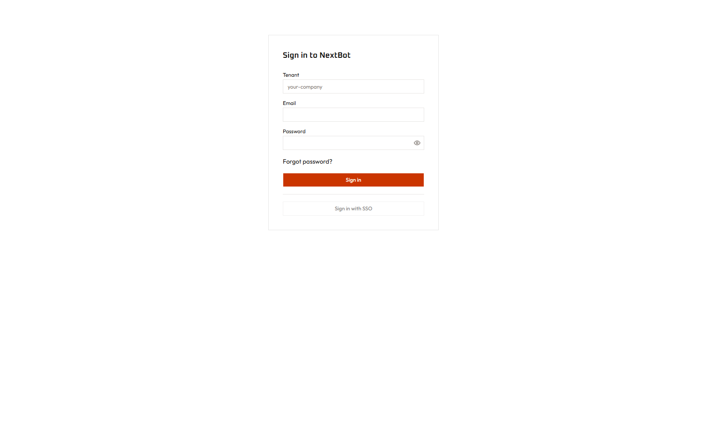

### Forgot password (`/forgot-password`)
Email-only reset request. Deliberately gives the same "if an account exists" response
whether or not the address is real, so the form can't be used to enumerate registered
emails.

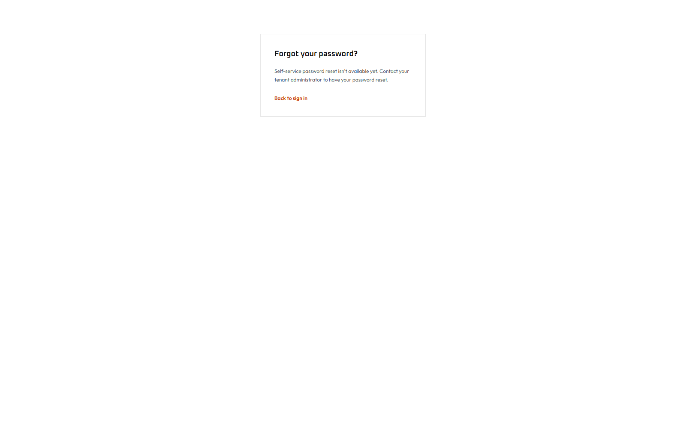

### Platform Manager login (`/internal/ops/login`)
A separate, unrelated login for the cross-tenant operator console (see §5) — an
operator token, not a tenant account. Gated additionally by an IP allowlist. This page
and every page under it is designed to be byte-for-byte indistinguishable from a
genuinely missing page to anyone who isn't both on the allowlist and holding a valid
token — see §5 for why.

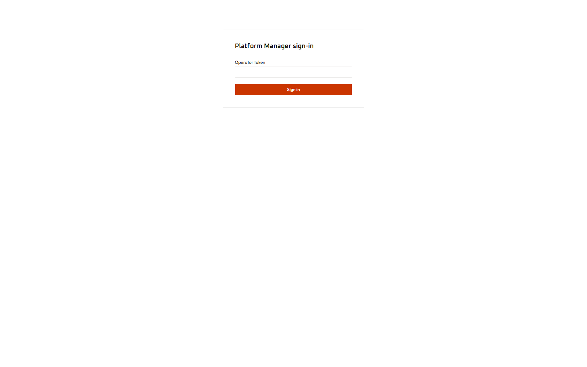

---

## 2. Day-to-day operations (Admin Console)

### Dashboard (`/dashboard`) — module: `reporting`
Landing page after login. High-level tenant metrics (conversation volume, escalation
rate, tool-call activity) at a glance.

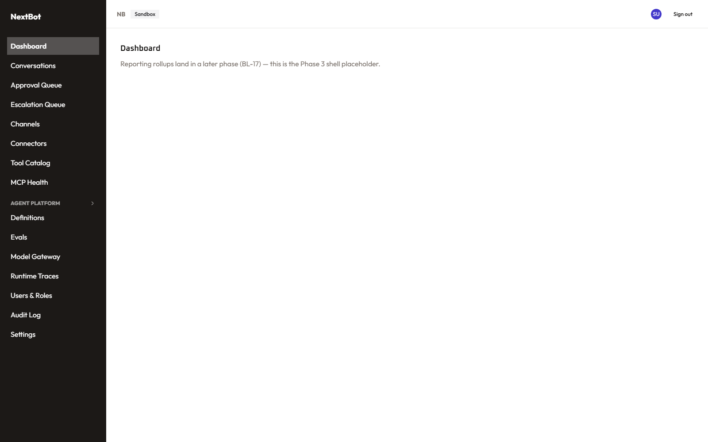

### Conversations (`/conversations`, `/conversations/[id]`) — module: `conversations`
The list of every conversation the tenant's agents have had, filterable by status,
recognized task/intent, language, and date range. Opening one shows the full
transcript, the agent's reasoning trace (collapsible, so the transcript itself stays
readable), and any tool calls it made along the way with their arguments/results.

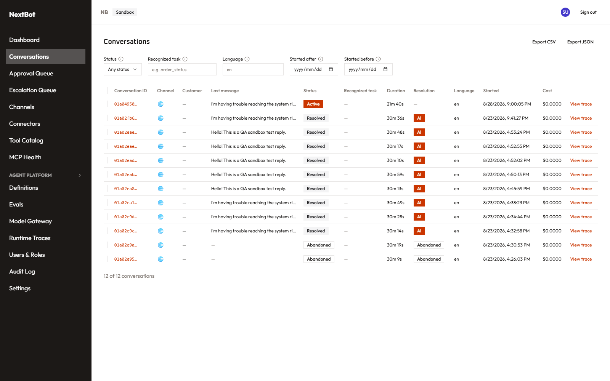

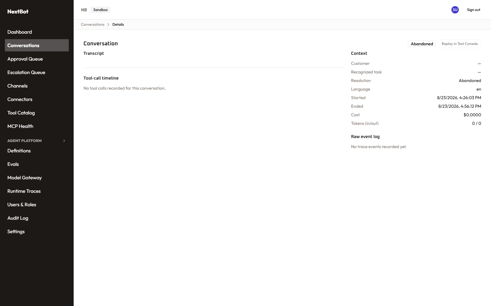

### Approval Queue (`/approvals`) — module: `approval_queue`
Tool calls an agent wants to make that are classified as high-risk (Tier-3) sit here
pending a human decision — approve or deny, with an optional note. This is the human
checkpoint in the tool-tiering system: Tier-1 calls run automatically, Tier-2 calls are
logged, Tier-3 calls stop here until a person signs off.

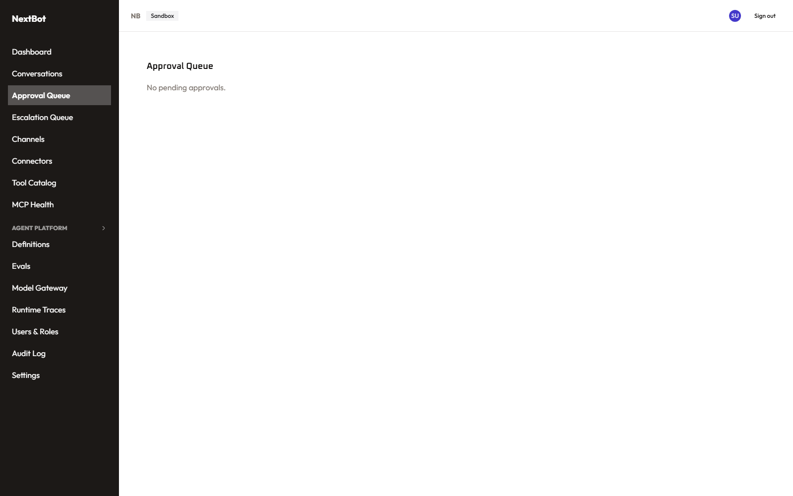

### Escalation Queue (`/escalations`, `/escalations/[id]`) — module: `escalations`
Conversations an agent handed off to a human (low confidence, an explicit customer
request, or a guardrail trip) land here. Opening one is a live takeover panel: send a
message directly to the customer, see the same reasoning/tool-call history the agent
had, and either resolve the escalation or hand it back to the bot.

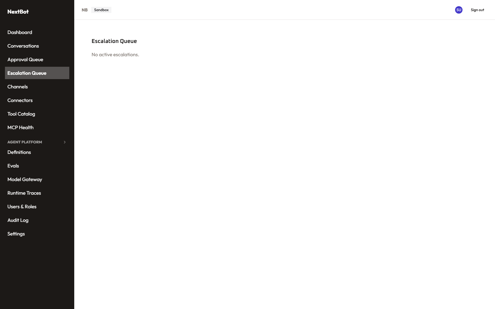

### Channels (`/channels`, `/channels/new`) — module: `channels`
Where a tenant's customer-facing entry points live — currently a Web Widget channel
type and a WhatsApp Business channel type, added via a type-picker → type-specific
setup flow. Each channel's detail page (WhatsApp's, specifically) lets you configure
the Meta/WABA connection, webhook, and consent settings, and every mutating control
disables itself for a Read-only viewer rather than hiding — so a viewer can see the
full configuration without being able to change it.

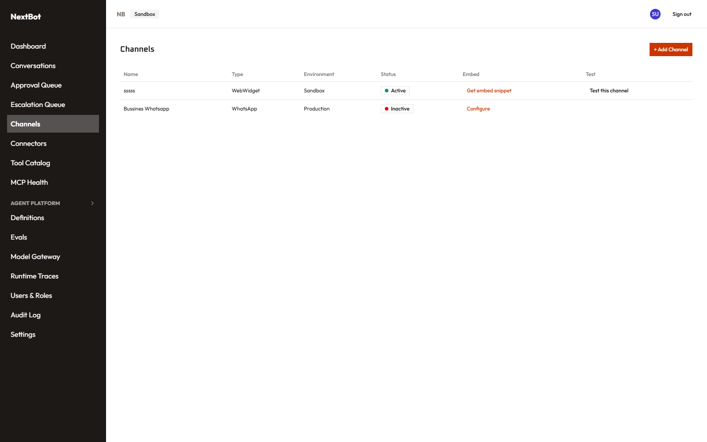

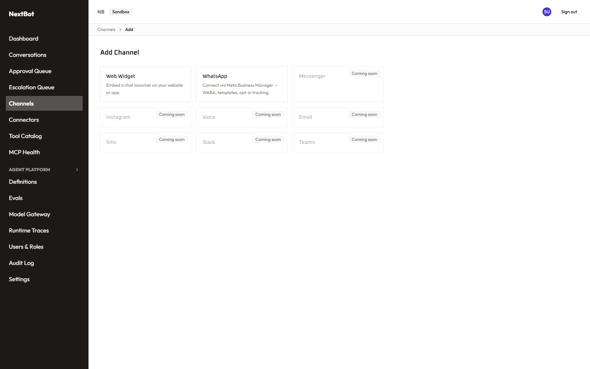

### Channel test (`/channels/[channelId]/test`)
A live, real chat panel embedded right in the console, running the channel's actual
currently-deployed Production agent version — the same experience a real customer
would get, useful for confirming a channel actually works without opening a separate
browser tab to the public widget URL.

### Connectors (`/connectors`, `/connectors/new`, `/connectors/[id]`) — module: `connectors`
An MCP connector is a backend system (a CRM, a ticketing system, an internal API — or,
per the newly-seeded examples, a knowledge-graph Memory server, a web-Fetch server,
Azure DevOps, or Microsoft 365) that exposes tools an agent can call. Adding one is a
form: name, description, backend type, environment, transport (streamable HTTP or a
gateway-mediated stdio process), endpoint URL, and an authentication method with the
credential itself stored in the encrypted credential vault, never shown back in
plaintext once saved. Its detail page shows live health status.

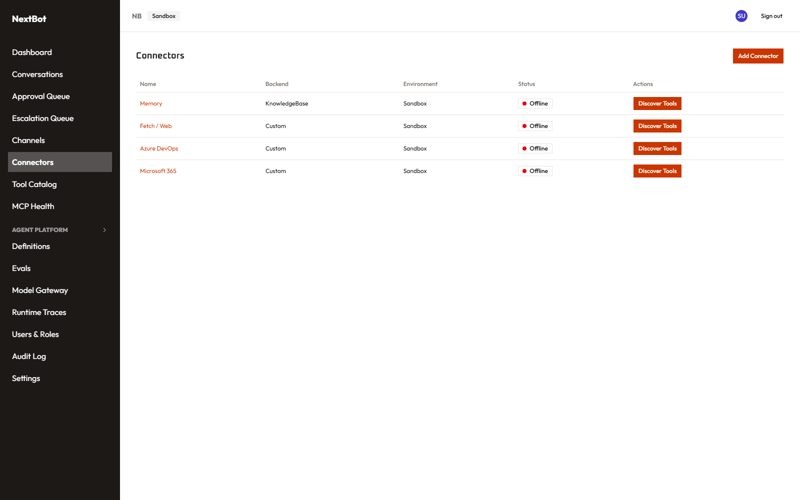

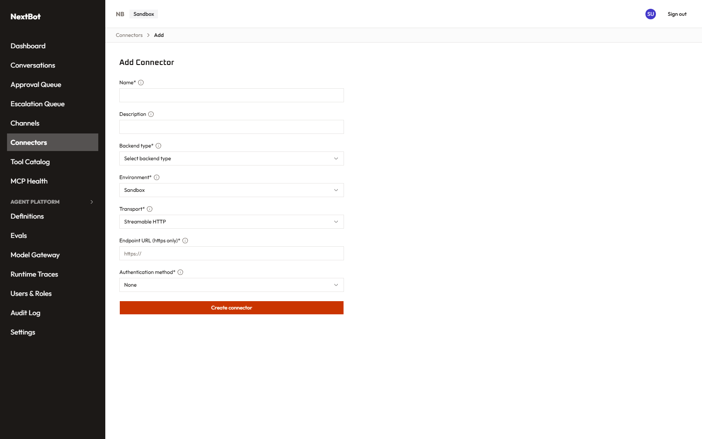

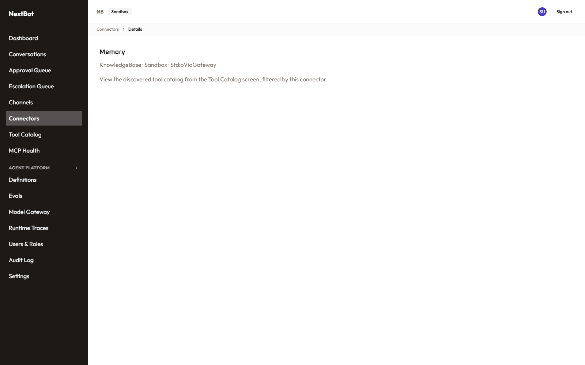

### Tool Catalog (`/tools`, `/tools/[id]/permissions`) — module: `tool_permissions`
Every tool discovered across every connector, in one searchable list, tagged with its
read/write classification and its approval tier (auto/logged/human-approval-required).
Two controls sit behind a *different* permission module (`agent_tool_config`) than the
list itself: whether a tool is visible to agents at all, and its priority weight when
several tools could serve the same request — so a viewer with Read on the catalog but
not on tool configuration can see everything and change nothing. Each tool's own
permissions page lets you write explicit allow/deny rules scoped by tool, connector, or
backend type, with a "simulate" preview of what a given rule set would actually decide.

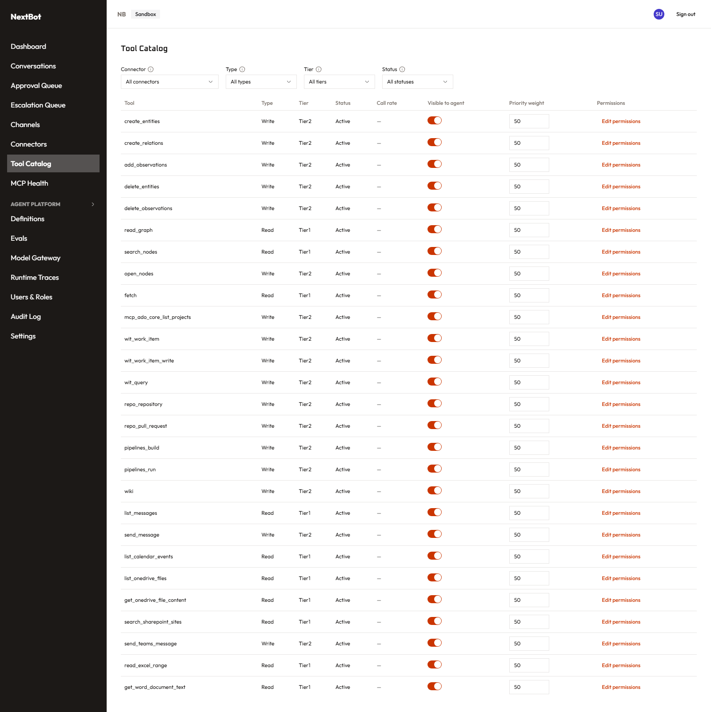

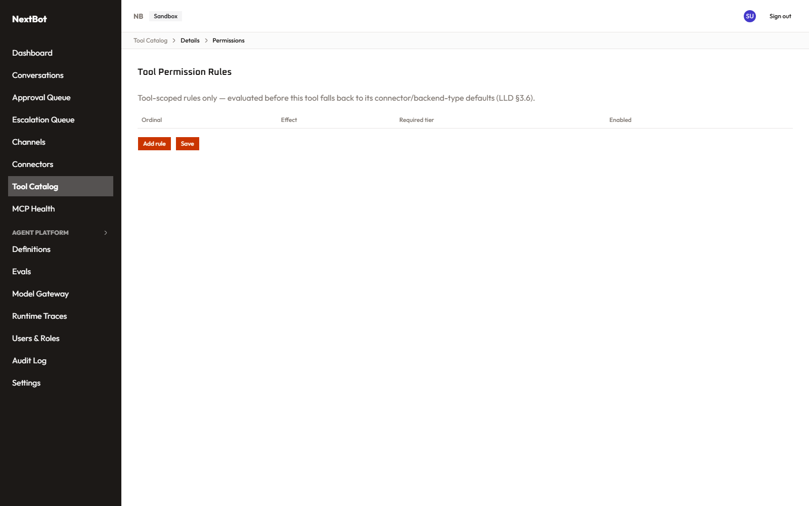

### MCP Health (`/mcp-health`) — module: `connectors`
Two tabs. **Health**: live status per connector/tool, latency, and recent error
history — the operational view for "is anything broken right now." **Alert
Configuration**: per-connector/tool alert rules (a threshold, a destination, and for
email destinations a target address) — this used to be its own separate page
(`/settings/connector-alerts`) but was folded in here as a tab, since alert
configuration is really part of health monitoring, not a tenant-wide setting; the old
URL still works, it just redirects here.

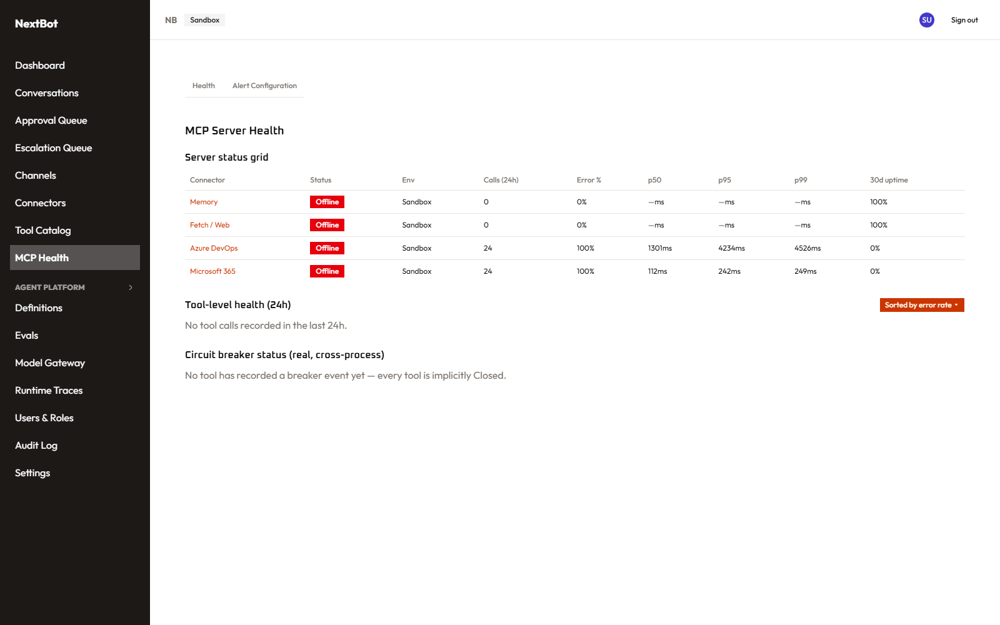

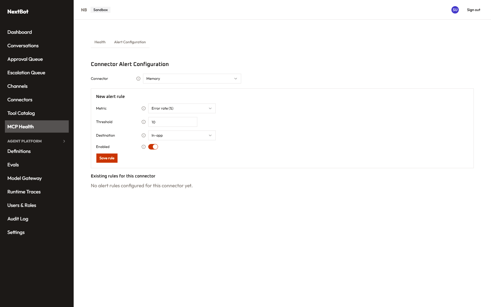

---

## 3. Agent Platform — building and running agents

Everything in this section shares one sidebar group ("Agent Platform") and one
permission module (`agent_platform`).

### Definitions (`/agent-platform/definitions`, `/agent-platform/definitions/[id]`)
An **agent definition** is the named, versioned "thing" a channel actually talks to —
think of it as the agent's identity, with a history of versions underneath it. The
list shows every definition, its version count, and which version (if any) is live in
Production. A definition's detail page lists every version with its status (Draft →
EvalGated → HumanReview → Approved → Production → Deprecated), whether it has a linked
Git commit/PR, and row actions: open it, compare two versions, promote one, or
**Restore** an old version — which creates a brand-new version pre-filled with that old
one's content (versions themselves are immutable and never mutated; restoring is
"author a new version from an old one," not a rollback).

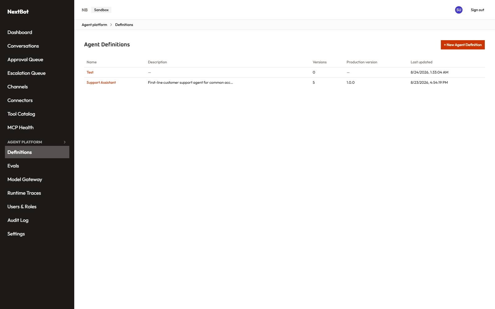

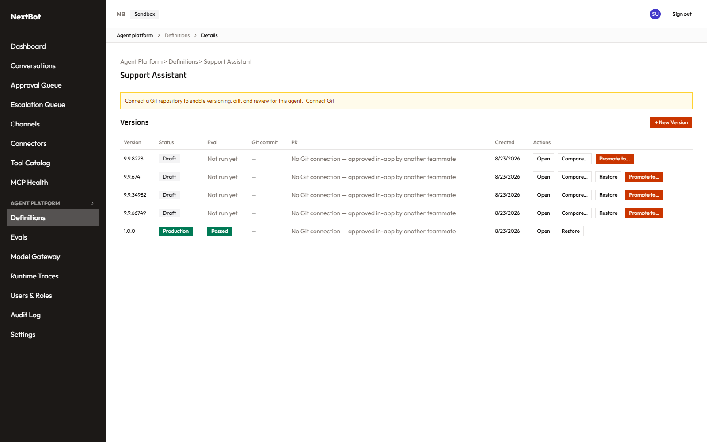

### Create/edit a version (`/agent-platform/definitions/[id]/versions/new`)
This is where an agent's actual behavior gets authored, in one of two interchangeable
modes:
- **Text mode**: a raw YAML editor for the full definition (model route, system
  instructions, tool policy, guardrails, memory strategy, eval suite, cost/latency
  budgets).
- **Design mode**: the identical content as a real structured form — a section per
  concern, including a real picker for which Tool Registry capability groups
  (e.g. "Knowledge & Web," "DevOps & Code") this version's tool calls are scoped to,
  instead of hand-typing group names.

Switching tabs re-derives one representation from the other, so either mode can be
used to build the same version and the YAML underneath is always what actually gets
validated and saved — Design mode is a friendlier way to produce it, not a separate
system. A version can be created and edited entirely without ever connecting a Git
repository (Git sync, when connected, is a bonus for diff/PR review — never a
requirement to make progress).

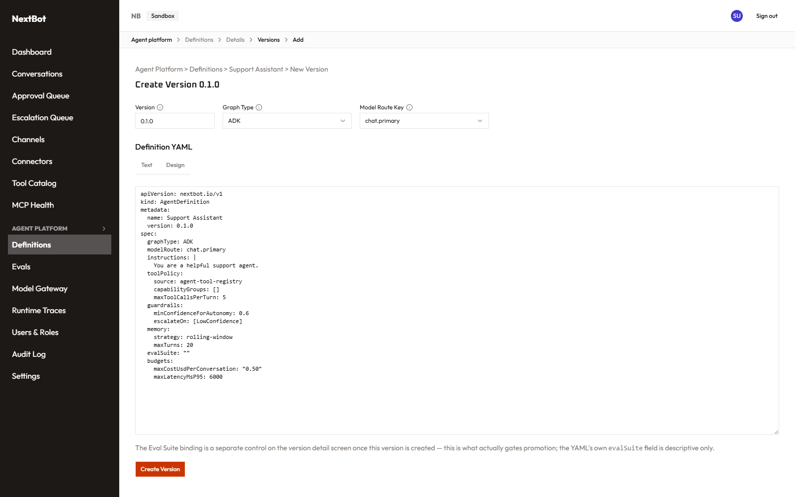

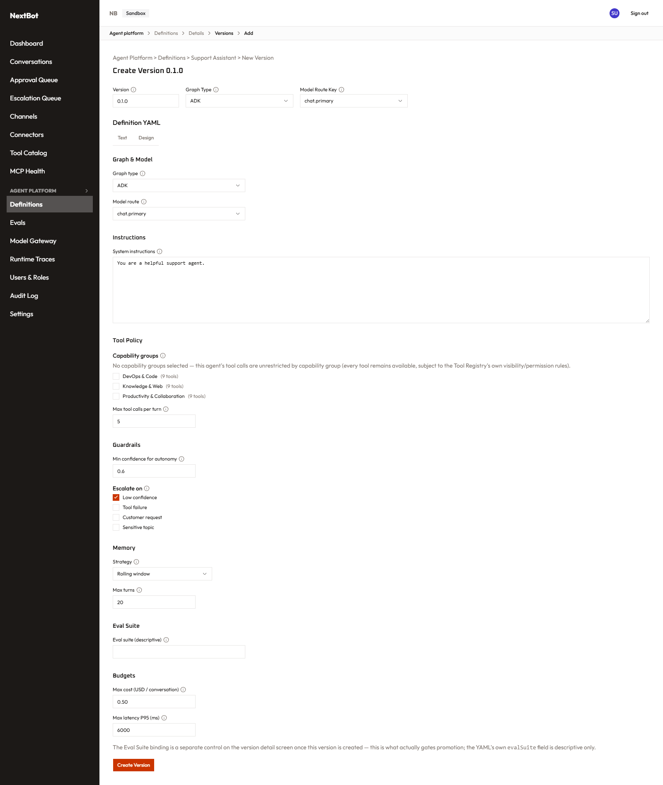

### Promoting a version (Definitions detail page)
Moving a version through Draft → ... → Production requires, at the last step: (1) a
passing eval-suite run, (2) approval from someone *other than* whoever created the
version (an in-app reviewer≠author check — this stands in for Git PR review when no
Git repo is connected, and is enforced either way), and (3) at least one completed
sandbox test conversation against that exact version (see below) — so nothing reaches
real customers without both a second pair of eyes and a real conversation having
actually been tried against it. Promoting a follow-up version for an agent that's
already live in Production correctly replaces the prior deployment rather than trying
to run two at once.

### Version detail (`/agent-platform/versions/[versionId]`)
Three tabs on one version: **Overview** (the read-only YAML — versions never change
after creation, so this is always exactly what was saved), **Eval** (bind an eval
suite, run it, see per-case pass/fail history), and **Sandbox** — a real, live chat
panel running this exact version in an isolated test conversation, invisible to real
customers and never resumable, which is both how a person manually tries a version
before promoting it and the mechanism that satisfies the sandbox-test promotion gate
above.

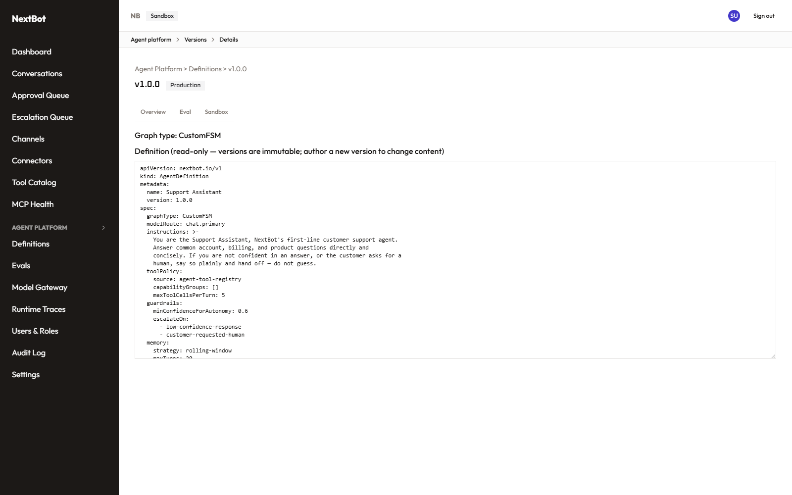

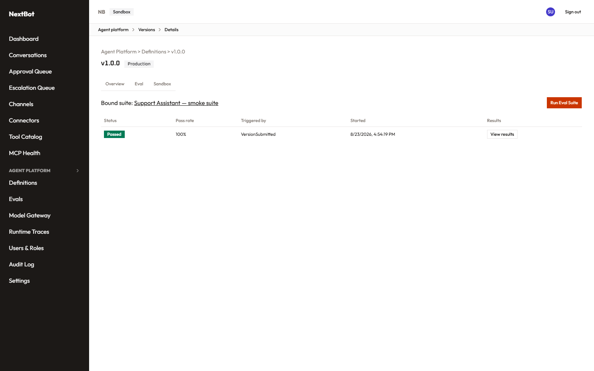

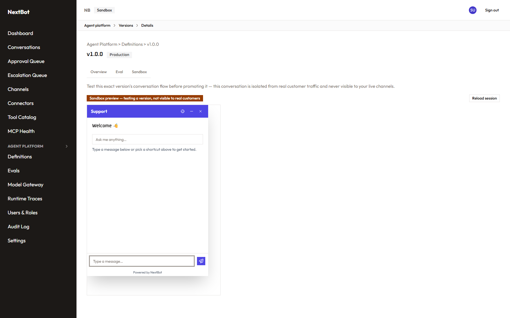

### Evals (`/agent-platform/evals`, `/agent-platform/evals/[id]`)
An eval suite is a named set of test cases — each a scripted mini-conversation with an
expected-response pattern, a pass threshold, and a cost/latency budget — used to
mechanically check whether a version behaves as intended before a human ever looks at
it. The detail page is where individual cases get authored and run.

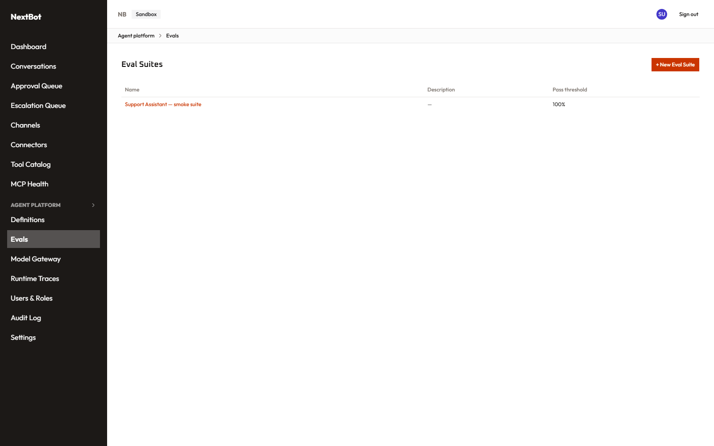

### Model Gateway (`/agent-platform/model-gateway`)
Two tabs. **Routes**: the named model routes an agent's `modelRoute` field points at
(e.g. `chat.primary`) — each is a chain of one or more providers, either a
platform-registered one or a "bring your own endpoint" with its own credential, plus
cache mode and timeout settings; editing a route opens a side panel rather than an
always-open form, to keep the list itself readable. **Provider Registry**: a read-only
list of the platform-level providers available to route to. Model names typed here are
lightly validated (no stray whitespace/`@`-shaped strings) to catch the obvious
data-entry mistake of pasting the wrong thing into the field.

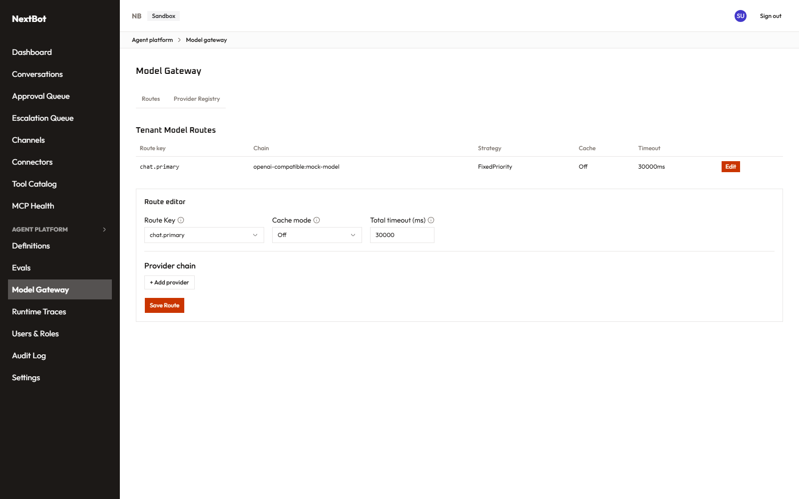

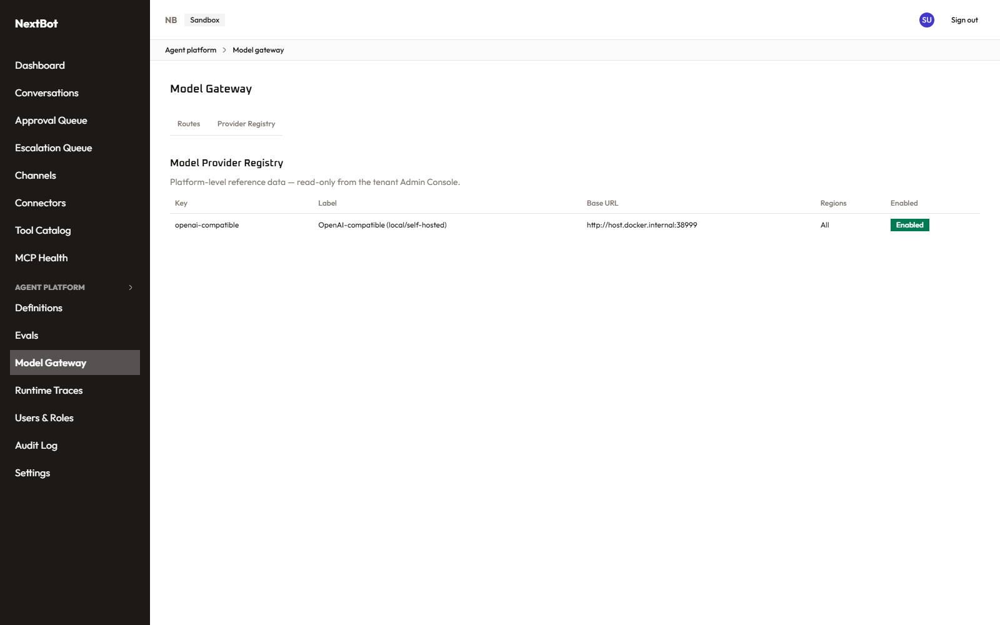

### Runtime Traces (`/agent-platform/traces`)
A filterable log of real agent-run executions — which definition/version handled a
given turn, how long it took, and what happened — useful for debugging a specific
run after the fact rather than watching health in aggregate.

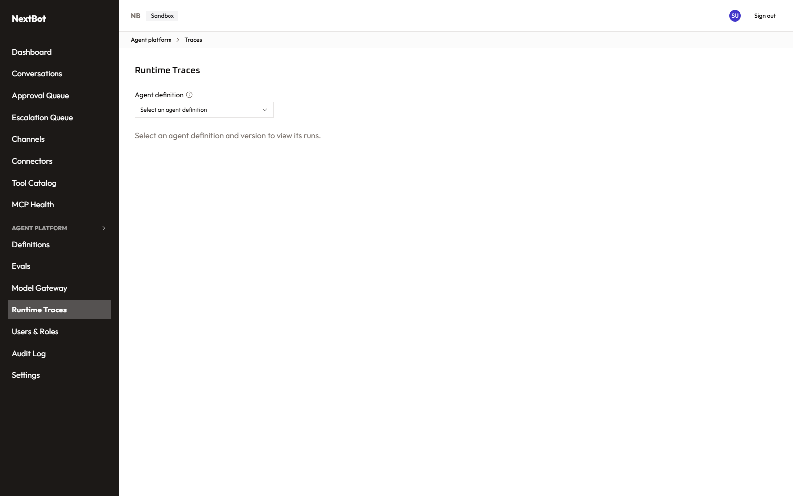

### Diff (`/agent-platform/diff`)
Side-by-side comparison of two versions' YAML — reached from a definition's "Compare…"
action, not from the sidebar directly. Only available when both versions have a real
Git commit behind them (this is a genuine Git-provider diff API call, not a local
text diff), since a version without one has nothing on the Git side to compare.

---

## 4. Settings

### Settings hub (`/settings`)
A landing page of cards linking to every tenant-configuration screen below, added so
there's one obvious place to start rather than a flat list of unrelated sidebar
entries. Each card only appears if the signed-in role can actually read that screen —
same fail-closed rule as everywhere else, just applied per-card instead of per-nav-item.
(Model Gateway isn't listed here — it stays grouped under Agent Platform, since that's
where the underlying spec places it.)

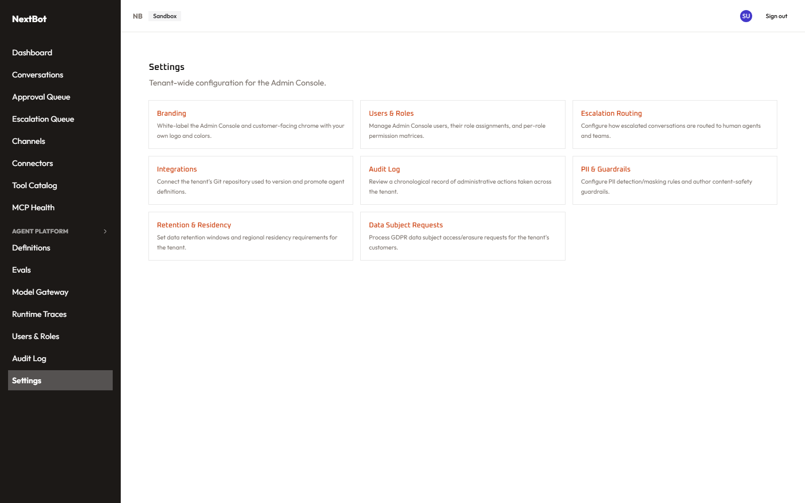

### Branding (`/settings/branding`) — module: `security_settings`
Primary/secondary color, logo, favicon (auto-generated from the logo if none is
supplied separately), and font. An optional "white-label" toggle extends the tenant's
colors into the Admin Console's own top bar and sidebar chrome (scoped narrowly to
those, not repainted across every button in the app) and onto the public login page
for that tenant.

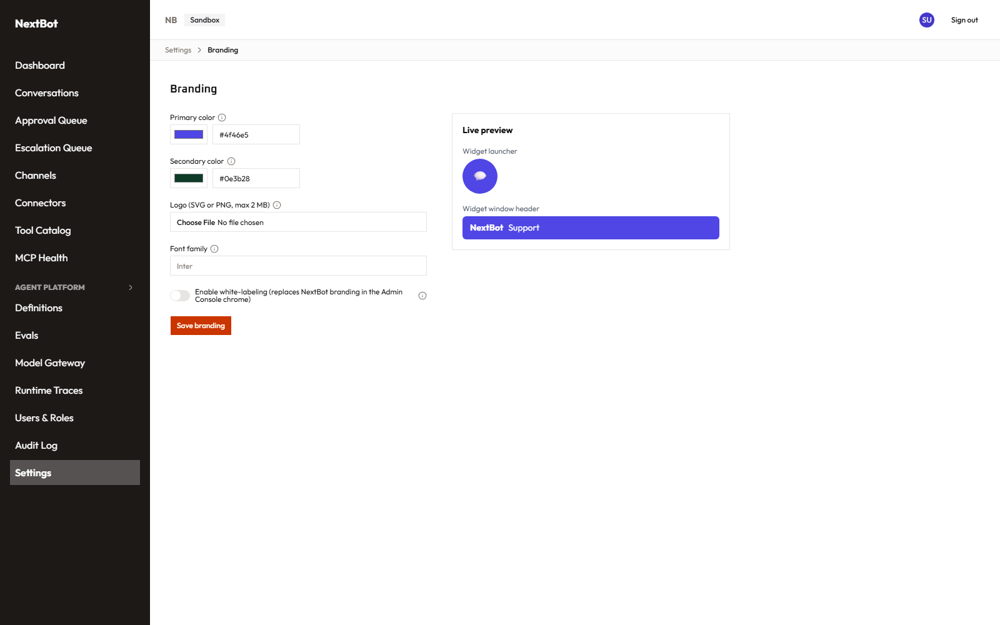

### Escalation Routing (`/settings/escalation-routing`) — module: `escalations`
Rules mapping a recognized goal/channel combination to a specific queue, plus a
fallback rule for anything that doesn't match — this is what decides which team an
escalated conversation lands in front of.

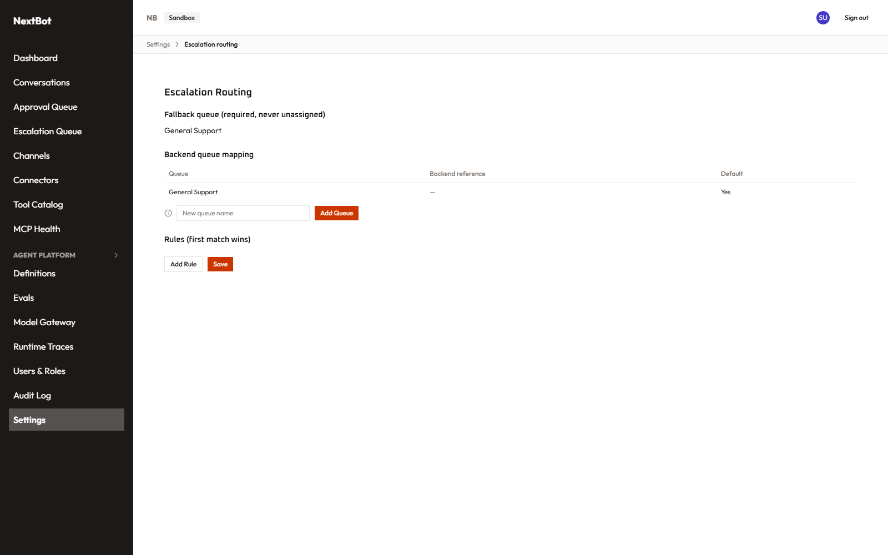

### Integrations (`/settings/integrations`) — module: `agent_platform`
The tenant's single Git connection (GitHub or GitLab), used for optional version
sync/PR review in the Agent Platform. One connection per tenant, not per agent.
Connecting is a real OAuth handshake; the callback screen (`/settings/integrations/git-callback`)
completes it and shows a mandatory data-residency disclosure before the connection is
finalized.

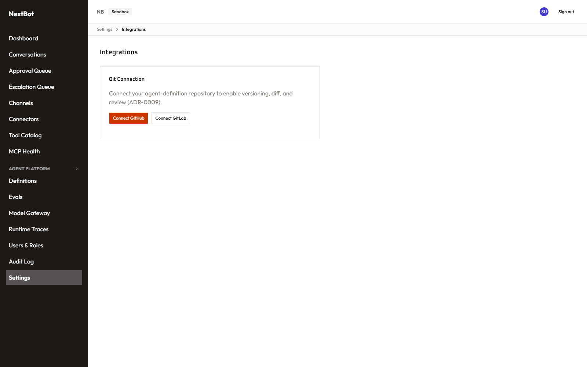

### PII & Guardrails (`/settings/pii-guardrails`) — module: `security_settings`
Three related configuration surfaces: detection rules (which PII entity types to
recognize, including custom regex-based ones), a masking-context matrix (how to treat
a given entity type in a given context/trust-level combination — unconfigured
combinations default to full masking, fail-closed), and pre-tool-call guardrails that
can block a specific tool call outright with a stated reason.

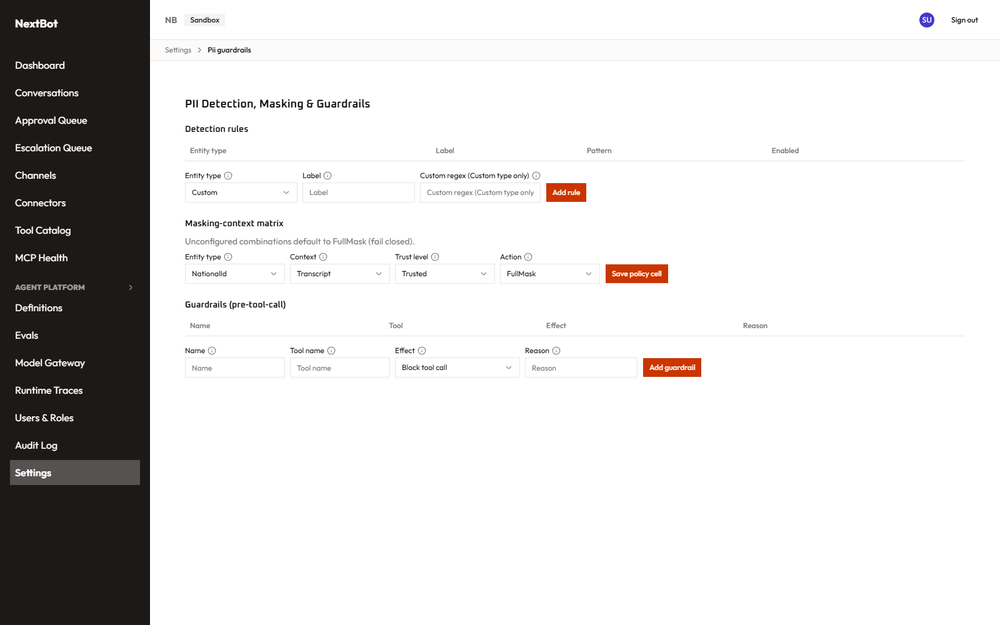

### Retention & Residency (`/settings/data-policy`) — module: `security_settings`
How long conversation data is kept before automatic purge, and which storage region
the tenant's data lives in (plus whether out-of-region inference is permitted for the
AI subsystem).

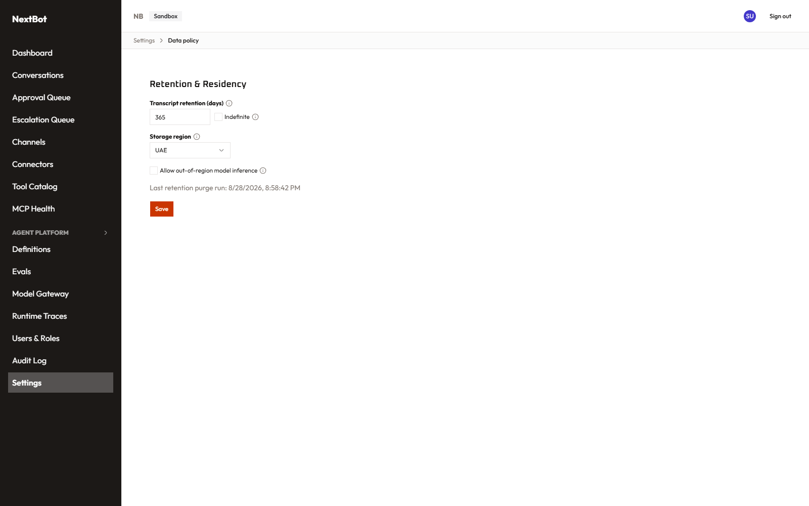

### Data Subject Requests (`/settings/dsr`) — module: `security_settings`
The GDPR tool: look up everything stored about a given customer identifier and export
or delete it.

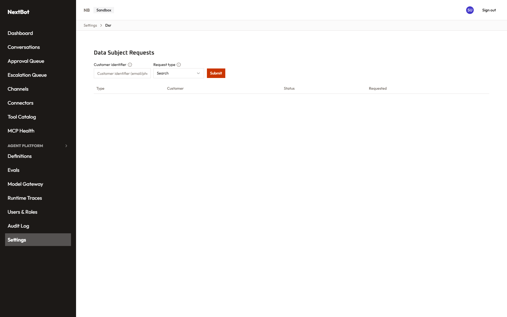

### Users & Roles (`/roles`) — module: `users_roles`
Every user in the tenant plus the role/permission-matrix editor. A Read-only viewer
sees the full picture but every mutating control (invite a user, create/edit a role,
change someone's roles, reset MFA) is disabled rather than hidden, so it's clear what
exists without implying it can be changed.

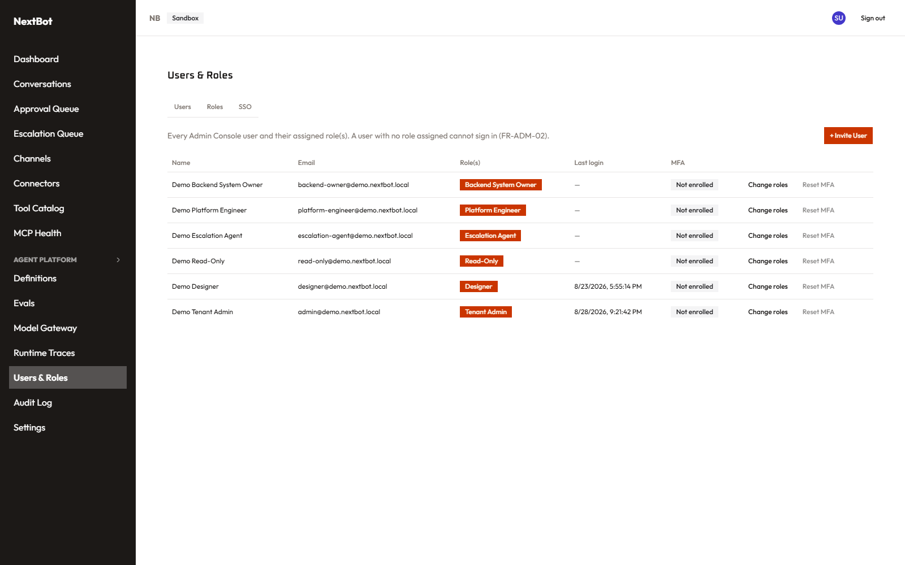

### Audit Log (`/audit-log`) — module: `audit_log`
A searchable record of administrative actions (logins, connector changes, permission
edits, Tier-3 approval decisions, escalation claims, and more) with real actor
attribution, filterable by actor/action type/target type/date/outcome.

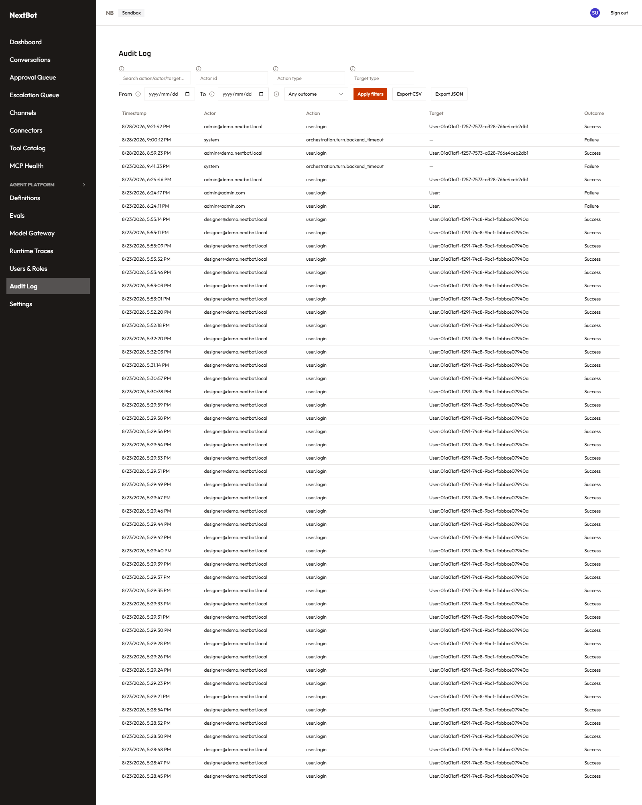

---

## 5. Platform Manager console — cross-tenant operator surface

A completely separate, internal-only console (public path `/internal/ops/**`, gated by
an operator token + IP allowlist, not a tenant login) for whoever runs the NextBot
platform itself, not any one tenant. Every page here is deliberately built so that a
denied request — wrong token, disallowed IP, or the whole feature turned off — is
byte-for-byte indistinguishable from that page genuinely not existing, so an outside
observer can't even confirm this console is there, let alone reachable.

### Login (`/internal/ops/login`)
Operator token entry, rate-limited. (Screenshot in §1.)

### Tenant List / Detail / Provisioning (`.../tenants`, `.../tenants/[id]`, `.../tenants/new`)
Every tenant on the platform, its status, plan tier, and live quota usage at a glance.
The detail page lets an operator change a tenant's status, relabel its plan tier
(without ever silently touching its quota), or explicitly re-seed its quota back to
the tier's current defaults — a separate, deliberate action, never a side effect of
relabeling. Provisioning creates a brand-new tenant.

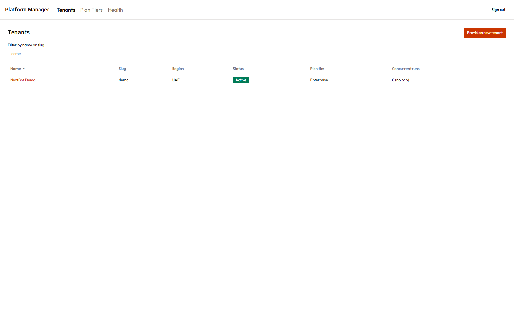

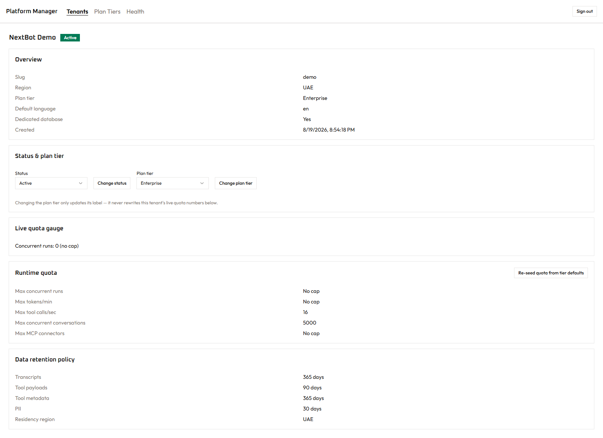

### Plan Tiers (`.../plan-tiers`)
Edit the quota defaults and descriptive feature notes for the Starter/Growth/
Enterprise tiers — these apply to newly-provisioned tenants going forward, never
retroactively to an already-running tenant.

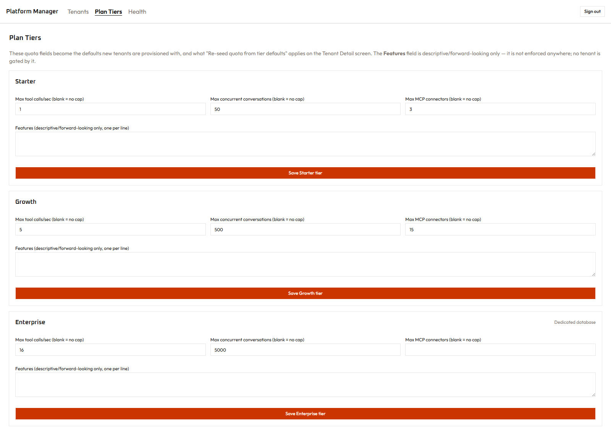

### Health (`.../health`)
A cross-tenant rollup of connector health — which tenants have a degraded or offline
connector right now, worst-first — built specifically to expose only metadata
(connector name, status, error class/count) and never any conversation content, per
the operator's need-to-know boundary.

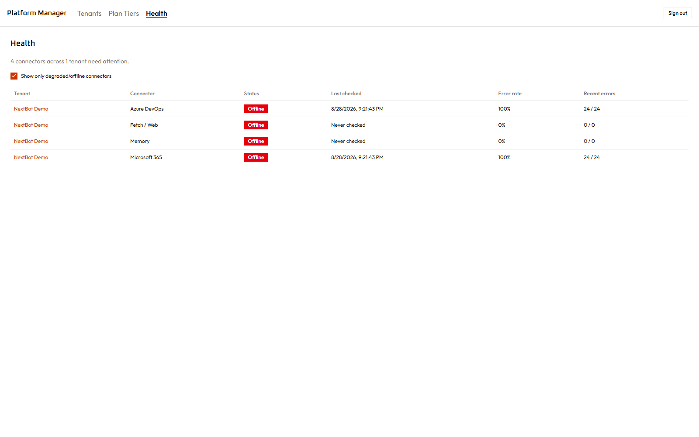

Every mutation anywhere in this console writes to its own platform-level audit trail,
separate from any tenant's own audit log.

---

## 6. The customer-facing widget

Not an admin screen at all — the actual chat interface a tenant's customers see,
embedded via a `<script>` loader on the tenant's own website. It's a standalone
application (not iframed admin-console code) specifically so its styling can never
leak into or out of a customer's page, and so it faithfully reflects exactly what a
real customer would experience — the same reason it's the thing reused, rather than a
lighter mock-up, for both the "test this channel" and "sandbox preview a version"
screens described above.

*(This screenshot shows the widget loaded standalone, outside its normal embedding
context — the loader script normally supplies a full session handshake that only
succeeds when embedded on a real page via `<script>`, so a bare, direct load like this
correctly shows its "temporarily unavailable" state rather than a working chat. This is
expected behavior for this specific way of viewing it, not a defect.)*
