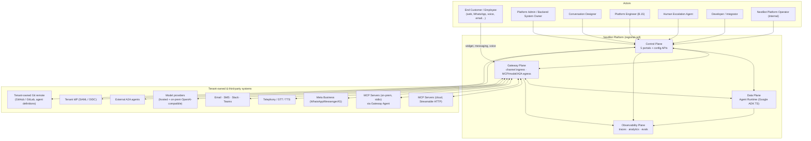
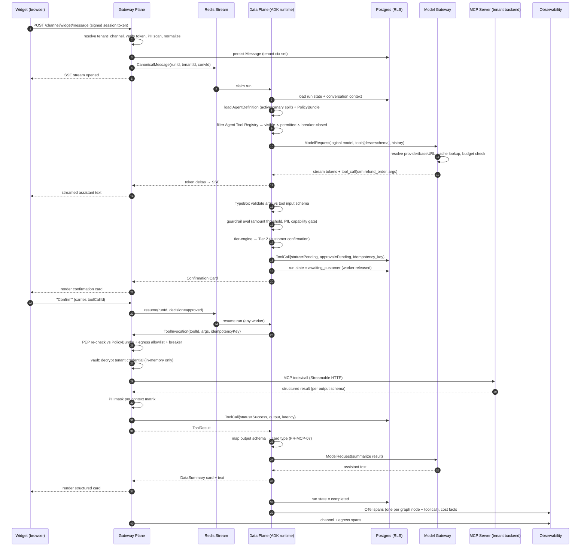
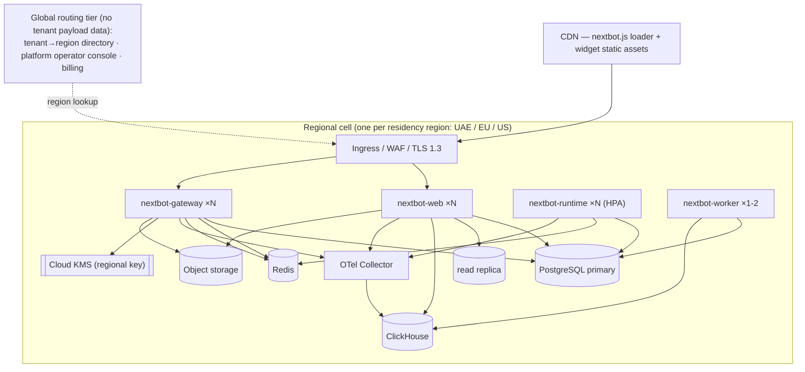
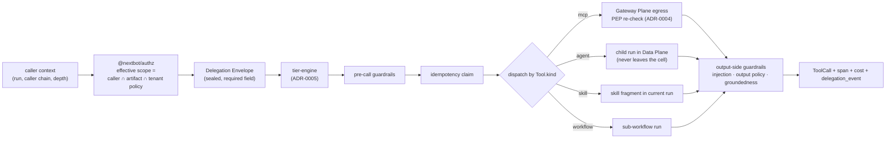
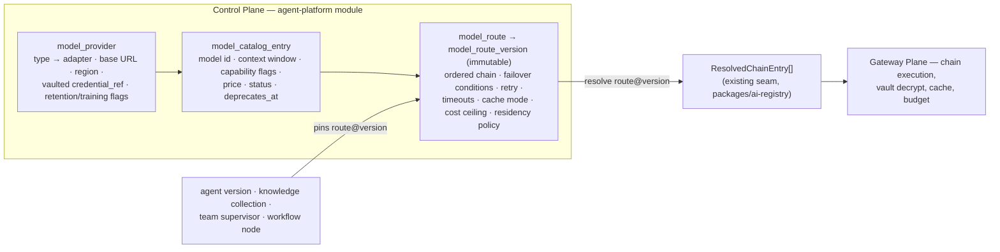

# NextBot — High-Level Design (HLD)

**Status:** v1.0 · 2026-08-15
**Source of truth:** `docs/PRODUCT_SPECIFICATION.md` (FR-*/NFR-*), `docs/BACKLOG.md` (phasing)
**Companion documents:** `docs/architecture/LLD.md` (owned by the LLD agent), `docs/architecture/adr/` (ADR-0001 … ADR-0008)
**Scope of this document:** system context, top-level decomposition (four planes), service/module
boundaries, end-to-end data flow, deployment topology, security model, data/API/scaling strategy,
and the NFR → component mapping. Field-level schema, API contracts, and class design are LLD scope
and deliberately not duplicated here.

**Addendum (2026-08-28):** §§1–14 below describe the **first-wave platform as shipped** and are
preserved verbatim. **§15 is an addendum** covering the second wave — the six Blueprint modules
(MCP Definition Registry, Knowledge and Graph RAG, Skills + Agent Design Studio, Workflow Designer,
Multi-agent Orchestration, Model Gateway v2; spec §4.14–4.17 and the §4.3/§4.10/§4.11 extensions,
backlog Phases 6–10) — and adds **ADR-0011 … ADR-0018** to the ADR set referenced above. Where §15
extends or narrows an earlier statement it says so explicitly and cites the section; nothing in
§§1–14 was rewritten.

---

## 1. Architectural Summary (read this first)

| Dimension | Decision | ADR |
|---|---|---|
| Application stack | **Stack B — Next.js (App Router) full-stack + Google ADK TypeScript** (hard constraint, spec §9.2) | [0002](adr/0002-stack-architecture-style-and-deployment-topology.md) |
| Schema library | **TypeBox** everywhere (forms, Route Handlers/Server Actions, inter-service contracts, ADK structured output) — mandatory, AI subsystem present | 0002 |
| Architecture style | **Modular monolith per plane**, four planes as separately deployable services (not microservices-per-feature) | 0002 |
| Deployment topology | **Multi-container, 4 application images**, deployed as a **regional cell** per data-residency region | 0002 |
| Multi-tenant isolation | **Shared schema + PostgreSQL Row-Level Security**, transaction-scoped tenant context, per-tenant envelope-encrypted credentials, per-tenant runtime quotas; **dedicated-database escape hatch** on the same schema for enterprise tier | [0001](adr/0001-multi-tenant-isolation.md) |
| Agent runtime | Google ADK TypeScript behind a **`GraphRuntime` port**, preserving `graph_type` pluggability (NFR-12) | [0003](adr/0003-agent-runtime-google-adk-and-pluggable-graphs.md) |
| MCP transport | Streamable HTTP direct from Gateway Plane; stdio only via the on-prem **Gateway Agent** reverse tunnel; **all** MCP egress through one choke point | [0004](adr/0004-mcp-transport-and-egress-choke-point.md) |
| Approval tiers / HITL | Durable run suspension in Postgres + server-issued idempotency keys with a unique-constraint claim | [0005](adr/0005-approval-tiers-hitl-suspension-and-idempotency.md) |
| Model access | **Model Gateway is the §2 provider-agnostic registry** — logical model names only, OpenAI-compatible `baseURL` for on-prem, no provider SDK outside it | [0006](adr/0006-model-gateway-provider-abstraction-and-data-locality.md) |
| Credential vault | Cloud-KMS envelope encryption, per-tenant DEK, ciphertext readable only by the Gateway Plane role | [0007](adr/0007-credential-vault-envelope-encryption.md) |
| Telemetry / analytics | OpenTelemetry → Collector → **ClickHouse**; Postgres stays OLTP-only | [0008](adr/0008-observability-and-analytics-store.md) |

**One-line description.** NextBot is a regionally-celled, multi-tenant SaaS composed of four
cooperating planes — a Next.js **Control Plane** (all five portals + configuration APIs), a
horizontally scaled **Data Plane** (the Google-ADK agent runtime), a **Gateway Plane** (every
inbound channel and every outbound model/MCP/A2A call), and an **Observability Plane** (OTel traces,
analytics, evals) — over one PostgreSQL cluster per region with row-level tenant isolation.

---

## 2. System Context



**Context rules that hold everywhere:**

1. No component other than the Gateway Plane opens a connection to a tenant-owned or third-party
   system **as part of agent-run execution** (MCP, model providers, channels, A2A). The Data Plane
   has no outbound internet egress at all (ADR-0004, ADR-0006). The Control Plane's own narrow,
   admin-console-initiated exceptions — the tenant IdP for SSO (`CP <--> IDP`) and, as of Decision 2
   (ADR-0009), the tenant's connected Git remote for agent-definition versioning (`CP <--> GITR`) —
   are outside this choke point by design: they are one-off administrative calls, not the
   high-volume runtime egress path §2's rule exists to gate.
2. No tenant-scoped byte leaves its region's cell (FR-SEC-05, NFR-6; §7.4).
3. Every plane writes telemetry; only the Observability Plane reads it back for reporting.

---

## 3. Top-Level Decomposition — the Four Planes

The four planes are the product's own vocabulary (Portal B.15, FR-AGT-*), so they are also the
system's top-level decomposition. Each plane is a **modular monolith**: one deployable, internal
modules with enforced boundaries. Planes are split from each other only because NFR-3 explicitly
requires "horizontal scale-out of the Data Plane independent of Control/Gateway/Observability
planes" — that is the documented requirement satisfying the multi-container escape hatch
(ADR-0002).

```mermaid
graph LR
    subgraph CP["CONTROL PLANE — nextbot-web (Next.js)"]
        direction TB
        P_A["Portal A host route<br/>+ widget SDK build target"]
        P_B["Portal B — Admin Console"]
        P_C["Portal C — Designer Studio"]
        P_D["Portal D — Human Agent Bridge"]
        P_E["Portal E — Developer Portal"]
        M_TEN["tenancy · users · roles · RBAC"]
        M_CON["connector & tool registry"]
        M_POL["policy authoring (PDP)"]
        M_AGT["agent definition registry"]
        M_DEP["deployment & canary manager"]
        M_APR["approval queue"]
        M_ESC["escalation console"]
        M_AUD["audit log · DSR · retention"]
        M_RPT["reporting BFF"]
    end

    subgraph DP["DATA PLANE — nextbot-runtime"]
        R_ORCH["Run Orchestrator (durable state machine)"]
        R_ADK["GraphRuntime port → Google ADK TS adapter"]
        R_TOOL["Tool selection & param extraction"]
        R_GRD["Guardrail evaluator (pre-call)"]
        R_TIER["Approval-tier engine"]
        R_COMP["Tool composition executor"]
        R_ESC["Escalation trigger"]
    end

    subgraph GP["GATEWAY PLANE — nextbot-gateway"]
        G_CH["Channel adapter framework<br/>(widget, Meta, voice, email, SMS, Slack, Teams)"]
        G_NORM["Canonical message normalizer<br/>+ capability-based render fallback"]
        G_MCP["MCP client pool + PEP + circuit breaker"]
        G_TUN["Gateway Agent tunnel terminator"]
        G_MDL["Model Gateway (provider registry)"]
        G_A2A["A2A server + client"]
        G_VLT["Credential vault accessor"]
    end

    subgraph OB["OBSERVABILITY PLANE — nextbot-otel + nextbot-worker"]
        O_COL["OTel Collector"]
        O_CH["ClickHouse (spans, tool calls, cost, metrics)"]
        O_EVAL["Eval suite runner"]
        O_HLTH["Connector health checker"]
        O_ROLL["Reporting rollups · retention purge · A2A timeout sweeps"]
    end

    CP -->|config reads, cached| DP
    DP -->|tool call intents| GP
    GP -->|inbound normalized messages| DP
    CP --> OB
    DP --> OB
    GP --> OB
    OB --> CP
```



### 3.1 Control Plane — `nextbot-web` (Next.js, App Router)

Owns everything a human configures or reviews, plus all five portal UIs. Single Next.js app;
portals are route groups, not separate deployables (they share auth, tenant context, RBAC, design
system, and i18n — splitting them would duplicate all five).

| Module | Responsibility | FR anchors |
|---|---|---|
| `tenancy` | Tenant record, environments, branding, region binding | ADM-01, ADM-05 |
| `iam` | Users, roles, RBAC permission matrix, SSO group mapping, MFA, lockout | ADM-02, SEC-03 |
| `connectors` | MCP connector CRUD, discovery orchestration, schema diffing, templates, marketplace lookup | MCP-01/02/10/11/15, GEN-01 |
| `toolreg` | Tool Catalog, Agent Tool Registry, visibility, priority weights, capability groups | MCP-03/13, AI-02 |
| `policy` | Permission scope matrix + rule builder; **Policy Decision Point** that compiles rules into a versioned, cacheable policy bundle | MCP-04, SEC-06 |
| `guardrails` | Guardrail rule authoring, parameter-validation hints, PII policy matrix | AI-01/10/11, SEC-04 |
| `designer` | Capability catalog, dialogue playbooks, KB source config | C.1.*, KB-01 |
| `agentdefs` | Agent Definition Registry, semver, promotion pipeline, Git-backed diff, eval binding gate | AGT-01/02/03/06 |
| `deployments` | Active version, traffic split, canary promote, rollback (repoint), rollout history. **As-built note (2026-08-31, ADR-0019):** only the promotion path, the single-active-100%-row deployment, and emergency rollback (ADR-0017) are shipped. Traffic split, canary promote, the rollout-history screen, and the live weighted/sticky resolver are **built in Phase 17 (BL-48)**, and the canary binds at `(tenant, agent_definition, environment)` — see ADR-0019 and LLD §15. | AGT-04/05 |
| `approvals` | Tier-3 Approval Queue UI + decision API | MCP-05, ADM-04 |
| `escalations` | Queue, routing rules, live-takeover panel, return-to-bot | ESC-01…04, AI-08 |
| `conversations` | Conversation list/filter/export, trace viewer, replay hand-off to sandbox | AI-06, RP-08 |
| `audit` | Append-only audit log, search/export, Data Subject Requests, retention config | ADM-03/06, SEC-04 |
| `reporting` | Read-only BFF over the Observability Plane; no aggregation logic of its own | RP-01…08 |
| `a2aadmin` | Agent card editor, Trusted Agent registry, task monitor | A2A-01/05, SEC-07 |
| `devportal` | Docs, API reference, sandbox test console | E.1.* |
| `widget-sdk` | Separate build target: `nextbot.js` loader + iframe-hosted widget route | OC-01 |

The Control Plane **never** executes an agent turn and **never** calls an MCP server or model
provider. Its writes are configuration; its reads for reporting come from the Observability Plane.

### 3.2 Data Plane — `nextbot-runtime` (Node worker fleet)

Stateless workers consuming an agent-run queue; all run state is durable in Postgres so a run can
be suspended for a 3-day Tier-3 approval and resumed on a different pod.

| Module | Responsibility | FR anchors |
|---|---|---|
| `run-orchestrator` | Durable run state machine: `queued → running → awaiting_customer / awaiting_approval / awaiting_human → completed / failed`; owns resume | AGT-09, MCP-05 |
| `graph-runtime` | Port + Google ADK TypeScript adapter; loads the Agent Definition, binds tool handles, streams tokens | AGT-01, §9.2 |
| `tool-selection` | Filters the Agent Tool Registry by visibility + policy + circuit-breaker state, ranks by priority weight with the FR-AI-02 deterministic tiebreak, hands descriptions/schemas to ADK | AI-02, MCP-13 |
| `param-extract` | Validates extracted parameters against TypeBox-compiled tool input schemas + admin hints; emits field-named re-prompts | AI-01 |
| `guardrail-eval` | Evaluates guardrail rules **before** the call is dispatched | AI-10/11 |
| `tier-engine` | Resolves the effective approval tier, mints the idempotency key, drives Tier-2 confirmation cards and Tier-3 queueing | MCP-05 |
| `composition` | Executes admin-authored tool chains with typed field mapping and per-step fallback | MCP-14, AI-03 |
| `escalation-trigger` | Emits escalation on the four FR-ESC-01 reasons with the reason recorded | ESC-01 |
| `cost-meter` | Attributes tokens/cost per turn, tool, goal, channel | AI-12, RP-07 |

### 3.3 Gateway Plane — `nextbot-gateway`

The platform's only I/O boundary. Split from the Control Plane because it terminates long-lived
bidirectional connections (voice media streams, Gateway Agent tunnels, widget SSE) whose scaling
and restart characteristics are incompatible with a request/response web tier that redeploys on
every portal change.

| Module | Responsibility | FR anchors |
|---|---|---|
| `channel-adapters` | One adapter per channel type; inbound webhook/stream → canonical message, canonical message → channel-native payload | OC-02/03/05, META-01…13 |
| `render-fallback` | Capability-metadata-driven degradation (forms → sequential prompts, chips → numbered options, WhatsApp button limits) — authored once, rendered per channel | OC-06, META-* |
| `session-router` | Channel routing rules (first-match-wins, tenant default), session-window policy (WhatsApp 24h), idle/abandon timers | OC-04, AI-06 |
| `mcp-egress` | MCP client pool (Streamable HTTP), **Policy Enforcement Point**, credential injection, per-tool circuit breaker, per-tenant egress allowlist, latency capture | MCP-01/05/08, SEC-06, AGT-10 |
| `tunnel-terminator` | Gateway Agent registration, heartbeat, outbound-initiated reverse tunnel for stdio MCP servers | MCP-12 |
| `model-gateway` | The §2 provider-agnostic registry: logical model names, ordered fallback chain, routing strategy, exact + semantic cache, per-tenant/agent rate & budget caps, 30 s whole-chain timeout | AGT-07/08 |
| `a2a` | Agent card at the well-known URI, inbound task acceptance gated on the Trusted Agent registry, outbound client, task lifecycle | A2A-01/04/05/06, SEC-07 |
| `pii` | Masking applied on the context matrix (transcript / tool payload / A2A payload / export / human view) at the egress and persistence boundary | SEC-04 |
| `vault-accessor` | Only component in the system that can decrypt a tenant credential | SEC-02 |

### 3.4 Observability Plane — `nextbot-otel` (collector + ClickHouse) and `nextbot-worker`

| Module | Responsibility | FR anchors |
|---|---|---|
| `otel-collector` | Receives OTLP from all planes; tenant-tags, samples, and fans out to ClickHouse and (optionally) a tenant's own APM endpoint | NFR-9 |
| `analytics-store` | ClickHouse: spans, tool-call facts, cost facts, channel/goal aggregates; source for every RP-* report | RP-01…07 |
| `eval-runner` | Runs a version's bound golden-set suite on submit-for-review and on demand; writes the pass/fail record the registry's promotion gate reads | AGT-06 |
| `health-checker` | Periodic connector/tool probes, threshold alerting (email/Slack/in-app), circuit-breaker trip/reset state | MCP-08 |
| `sweepers` | Retention purge, A2A `input-required` timeout, conversation abandonment, budget-cap throttle evaluation, reporting rollups | ADM-06, A2A-04, RP-07 |

`nextbot-worker` is a separate deployable from `nextbot-runtime` so that a heavy eval sweep or a
retention purge can never consume the capacity that conversational turns need (NFR-2).

---

## 4. Cross-Plane Contracts

Three internal contracts keep the planes decoupled. All are TypeBox-defined and versioned.

| Contract | Direction | Transport | Notes |
|---|---|---|---|
| `CanonicalMessage` | Gateway ⇄ Data | Redis Streams (durable, per-tenant partition key) | Channel-neutral inbound/outbound message envelope. Every channel adapter's only output shape. |
| `ToolInvocation` / `ToolResult` | Data → Gateway → Data | Internal HTTPS (mTLS) | Runtime never names a URL, credential, or transport — only `toolId`, args, `idempotencyKey`, `runId`. The Gateway resolves everything else. ADR-0004. |
| `ModelRequest` / `ModelResponse` | Data → Gateway | Internal HTTPS (mTLS), SSE for streaming | Logical model name only; never a vendor model id. ADR-0006. |
| `PolicyBundle` | Control → Data/Gateway | Versioned snapshot in Postgres + Redis pub/sub invalidation | Compiled permission matrix + guardrails + tier defaults. Read path is a cache lookup, not a cross-service call, so a Control Plane outage cannot stop conversations (NFR-1). |

---

## 5. Representative End-to-End Flow

Widget message → agent reasoning → tool discovery/selection → approval gate → MCP call →
structured card. Shown with a Tier-2 confirmation because it exercises every boundary.



**Failure branches folded into the same flow (not separate designs):**

- Tier 3 → step 20 writes `awaiting_approval` and enqueues to the Approval Queue instead; the
  conversation stays open for other topics (FR-MCP-05 concurrency rule) because suspension is
  scoped to the *tool call*, not the run's ability to accept new turns.
- MCP call fails / breaker open → `ToolResult{error}`; runtime emits the FR-AI-05 tool-call-failure
  fallback and writes the correlatable audit event, so "I've logged this" is factual.
- All model providers in the chain unavailable → Model Gateway returns after the 30 s chain
  timeout; runtime emits the backend-timeout fallback (FR-AGT-08).
- Policy denies at the PEP → hard reject before the MCP server is contacted (FR-SEC-06); the model
  never sees the tool as callable in the first place because tool-selection filtering already
  applied the policy bundle. Defense in depth: decision at selection, enforcement at egress.

---

## 6. Service Boundaries and How They Are Enforced

Boundaries are folder/package + lint, not convention:

- Each plane is a workspace package in a pnpm monorepo (`apps/web`, `apps/runtime`,
  `apps/gateway`, `apps/worker`, plus `packages/contracts`, `packages/policy`, `packages/db`,
  `packages/telemetry`, `packages/ui`).
- Inside `apps/web`, each Control Plane module in §3.1 is a directory with a single `index.ts`
  public surface. An ESLint `no-restricted-imports` / `import/no-internal-modules` rule bans deep
  imports across module folders; a dependency-cruiser rule enforces the allowed module dependency
  graph and fails CI on a cycle.
- `packages/contracts` is the only package all four apps may import. `apps/runtime` is forbidden
  by lint rule from importing any provider SDK, any MCP SDK, or `packages/db` write helpers for
  configuration tables.
- The provider-SDK ban (§2 of the architecture guide) is enforced twice: an ESLint rule scoped to
  everything except `apps/gateway/src/model-gateway/providers/**`, and a CI grep gate.

---

## 7. Deployment Topology

### 7.1 Images

| Image | Plane | Scaling driver | Typical shape |
|---|---|---|---|
| `nextbot-web` | Control | Admin concurrency (low, bursty) | 2–4 replicas, CPU-light |
| `nextbot-runtime` | Data | **Concurrent agent runs** (10 000/tenant, NFR-3) | HPA on queue depth + active-run gauge; the only fleet that scales to hundreds of pods |
| `nextbot-gateway` | Gateway | Open connections + tool-call rate (500/s, NFR-3) | HPA on connection count; long graceful-drain window for in-flight tunnels |
| `nextbot-worker` | Observability | Scheduled/batch depth | 1–2 replicas + cron |

Managed/infra dependencies per cell: PostgreSQL 16 (+ pgvector), Redis (streams, cache, pub/sub,
BullMQ), ClickHouse, S3-compatible object storage, cloud KMS, OTel Collector.

The **Gateway Agent** (FR-MCP-12) is a fifth artifact but not a platform deployable: it is a signed
single-binary distributable the tenant runs inside their own network; it dials out to the Gateway
Plane. It ships in Phase 4 (BL-22).

### 7.2 Topology diagram



### 7.3 Environments and CI/CD

- Environments: `dev` (single shared cell), `staging` (one cell, production-shaped), `production`
  (one cell per region). Note the distinction from the product's per-tenant Sandbox/Staging/
  Production (FR-ADM-05), which is **data-level** within a single production cell — a tenant's
  Sandbox connector is a row with `environment=Sandbox`, not a separate deployment.
- CI: lint (incl. the boundary and provider-SDK rules) → typecheck → unit (Vitest) → integration
  against Testcontainers Postgres/Redis → **cross-tenant isolation test suite** (ADR-0001 §6) →
  Playwright e2e → build 4 images → SBOM + CVE scan.
- CD: migration job (expand/contract, backward-compatible) → rolling deploy `gateway` → `runtime`
  → `worker` → `web`. Agent-version rollout is *not* a container deploy — it is a traffic-split row
  change, which is what makes NFR-2's <5 s rollback achievable (ADR-0002 §5).

### 7.4 Data residency (NFR-6, FR-SEC-05)

A tenant is pinned to exactly one cell at provisioning. The global tier stores only
`tenant_id → region`, the tenant's login-routing domain, and billing counters — never conversation,
tool payload, credential, or PII data. Cross-region reads are structurally impossible because no
cell has network access to another cell's datastores. Region change is a guarded, assisted
migration, out of MVP automation scope per NFR-6. The Model Gateway enforces a per-tenant
allowlist of in-region model endpoints (ADR-0006 data-locality section).

---

## 8. Security Model

### 8.1 Authentication

| Subject | Mechanism |
|---|---|
| Admin/designer/human-agent/developer users | **Better Auth** (ADR-0002 deviation): email+password, per-tenant OIDC and SAML SSO, SSO group → role mapping, per-role MFA enforcement (TOTP / SMS / email + backup codes), configurable failed-attempt lockout (default 5 / 15 min) with the FR-SEC-03 distinct message |
| End customers (widget & channels) | No account. A short-lived, tenant+channel-scoped signed session token issued by the Gateway on widget init; anonymous by default, optionally upgraded by an OTP/identity card flow |
| Inter-service | mTLS inside the cell; every internal call carries the run's tenant claim |
| External A2A agents | Trusted Agent registry credentials only; everything else rejected with an undifferentiated "untrusted agent" (FR-SEC-07) |
| Gateway Agent | Registration token exchanged for a rotating per-agent credential; outbound-only dial |

### 8.2 Authorization

Two distinct models, deliberately not merged:

1. **Human RBAC** (FR-ADM-02): role → module → Read/Write/None, evaluated in the Control Plane on
   every Route Handler and Server Action via a single `requirePermission(module, level)` guard.
   Zero-role users cannot log in (fail-closed). Approval Queue is its own module so approval rights
   are separable from connector visibility (FR-ADM-04).
2. **Agent tool authorization** (FR-MCP-04, FR-SEC-06): an ABAC policy over
   `{channel, role, recognized_task, customer_segment, environment}` → Allow / Deny /
   Require-Approval, inheriting backend-type defaults. Compiled in the Control Plane (PDP) into a
   versioned bundle; **decided** at tool selection in the Data Plane and **enforced** again at
   egress in the Gateway Plane (PEP). Absent an explicit rule and an inherited default the answer
   is Deny (fail-closed).

### 8.3 Persona → surface mapping

| Persona | Surfaces | Authorization notes |
|---|---|---|
| End Customer | Widget + channels | No portal access; token scoped to one conversation |
| Platform Admin | Portal B (all modules) | Full tenant scope; still tenant-bounded by RLS |
| Backend System Owner | B.3/B.3A only | Role matrix grants connector + tool modules only |
| Conversation Designer | Portal C | No connector credentials, no approval rights |
| Platform Engineer | B.15 | Agent definitions, deployments, evals, model gateway, observability |
| Human Escalation Agent | Portal D | Conversation-scoped; can invoke only tools permissioned for the human-agent role |
| Developer | Portal E + Sandbox env | Sandbox environment rows only |
| Platform Operator | Global tier console | Cross-tenant **metadata** only (quota, capacity, provisioning) — never conversation or payload content (NFR-11 with NFR-4 intact) |

### 8.4 Data protection

TLS 1.3 in transit; AES-256 at rest (volume encryption + column-level envelope encryption for
credentials, ADR-0007). PII masking (FR-SEC-04) applied at two points only — the Gateway persistence
boundary and the export/human-view read boundary — so no code path can persist an unmasked payload
by omission. Audit log and tool-call records are append-only, enforced by a `REVOKE UPDATE, DELETE`
grant on those tables for the application role, not just by application code (NFR-10). Data Subject
Requests fan out across a registered set of PII-bearing tables plus object storage.

### 8.5 AI data locality (mandatory statement)

Inference does **not** run inside the tenant data boundary by default. The default is a hosted
third-party model provider reached from the tenant's own regional cell, over TLS, with prompt
payloads PII-masked per the tenant's masking policy and with zero-retention terms required of any
provider we enable. A tenant may instead pin its agents to an **in-region or on-prem
OpenAI-compatible endpoint** (vLLM/Ollama/internal gateway) via `AI_BASE_URL`, in which case no
prompt content leaves the tenant's chosen region or premises. Provider allowlists are per-tenant and
per-region; a model endpoint outside a tenant's residency region cannot be selected unless the
tenant explicitly opts in, which is recorded as a tenant configuration change in the audit log.
Full rationale and controls: ADR-0006 §5.

---

## 9. Data Strategy

**Primary store: PostgreSQL (relational).** The spec's data model (§6) is highly relational —
Tenant→Connector→Tool→ToolCall→Conversation→Escalation with strict FK and enum semantics — and the
trust requirements (append-only audit, idempotency uniqueness, fail-closed permissions, immutable
approval decisions) are exactly the constraints a relational engine enforces natively. Postgres
additionally supplies the two features this design depends on: **row-level security** (ADR-0001) and
**pgvector** for knowledge-base retrieval, avoiding a separate vector database.

**Polyglot where the access pattern demands it:**

| Store | Holds | Why not Postgres |
|---|---|---|
| ClickHouse | Spans, tool-call facts, cost facts, channel/goal aggregates | 500 tool calls/s/tenant sustained (NFR-3) with p50/p95/p99 histograms and multi-dimension rollups (FR-RP-02/07) is a columnar workload; keeping it in the OLTP primary would couple reporting load to conversational latency. ADR-0008. |
| Redis | Run queue (Streams), policy-bundle cache, model response cache, rate/quota counters, SSE fan-out | Sub-ms, ephemeral, high-churn |
| Object storage (S3-compatible) | File attachments, KB documents, exports, agent-definition artifact blobs | Binary, large, lifecycle-managed |
| Git (agent definitions) | The authoritative YAML+code artifact and its diff/review history | FR-AGT-02 requires git-style diff and FR-AGT-03 requires a PR-shaped review flow; Postgres holds the pointer + status, Git holds the content |

**Agent Definition Git hosting (Decision 2, 2026-08-15 — ADR-0009).** The Git row above
is resolved concretely: NextBot does not run a platform-internal Git-like store —
each tenant connects its **own** GitHub or GitLab remote (including self-hosted
GitLab) from the Admin Console, and NextBot commits agent-definition versions to it,
opens PR/MR-based reviews against it, and reads diffs from it via provider API (no
local clone, no shelled-out `git`). NextBot's own tables keep only the pointer (repo,
path, commit SHA, PR/MR number, status) plus a runtime-operational copy of the YAML so
turn execution never depends on the tenant's Git provider being reachable. Status sync
is webhook-primary with a polling fallback; an unreachable Git connection degrades
gracefully — deployed versions keep running, only new-version/diff/PR actions are
blocked with a clear reconnect error. This means agent-definition **content**
specifically sits outside NextBot's regional-cell residency guarantee (unlike
conversation data, which stays inside its cell) — a deliberate, tenant-visible
trade-off. Full schema, API contracts, and failure-mode detail: LLD §3.10a; decision
rationale: ADR-0009.

JSON columns are used deliberately and narrowly — channel config, tool JSON Schemas, message
payloads, permission matrices, audit detail — because those shapes are tenant- or type-defined.
Every such column has a TypeBox schema validated on write; JSONB is not an excuse for unvalidated
data.

---

## 10. API Strategy

**REST/JSON over HTTPS, OpenAPI 3.1-described, everywhere.** Rationale:

- The Developer Portal (FR-E.1.4) must publish a stable, browsable API reference for third-party
  integrators — REST + OpenAPI has the lowest integration friction and the best tooling.
- The domain is resource-shaped (connectors, tools, conversations, approvals), not graph-shaped;
  GraphQL's benefit (client-driven field selection across a deep graph) does not apply, and its
  cost (per-field authorization across a strict RBAC + RLS model) is high.
- MCP and A2A are themselves JSON-RPC/HTTP protocols, so REST keeps one mental model at the edge.

Specific choices:

| Surface | Style |
|---|---|
| Portal UI ↔ Control Plane | Next.js Server Actions for mutations initiated by forms, Route Handlers for everything programmatic; both validated by the *same* TypeBox schema |
| Public/tenant API (Developer Portal) | Versioned REST `/api/v1/**`, OpenAPI 3.1 generated **from** the TypeBox schemas (no hand-maintained spec) |
| Streaming to widget/channels | **SSE** downstream + plain POST upstream. WebSocket only where the protocol requires bidirectional binary: voice media and the Gateway Agent tunnel |
| Inter-plane | Internal REST over mTLS + Redis Streams for durable work handoff |
| Inbound integrations | Channel webhooks (signature-verified per provider), MCP client calls out, A2A server in |
| Idempotency | `Idempotency-Key` honoured on every mutating public endpoint, not only on tool calls |

Error semantics are uniform: RFC 9457 `application/problem+json` with a stable machine `type`, and
a `traceId` that resolves in the Trace Viewer. The FR-level user-facing strings (FR-AI-05,
FR-MCP-01, FR-OC-05, FR-ADM-02, FR-SEC-03 …) are presentation-layer mappings of those codes, held
in the i18n catalogue so they are translatable — LLD defines the code table.

---

## 11. Scaling Strategy

| Load dimension | Mechanism |
|---|---|
| Concurrent conversations (10 000/tenant) | Conversations are cheap: a suspended run holds a Postgres row, not a worker. Only *active turns* consume runtime capacity. HPA on queue depth + active-run gauge. |
| Tool calls (500/s/tenant) | Gateway Plane scales on connection/RPS; MCP client connection pooling per connector; per-connector concurrency caps prevent one slow backend from occupying the pool (bulkhead), circuit breaker sheds it entirely (FR-MCP-08). |
| Model calls | Model Gateway exact + semantic cache absorbs repeat load; per-tenant token/min caps prevent one tenant monopolizing provider quota; fallback chain absorbs provider-side throttling. |
| Noisy-neighbour protection (NFR-4) | Per-tenant concurrent-run quota, tokens/min cap, tool-egress allowlist, and a weighted-fair claim from the run queue so a single tenant's backlog cannot starve others. These are the same counters surfaced in FR-AGT-10. |
| Read scale for reporting | Reports read ClickHouse, never the OLTP primary. Conversation list/trace reads go to a Postgres read replica. |
| Datastore scale | Postgres vertical + read replicas first; the shared-schema/RLS design keeps a per-tenant physical split available as a later, low-friction move (ADR-0001 §5 — same schema, different database). |
| Regional scale | Cells are independent; a new region is a new cell, not a re-architecture. |
| Cost scale | Budget caps with 80/90/100% alerts and the FR-RP-07 degraded-mode throttle (in-flight conversations complete; new starts get KB-only or straight-to-human). |

---

## 12. NFR → Architecture Mapping

| NFR | Where it is satisfied | How it is verified |
|---|---|---|
| **NFR-1** Availability 99.9% | Stateless web/runtime/gateway with ≥2 replicas; PolicyBundle cached in Redis so a Control Plane outage does not stop conversations; Model Gateway fallback chain; MCP circuit breakers; graceful drain on gateway (in-flight tunnels/voice) | Chaos test: kill `nextbot-web` fleet, conversations must continue; synthetic per-channel probes |
| **NFR-2** Latency (2.5 s median no-tool, 6 s p95 one-tool, <5 s rollback) | First-token streaming from Model Gateway straight through to SSE; policy/tool-registry reads are cache hits not service calls; suspend/resume avoids re-running the graph from scratch; **rollback is a traffic-split row update + Redis invalidation, not a redeploy** | Continuous p50/p95 SLO dashboards in ClickHouse; a rollback timing test in CI |
| **NFR-3** Scale (10k conversations, 500 tool calls/s, independent Data Plane scale-out) | The four-plane split exists specifically for this; HPA per plane; queue-based load levelling; connection pooling and bulkheads at MCP egress | Load test per plane at 1.5× target before each major release |
| **NFR-4** / **NFR-4a** Multi-tenant isolation & plan-tier quotas | RLS on every tenant table + `FORCE ROW LEVEL SECURITY` + non-owner app role; per-tenant DEK for credentials; per-tenant run quotas, token caps and egress allowlists seeded at tenant creation from `tenant.plan_tier` (Starter/Growth/Enterprise) defaults into `tenant_runtime_quota` (tunable per-tenant thereafter, LLD §3.3/§3.10); Enterprise tier additionally routes to the ADR-0001 dedicated-database escape hatch; regional cells | Dedicated cross-tenant isolation suite in CI (ADR-0001 §6); operator dashboard surfaces the quotas (NFR-11) |
| **NFR-5** Security & compliance | §8; TLS 1.3, AES-256, KMS envelope encryption, append-only audit enforced by grant, DSR tooling, PII masking matrix | SBOM + CVE gate; audit-completeness test asserting every mutating endpoint emits an audit row |
| **NFR-6** Data residency | Regional cells; global tier holds no tenant payload; per-region KMS keys; per-region model endpoint allowlist | Network-policy test asserting no cross-cell datastore route |
| **NFR-7** Accessibility WCAG 2.2 AA | Chakra UI (Ark UI primitives underneath — keyboard + ARIA by default), a11y lint, `prefers-reduced-motion` honoured by the launcher, contrast tokens in the design system (incl. the per-tenant brand-color contrast check, FR-ADM-07) | axe-core in Playwright on every portal route and every widget message type |
| **NFR-8** i18n / RTL (40+ languages) | `next-intl` message catalogues; **Chakra's logical style props (`ps`/`pe`/`ms`/`me`) throughout, no physical left/right** so RTL is layout mirroring not just text direction; per-language tenant content stored as language-keyed maps; widget locale persisted per session | Playwright RTL snapshot suite (Arabic) across widget message types; a lint rule banning physical-direction style props |
| **NFR-9** Observability | OTel from all planes, one span per graph node and tool call, trace id threaded from channel ingress to backend mutation and back; exportable to tenant APM | Trace-completeness assertion in the e2e tool-call test |
| **NFR-10** Auditability & immutability | Append-only tables with `REVOKE UPDATE, DELETE`; corrections are compensating rows; ToolCall and approval decisions written once | DB-level test attempting an update as the app role (must fail) |
| **NFR-11** Operability | Global operator console: tenant provisioning, per-tenant quota/capacity dashboards fed from ClickHouse, cell health — metadata only | Operator runbooks; console shows the NFR-4 counters |
| **NFR-12** Extensibility | `GraphRuntime` port (ADR-0003), channel adapter interface, MCP connector framework, and the Model Gateway provider registry are all registry-driven: a new connector or channel config is data, a new graph type or provider is one adapter implementation and no core change | A second, trivial `GraphRuntime` (echo/FSM) implementation is kept in-tree as a compile-time proof the port is real |

---

## 13. Phasing Alignment (what exists when)

The architecture is built whole from Phase 1 but thin: all four planes exist in Phase 1 (BL-07
places the Agent Definition Registry, Eval gate, Model Gateway and Observability in the first
phase precisely so the runtime is never retrofitted).

| Phase | Architectural additions |
|---|---|
| 1 | All 4 deployables; Postgres+RLS; Redis; ClickHouse (single node); Better Auth; Streamable-HTTP MCP egress; Model Gateway; ADK runtime; widget SSE; OTel |
| 2 | Tier-2/3 suspension + Approval Queue; escalation and live takeover; PII masking matrix; retention sweeper; health checker + circuit breakers; per-tenant quota enforcement made visible |
| 3 | Composition executor; canary traffic split; voice media WebSocket path + STT/TTS adapters; Meta adapter family; Designer Studio; reporting rollups; public API + OpenAPI publication |
| 4 | Gateway Agent tunnel terminator + distributable; A2A server/client; chat-driven builder (writes the same artifact) |
| 5 | Campaign send pipeline reusing the existing channel adapters and the `nextbot-worker` scheduler — no new plane |

Nothing after Phase 1 requires changing a plane boundary; every later item is a module inside an
existing plane. That is the test this decomposition was designed to pass.

---

## 14. Known Risks

| Risk | Mitigation |
|---|---|
| A single missing tenant-context wrapper defeats RLS | Tenant context is set by one `withTenant()` primitive; a lint rule bans raw pool access outside it; a CI suite asserts cross-tenant reads return zero rows (ADR-0001 §6) |
| Google ADK TypeScript is younger than the Python line | Isolated behind `GraphRuntime`; pinned exact version; a second in-tree implementation keeps the port honest (ADR-0003) |
| Suspend/resume correctness under HITL is the hardest part of the runtime | Run state is a durable, explicitly enumerated state machine in Postgres with an optimistic-concurrency version column; resume is idempotent (ADR-0005) |
| MCP server ecosystem quality varies wildly | Schema diffing on re-discovery, breaking-change flags, per-tool circuit breaker, sandbox-before-production requirement |
| Cost blow-up from unbounded model use | Model Gateway budget caps + semantic cache + per-tenant token/min ceilings, enforced at the gateway, not advisory |

---

# 15. Second-Wave Architecture — Blueprint Modules A–F (addendum, 2026-08-28)

**Scope of this addendum.** The six modules of `docs/blueprint/NextBot-Target-Architecture-Blueprint.md`
as specified in `docs/PRODUCT_SPECIFICATION.md` §4.3 (FR-MCP-16–21), §4.10 (FR-AGT-11–30),
§4.11 (FR-KB-02–09), §4.14 (FR-WF-01–07), §4.15 (FR-ORC-01–11), §4.16–4.17 (FR-SEC-08/09/10,
FR-ADM-08/09/10, FR-ESC-05, FR-OC-08, FR-API-01/02), §6.1a (new entities), and §9.5 (invariants and
resolved decisions); delivery order per `docs/BACKLOG.md` BL-27 … BL-52 (Phases 6–10).

**Status of §§1–14.** Unchanged. Every plane boundary, the egress choke point, RLS isolation, the
promotion gate, the four-plane decomposition, and the cross-plane contracts survive this wave intact.
The single structural change to the deployment topology is one new image (§15.3), and the single new
infrastructure dependency per cell is one graph database cluster (§15.8).

## 15.1 Architectural summary of the second wave

| Dimension | Decision | ADR |
|---|---|---|
| Model access, v2 | **Three layers — Provider / Model catalog / Route**, replacing the free-text model string; capability intersection validated **at save time**; everything pins `route@version` | [0011](adr/0011-model-gateway-v2-provider-catalog-route.md) |
| Multi-agent delegation | A specialist agent version is a **Tool Catalog entry** (`kind='agent'`); all tool calls pass through **one Tool Execution Kernel**; scope is minted by **one permission-intersection evaluator** and carried as a required **Delegation Envelope** field on `ToolInvocation` | [0012](adr/0012-agent-as-tool-delegation-and-permission-intersection-evaluator.md) |
| Workflows | **One validated YAML document**; the canvas is a renderer; the **existing** promotion gate, generalized by artifact kind; durable execution reuses the existing Data Plane run state machine — **no new service** | [0013](adr/0013-workflow-as-yaml-and-durable-execution-placement.md) |
| MCP supply chain | **Manifest pinning per `mcp_server_version`**; drift is a **new item, never an in-place update**; pin the contract, resolve the endpoint | [0014](adr/0014-mcp-manifest-pinning-and-drift-quarantine.md) |
| Skills | Immutable `skill_version`; composition **materialized at agent-version save**; "upgrade consumers" generates **Drafts only**; tenant-scoped only | [0015](adr/0015-skill-versioning-and-upgrade-consumers.md) |
| Version diff | **Structural, artifact-aware YAML diff** as the unconditional baseline for all five artifact kinds; Git compare retained as an enriched view; Git connection relaxed to per definition/team | [0016](adr/0016-structural-yaml-diff-git-independent-baseline.md) |
| Emergency rollback | An **audited gate bypass bounded to previously-Production, immutable versions of the same definition**; repoint, not re-promotion | [0017](adr/0017-emergency-rollback-audited-gate-bypass-boundary.md) |
| Graph store | **Neo4j 5 Enterprise, one cluster per cell, one database per tenant**, reached only by impersonating a per-tenant restricted role via a single `withTenantGraph()` primitive | [0018](adr/0018-graph-store-selection-and-multi-tenant-isolation.md) |

**The two non-negotiable ordering constraints** (Blueprint §13 closing box, spec §7.4, backlog
dependency column) are architected as **structural** properties, not schedule notes:

1. **Model Gateway v2 before Knowledge.** `knowledge_index_generation.embedding_provider_id` and
   `.embedding_model_id` are NOT NULL FKs into `model_provider`/`model_catalog_entry`. A knowledge
   collection cannot be built — the schema cannot be migrated — before Module F exists (ADR-0011 §2.7).
2. **Permission-intersection evaluator + delegation trace tree before the first team runs.** The
   Delegation Envelope is a *required field* of the `ToolInvocation` contract, minted only by
   `@nextbot/authz`, and `kind='agent'` dispatch exists only inside the kernel that requires it.
   A team cannot run without the evaluator; the code does not compile (ADR-0012 §2.6).

A partial or missing evaluator is explicitly **not an acceptable intermediate state**: BL-37 lands
whole in Phase 8 before any Phase 9 delegation work begins.

## 15.2 Where the new logic lives — modules, packages, and boundary rules

No new plane. The second wave adds four modules, four leaf packages, and one deployable.

### 15.2.1 New and extended modules (`packages/modules/**`, per LLD §2.1's layout)

| Module | Status | Owns | Plane(s) consuming it |
|---|---|---|---|
| `mcp-registry` | **new** | `mcp_server` / `_version` / `_environment_binding` / `_manifest_item` / `_drift_event`; the nine-step enrolment wizard's application services; the drift reconciler's domain logic; capability-group management (FR-MCP-17) | Control (authoring), Observability/Ops (reconciler), Data (pin resolution) |
| `knowledge` | **extended** | Collections, sources, index generations, chunks, ingestion pipeline stages, the four retrieval strategies, the bounded retrieval agent, governance (ACL/PII/residency/retention/freshness/coverage) | Ingest (write), Data (retrieval), Control (Graph Explorer, playground) |
| `skills` | **new** | `skill` / `skill_version`, the where-used index, the upgrade-consumers job's domain logic | Control (authoring), Data (composition already materialized) |
| `workflows` | **new** | `workflow` / `_version` / `_run` / `_run_step`, the graph validator, the durable executor's state machine | Control (authoring), Data (execution) |
| `teams` | **new** | `team` / `_version` / `_member`, `delegation_event`, team validation, supervisor/specialist runtime policy | Control (authoring), Data (delegation) |
| `agent-platform` | **extended** | Model Gateway v2 (provider registry, catalog sync, route resolution `route@version → ResolvedChainEntry[]`), the Agent Design Studio's composition, emergency rollback, generalized promotion bindings | All |
| `tool-registry` | **extended** | `Tool.kind` discriminant (`mcp` \| `agent` \| `skill` \| `workflow`) and agent-as-tool enrolment | Data, Gateway |
| `orchestration` | **extended** | Hosts the **Tool Execution Kernel** (§15.4) | Data |
| `escalations` | **extended** | Assignment/claiming, SLA timers, presence, per-agent concurrency ceilings, CSAT (FR-ESC-05); delegation chain on the takeover panel | Control |
| `iam` | **extended** | SCIM provisioning, session listing/revocation, service accounts, scoped API keys (FR-SEC-10) | Control |
| `audit` | **extended** | Chain-shaped actor attribution (FR-ORC-08); break-glass dual-trail entries (FR-ADM-09); SIEM streaming (FR-ADM-10) | All (sink) |

### 15.2.2 New leaf packages (pure, I/O-free, importable everywhere without a cycle)

| Package | Why it is a leaf package rather than a module |
|---|---|
| `@nextbot/authz` | The permission-intersection evaluator (FR-ORC-02/FR-SEC-08) is called by `tool-registry`, `workflows`, `teams`, `knowledge`, `skills`, and the Gateway PEP. Any module home would create cycles. Leaf + pure = one implementation, no cycle, trivially unit-testable. |
| `@nextbot/graph-store` | The `GraphStore` port + Neo4j adapter, and the **only** legal importer of `neo4j-driver` — same pattern and same enforcement style as `packages/ai-registry`'s provider-SDK monopoly. |
| `@nextbot/yaml-diff` | Artifact-aware structural diff (ADR-0016) used by all five artifact kinds, the console, and the public API. |
| `@nextbot/promotion` | The generalized three-part promotion gate (eval pass + reviewer ≠ author + sandbox run), parameterized by artifact kind; each artifact module supplies its own repository. One gate, five artifact kinds, zero parallel paths. |

### 15.2.3 Module dependency graph — additions to LLD §2.3's allow-list

```
mcp-registry   → tenancy, secrets, connectors
tool-registry  → mcp-registry            (added to its existing edges)
skills         → tenancy, tool-registry, knowledge
knowledge      → tenancy, tool-registry, mcp-registry, agent-platform
workflows      → skills, agent-platform, tool-registry, orchestration, conversations, approvals
teams          → agent-platform, tool-registry, orchestration, conversations
agent-platform → skills                   (added: Studio composition)
orchestration  → workflows, teams, knowledge   (added: kernel dispatch adapters)
```

Everything not listed stays forbidden. `audit` and `reporting` remain sinks. The four new leaf
packages are importable by any module or app (they depend on nothing).

### 15.2.4 New mechanically-enforced rules (extending `.dependency-cruiser.cjs` and LLD §2.3)

| Rule | Enforces |
|---|---|
| `no-neo4j-outside-graph-store` | `neo4j-driver` importable only from `packages/graph-store` (ADR-0018 §2.2) |
| `no-raw-graph-session` | `driver.session()` callable only inside `withTenantGraph()` — the graph analogue of the existing `withTenant()` rule |
| `no-tool-dispatch-outside-kernel` | No module outside the Tool Execution Kernel constructs a tool dispatch or a child agent run (ADR-0012 §6.8) |
| `no-local-scope-intersection` | CI grep gate: effective-scope computation exists only in `@nextbot/authz`. Secondary to the required-envelope contract field, which is the primary enforcement |
| `no-promotion-outside-promotion-package` | Production transitions for every artifact kind route through `@nextbot/promotion.canPromote()` |
| `no-provider-sdk-outside-ai-registry` | **Unchanged** — still holds with all nine Module F provider types implemented |

## 15.3 Deployment topology delta — one new image, and the durable-workflow question answered

### 15.3.1 Durable workflow execution: **no new service**

FR-WF-05 requires checkpointed, restart-survivable, expiring suspension for workflow runs. That is
the runtime shape the Data Plane has had since Phase 2: ADR-0005's durable run state machine already
suspends a run in Postgres for up to a three-day Tier-3 approval, releases the worker entirely,
resumes idempotently on any pod, and is swept for expiry by `apps/worker` (the A2A `input-required`
timeout — the very pattern FR-WF-05 cites). Workflow execution is therefore a **new module inside
`apps/runtime`**, with timers as delayed BullMQ jobs in `apps/worker` backed by an authoritative
reconciling sweep. No Temporal-class engine, no new stateful cluster, no fifth plane. Full rationale
and the rejected alternatives: **ADR-0013 §2.4/§3**.

### 15.3.2 One new deployable: `nextbot-ingest`

> **Correction (2026-09-01, nexus-deploy, Final-Review deployment-drift audit).** This
> section's premise did not hold once Phase 7b was actually implemented: **no
> `apps/ingest`/`nextbot-ingest` deployable was ever built.** The knowledge
> ingestion pipeline's pump/reaper/source-sync jobs ship inside `apps/worker`
> instead, registered in its existing `ScheduledJob` scheduler alongside every
> other recurring job (`apps/worker/src/index.ts`'s `startWorker()`) — this was a
> disclosed narrowing made *during* Phase 7b's own dispatch (see
> `packages/modules/knowledge/README.md`'s "Disclosed scope decisions" §1 and
> `apps/worker/src/index.ts`'s own inline comment above the three
> `knowledge.*` job registrations), not something discovered later. What this
> section got wrong, corrected here: the claim below that a fifth image is
> *required* for this wave. It is not — the resource-profile concern this section
> raises (long CPU-bound ingestion competing with `apps/worker`'s short
> reconciliation sweeps) is real and un-rebutted, but it was accepted as a known,
> disclosed trade-off rather than acted on, and containerizing a genuinely
> separate deployable for it (splitting `apps/worker` into two images) remains
> available future `nexus-deploy` work, not something already built. Every
> reference below to `nextbot-ingest`/`apps/ingest` as an existing artifact
> (§15.3.3's image table, §15.8, and the equivalent LLD §15.3.2/§2.7 passages)
> should be read as **the plan as designed, not the plan as built** — the actual
> deployable set is the four images `docker-compose.yml`/`k8s/base/` already
> implement (`nextbot-web`, `nextbot-gateway`, `nextbot-worker`,
> `nextbot-widget-embed`), with `nextbot-worker` absorbing the ingestion
> pipeline's job roster on top of everything it already ran. See
> `docs/deployment/DEPLOYMENT.md`'s "apps/worker vs. the planned apps/ingest"
> section for the full resource-adequacy check this correction prompted.
>
> This is a dated, additive correction, not a rewrite — the rest of this
> section is left as originally written below, for the historical record of what
> was designed, per this project's established documentation-correction
> convention (see ADR-0009 §7/§8, ADR-0013 §7).

The knowledge ingestion pipeline (parse/OCR → chunk → LLM entity-relation extraction → resolve →
build graph → community detection → summarize → embed → index) is the one genuinely new *runtime
profile* in this wave: multi-minute-to-multi-hour jobs, high memory, bursty, and completely absent
from the conversational path. Running it inside `nextbot-worker` would put hours-long ingestion in
the same 1–2 replica fleet as the retention purge, reporting rollups, A2A timeout sweeps, and — new
in this wave — the MCP drift reconciler and the workflow wait-timer sweeps, whose latency is
functionally meaningful (drift MTTR is a tracked metric; a late wait-timer is a stuck run). That is
the same reasoning that already split `nextbot-worker` from `nextbot-runtime` (§3.4, NFR-2), applied
one level further, and it satisfies §4's multi-container escape hatch on the **different resource
profile** clause.

`nextbot-ingest` is a **third artifact within the existing Observability/Ops plane** (§3.4 already
contains two: `nextbot-otel` and `nextbot-worker`). No plane boundary moves, so §13's claim that
every post-Phase-1 item is a module inside an existing plane still holds.

### 15.3.3 Revised image table (extends §7.1)

| Image | Plane | Status | Scaling driver |
|---|---|---|---|
| `nextbot-web` | Control | unchanged | Admin concurrency |
| `nextbot-runtime` | Data | unchanged shape; **+ workflow executor, + delegation child runs, + Tool Execution Kernel, + retrieval reads** | Concurrent agent runs *and* active workflow steps |
| `nextbot-gateway` | Gateway | unchanged shape; **+ v2 route execution, + MCP discovery/reconciliation egress** | Connections + tool-call rate |
| `nextbot-worker` | Observability/Ops | unchanged shape; **+ drift reconciler, + catalog sync, + workflow timer sweeps, + upgrade-consumers job, + webhook delivery** | Scheduled/batch depth |
| **`nextbot-ingest`** | Observability/Ops | **new** | Ingestion queue depth; memory-weighted; scales to zero between builds |

Managed/infra dependencies per cell, revised: PostgreSQL 16 (+ pgvector), Redis, ClickHouse,
S3-compatible object storage, cloud KMS, OTel Collector, **and Neo4j 5 Enterprise (§15.8)**.

`nexus-deploy` builds **five** application images for this wave, not four.

## 15.4 The Tool Execution Kernel and the permission-intersection evaluator

This is the single most load-bearing structural statement of the second wave, because four separate
FRs (FR-ORC-02/04, FR-WF-03, FR-SEC-08, FR-SEC-09) reduce to it.

**Every** tool invocation in the platform — from a plain turn, a workflow node, a composed skill, a
delegated specialist, or a retrieval call — passes through one kernel in `apps/runtime`, in one
fixed order:



Three properties follow, and each closes a named risk:

- **Tier survives everything.** Tier resolution runs *above* the dispatch fork, so a Tier-3 tool
  reached from a workflow node or at delegation depth 3 stops at the same Approval Queue — not
  because the workflow engine remembers to check, but because nothing knows which kind of callee it
  is yet (FR-WF-03, FR-ORC-04; Blueprint §14.1's "orchestration becomes a path around tool tiering").
- **Scope narrows, never widens.** The evaluator is one pure function in `@nextbot/authz`; its
  output is HMAC-sealed into the envelope; the envelope is a required field of `ToolInvocation`; and
  the Gateway PEP verifies the seal **and independently recomputes** the intersection before egress.
  A delegation cannot grant a capability the caller lacks, by arithmetic (FR-ORC-02/FR-SEC-08).
- **Guardrails act on the way back.** Injection screening, output policy, and the groundedness check
  run before a tool result or retrieved chunk crosses into another agent's context, not only before
  it reaches the customer (FR-SEC-09, FR-ORC-09). `refuseWhenUngrounded` is enforced here by the
  runtime rejecting an ungrounded answer, never by prompting the model to abstain (FR-KB-06).

The envelope also carries the receiving agent's **trust level** (so the PII masking-context matrix is
re-evaluated at every hand-off boundary, FR-ORC-05) and the **run-level** budget counters —
`maxDepth`, `maxFanOut`, `maxDelegations`, cumulative cost, wall-clock — enforced across the whole
tree rather than per member, with breach routed to the team's declared `failureMode: escalate`
(FR-ORC-07). Routing thrash is capped by a payload-similarity counter on the run.

Full design, alternatives, and the test matrix: **ADR-0012**.

## 15.5 Agent-as-tool delegation

A promoted specialist `definition@version` is enrolled as a Tool Catalog entry with `kind='agent'`,
carrying the same read/write classification, approval tier, `agent_tool_config` visibility and
priority weight, permission rules, simulate preview, and `ToolCall` recording as an MCP tool
(FR-ORC-01). Enrolment is explicit and fail-closed: unclassified means **disabled and Tier 3**.

`kind='agent'` dispatch creates a **child run inside the Data Plane**. It does not touch the Gateway
Plane, because delegation is not egress — nothing leaves the cell — so §2's context rule and
ADR-0004's choke point are untouched. The child run's own tool calls re-enter the same kernel one
level deeper.

One write feeds four readers: each dispatch writes a `delegation_event` (parent span, from/to agent
version, reason, depth, cost, outcome), and from those rows come the Runtime Trace's delegation tree
(FR-ORC-08), the Approval Queue's approver context (FR-ORC-04), the single-per-conversation
Escalation record's attached chain (FR-ORC-06), and the Audit Log's chain-shaped actor attribution
("billing_agent@9, delegated by triage@14, on conversation 4471"). This is exactly why the trace
tree is a Phase 8 prerequisite rather than a Phase 9 reporting feature.

**Routing decisions are internal-only** (user decision, spec §9.5 item 4): the delegation tree
renders in the takeover panel, Runtime Traces, and the audit log, and **never** in the customer-facing
transcript or widget. The multi-agent structure stays an implementation detail to the customer,
consistent with the one-faithful-widget-artifact invariant.

Teams and workflows remain **two separate artifacts** (user decision, spec §9.5 item 2): `team`/
`team_version`/`team_member` for dynamic delegation, `workflow`/`workflow_version` for static
orchestration. Both pass the same promotion gate; each keeps its own single-purpose permission story.
A team's sandbox gate must exercise the **whole topology** with a visible delegation tree — a
supervisor-only run does not satisfy it (FR-ORC-11).

## 15.6 Model Gateway v2 — three layers

ADR-0006 is **not superseded**: the Model Gateway remains the §2 provider-agnostic registry, logical
names only, no provider SDK outside `packages/ai-registry`, OpenAI-compatible `baseURL` for on-prem.
What changes is what a logical name resolves *from*.



Four rules make this more than a schema change:

1. **Provider type drives the adapter, not the label.** Nine types
   (`anthropic | openai | azure-openai | google-vertex | bedrock | openrouter | openai-compatible |
   ollama | custom`), each mapped to a wire adapter *and* a catalog-sync mechanism. One
   `openai-compatible` adapter covers vLLM/TGI/LiteLLM and any OpenAI-shaped self-hosted endpoint —
   which is what keeps ADR-0006's on-prem-first-class promise from fragmenting. Self-hosted types
   need no credential but do need a reachability probe, a concurrency limit, and a distinct
   alertable `Unreachable` status.
2. **Capability validation at save time, never at runtime.** A route version's advertised capability
   set is the **intersection across all hops** — the weakest hop wins — computed once at save and
   frozen on the immutable route version. An agent version declaring a required capability is
   **rejected at save** if its pinned route's intersection lacks it, naming the offending hop. There
   is no runtime negotiation and no silent degradation (FR-AGT-22).
3. **Everything pins a version.** Editing a route creates a new route version and changes nothing
   already promoted. Route versions are YAML artifacts, so they get structural diff (§15.9) for free.
4. **Residency and data handling are checked twice** — at provider save against the tenant's
   residency configuration (FR-AGT-20/25) and at route save against the chain — and a route surfaces
   the **strictest** `retains_prompts`/`trains_on_data` flag found across its chain.

Per-role standard routes (`chat.primary`, `chat.router`, `embed.default`, `rerank.default`,
`vision.default`) are recommended, not mandated (FR-AGT-23) — `chat.router` is load-bearing for
Module E supervisors, which must use a cheap classification-class route rather than a frontier model.
`model_usage_event` feeds the tenant usage/cost view (FR-AGT-24) via ClickHouse, distinct from the
Platform-Manager-only quota view. Plan-tier governance of provider types (FR-AGT-26) ships as a
**mechanism with a permissive default**; the policy itself is deliberately open (spec §9.5 item 6)
and must not be hard-coded.

**Ordering:** BL-32/33 (Phase 7) ship before BL-38 (Phase 8), enforced structurally by the NOT NULL
FKs from `knowledge_index_generation` (ADR-0011 §2.7). Full design: **ADR-0011**.

## 15.7 MCP Definition Registry — pinning and drift quarantine

**Pin the contract, resolve the endpoint.** An immutable `mcp_server_version` carries a
`manifest_hash` over the discovered tools **and resources and prompts**; each item is an
`mcp_manifest_item` with its own `schema_hash`. The **endpoint** comes from the
`mcp_environment_binding` for the current environment — one logical server with Sandbox/Staging/
Production bindings under one identity, superseding one-connector-row-per-environment (FR-MCP-19).
Agents, skills, and workflows pin `server@definitionVersion` and stay reproducible after the live
server drifts (FR-MCP-21).

A reconciler in `nextbot-worker` re-fetches each server's live manifest on a per-server schedule
**through the Gateway Plane** (ADR-0004's choke point is untouched, and stdio servers reconcile via
the same Gateway Agent tunnel). Its semantics are the security property:

- a new item enrols **disabled and Tier 3**, never auto-enabled;
- a changed input schema on an approved tool is an **entirely new item**, never an in-place update —
  the prior item row stays intact and stays callable by anything pinned to it;
- an unchanged hash writes **nothing** (idempotent — hash-compared, not re-alerted every cycle);
- an unreachable server is a **health transition** (`Offline`), not drift.

Because a changed schema is a *different item*, nothing approved for the old shape is automatically
approved for the new one: privilege cannot be escalated by mutating a schema, only by getting a human
to approve a new item. Drift on a pinned version shows as a **warning badge** on the agent version
detail page and as a `drift detected` outbound webhook (FR-API-02) — it never changes production
behavior. If the live server genuinely changed, calls against the pinned shape may start failing;
that is the intended trade — **visible breakage beats silent behavior change**.

**Capability-group membership (resolving the schema choice spec §6.1a flagged for Architecture):
keep the existing single-FK model** (`Tool.capability_group_id`); **do not** introduce the
`capability_group_item` bridge table. Multi-group membership would make FR-AI-02's deterministic
priority-weight tiebreak ambiguous (a tool inheriting two groups' weights), complicates the
Design-mode picker's one-group semantics, and nothing in FR-MCP-16/17 or any Module B–F requirement
needs it. FR-MCP-17's management screen authors the existing entity. This is an HLD-level constraint
on the LLD, recorded so the LLD does not re-litigate it.

Full design: **ADR-0014**.

## 15.8 Knowledge and Graph RAG — stores, isolation, pipeline, retrieval

### 15.8.1 Store split

| Data | Store |
|---|---|
| Collections, sources, index generations, **chunks** (text, ACL, PII mask), `retrieval_event` | **Postgres** (RLS, ADR-0001) |
| Chunk **and** entity/community-summary **embeddings** | **Postgres + pgvector** — one vector index, one similarity implementation, one dimension-pinning story (§9's pgvector choice is unchanged) |
| `graph_entity`, `graph_edge`, `graph_community` — **structure and ids only** | **Neo4j** (ADR-0018) |
| Entity/community **summary text** | **Postgres** — no tenant text is written to the graph store (ADR-0018 §2.4 as clarified 2026-08-28; LLD §14.4.1) |

Graph nodes and edges carry only what traversal-time filtering needs: `generationId`, `aclTags`
(denormalized from the source ACL), a PII-masking marker, and `provenanceChunkId` on every edge —
so FR-KB-04's "trace a wrong answer back to the source sentence" is a property of the edge, not a
reconstruction.

### 15.8.2 Multi-tenant isolation for the new datastore

ADR-0001's RLS is Postgres-specific and does **not** extend here, so the graph store gets its own
model, built to the same standard (engine denies by default, not the application):

**One Neo4j database per tenant** (`t_<tenant_id>`), reached only by a service user that holds
`IMPERSONATE` and no data privileges of its own, impersonating a per-tenant user whose role grants
`ACCESS` to exactly one database — all of it behind a single **`withTenantGraph(tenantId, fn)`**
primitive, the exact analogue of `withTenant()`. One pool, one credential, and a cross-database read
raises an **authorization error from the engine**, not an empty result from a forgotten predicate.
Databases are created lazily on first collection build; a `tenant → graph cluster + database`
routing table mirrors ADR-0001 §5's connection routing, and `plan_tier = Enterprise` routes to a
dedicated instance. Generation scoping is a *predicate*, deliberately: the tenant boundary is a
security boundary (engine-enforced), the generation boundary is a correctness boundary (typed API +
test). Full rationale, engine alternatives, and the isolation test suite: **ADR-0018**.

### 15.8.3 Pipeline and where it runs

Ingest → Parse (tables preserved as structured blocks, never flattened) → Chunk → Extract
entities/relations/claims on a designated cheap route → Resolve (deterministic + embedding-similarity
dedup, human review queue for low-confidence merges) → Build graph → Community detection →
Community summaries → Embed → Index (FR-KB-02). It runs in **`nextbot-ingest`** (§15.3.2). Community
detection runs **in the pipeline, not in the database** (no Graph Data Science dependency), keeping
the clustering swappable and unit-testable. A failed stage for one source never blocks the other
sources in the collection.

Model calls made during ingestion (extraction, summarization, embedding) go through the Model
Gateway like any other model call — which is where §8.5's data-locality controls already live, so
ingestion inherits them rather than needing a second policy.

### 15.8.4 Retrieval and governance

Four strategies — Vector, Graph-local, Graph-global, Hybrid — selected `auto` by a query classifier
(narrow entity → local, broad thematic → global, no graph anchor → vector fallback) or pinned per
agent version (FR-KB-05). The bounded retrieval agent plans → retrieves → sufficiency-checks →
expands or answers, with `maxHops`, `maxExpansions`, and a per-turn `usd`/`seconds` budget as **hard
ceilings enforced by the executor** — enforced in the `GraphStore` port itself, not trusted to a
query author (FR-KB-06). Retrieval calls pass through the kernel's evaluator like any other
invocation, so a retrieval cannot widen the calling agent's scope.

Governance (FR-KB-08) sits at four points: **ACL filtering inside the traversal, before ranking**
(a chunk the caller may not see must never influence the ranking of chunks it may see — hence
`aclTags` on the graph nodes, with Postgres re-filtering on chunk fetch as defense in depth); **PII**
masked at index time per collection trust level and re-evaluated at read time against the requesting
agent's trust level; **residency** satisfied structurally (the graph cluster is in the cell) plus a
save-time region-mismatch rejection on collection configuration; **retention/DSR** cascading into
the graph, removing entities with no remaining provenance and re-summarizing affected communities.
Freshness declares a maximum acceptable staleness per agent version, and exceeding it **refuses**
rather than silently answering from a stale index. Citations render in the transcript, the Runtime
Trace, and — as a hard requirement — customer-side in the widget (FR-KB-07).

A graph-store outage degrades retrieval to Vector strategy as a **traced, explicit** degradation, and
`refuseWhenUngrounded` still refuses rather than answering ungrounded.

### 15.8.5 The deferred question, designed around rather than decided

**FR-KB-09 (indexing conversation history) stays open** (spec §9.5 item 5) and is *not* silently
resolved here. The subsystem is designed so it can be added later without a breaking change:
`knowledge_source.kind` is an open enum, ACLs are captured per source and propagated to every
downstream chunk/entity/edge, and retention/DSR purge already cascades from source → chunks →
entities → communities. Adding a `conversation` source kind later is a new enum value plus a
DSR-cascade test, not a redesign. What it will *also* need — a retention interaction, a DSR-deletion
path through the graph, and a PII-masking decision — is exactly what §9.5 says must be answered
first, and none of it is prejudged by this design.

## 15.9 Skills, Studio, artifacts, and the version lifecycle

### 15.9.1 One artifact lifecycle for five artifact kinds

Agent versions, skill versions, workflow versions, team versions, and model route versions are all
**immutable YAML artifacts** sharing one lifecycle:

| Concern | Shared mechanism |
|---|---|
| Validation | One TypeBox artifact schema per kind, one `validateArtifact()` entry point, used by every authoring surface — text editor, Design mode, Studio wizard, workflow canvas, import/restore, public API. No surface may express something the schema cannot; no surface may bypass validation. |
| Promotion | `@nextbot/promotion` — the existing three-part gate (passing eval + reviewer ≠ author + completed sandbox run), parameterized by artifact kind. No lighter-weight equivalent, no second path to Production (spec §9.5 invariant 3). |
| Diff | `@nextbot/yaml-diff` — structural, artifact-aware, **works with no Git connection**, for any two versions of any kind (ADR-0016). Git compare remains the enriched view where a repo is connected. |
| Pinning | Every reference is version-pinned at compose time: `skill@3`, `server@7`, `route@12`, `definition@9`. Names are for humans. |
| Export/restore | FR-ADM-08 bundles all five kinds; restore creates **Drafts** that re-enter the gate — never an in-place overwrite, never a bypass. |

### 15.9.2 Skills and "upgrade consumers"

`skill_version` is immutable; composition is **materialized into the agent version at save time**,
so runtime never late-binds and a promoted agent version is self-contained and reproducible
(ADR-0015). A skill referencing a missing tool/group/collection fails validation at save with the
reference named. The where-used index is written transactionally with each agent-version save, and
is the input to **"Upgrade consumers"**: an async job that generates a new **Draft** agent version
per consuming definition with the pin bumped and re-validated — idempotent, per-consumer failures
isolated, and **never** promoting anything (FR-AGT-12).

**Skills are tenant-scoped only** (user decision, spec §9.5 item 3): `skill.tenant_id NOT NULL`,
ordinary ADR-0001 rows, no cross-tenant read path. FR-AGT-15's blueprints gallery ships as
platform-authored **static starter content copied into the tenant**, producing a tenant-owned Draft
with no live cross-tenant reference.

### 15.9.3 Agent Design Studio

A third authoring mode (alongside Text and Design) that **emits the same YAML, through the same
validator, always landing in Draft** (FR-AGT-13). Its required regression property — every Studio
output round-trips through Text mode unchanged — is what keeps the YAML the single source of truth
and is the concrete guard against the Blueprint's named "the Studio outpaces the schema" risk. The
same principle governs the workflow canvas (§15.10): the canvas is a renderer, layout is stored
outside the artifact hash, and `graph_json` is a regenerable projection.

**Guardrail tightening-only (FR-AGT-14)** is enforced by the validator, not the UI: a version
attempting to relax tenant PII masking or guardrail policy **fails validation and cannot be saved as
Draft**, naming the field and the disallowed direction. Tenant policy is a floor, never a ceiling —
and this is never delegated to prompt instructions.

### 15.9.4 Emergency rollback

An **audited bypass of the promotion gate, bounded to an existing, immutable, previously-Production
version of the same agent definition** — a traffic repoint within the NFR-2 <5 s bound, not a
re-promotion pipeline. Required non-empty reason, audit entry written in the same transaction via the
existing outbox, administrator notification, `deployment changed` webhook, distinct labelling in
deployment history. It cannot promote a Draft, Eval-Gated, Human-Review, or Approved-never-promoted
version, and there is no override. It is sound **only because versions are immutable**; the boundary
and the compensating controls are stated precisely in **ADR-0017**.

## 15.10 Workflow Designer

A `workflow_version` **is** its YAML; the canvas is a renderer (`graph_json` is a regenerated
projection excluded from the version hash, and layout lives outside the artifact so dragging a box
creates no version). Eleven typed node kinds — Trigger, Agent, Skill, Tool call, Router, Human task,
Parallel/Join, Loop, Sub-workflow, Wait, End. Human-task nodes route into the **existing** Approval
or Escalation queue; there is no third queue. Save-time validation is fail-closed: an uncapped Loop,
an unreachable End, or a write-classified Tool-call node missing either an idempotency-key strategy
or a compensating action all **fail to save** (FR-WF-01/04).

Node execution is the Tool Execution Kernel (§15.4), so tiering, permission intersection, guardrails,
idempotency, tracing, and cost attribution are inherited rather than reimplemented — which is what
makes FR-WF-03 structural. Promotion is the shared gate with two workflow bindings: the eval runs
against the **whole graph**, and the sandbox run is a completed run of the **whole graph**, using the
existing single widget artifact. Run-level budgets (steps, cost, wall-clock, loop iterations) are
enforced by the executor and terminate the run at a declared failure outcome, logged distinctly from
a node-level failure. Traces render as the path taken over the authored graph in the **existing**
viewer — no separate workflow trace viewer (FR-WF-07). Durability, timers, and expiry: §15.3.1 and
**ADR-0013**.

## 15.11 Security model additions (extends §8)

| Area | Addition |
|---|---|
| **Authorization** | A **third** model joins §8.2's two: the permission-intersection evaluator for *composed and delegated* execution (`@nextbot/authz`). Human RBAC (§8.2.1) and agent tool ABAC (§8.2.2) are unchanged; the evaluator composes over the ABAC result and only ever narrows it. |
| **Delegation** | Sealed Delegation Envelope on every `ToolInvocation`; PEP verifies **and recomputes**; PII masking re-evaluated at every hand-off keyed to the receiving agent's trust level (FR-ORC-05). |
| **Output-side guardrails** | New class (FR-SEC-09): prompt-injection detection on inbound messages **and on tool results and retrieved chunks**, output policy screening before the customer *or* a delegation boundary, and runtime-enforced groundedness. A response failing output policy is replaced by a **distinct** fallback (not indistinguishable from FR-AI-05's classes) and logged with the guardrail that fired. |
| **Supply chain** | MCP manifest pinning + drift quarantine (§15.7) closes the schema-mutation privilege-escalation path. |
| **Identity** | SCIM provisioning, per-tenant session listing/revocation, service accounts, scoped API keys (FR-SEC-10). The public API (FR-API-01) is gated by the **same** permission modules as the console — explicitly not a side door around RBAC. |
| **Operator access** | Break-glass (FR-ADM-09) is time-boxed, tenant-consented, and **doubly audited** on both the operator's and the tenant's trail — the separate-audit-trails invariant holds. No consent grant means denied at the platform level, fail-closed, regardless of operator role. The NFR-11 cross-tenant rollup stays metadata-only. |
| **Export** | Tenant-configured OTel and SIEM streaming (FR-ADM-10) are additive to the in-console experience, never a replacement. |
| **Identity resolution** | Cross-channel identity linking (FR-OC-08) is explicit tenant opt-in only — never inferred, because wrongly merging two customers is worse than not merging them. |

### 15.11.1 AI data locality — additions to §8.5 (mandatory statement)

§8.5 is unchanged and still governs conversational inference. Three additions, all recorded here
because §2 of the architecture guide requires data locality to be an explicit decision:

1. **Embedding and extraction inference (Module B) follows the same rule as chat inference.** The
   ingestion pipeline's extraction, summarization, and embedding calls go through the Model Gateway
   from the tenant's own cell, subject to the same per-tenant/per-region provider allowlist. A tenant
   pinning `embed.default` to an in-region or on-prem OpenAI-compatible endpoint means **no chunk
   text leaves its region or premises** during indexing.
2. **The graph store never leaves the cell.** Entities, relations, and communities are derived from
   tenant content, are treated as tenant content (PII-masked at index time, re-evaluated at read
   time), and live in a Neo4j cluster inside the tenant's own cell. There is no managed or
   cross-region graph service (ADR-0018 §3 rejects one explicitly).
3. **A collection whose configuration would send chunks out of region is rejected at save time**
   with a named region-mismatch error (FR-KB-08), and a route whose chain would do the same is
   rejected at route save (FR-AGT-25). The pre-existing carve-out for agent-definition *content*
   held in a tenant-owned Git remote (ADR-0009) is unchanged and remains the only one.

## 15.12 Data strategy additions (extends §9)

| Store | Second-wave additions | Why not Postgres |
|---|---|---|
| **Neo4j 5 Enterprise** *(new)* | `graph_entity`, `graph_edge`, `graph_community`, entity/community summaries | Multi-hop traversal and hierarchical community structure are the access pattern; the user resolved this as a dedicated engine rather than graph tables (spec §9.5 item 1). Isolation is *stronger* than Postgres RLS here — a physical database per tenant (ADR-0018) |
| Postgres | All Module A/C/D/E/F entities (§6.1a) plus knowledge collections/sources/generations/chunks; **pgvector keeps every embedding** | Unchanged: relational, RLS-isolated, retention- and DSR-governed |
| ClickHouse | `model_usage_event` projections (FR-AGT-24), delegation/workflow step facts for trace and cost rollups | Unchanged rationale (ADR-0008) |
| Redis | Ingestion queue, workflow timer delayed jobs, drift-reconciler scheduling, catalog-sync scheduling | Unchanged rationale |
| Object storage | Uploaded knowledge documents, crawl artifacts, export/restore bundles (FR-ADM-08) | Binary, large, lifecycle-managed |
| Git (tenant-owned) | Now optionally **per agent definition / per team** rather than one per tenant (ADR-0016 §2.3); still the enriched diff/review view only, never the baseline | Unchanged rationale (ADR-0009) |

## 15.13 Cross-plane contract changes (extends §4)

| Contract | Change |
|---|---|
| `ToolInvocation` / `ToolResult` | **Breaking, ships once in Phase 8 with BL-37:** a required sealed **Delegation Envelope** (caller chain, effective scope, depth, fan-out, remaining run budget, trust level, idempotency key). The Gateway PEP verifies the seal and independently recomputes the intersection. Adds `toolKind` so the kernel's dispatch fork is explicit in the contract. |
| `ModelRequest` / `ModelResponse` | Carries `routeVersionId` instead of a free-text model name; still never a vendor model id (ADR-0011 §2.4). |
| `PolicyBundle` | Gains the compiled scope dimensions the evaluator intersects over, so the Gateway PEP's independent recomputation is a cache read, not a cross-service call — preserving NFR-1's "a Control Plane outage cannot stop conversations". |
| `CanonicalMessage` | **Unchanged.** Delegation and workflow structure are internal and never reach the channel envelope (spec §9.5 item 4). |
| *(new)* `IngestionJob` | Control/worker → `nextbot-ingest` over Redis, per-tenant partition key, one job per source-generation stage batch. |

## 15.14 Scaling additions (extends §11)

| Load dimension | Mechanism |
|---|---|
| Delegation depth/fan-out | Run-level `maxDepth`/`maxFanOut`/`maxDelegations`/cost/wall-clock in the envelope, enforced by the kernel; routing-thrash detection caps repeated same-member delegation. Child runs are ordinary runs, so they share the existing HPA and per-tenant quota. |
| Multi-agent cost | `chat.router`-class routes for supervisors (FR-AGT-23), per-route per-turn cost ceilings, and the tracked multi-agent cost-delta metric (spec §7.4). |
| Suspended workflow runs | A suspended run holds a Postgres row, not a pod — the same property that makes 10 000 concurrent conversations cheap. Only active steps consume runtime capacity. |
| Ingestion | `nextbot-ingest` scales on queue depth and scales to zero between builds; per-tenant ingestion concurrency caps prevent one tenant's backfill monopolizing the fleet (the NFR-4 noisy-neighbour pattern, extended). |
| Graph reads | Retrieval traversals are hop-capped by the port; per-tenant databases mean one tenant's graph size does not affect another's query plans; per-cluster database budget with routing-table allocation is the capacity dimension the operator console surfaces (NFR-11). |
| Catalog sync / drift reconciliation | Per-server and per-provider schedules with jitter; failures are health statuses, never mutations of existing rows. |

## 15.15 NFR deltas and new risks

| NFR | Second-wave effect |
|---|---|
| NFR-1 | New failure mode: graph-store unavailability. Degrades retrieval to Vector with a traced, explicit degradation; `refuseWhenUngrounded` still refuses. The graph is derived data and rebuildable from Postgres (ADR-0018 §2.8). |
| NFR-2 | Emergency rollback holds the <5 s repoint bound (ADR-0017 §2.3). Hybrid retrieval adds a second store to the turn path; the per-turn retrieval budget is the ceiling that keeps it inside the p95. |
| NFR-3 | Independent Data Plane scale-out unchanged; `nextbot-ingest` is deliberately *not* on the conversational path. |
| NFR-4 / NFR-4a | Extended to a second engine: per-tenant Neo4j database + impersonated role (ADR-0018 §2.2), with the isolation suite mirrored from ADR-0001 §6. Enterprise tier routes to a dedicated graph instance as it does to a dedicated Postgres database. |
| NFR-6 | Graph cluster is in-cell; embeddings and extraction inference are region-governed by the same Model Gateway allowlist; collection and route configs that would breach residency are rejected at save. |
| NFR-9 | One span per workflow node, per delegation hop, and per pipeline stage; `delegation_event` and `workflow_run_step` are the trace tree's and graph trace's source rows. |
| NFR-10 | `delegation_event`, `mcp_drift_event`, and emergency-rollback audit entries join the append-only set (`REVOKE UPDATE, DELETE`). |
| NFR-12 | Two new ports keep extensibility honest: `GraphStore` (ADR-0018 §2.6) and the provider-type adapter registry (ADR-0011 §2.1), alongside the existing `GraphRuntime`. |

| New risk | Mitigation |
|---|---|
| The Tool Execution Kernel is one place a bug becomes platform-wide | Deliberate: one place to get right beats four to keep in sync. Mitigated by the ADR-0012 §6 test matrix and by the PEP's independent recomputation — an evaluator bug must coincide with a PEP bug to become an egress |
| Graph extraction quality is poor and invisible | The Graph Explorer (FR-KB-04) ships with ingestion, not after it, with per-relation provenance so a wrong answer traces to the sentence that produced the edge |
| Multi-agent cost runaway | Cheap router routes, run-level budgets, and the tracked cost-delta metric; budget breach behavior declared per route and visible before the breach |
| A canvas or wizard drifts from the YAML schema | Round-trip equality is a required test property for both Studio and canvas; layout excluded from the artifact hash |
| Neo4j Enterprise licensing becomes untenable | The `GraphStore` port exists precisely so the engine is replaceable; NebulaGraph is the first alternative to revisit (ADR-0018 §3) |
| Drift quarantine floods reviewers and gets muted | Hash-canonical idempotency (no re-alerting), unreachability excluded from drift, and a bulk-resolve review screen; drift MTTR is a tracked metric with an SLA target |

## 15.16 Phasing alignment for Phases 6–10

| Phase | Architectural additions | Hard ordering |
|---|---|---|
| **6** (BL-27…31) | Emergency rollback; capability-group management screen; MCP manifest pinning + drift reconciler; injection guardrail on tool results/chunks; `@nextbot/yaml-diff` + per-definition Git connections | None between them — five independent gap closures on the live product |
| **7** (BL-32…36) | Model Gateway v2 (provider registry, catalog sync, routes, usage/cost, residency, plan-tier mechanism); `mcp-registry` module + enrolment wizard; `skills` module + `@nextbot/promotion` generalization; SCIM/SSO/API keys | BL-32 → BL-33; **BL-33 before all of Phase 8's Knowledge work** |
| **8** (BL-37…45) | **`@nextbot/authz` + the Tool Execution Kernel + `delegation_event`/trace tree (BL-37, whole, first)**; `nextbot-ingest` + Neo4j cluster + `@nextbot/graph-store` + ingestion pipeline; Graph Explorer; retrieval strategies + playground; bounded retrieval agent + citations; knowledge governance; Agent Design Studio; eval harvesting/judge/continuous; escalation workforce mechanics | BL-37 is a **hard gate on Phase 9**, built early and complete — a partial evaluator is not an acceptable intermediate state. BL-38 depends on BL-33 |
| **9** (BL-46…47) | `teams` module + agent-as-tool enrolment + delegation runtime; `workflows` module + durable executor + timer sweeps + graph-shaped traces | BL-46 gated on BL-37 and BL-35; BL-47 gated on BL-35 and BL-46 |
| **10** (BL-48…52) | Progressive rollout/shadow evaluation; public API + webhooks + OTel/SIEM export; cross-channel identity; config export/restore; consented break-glass | BL-48 gated on BL-27 and BL-37 |

As with the first wave: **no phase after 6 changes a plane boundary.** `nextbot-ingest` (Phase 8) is
a third artifact inside the existing Observability/Ops plane, not a new plane. That remains the test
this decomposition is designed to pass.

## 15.17 Deliberately not decided here

Recorded so the orchestrator can raise them rather than have them silently resolved:

1. **FR-KB-09 — indexing conversation history.** Open per spec §9.5 item 5. Designed *around*, not
   decided: §15.8.5 states the extension points that make it addable later without a breaking change.
2. **FR-AGT-26 — which provider types each plan tier may attach.** The mechanism ships with a
   permissive default (§15.6); the policy is a commercial decision, spec §9.5 item 6.
3. **Emergency rollback for non-agent artifacts.** Deliberately scoped to agent versions in this
   wave (ADR-0017 §2.4); extending it to workflows/teams requires the same
   previously-Production-with-recorded-gate-outcome history to exist for each, and should be a
   deliberate ADR extension rather than an assumed generalization.

**Resolved here** (previously flagged for Architecture, now closed, so the LLD does not re-open it):
the `capability_group_item` bridge-table question from spec §6.1a — **keep the single-FK model**,
rationale in §15.7.
