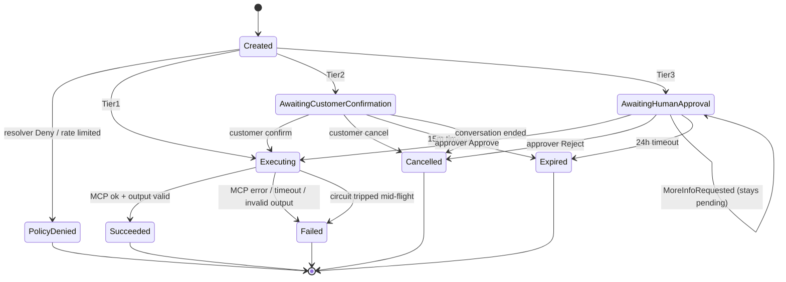
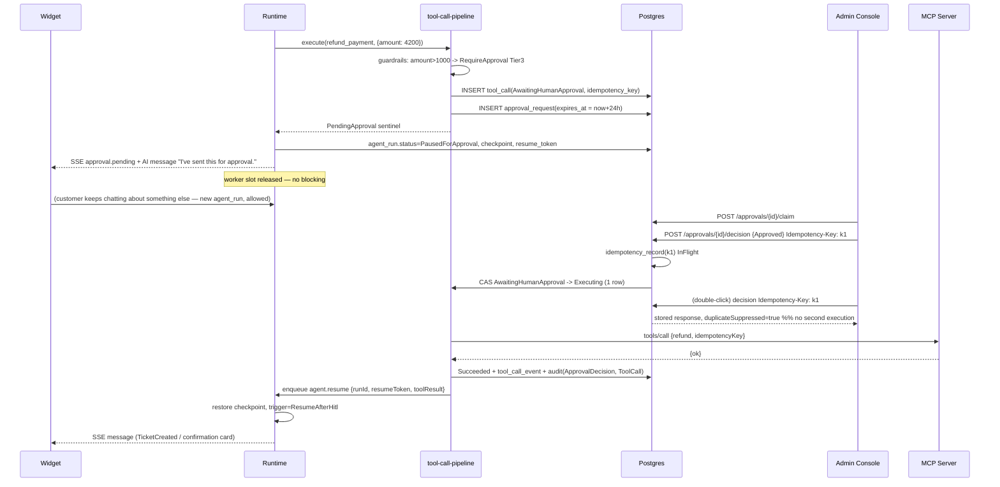

# NextBot — Low-Level Design (LLD)

**Status:** v1.0 — Architecture phase
**Source of truth:** `docs/PRODUCT_SPECIFICATION.md` (FR/NFR IDs referenced inline),
`docs/BACKLOG.md` (phasing).
**Companion documents:** `docs/architecture/HLD.md` (system architecture, deployment
topology, tenant-isolation mechanism), `docs/architecture/adr/ADR-001-stack.md`.

**Scope of detail.** Phase 1–2 (P0) backlog items — BL-01…BL-11 — are specified in full
(field-level schema, concrete API contracts, state machines). Phase 3–5 items (BL-12…
BL-24) are specified at a lighter but still concrete level: tables, key fields, module
placement and endpoint surface are fixed here so nothing has to be retro-fitted, but
exhaustive field/validation detail is deferred to their dev phase.

**Boundary with the HLD.** The multi-tenant isolation *mechanism* (NFR-4, spec §9.1) is
an HLD/ADR decision. **ADR-0001 selected shared schema + PostgreSQL RLS** (FORCE RLS, a
non-owner app role, transaction-scoped `SET LOCAL app.current_tenant`, with a
dedicated-database escape hatch on the identical schema for enterprise tenants). This
LLD's §3.2 rules encode exactly what that requires of every table and every data-access
path, and are additionally written so the dedicated-DB escape hatch needs no schema
change.

---

## Table of contents

1. [Technology decisions fixed by this LLD](#1-technology-decisions-fixed-by-this-lld)
2. [Repository & module layout](#2-repository--module-layout)
3. [Data model](#3-data-model)
4. [Entity relationships & ER diagram](#4-entity-relationships--er-diagram)
5. [API contracts](#5-api-contracts)
6. [Approval-tier state machine](#6-approval-tier-state-machine)
7. [Agent Runtime & AI subsystem design](#7-agent-runtime--ai-subsystem-design)
8. [Channel adapter design](#8-channel-adapter-design)
9. [Sequence diagrams — high-risk flows](#9-sequence-diagrams--high-risk-flows)
10. [State management](#10-state-management)
11. [Error handling & validation conventions](#11-error-handling--validation-conventions)
12. [Phase 3+ subsystems — concrete outline](#12-phase-3-subsystems--concrete-outline)
13. [Open items for the orchestrator](#13-open-items-for-the-orchestrator)
14. [Blueprint Modules A–F (Phases 6–10) — schema, API contracts & module boundaries](#14-blueprint-modules-af-phases-610--schema-api-contracts--module-boundaries)
15. [Progressive rollout — traffic-split canary + shadow evaluation (BL-48/BL-13, Phase 17)](#15-progressive-rollout--traffic-split-canary--shadow-evaluation-bl-48bl-13-phase-17) — **corrects §7.4 step 4 and §9.1; see ADR-0019**

---

## 1. Technology decisions fixed by this LLD

Stack B (Next.js full-stack + Google ADK TypeScript), per spec §9.2. The library set
below is **final for nexus-dev** — do not re-litigate; deviations require an ADR entry.

| Category | Choice | Note |
|---|---|---|
| Runtime | Node.js 22 LTS | ADK TypeScript + Next.js both target it |
| Language | TypeScript 5.x, `strict: true`, `noUncheckedIndexedAccess: true` | |
| Web framework | Next.js 15 App Router | all five portals + `/api/v1` Route Handlers |
| Monorepo | pnpm workspaces + Turborepo | |
| ORM / query builder | **Drizzle ORM** (`drizzle-orm` + `drizzle-kit`) | **ADR-0002**: chosen over Prisma because ADR-0001's RLS makes transaction-scoped `SET LOCAL app.current_tenant` load-bearing and it must be provable that every statement runs inside that transaction — Drizzle's explicit connection/transaction handle gives that guarantee |
| Database | PostgreSQL 16, **shared schema + RLS** (ADR-0001) | + `pgvector` for semantic model-response cache & KB embeddings |
| Analytics / traces | **ClickHouse** (ADR-0008) | OTel spans + all `RP-*` reporting rollups; Postgres remains the immutable system of record |
| Cache / queue / pub-sub | Redis 7 + **BullMQ** | jobs, SSE fan-out, rate limits, circuit-breaker counters |
| Schema / validation | **TypeBox** (`@sinclair/typebox`) everywhere | AI subsystem present ⇒ one schema library end-to-end (§2 of the architecture guide) |
| Dynamic JSON-Schema validation | **Ajv 8** (`ajv`, `ajv-formats`, 2020-12 dialect) | *only* for tenant-supplied MCP tool schemas — see §1.1 |
| Auth | **Better Auth** | **ADR-0002**: chosen over Auth.js v5 because FR-SEC-03/FR-ADM-02 need SAML **and** OIDC SSO, per-role MFA with backup codes, an organization (tenant) model and account lockout, which Auth.js does not ship |
| Forms | **React Hook Form** + `@hookform/resolvers/typebox` | |
| Server state | **TanStack Query** | anything not covered by RSC |
| Client state | **Zustand** | widget conversation store, takeover panel, flow designer canvas |
| UI | **Chakra UI** (Ark UI primitives underneath, accessible by default) | widget ships its own scoped Chakra theme/CSS build to avoid leaking styles onto the host page |
| AI framework | **`@google/adk`** (Google ADK TypeScript) | behind the provider-agnostic registry (§7.1) — never imported by feature code |
| Telemetry | OpenTelemetry SDK + `@opentelemetry/exporter-trace-otlp-http`; **Pino** logs | NFR-9 |
| Secrets | Pluggable `SecretsProvider`; default HashiCorp Vault / cloud KMS-backed store | FR-SEC-02 — app schema stores `vault_ref` only |
| Testing | **Vitest** (unit/integration) + **Playwright** (e2e, incl. widget-in-host-page) | Testcontainers-style ephemeral Postgres+Redis via `docker compose -f compose.test.yml` |
| Lint / boundaries | ESLint 9 flat config + `eslint-plugin-boundaries` + `dependency-cruiser` | module-boundary enforcement (§2.3) |

### 1.1 Why Ajv exists alongside TypeBox (§5.4 justification)

TypeBox is the single schema library for **all first-party** schemas: API
request/response bodies, form inputs, env config, message payloads, and every
LLM structured-output contract (§7.2). It is not usable for one specific case:
**MCP tool input/output schemas are arbitrary JSON Schema supplied at runtime by a
third-party MCP server** (FR-MCP-02) — there is no compile-time TypeBox type to author.
`Value.Check` is designed to validate against TypeBox-emitted schemas, not arbitrary
draft-2020-12 documents with `$ref`, `allOf`, `patternProperties`, etc.

Ajv 8 is therefore used **exclusively** in `packages/mcp-client/src/schema/` to compile
and validate (a) agent-proposed tool arguments against a discovered tool's
`input_schema` and (b) MCP tool responses against `output_schema`. Ajv clears §5.4:
actively maintained, MIT, no open critical CVEs, ubiquitous production adoption.
No other package may depend on Ajv — enforced by a `dependency-cruiser` rule.

---

## 2. Repository & module layout

### 2.1 Top level

```
nextbot/
├─ apps/                       # one folder per HLD plane / deployable image (ADR-0002)
│  ├─ web/                     # CONTROL PLANE  — "nextbot-web": Next.js 15, all 5 portals
│  │                           #   + /api/v1 config APIs + /.well-known
│  ├─ runtime/                 # DATA PLANE     — "nextbot-runtime": ADK executor + turn/
│  │                           #   resume BullMQ consumers. NO outbound egress (ADR-0004).
│  ├─ gateway/                 # GATEWAY PLANE  — "nextbot-gateway": all channel ingress
│  │                           #   (webhooks, widget SSE fan-out, voice media) and ALL
│  │                           #   MCP / model-provider / A2A egress; PEP re-check,
│  │                           #   credential injection, circuit breaker live here
│  ├─ worker/                  # OBSERVABILITY/OPS — "nextbot-worker": outbox drain, sweeps,
│  │                           #   rollups, retention purge, eval runs
│  ├─ widget-embed/            # build target (not a deployable): Vite library build —
│  │                           #   loader script + iframe bootstrap, served by web (BL-04)
│  └─ gateway-agent/           # on-prem stdio↔HTTPS tunnel binary, ships to tenants (BL-22)
├─ packages/
│  ├─ contracts/               # TypeBox schemas + inferred types — THE shared type package
│  ├─ db/                      # Drizzle schema, migrations, tenant-scoped client factory
│  ├─ ai-registry/             # §7.1 provider-agnostic model registry — ONLY SDK/ADK importer
│  ├─ mcp-client/              # MCP transport, list_tools, call_tool, Ajv schema validation
│  ├─ channel-adapters/        # one sub-module per channel (§8)
│  ├─ observability/           # OTel bootstrap, Pino logger, span helpers, metrics
│  ├─ secrets/                 # SecretsProvider abstraction + Vault/KMS/env implementations
│  ├─ ui/                      # shared Chakra UI components + theme (incl. per-tenant brand-profile tokens), i18n primitives
│  ├─ testing/                 # test factories, fixture tenants, MCP mock server, ADK stubs
│  └─ modules/                 # ── the modular monolith's bounded modules ──
│     ├─ tenancy/              # BL-01  Tenant, environments, data policy, residency
│     ├─ iam/                  # BL-01  User, Role, RBAC matrix, sessions, MFA, SSO mapping
│     ├─ channels/             # BL-04/14/15  Channel CRUD, capability metadata, routing rules
│     ├─ connectors/           # BL-02/11  MCP connector CRUD, discovery, health, circuit breaker
│     ├─ tool-registry/        # BL-03  Tool catalog, agent registry, permission matrix, resolver
│     ├─ conversations/        # BL-04/06  Conversation, Message, transcript, trace assembly
│     ├─ orchestration/        # BL-05/12  turn pipeline, guardrails, tool-call lifecycle, workflows
│     ├─ approvals/            # BL-08  Tier-2/3 queue, idempotent execution, HITL resume
│     ├─ escalations/          # BL-09  queue, routing, takeover, return-to-bot
│     ├─ agent-platform/       # BL-07/13/19  definitions, evals, deployments, model gateway, runs
│     ├─ audit/                # BL-10  append-only audit log + export
│     ├─ pii/                  # BL-10  detection rules, masking context matrix
│     ├─ a2a/                  # BL-20  agent card, trusted agents, task lifecycle
│     ├─ knowledge/            # BL-16  KB sources, sync, retrieval
│     ├─ reporting/            # BL-17/21  read models, aggregates, exports
│     └─ campaigns/            # BL-24  Phase 5 — stub module, see §12.6
├─ docs/
├─ compose.yaml / compose.test.yml
└─ turbo.json / pnpm-workspace.yaml
```

### 2.2 Inside a module — mandatory shape

Every `packages/modules/<name>` uses exactly this structure. nexus-dev must not invent
alternatives.

```
packages/modules/connectors/
├─ src/
│  ├─ index.ts            # PUBLIC API. The ONLY file other packages may import from.
│  ├─ domain/             # entities, value objects, invariants, pure state machines. No I/O.
│  ├─ application/        # service classes = use cases. Orchestrate repos + ports. No HTTP/React.
│  ├─ infrastructure/     # Drizzle repositories, MCP client adapters, queue producers
│  ├─ ports/              # interfaces this module needs from elsewhere (dependency inversion)
│  ├─ events/             # domain events this module publishes/consumes (§2.4)
│  └─ http/               # route handler *implementations* (pure fns: (ctx, input) => output)
└─ package.json           # name: "@nextbot/connectors", exports: { ".": "./src/index.ts" }
```

Rules:

- **No React, no `next/*` import inside `packages/modules/**`.** Modules are
  framework-free so `apps/runtime` can use them without Next.js.
- `http/` files export plain functions; `apps/web/app/api/**/route.ts` is a ≤10-line
  adapter that parses/validates with a `contracts` schema, builds `RequestContext`, and
  calls the module function.
- **Server Actions are thin wrappers only.** A Server Action may authenticate, validate
  with a `contracts` schema, call one module application service, and `revalidatePath`.
  Business logic in a Server Action is a review-blocking defect.
- One Drizzle client factory, in `@nextbot/db`; modules never construct their own and
  never open a raw connection.
- **`packages/mcp-client`, `packages/ai-registry`'s provider transports, and the
  channel adapters' outbound `send()` execute only inside `apps/gateway`** (ADR-0004).
  `apps/runtime` calls them across an internal RPC port (`ports/egress.ts`), so the Data
  Plane has no outbound network egress at all. Module code depends on the port
  interface, not the transport — the same function signatures in §5.4 apply either side.

### 2.3 Boundary enforcement (not merely intended — mechanically checked)

1. `package.json` `exports` map exposes only `"."` → deep imports fail resolution.
2. `eslint-plugin-boundaries` with element types `app | module | shared`, and an
   explicit allow-list of module→module edges maintained in `eslint.config.mjs`. The
   permitted edges as of Phase 2:

   ```
   iam            → tenancy
   channels       → tenancy
   connectors     → tenancy, secrets
   tool-registry  → connectors, tenancy
   conversations  → tenancy, channels
   orchestration  → conversations, tool-registry, agent-platform, pii, channels
   approvals      → orchestration, conversations, iam
   escalations    → conversations, iam, channels
   agent-platform → tenancy, ai-registry
   audit          → tenancy            (every other module publishes to it via events only)
   pii            → tenancy
   a2a            → conversations, orchestration, tenancy
   reporting      → (read-only DB views; no module imports)
   ```
   Everything not listed is forbidden. Notably `audit` and `reporting` are **sinks**:
   other modules never call them directly — they emit domain events (§2.4).
3. `dependency-cruiser` rules: no cycles; no `ajv` outside `mcp-client`; no
   `@google/adk` / provider SDK outside `ai-registry`; no `@nextbot/db` inside
   `domain/`; no `next/*` inside `packages/modules`.
4. CI runs `pnpm lint:boundaries` and fails the build on any violation.

### 2.4 Cross-module communication — domain events

Modules that must not depend on each other communicate through a typed event bus
implemented as a **transactional outbox** (`domain_event` table, §3.14) drained by a
BullMQ worker in `apps/worker`.

```ts
// packages/contracts/src/events.ts
export type DomainEvent =
  | { type: 'conversation.started';        tenantId: string; conversationId: string; channelId: string }
  | { type: 'conversation.turn_completed'; tenantId: string; conversationId: string; runId: string; confidence: number | null }
  | { type: 'tool_call.requested';         tenantId: string; toolCallId: string; tier: ApprovalTier }
  | { type: 'tool_call.completed';         tenantId: string; toolCallId: string; status: ToolCallStatus; latencyMs: number }
  | { type: 'approval.decided';            tenantId: string; toolCallId: string; decision: ApprovalDecision; actorUserId: string }
  | { type: 'escalation.created';          tenantId: string; escalationId: string; reason: EscalationReason }
  | { type: 'connector.status_changed';    tenantId: string; connectorId: string; from: ConnectorStatus; to: ConnectorStatus }
  | { type: 'agent_version.promoted';      tenantId: string | null; versionId: string; environment: Environment }
  | { type: 'config.changed';              tenantId: string; entity: string; entityId: string; actorUserId: string; diff: JsonValue };
```

Writers append to `domain_event` **in the same transaction** as the state change.
`audit`, `reporting`, notifications and alerting are all pure consumers. This is what
makes FR-ADM-03 ("every config change… is logged") a structural guarantee rather than a
call-site discipline.

---

## 3. Data model

PostgreSQL 16, shared schema with RLS (ADR-0001). Tables and columns `snake_case`;
Drizzle table objects are camelCase exports mapping to them explicitly. Primary keys
are **UUIDv7** (`uuid` column type, generated app-side by `uuidv7()` for index locality).
All timestamps are `timestamptz` stored UTC.

### 3.1 Conventions

- `created_at timestamptz NOT NULL DEFAULT now()`, `updated_at timestamptz NOT NULL`
  on all mutable tables; append-only tables have `created_at` only.
- Soft delete only where the UI needs restore (`deleted_at timestamptz NULL` on
  `connector`, `channel`, `role`, `capability_group`, `agent_queue`). Everything else is
  hard-deleted or retention-purged.
- Money/cost: `numeric(18,8)` (never float). Latency: `integer` milliseconds.
- Enums are Postgres native enums declared with Drizzle `pgEnum` (values `PascalCase`).
- JSON columns are `jsonb`, and every one of them has a TypeBox schema in
  `@nextbot/contracts` named `<Table><Column>Schema`, validated on write. **No
  unvalidated `jsonb` writes.**

### 3.2 Tenant-isolation rules (binding — NFR-4, ADR-0001)

ADR-0001: shared schema + PostgreSQL RLS. These rules are what make that safe, and keep
the dedicated-database escape hatch a deployment concern rather than a schema fork:

1. **Every tenant-scoped table has a non-nullable `tenant_id uuid` column**, even when
   it is derivable via a parent FK (e.g. `message.tenant_id` is denormalized from its
   conversation). Redundancy is intentional: it is the RLS predicate column, so a table
   without it cannot be policy-protected at all.
   Every such table gets, in the same migration that creates it:
   ```sql
   ALTER TABLE <t> ENABLE ROW LEVEL SECURITY;
   ALTER TABLE <t> FORCE ROW LEVEL SECURITY;
   CREATE POLICY tenant_isolation ON <t> USING     (tenant_id = current_setting('app.current_tenant')::uuid)
                                        WITH CHECK (tenant_id = current_setting('app.current_tenant')::uuid);
   ```
   A migration adding a tenant-scoped table without these three statements fails CI
   (`pnpm test:isolation` asserts policy coverage over `information_schema`).
2. `tenant_id` is the **leading column of every non-unique index** on a tenant-scoped
   table, and is included in **every unique constraint** (e.g.
   `UNIQUE (tenant_id, name, environment)` on `connector`, never `UNIQUE (name)`).
3. **No foreign key ever crosses a tenant boundary.** Platform-shared rows
   (`agent_definition` with `tenant_id IS NULL`, `model_provider`) are referenced only
   from tables that tolerate a null tenant on the referenced side, and never the reverse.
4. **All data access goes through `@nextbot/db`'s `withTenant(ctx, fn)`** — the single
   primitive named by ADR-0001. It opens a transaction on a pool bound to the
   **non-owner app role**, issues `SET LOCAL app.current_tenant = $tenantId` as the
   first statement, and yields the transaction handle. Application code never receives
   a connection outside such a transaction, so there is no code path that can execute a
   statement with the GUC unset (unset ⇒ `current_setting` raises ⇒ the query fails
   closed rather than returning cross-tenant rows). This is precisely why ADR-0002
   picked Drizzle: the transaction handle is explicit and the property is testable.
   Application code also still filters by `tenant_id` explicitly — RLS is the backstop,
   not the query planner's only hint.

   ```ts
   // packages/db/src/tenant-context.ts
   export interface TenantContext { tenantId: string; region: Region; environment: Environment; }
   export function withTenant<T>(ctx: TenantContext, fn: (db: TenantScopedClient) => Promise<T>): Promise<T>;
   export function withPlatform<T>(fn: (db: PlatformClient) => Promise<T>): Promise<T>; // operator-only, audited
   ```
   `withPlatform` is callable from exactly two places: `packages/modules/tenancy`
   (provisioning) and internal ops endpoints (NFR-11). A lint rule enforces this.
5. High-volume append-only **Postgres** tables (`message`, `tool_call`,
   `audit_log_entry`, `model_call_log`, `domain_event`) are **range-partitioned monthly
   on `created_at`** — partitioned by time, not tenant: RLS policies are declared on the
   parent and inherited by every partition, and per-tenant partitioning would defeat the
   retention design below.
   Retention purge (FR-ADM-06) is `DETACH PARTITION` + delete where the retention window
   is uniform, and targeted deletes where per-tenant retention differs.

### 3.3 Tenancy & IAM (BL-01)

**tenant**

| Column | Type | Constraints | Notes |
|---|---|---|---|
| id | uuid | PK | |
| name | text | NOT NULL, UNIQUE | |
| slug | text | NOT NULL, UNIQUE | subdomain / widget key namespace |
| region | enum Region(`UAE`,`EU`,`US`) | NOT NULL | NFR-6; extensible enum |
| status | enum TenantStatus(`Active`,`Suspended`,`Trial`) | NOT NULL DEFAULT `Trial` | |
| plan_tier | enum PlanTier(`Starter`,`Growth`,`Enterprise`) | NOT NULL DEFAULT `Starter` | NFR-4a; drives the `tenant_runtime_quota` seeding rule below and, for `Enterprise`, the dedicated-database isolation path (ADR-0001 §2 escape hatch) |
| default_language | text | NOT NULL, ISO-639-1, CHECK `length = 2` | |
| branding_config | jsonb | NULL, `TenantBrandingSchema` (primary/secondary color, logo light/dark URLs, favicon, font family) | FR-ADM-07; default source of truth for widget `theme.*` and, when `white_label_enabled`, Admin/Developer Portal chrome |
| white_label_enabled | boolean | NOT NULL DEFAULT `false` | FR-ADM-07; plan-gated — when true, `branding_config` also overrides default NextBot chrome in `apps/web` |
| created_at / updated_at | timestamptz | NOT NULL | |

**tenant_data_policy** (FR-ADM-06; 1:1 with tenant)

| Column | Type | Constraints |
|---|---|---|
| tenant_id | uuid | PK, FK→tenant |
| retention_transcripts_days | integer | NOT NULL, CHECK `> 0` OR `= -1` (`-1` = Indefinite) |
| retention_tool_payloads_days | integer | same CHECK |
| retention_tool_metadata_days | integer | same CHECK |
| retention_pii_days | integer | same CHECK |
| residency_region | enum Region | NOT NULL (defaults from `tenant.region`) |
| allow_out_of_region_inference | boolean | NOT NULL DEFAULT false | FR-SEC-05 opt-in |
| purge_last_run_at | timestamptz | NULL |

> Validation: blank/0 is rejected at the API layer with `RETENTION_PERIOD_INVALID`
> ("Set a retention period greater than 0 days, or choose 'Indefinite' explicitly").
> `-1` is only settable when the client explicitly sends `{"mode":"indefinite"}`.

**app_user**

| Column | Type | Constraints |
|---|---|---|
| id | uuid | PK |
| tenant_id | uuid | NOT NULL, FK→tenant |
| email | citext | NOT NULL, UNIQUE `(tenant_id, email)` |
| password_hash | text | NULL (argon2id; NULL when SSO-only) |
| sso_subject | text | NULL, UNIQUE `(tenant_id, sso_subject)` |
| display_name | text | NOT NULL |
| status | enum UserStatus(`Active`,`Locked`,`Disabled`,`Invited`) | NOT NULL |
| mfa_enrolled | boolean | NOT NULL DEFAULT false |
| mfa_method | enum MfaMethod(`Totp`,`Sms`,`Email`) | NULL |
| mfa_secret_ref | text | NULL → `credential.vault_ref` style pointer, never plaintext |
| failed_login_count | smallint | NOT NULL DEFAULT 0 |
| locked_until | timestamptz | NULL |
| last_login_at | timestamptz | NULL |

**role**

| Column | Type | Constraints |
|---|---|---|
| id | uuid | PK |
| tenant_id | uuid | NOT NULL, FK→tenant |
| name | text | NOT NULL, UNIQUE `(tenant_id, name)` |
| is_system | boolean | NOT NULL DEFAULT false (seeded: Tenant Admin, Backend System Owner, Designer, Platform Engineer, Escalation Agent, Read-Only) |
| permission_matrix | jsonb | NOT NULL, `PermissionMatrixSchema` |

```ts
// packages/contracts/src/iam.ts
export const RbacModule = Type.Union([
  Type.Literal('channels'), Type.Literal('connectors'), Type.Literal('tool_permissions'),
  Type.Literal('agent_tool_config'), Type.Literal('approval_queue'), Type.Literal('escalations'),
  Type.Literal('conversations'), Type.Literal('reporting'), Type.Literal('a2a_config'),
  Type.Literal('agent_platform'), Type.Literal('designer'), Type.Literal('security_settings'),
  Type.Literal('audit_log'), Type.Literal('users_roles'), Type.Literal('developer_portal'),
]);
export const PermissionLevel = Type.Union([Type.Literal('None'), Type.Literal('Read'), Type.Literal('Write')]);
export const PermissionMatrixSchema = Type.Record(RbacModule, PermissionLevel);
```

**user_role** — `(tenant_id, user_id, role_id)` composite PK, FKs to `app_user`/`role`.
FR-ADM-02 fail-closed: login succeeds only if `count(user_role) >= 1`; zero roles →
`AUTH_NO_ROLE_ASSIGNED`.

**sso_group_mapping** — `id`, `tenant_id`, `external_group` (text), `role_id`,
UNIQUE `(tenant_id, external_group)`.

**login_attempt** (append-only, feeds lockout + audit) — `id`, `tenant_id NULL`,
`email`, `ip inet`, `user_agent`, `outcome enum(Success,BadCredentials,Locked,NoRole,MfaFailed)`,
`created_at`. Index `(tenant_id, email, created_at DESC)`.

**environment** — NextBot uses a fixed enum rather than a table:
`enum Environment(Sandbox, Staging, Production)` for connectors/channels;
`enum DeployEnvironment(Dev, Stage, Prod)` for agent deployments (spec §6.1 uses both
vocabularies; they are deliberately distinct enums, mapped by
`DEPLOY_ENV_FOR[Environment]` in `contracts`).

### 3.4 Channels (BL-04, BL-14, BL-15)

**channel**

| Column | Type | Constraints |
|---|---|---|
| id | uuid | PK |
| tenant_id | uuid | NOT NULL, FK→tenant |
| type | enum ChannelType(`WebWidget`,`WhatsApp`,`Messenger`,`Instagram`,`Voice`,`Email`,`Sms`,`Slack`,`Teams`,`X`) | NOT NULL |
| name | text | NOT NULL, UNIQUE `(tenant_id, name, environment)` |
| status | enum ChannelStatus(`Active`,`Inactive`,`Error`) | NOT NULL DEFAULT `Inactive` |
| environment | enum Environment | NOT NULL |
| config | jsonb | NOT NULL — discriminated by `type`, schema `ChannelConfigSchema` |
| credential_id | uuid | NULL, FK→credential |
| agent_definition_version_id | uuid | NULL, FK — pinned agent for this channel (else env default deployment) |
| public_key | text | NOT NULL, UNIQUE — the value used as `channelId` in the widget embed snippet |
| last_error | jsonb | NULL, `{ code, message, occurredAt }` |
| deleted_at | timestamptz | NULL |

`ChannelConfigSchema` is a TypeBox discriminated union; the `WebWidget` variant is the
FR-OC-01 host config (`position`, `language`, `direction`, `theme.*`, `quickActions[]`,
`menu.*`, `proactiveNudge.*`), the `WhatsApp` variant carries `wabaId`,
`phoneNumberId`, `messagingTier`, etc.

**channel_capability** — static reference data, seeded per `ChannelType`, drives
FR-OC-06 automatic degradation. Not tenant-scoped.

| Column | Type |
|---|---|
| channel_type | enum ChannelType, PK |
| supports_rich_cards / supports_quick_replies / supports_lists / supports_forms / supports_file_upload / supports_markdown / supports_typing_indicator | boolean NOT NULL |
| max_quick_replies | smallint NULL |
| max_button_label_chars | smallint NULL |
| max_text_chars | integer NULL |
| form_strategy | enum FormStrategy(`Native`,`SequentialPrompt`) NOT NULL |
| list_strategy | enum ListStrategy(`Native`,`NumberedText`) NOT NULL |

**routing_rule** (FR-OC-04, Phase 3) — `id`, `tenant_id`, `ordinal smallint`,
`conditions jsonb` (`RoutingConditionSchema`: `channelType?`, `recognizedTask?`,
`customerSegment?`, `expression?`), `action enum(Allow,Deny,RedirectToQueue)`,
`target_queue_id uuid NULL`, `enabled boolean`. UNIQUE `(tenant_id, ordinal)`.
Tenant default action lives on `tenant_data_policy`-adjacent
`tenant_runtime_setting.default_routing_action` (default `Allow`).

### 3.5 Connectors & credential vault (BL-02, BL-11, BL-22)

**connector**

| Column | Type | Constraints |
|---|---|---|
| id | uuid | PK |
| tenant_id | uuid | NOT NULL, FK→tenant |
| name | text | NOT NULL, UNIQUE `(tenant_id, environment, name)` → violation ⇒ `CONNECTOR_NAME_DUPLICATE` ("A connector named '<name>' already exists in this environment.") |
| description | text | NULL |
| backend_type | enum BackendType(`Ticketing`,`CRM`,`ERP`,`Billing`,`HRIS`,`KnowledgeBase`,`Custom`) | NOT NULL |
| template_key | text | NULL — e.g. `zendesk`, `salesforce` (FR-MCP-10) |
| transport | enum McpTransport(`StreamableHTTP`,`StdioViaGateway`) | NOT NULL |
| endpoint_url | text | NULL — required when `StreamableHTTP`, CHECK https scheme |
| stdio_command | jsonb | NULL — `{ command, args[], env{} }`, required when `StdioViaGateway` |
| gateway_agent_id | uuid | NULL, FK→gateway_agent; CHECK: NOT NULL iff transport = `StdioViaGateway` |
| auth_method | enum ConnectorAuthMethod(`OAuth2`,`APIKey`,`BearerToken`,`CustomHeader`,`mTLS`,`None`) | NOT NULL |
| credential_id | uuid | NULL, FK→credential; CHECK NOT NULL unless `auth_method = None` |
| environment | enum Environment | NOT NULL |
| status | enum ConnectorStatus(`Connected`,`Degraded`,`Offline`) | NOT NULL DEFAULT `Offline` — **computed by the health subsystem only**; no API path sets it |
| trust_level | enum TrustLevel(`Trusted`,`SemiTrusted`,`Untrusted`) | NOT NULL DEFAULT `SemiTrusted` — feeds PII masking intensity (FR-SEC-04) |
| health_interval_seconds | integer | NOT NULL DEFAULT 60, CHECK 15..3600 |
| latency_threshold_ms | integer | NOT NULL DEFAULT 2000 |
| error_rate_threshold_pct | numeric(5,2) | NOT NULL DEFAULT 5.00 |
| offline_alert_after_minutes | integer | NOT NULL DEFAULT 5 |
| circuit_state | enum CircuitState(`Closed`,`Open`,`HalfOpen`) | NOT NULL DEFAULT `Closed` |
| circuit_opened_at | timestamptz | NULL |
| last_discovered_at | timestamptz | NULL |
| deleted_at | timestamptz | NULL |

Indexes: `(tenant_id, environment, status)`, `(tenant_id, backend_type)`,
`(gateway_agent_id)`.

**credential** (FR-SEC-02 — **no plaintext column exists anywhere in the schema**)

| Column | Type | Constraints |
|---|---|---|
| id | uuid | PK |
| tenant_id | uuid | NOT NULL |
| label | text | NOT NULL |
| type | enum CredentialType(`APIKey`,`OAuthToken`,`SystemUserToken`,`BearerToken`,`ClientCertificate`,`MfaSecret`,`ModelProviderKey`) | NOT NULL |
| vault_ref | text | NOT NULL, UNIQUE — opaque pointer, format `nb://<tenant>/<kind>/<uuid>` |
| ciphertext | bytea | NOT NULL — **ADR-0007 envelope encryption**: AES-256-GCM under a per-tenant DEK, DEK wrapped by the regional KMS CMK. AAD binds `(tenant_id, credential_id, type)` so a ciphertext cannot be replayed under another tenant or purpose. `SELECT` on this column is granted **only to the gateway DB role** — the web and runtime roles cannot read it at all |
| dek_ref | text | NOT NULL — KMS key/version identifier for the wrapped DEK |
| masked_hint | text | NOT NULL — e.g. `sk-…9fA2`; the only thing any UI ever renders |
| last_rotated_at | timestamptz | NOT NULL |
| expires_at | timestamptz | NULL |
| revoked_at | timestamptz | NULL |

Decryption happens **only in `apps/gateway`**, at the moment of credential injection
into an outbound MCP / model-provider / channel call (ADR-0004 + ADR-0007). The
`SecretsProvider.get(vaultRef)` port exists in `packages/secrets`, but its concrete
KMS-backed implementation is registered only in the gateway process; in `apps/web` and
`apps/runtime` the registered implementation throws. Plaintext is never returned to a
caller, never serialized into a DTO, and never logged. A `dependency-cruiser` rule
forbids `secrets` imports in `http/` directories; the write path (`SecretsProvider.put`)
is available in `apps/web` only for the initial-entry and rotation flows.

**gateway_agent** (FR-MCP-12) — `id`, `tenant_id`, `name`, `enrollment_token_ref`
(→credential), `status enum(Pending,Online,Offline)`, `last_heartbeat_at`,
`heartbeat_window_seconds integer NOT NULL DEFAULT 300`, `version text`, `host_info jsonb`.
When `now() - last_heartbeat_at > heartbeat_window_seconds`, a scheduled job flips every
connector with that `gateway_agent_id` to `Offline` and fails their pending tool calls
with `GATEWAY_AGENT_UNREACHABLE`.

**connector_health_check** (append-only, 30-day retention) — `id`, `tenant_id`,
`connector_id`, `checked_at`, `ok boolean`, `latency_ms`, `error_code text NULL`,
`error_detail text NULL`. Index `(tenant_id, connector_id, checked_at DESC)`.

**connector_alert_rule** — `id`, `tenant_id`, `connector_id NULL` (null = tenant-wide),
`metric enum(Latency,ErrorRate,Offline)`, `threshold numeric`, `window_minutes`,
`channels jsonb` (`{email[], slackWebhookRef?, inApp: boolean}`), `enabled`.

### 3.6 Tool catalog & Agent Tool Registry (BL-03)

**tool**

| Column | Type | Constraints |
|---|---|---|
| id | uuid | PK |
| tenant_id | uuid | NOT NULL |
| connector_id | uuid | NOT NULL, FK→connector |
| name | text | NOT NULL — verbatim MCP tool name. UNIQUE `(tenant_id, connector_id, name)` |
| display_name | text | NULL |
| description_source | text | NOT NULL — as returned by `list_tools` |
| description_override | text | NULL — FR-MCP-15 inline override; the agent sees `COALESCE(override, source)` |
| current_schema_version_id | uuid | NOT NULL, FK→tool_schema_version |
| rw_class | enum RwClass(`Read`,`Write`) | NOT NULL |
| rw_class_source | enum ClassSource(`AutoHeuristic`,`AdminOverride`) | NOT NULL |
| approval_tier | enum ApprovalTier(`Tier1`,`Tier2`,`Tier3`) | NOT NULL |
| approval_tier_source | enum TierSource(`BackendTypeDefault`,`AdminOverride`) | NOT NULL |
| supports_idempotency_key | boolean | NOT NULL DEFAULT false — FR-AI-03; detected from input schema (`idempotency_key`/`idempotencyKey`/`client_token` property) or set by admin |
| allow_auto_retry | boolean | NOT NULL DEFAULT false — explicit admin opt-in for write-step retry |
| visible_to_agent | boolean | NOT NULL DEFAULT true — FR-MCP-13 |
| priority_weight | smallint | NOT NULL DEFAULT 50, CHECK 1..100 |
| capability_group_id | uuid | NULL, FK→capability_group `ON DELETE SET NULL`. **The single, authoritative capability-group membership** — one group per tool; `NULL` = Ungrouped. No bridge table exists or will (§14.3.3, HLD §15.7, ADR-0014) |
| status | enum ToolStatus(`Active`,`Disabled`,`Error`,`Removed`) | NOT NULL |
| circuit_state | enum CircuitState | NOT NULL DEFAULT `Closed` |
| circuit_opened_at | timestamptz | NULL |
| circuit_trip_reason | text | NULL |
| channel_restrictions | jsonb | NULL, `ChannelType[]` — fast-path allowlist; the authoritative rule set is `tool_permission_rule` |
| rate_limit | jsonb | NULL, `{ perMinute?: number, perConversation?: number, perCustomerPerDay?: number }` |
| last_called_at | timestamptz | NULL — NULL ⇒ UI renders "—" not "0%" (FR-MCP-03) |

Indexes: `(tenant_id, connector_id)`, `(tenant_id, visible_to_agent, status)`,
`(tenant_id, capability_group_id)`, `(tenant_id, approval_tier)`.

**tool_schema_version** (append-only; powers FR-MCP-02 diffing and FR-MCP-15 version diff)

| Column | Type |
|---|---|
| id | uuid PK |
| tenant_id | uuid NOT NULL |
| tool_id | uuid NOT NULL |
| version_ordinal | integer NOT NULL, UNIQUE `(tenant_id, tool_id, version_ordinal)` |
| input_schema | jsonb NOT NULL (raw JSON Schema from MCP server) |
| output_schema | jsonb NOT NULL |
| schema_hash | text NOT NULL (sha256 of canonicalized input+output) |
| breaking_change | boolean NOT NULL (computed vs. prior: removed property, new required property, narrowed type/enum) |
| change_summary | jsonb NULL (`{added[], removed[], modified[]}`) |
| discovered_at | timestamptz NOT NULL |

**capability_group** — `id`, `tenant_id`, `name` UNIQUE `(tenant_id, name)`,
`guidance_text text NULL`, `priority_weight smallint DEFAULT 50`, `deleted_at`.

**tool_permission_rule** (FR-MCP-04)

| Column | Type | Constraints |
|---|---|---|
| id | uuid | PK |
| tenant_id | uuid | NOT NULL |
| scope | enum RuleScope(`Tool`,`Connector`,`BackendType`) | NOT NULL |
| tool_id / connector_id | uuid | NULL — exactly one populated per `scope` (CHECK) |
| backend_type | enum BackendType | NULL — populated when `scope = BackendType` |
| ordinal | smallint | NOT NULL — evaluation order within the same scope |
| conditions | jsonb | NOT NULL, `PermissionConditionSchema` |
| effect | enum PermissionEffect(`Allow`,`Deny`,`RequireApproval`) | NOT NULL |
| required_tier | enum ApprovalTier | NULL — only when `effect = RequireApproval` |
| enabled | boolean | NOT NULL DEFAULT true |

```ts
export const PermissionConditionSchema = Type.Object({
  channelTypes:     Type.Optional(Type.Array(ChannelTypeEnum)),
  roleIds:          Type.Optional(Type.Array(Type.String({ format: 'uuid' }))),
  recognizedTasks:  Type.Optional(Type.Array(Type.String())),
  customerSegments: Type.Optional(Type.Array(Type.String())),
  environments:     Type.Optional(Type.Array(EnvironmentEnum)),
  expression:       Type.Optional(Type.String()),   // CEL-subset, evaluated sandboxed; e.g. "args.amount > 5000"
});
```

**Resolution algorithm** (`tool-registry/domain/permission-resolver.ts`, pure & unit-tested):

```
resolve(toolId, ctx) -> { effect, tier, matchedRuleId | null, reason }
  1. tool.status != Active | tool.visible_to_agent = false      -> Deny  (reason: 'tool_not_selectable')
  2. tool.circuit_state = Open | connector.circuit_state = Open -> Deny  (reason: 'circuit_open')     [FR-MCP-08]
  3. connector.status = Offline                                 -> Deny  (reason: 'connector_offline')
  4. rules with scope=Tool, enabled, ordinal ASC  -> first match wins
  5. else rules with scope=Connector              -> first match wins
  6. else rules with scope=BackendType            -> first match wins
  7. else                                          -> Deny  (reason: 'no_matching_rule')  [FR-MCP-04 fail-closed]
  effect Allow          -> tier = tool.approval_tier
  effect RequireApproval-> tier = max(rule.required_tier, tool.approval_tier)
```

Rule 7 is the fail-closed default and is enforced **at call time in the runtime**
(FR-SEC-06), not only in the UI. Seeded `BackendType` defaults: all `Write` tools on
`Billing` → `RequireApproval / Tier2`; `Write` on `Ticketing`/`CRM`/`HRIS` → `Allow /
Tier1` for create, `Tier2` for delete/refund-shaped verbs; `Read` on all → `Allow /
Tier1`.

### 3.7 Conversations & messages (BL-04, BL-06)

**conversation**

| Column | Type | Constraints |
|---|---|---|
| id | uuid | PK |
| tenant_id | uuid | NOT NULL |
| channel_id | uuid | NOT NULL, FK→channel |
| external_thread_id | text | NULL — WhatsApp wa_id / email thread / call SID. UNIQUE `(tenant_id, channel_id, external_thread_id)` where not null |
| customer_identifier | text | NULL (anonymous allowed) |
| customer_identifier_hash | bytea | NULL — sha256, used for DSR search without unmasking (FR-ADM-06); indexed |
| status | enum ConversationStatus(`Active`,`Resolved`,`Escalated`,`Abandoned`) | NOT NULL DEFAULT `Active` |
| recognized_goal | text | NULL |
| resolution_type | enum ResolutionType(`AI`,`Human`,`Abandoned`) | NULL until closed |
| language | text | NOT NULL |
| agent_definition_version_id | uuid | NULL — the version that served this conversation |
| last_activity_at | timestamptz | NOT NULL — drives the FR-AI-06 idle sweep |
| started_at | timestamptz | NOT NULL |
| ended_at | timestamptz | NULL |
| total_cost_usd | numeric(18,8) | NOT NULL DEFAULT 0 (FR-AI-12) |
| total_tokens_in / total_tokens_out | integer | NOT NULL DEFAULT 0 |
| metadata | jsonb | NULL — host page URL, locale, user agent, segment |

Indexes: `(tenant_id, status, last_activity_at DESC)`, `(tenant_id, channel_id,
started_at DESC)`, `(tenant_id, customer_identifier_hash)`,
`(tenant_id, recognized_goal)`.

Idle sweep job (`conversations/application/idle-sweeper.ts`, every 60s): conversations
with `status = Active` and `last_activity_at < now() - idle_timeout` (tenant setting,
default 30 min) → if `message_count(sender = Customer) = 0` set `Abandoned` +
`resolution_type = Abandoned`; else set `Resolved` + `resolution_type = AI`.

**message** (append-only, partitioned monthly)

| Column | Type | Constraints |
|---|---|---|
| id | uuid | PK (composite with `created_at` for partitioning) |
| tenant_id | uuid | NOT NULL |
| conversation_id | uuid | NOT NULL |
| sequence | integer | NOT NULL, UNIQUE `(tenant_id, conversation_id, sequence)` — monotonic, gap-free; the SSE resume cursor |
| sender | enum MessageSender(`Customer`,`AI`,`HumanAgent`,`System`) | NOT NULL |
| sender_user_id | uuid | NULL (when `HumanAgent`) |
| content_type | enum MessageContentType | NOT NULL — the 14 FR-AI-04 types + `Error` |
| payload | jsonb | NOT NULL — TypeBox discriminated union `MessagePayloadSchema` |
| payload_masked | jsonb | NULL — PII-masked projection cached for transcript/export contexts (FR-SEC-04) |
| confidence_score | real | NULL, CHECK 0..1, AI-sender only |
| agent_run_id | uuid | NULL, FK→agent_run |
| in_reply_to_tool_call_id | uuid | NULL |
| delivery_status | enum DeliveryStatus(`Pending`,`Sent`,`Delivered`,`Read`,`Failed`) | NOT NULL DEFAULT `Sent` |
| created_at | timestamptz | NOT NULL |

`MessageContentType` = `Text | QuickReply | List | ExternalLink | Document |
DataSummary | DataTable | Form | OTP | Confirmation | TicketCreated | TicketStatus |
FileUpload | Error`.

The 14 payload schemas live in `packages/contracts/src/messages.ts` as a
`Type.Union` discriminated on `contentType`. Illustrative pair:

```ts
export const DataTablePayload = Type.Object({
  contentType: Type.Literal('DataTable'),
  title: Type.Optional(Type.String()),
  columns: Type.Array(Type.Object({ key: Type.String(), label: Type.String(),
                                    align: Type.Optional(Type.Union([Type.Literal('left'), Type.Literal('right')])) })),
  rows: Type.Array(Type.Record(Type.String(), Type.Union([Type.String(), Type.Number(), Type.Null()]))),
  emptyStateText: Type.String({ default: 'No results found.' }),   // FR-AI-04
  pagination: Type.Optional(Type.Object({ page: Type.Integer(), pageSize: Type.Integer(), total: Type.Integer() })),
});

export const ConfirmationPayload = Type.Object({           // Tier-2 card, FR-MCP-05
  contentType: Type.Literal('Confirmation'),
  toolCallId: Type.String({ format: 'uuid' }),
  headline: Type.String(),
  summaryRows: Type.Array(Type.Object({ label: Type.String(), value: Type.String() })),
  confirmLabel: Type.String({ default: 'Confirm' }),
  cancelLabel: Type.String({ default: 'Cancel' }),
  expiresAt: Type.String({ format: 'date-time' }),
  state: Type.Union([Type.Literal('pending'), Type.Literal('confirmed'),
                     Type.Literal('cancelled'), Type.Literal('expired')]),
});
```

**message_attachment** — `id`, `tenant_id`, `message_id`, `filename`, `mime_type`,
`size_bytes`, `storage_ref` (object-store key), `scan_status enum(Pending,Clean,Infected)`,
`created_at`. FR-TCK-06 limits are validated client-side *and* server-side against the
owning connector's declared limits.

### 3.8 Tool calls & trace (BL-05, BL-06, BL-08)

**tool_call** (append-only for the immutable fields; only lifecycle columns mutate — partitioned monthly)

| Column | Type | Constraints |
|---|---|---|
| id | uuid | PK |
| tenant_id | uuid | NOT NULL |
| conversation_id | uuid | NULL (A2A-originated calls may have none) |
| agent_run_id | uuid | NULL, FK→agent_run |
| a2a_task_id | uuid | NULL, FK→a2a_task |
| workflow_execution_id | uuid | NULL (FR-MCP-14) |
| tool_id | uuid | NOT NULL, FK→tool |
| tool_schema_version_id | uuid | NOT NULL — snapshot: the schema the args were validated against |
| tool_name_snapshot | text | NOT NULL — survives tool deletion (NFR-10) |
| approval_tier | enum ApprovalTier | NOT NULL — **snapshot at call time**, immutable |
| approval_status | enum ApprovalStatus(`NotRequired`,`Pending`,`Approved`,`Rejected`,`Cancelled`,`Expired`) | NOT NULL |
| status | enum ToolCallStatus | NOT NULL — see §6 |
| idempotency_key | text | NOT NULL, UNIQUE `(tenant_id, idempotency_key)` — server-generated UUIDv7 at creation (FR-MCP-05) |
| input_args | jsonb | NOT NULL — masked per FR-SEC-04 before persistence |
| input_args_hash | text | NOT NULL — sha256 of *unmasked* canonical args, for dedup/replay comparison |
| output | jsonb | NULL until terminal |
| error | jsonb | NULL, `{ code, message, transportDetail?, retriable: boolean }` |
| latency_ms | integer | NULL |
| initiated_by | enum ToolCallActor(`AiAgent`,`HumanAgent`,`A2A`,`SandboxTest`) | NOT NULL |
| initiated_by_user_id | uuid | NULL |
| attempt_count | smallint | NOT NULL DEFAULT 0 |
| deny_reason | text | NULL — set when `status = PolicyDenied` (`no_matching_rule`, `circuit_open`, …) |
| created_at / started_at / completed_at | timestamptz | |

Indexes: `(tenant_id, conversation_id, created_at)`, `(tenant_id, tool_id, created_at DESC)`,
`(tenant_id, status) WHERE status IN ('AwaitingHumanApproval','AwaitingCustomerConfirmation')`,
UNIQUE `(tenant_id, idempotency_key)`.

**tool_call_event** (append-only trace ribbon; one row per transition — this is what
makes NFR-10 "correction = new compensating record" structural)

`id`, `tenant_id`, `tool_call_id`, `sequence smallint`, `from_status`, `to_status`,
`actor` (`system` | `ai_agent` | user uuid), `detail jsonb`, `created_at`.

**approval_request** (Tier-3 queue; 1:1 with a `tool_call` in `AwaitingHumanApproval`)

| Column | Type | Constraints |
|---|---|---|
| id | uuid | PK |
| tenant_id | uuid | NOT NULL |
| tool_call_id | uuid | NOT NULL, UNIQUE |
| conversation_id | uuid | NULL |
| requested_at | timestamptz | NOT NULL |
| expires_at | timestamptz | NOT NULL — `requested_at + tenant.tier3_timeout` (default 24h) |
| risk_summary | jsonb | NOT NULL — `{ toolName, backend, humanReadableArgs[], amount?, customerIdentifier? }` |
| assigned_to_user_id | uuid | NULL — soft claim |
| claimed_at | timestamptz | NULL |
| decision | enum ApprovalDecision(`Approved`,`Rejected`,`MoreInfoRequested`) | NULL |
| decided_by_user_id | uuid | NULL |
| decided_at | timestamptz | NULL |
| decision_note | text | NULL — required when `Rejected` (relayed to the customer) |
| more_info_question | text | NULL — required when `MoreInfoRequested` |

`approval_decision_log` (append-only) records every decision attempt including
rejected-duplicate attempts, so a double-click is visible in audit even though it
executes once.

### 3.9 Escalations (BL-09)

**agent_queue** — `id`, `tenant_id`, `name` UNIQUE `(tenant_id,name)`,
`is_default boolean` (exactly one true per tenant, enforced by partial unique index
`WHERE is_default`), `business_hours jsonb NULL`, `deleted_at`.

**escalation**

| Column | Type | Constraints |
|---|---|---|
| id | uuid | PK |
| tenant_id | uuid | NOT NULL |
| conversation_id | uuid | NOT NULL |
| reason | enum EscalationReason(`LowConfidence`,`ToolFailure`,`CustomerRequest`,`SensitiveTopic`) | **NOT NULL** (FR-ESC-01) |
| reason_detail | jsonb | NULL — `{ confidence?, toolCallId?, guardrailRuleId? }` |
| queue_id | uuid | NOT NULL — routed or tenant default; **never null** (FR-ESC-03) |
| matched_routing_rule_id | uuid | NULL |
| assigned_agent_id | uuid | NULL, FK→app_user |
| status | enum EscalationStatus(`Waiting`,`InProgress`,`Resolved`,`ReturnedToBot`) | NOT NULL |
| waiting_since / picked_up_at / closed_at | timestamptz | |
| wait_seconds | integer | NULL — materialized on pickup for the escalation-SLA metric |
| ai_context_snapshot | jsonb | NOT NULL — `{ recognizedGoal, confidence, toolCallIds[], transcriptCursor }` (FR-ESC-02) |

A conversation may have many `escalation` rows over time (cycle
Escalated → ReturnedToBot → Escalated); at most one non-terminal at a time, enforced by
partial unique index `(tenant_id, conversation_id) WHERE status IN ('Waiting','InProgress')`.

**escalation_routing_rule** — `id`, `tenant_id`, `ordinal`, `conditions jsonb`
(`recognizedGoal?`, `channelTypes?`, `reasons?`, `language?`), `queue_id`, `enabled`.

### 3.10 Agent platform (BL-07, BL-13, BL-19)

**agent_definition** — identity of an agent family.
`id`, `tenant_id uuid NULL` (NULL = platform-shared), `name text`, `description`,
`repo_path text` (path convention within the tenant's connected repo, see §3.10a — e.g.
`agents/<agent-id>/`), UNIQUE `(COALESCE(tenant_id,'00000000-…'), name)`.

> **Deviation from spec §6.1, recorded:** the spec models version fields directly on
> `AgentDefinition`. This LLD splits identity (`agent_definition`) from the versioned
> artifact (`agent_definition_version`) because FR-AGT-01 requires diffing *between two
> versions*, FR-AGT-04 requires *multiple versions live simultaneously* under a traffic
> split, and eval suites bind to a version. Semantics are unchanged; the spec's
> `AgentDefinition` row == this LLD's `agent_definition_version` row.

**agent_definition_version**

| Column | Type | Constraints |
|---|---|---|
| id | uuid | PK |
| tenant_id | uuid | NULL (mirrors parent) |
| agent_definition_id | uuid | NOT NULL |
| version | text | NOT NULL, semver, UNIQUE `(agent_definition_id, version)` |
| graph_type | enum GraphType(`ADK`,`LangGraph`,`PydanticAI`,`CustomFSM`) | NOT NULL DEFAULT `ADK` — **NFR-12 pluggability seam; only `ADK` is executable in MVP; any other value is rejected at promotion with `GRAPH_TYPE_NOT_INSTALLED`** |
| status | enum AgentVersionStatus(`Draft`,`EvalGated`,`HumanReview`,`Approved`,`Production`,`Deprecated`) | NOT NULL |
| definition_yaml | text | NOT NULL — the runtime's operational copy of the artifact (§7.3); the tenant's Git remote (§3.10a) is the reviewed source of truth, this column is what the runtime actually loads so turn execution never depends on GitHub/GitLab availability |
| definition_hash | text | NOT NULL — sha256, used for the FR-AGT-01 diff and for run attribution |
| git_commit_sha | text | NULL — the commit in the tenant's connected repo this version was written as (§3.10a); NULL only for pre-Decision-2 rows / platform-shared definitions with no tenant repo |
| git_pr_number | integer | NULL — the open/closed PR (GitHub) or MR (GitLab) number backing FR-AGT-03 review, NULL once no review is in flight |
| git_pr_status | enum GitPrStatus(`None`,`Open`,`Merged`,`Closed`) | NOT NULL DEFAULT `None` |
| eval_suite_id | uuid | NULL — **required non-null before `Approved`** |
| last_eval_run_id | uuid | NULL |
| model_route_key | text | NOT NULL — logical model name (§7.1), e.g. `chat.primary` |
| created_by_user_id | uuid | NULL |
| approved_by_user_id | uuid | NULL |
| created_at | timestamptz | NOT NULL |

> **Content vs. pointer split (Decision 2, 2026-08-15).** `agent_definition`/
> `agent_definition_version` are NextBot's pointer + status system of record — repo
> (via the tenant's `git_connection`, §3.10a), `repo_path`, `git_commit_sha`,
> `git_pr_number`, `git_pr_status`. `definition_yaml` is retained as a synced
> operational copy (not a duplicate source of truth) because the runtime cannot take
> a per-turn dependency on an external Git provider's uptime; every write still goes
> to the tenant's repo first (a real commit), and `definition_yaml` +
> `definition_hash` are updated from that commit's content in the same transaction
> that records `git_commit_sha`.

Promotion gate (FR-AGT-01/06), enforced in
`agent-platform/domain/promotion-policy.ts` and again by a DB CHECK-style guard in the
service transaction — **not** in the UI:

```
canPromote(version, targetStatus):
  Draft       -> EvalGated   : always
  EvalGated   -> HumanReview : requires last_eval_run.status = Passed
                               AND last_eval_run.definition_hash = version.definition_hash
  HumanReview -> Approved    : requires reviewer != created_by  AND eval still green
  Approved    -> Production  : requires graph_type installed in this deployment
                               AND an active Deployment row created atomically
  any         -> Deprecated  : requires no Deployment with traffic_split_pct > 0
```
The REST layer returns the allowed transitions in the resource payload
(`_allowedTransitions`) so the console hides — not merely disables — unavailable actions.

**eval_suite** — `id`, `tenant_id NULL`, `name`, `description`, `cost_budget_usd
numeric`, `latency_budget_ms integer`, `pass_threshold_pct numeric(5,2) DEFAULT 100`.

**eval_case** — `id`, `tenant_id NULL`, `eval_suite_id`, `name`,
`input_transcript jsonb` (array of `{sender, text}`), `expected_tool_calls jsonb`
(`[{toolName, argMatchers}]`), `expected_response_pattern text` (regex or semantic
assertion), `weight smallint DEFAULT 1`.

**eval_run** — `id`, `tenant_id NULL`, `eval_suite_id`, `agent_definition_version_id`,
`definition_hash text`, `status enum(Queued,Running,Passed,Failed,Error)`,
`pass_rate_pct numeric(5,2)`, `total_cost_usd`, `p95_latency_ms`, `triggered_by
enum(VersionSubmitted,Manual,Scheduled)`, `started_at`, `finished_at`.

**eval_case_result** — `id`, `tenant_id NULL`, `eval_run_id`, `eval_case_id`,
`passed boolean`, `actual_tool_calls jsonb`, `actual_response text`, `diff jsonb`,
`cost_usd`, `latency_ms`, `failure_reason text NULL`.

**deployment** (FR-AGT-04/05)

`id`, `tenant_id NULL`, `agent_definition_id`, `agent_definition_version_id`,
`environment enum DeployEnvironment`, `traffic_split_pct smallint CHECK 0..100`,
`is_active boolean`, `activated_at`, `deactivated_at`.
Invariant: `SUM(traffic_split_pct) = 100` across active rows per
`(tenant_id, agent_definition_id, environment)` — enforced in a serializable
transaction plus a deferred constraint trigger.

**deployment_history** (append-only) — `id`, `tenant_id NULL`, `agent_definition_id`,
`environment`, `action enum(Deploy,SplitChange,PromoteCanary,Rollback)`,
`from_state jsonb`, `to_state jsonb`, `reason text NOT NULL`, `actor_user_id`,
`created_at`, `duration_ms` (NFR-2: rollback target <5s — asserted in an e2e test).

> Rollback is a **repoint, not a redeploy**: all Approved/Production versions are
> already loaded and resolvable by the runtime; rollback writes new `deployment` rows
> and publishes `agent_version.promoted`, which invalidates a Redis-backed routing
> cache (`deploy:route:<tenant>:<agent>:<env>`, TTL 5s, plus pub-sub bust). No process
> restart, no artifact rebuild.

> **CORRECTION (2026-08-31, ADR-0019) — as-built vs. as-designed for the three blocks above.**
> Original text preserved. (a) The `SUM(traffic_split_pct)=100` invariant **is** real, but is
> enforced by a per-statement trigger `enforce_deployment_traffic_split_invariant()` (migration
> `0016`) plus a `pg_advisory_xact_lock(hashtext("<tenant>:<agent>:<environment>"))` in the
> writer — not by a serializable transaction and not by a *deferred* constraint trigger.
> Phase 17's `setTrafficSplit`/`promoteCanary` **must reuse that exact lock key**, because it is
> what makes split-change, promotion and emergency rollback (ADR-0017) mutually exclusive.
> (b) Until Phase 17 there has only ever been **one** active row per triple, always at 100%:
> `createInitialProductionDeployment` is the only writer besides `emergencyRollbackRepoint`, and
> both deactivate-then-insert-one. `SplitChange` and `PromoteCanary` exist in the
> `deployment_action` enum but no code has ever written either value. (c) **The Redis routing
> cache does not exist and Phase 17 deliberately does not add it** — a 5 s TTL is in direct
> tension with NFR-2's 5 s rollback bound. The resolver does one indexed read per turn. See §15.

**model_provider** (platform-level, not tenant-scoped) — `id`, `key text UNIQUE`
(`openai`, `anthropic`, `gemini`, `azure-openai`, `openai-compatible`),
`base_url text NULL`, `credential_id uuid NULL`, `regions text[]` (which
`tenant.region` values it may serve — FR-SEC-05 enforcement input), `enabled boolean`.

**model_route** — resolves a logical model name to a provider chain (FR-AGT-07).
`id`, `tenant_id uuid NULL` (NULL = platform default), `route_key text` (e.g.
`chat.primary`), `strategy enum(FixedPriority,CostBased,LatencyBased)`,
`chain jsonb` (`[{providerKey, model, maxTokens, timeoutMs}]`),
`total_timeout_ms integer NOT NULL DEFAULT 30000` (FR-AGT-08),
`cache_mode enum(Off,ExactMatch,Semantic)`, `semantic_threshold real DEFAULT 0.95`.
UNIQUE `(COALESCE(tenant_id,…), route_key)`.

**model_budget** — `id`, `tenant_id`, `scope enum(Tenant,Agent)`,
`agent_definition_id NULL`, `period enum(Day,Month)`, `cap_usd numeric(18,4)`,
`alert_pcts smallint[] DEFAULT '{80,90,100}'`,
`on_exceed enum(Throttle,HardStop,AlertOnly)`,
`degraded_mode enum(KnowledgeBaseOnly,ImmediateEscalation,StaticMessage)`,
`degraded_message text NULL`. FR-RP-07: in-flight conversations are never cut off — the
budget check runs only at *conversation start* and at *new agent run* boundaries, never
mid-run.

**model_call_log** (append-only, partitioned) — `id`, `tenant_id`, `agent_run_id NULL`,
`route_key`, `provider_key`, `model`, `attempt smallint`, `cached boolean`,
`cache_kind enum(None,Exact,Semantic)`, `tokens_in`, `tokens_out`, `cost_usd`,
`latency_ms`, `status enum(Success,ProviderError,Timeout,RateLimited,Filtered)`,
`error_code text NULL`, `created_at`. This is the sole source for FR-AI-12 / FR-RP-07.

**model_cache_entry** — `id`, `tenant_id`, `route_key`, `prompt_hash text`,
`embedding vector(1536) NULL`, `response jsonb`, `tokens_saved integer`, `hits integer`,
`expires_at`. Unique `(tenant_id, route_key, prompt_hash)`; ivfflat index on `embedding`.
Cache is **per-tenant, never shared across tenants** (NFR-4).

**agent_run** (FR-AGT-09)

| Column | Type |
|---|---|
| id | uuid PK |
| tenant_id | uuid NOT NULL |
| agent_definition_version_id | uuid NOT NULL |
| conversation_id | uuid NULL |
| trigger | enum RunTrigger(`CustomerMessage`,`A2ATask`,`HumanAgentAction`,`EvalCase`,`SandboxTest`,`ResumeAfterHitl`) NOT NULL |
| status | enum RunStatus(`Running`,`Succeeded`,`Failed`,`PausedForApproval`,`Cancelled`,`TimedOut`) NOT NULL |
| paused_tool_call_id | uuid NULL — the HITL interrupt point |
| resume_token | text NULL — opaque, single-use |
| checkpoint | jsonb NULL — serialized ADK session/graph state for resume (§7.4) |
| otel_trace_id | text NOT NULL |
| tokens_in / tokens_out | integer |
| cost_usd | numeric(18,8) |
| duration_ms | integer NULL |
| started_at / ended_at | timestamptz |

**agent_run_span** — **ClickHouse table, not Postgres** (ADR-0008). Emitted as OTLP to
the per-cell OpenTelemetry Collector and landed in ClickHouse; it is the query source
for the in-product trace viewer (FR-RP-08) and the per-version rollups. Columns:
`tenant_id`, `agent_run_id`, `trace_id`, `span_id`, `parent_span_id`, `name`,
`kind Enum('GraphNode','ModelCall','ToolCall','Guardrail','Retrieval','Hitl')`,
`attributes Map(String,String)`, `status Enum('Ok','Error')`, `started_at DateTime64(3)`,
`duration_ms UInt32`. `ORDER BY (tenant_id, agent_run_id, started_at)`, TTL from
`tenant_data_policy`. Spans are **never sampled** for runs that produced a tool call —
NFR-9 requires end-to-end traceability of every tool call. Tenant isolation in
ClickHouse is enforced by a mandatory `tenant_id` predicate injected by the same
`withTenant`-equivalent wrapper in `packages/db/src/clickhouse.ts`, plus a row policy on
the reader role.

**tenant_runtime_quota** (NFR-4 / NFR-4a / FR-AGT-10) — `tenant_id PK`,
`max_concurrent_runs integer`, `max_tokens_per_minute integer`,
`max_tool_calls_per_second integer`, `tool_egress_allowlist text[]` (hostnames the
runtime may reach for this tenant), `updated_at`. Live counters are Redis
(`quota:runs:<tenant>` etc.); the table holds the configured limits and is operator-
observable per NFR-11.

> **Plan-tier seeding rule (NFR-4a).** `tenant_runtime_quota` remains the sole live
> enforcement source of truth — it is never read *through* `tenant.plan_tier` at
> request time. Instead, `tenant.plan_tier` is a **provisioning-time default**: on
> tenant creation (BL-01), `packages/modules/tenancy`'s provisioning service seeds
> `tenant_runtime_quota` (plus the derived `max_concurrent_conversations` and
> `max_mcp_connectors` limits enforced in the connector/conversation modules
> respectively, not this table) from the tier defaults below. After seeding, an
> operator may tune any individual tenant's row without changing its `plan_tier` label
> — the tier is a template, not a live constraint.
>
> | Tier | Messages/month | Tool calls/min → `max_tool_calls_per_second` | Concurrent conversations | MCP connectors | Isolation |
> |---|---|---|---|---|---|
> | Starter | 10,000 | 60/min → 1/s | 50 | 3 | Shared schema (RLS) |
> | Growth | 100,000 | 300/min → 5/s | 500 | 15 | Shared schema (RLS) |
> | Enterprise | Unlimited (negotiated cap, stored as `NULL` = no cap or a numeric override) | 1,000/min → ~16/s | 5,000 | Unlimited (`NULL` = no cap) | **Dedicated database** (ADR-0001 §2 escape hatch) |
>
> Messages/month is enforced as a monthly counter (`quota:messages:<tenant>:<yyyymm>`
> in Redis, persisted to a `tenant_usage_period` rollup row for billing/reporting —
> not itself part of `tenant_runtime_quota`, which is limited to the *runtime-shaping*
> counters already named in FR-AGT-10).
>
> **Enterprise routing tie-in.** Provisioning a tenant with `plan_tier = Enterprise`
> is what triggers ADR-0001's dedicated-database escape hatch: the tenancy
> provisioning service writes the connection-routing row (ADR-0001 §5) pointing that
> `tenant_id` at its own database *in addition to* seeding `tenant_runtime_quota`. The
> two are independent tables (routing lookup vs. runtime limits) so an Enterprise
> tenant's quota can still be tuned per-tenant without touching isolation, and
> vice versa.

### 3.10a Agent Definition Git hosting — tenant-owned remote (Decision 2, 2026-08-15, ADR-0009)

Supersedes the open question left at the end of the initial Architecture phase
("agent-definition Git hosting model unspecified"). NextBot does **not** run an
internal Git-like store. Each tenant connects its own GitHub or GitLab remote from the
Agent Platform Architecture Console (Admin Console area B.15), and NextBot commits to
and reviews against that repo via provider APIs — never a local clone, never shelled-out
`git`.

**git_connection** (tenant-scoped, FR-AGT-02/03)

| Column | Type | Constraints / Notes |
|---|---|---|
| tenant_id | uuid | PK, FK→tenant — one connection per tenant in MVP |
| provider | enum GitProvider(`GitHub`,`GitLab`) | NOT NULL |
| base_url | text | NULL — self-hosted GitLab instance URL if the tenant supplies one; NULL = GitHub.com / GitLab.com |
| repo_owner | text | NOT NULL — org/user (GitHub) or namespace (GitLab) |
| repo_name | text | NOT NULL — the single repo the tenant designates for agent definitions |
| default_branch | text | NOT NULL DEFAULT `main` |
| credential_id | uuid | NOT NULL, FK→vault credential (ADR-0007 envelope encryption) — the GitHub App installation token or GitLab OAuth access/refresh token pair, scoped to `repo_owner/repo_name` only |
| webhook_secret_credential_id | uuid | NULL, FK→vault credential — HMAC secret used to verify inbound webhook payloads |
| status | enum GitConnectionStatus(`Connected`,`Unreachable`,`Disconnected`) | NOT NULL DEFAULT `Disconnected` — flips to `Unreachable` on auth failure / 404 / provider outage detected by the health check below |
| last_checked_at | timestamptz | NULL |
| created_by_user_id | uuid | NOT NULL |
| created_at / updated_at | timestamptz | NOT NULL |

**Connect flow (OAuth).** Tenant admin clicks "Connect GitHub" / "Connect GitLab" in
the Admin Console → standard OAuth/GitHub-App-installation redirect → callback
exchanges the code for an installation/access token → token is written to the
credential vault (never to this table directly) → tenant selects the target repo from
the list the token can see → `git_connection` row created/updated with `status =
Connected`. GitLab OAuth tokens are refreshed proactively before expiry using the
stored refresh token; GitHub App installation tokens are re-minted per call (short-
lived by design, no refresh token needed).

**Path convention.** `agents/<agent_definition_id>/<version>.yaml` under
`git_connection.repo_name`, matching `agent_definition.repo_path` +
`agent_definition_version.version`.

**API contract (`packages/modules/agentdefs/http`, all under `/api/agent-platform/git`):**

| Operation | Shape |
|---|---|
| `POST /connect/:provider` | Initiates OAuth/App-install redirect; returns `{ redirectUrl }` |
| `GET /connect/:provider/callback` | Exchanges code, lists installable repos; `{ repos: [{owner, name}] }` |
| `POST /connection` | `{ provider, repoOwner, repoName, baseUrl? }` → creates `git_connection`, `status: Connected` |
| `DELETE /connection` | Revokes stored token references, sets `status: Disconnected` |
| `GET /versions/:versionId/diff?against=:otherVersionId` | Resolves both versions' `git_commit_sha`, calls the provider's compare API (GitHub `GET /repos/{o}/{r}/compare/{base}...{head}`, GitLab `GET /projects/:id/repository/compare`) — **never** a local `git diff**; returns a normalized `{ files: [{path, patch, additions, deletions}] }` shape regardless of provider |
| `POST /versions/:versionId/review` | Opens a PR/MR against `default_branch` for the pending commit; stores `git_pr_number`, sets `git_pr_status: Open` |
| `POST /webhooks/:provider` | Inbound webhook receiver (see below) |

**Status sync — webhook-primary, polling fallback.** NextBot registers a webhook on
the connected repo at connect time (`pull_request` / `merge_request` events). The
webhook handler verifies the HMAC signature against `webhook_secret_credential_id`,
then updates `agent_definition_version.git_pr_status` (`Merged`/`Closed`) and, on
merge, advances the version's promotion status per §3.10's state machine. Because
webhook delivery is not guaranteed, `apps/worker`'s existing scheduled-sweep mechanism
(§3.10, `connector.health`-style queue) also runs a **polling reconciliation** every 15
minutes for any `agent_definition_version` with `git_pr_status = Open`, calling the
provider's PR/MR-status endpoint directly — this is a reconciliation fallback, not the
primary path, so it never fires for connections with a healthy recent webhook delivery.

**Failure handling (fail-graceful, never silent, never a storage fallback).** If a
tenant's Git remote is unreachable — auth revoked, repo deleted/renamed, provider
outage — the health check (run before every write/diff/PR call, and on the 15-minute
sweep) sets `git_connection.status = Unreachable`:

- **Already-deployed agent versions are unaffected.** `definition_yaml` is already
  loaded by the runtime (§7.4); turn execution has no dependency on Git connectivity.
- **New version creation, diff, and PR/MR actions are blocked** at the API layer with a
  distinct RFC 9457 error (`GIT_CONNECTION_UNAVAILABLE`, 409), and the console surfaces
  "Git connection unavailable — reconnect in Settings" — never a silent no-op and never
  a fallback to storing the version some other way (e.g. Postgres-only with no repo
  record). A version cannot reach `Draft` without a successful commit.

**Residency callout (FR-SEC-05/NFR-6).** The tenant's chosen Git provider
(GitHub.com, GitLab.com, or a tenant-supplied self-hosted GitLab URL) sits **outside**
NextBot's regional-cell residency guarantee for *agent definition content specifically*
— it is not covered by the per-region cell isolation that governs conversation/customer
data. This is a deliberate, tenant-visible trade-off (the tenant chose to own that
repo) and is called out explicitly in the Admin Console connect flow and in ADR-0009,
so `nexus-qa`/`nexus-deploy` do not assume agent-definition content is subject to the
same residency guarantees as conversation data.

### 3.11 Guardrails & PII (BL-10, BL-16)

**guardrail_rule** (FR-AI-10/11) — `id`, `tenant_id`, `name`, `ordinal`,
`kind enum(SpamFilter,CapabilityGate,AmountThreshold,PiiBlock,SensitiveTopic,Custom)`,
`conditions jsonb`, `action enum(Allow,Mask,Warn,BlockToolCall,EscalateToHuman,EndConversation)`,
`applies_at enum(PreToolCall,PreResponse,PostTurn) NOT NULL DEFAULT 'PreToolCall'`,
`message_template text NULL`, `enabled boolean`.

> FR-AI-10 is explicit that guardrails evaluate **before** a matching tool call
> executes. `applies_at = PreToolCall` rules are evaluated inside
> `orchestration/application/tool-call-pipeline.ts` step 3 (§6.2), *before* the
> permission resolver's Allow leads to execution — an over-threshold write is blocked
> pre-execution, never compensated after.

**pii_rule** — `id`, `tenant_id`, `kind enum(NationalId,CreditCard,Iban,Phone,Email,
Passport,Dob,Custom)`, `pattern text NULL` (regex, required when `Custom`),
`keywords text[] NULL`, `enabled`, `ordinal`.

**pii_policy** — masking context matrix. `id`, `tenant_id`, `pii_rule_id`,
`context enum(Transcript,ToolCallPayload,A2APayload,Export,HumanAgentView,ModelPrompt)`,
`connector_trust_level enum TrustLevel NULL` (null = any),
`action enum(Show,PartialMask,FullMask,Redact)`.
UNIQUE `(tenant_id, pii_rule_id, context, connector_trust_level)`.

Masking is applied by `pii/application/masker.ts` at every persistence and egress
boundary; `MaskingContext` is a required argument — there is no default-argument
overload, so forgetting it is a compile error.

**audit_log_entry** (append-only, partitioned, no UPDATE/DELETE grant on the table)

`id`, `tenant_id`, `actor text NOT NULL` (user uuid | `system` | `ai_agent` | A2A URI),
`actor_type enum(User,System,AiAgent,ExternalAgent)`,
`action_type enum(ConfigChange,ToolCall,Login,Escalation,A2ATask,ApprovalDecision,
DataSubjectRequest,Deployment,CredentialRotation)`,
`target text NOT NULL` (`connector:<uuid>` style URN), `detail jsonb NOT NULL` (PII-masked),
`outcome enum(Success,Failure,Pending) NOT NULL`, `correlation_id text NULL`
(= `otel_trace_id` where available), `ip inet NULL`, `created_at`.
Index `(tenant_id, created_at DESC)`, `(tenant_id, action_type, created_at DESC)`,
GIN on `to_tsvector('simple', detail::text)` for FR-ADM-03 full-text search.

**data_subject_request** — `id`, `tenant_id`, `customer_identifier`,
`type enum(Access,Export,Delete)`, `status enum(Pending,Running,Completed,Failed)`,
`requested_by_user_id`, `result_ref text NULL` (export object key), `created_at`,
`completed_at`.

### 3.12 A2A (BL-20, Phase 4)

**a2a_trusted_agent** — `id`, `tenant_id`, `identity_uri text` UNIQUE `(tenant_id,
identity_uri)`, `display_name`, `auth_method enum(OAuth2ClientCredentials,ApiKey,Mtls)`,
`credential_id`, `trust_level enum(Full,Restricted)`, `allowed_task_types text[]`,
`status enum(Active,Revoked)`, `revoked_at`.

**a2a_task** — `id`, `tenant_id`, `direction enum(Inbound,Outbound)`,
`counterpart_agent_id`, `task_type text`,
`status enum(Submitted,Working,InputRequired,Completed,Failed)`,
`conversation_id NULL`, `payload jsonb`, `result jsonb NULL`, `failure_reason text NULL`,
`input_required_since timestamptz NULL`, `expires_at timestamptz NULL`
(default `input_required_since + 24h`), `created_at`, `updated_at`.
Sweeper marks expired `InputRequired` tasks `Failed` with
`"Timed out awaiting input"` (FR-A2A-04).

Revocation (FR-A2A-05): sets `status = Revoked` and revokes the credential; tasks in
`Working` are allowed to finish (`WHERE status = 'Working'` untouched), new submissions
from that identity are rejected `403 UNTRUSTED_AGENT` with no discriminating detail
(FR-SEC-07).

### 3.13 Knowledge, workflows, reporting (Phase 3 — see §12)

`knowledge_source`, `knowledge_article`, `tool_workflow`, `tool_workflow_step`,
`tool_workflow_execution`, `tool_workflow_step_execution`, `report_snapshot`,
`csat_response`. Fields in §12.

### 3.14 Infrastructure tables

**domain_event** (transactional outbox, partitioned) — `id uuid PK`, `tenant_id uuid
NULL`, `type text NOT NULL`, `payload jsonb NOT NULL`, `occurred_at timestamptz`,
`published_at timestamptz NULL`, `attempts smallint DEFAULT 0`, `last_error text NULL`.
Index `(published_at NULLS FIRST, occurred_at)` for the drainer.

**idempotency_record** (HTTP-level, distinct from tool-call idempotency) — `id`,
`tenant_id`, `key text`, `endpoint text`, `request_hash text`,
`response_status smallint NULL`, `response_body jsonb NULL`,
`state enum(InFlight,Completed)`, `created_at`, `expires_at`.
UNIQUE `(tenant_id, endpoint, key)`. Applied to every non-GET `/api/v1` endpoint that
accepts an `Idempotency-Key` header, and **required** on approval-decision and
tool-invocation endpoints.

**job_schedule** — declarative registry of the recurring BullMQ jobs so ops can see
them: `key`, `cron`, `enabled`, `last_run_at`, `last_status`. Seeded with:
`connector.health-check`, `gateway.heartbeat-sweep`, `conversation.idle-sweep`,
`approval.expiry-sweep`, `a2a.input-required-sweep`, `retention.purge`,
`reporting.rollup-hourly`, `eval.scheduled-run`, `outbox.drain`.

---

## 4. Entity relationships & ER diagram

```mermaid
erDiagram
    TENANT ||--o{ APP_USER : has
    TENANT ||--o{ ROLE : defines
    APP_USER }o--o{ ROLE : "user_role"
    TENANT ||--|| TENANT_DATA_POLICY : "1:1"
    TENANT ||--|| TENANT_RUNTIME_QUOTA : "1:1"
    TENANT ||--o{ CHANNEL : owns
    TENANT ||--o{ CONNECTOR : owns
    TENANT ||--o{ CREDENTIAL : vaults
    TENANT ||--o{ CAPABILITY_GROUP : defines
    TENANT ||--o{ AGENT_QUEUE : defines
    TENANT ||--o{ AUDIT_LOG_ENTRY : records
    TENANT ||--o{ A2A_TRUSTED_AGENT : trusts

    GATEWAY_AGENT ||--o{ CONNECTOR : tunnels
    CONNECTOR ||--o{ TOOL : exposes
    CONNECTOR ||--o{ CONNECTOR_HEALTH_CHECK : "health"
    CONNECTOR }o--|| CREDENTIAL : "auth via"
    TOOL ||--o{ TOOL_SCHEMA_VERSION : versions
    TOOL }o--o| CAPABILITY_GROUP : "grouped in"
    TOOL ||--o{ TOOL_PERMISSION_RULE : "scoped by"

    CHANNEL ||--o{ CONVERSATION : originates
    CONVERSATION ||--o{ MESSAGE : contains
    CONVERSATION ||--o{ TOOL_CALL : triggers
    CONVERSATION ||--o{ ESCALATION : "escalates (0..N over time)"
    CONVERSATION ||--o{ AGENT_RUN : "served by"
    MESSAGE ||--o{ MESSAGE_ATTACHMENT : carries

    TOOL ||--o{ TOOL_CALL : "invoked as"
    TOOL_CALL ||--o{ TOOL_CALL_EVENT : "transitions"
    TOOL_CALL ||--o| APPROVAL_REQUEST : "Tier3 queue entry"
    TOOL_CALL }o--o| A2A_TASK : "for task"
    APPROVAL_REQUEST ||--o{ APPROVAL_DECISION_LOG : attempts

    ESCALATION }o--|| AGENT_QUEUE : "routed to"
    ESCALATION }o--o| APP_USER : "assigned to"

    AGENT_DEFINITION ||--o{ AGENT_DEFINITION_VERSION : versions
    AGENT_DEFINITION_VERSION }o--o| EVAL_SUITE : "gated by"
    EVAL_SUITE ||--o{ EVAL_CASE : contains
    EVAL_SUITE ||--o{ EVAL_RUN : runs
    EVAL_RUN ||--o{ EVAL_CASE_RESULT : results
    AGENT_DEFINITION_VERSION ||--o{ DEPLOYMENT : "deployed as"
    AGENT_DEFINITION_VERSION ||--o{ AGENT_RUN : executes
    AGENT_RUN ||--o{ AGENT_RUN_SPAN : traces
    AGENT_RUN ||--o{ MODEL_CALL_LOG : "llm calls"
    MODEL_ROUTE ||--o{ MODEL_CALL_LOG : "routed by"

    A2A_TRUSTED_AGENT ||--o{ A2A_TASK : counterpart
    A2A_TASK }o--o| CONVERSATION : "linked to"
```



Cardinality notes beyond the spec's §6.2:

- `Conversation 1—N Escalation` (spec says 0..1 per cycle; the schema allows many rows
  with at most one non-terminal — see the partial unique index in §3.9).
- `Tool 1—N ToolSchemaVersion`; `ToolCall N—1 ToolSchemaVersion` — a tool call is
  always attributable to the exact schema its args were validated against, so a later
  schema change never rewrites history (NFR-10).
- `AgentRun 0..1 pausedToolCall` — the HITL interrupt point (§6).

---

## 5. API contracts

### 5.1 Surface map

| Base path | Audience | Auth | Notes |
|---|---|---|---|
| `/api/v1/admin/**` | Admin Console, Designer Studio, Human Agent Bridge, Developer Portal | Better Auth session cookie **or** tenant API key (`Authorization: Bearer nbk_…`) | RBAC-enforced per module |
| `/api/v1/widget/**` | Embedded widget (browser, cross-origin) | anonymous widget session JWT | strict CORS by channel `allowedOrigins`, per-IP + per-session rate limits |
| `/api/v1/channels/webhooks/**` | Meta/Twilio/Slack/Teams inbound | provider signature verification | never session-authed |
| `/api/a2a/v1/**` | External A2A agents | mTLS or OAuth2 client-credentials, resolved to `a2a_trusted_agent` | FR-SEC-07 fail-closed |
| `/.well-known/agent-card.json` | public | none | FR-A2A-01 |
| `/api/internal/ops/**` | Platform Operator (NFR-11) | separate operator IdP + IP allowlist | the only `withPlatform` HTTP surface |

Versioning: URL-versioned (`/v1`). Breaking changes require `/v2`; additive fields do
not. Every response carries `X-Request-Id` and `traceparent`.

### 5.2 Shared envelope types

```ts
// packages/contracts/src/http.ts
export interface RequestContext {
  tenantId: string;
  environment: Environment;
  region: Region;
  actor:
    | { type: 'user'; userId: string; roleIds: string[]; permissions: PermissionMatrix }
    | { type: 'widget_session'; conversationId: string; channelId: string }
    | { type: 'external_agent'; trustedAgentId: string; trustLevel: TrustLevel }
    | { type: 'system' };
  requestId: string;
  traceId: string;
  idempotencyKey?: string;
}

export interface Page<T> {
  items: T[];
  nextCursor: string | null;   // opaque, keyset-based; never offset pagination
  totalEstimate?: number;      // omitted on tables where COUNT(*) is prohibitive
}

// RFC 9457 problem+json — the ONLY error shape returned by any endpoint
export interface Problem {
  type: string;            // "https://errors.nextbot.io/CONNECTOR_NAME_DUPLICATE"
  title: string;           // human-readable, safe to display
  status: number;
  code: string;            // machine code, e.g. "CONNECTOR_NAME_DUPLICATE"
  detail?: string;
  traceId: string;
  errors?: Array<{ path: string; code: string; message: string }>;  // field-level validation
}
```

### 5.3 Widget ↔ backend real-time channel (BL-04)

Transport decision: **HTTP POST for inbound + Server-Sent Events for outbound.**
Rationale: Next.js Route Handlers stream natively; SSE survives proxies and needs no
sticky sessions when fan-out goes through Redis pub-sub; the widget only needs
server→client push. WebSockets are not used anywhere in MVP. Voice (Phase 3) is the one
exception and uses the telephony provider's own media socket (§12.2).

```ts
// POST /api/v1/widget/sessions            (anonymous, CORS-checked against channel.allowedOrigins)
interface CreateWidgetSessionRequest {
  tenantSlug: string;                    // from embed snippet `tenantId`
  channelPublicKey: string;              // from embed snippet `channelId`
  language?: string;                     // BCP-47; server falls back to tenant.default_language
  customerIdentifier?: string;           // when the host page has an authenticated user
  customerAuthToken?: string;            // optional host-signed JWT to trust the above
  metadata?: { pageUrl?: string; referrer?: string; userAgent?: string };
}
interface CreateWidgetSessionResponse {
  sessionToken: string;                  // JWT, 30 min sliding, aud = channelPublicKey
  conversationId: string;
  channel: {
    capabilities: ChannelCapability;
    config: WebWidgetConfig;             // theme, quickActions, menu, nudge, direction
    languages: string[];
  };
  resumeFromSequence: number;            // >0 when an existing session cookie was matched
}
// 404 WIDGET_CHANNEL_NOT_FOUND | 403 WIDGET_CHANNEL_INACTIVE  -> widget shows disabled
//   launcher + tooltip "Chat is temporarily unavailable." (FR-OC-01)
// Missing tenantSlug is caught client-side before any request:
//   console.error('NEXTBOT_INIT_ERROR: tenantId is required') and no DOM is mounted.

// POST /api/v1/widget/messages           Authorization: Bearer <sessionToken>
//                                        Idempotency-Key: <client uuid>   (required)
interface SendWidgetMessageRequest {
  clientMessageId: string;               // client uuid; dedups the offline queue replay
  contentType: 'Text' | 'QuickReply' | 'Form' | 'FileUpload' | 'Confirmation';
  payload: MessagePayload;               // TypeBox-validated discriminated union
  replyToMessageId?: string;
}
interface SendWidgetMessageResponse {
  messageId: string;
  sequence: number;
  acceptedAt: string;
  runId: string;                         // correlate the SSE stream to this turn
}

// GET /api/v1/widget/stream?sinceSequence=<n>   Accept: text/event-stream
//   Events (SSE `event:` names), all payloads TypeBox-validated before emit:
//     message           -> { message: MessageDto }                     // full message append
//     message.delta     -> { messageId, sequence, textDelta }          // token streaming (NFR-2)
//     message.complete  -> { messageId, sequence, confidence }
//     typing            -> { actor: 'ai' | 'human', state: 'start' | 'stop' }
//     tool_call.status  -> { toolCallId, toolDisplayName, status }     // "Checking your order…"
//     approval.pending  -> { toolCallId, expiresAt }                   // Tier-3, customer-visible wait state
//     conversation      -> { status, escalation?: { queueName, positionEstimate } }
//     handoff           -> { to: 'human' | 'ai', agentDisplayName?: string }
//     error             -> Problem
//     heartbeat         -> {}                                          // every 20s, keeps proxies open
//   Reconnect: EventSource auto-retry; client resends `sinceSequence` = last seen
//   `message.sequence`, server replays the gap from `message`. Exactly-once from the
//   client's perspective, because `sequence` is gap-free per conversation.

// POST /api/v1/widget/typing        { state: 'start' | 'stop' }        -> 204
// POST /api/v1/widget/attachments   multipart -> { attachmentId, storageRef }
//   Rejects client- and server-side with FILE_TOO_LARGE / FILE_TYPE_UNSUPPORTED,
//   message naming the actual limit, e.g. "File exceeds the 10 MB limit for this backend."
// POST /api/v1/widget/tool-calls/{toolCallId}/confirm  { decision: 'confirm' | 'cancel' }
//   Idempotency-Key required. This is the Tier-2 customer confirmation (§6.4).
// POST /api/v1/widget/escalate      { reason: 'CustomerRequest' }      -> 202
// POST /api/v1/widget/language      { language: string }               -> 204
```

Offline behavior (FR-OC-01): the widget queues up to 20 outbound messages in a Zustand
store persisted to `sessionStorage`; on reconnect it replays them in order with their
original `clientMessageId`, and the server's `Idempotency-Key` handling collapses
duplicates. Beyond 20, the oldest is dropped with `console.warn`.

### 5.4 MCP tool discovery & invocation (internal interface, BL-02/BL-05)

`packages/mcp-client` is the only code that speaks MCP. Its public port:

```ts
export interface McpClient {
  connect(cfg: McpConnectionConfig): Promise<McpSession>;
}
export interface McpSession {
  listTools(): Promise<DiscoveredTool[]>;                  // MCP `tools/list`
  callTool(req: McpCallRequest): Promise<McpCallResult>;   // MCP `tools/call`
  ping(): Promise<{ latencyMs: number }>;
  close(): Promise<void>;
}
export interface McpConnectionConfig {
  transport: 'StreamableHTTP' | 'StdioViaGateway';
  endpointUrl?: string;
  gatewayAgentId?: string;
  stdio?: { command: string; args: string[]; env: Record<string, string> };
  auth: { method: ConnectorAuthMethod; vaultRef: string | null };
  timeoutMs: number;                 // default 15_000
  egressAllowlist: string[];         // from tenant_runtime_quota — enforced pre-connect
}
export interface DiscoveredTool {
  name: string;
  description: string;
  inputSchema: JsonSchema;           // arbitrary draft-2020-12, validated with Ajv
  outputSchema: JsonSchema | null;   // MCP servers may omit; then treated as `{}` + logged
  annotations?: { readOnlyHint?: boolean; destructiveHint?: boolean; idempotentHint?: boolean };
}
export interface McpCallRequest {
  toolName: string;
  args: JsonValue;                   // ALREADY Ajv-validated against inputSchema by the caller
  idempotencyKey: string;            // injected into args when tool.supports_idempotency_key
  timeoutMs: number;
  traceContext: { traceId: string; spanId: string };
}
export type McpCallResult =
  | { ok: true;  output: JsonValue; latencyMs: number }
  | { ok: false; error: { code: McpErrorCode; message: string; retriable: boolean;
                          transportDetail?: string }; latencyMs: number };

export type McpErrorCode =
  | 'AUTH_FAILED' | 'TIMEOUT' | 'TRANSPORT_ERROR' | 'TOOL_NOT_FOUND'
  | 'INVALID_ARGS' | 'SERVER_ERROR' | 'MALFORMED_RESPONSE'
  | 'GATEWAY_AGENT_UNREACHABLE' | 'EGRESS_BLOCKED' | 'CIRCUIT_OPEN';
```

Read/write auto-classification (FR-MCP-02), in
`mcp-client/src/classify.ts`, in precedence order: (1) MCP `annotations.readOnlyHint` /
`destructiveHint` when present; (2) verb prefix on the tool name — `get|list|search|
read|fetch|find|lookup|query|describe` ⇒ Read, `create|update|delete|set|post|submit|
cancel|refund|send|assign|close|approve|pay|transfer` ⇒ Write; (3) input schema shape
(presence of a body/payload object with required mutable fields) ⇒ Write; (4) default
Write (fail-safe toward more oversight). Always overridable by the admin, recorded via
`rw_class_source`.

### 5.5 Admin API — connectors (BL-02)

```
GET    /api/v1/admin/connectors?environment&backendType&status&cursor
POST   /api/v1/admin/connectors                          201
GET    /api/v1/admin/connectors/{id}
PATCH  /api/v1/admin/connectors/{id}
DELETE /api/v1/admin/connectors/{id}                     204 (soft delete; 409 if tools enabled)
POST   /api/v1/admin/connectors/{id}/test-connection     -> { ok, latencyMs, serverInfo? } | Problem
POST   /api/v1/admin/connectors/{id}/discover-tools      -> DiscoveryResult
POST   /api/v1/admin/connectors/{id}/apply-discovery     -> { added, updated, removed }
POST   /api/v1/admin/connectors/{id}/rotate-credential   -> { credentialId, maskedHint }
POST   /api/v1/admin/connectors/{id}/circuit/reset       -> 204   (FR-MCP-08, RBAC: connectors=Write)
GET    /api/v1/admin/connectors/{id}/health?window=24h   -> health series
GET    /api/v1/admin/connector-templates                 -> template catalog (FR-MCP-10)
```

```ts
interface CreateConnectorRequest {
  name: string;                       // 1..80 chars
  description?: string;
  backendType: BackendType;
  templateKey?: string;
  environment: Environment;
  transport: McpTransport;
  endpointUrl?: string;               // required when StreamableHTTP; must be https
  stdio?: { command: string; args: string[]; env: Record<string, string> };
  gatewayAgentId?: string;            // required when StdioViaGateway
  authMethod: ConnectorAuthMethod;
  credential?: { type: CredentialType; secret: string; label: string };  // write-only,
                                      // vaulted immediately; never echoed back
  trustLevel?: TrustLevel;
  health?: { intervalSeconds?: number; latencyThresholdMs?: number;
             errorRateThresholdPct?: number; offlineAlertAfterMinutes?: number };
}

interface ConnectorDto {              // note: no `secret`, ever
  id: string; name: string; description: string | null;
  backendType: BackendType; environment: Environment;
  transport: McpTransport; endpointUrl: string | null;
  authMethod: ConnectorAuthMethod;
  credential: { id: string; maskedHint: string; expiresAt: string | null } | null;
  status: ConnectorStatus; circuitState: CircuitState; trustLevel: TrustLevel;
  gatewayAgent: { id: string; name: string; status: string; lastHeartbeatAt: string | null } | null;
  toolCounts: { total: number; enabled: number; visibleToAgent: number };
  lastDiscoveredAt: string | null;
  health: { latencyP50Ms: number | null; errorRatePct: number | null; lastCheckedAt: string | null };
}

interface DiscoveryResult {           // FR-MCP-02 — diff, not a blind overwrite
  discoveredAt: string;
  added:    Array<{ name: string; description: string; rwClass: RwClass; suggestedTier: ApprovalTier }>;
  removed:  Array<{ toolId: string; name: string; hasRecentCalls: boolean }>;
  modified: Array<{ toolId: string; name: string; breakingChange: boolean;
                    changes: { added: string[]; removed: string[]; modified: string[] } }>;
  unchanged: number;
  requiresConfirmation: boolean;      // true when removed.length > 0 || any breakingChange
}
// Discovery failure returns 502 with the transport error verbatim (FR-MCP-02):
// { code: "MCP_DISCOVERY_FAILED", title: "Tool discovery failed",
//   detail: "Tool discovery failed: 401 Unauthorized from MCP server", status: 502 }
```

### 5.6 Admin API — tool registry & permissions (BL-03)

```
GET    /api/v1/admin/tools?connectorId&rwClass&tier&status&visibleToAgent&q&cursor
GET    /api/v1/admin/tools/{id}
PATCH  /api/v1/admin/tools/{id}          # displayName, descriptionOverride, rwClass,
                                         # approvalTier, visibleToAgent, priorityWeight,
                                         # capabilityGroupId, channelRestrictions, rateLimit,
                                         # supportsIdempotencyKey, allowAutoRetry
GET    /api/v1/admin/tools/{id}/schema?versionId    -> schema tree + agent-facing preview
GET    /api/v1/admin/tools/{id}/schema/diff?from&to -> structural diff
POST   /api/v1/admin/tools/{id}/test                -> sandbox invoke (FR-MCP-09)
POST   /api/v1/admin/tools/bulk                     -> bulk tier/visibility/group assignment
GET    /api/v1/admin/tools/{id}/permissions
PUT    /api/v1/admin/tools/{id}/permissions         -> replace the ordered rule list
POST   /api/v1/admin/tools/{id}/permissions/simulate-> which rule fires for a hypothetical ctx
GET    /api/v1/admin/capability-groups | POST | PATCH /{id} | DELETE /{id}
GET    /api/v1/admin/backend-type-policies | PUT /{backendType}
```

```ts
interface ToolRegistryEntryDto {       // the FR-MCP-13 agent's-eye view
  id: string; name: string; displayName: string | null;
  connector: { id: string; name: string; backendType: BackendType; status: ConnectorStatus };
  agentFacingDescription: string;      // COALESCE(override, source) — exactly what the LLM sees
  rwClass: RwClass; approvalTier: ApprovalTier; approvalTierSource: TierSource;
  visibleToAgent: boolean; priorityWeight: number;
  capabilityGroup: { id: string; name: string } | null;
  channelRestrictions: ChannelType[] | null;
  rateLimit: { perMinute?: number; perConversation?: number; perCustomerPerDay?: number } | null;
  supportsIdempotencyKey: boolean; allowAutoRetry: boolean;
  circuitState: CircuitState; circuitTripReason: string | null;
  stats7d: { callCount: number; successRatePct: number | null;   // null => render "—"
             latencyP50Ms: number | null; latencyP95Ms: number | null; errorRatePct: number | null };
  schemaVersion: { id: string; ordinal: number; breakingChange: boolean; discoveredAt: string };
}

interface PermissionSimulateRequest {
  channelType: ChannelType; recognizedTask?: string; customerSegment?: string;
  roleId?: string; environment: Environment; args?: JsonValue;
}
interface PermissionSimulateResponse {
  effect: PermissionEffect; resolvedTier: ApprovalTier | null;
  matchedRule: { id: string; scope: RuleScope; ordinal: number } | null;
  reason: 'tool_not_selectable' | 'circuit_open' | 'connector_offline'
        | 'rule_match' | 'no_matching_rule';
  evaluationTrace: Array<{ ruleId: string; scope: RuleScope; matched: boolean; failedOn?: string }>;
}
```

### 5.7 Admin API — approval queue (BL-08)

```
GET  /api/v1/admin/approvals?status&toolId&connectorId&assignedToMe&cursor
GET  /api/v1/admin/approvals/{id}
POST /api/v1/admin/approvals/{id}/claim              -> 200 | 409 APPROVAL_ALREADY_CLAIMED
POST /api/v1/admin/approvals/{id}/release            -> 204
POST /api/v1/admin/approvals/{id}/decision           # Idempotency-Key REQUIRED
```

```ts
interface ApprovalRequestDto {
  id: string; toolCallId: string; conversationId: string | null;
  tool: { id: string; displayName: string; connectorName: string; backendType: BackendType };
  tier: 'Tier3';
  requestedAt: string; expiresAt: string;
  riskSummary: { humanReadableArgs: Array<{ label: string; value: string }>;
                 amount?: { value: string; currency: string };
                 customerIdentifier?: string };
  inputArgsMasked: JsonValue;                    // PII-masked per HumanAgentView context
  conversationExcerpt: Array<{ sender: MessageSender; text: string; at: string }>;
  assignedTo: { userId: string; displayName: string } | null;
  status: 'Pending' | 'Decided' | 'Expired' | 'Cancelled';
}

interface ApprovalDecisionRequest {
  decision: 'Approved' | 'Rejected' | 'MoreInfoRequested';
  note?: string;                 // REQUIRED when Rejected — relayed to the customer verbatim
  question?: string;             // REQUIRED when MoreInfoRequested — injected into the conversation
}
interface ApprovalDecisionResponse {
  toolCallId: string;
  toolCallStatus: ToolCallStatus;   // Executing | Cancelled | AwaitingHumanApproval (MoreInfo)
  executionQueued: boolean;
  duplicateSuppressed: boolean;     // true when this call hit the idempotency record
}
// 403 APPROVAL_QUEUE_FORBIDDEN when RBAC approval_queue != Write (FR-ADM-04) — returned
//     even if the caller can read the owning connector.
// 409 APPROVAL_ALREADY_DECIDED  when a terminal decision already exists.
// 410 APPROVAL_EXPIRED          when expires_at has passed.
```

### 5.8 Admin API — escalations & takeover (BL-09)

```
GET  /api/v1/admin/escalations?status&queueId&reason&cursor
POST /api/v1/admin/escalations/{id}/claim                -> 200 | 409 ESCALATION_ALREADY_CLAIMED
POST /api/v1/admin/escalations/{id}/messages             -> send as HumanAgent
POST /api/v1/admin/escalations/{id}/draft                -> AI-drafted suggestion (FR-AI-08)
POST /api/v1/admin/escalations/{id}/tool-calls           -> manual permissioned tool invoke
POST /api/v1/admin/escalations/{id}/return-to-bot        -> 200 (FR-ESC-04)
POST /api/v1/admin/escalations/{id}/resolve              -> 200
GET  /api/v1/admin/escalations/{id}/stream               -> SSE, same event vocabulary as §5.3
GET  /api/v1/admin/escalation-routing-rules | PUT (ordered replace)
GET  /api/v1/admin/queues | POST | PATCH /{id}
```

```ts
interface TakeoverContextDto {                     // FR-ESC-02
  escalation: { id: string; reason: EscalationReason; reasonDetail: JsonValue;
                queueName: string; waitingSince: string };
  conversation: { id: string; channelType: ChannelType; language: string;
                  customerIdentifier: string | null; recognizedGoal: string | null };
  transcript: MessageDto[];                        // PII-masked per HumanAgentView
  aiAttempts: Array<{ toolCallId: string; toolDisplayName: string; status: ToolCallStatus;
                      inputArgsMasked: JsonValue; outputMasked: JsonValue | null;
                      latencyMs: number | null; error: { code: string; message: string } | null }>;
  confidenceTrend: Array<{ messageId: string; at: string; score: number }>;
  availableTools: Array<{ toolId: string; displayName: string; tier: ApprovalTier;
                          allowedForThisAgent: boolean }>;  // resolver run with the human's roleId
}
interface DraftReplyResponse { draftText: string; modelRouteKey: string;
                               confidence: number; costUsd: string; }
// FR-AI-08: the draft endpoint NEVER sends. Sending requires a separate POST /messages.
// FR-ESC-04: return-to-bot posts the System message "Your issue has been resolved.
//   Returning to AI assistant.", sets escalation.status = ReturnedToBot, conversation
//   .status = Active, and resumes the agent run with the FULL accumulated context
//   (the same agent_run.checkpoint + full message history — not a fresh session).
```

### 5.9 Admin API — agent platform (BL-07, BL-13)

```
GET/POST     /api/v1/admin/agent-definitions
GET/POST     /api/v1/admin/agent-definitions/{id}/versions
GET          /api/v1/admin/agent-definitions/{id}/versions/{versionId}
POST         /api/v1/admin/agent-definitions/{id}/versions/{versionId}/transition
GET          /api/v1/admin/agent-definitions/{id}/versions/diff?from&to
POST         /api/v1/admin/agent-definitions/{id}/versions/{versionId}/dry-run
GET/POST/PUT /api/v1/admin/eval-suites[/{id}[/cases]]
POST         /api/v1/admin/eval-suites/{id}/runs
GET          /api/v1/admin/eval-runs/{id}
GET/PUT      /api/v1/admin/deployments?agentDefinitionId&environment   # NOT BUILT until Phase 17 — §15
POST         /api/v1/admin/deployments/promote-canary                  # NOT BUILT until Phase 17 — §15
POST         /api/v1/admin/deployments/rollback                        # NOT BUILT (emergency rollback,
                                                                       #   ADR-0017, is the shipped path)
GET/PUT      /api/v1/admin/model-routes
GET/PUT      /api/v1/admin/model-budgets
GET          /api/v1/admin/agent-runs?status&versionId&conversationId&cursor
GET          /api/v1/admin/agent-runs/{id}            -> run + span tree
POST         /api/v1/admin/agent-runs/{id}/resume     -> resume a PausedForApproval run
GET          /api/v1/admin/runtime/quotas             -> live per-tenant counters (FR-AGT-10)
```

```ts
interface VersionTransitionRequest { to: AgentVersionStatus; reason?: string }
interface VersionTransitionResponse {
  version: AgentVersionDto;
  allowedTransitions: AgentVersionStatus[];
}
// 409 EVAL_GATE_NOT_PASSED — {detail: "Eval suite 'support-golden-v3' pass rate 82% is
//   below the required 100%. Promotion to Approved is unavailable."} (FR-AGT-01/06)
// 409 EVAL_STALE — the definition changed since the last passing run (hash mismatch).

interface RollbackRequest { agentDefinitionId: string; environment: DeployEnvironment;
                            toVersionId: string; reason: string }
interface RollbackResponse { deployments: DeploymentDto[]; durationMs: number }  // NFR-2: <5000
```

### 5.10 A2A endpoints (BL-20, Phase 4)

```
GET  /.well-known/agent-card.json                 # FR-A2A-01, always on, cache 5 min
POST /api/a2a/v1/tasks                            # submit  -> 201 { taskId, status }
GET  /api/a2a/v1/tasks/{taskId}                   # poll
POST /api/a2a/v1/tasks/{taskId}/input             # satisfy input-required
POST /api/a2a/v1/tasks/{taskId}/cancel
GET  /api/a2a/v1/tasks/{taskId}/stream            # SSE status updates
```
All inbound requests resolve the caller to an `a2a_trusted_agent` with
`status = Active` and an unexpired credential; anything else is
`403 { code: "UNTRUSTED_AGENT", title: "Untrusted agent", detail: undefined }` — no
discriminating detail (FR-SEC-07).

### 5.11 Standard error codes (excerpt of `packages/contracts/src/error-codes.ts`)

| Code | HTTP | Where |
|---|---|---|
| `VALIDATION_FAILED` | 422 | any TypeBox failure; `errors[]` populated |
| `AUTH_REQUIRED` / `AUTH_INVALID_CREDENTIALS` | 401 | login |
| `AUTH_ACCOUNT_LOCKED` | 423 | "Too many failed attempts — try again in a few minutes." (FR-SEC-03) |
| `AUTH_NO_ROLE_ASSIGNED` | 403 | "Your account has no assigned role — contact your administrator" (FR-ADM-02) |
| `AUTH_MFA_REQUIRED` | 401 | + `mfaChallengeToken` |
| `FORBIDDEN_MODULE` | 403 | RBAC matrix denial; body names the module |
| `CONNECTOR_NAME_DUPLICATE` | 409 | FR-MCP-01 |
| `MCP_DISCOVERY_FAILED` | 502 | FR-MCP-02, transport detail verbatim |
| `TOOL_NOT_PERMITTED` | 403 | runtime resolver denial (FR-SEC-06) |
| `TOOL_CIRCUIT_OPEN` | 503 | FR-MCP-08 |
| `GATEWAY_AGENT_UNREACHABLE` | 503 | "Gateway Agent unreachable — check on-prem connectivity." |
| `APPROVAL_ALREADY_DECIDED` / `APPROVAL_EXPIRED` / `APPROVAL_QUEUE_FORBIDDEN` | 409 / 410 / 403 | §5.7 |
| `EVAL_GATE_NOT_PASSED` / `EVAL_STALE` | 409 | FR-AGT-01 |
| `RETENTION_PERIOD_INVALID` | 422 | FR-ADM-06 |
| `BUDGET_EXCEEDED` | 402 | FR-RP-07 hard-stop |
| `RATE_LIMITED` | 429 | + `Retry-After` |
| `WHATSAPP_TEMPLATE_REQUIRED` | 422 | FR-META outside 24h window |
| `UNTRUSTED_AGENT` | 403 | FR-SEC-07 |
| `IDEMPOTENCY_KEY_REUSED_WITH_DIFFERENT_BODY` | 422 | idempotency guard |

---

## 6. Approval-tier state machine

This is the single most safety-critical mechanism in the product (FR-MCP-05,
FR-SEC-06, success metric "zero unauthorized tool executions"). It is implemented as a
**pure state machine** in `packages/modules/orchestration/src/domain/tool-call-fsm.ts`
with exhaustive unit tests, and driven by
`orchestration/src/application/tool-call-pipeline.ts`. No other code may mutate
`tool_call.status`.

### 6.1 States

| State | Meaning | Terminal |
|---|---|---|
| `Created` | Row written; args validated; nothing external touched | no |
| `PolicyDenied` | Resolver returned Deny (incl. fail-closed default, circuit open, offline) | **yes** |
| `AwaitingCustomerConfirmation` | Tier 2 — Confirmation card sent to the customer | no |
| `AwaitingHumanApproval` | Tier 3 — `approval_request` created, run checkpointed | no |
| `Executing` | Claimed for execution; MCP call in flight | no |
| `Succeeded` | MCP returned ok; output persisted | **yes** |
| `Failed` | MCP returned error, or validation of the response failed | **yes** |
| `Cancelled` | Customer pressed Cancel, or approver Rejected, or conversation ended | **yes** |
| `Expired` | Tier-2/3 timeout elapsed with no decision | **yes** |

### 6.2 The pipeline (every tool call, every tier, no exceptions)

```
1. BUILD      agent proposes { toolName, args }
              -> resolve tool by (tenant, agentVisibleTools); unknown name => reject to the LLM
2. VALIDATE   Ajv-validate args against tool.current_schema_version.input_schema
              -> failure => targeted re-prompt naming the field (FR-AI-01), no tool_call row
3. GUARDRAIL  evaluate guardrail_rule where applies_at = PreToolCall   (FR-AI-10)
              -> BlockToolCall / EscalateToHuman short-circuits BEFORE any row is created
4. PERMIT     permission-resolver.resolve(toolId, ctx)                 (FR-MCP-04/SEC-06)
              -> Deny      => create tool_call(status=PolicyDenied, deny_reason), emit event, stop
              -> Allow     => tier = tool.approval_tier
              -> RequireApproval => tier = max(rule.required_tier, tool.approval_tier)
5. RATELIMIT  tool.rate_limit + tenant_runtime_quota.max_tool_calls_per_second (Redis)
              -> exceeded => PolicyDenied(deny_reason='rate_limited')
6. CREATE     INSERT tool_call { status=Created, approval_tier=tier (SNAPSHOT),
                                 idempotency_key = uuidv7(), input_args = mask(args),
                                 input_args_hash = sha256(canonical(args)),
                                 tool_schema_version_id }        [same tx as domain_event]
7. ROUTE      tier == Tier1 -> transition(Created -> Executing)
              tier == Tier2 -> transition(Created -> AwaitingCustomerConfirmation)
                               + send Confirmation card + set expires_at (default 15 min)
              tier == Tier3 -> transition(Created -> AwaitingHumanApproval)
                               + INSERT approval_request(expires_at = now + tier3_timeout)
                               + checkpoint the agent run  (§6.5)
8. EXECUTE    see §6.3 — the ONLY path that reaches the MCP server
9. RENDER     validate output against output_schema (Ajv) -> map to a card (FR-MCP-07, §7.5)
```



Any transition not on this diagram throws `IllegalToolCallTransition` and is a defect.
Every transition writes a `tool_call_event` row in the same transaction.

### 6.3 Idempotency — exactly-once execution (FR-MCP-05)

Three independent layers, all required:

1. **HTTP layer.** `Idempotency-Key` is mandatory on `POST
   /api/v1/admin/approvals/{id}/decision` and `POST
   /api/v1/widget/tool-calls/{id}/confirm`. `idempotency_record` stores
   `(tenant_id, endpoint, key)` with the request hash; a replay with the same hash
   returns the stored response (`duplicateSuppressed: true`); a replay with a different
   hash is `422 IDEMPOTENCY_KEY_REUSED_WITH_DIFFERENT_BODY`. This alone stops the
   double-click.

2. **State-machine layer — compare-and-set claim.** Execution is claimed with a single
   conditional UPDATE; the loser never calls the backend:

   ```sql
   UPDATE tool_call
      SET status = 'Executing', started_at = now(), attempt_count = attempt_count + 1
    WHERE id = $1 AND tenant_id = $2
      AND status IN ('Created','AwaitingCustomerConfirmation','AwaitingHumanApproval')
   RETURNING id;
   -- 0 rows  => someone else already claimed it. Return the current row; do NOT execute.
   ```
   The execution job is enqueued with BullMQ `jobId = tool_call.id`, so even a duplicate
   enqueue collapses to one job.

3. **Backend layer.** When `tool.supports_idempotency_key = true`, the server-generated
   `tool_call.idempotency_key` is injected into the MCP arguments under the property
   name detected during discovery. This is what makes a *retry that is genuinely needed*
   (network cut after the request left, response never arrived) safe.

Retry policy (FR-AI-03):

| Situation | Behavior |
|---|---|
| `rw_class = Read`, retriable error | auto-retry ×2, exponential backoff 250ms/1s, jitter |
| `rw_class = Write`, `supports_idempotency_key = true` | auto-retry ×1 with the **same** idempotency key |
| `rw_class = Write`, no idempotency support, `allow_auto_retry = false` (default) | **never auto-retried** — transition to `Failed`, apply the configured fallback (retry-with-user-consent / skip / escalate / alternative tool) |
| `rw_class = Write`, `allow_auto_retry = true` (explicit admin opt-in) | auto-retry ×1, and the audit entry records `retry_without_idempotency = true` |

### 6.4 Tier 2 — customer confirmation

- The Confirmation card (`ConfirmationPayload`) is a normal `message` row, so it appears
  in the transcript and the trace like everything else.
- Its `state` field is updated in place on decision (this is the one message payload the
  system mutates; the mutation is recorded as a `tool_call_event`, and the original
  `pending` state is recoverable from that log — NFR-10 satisfied without breaking the
  UI's need for a single card).
- Cancel ⇒ `Cancelled`, **no backend mutation occurs**, and the agent receives a
  `tool_result` of `{ cancelled: true }` so it can respond conversationally rather than
  treating it as an error.
- Timeout (`tenant_runtime_setting.tier2_timeout_seconds`, default 900) ⇒ `Expired`;
  the card renders as expired and the agent is told the customer did not respond.
- Concurrency: a pending Tier-2 card does **not** block other turns. The customer can
  send an unrelated message; the agent handles it and the card stays live until decided
  or expired.

### 6.5 Tier 3 — human approval with HITL interrupt/resume

- On entering `AwaitingHumanApproval`, the orchestrator **checkpoints only the branch
  that needs the tool result**, not the whole conversation: `agent_run.status =
  PausedForApproval`, `agent_run.paused_tool_call_id`, `agent_run.checkpoint` = the
  serialized ADK session state, `agent_run.resume_token` = single-use opaque token.
- **Per FR-MCP-05, the conversation is not frozen.** `conversation.status` stays
  `Active`. A subsequent customer message starts a *new* `agent_run` with
  `trigger = CustomerMessage`, which sees the pending call in its context as
  "an approval is pending for <tool>" but may otherwise proceed. Only the paused branch
  waits.
- Decisions:
  - **Approved** → CAS-claim → `Executing` → on completion, enqueue
    `agent.resume { runId, resumeToken, toolResult }`; the resumed run
    (`trigger = ResumeAfterHitl`) continues from the checkpoint and streams its reply.
  - **Rejected** → `Cancelled`; `decision_note` is **required** and is relayed to the
    customer as a tool-generated rejection message; the paused run resumes with a
    `tool_result` of `{ rejected: true, reason: note }`.
  - **MoreInfoRequested** → the tool call **stays** `AwaitingHumanApproval` (pending
    call is not discarded); `more_info_question` is injected into the conversation as an
    AI message; the customer's answer is appended to `approval_request.risk_summary
    .followUps[]` and the approver is re-notified. `expires_at` is extended by the
    tier-3 timeout from the moment the answer arrives.
  - **Expired** → `Expired`; the paused run resumes with `{ expired: true }`, the agent
    emits the FR-AI-05 tool-failure fallback and offers escalation.
- If the run's checkpoint is unreadable at resume time (schema drift after a deploy),
  the resume degrades to: execute the tool, post the result card directly to the
  conversation, and start a fresh run summarizing it. This is logged as
  `agent_run.resume_degraded` and is visible in the trace — never a silent drop.

### 6.6 Circuit breaker interaction (FR-MCP-08)

Redis sliding window per `(tenant, toolId)` and per `(tenant, connectorId)`. Trip when
`errors >= 5` within 60s **or** `error_rate > connector.error_rate_threshold_pct` over
≥20 calls. On trip: set `circuit_state = Open`, `circuit_trip_reason`, publish
`connector.status_changed`, fire alerts. `Open` ⇒ the resolver denies at step 4
(`deny_reason = 'circuit_open'`) — the agent cannot call the tool even if permissioned.
There is **no automatic close**: FR-MCP-08 requires an explicit `POST
/connectors/{id}/circuit/reset`. `HalfOpen` exists only as the state the reset action
sets, allowing a single probe call; success ⇒ `Closed`, failure ⇒ `Open`.

---

## 7. Agent Runtime & AI subsystem design

### 7.1 Provider-agnostic model registry (`packages/ai-registry`) — mandatory boundary

**No file outside `packages/ai-registry/src/providers/` may import `@google/adk`,
`openai`, `@anthropic-ai/sdk`, `@google/genai`, or any other provider SDK.** Enforced by
`dependency-cruiser` and greppable by nexus-qa.

```
packages/ai-registry/
├─ src/
│  ├─ index.ts                 # public: resolveModel, generateStructured, generateText, embed
│  ├─ config.ts                # env parsing + TypeBox validation at bootstrap
│  ├─ registry.ts              # logical name -> ResolvedModel
│  ├─ providers/               # THE ONLY place SDKs are imported
│  │  ├─ openai-compatible.ts  # covers OpenAI, Ollama, vLLM, LM Studio, internal gateways
│  │  ├─ anthropic.ts
│  │  ├─ gemini.ts
│  │  └─ index.ts              # provider factory keyed by AI_PROVIDER / model_provider.key
│  ├─ adk/                     # ADK agent construction + tool binding, behind the registry
│  └─ structured.ts            # TypeBox schema -> provider structured-output + Value.Check
```

Environment configuration (validated with TypeBox at process start; a missing/invalid
value is a **startup failure**, never a runtime surprise):

| Var | Purpose |
|---|---|
| `AI_PROVIDER` | default provider key: `openai` \| `anthropic` \| `gemini` \| `openai-compatible` |
| `AI_BASE_URL` | OpenAI-compatible base URL — **on-prem is first-class**: Ollama `http://ollama:11434/v1`, vLLM, LM Studio, internal gateway |
| `AI_API_KEY` | credential for the default provider (or `SecretsProvider` ref) |
| `AI_MODEL_CHAT_PRIMARY` | vendor model id for logical name `chat.primary` |
| `AI_MODEL_CHAT_FAST` | `chat.fast` |
| `AI_MODEL_REASONING_PLANNER` | `reasoning.planner` |
| `AI_MODEL_CLASSIFY_GUARDRAIL` | `classify.guardrail` |
| `AI_MODEL_SUMMARIZE` | `summarize.escalation` |
| `AI_MODEL_EMBED` | `embed.knowledge` |
| `AI_REQUEST_TIMEOUT_MS` | per-attempt timeout (default 20000) |
| `AI_TOTAL_TIMEOUT_MS` | whole fallback chain (default 30000, FR-AGT-08) |

**Logical model names are the only identifiers feature code ever uses:**

| Logical name | Used by |
|---|---|
| `chat.primary` | the main conversational agent turn |
| `chat.fast` | quick-reply generation, title/goal labeling |
| `reasoning.planner` | multi-step tool composition planning (FR-AI-03) |
| `classify.guardrail` | sensitive-topic / spam / PII classification (FR-AI-10) |
| `summarize.escalation` | AI-draft replies (FR-AI-08), escalation summaries |
| `embed.knowledge` | KB embeddings + semantic response cache |

A vendor model id must never appear outside `config.ts` / `model_route.chain`. The
Model Gateway (FR-AGT-07, `agent-platform` module) sits **on top of** this registry: it
resolves the route (provider chain, strategy, budget, cache) and then calls
`aiRegistry.generateStructured({ providerKey, model, … })`. Precedence for a given
`route_key`: tenant `model_route` → platform `model_route` → env default.

**Fallback / unreachable behavior.** Ordered chain from `model_route.chain`. Per
attempt: timeout `AI_REQUEST_TIMEOUT_MS`; retry the same provider once on 429/5xx with
jittered backoff; then advance to the next entry. `total_timeout_ms` (default 30s) caps
the whole chain. Chain exhausted or budget exceeded ⇒ throw `AllProvidersUnavailable`,
which the orchestrator maps to the FR-AI-05 *backend-timeout* fallback message and
offers escalation — never a hang, never a raw error to the customer.

**Data locality enforcement (§2 requirement; the ADR states the decision, this LLD
states the enforcement point).** `registry.resolveModel(routeKey, tenantCtx)` filters
the chain to providers whose `model_provider.regions` contains `tenantCtx.region`,
unless `tenant_data_policy.allow_out_of_region_inference = true`. If filtering empties
the chain, the call fails closed with `NO_IN_REGION_PROVIDER` rather than silently
routing out of region (FR-SEC-05). Every `model_call_log` row records the provider and
its region so residency is auditable after the fact.

### 7.2 Structured output — TypeBox, never hand-parsed

Every place an LLM produces something that feeds application logic uses
`generateStructured`, which (a) passes the TypeBox schema to the provider's structured
output facility (ADK `outputSchema` / Gemini `responseSchema` / OpenAI
`response_format: json_schema` / Anthropic tool-use schema) and (b) **re-validates the
return with `Value.Check` / `Value.Decode`**, because a model can still return
schema-violating output.

```ts
// packages/ai-registry/src/structured.ts
export async function generateStructured<S extends TSchema>(args: {
  routeKey: string;
  schema: S;                       // TypeBox — kept inside the OpenAPI-3.0 subset providers accept
  system: string;
  messages: ChatMessage[];
  tenantCtx: TenantContext;
  maxRepairAttempts?: number;      // default 1
}): Promise<Static<S>>;
// Implementation contract:
//   1. resolveModel(routeKey, tenantCtx)                        // region-filtered
//   2. call provider with the schema attached as native structured output
//   3. Value.Check(schema, raw); on failure -> ONE repair turn feeding Value.Errors back
//   4. still invalid -> throw StructuredOutputInvalid (never a partial/coerced object)
// PROHIBITED anywhere in this codebase: JSON.parse() over a free-text completion,
// regex extraction of JSON from markdown fences, "best effort" field picking.
```

First-party structured contracts (all in `packages/contracts/src/ai/`):

| Schema | Purpose | FR |
|---|---|---|
| `ToolSelectionSchema` | `{ toolName, args, rationale, confidence }` | FR-AI-02 |
| `GoalExtractionSchema` | `{ recognizedGoal, parameters[], missingParameters[], confidence }` | FR-AI-01 |
| `ParameterRepromptSchema` | `{ field, expectedFormat, promptText }` | FR-AI-01 |
| `GuardrailVerdictSchema` | `{ verdict, matchedRuleIds[], maskedSpans[] }` | FR-AI-10 |
| `PlanSchema` | `{ steps[{ toolName, argMapping, fallback }] }` | FR-AI-03 |
| `ResultCardSchema` | `{ cardType, payload }` — chooses the render card | FR-MCP-07 |
| `DraftReplySchema` | `{ draftText, tone, confidence }` | FR-AI-08 |
| `GapSuggestionSchema` | `{ kind, targetToolId?, suggestion, evidenceConversationIds[] }` | FR-AI-09 |

`confidence` from `ToolSelectionSchema`/`GoalExtractionSchema` is what populates
`message.confidence_score` (FR-AI-07) and drives the low-confidence escalation
guardrail.

### 7.3 Agent definition artifact

`definition_yaml` is the Git-tracked artifact (FR-AGT-01/03). Shape, validated by
`AgentDefinitionSchema` (TypeBox) on every write:

```yaml
apiVersion: nextbot.io/v1
kind: AgentDefinition
metadata:
  name: support-triage
  version: 2.3.0
spec:
  graphType: ADK                    # NFR-12 seam; only ADK is executable in MVP
  modelRoute: chat.primary
  instructions: |
    You are ...
  toolPolicy:
    source: agent-tool-registry     # tools are NEVER listed literally here — they come from
    capabilityGroups: [billing, orders]   # the tenant's registry, filtered by these groups
    maxToolCallsPerTurn: 5
  guardrails:
    minConfidenceForAutonomy: 0.60
    escalateOn: [LowConfidence, SensitiveTopic]
  memory:
    strategy: rolling-window
    maxTurns: 20
  evalSuite: support-golden-v3
  budgets:
    maxCostUsdPerConversation: "0.50"
    maxLatencyMsP95: 6000
```

`toolPolicy.source: agent-tool-registry` is deliberate: a version's tool surface is
resolved **at run time** from `tool` + `tool_permission_rule` for that tenant, so
FR-MCP-13's visibility toggle takes effect on the next turn without a new agent version.

### 7.4 Turn execution (`apps/runtime`)

`apps/runtime` is the Data Plane process, scaled independently of the other three
(NFR-3). It consumes `agent.turn`, `agent.resume`, `tool.execute` and `eval.run`, and
has **no outbound network egress**: every MCP call, model call and channel send is an
internal RPC to `apps/gateway` (ADR-0004). The remaining queues — `connector.health`,
`outbox.drain`, `retention.purge`, `reporting.rollup`, plus the idle/expiry/heartbeat
sweeps — run in `apps/worker`. `channel.outbound` is consumed by `apps/gateway`.

Turn pipeline (`orchestration/application/turn-runner.ts`):

```
1. load conversation + rolling memory window + channel capabilities
2. quota check (tenant_runtime_quota, Redis)  -> exceeded => queued or degraded-mode reply
3. budget check (model_budget)                -> exceeded => degraded_mode (FR-RP-07)
4. resolve agent version via Deployment traffic split (weighted, sticky per conversationId
   hash so a conversation never flips versions mid-thread)
   -- !! FACTUALLY WRONG ABOUT THE SHIPPED BUILD AS OF 2026-08-31; see the correction
   -- !! block directly below this code fence and LLD §15 / ADR-0019.
5. create agent_run (+ OTel root span)
6. resolve the agent's visible tool set from the Agent Tool Registry (registry-resolved,
   §7.3) and bind each as an ADK tool whose executor is the §6 pipeline — NOT a direct
   MCP call. This is why every tool call, from any origin, passes the approval machinery.
7. run the ADK agent, streaming deltas to Redis pub-sub -> SSE
8. on tool_call.requested with tier 2/3 -> the ADK tool executor returns a
   `PendingApproval` sentinel; the runner checkpoints and exits cleanly (status
   PausedForApproval). It does NOT block a worker slot waiting for a human.
9. persist assistant message(s), confidence, cost; emit conversation.turn_completed
```

> **CORRECTION (2026-08-31, ADR-0019) — step 4 above describes a resolver that has never
> been built.** The original text is preserved verbatim above, per this project's
> amend-don't-rewrite convention (cf. ADR-0009 §7/§8, ADR-0013 §7, §14.11 item 2). Verified
> against the working tree on 2026-08-31: the live resolution path is
> `apps/gateway/src/lib/turn-pipeline-adapter.ts:115`,
> `const activeVersion = previewVersionId ? undefined : await findActiveAgentDefinitionVersion(ctx);`
> — **no weighting, no stickiness, no channel or agent-definition parameter.**
> `findActiveAgentDefinitionVersion(ctx)` takes only a `TenantContext` and returns the tenant's
> *most recently promoted* `Production` version **across all of its agent definitions**; its own
> doc comment discloses this as a single-bot default. No code path has ever created two
> simultaneously-active partial-percentage `deployment` rows (`createInitialProductionDeployment`
> always deactivates the prior row and inserts exactly one 100% row), and
> `channel.agent_definition_version_id` is read and written by nothing. The `deployment` schema
> and its `SUM(traffic_split_pct)=100` trigger (migration `0016`) *are* real — only the resolver
> and the multi-row writer are missing.
>
> **Corrected step 4, as Phase 17 (BL-48) builds it — normative, see §15 and ADR-0019:**
>
> ```
> 4a. channel -> agent definition            (channel.agent_definition_id; NULL falls back to
>                                             the legacy tenant-wide lookup, unchanged)
> 4b. sticky assignment for (tenant, conversation, agent definition), IF its deployment row
>     is still is_active -- an assignment whose deployment was deactivated is DISCARDED and
>     re-resolved, so promotion/split-change/rollback/emergency-rollback all take effect on
>     the next turn of every in-flight conversation, within NFR-2's <5s bound
> 4c. otherwise: deterministic weighted selection over the active deployment rows for
>     (tenant, agent definition, environment) --
>     bucket = sha256(conversationId + ':' + agentDefinitionId) mod 10000, walked over the
>     rows ordered by deployment.id -- then persist the assignment
> 4d. zero active deployments -> null (no agent_run created; today's honest behavior)
> ```
>
> Also note, per ADR-0013 §7: this whole §7.4 is headed "`apps/runtime`", which is an empty
> reserved scaffold. The live turn pipeline runs in `apps/gateway`
> (`runTurnPipeline`, `packages/modules/orchestration`), and shadow replays run in `apps/worker`.

Step 6 is the structural guarantee behind "zero unauthorized tool executions": the ADK
agent physically cannot reach an MCP server except through
`tool-call-pipeline.execute()`.

Step 8's non-blocking checkpoint is why Tier-3 approvals can take 24h without
consuming runtime capacity.

### 7.5 Output → card mapping (FR-MCP-07, no per-connector UI code)

`orchestration/domain/result-card-mapper.ts`, deterministic, schema-shape-driven; the
LLM is consulted only for the `title`/`summary` strings, never for the structure:

| Detected output shape | Card |
|---|---|
| array of objects with ≥2 shared scalar keys | `DataTable` (empty ⇒ `emptyStateText: "No results found."`) |
| single object of scalars, ≤8 keys | `DataSummary` |
| object with `url` + (`filename` \| `contentType`) | `Document` |
| object with `url` + `label`/`title` | `ExternalLink` |
| object with `ticketId`/`caseNumber`/`trackingNumber` | `TicketCreated` or `TicketStatus` (by presence of a `status` field) |
| scalar or string | `Text` |
| output fails `output_schema` validation | `Error` card + FR-AI-05 tool-failure fallback + audit entry |

Then `channel-adapters/<type>/render.ts` degrades the card per `channel_capability`
(FR-OC-06) — authored once, rendered everywhere.

---

## 8. Channel adapter design

```
packages/channel-adapters/
├─ src/
│  ├─ port.ts          # the interface every adapter implements
│  ├─ registry.ts      # ChannelType -> adapter (the only switch in the codebase)
│  ├─ web-widget/      ├─ whatsapp/   ├─ messenger/  ├─ instagram/
│  ├─ voice/           ├─ email/      ├─ sms/        ├─ slack/
│  ├─ teams/           └─ x/
```

```ts
export interface ChannelAdapter {
  readonly type: ChannelType;
  readonly capabilities: ChannelCapability;
  verifyWebhook(req: RawRequest, channel: ChannelDto): Promise<boolean>;
  parseInbound(req: RawRequest, channel: ChannelDto): Promise<InboundEvent[]>;
  render(message: MessagePayload, capabilities: ChannelCapability): OutboundPayload[]; // degradation
  send(payload: OutboundPayload, channel: ChannelDto): Promise<SendReceipt>;
  validateConfig(config: unknown): ValidationResult;   // TypeBox + channel-specific rules
}
```

Adding a channel = adding one folder + one registry entry + one seeded
`channel_capability` row (NFR-12). No core change.

WhatsApp specifics (FR-META, Phase 3): `send()` checks the 24-hour session window
before dispatch and rejects with `WHATSAPP_TEMPLATE_REQUIRED` when no approved template
is supplied — the rejection happens **pre-send** and surfaces to the admin/agent; the
message is never silently dropped nor rerouted to another channel. `render()` maps
quick replies to interactive buttons, truncating labels and paginating beyond Meta's
button count rather than failing.

---

## 9. Sequence diagrams — high-risk flows

### 9.1 Tier-1 autonomous tool call (BL-05 — the core value slice)

```mermaid
sequenceDiagram
    participant W as Widget
    participant API as Next.js /api/v1/widget
    participant Q as BullMQ
    participant RT as apps/runtime (ADK)
    participant REG as ai-registry
    participant P as tool-call-pipeline
    participant MCP as MCP Server
    participant R as Redis pub/sub

    W->>API: POST /messages {text}  (Idempotency-Key)
    API->>API: validate (TypeBox), persist message, seq=n
    API->>Q: enqueue agent.turn {conversationId, runId}
    API-->>W: 202 {messageId, sequence, runId}
    Q->>RT: agent.turn
    RT->>RT: resolve version (traffic split, sticky), create agent_run + span
    Note over RT: NOT YET TRUE as of 2026-08-31 — see the correction below the diagram
    RT->>REG: generateStructured(ToolSelectionSchema, chat.primary)
    REG->>REG: resolveModel -> region filter -> provider chain
    REG-->>RT: {toolName, args, confidence}   (Value.Check passed)
    RT->>P: execute(toolName, args, ctx)
    P->>P: 2 Ajv validate args
    P->>P: 3 guardrails (PreToolCall)
    P->>P: 4 permission resolver -> Allow / Tier1
    P->>P: 6 INSERT tool_call(Created) + domain_event  [one tx]
    P->>P: 7 CAS Created -> Executing
    P->>MCP: tools/call {args + idempotencyKey?}
    MCP-->>P: result
    P->>P: Ajv validate output -> Succeeded, latency, cost
    P-->>RT: toolResult
    RT->>R: publish tool_call.status "completed"
    RT->>REG: generateStructured(ResultCardSchema)
    RT->>RT: map to DataTable/DataSummary card; degrade per channel capability
    RT->>R: publish message + message.complete {confidence}
    R-->>API: SSE fan-out
    API-->>W: event: message (card), event: message.complete
```

> **CORRECTION (2026-08-31, ADR-0019).** The diagram above is preserved verbatim; two of its
> statements do not describe the shipped build. (1) `RT->>RT: resolve version (traffic split,
> sticky)` — no traffic-split resolver exists; the live path calls
> `findActiveAgentDefinitionVersion(ctx)` (tenant-wide, most recently promoted `Production`
> version, no weighting/stickiness/channel). §7.4's correction block gives the corrected
> resolution steps that Phase 17 builds. (2) The `RT`/`apps/runtime` participant and the BullMQ
> `Q` participant are both design intent, not reality — `apps/runtime` is an empty scaffold and
> BullMQ is not a dependency of this workspace (ADR-0013 §7). The live turn runs synchronously
> in `apps/gateway`. Everything else in this diagram — the egress choke point, the Ajv
> validations, the tier resolution, the `tool_call` + `domain_event` single transaction, the
> CAS transition, the Redis pub-sub fan-out — is real and unaffected.

### 9.2 Tier-3 human approval with HITL interrupt & resume (BL-08)



### 9.3 Connector registration + tool discovery (BL-02)

```mermaid
sequenceDiagram
    participant A as Admin
    participant API as /api/v1/admin/connectors
    participant V as SecretsProvider
    participant M as mcp-client
    participant S as MCP Server
    participant DB as Postgres

    A->>API: POST /connectors {name, url, auth, secret}
    API->>API: UNIQUE(tenant, env, name) -> 409 CONNECTOR_NAME_DUPLICATE on clash
    API->>V: put(secret) -> vault_ref
    API->>DB: INSERT credential(vault_ref, masked_hint) + connector(status=Offline)
    API-->>A: 201 ConnectorDto (no secret)
    A->>API: POST /connectors/{id}/test-connection
    API->>M: connect + ping (egress allowlist checked first)
    M->>S: initialize
    S-->>M: serverInfo
    API-->>A: {ok, latencyMs}
    A->>API: POST /connectors/{id}/discover-tools
    API->>M: tools/list
    alt list_tools fails
        S-->>M: 401
        API-->>A: 502 MCP_DISCOVERY_FAILED "…401 Unauthorized from MCP server"
    else success
        S-->>M: tools[]
        API->>API: classify Read/Write, hash schemas, diff vs tool_schema_version
        API-->>A: DiscoveryResult {added, removed, modified, requiresConfirmation}
        A->>API: POST /connectors/{id}/apply-discovery {confirm:true}
        API->>DB: upsert tool + tool_schema_version; removed -> status=Removed (never hard-deleted)
        API->>DB: apply BackendType default tiers to new tools
        API->>DB: domain_event config.changed -> audit
    end
```

### 9.4 Escalation, takeover, return-to-bot (BL-09)

```mermaid
sequenceDiagram
    participant W as Widget
    participant RT as Runtime
    participant E as escalations
    participant HAB as Human Agent Bridge
    participant DB as Postgres

    RT->>RT: confidence 0.41 < 0.60 threshold
    RT->>E: escalate(conversationId, reason=LowConfidence, detail{confidence})
    E->>E: routing rules first-match -> queue; no match -> tenant default queue (never null)
    E->>DB: INSERT escalation(Waiting, ai_context_snapshot)
    E-->>W: SSE conversation {status: Escalated, queueName, positionEstimate}
    HAB->>E: POST /escalations/{id}/claim
    E->>DB: CAS Waiting -> InProgress (409 if lost)
    E-->>HAB: TakeoverContextDto (transcript, aiAttempts, confidenceTrend, availableTools)
    HAB->>E: POST /escalations/{id}/draft
    E->>RT: generateStructured(DraftReplySchema, summarize.escalation)
    E-->>HAB: {draftText}                     %% never auto-sent (FR-AI-08)
    HAB->>E: POST /escalations/{id}/messages {edited text}
    E-->>W: SSE message (sender=HumanAgent)
    HAB->>E: POST /escalations/{id}/tool-calls {toolId, args}
    E->>RT: tool-call-pipeline with actor=HumanAgent, resolver run against the human's roleIds
    HAB->>E: POST /escalations/{id}/return-to-bot
    E->>DB: escalation=ReturnedToBot, conversation=Active
    E-->>W: System message "Your issue has been resolved. Returning to AI assistant."
    E->>RT: resume with FULL accumulated context (no session reset)
```

### 9.5 Agent version promotion through the eval gate (BL-07)

```mermaid
sequenceDiagram
    participant PE as Platform Engineer
    participant API as /api/v1/admin/agent-definitions
    participant EV as eval runner (apps/runtime)
    participant DB as Postgres

    PE->>API: POST /versions {yaml}
    API->>API: TypeBox validate AgentDefinitionSchema; compute definition_hash
    API->>DB: INSERT version(status=Draft)
    PE->>API: POST /versions/{id}/transition {to: EvalGated}
    API->>EV: enqueue eval.run {suiteId, versionId, definition_hash}
    EV->>EV: run each eval_case against the version in an isolated sandbox session
    EV->>DB: eval_run(pass_rate, cost, p95) + eval_case_result[]
    PE->>API: POST /versions/{id}/transition {to: HumanReview}
    alt pass_rate < threshold OR hash mismatch
        API-->>PE: 409 EVAL_GATE_NOT_PASSED / EVAL_STALE
    else
        API->>DB: status=HumanReview; allowedTransitions recomputed
        PE->>API: transition {to: Approved}   (reviewer != author)
        PE->>API: transition {to: Production} + deployment {split:10}
        API->>DB: deployment rows in one serializable tx (SUM = 100)
        API->>DB: deployment_history(action=Deploy, reason)
        API->>API: publish agent_version.promoted -> bust deploy route cache (<5s)
    end
```

### 9.6 Inbound A2A task (BL-20, Phase 4)

```mermaid
sequenceDiagram
    participant X as External Agent
    participant API as /api/a2a/v1
    participant T as a2a module
    participant RT as Runtime

    X->>API: POST /tasks (mTLS / OAuth2 CC)
    API->>T: resolve identity -> a2a_trusted_agent
    alt not found / revoked / expired credential
        API-->>X: 403 UNTRUSTED_AGENT (no detail)
    else trusted
        T->>T: check task_type in allowed_task_types (Restricted trust narrows this)
        T->>RT: create conversation (channel=A2A synthetic) + agent_run(trigger=A2ATask)
        API-->>X: 201 {taskId, status: submitted}
        RT->>RT: work; tool calls run the SAME §6 pipeline
        alt needs input
            RT->>T: status=InputRequired, input_required_since=now, expires_at=+24h
            Note over T: sweeper -> Failed "Timed out awaiting input" at expiry
        end
        RT->>T: status=Completed + result
    end
```

---

## 10. State management

### 10.1 Frontend

| Surface | Approach |
|---|---|
| Admin Console lists/details | React Server Components fetch on the server; **TanStack Query** only for polling/optimistic-mutation surfaces (approval queue, connector health, run list). Query keys: `['approvals', tenantId, filters]`. |
| Mutations | Server Actions (thin, §2.2) for form posts; TanStack `useMutation` against `/api/v1` where optimistic UI or retry matters. `revalidateTag('connectors')` style cache tags per module. |
| Widget conversation | **Zustand** store `useConversationStore`: `{ messages, status, pendingConfirmations, outboundQueue, connection, language, direction }`. Persisted slice (`outboundQueue`, `sessionToken`, `language`) → `sessionStorage`. SSE reducer applies events by `sequence`, ignoring anything ≤ last applied (idempotent replay). |
| Human Agent Bridge | Zustand for takeover panel + composer draft; the same SSE reducer as the widget, shared from `packages/ui/src/realtime/`. |
| Designer Studio canvas | Zustand with an undo/redo stack; autosave debounced 2s to a draft revision. |
| Forms | React Hook Form + `@hookform/resolvers/typebox`, schema imported from `@nextbot/contracts` — **the exact schema the server validates with**, so client and server can never disagree. |
| i18n / RTL | `next-intl`; `dir` derived from the locale's script; the widget applies RTL by mirroring layout (Chakra's logical style props — `ps`/`pe`/`ms`/`me` — throughout, never physical `left`/`right`), not by flipping text alignment only (NFR-8). |

### 10.2 Backend / workflow state

- **Conversation state** is the DB (`conversation` + `message`), not in-memory. Any
  runtime instance can serve any turn.
- **Agent run state** is `agent_run.checkpoint` (serialized ADK session) — the only
  in-flight state, and only while paused for HITL.
- **Ephemeral coordination state** is Redis: SSE pub-sub channels
  (`conv:<conversationId>`), quota counters, rate limits, circuit-breaker windows,
  deploy-route cache, claim locks. All keys carry a TTL; nothing durable lives in Redis.
- **Job state** is BullMQ (Redis) with `jobId` chosen to be naturally idempotent
  (`tool_call.id`, `agent_run.id`, `connector.id:<epochMinute>`).
- **Sagas / multi-step workflows** (FR-MCP-14) persist per-step state in
  `tool_workflow_execution` / `tool_workflow_step_execution` — never in worker memory,
  so a worker crash resumes rather than restarts.

---

## 11. Error handling & validation conventions

1. **One error shape.** RFC 9457 `application/problem+json` (§5.2) from every endpoint,
   produced by a single `toProblem(err)` in `packages/contracts/src/problem.ts`. Route
   handlers never construct error bodies by hand.
2. **Typed domain errors.** Each module exports error classes extending
   `DomainError { code, httpStatus, title, detail?, fields? }`. `toProblem` maps them;
   an unmapped throw becomes `500 INTERNAL_ERROR` with the message logged but **never**
   returned.
3. **Validation happens at the edge and only at the edge.** Route handlers /
   Server Actions validate with a `contracts` TypeBox schema before calling a module.
   Module application services accept already-typed inputs and assert domain invariants
   (which are a different failure class: `409`, not `422`).
4. **Field errors are targeted, never generic.** `Problem.errors[]` carries
   `{ path, code, message }` per field, and the customer-facing equivalent (FR-AI-01)
   names the field and expected format — "That doesn't look like a valid email — could
   you share it again?", never "invalid input".
5. **The three customer-facing fallback classes are constants, not ad-hoc strings**
   (`packages/contracts/src/fallbacks.ts`, per-locale):
   `BACKEND_TIMEOUT`, `GOAL_NOT_UNDERSTOOD` (+ quick-reply chips), `TOOL_CALL_FAILURE`.
   Emitting `TOOL_CALL_FAILURE` **requires** an `auditLog.record(...)` in the same
   transaction — the helper signature makes the audit entry a required argument, so
   "I've logged this" is structurally true (FR-AI-05).
6. **Fail closed, everywhere it matters.** No permission rule ⇒ deny. No role ⇒ no
   login. Unknown tenant/channel ⇒ disabled launcher. Untrusted A2A agent ⇒ generic 403.
   Circuit open ⇒ deny. Chain exhausted ⇒ fallback message, never a partial answer.
7. **Never fabricate.** If a create-case tool fails, the agent surfaces the failure
   fallback; it must not invent a tracking number (FR-TCK-01). Enforced by the card
   mapper: `TicketCreated` can only be produced from a `Succeeded` tool call's output.
8. **Distinguish "no data" from "zero".** `null` (not `0`) for stats on a tool with
   `last_called_at IS NULL`; the UI renders `—` (FR-MCP-03).
9. **Logging.** Pino, structured, one line per request/job with `requestId`, `traceId`,
   `tenantId`, `actor`, `durationMs`, `outcome`. Secrets and unmasked PII are
   unloggable by construction: the Pino redaction config plus a `Masked<T>` branded type
   that the logger's signature requires for any payload field.
10. **Timeouts are always explicit.** MCP call 15s (configurable per connector); model
    attempt 20s / chain 30s; HTTP handler budget 25s; SSE heartbeat 20s; Tier-2 15m;
    Tier-3 24h; A2A input-required 24h; gateway heartbeat 5m; conversation idle 30m.
    Every one is a named constant in `packages/contracts/src/timeouts.ts`.

---

## 12. Phase 3+ subsystems — concrete outline

Enough to prevent retrofitting; full field detail lands in the item's dev phase.

### 12.1 Tool composition workflows (BL-12, FR-MCP-14)

`tool_workflow` (`id`, `tenant_id`, `name`, `trigger_condition jsonb`, `status`,
`version`), `tool_workflow_step` (`id`, `tenant_id`, `workflow_id`, `ordinal`,
`tool_id`, `arg_mapping jsonb` — `{targetPath: {from: 'step:<n>.output.<path>' | 'context.<k>' | 'literal'}}`,
`branch_condition jsonb NULL`, `on_failure enum(Retry,Skip,Escalate,AlternativeTool)`,
`alternative_tool_id NULL`, `retry_max smallint`), plus
`tool_workflow_execution` / `tool_workflow_step_execution` for durable saga state.
Type checking of `arg_mapping` against the destination tool's `input_schema` happens at
**save time** (blocking the save) and again at **execution time**; a mismatch halts at
that step and applies `on_failure` — never a silent coercion (FR-AI-03).

### 12.2 Voice / IVR (BL-14)

`voice_number` (`e164` CHECK `^\+[1-9]\d{6,14}$`, `channel_id`, `provider`,
`provider_ref`), `ivr_node` (tree: `id`, `parent_id`, `prompt`, `dtmf_key`, `action`),
`voice_settings` (`stt_engine`, `tts_engine`, `voice_id`,
`stt_confidence_threshold real DEFAULT 0.6`, `reprompt_once boolean DEFAULT true`,
`fallback enum(QueueToHuman,Voicemail,CallbackRequest)`). The voice adapter is the one
channel using a provider media socket rather than SSE; it maps to the same
`conversation`/`message` model, with `form_strategy = SequentialPrompt` and
`list_strategy = NumberedText` driving FR-OC-06 degradation automatically.

### 12.3 Meta family (BL-15)

`meta_business_account` (`tenant_id`, `business_id`, `credential_id`, `linked_at`),
`whatsapp_template` (`tenant_id`, `channel_id`, `name`, `language`, `category`,
`status enum(Approved,Pending,Rejected)`, `body`, `variables jsonb`, `synced_at`),
`consent_record` (`tenant_id`, `customer_identifier`, `channel_type`,
`state enum(OptedIn,OptedOut)`, `source`, `recorded_at`), `consent_import_log`.
Session-window state lives on `conversation.metadata.lastInboundAt` per FR-META.

### 12.4 Conversation Designer Studio (BL-16)

Playbooks reuse the workflow tables plus `playbook` (`id`, `tenant_id`, `name`,
`match_condition text` — natural-language condition, `workflow_id`, `enabled`,
`priority`). Guardrails and parameter-validation hints use `guardrail_rule` (§3.11) and
a `parameter_hint` table (`tenant_id`, `capability_group_id NULL`, `field_name`,
`kind enum(Regex,Enum,Date,Number,Phone,Email,NationalId)`, `spec jsonb`,
`reprompt_template text`). Knowledge: `knowledge_source` (`kind enum(FaqDb,Upload,Crawl)`,
`config jsonb`, `last_sync_at`, `article_count`, `failed_count`), `knowledge_article`
(`source_id`, `external_id`, `title`, `body`, `embedding vector(1536)`,
`sync_status enum(Synced,Failed)`, `failure_reason text`). Per FR-KB-01 a failed article
never blocks the rest of the sync — the sync job is per-article with independent error
capture.

### 12.5 Reporting (BL-17, BL-21)

Read-only, served from **ClickHouse** (ADR-0008), never by querying Postgres
`message`/`tool_call` live. Fact streams (`fact_message`, `fact_tool_call`,
`fact_model_call`, `fact_escalation`, `fact_a2a_task`) are landed from the outbox by
`apps/worker`; ClickHouse materialized views maintain
`rollup_channel_hourly`, `rollup_tool_hourly`, `rollup_goal_daily`, `rollup_cost_daily`,
`rollup_a2a_daily`, `rollup_sla_daily` (SLA is passthrough from the ticketing connector —
NextBot stores but never computes it). Every rollup is ordered
`(tenant_id, bucket_start, <dimension>)`. Postgres remains the immutable system of
record; ClickHouse is derived and rebuildable. Exports are
generated asynchronously to object storage and delivered as a signed URL, PII-masked
under the `Export` masking context.

### 12.6 Campaign Manager (BL-24, Phase 5 — stub only)

Reserved module `packages/modules/campaigns` containing only `README.md` and an empty
`index.ts`. Reserved tables (created but unused until Phase 5): `campaign`,
`campaign_audience`, `campaign_send`. It will consume the existing
`channel-adapters` + `consent_record` + `whatsapp_template` primitives; nothing in
Phases 1–4 may depend on it. Growth Tools (former Portal B.10) is **out of scope
entirely** — no table, module, enum value, or route is reserved for it.

---

## 13. Open items for the orchestrator

None that block development.

Reconciled against the HLD/ADRs landed in parallel: Drizzle (ADR-0002) replaces the
guide-default Prisma, Better Auth (ADR-0002) replaces Auth.js v5, isolation is
shared-schema RLS (ADR-0001), all egress and credential decryption is confined to
`apps/gateway` (ADR-0004/0007), and traces plus `RP-*` analytics live in ClickHouse
(ADR-0008). Those overrides are reflected throughout this document.

Two items decided here and worth a consistency check by the ADR owner:

1. **Real-time transport = SSE + POST, no WebSockets** (§5.3). SSE fan-out terminates in
   the Gateway Plane, consistent with the HLD; recorded here because the widget's
   reconnect/replay contract (`sequence` cursor) depends on it.
2. **`agent_definition` split into identity + version** (§3.10), a deliberate deviation
   from spec §6.1's single-table model, required by FR-AGT-04's simultaneous-versions
   requirement.

---

## 14. Blueprint Modules A–F (Phases 6–10) — schema, API contracts & module boundaries

**Status:** v1.1 amendment — Architecture phase, 2026-08-28. **Additive only**: nothing in
§1–§13 is retracted. Where a Blueprint module changes an existing table, the change is
specified as an explicit migration in §14.10, never as a silent redefinition.

**Sources.** `docs/PRODUCT_SPECIFICATION.md` §4.3 (FR-MCP-16…21), §4.10 (FR-AGT-11…19,
FR-AGT-20…27, FR-AGT-30), §4.11 (FR-KB-02…09), §4.14 (FR-WF-01…07), §4.15 (FR-ORC-01…11),
§4.16 (FR-SEC-08/09, FR-ADM-08/09, FR-ESC-05), §6.1a/§6.2/§6.4 (entities & relationships),
§9.5 (resolved decisions);
`docs/blueprint/NextBot-Target-Architecture-Blueprint.md` §6.5, §7.2, §7.7, §8.1, §9.4,
§10.7, §11.3, §11.8; `docs/BACKLOG.md` BL-27…BL-52 (Phases 6–10).

**§9.5 decisions this section is designed against, not re-litigating.** (1) A **dedicated
graph database** — product choice and its isolation strategy belong to the HLD/ADR
dispatch, so §14.4 specifies the *logical* graph shape and a store-agnostic port contract
(§14.4.6) that whatever product is chosen must satisfy. (2) **Teams and workflows stay two
artifacts** (§14.7 vs §14.6). (3) **`skill.tenant_id` is NOT NULL** — no platform-shared
skill library (§14.5); FR-AGT-15's blueprints gallery is descoped to tenant-local starter
templates. (4) **Team routing is internal-only** — `delegation_event` is never projected
into `message`, and no SSE event name in §5.3 is added for it (§14.7.4).

**Boundary with the HLD dispatch — now closed.** Two questions §14 was written to survive
either way have been answered, and §14 is aligned to the answers rather than left agnostic:

- **Deployment topology / where workflows execute — ADR-0013 §2.4: no new service**
  — **CORRECTED 2026-08-30 by ADR-0013 §7; see §14.6.2's correction block for the normative
  statement.** "No new service" stands and is unchanged. What changes is the host: graph
  execution and checkpointing run in **`packages/modules/workflows`, hosted by `apps/worker`**
  (~~a `workflows` module inside `apps/runtime` beside `run-orchestrator`, reusing ADR-0005's
  durable run state machine~~ — `apps/runtime` is an empty Phase-0 scaffold with no image and
  `run-orchestrator` never existed), reusing the genuinely-shipped
  `knowledge_ingestion_job` claim/lease/reclaim pattern; timer wake-ups and the expiry sweep
  are also `apps/worker` jobs. The one new deployable this wave is **`nextbot-ingest`**
  (HLD §15.3), for the knowledge pipeline's resource profile, **not** for workflows.
  §14.6.2's *store-and-lease* model is what makes that correction cost nothing: no executor
  state lives in a process, so the lease-holder being an `apps/worker` replica is a
  deployment fact, not a schema fact.
- **Graph database — ADR-0018: Neo4j 5 Enterprise, one cluster per cell, one database per
  tenant**, behind `withTenantGraph()`. The graph store is still reached only through
  §14.4.6's port; §14.4.6 records the three signature changes the concrete choice forced.

### 14.1 Module-boundary proposal

#### 14.1.1 New `packages/modules/*` packages (6)

| New module | Owns | Why not an existing module |
|---|---|---|
| `authz` | The single permission-intersection evaluator (FR-ORC-02/FR-SEC-08) and `tenant_scope_policy`. | It must be callable by `orchestration`, `workflows`, `teams`, `skills`, `knowledge`, `agent-platform` and `tool-registry`. Placing it in any of them makes every other one depend on that module and creates cycles immediately. It is deliberately the leaf of the new dependency graph (`authz → tenancy` only). |
| `mcp-registry` | `mcp_server`, `mcp_server_version`, `mcp_environment_binding`, `mcp_manifest_item`, `mcp_drift_event`, `mcp_enrolment_draft`. | Enrolment materialises manifest items into `tool` rows, so it needs **both** `connectors` and `tool-registry`. `tool-registry → connectors` is an existing edge (§2.3); putting the registry inside `connectors` would require `connectors → tool-registry` and produce a cycle. A new module is the only cycle-free placement. |
| `skills` | `skill`, `skill_version`. | A new versioned artifact type with its own promotion/immutability rules; `agent-platform` consumes it (composition), `workflows` consumes it (Skill nodes). Owning it in `agent-platform` would force `workflows → agent-platform` for skill reads only, and would bury Skills-library concerns inside the largest existing module. |
| `workflows` | `workflow`, `workflow_version`, `workflow_run`, `workflow_run_step`, `workflow_run_lease`. | Module D. |
| `teams` | `team`, `team_version`, `team_member`, `delegation_event`. | Module E. §9.5 decision 2 keeps teams and workflows as separate artifacts with separate governance; separate modules is the structural expression of that. |
| `model-gateway` | `model_provider`, `model_catalog_entry`, `model_route`, `model_route_version`, `model_usage_event`, `model_budget`, `model_cache_entry`, the provider-type→adapter map. | These tables live in `packages/db/src/schema/agent-platform.ts` today (§3.10) and are read by `agent-platform` **and** `knowledge` (FR-KB-03 embedding pinning). Leaving them in `agent-platform` would require `knowledge → agent-platform`, which drags the entire agent-definition/eval/deployment surface into the knowledge module's dependency closure. §14.9.6 specifies the extraction. |

Existing modules that gain files but no new tables of their own: `tool-registry`
(FR-MCP-17's capability-group management surface over the **existing** `capability_group`
table and `tool.capability_group_id` FK — §14.3.3; agent-as-tool columns), `knowledge` (all of Module B),
`agent-platform` (Studio, skill composition bridge, emergency rollback),
`orchestration` (output-side guardrails, retrieval loop), `escalations` (FR-ESC-05),
`pii` (`PostToolResult` / `PreDelegation` masking contexts).

#### 14.1.2 New shared package (1)

`packages/graph-store/` — the graph-store-agnostic driver: `GraphStorePort` (§14.4.6),
the record types, the `withTenantGraph()` primitive (ADR-0018 §2.2), an in-memory adapter
for tests, and exactly one concrete adapter (**Neo4j 5**, ADR-0018) selected by
`GRAPH_STORE_PROVIDER`. **It is the only package permitted to import `neo4j-driver`** — a
new `dependency-cruiser` rule (§14.1.4) enforces this the same way
`no-provider-sdk-outside-ai-registry` does for model SDKs, and a raw `driver.session()`
outside `withTenantGraph()` is separately lint-banned. Unlike `packages/mcp-client`, its
traffic is **not** gateway egress: Neo4j is an in-cell datastore, so ADR-0004's choke point
is untouched (ADR-0018 §2.7). `apps/ingest` writes, `apps/runtime` and `apps/web` read,
`apps/gateway` does not connect. Modules depend on the port, never the driver.

#### 14.1.3 New module→module allow-list edges (`eslint.config.mjs` `MODULE_ALLOW_LIST`)

Every edge below is **new** and must be added deliberately; nothing else changes.

```
authz          → tenancy
mcp-registry   → tenancy, connectors, tool-registry, secrets
skills         → tenancy, tool-registry, knowledge, authz
workflows      → tenancy, authz, orchestration, tool-registry, agent-platform,
                 skills, approvals, escalations
teams          → tenancy, authz, orchestration, tool-registry, agent-platform, conversations
model-gateway  → tenancy, secrets, ai-registry
knowledge      → tenancy, pii, authz, model-gateway, graph-store       (+pii/authz/model-gateway/graph-store are new; `tenancy` already exists)
tool-registry  → connectors, tenancy, authz                             (+authz is new)
orchestration  → conversations, tool-registry, agent-platform, pii, channels, authz, knowledge, teams, model-gateway   (+authz, knowledge, teams, model-gateway are new)
agent-platform → tenancy, ai-registry, skills, model-gateway, authz     (+skills, model-gateway, authz are new)
escalations    → conversations, iam, channels, teams                    (+teams is new — FR-ORC-06's delegation chain on the escalation record)
```

Acyclicity check (the property `dependency-cruiser`'s `no-circular` rule will verify):
the new modules form a strict layering
`authz | tenancy | secrets  <  model-gateway | graph-store  <  tool-registry | knowledge  <  skills | mcp-registry  <  agent-platform  <  teams  <  orchestration  <  workflows`,
and no edge above points backwards. In particular:

- `skills → knowledge` and `skills → tool-registry` exist for **save-time reference
  validation** (FR-AGT-11: a skill naming a missing capability group / tool / knowledge
  collection fails validation with the reference named). `knowledge` and `tool-registry`
  never import `skills`.
- **`skills` does NOT depend on `agent-platform`.** FR-AGT-12's "where-used" and "upgrade
  consumers" need `agent_version_skill` (owned by `agent-platform`, §14.5.3). Those two
  endpoints are therefore implemented in **`agent-platform`'s** `http/` layer even though
  they are surfaced under `/api/v1/admin/skills/{id}/…`; the route file in `apps/web`
  composes both modules. This is the deliberate cycle-avoidance move and `nexus-dev` must
  not "fix" it by adding `skills → agent-platform`.
- `escalations → teams` is read-only (render the delegation chain, FR-ORC-06); `teams`
  reaches the escalation queue through `teams/ports/escalation-sink.ts`, wired at the
  composition root, so the reverse edge is never needed.

#### 14.1.4 New `.dependency-cruiser.cjs` rules (3)

```js
{
  name: "no-graph-driver-outside-graph-store",
  severity: "error",
  comment: "The graph database client is importable only from packages/graph-store (LLD §14.1.2).",
  from: { pathNot: "^packages/graph-store" },
  to:   { path: "^(node_modules/)?(neo4j-driver|@neo4j|gremlin|@aws-sdk/client-neptune.*|arangojs|@memgraph/.*)" },
},
{
  name: "permission-intersection-only-in-authz",
  severity: "error",
  comment: "FR-ORC-02/FR-SEC-08: the intersection evaluator is implemented once. No module may reach past authz's public entrypoint (LLD §14.2).",
  from: { pathNot: "^packages/modules/authz" },
  to:   { path: "^packages/modules/authz/src/(domain|application)" },
},
{
  name: "no-model-provider-tables-outside-model-gateway",
  severity: "error",
  comment: "Module F's tables are reached through @nextbot/model-gateway's public API, never by importing its Drizzle schema directly (LLD §14.9.6).",
  from: { pathNot: "^(packages/modules/model-gateway|packages/db)" },
  to:   { path: "^packages/db/src/schema/model-gateway" },
},
```

Plus one **`nexus-qa` grep gate** that `dependency-cruiser` cannot express: no file outside
`packages/modules/authz/src/domain/` may declare an identifier matching
`/intersectScope|effectiveScope\s*=|computeEffectiveScope/`. A second implementation of the
intersection is a review-blocking defect, not a duplication smell (FR-ORC-02 says
"implemented once, centrally").

#### 14.1.5 New `packages/db/src/schema/*.ts` files

`authz.ts`, `mcp-registry.ts`, `knowledge.ts`, `skills.ts`, `workflows.ts`, `teams.ts`,
`model-gateway.ts`. Every tenant-scoped table below must be appended to
`packages/db/src/schema/index.ts` **and** to `TENANT_SCOPED_TABLES` in
`packages/db/src/tenant-scoped-tables.ts`, and must ship the three RLS statements in the
same migration pair (`NNNN_<name>.sql` + `NNNN_<name>_rls.sql`) — the existing convention
from `0014`/`0015`. The three exceptions (`model_provider`, `model_catalog_entry`,
`platform_provider_type_policy`) use the different policy shape specified in §14.8.7 and
go into a new `PLATFORM_SHARED_TENANT_TABLES` manifest.

---

### 14.2 `packages/modules/authz` — the permission-intersection evaluator (FR-ORC-02 / FR-SEC-08)

This is the single most safety-critical piece of new logic in the whole Blueprint. It is a
**pure function over explicit inputs** with no I/O, living in
`authz/src/domain/intersect.ts`, unit-tested exhaustively, and reachable only through
`@nextbot/authz`'s public entrypoint.

#### 14.2.1 The scope lattice

A `ScopeDescriptor` is a record of independent **dimensions**. Every dimension has a
defined *meet* (`∧`) and a defined *top* (`⊤`, "this level imposes no constraint"). The
effective scope of a chain is the fold of `∧` across `[tenantPolicy, ...chain]`.

| Dimension | Type | `⊤` | Meet (`∧`) | Empty-result meaning |
|---|---|---|---|---|
| `capabilityGroupIds` | `'*' \| string[]` | `'*'` | `'*'∧X = X`; else set intersection | no capability group in common |
| `toolIds` | `'*' \| string[]` | `'*'` | as above | no explicitly-allowed tool in common |
| `deniedToolIds` | `string[]` | `[]` | **union** (deny grows, never narrows) | n/a |
| `knowledgeCollectionIds` | `'*' \| string[]` | `'*'` | as above | no readable collection |
| `channelTypes` | `'*' \| ChannelType[]` | `'*'` | as above | not invocable on any channel |
| `environments` | `'*' \| Environment[]` | `'*'` | as above | not invocable in any environment |
| `rwClasses` | `('Read'\|'Write')[]` | `['Read','Write']` | set intersection | may not act at all |
| `autonomyCeiling` | `ApprovalTier` | `'Tier3'` | `min` (Tier1 < Tier2 < Tier3) | n/a — see §14.2.4 |
| `minRequiredTier` | `ApprovalTier \| null` | `null` | `max` | n/a |
| `trustLevel` | `TrustLevel` | `'Trusted'` | `min` (Untrusted < SemiTrusted < Trusted) | n/a |
| `maskingFloor` | `Partial<Record<MaskingContext, MaskAction>>` | `{}` | per-context **strictest** (`Redact > FullMask > PartialMask > Show`) | n/a |
| `allowOutOfRegionInference` | `boolean` | `true` | logical AND | n/a |
| `refuseWhenUngrounded` | `boolean` | `false` | logical **OR** (stricter wins) | n/a |
| `minCitations` | `integer` | `0` | `max` | n/a |
| `budget` | `{ usdPerTurn?, seconds?, maxSteps?, maxDepth?, maxFanOut?, maxDelegations?, maxHops?, maxExpansions? }` | all `undefined` | per-field `min` treating `undefined` as `+∞` | n/a |
| `piiContextsRequiringReeval` | `MaskingContext[]` | `[]` | union | n/a |

Two invariants make "never unions, only narrows" (FR-ORC-02) structural rather than a
convention: **(1)** every allow-shaped dimension's meet is either set intersection or a
`min`; **(2)** every deny-shaped dimension's meet is either union or a `max`. A reviewer
checks one column of this table, not N call sites.

`'*'` is a *bounded* top: `'*' ∧ ['a']` is `['a']`, never `'*'`. An artifact declaring
`tools: '*'` therefore inherits exactly the caller's tool set — it can never widen it.

#### 14.2.2 Contract (`packages/contracts/src/authz.ts`)

```ts
import { Type, type Static } from '@sinclair/typebox';

export const ScopeOrigin = Type.Union([
  Type.Literal('TenantPolicy'), Type.Literal('AgentVersion'), Type.Literal('Skill'),
  Type.Literal('TeamVersion'),  Type.Literal('TeamMember'),   Type.Literal('WorkflowVersion'),
  Type.Literal('WorkflowNode'), Type.Literal('KnowledgeCollection'), Type.Literal('Channel'),
]);

export const IdSetSchema = Type.Union([Type.Literal('*'), Type.Array(Type.String({ format: 'uuid' }))]);

export const ScopeDescriptorSchema = Type.Object({
  origin:      ScopeOrigin,
  originId:    Type.String(),            // uuid | 'tenant' | `${skillName}@${version}` — appears verbatim in the trace
  originLabel: Type.String(),            // human-readable, rendered in the Approval Queue + trace tree

  capabilityGroupIds:     Type.Optional(IdSetSchema),
  toolIds:                Type.Optional(IdSetSchema),
  deniedToolIds:          Type.Optional(Type.Array(Type.String({ format: 'uuid' }))),
  knowledgeCollectionIds: Type.Optional(IdSetSchema),
  channelTypes:           Type.Optional(Type.Union([Type.Literal('*'), Type.Array(ChannelType)])),
  environments:           Type.Optional(Type.Union([Type.Literal('*'), Type.Array(EnvironmentEnum)])),
  rwClasses:              Type.Optional(Type.Array(Type.Union([Type.Literal('Read'), Type.Literal('Write')]))),
  autonomyCeiling:        Type.Optional(ApprovalTierEnum),
  minRequiredTier:        Type.Optional(ApprovalTierEnum),
  trustLevel:             Type.Optional(TrustLevelEnum),
  maskingFloor:           Type.Optional(Type.Record(MaskingContextEnum, MaskActionEnum)),
  allowOutOfRegionInference: Type.Optional(Type.Boolean()),
  refuseWhenUngrounded:   Type.Optional(Type.Boolean()),
  minCitations:           Type.Optional(Type.Integer({ minimum: 0 })),
  budget:                 Type.Optional(BudgetSchema),
  piiContextsRequiringReeval: Type.Optional(Type.Array(MaskingContextEnum)),
}, { additionalProperties: false });   // ← load-bearing, see edge case E2

/** What the caller is actually trying to do right now. Omit a field and that
 *  dimension is evaluated for *scope* but not for *permission*. */
export const RequestedCapabilitySchema = Type.Object({
  kind: Type.Union([
    Type.Literal('ToolCall'), Type.Literal('AgentDelegation'), Type.Literal('SkillActivation'),
    Type.Literal('WorkflowNode'), Type.Literal('KnowledgeRetrieval'), Type.Literal('ModelCall'),
  ]),
  toolId:                 Type.Optional(Type.String({ format: 'uuid' })),
  toolCapabilityGroupId:  Type.Optional(Type.String({ format: 'uuid' })),   // the tool's ONE group (§14.3.3); absent ⇒ Ungrouped
  toolRwClass:            Type.Optional(Type.Union([Type.Literal('Read'), Type.Literal('Write')])),
  toolApprovalTier:       Type.Optional(ApprovalTierEnum),
  knowledgeCollectionIds: Type.Optional(Type.Array(Type.String({ format: 'uuid' }))),
  channelType:            Type.Optional(ChannelType),
  environment:            Type.Optional(EnvironmentEnum),
  targetRegion:           Type.Optional(RegionEnum),
});

export const PermissionIntersectionInputSchema = Type.Object({
  tenantId:     Type.String({ format: 'uuid' }),
  tenantPolicy: ScopeDescriptorSchema,                         // origin must be 'TenantPolicy'
  chain:        Type.Array(ScopeDescriptorSchema, { minItems: 1 }),  // caller-first, callee-last
  requested:    Type.Optional(RequestedCapabilitySchema),
  depth:        Type.Integer({ minimum: 0 }),                  // delegation/sub-workflow depth of `chain`'s last element
  consumed:     Type.Optional(Type.Object({                    // run-so-far, for budget checks
    usd: Type.Number(), seconds: Type.Number(),
    steps: Type.Integer(), delegations: Type.Integer(), fanOut: Type.Integer(),
  })),
});

export const DenyReason = Type.Union([
  Type.Literal('EMPTY_CAPABILITY_INTERSECTION'), Type.Literal('TOOL_NOT_IN_SCOPE'),
  Type.Literal('TOOL_EXPLICITLY_DENIED'),        Type.Literal('RW_CLASS_NOT_PERMITTED'),
  Type.Literal('KNOWLEDGE_COLLECTION_NOT_IN_SCOPE'), Type.Literal('CHANNEL_NOT_IN_SCOPE'),
  Type.Literal('ENVIRONMENT_NOT_IN_SCOPE'),      Type.Literal('RESIDENCY_VIOLATION'),
  Type.Literal('DELEGATION_DEPTH_EXCEEDED'),     Type.Literal('DELEGATION_COUNT_EXCEEDED'),
  Type.Literal('FAN_OUT_EXCEEDED'),              Type.Literal('STEP_BUDGET_EXCEEDED'),
  Type.Literal('COST_BUDGET_EXCEEDED'),          Type.Literal('WALL_CLOCK_BUDGET_EXCEEDED'),
  Type.Literal('SCOPE_DIMENSION_UNKNOWN'),       Type.Literal('SCOPE_MALFORMED'),
  Type.Literal('EVALUATOR_ERROR'),
]);

export const PermissionIntersectionResultSchema = Type.Object({
  decision: Type.Union([Type.Literal('Allow'), Type.Literal('Deny')]),
  /** Present on Allow. The narrowed scope the callee must execute under —
   *  the caller MUST pass this (not its own scope) to the next hop. */
  effectiveScope: Type.Optional(ScopeDescriptorSchema),
  /** Present on Allow for kind='ToolCall'. NEVER lower than the tool's own tier. */
  requiredTier:   Type.Optional(ApprovalTierEnum),
  /** true ⇒ requiredTier > autonomyCeiling ⇒ route to the Approval Queue, do NOT deny. */
  requiresApproval: Type.Optional(Type.Boolean()),
  denyReason:  Type.Optional(DenyReason),
  denyDetail:  Type.Optional(Type.String()),            // names the dimension AND the narrowing origin
  /** Per-dimension audit trail. Always populated, on Allow and Deny alike. */
  trace: Type.Array(Type.Object({
    dimension:      Type.String(),
    before:         Type.Unknown(),
    after:          Type.Unknown(),
    narrowedBy:     Type.Union([ScopeOrigin, Type.Null()]),
    narrowedByLabel: Type.Union([Type.String(), Type.Null()]),
  })),
  /** sha256 of the canonicalised (tenantPolicy, chain, requested) — the cache key and
   *  the value written to tool_call.scope_hash / delegation_event.scope_hash. */
  scopeHash: Type.String(),
});
export type PermissionIntersectionResult = Static<typeof PermissionIntersectionResultSchema>;
```

#### 14.2.3 Algorithm (`authz/src/domain/intersect.ts`)

```
evaluate(input) -> PermissionIntersectionResult

 0. STRUCTURAL VALIDATION (fail-closed before any lattice work)
    Value.Check(PermissionIntersectionInputSchema, input) fails
      -> Deny(SCOPE_MALFORMED). additionalProperties:false means an unrecognised
         dimension name is caught HERE, not silently ignored.
    input.chain[0].origin must not be 'TenantPolicy'   -> Deny(SCOPE_MALFORMED)

 1. FOLD
    eff := TOP                                     // every dimension at ⊤
    for level in [input.tenantPolicy, ...input.chain]:
        for dim in DIMENSIONS:                     // DIMENSIONS is the §14.2.1 table, exported as data
            before := eff[dim]
            eff[dim] := MEET[dim](eff[dim], level[dim] ?? TOP[dim])
            trace.push({dim, before, after: eff[dim],
                        narrowedBy: eff[dim] !== before ? level.origin : null, ...})

    // Note the ordering property this gives for free: the fold is associative and
    // commutative on every dimension, so chain order affects only `narrowedBy`
    // attribution in the trace, never the decision. Asserted by a property test.

 2. BUDGET / DEPTH CEILINGS (independent of `requested`)
    depth       > eff.budget.maxDepth        -> Deny(DELEGATION_DEPTH_EXCEEDED)
    consumed.delegations >= maxDelegations   -> Deny(DELEGATION_COUNT_EXCEEDED)
    consumed.fanOut      >= maxFanOut        -> Deny(FAN_OUT_EXCEEDED)
    consumed.steps       >= maxSteps         -> Deny(STEP_BUDGET_EXCEEDED)
    consumed.usd         >= budget.usdPerTurn-> Deny(COST_BUDGET_EXCEEDED)
    consumed.seconds     >= budget.seconds   -> Deny(WALL_CLOCK_BUDGET_EXCEEDED)

 3. NO `requested` -> return Allow(eff)     // "compute the scope, don't authorise a call yet"

 4. REQUESTED-CAPABILITY CHECKS  (each names the dimension + the narrowing origin)
    a. requested.toolId ∈ eff.deniedToolIds               -> Deny(TOOL_EXPLICITLY_DENIED)
    b. tool reachability — Allow if EITHER holds:
         eff.toolIds === '*'  OR  requested.toolId ∈ eff.toolIds
         OR  eff.capabilityGroupIds === '*'
         OR  (requested.toolCapabilityGroupId ≠ undefined
              AND requested.toolCapabilityGroupId ∈ eff.capabilityGroupIds)
       neither                                            -> Deny(TOOL_NOT_IN_SCOPE)
       ...and if eff.toolIds and eff.capabilityGroupIds are BOTH the empty set
                                                          -> Deny(EMPTY_CAPABILITY_INTERSECTION)
    c. requested.toolRwClass ∉ eff.rwClasses              -> Deny(RW_CLASS_NOT_PERMITTED)
    d. requested.knowledgeCollectionIds ⊄ eff.knowledgeCollectionIds
                                                          -> Deny(KNOWLEDGE_COLLECTION_NOT_IN_SCOPE)
    e. requested.channelType  ∉ eff.channelTypes          -> Deny(CHANNEL_NOT_IN_SCOPE)
    f. requested.environment  ∉ eff.environments          -> Deny(ENVIRONMENT_NOT_IN_SCOPE)
    g. requested.targetRegion ≠ tenant residency region
         AND eff.allowOutOfRegionInference === false      -> Deny(RESIDENCY_VIOLATION)

 5. TIER RESOLUTION (never a deny — see §14.2.4)
    requiredTier     := max(requested.toolApprovalTier, eff.minRequiredTier ?? 'Tier1')
    requiresApproval := tierRank(requiredTier) > tierRank(eff.autonomyCeiling)

 6. return Allow(eff, requiredTier, requiresApproval, trace, scopeHash)
```

Complexity is `O(|chain| × |DIMENSIONS|)` with set operations on `Set<string>`; the
evaluator is called once per tool call / delegation / node / retrieval and is not on a hot
inner loop. No memoisation across requests (a cache keyed on `scopeHash` is permitted
**within a single run**, in `authz/src/application/scope-cache.ts`, and must be
constructed per-`RequestContext` — a process-lifetime cache is a cross-tenant leak and is
forbidden).

#### 14.2.4 Edge cases — every one of these is a required unit test

| # | Case | Required behaviour |
|---|---|---|
| E1 | Any dimension's intersection is empty **and the request exercises it** | `Deny`. Never "empty means unrestricted". |
| E2 | An artifact scope carries a dimension name the evaluator does not know (older/newer YAML) | `Deny(SCOPE_MALFORMED)` at step 0 via `additionalProperties: false`. An unknown constraint is never dropped. |
| E3 | A dimension is **absent** from an artifact scope | `⊤` for that level ⇒ inherits the caller. Absent ≠ `'*'`-at-tenant-level and ≠ empty. |
| E4 | Artifact declares `toolIds: '*'` | Capped to the caller's set. Widening is unrepresentable. |
| E5 | `chain` has length 1 (a top-level channel-initiated agent turn) | Valid: the fold is `tenantPolicy ∧ agentVersionScope`. There is **no implicit ⊤ system caller** — an `actor: {type:'system'}` `RequestContext` does *not* bypass the evaluator. |
| E6 | Requested tool is Tier 3 and `autonomyCeiling` is Tier 1 | `Allow` + `requiresApproval: true` + `requiredTier: 'Tier3'`. **Not** a deny — FR-WF-03/FR-ORC-04 require it to *reach* the Approval Queue, and a deny would make a Tier-3 tool silently unavailable from workflows/teams. |
| E7 | A scope tries to *lower* a tool's tier (`minRequiredTier: 'Tier1'` on a Tier-3 tool) | Ignored by construction: step 5 is a `max`, so tier can only rise. |
| E8 | A specialist's scope is a strict superset of the supervisor's | The fold narrows it to the supervisor's; the extra capability is unreachable and appears in `trace` as `narrowedBy: 'TeamMember'→null`. Satisfies FR-ORC-02's "a delegation that would grant the specialist a capability the supervisor does not hold is rejected **before** the call executes" — the *call* is rejected at step 4 if it actually uses the extra capability. |
| E9 | `budget.usdPerTurn` undefined at every level | Treated as `+∞`; **but** `orchestration` must still apply `model_budget` (§3.10) independently — the evaluator is not the cost backstop. |
| E10 | Two levels declare conflicting `maskingFloor` for the same context | Strictest wins (`Redact > FullMask > PartialMask > Show`). FR-AGT-14's tightening-only invariant is the same rule applied at *save* time; §14.5.6. |
| E11 | The evaluator itself throws | Callers must use `evaluateOrDeny()`, which catches, logs at `error`, emits `guardrail.evaluator_error`, and returns `Deny(EVALUATOR_ERROR)`. A raw `evaluate()` call outside `authz` is a review-blocking defect. |
| E12 | `depth === maxDepth` exactly | Deny only when `depth > maxDepth`; `maxDepth: 2` means two delegation hops are legal. Fenceposting is fixed here so no call site re-decides it. |
| E13 | A tool is reachable both directly (`toolIds`) and via its capability group, and is in `deniedToolIds` | `deniedToolIds` is applied at step 4a **before** any allow test — deny always wins, regardless of path. (A tool belongs to at most **one** capability group — §14.3.3 — so "two groups, one denied" is unrepresentable by construction; this case covers the two remaining reachability paths.) |
| E14 | Retrieval: chunk-level ACL | The evaluator produces `effectiveScope.knowledgeCollectionIds` + `aclTags`; §14.4.5's retrieval executor applies them as a **pre-ranking** filter (FR-KB-08). Post-ranking filtering is a defect. |

#### 14.2.5 Mandated call sites (exactly five)

| Boundary | File | `requested.kind` |
|---|---|---|
| Every tool call, after §3.6's permission resolver, before execution | `orchestration/application/tool-call-pipeline.ts` (new step 3b) | `ToolCall` |
| Every delegation hop | `teams/application/delegation-executor.ts` | `AgentDelegation` |
| Every workflow node entry | `workflows/application/node-executor.ts` | `WorkflowNode` |
| Every skill activation inside a turn | `orchestration/application/skill-activator.ts` | `SkillActivation` |
| Every retrieval call | `knowledge/application/retrieval-executor.ts` | `KnowledgeRetrieval` |

`resolve()` (§3.6) and `evaluate()` are **both** required and are not substitutes:
`resolve()` answers "does a tenant permission *rule* allow this tool here"; `evaluate()`
answers "is this tool inside the composed scope of the artifact chain that asked for it".
Order is `resolve()` → `evaluate()` → execute; `Deny` from either short-circuits, and the
resulting `tool_call.deny_reason` records which one fired.

#### 14.2.6 `tenant_scope_policy` (the one table `authz` owns)

The tenant-level floor fed in as `input.tenantPolicy`. One row per tenant, seeded at
provisioning with every dimension at `⊤` except the ones derived from existing tables.

| Column | Type | Constraints / Notes |
|---|---|---|
| tenant_id | uuid | PK, FK→tenant |
| scope_json | jsonb | NOT NULL, `ScopeDescriptorSchema` with `origin='TenantPolicy'`. **Derived, not hand-edited**: rebuilt in the same transaction as any write to `tenant_data_policy` (residency, `allow_out_of_region_inference`), `pii_policy` (→`maskingFloor`), or `tenant_runtime_quota` (→`budget`). A `config.changed` consumer in `apps/worker` reconciles drift hourly. |
| scope_hash | text | NOT NULL — sha256 of canonicalised `scope_json`; bumping it busts the per-run cache |
| updated_at | timestamptz | NOT NULL |

RLS: standard three statements. Add `"tenant_scope_policy"` to `TENANT_SCOPED_TABLES`.

#### 14.2.7 API surface

```
POST /api/v1/admin/authz/simulate        # RBAC: security_settings:Read
```

```ts
// Request  = PermissionIntersectionInput, but with artifact *references* instead of
//            inline scopes, so an admin can simulate without hand-writing YAML:
interface AuthzSimulateRequest {
  chain: Array<
    | { ref: 'agentVersion';    id: string }
    | { ref: 'skillVersion';    id: string }
    | { ref: 'teamVersion';     id: string }
    | { ref: 'teamMember';      id: string }
    | { ref: 'workflowVersion'; id: string }
    | { ref: 'workflowNode';    workflowVersionId: string; nodeId: string }
    | { ref: 'inline';          scope: ScopeDescriptor }
  >;
  requested?: RequestedCapability;
  depth?: number;
}
type AuthzSimulateResponse = PermissionIntersectionResult;   // trace included, verbatim
```

This endpoint is what makes FR-ORC-02's "rejected before the call executes, not merely
hidden in the UI" reviewable: the Team/Workflow/Studio editors call it on save to render a
"this member can reach 3 of its 7 declared tools" preview, and it is the same code path the
runtime uses — not a parallel approximation.

---

### 14.3 Module A — MCP Definition Registry (`packages/modules/mcp-registry`, BL-29/BL-34, Phases 6–7)

#### 14.3.1 Relationship to the existing `connector` table

`mcp_server` is the **enrolment-lifecycle parent**; `connector` (§3.5) remains the
**runtime/health record**. They are not merged and neither is dropped:

- One `mcp_server` has one `mcp_environment_binding` per environment (FR-MCP-19), and each
  binding **owns exactly one `connector` row** (`mcp_environment_binding.connector_id`,
  NOT NULL, UNIQUE). The health subsystem, circuit breaker, `connector_health_check`,
  `connector_alert_rule`, gateway-agent tunnelling and the MCP Health screen keep working
  unchanged, against `connector`.
- Migration for existing tenants (BL-34): for each distinct `connector.name` that appears
  in more than one environment, create one `mcp_server` + one `mcp_server_version` (v1,
  `manifest_hash` computed from the current `tool_schema_version` rows) + one
  `mcp_environment_binding` per existing connector row, pointing at it. Connectors whose
  name appears in exactly one environment get a one-binding server. **No `connector` row is
  deleted or renamed**, and `connector.id` stays the FK target of every existing `tool`.
- After the migration, the "Add Connector" entry point redirects to the wizard; direct
  `POST /api/v1/admin/connectors` is retained for the Developer Portal/API but stamps
  `connector.mcp_environment_binding_id = NULL` and shows an "unmanaged connector" badge.

#### 14.3.2 Schema (`packages/db/src/schema/mcp-registry.ts`)

**Enums**

```ts
export const mcpServerStatusEnum   = pgEnum("mcp_server_status", ["Draft","Active","Suspended","Retired"]);
export const mcpCriticalityEnum    = pgEnum("mcp_criticality", ["Low","Medium","High","BusinessCritical"]);
export const mcpServerVersionStatusEnum = pgEnum("mcp_server_version_status", ["Draft","PendingApproval","Approved","Superseded"]);
export const mcpManifestItemKindEnum = pgEnum("mcp_manifest_item_kind", ["Tool","Resource","Prompt"]);
export const mcpDriftChangeKindEnum  = pgEnum("mcp_drift_change_kind", ["ItemAdded","ItemRemoved","SchemaChanged","DescriptionChanged","AnnotationChanged"]);
export const mcpDriftResolutionEnum  = pgEnum("mcp_drift_resolution", ["Pending","Accepted","Rejected","Superseded"]);
export const mcpBindingReachabilityEnum = pgEnum("mcp_binding_reachability", ["Unknown","Reachable","Unreachable"]);
```

**mcp_server**

| Column | Type | Constraints |
|---|---|---|
| id | uuid | PK |
| tenant_id | uuid | NOT NULL, FK→tenant |
| name | text | NOT NULL, UNIQUE `(tenant_id, name)` → `MCP_SERVER_NAME_DUPLICATE` |
| description | text | NULL |
| backend_type | enum BackendType | NOT NULL (reuses §3.5's enum) |
| criticality | enum McpCriticality | NOT NULL DEFAULT `Medium` — drives alert routing + the drift-review SLA badge |
| owner_user_id | uuid | NOT NULL, FK→app_user — the named human accountable for drift review (FR-MCP-16 step 1) |
| status | enum McpServerStatus | NOT NULL DEFAULT `Draft` — `Draft` until ≥1 binding exists (FR-MCP-19) |
| current_version_id | uuid | NULL, FK→mcp_server_version — the **Approved** version the reconciler compares against |
| trust_level | enum TrustLevel | NOT NULL DEFAULT `SemiTrusted` — feeds §14.2's `trustLevel` and PII intensity |
| reconcile_interval_seconds | integer | NOT NULL DEFAULT 3600, CHECK 300..86400 (NFR-14) |
| last_reconciled_at | timestamptz | NULL |
| created_by_user_id | uuid | NOT NULL |
| created_at / updated_at | timestamptz | NOT NULL |
| deleted_at | timestamptz | NULL |

Indexes: `(tenant_id, status)`, `(tenant_id, backend_type)`, `(tenant_id, last_reconciled_at)` (the reconciler's claim scan), `(tenant_id, owner_user_id)`.

**mcp_server_version** (immutable once `Approved` — FR-MCP-21)

| Column | Type | Constraints |
|---|---|---|
| id | uuid | PK |
| tenant_id | uuid | NOT NULL |
| server_id | uuid | NOT NULL, FK→mcp_server |
| version | integer | NOT NULL, monotonic per server, UNIQUE `(tenant_id, server_id, version)` |
| transport | enum McpTransport | NOT NULL (reuses §3.5) |
| auth_method | enum ConnectorAuthMethod | NOT NULL |
| policy_json | jsonb | NOT NULL, `McpRuntimePolicySchema` — wizard step 7 (see below) |
| manifest_hash | text | NOT NULL — sha256 over the canonical JSON array of `{kind,name,schema_hash}` sorted by `(kind,name)`. **This is the pinned value** |
| item_count | integer | NOT NULL DEFAULT 0 — may be 0 (FR-MCP-16's degenerate-enrolment boundary) |
| status | enum McpServerVersionStatus | NOT NULL DEFAULT `Draft` |
| supersedes_version_id | uuid | NULL, FK self |
| approved_by_user_id | uuid | NULL — NOT NULL required before `status='Approved'` (application-layer guard, mirroring §3.10) |
| approved_at | timestamptz | NULL |
| created_by_user_id | uuid | NOT NULL |
| created_at | timestamptz | NOT NULL |

Indexes: `(tenant_id, server_id, version DESC)`, `(tenant_id, status)`, `(tenant_id, manifest_hash)`.

> **Immutability mechanism** (same shape as `agent_definition_version`, §3.10, and
> `skill_version`, §14.5.2): there is no `UPDATE` path in the repository for any column
> except `status` and the two `approved_*` columns. A `BEFORE UPDATE` trigger
> `mcp_server_version_immutable` raises `MCP_VERSION_IMMUTABLE` if any other column
> changes. Drift produces a **new version row**, never an edit (FR-MCP-18).

```ts
export const McpRuntimePolicySchema = Type.Object({           // wizard step 7
  timeoutMs:               Type.Integer({ minimum: 1000, maximum: 120000, default: 15000 }),
  retryMax:                Type.Integer({ minimum: 0, maximum: 5, default: 1 }),
  retryBackoff:            Type.Union([Type.Literal('none'), Type.Literal('linear'), Type.Literal('exponential')]),
  circuitErrorRatePct:     Type.Number({ minimum: 1, maximum: 100, default: 5 }),
  circuitOpenSeconds:      Type.Integer({ minimum: 10, default: 60 }),
  perToolRateLimit:        Type.Optional(Type.Object({ perMinute: Type.Optional(Type.Integer()),
                                                       perConversation: Type.Optional(Type.Integer()) })),
  costAttributionTag:      Type.Optional(Type.String({ maxLength: 64 })),
  egressAllowlist:         Type.Array(Type.String()),   // hostnames; ∅ ⇒ inherit tenant_runtime_quota.tool_egress_allowlist
}, { additionalProperties: false });
```

**mcp_environment_binding** (FR-MCP-19)

| Column | Type | Constraints |
|---|---|---|
| id | uuid | PK |
| tenant_id | uuid | NOT NULL |
| server_version_id | uuid | NOT NULL, FK→mcp_server_version |
| environment | enum Environment | NOT NULL, UNIQUE `(tenant_id, server_version_id, environment)` |
| endpoint_url | text | NULL — required (CHECK) when the version's transport is `StreamableHTTP`; CHECK https scheme |
| stdio_command | jsonb | NULL — required when `StdioViaGateway`; `{command,args[],env{}}` |
| gateway_agent_id | uuid | NULL, FK→gateway_agent |
| credential_id | uuid | NULL, FK→credential — **per-environment credential** (FR-MCP-16 step 3: "sandbox and production credentials captured and stored separately"). CHECK NOT NULL unless `auth_method='None'` |
| connector_id | uuid | NOT NULL, FK→connector, UNIQUE — the runtime/health row this binding owns (§14.3.1) |
| reachability | enum McpBindingReachability | NOT NULL DEFAULT `Unknown` |
| reachable_at | timestamptz | NULL |
| last_probe_error | jsonb | NULL, `{code,message,occurredAt}` |
| created_at / updated_at | timestamptz | NOT NULL |

Indexes: `(tenant_id, server_version_id)`, `(tenant_id, environment, reachability)`, UNIQUE `(tenant_id, connector_id)`.

**mcp_manifest_item** (FR-MCP-18/20; append-only per version)

| Column | Type | Constraints |
|---|---|---|
| id | uuid | PK |
| tenant_id | uuid | NOT NULL |
| server_version_id | uuid | NOT NULL, FK→mcp_server_version |
| kind | enum McpManifestItemKind | NOT NULL |
| name | text | NOT NULL, UNIQUE `(tenant_id, server_version_id, kind, name)` |
| description_source | text | NOT NULL |
| description_override | text | NULL |
| schema_json | jsonb | NOT NULL — raw JSON Schema for `Tool` (input+output), the resource descriptor for `Resource`, the argument schema for `Prompt`. **Validated with Ajv, never TypeBox** (§1.1) |
| schema_hash | text | NOT NULL — sha256 of canonicalised `schema_json` |
| io_class | enum RwClass | NOT NULL — wizard step 5; heuristic-prefilled, human-confirmed |
| io_class_source | enum ClassSource | NOT NULL |
| approval_tier | enum ApprovalTier | NOT NULL **DEFAULT `Tier3`** — FR-MCP-16's fail-closed default for an unclassified item |
| approval_tier_source | enum TierSource | NOT NULL |
| enabled | boolean | NOT NULL **DEFAULT false** — fail-closed; an unreviewed or newly-drifted item is disabled |
| capability_group_id | uuid | NULL, FK→capability_group ON DELETE SET NULL — wizard step 6 *authored intent*, **single-valued** (mirrors `tool.capability_group_id`); copied verbatim into the materialised `tool` row at enrol (§14.3.3) |
| knowledge_ingestion_candidate | boolean | NOT NULL DEFAULT false — `kind='Resource'` only; surfaces the item in Module B's source picker (FR-MCP-20/FR-KB-02) |
| tool_id | uuid | NULL, FK→tool — the `tool` row materialised from this item at enrol; NULL for `Resource`/`Prompt` and for never-enrolled items |
| supersedes_item_id | uuid | NULL, FK self — set when this item is the drift-produced replacement for an earlier item of the same `(kind,name)` (**new item, never an in-place update** — FR-MCP-18) |
| created_at | timestamptz | NOT NULL |

Indexes: `(tenant_id, server_version_id, kind)`, `(tenant_id, tool_id)`, `(tenant_id, schema_hash)`, `(tenant_id, knowledge_ingestion_candidate) WHERE knowledge_ingestion_candidate`.

**mcp_drift_event** (append-only)

| Column | Type | Constraints |
|---|---|---|
| id | uuid | PK |
| tenant_id | uuid | NOT NULL |
| server_id | uuid | NOT NULL, FK→mcp_server |
| pinned_version_id | uuid | NOT NULL, FK→mcp_server_version — what the live manifest was compared *against* |
| detected_at | timestamptz | NOT NULL |
| change_kind | enum McpDriftChangeKind | NOT NULL |
| item_kind | enum McpManifestItemKind | NOT NULL |
| item_name | text | NOT NULL |
| old_schema_hash | text | NULL (NULL for `ItemAdded`) |
| new_schema_hash | text | NULL (NULL for `ItemRemoved`) |
| diff | jsonb | NULL, `{added[],removed[],modified[]}` — reuses §3.6's `tool_schema_version.change_summary` differ |
| breaking | boolean | NOT NULL — same computation as `tool_schema_version.breaking_change` |
| resolution | enum McpDriftResolution | NOT NULL DEFAULT `Pending` |
| resolved_by_user_id | uuid | NULL |
| resolved_at | timestamptz | NULL |
| resolution_note | text | NULL — required when `Rejected` |
| resulting_version_id | uuid | NULL, FK→mcp_server_version — the new version created by `Accepted` |
| dedupe_key | text | NOT NULL — `sha256(pinned_version_id‖change_kind‖item_kind‖item_name‖coalesce(new_schema_hash,''))`. **UNIQUE `(tenant_id, dedupe_key) WHERE resolution = 'Pending'`** — this partial unique index is FR-MCP-18's idempotency guarantee: repeated reconciler runs against unchanged drift insert nothing (`ON CONFLICT DO NOTHING`) |

Indexes: the partial unique above, plus `(tenant_id, server_id, detected_at DESC)`, `(tenant_id, resolution) WHERE resolution='Pending'`.

> **Not drift**: a server that is unreachable during reconciliation writes a
> `connector_health_check` row and lets the existing health subsystem flip
> `connector.status='Offline'` — it must **not** create a `mcp_drift_event`
> (FR-MCP-18 boundary). The reconciler's `catch` block is explicit about this.

**mcp_enrolment_draft** — the 9-step wizard's resumable server-side state.

| Column | Type | Constraints |
|---|---|---|
| id | uuid | PK |
| tenant_id | uuid | NOT NULL |
| server_id | uuid | NULL, FK→mcp_server (NULL until step 1 commits) |
| step | smallint | NOT NULL DEFAULT 1, CHECK 1..9 |
| payload | jsonb | NOT NULL, `McpEnrolmentDraftSchema` — a partial of every step's input; **never holds a secret**, only `credentialId` pointers already written to the vault at step 3 |
| discovery_snapshot | jsonb | NULL — the raw step-4 `list_tools`/`list_resources`/`list_prompts` response, retained for the step-5/8 UI and discarded on completion |
| dry_run_result | jsonb | NULL — step 8 |
| created_by_user_id | uuid | NOT NULL |
| expires_at | timestamptz | NOT NULL DEFAULT `now() + interval '7 days'` — swept by `mcp.enrolment-draft-sweep` |
| created_at / updated_at | timestamptz | NOT NULL |

#### 14.3.3 Capability-group membership — the single-FK model is kept (no bridge table)

**Decision (owned by HLD §15.7 / ADR-0014, recorded here so this section is not
re-litigated): keep the existing single-FK model — `tool.capability_group_id` — and do
**not** introduce a `capability_group_item` bridge table.** Spec §6.1a's flagged question
is closed in favour of option (a). An earlier revision of this section proposed the bridge
table; that proposal is **rejected and withdrawn**, and no migration, backfill, reader
cutover, or `DROP COLUMN` is performed.

Why (HLD §15.7's reasoning, which this LLD adopts verbatim):

1. **Determinism.** FR-AI-02's tool-selection tiebreak is a deterministic
   priority-weight ordering. A tool inheriting two groups' weights makes that tiebreak
   ambiguous, and no ordering rule over multiple groups is both obvious and stable.
2. **One-group UI semantics.** The Design-mode picker, the Studio picker, and FR-MCP-17's
   management screen all present a tool as belonging to *a* group. Many-to-many would
   force an `is_primary` flag whose only purpose is to re-derive the single-group answer —
   i.e. the single FK, with extra steps and a second place to be wrong.
3. **No requirement needs it.** Nothing in FR-MCP-16/17 or any Module B–F requirement
   asks for a tool to be in more than one capability group.
4. **It would be an unforced change to shipped, verified code.** Capability-group
   **runtime enforcement** already ships and is QA-verified against
   `tool.capability_group_id`'s single-FK semantics (`packages/modules/tool-registry`,
   client-feedback-batch Phase 10 follow-up — `listTools`'s
   `allowedCapabilityGroupIds` filter resolves to
   `capability_group_id IS NULL OR capability_group_id IN (…)`). Re-pointing a live,
   adversarially-tested security path at a new table buys no capability and spends real
   risk. One authority — and it already exists.

**What this means concretely (nothing to build):**

- `tool.capability_group_id uuid NULL FK→capability_group` (§3.6) is **unchanged**, as is
  its index `(tenant_id, capability_group_id)`.
- `capability_group` (§3.6) is **unchanged**. FR-MCP-17's capability-group management
  screen is a **new UI over existing schema** — CRUD on `capability_group` plus setting
  `tool.capability_group_id` — not a new table.
- "Ungrouped" is `tool.capability_group_id IS NULL`, not a sentinel row. FR-MCP-17's
  "deleting a group with tools assigned reassigns them to Ungrouped" is
  `UPDATE tool SET capability_group_id = NULL WHERE capability_group_id = $1` in the same
  transaction as the group delete; the confirm dialog states the affected count from
  `SELECT count(*) FROM tool WHERE capability_group_id = $1 AND deleted_at IS NULL`.
  (The FK is therefore `ON DELETE SET NULL`, matching that behaviour at the engine level.)
- No `TENANT_SCOPED_TABLES` addition and no migration file for capability groups in BL-28.

**Wizard step 6 ("grouping") — staged in the draft, not in a bridge table.**
FR-MCP-16 step 6 assigns *manifest items* to groups **before** any `tool` row exists, so
it needs somewhere to hold candidate assignments. That staging area already exists:
`mcp_enrolment_draft` (§14.3.2). Step 6 is therefore a **single-valued** slice of the
draft, and the only per-item column is
`mcp_manifest_item.capability_group_id uuid NULL FK→capability_group` — the authored
intent, one group per item, mirroring the target column exactly. At enrol, materialising a
`Tool` item copies `mcp_manifest_item.capability_group_id` straight into
`tool.capability_group_id`. There is no expansion step, no `is_primary`, and no
intermediate table: the staged shape and the persisted shape are the same shape, which is
what makes the enrol step a copy rather than a translation.

#### 14.3.4 API contracts (`mcp-registry/http`, `/api/v1/admin/mcp`)

The wizard is **server-authoritative and resumable**: each step `PUT`s its slice, the
server validates it, and the terminal `POST /enrol` re-validates the whole draft. A client
cannot skip a step by calling `/enrol` early.

```
POST   /api/v1/admin/mcp/enrolments                        # step 1 — create draft
GET    /api/v1/admin/mcp/enrolments/{draftId}
PUT    /api/v1/admin/mcp/enrolments/{draftId}/identify     # step 1
PUT    /api/v1/admin/mcp/enrolments/{draftId}/transport    # step 2 — per-environment endpoints
PUT    /api/v1/admin/mcp/enrolments/{draftId}/auth         # step 3 — writes credentials to the vault
POST   /api/v1/admin/mcp/enrolments/{draftId}/discover     # step 4 — handshake + manifest hash
PUT    /api/v1/admin/mcp/enrolments/{draftId}/classify     # step 5
PUT    /api/v1/admin/mcp/enrolments/{draftId}/grouping     # step 6
PUT    /api/v1/admin/mcp/enrolments/{draftId}/policy       # step 7
POST   /api/v1/admin/mcp/enrolments/{draftId}/dry-run      # step 8 — Idempotency-Key REQUIRED
POST   /api/v1/admin/mcp/enrolments/{draftId}/enrol        # step 9 — Idempotency-Key REQUIRED
DELETE /api/v1/admin/mcp/enrolments/{draftId}

GET    /api/v1/admin/mcp/servers?status&backendType&criticality&q&cursor
GET    /api/v1/admin/mcp/servers/{id}
PATCH  /api/v1/admin/mcp/servers/{id}                      # criticality, owner, reconcileInterval, trustLevel
GET    /api/v1/admin/mcp/servers/{id}/versions
GET    /api/v1/admin/mcp/servers/{id}/versions/{versionId}
GET    /api/v1/admin/mcp/servers/{id}/versions/diff?from&to # structural manifest diff (FR-AGT-19 family)
POST   /api/v1/admin/mcp/servers/{id}/reconcile             # manual drift check
GET    /api/v1/admin/mcp/servers/{id}/drift?resolution&cursor
POST   /api/v1/admin/mcp/servers/{id}/drift/review          # Idempotency-Key REQUIRED
```

```ts
// packages/contracts/src/mcp-registry.ts

export const McpDiscoverResponseSchema = Type.Object({
  manifestHash: Type.String(),
  itemCount:    Type.Integer(),                       // 0 is valid — FR-MCP-16 degenerate case
  emptyNotice:  Type.Optional(Type.Literal('No tools discovered — this server currently has nothing to enrol')),
  items: Type.Array(Type.Object({
    kind: McpManifestItemKind, name: Type.String(),
    descriptionSource: Type.String(),
    schemaHash: Type.String(),
    suggestedIoClass:     Type.Union([RwClass, Type.Null()]),      // null ⇒ heuristic abstained
    suggestedApprovalTier: Type.Union([ApprovalTier, Type.Null()]),
    heuristicReason: Type.Union([Type.String(), Type.Null()]),
  })),
  probedEnvironment: EnvironmentEnum,                 // always the sandbox binding
});

export const McpClassifyRequestSchema = Type.Object({
  items: Type.Array(Type.Object({
    kind: McpManifestItemKind, name: Type.String(),
    ioClass:      Type.Optional(RwClass),             // omitted ⇒ Tier3 + disabled (fail-closed)
    approvalTier: Type.Optional(ApprovalTier),
    enabled:      Type.Optional(Type.Boolean()),
    descriptionOverride: Type.Optional(Type.String()),
    knowledgeIngestionCandidate: Type.Optional(Type.Boolean()),
  })),
});

export const McpEnrolResponseSchema = Type.Object({
  serverId: Type.String({ format: 'uuid' }),
  serverVersionId: Type.String({ format: 'uuid' }),
  version: Type.Integer(),
  manifestHash: Type.String(),
  bindings: Type.Array(Type.Object({ environment: EnvironmentEnum, connectorId: Type.String({ format: 'uuid' }),
                                     reachability: McpBindingReachability })),
  materialisedToolIds: Type.Array(Type.String({ format: 'uuid' })),
  auditLogEntryId: Type.String({ format: 'uuid' }),   // FR-MCP-16 step 9 writes the manifest hash to audit
});

// ---- Drift review (FR-MCP-18) ----
export const McpDriftReviewRequestSchema = Type.Object({
  decisions: Type.Array(Type.Object({
    driftEventId: Type.String({ format: 'uuid' }),
    action: Type.Union([Type.Literal('Accept'), Type.Literal('Reject')]),
    /** Required on Accept for an added/changed Tool. Fail-closed defaults are Tier3/disabled. */
    ioClass:      Type.Optional(RwClass),
    approvalTier: Type.Optional(ApprovalTier),
    enabled:      Type.Optional(Type.Boolean({ default: false })),
    capabilityGroupId: Type.Optional(Type.String({ format: 'uuid' })),  // single-valued (§14.3.3)
    note: Type.Optional(Type.String()),               // REQUIRED when action='Reject'
  }), { minItems: 1 }),
});

export const McpDriftReviewResponseSchema = Type.Object({
  /** Accepting ≥1 drift event mints a NEW immutable mcp_server_version whose manifest
   *  matches the live server. Rejecting all of them mints nothing and simply marks the
   *  events Rejected — the pinned version stays authoritative and agents keep calling
   *  the pinned shape (FR-MCP-18). */
  newServerVersionId: Type.Union([Type.String({ format: 'uuid' }), Type.Null()]),
  accepted: Type.Integer(), rejected: Type.Integer(),
  /** Agent versions pinned to the previous server version — the warning-badge list. */
  affectedAgentVersionIds: Type.Array(Type.String({ format: 'uuid' })),
});
```

Error codes added to `packages/contracts/src/error-codes.ts`:
`MCP_SERVER_NAME_DUPLICATE` (409), `MCP_BINDING_REQUIRED` (422, FR-MCP-19 "a server with
zero bindings cannot leave Draft"), `MCP_DISCOVERY_FAILED` (502),
`MCP_VERSION_IMMUTABLE` (409), `MCP_DRIFT_ALREADY_RESOLVED` (409),
`MCP_DRIFT_NOTE_REQUIRED` (422), `MCP_WIZARD_STEP_OUT_OF_ORDER` (409),
`MCP_DRY_RUN_REQUIRES_READ_TOOL` (422).

#### 14.3.5 Pinning at the consumer side

`agent_definition_version`, `skill_version` and `workflow_version` each pin the MCP server
versions they were validated against, via a shared bridge (owned by `mcp-registry`):

**artifact_mcp_pin** — `tenant_id`, `artifact_kind enum(AgentVersion,SkillVersion,WorkflowVersion,TeamVersion)`,
`artifact_id uuid`, `mcp_server_version_id uuid`, `pinned_at`.
PK `(tenant_id, artifact_kind, artifact_id, mcp_server_version_id)`.
Index `(tenant_id, mcp_server_version_id)` — this is the query behind
`affectedAgentVersionIds` and the FR-MCP-18 warning badge. No FK crosses to the artifact
tables (they live in three different modules); referential integrity is enforced by the
writing service, and orphan rows are swept by `mcp.pin-sweep`. This is a deliberate,
recorded relaxation of §3.1's FK habit, chosen over three near-identical bridge tables.

#### 14.3.6 The reconciler (NFR-14, `apps/worker`)

Follows the **existing** `apps/worker` pattern exactly (`scheduler.ts` `ScheduledJob`,
idempotent, replica-safe, per-tenant transactions) — not a new queue library:

```ts
// apps/worker/src/mcp-manifest-reconcile.ts
export const mcpManifestReconcileJob: ScheduledJob = {
  name: 'mcp.manifest-reconcile',
  intervalMs: 60_000,                      // sweep tick; per-server cadence is the row's own interval
  run: reconcileDueServers,
};
```

`reconcileDueServers()` selects servers where
`last_reconciled_at IS NULL OR last_reconciled_at < now() - reconcile_interval_seconds`,
`status='Active'`, `current_version_id IS NOT NULL`; for each, calls
`list_tools`/`list_resources`/`list_prompts` **through the egress port** (ADR-0004 — the
worker does not open outbound sockets to tenant MCP servers directly; it uses
`packages/mcp-client`'s gateway-routed client), recomputes `manifest_hash`, and:

- hash equal → update `last_reconciled_at` only. No rows written. (Idempotency, FR-MCP-18.)
- transport/auth error → `connector_health_check` row + let the health subsystem transition
  status. **No drift event.**
- hash differs → per-item diff → `INSERT … ON CONFLICT (tenant_id, dedupe_key) WHERE
  resolution='Pending' DO NOTHING` for each change; emit `mcp.drift_detected` on the
  outbox (feeds audit, the drift badge, and FR-API-02's webhook).

Register in `job_schedule` (§3.14) as `mcp.manifest-reconcile`, plus
`mcp.enrolment-draft-sweep` (daily) and `mcp.pin-sweep` (daily).

---

### 14.4 Module B — Knowledge and Graph RAG (`packages/modules/knowledge`, BL-38…BL-42, Phase 8)

Extends the existing `knowledge` module (§12.4). `knowledge_source` and
`knowledge_article` from §12.4 are **superseded**: §14.10 specifies the migration.

#### 14.4.1 The Postgres / graph-store split

> **Graph store: Neo4j 5 Enterprise Edition** — resolved by **ADR-0018** (HLD §15.8), one
> cluster per regional cell, **one database per tenant** (`t_<tenant_id>`), reached only by
> a service user holding `IMPERSONATE` and no data privileges of its own, impersonating a
> per-tenant user whose role grants `ACCESS` to exactly one database — all of it behind a
> single **`withTenantGraph(tenantId, fn)`** primitive, the exact analogue of ADR-0001's
> `withTenant()`. This satisfies §14.4.6's acceptance item (1) in the strongest available
> form: a cross-tenant read is an **authorization error raised by the engine**, not an empty
> result from a forgotten predicate. §14.4.6's port is unchanged in intent but its `GraphScope`
> and `dropNamespace` shapes are now stated against that concrete model.


| Concern | Lives in | Why |
|---|---|---|
| Tenant scoping, RLS, residency, retention, DSR deletion | **Postgres** | ADR-0001's isolation guarantee is a Postgres guarantee. Nothing may depend on the graph store enforcing it. |
| Entity/edge/community **identity and metadata** (`id`, `tenant_id`, `generation_id`, `canonical_name`, `type`, `relation`, `weight`, `degree`, `community_id`, `provenance_chunk_id`) | **Postgres** (`graph_entity`, `graph_edge`, `graph_community`) | System of record; rebuildable source for the graph store. |
| Entity/community **summary text** and any chunk text | **Postgres only — never written to the graph store** | Security property: a graph-store compromise leaks *structure*, not tenant content or PII. (ADR-0018 §2.4's summary row is read *with* its own following paragraph — nodes/edges carry only `generationId`, `aclTags`, the PII marker and `provenanceChunkId`, and "everything else is fetched from Postgres by id". Summary **text** and summary **embeddings** are both Postgres; the graph store holds the community's structure and id.) |
| ACL tags and PII masking state | **Postgres** (authoritative) + a denormalised **opaque `aclTags: string[]`** copy in the graph store | Pre-ranking ACL filtering (FR-KB-08) must happen inside the traversal, or a filtered-out node still shapes the walk. The tags are opaque hashes, not readable role names. |
| Adjacency, multi-hop traversal, community detection | **Graph store** | The reason §9.5 chose a dedicated product. |
| Vector similarity | **Postgres + pgvector** (`knowledge_embedding_d*`) | Already in the stack (§1); no second vector store. |

**Rebuild guarantee.** The graph store holds **no data that is not derivable from
Postgres**. `knowledge/application/graph-rebuild.ts` can reconstruct any generation's graph
from `graph_entity` + `graph_edge` alone. This makes the graph store a *cache with an
index*, which is what keeps ADR-0001's isolation story intact alongside ADR-0018's, makes a
store migration a re-index rather than a data migration, and is what lets a graph-store
outage degrade retrieval to the Vector strategy (traced, and still honouring
`refuseWhenUngrounded`) rather than fail the turn — ADR-0018 §2.8.

#### 14.4.2 Schema (`packages/db/src/schema/knowledge.ts`)

**Enums**

```ts
export const knowledgeCollectionStatusEnum = pgEnum("knowledge_collection_status",
  ["Draft","Building","Ready","ReEmbedding","Stale","Failed"]);
export const knowledgeSourceKindEnum = pgEnum("knowledge_source_kind",
  ["Upload","Url","McpResource","Connector"]);
export const knowledgeSourceStatusEnum = pgEnum("knowledge_source_status",
  ["Pending","Syncing","Synced","PartiallyFailed","Failed","Purged"]);
export const knowledgeGenerationStatusEnum = pgEnum("knowledge_generation_status",
  ["Building","Ready","Superseded","Failed","Cancelled"]);
export const ingestionStageEnum = pgEnum("ingestion_stage",
  ["Ingest","Parse","Chunk","ExtractEntities","Resolve","BuildGraph",
   "CommunityDetection","CommunitySummaries","Embed","Index"]);
export const ingestionJobStatusEnum = pgEnum("ingestion_job_status",
  ["Queued","Leased","Succeeded","Failed","Skipped","Cancelled"]);
export const retrievalStrategyEnum = pgEnum("retrieval_strategy",
  ["Vector","GraphLocal","GraphGlobal","Hybrid"]);
export const entityMergeStatusEnum = pgEnum("entity_merge_status",
  ["Pending","Merged","Rejected"]);
```

**knowledge_collection**

| Column | Type | Constraints |
|---|---|---|
| id | uuid | PK |
| tenant_id | uuid | NOT NULL, FK→tenant |
| name | text | NOT NULL, UNIQUE `(tenant_id, name)` |
| description | text | NULL |
| region | enum Region | NOT NULL — CHECK-enforced at save against `tenant_data_policy.residency_region`; mismatch ⇒ `KNOWLEDGE_REGION_MISMATCH` (FR-KB-08) |
| retention_days | integer | NULL — NULL ⇒ inherit `tenant_data_policy.retention_transcripts_days`; CHECK `>0 OR =-1` |
| trust_level | enum TrustLevel | NOT NULL DEFAULT `SemiTrusted` — index-time masking intensity |
| status | enum KnowledgeCollectionStatus | NOT NULL DEFAULT `Draft` — **computed by the pipeline only**; no API path sets it |
| current_generation_id | uuid | NULL, FK→knowledge_index_generation — the only generation retrieval may query |
| chunking_config | jsonb | NOT NULL, `ChunkingConfigSchema` `{ targetTokens: 512, overlapTokens: 64, strategy: 'semantic'\|'fixed', preserveTables: true }` |
| extraction_route_version_id | uuid | NOT NULL, FK→model_route_version — the **cheap** route for the Extract stage (Blueprint §7.2: "the dominant ingestion cost") |
| embedding_route_version_id | uuid | NOT NULL, FK→model_route_version — resolved to a single `model_catalog_entry` at generation build (FR-KB-03/FR-AGT-27) |
| rerank_route_version_id | uuid | NULL, FK→model_route_version |
| default_strategy | enum RetrievalStrategy | NULL — NULL ⇒ `auto` (FR-KB-05 classifier) |
| max_staleness_hours | integer | NULL — agent-declared ceiling lives on the agent version; this is the collection's own badge threshold |
| min_relevance_score | real | NOT NULL DEFAULT 0.35, CHECK 0..1 — the FR-KB-08 coverage-report threshold |
| deleted_at | timestamptz | NULL |
| created_at / updated_at | timestamptz | NOT NULL |

Indexes: `(tenant_id, status)`, `(tenant_id, current_generation_id)`.

> A collection with zero sources is valid (FR-KB-02 boundary): it reaches `Ready` with an
> empty generation, and a `refuseWhenUngrounded` agent scoped to it always refuses. The
> pipeline must not treat `sourceCount = 0` as `Failed`.

**knowledge_source**

| Column | Type | Constraints |
|---|---|---|
| id | uuid | PK |
| tenant_id | uuid | NOT NULL |
| collection_id | uuid | NOT NULL, FK→knowledge_collection |
| kind | enum KnowledgeSourceKind | NOT NULL |
| name | text | NOT NULL, UNIQUE `(tenant_id, collection_id, name)` |
| locator | jsonb | NOT NULL, `KnowledgeSourceLocatorSchema` — discriminated on `kind`: `Upload {storageRef, filename, mimeType, sizeBytes}`, `Url {url, crawlDepth, includePatterns[], excludePatterns[], respectRobots}`, `McpResource {mcpManifestItemId, mcpServerVersionId, uri}`, `Connector {connectorId, toolName, argTemplate}` |
| acl_json | jsonb | NOT NULL, `KnowledgeAclSchema` `{ roleIds?: uuid[], capabilityGroupIds?: uuid[], tags: string[], visibility: 'Tenant'\|'Restricted' }` — **captured at ingestion and propagated to every chunk/entity/edge** (FR-KB-02) |
| acl_tags | text[] | NOT NULL — derived from `acl_json`: opaque `sha256(tenant_id‖dimension‖value)[:16]` hashes, the only ACL form ever written to the graph store |
| status | enum KnowledgeSourceStatus | NOT NULL DEFAULT `Pending` |
| document_count / failed_document_count | integer | NOT NULL DEFAULT 0 |
| failures | jsonb | NULL — `[{ documentRef, stage, code, message }]`; **per-document, so one failure never blocks the source** (FR-KB-01/FR-KB-02) |
| last_synced_at | timestamptz | NULL |
| sync_interval_seconds | integer | NULL — NULL ⇒ manual only |
| purged_at | timestamptz | NULL |
| created_at / updated_at | timestamptz | NOT NULL |

Indexes: `(tenant_id, collection_id, status)`, `(tenant_id, kind)`, GIN on `acl_tags`.

**knowledge_index_generation** (immutable after `Ready`; FR-KB-03)

| Column | Type | Constraints |
|---|---|---|
| id | uuid | PK |
| tenant_id | uuid | NOT NULL |
| collection_id | uuid | NOT NULL, FK→knowledge_collection |
| generation | integer | NOT NULL, monotonic, UNIQUE `(tenant_id, collection_id, generation)` |
| embedding_provider_id | uuid | NOT NULL, FK→model_provider |
| embedding_catalog_entry_id | uuid | NOT NULL, FK→model_catalog_entry — **the pin. Not a string** (FR-KB-03/FR-AGT-21) |
| dimension | smallint | NOT NULL, **CHECK IN (384, 768, 1024, 1536, 3072)** — the closed set of supported dimensions (see §14.4.3). A catalog entry outside it is rejected at save with `EMBEDDING_DIMENSION_UNSUPPORTED` |
| extraction_catalog_entry_id | uuid | NOT NULL, FK→model_catalog_entry |
| graph_generation_label | text | NOT NULL, UNIQUE — the Neo4j label this generation's nodes carry **inside the tenant's own database**; format `G_<generation_id_hex>` (label-safe: leading letter, hex only). ADR-0018 §2.3: the **tenant** boundary is the database (a security boundary, engine-enforced); the **generation** boundary is this label + a required `generationId` property predicate (a correctness boundary). Was `graph_namespace` in an earlier draft that predated the product choice |
| status | enum KnowledgeGenerationStatus | NOT NULL DEFAULT `Building` |
| stage_progress | jsonb | NOT NULL DEFAULT `'{}'` — `Record<IngestionStage, {done: int, total: int, failed: int}>`, the progress UI's only source |
| chunk_count / entity_count / edge_count / community_count | integer | NOT NULL DEFAULT 0 |
| build_cost_usd | numeric(18,8) | NOT NULL DEFAULT 0 |
| supersedes_generation_id | uuid | NULL, FK self |
| built_at | timestamptz | NULL |
| failure_reason | text | NULL |
| created_at | timestamptz | NOT NULL |

> **Never a silent re-embed** (FR-KB-03). Changing `knowledge_collection.embedding_route_version_id`
> does **not** touch the current generation. It requires
> `POST …/generations {confirmReEmbed: true}`; without it the API returns 409
> `EMBEDDING_MODEL_CHANGE_REQUIRES_REEMBED` with the exact confirmation copy from FR-KB-03.
> The new generation builds alongside; `current_generation_id` flips only on `Ready`, so
> retrieval never mixes vector spaces. Superseded generations are retained for
> `retention_days` then hard-deleted (graph namespace dropped, embeddings deleted).

**knowledge_document** (new — the level between source and chunk that §12.4's
`knowledge_article` occupied, now generation-independent so a re-embed does not re-parse)

| Column | Type | Constraints |
|---|---|---|
| id | uuid | PK |
| tenant_id | uuid | NOT NULL |
| source_id | uuid | NOT NULL, FK→knowledge_source |
| external_ref | text | NOT NULL — file path, URL, resource URI. UNIQUE `(tenant_id, source_id, external_ref)` |
| title | text | NULL |
| mime_type | text | NOT NULL |
| content_hash | text | NOT NULL — sha256 of parsed text; unchanged hash ⇒ Parse/Chunk stages skipped on re-sync |
| parsed_blocks | jsonb | NULL, `ParsedBlockSchema[]` — `{kind:'text'\|'table'\|'heading'\|'list'\|'code', page?, section?, content, tableJson?}`. **Tables are preserved as structured blocks, never flattened** (FR-KB-02) |
| page_count | integer | NULL |
| parse_status | enum KnowledgeSourceStatus | NOT NULL |
| parse_failure | jsonb | NULL |
| ingested_at | timestamptz | NOT NULL |

**knowledge_chunk**

| Column | Type | Constraints |
|---|---|---|
| id | uuid | PK |
| tenant_id | uuid | NOT NULL |
| generation_id | uuid | NOT NULL, FK→knowledge_index_generation |
| source_id | uuid | NOT NULL, FK→knowledge_source |
| document_id | uuid | NOT NULL, FK→knowledge_document |
| ordinal | integer | NOT NULL, UNIQUE `(tenant_id, generation_id, document_id, ordinal)` |
| text | text | NOT NULL — index-time masked per collection `trust_level` |
| text_unmasked_ref | text | NULL — object-store key; written **only** when the collection's trust level permits and PII policy requires read-time re-evaluation to be able to *reduce* masking. Never returned by any API; read only inside `pii/application/masker.ts` |
| token_count | integer | NOT NULL |
| provenance | jsonb | NOT NULL, `{ documentTitle, page?, section?, blockIndex, charStart, charEnd }` |
| acl_tags | text[] | NOT NULL — copied from the source, **not** recomputed |
| pii_mask_json | jsonb | NOT NULL DEFAULT `'[]'` — `[{ ruleId, kind, charStart, charEnd, appliedAction }]`; drives read-time re-evaluation (FR-KB-08) |
| embedding_bucket | smallint | NOT NULL — mirrors `generation.dimension`; names the `knowledge_embedding_d*` table holding this chunk's vector |
| created_at | timestamptz | NOT NULL |

Indexes: `(tenant_id, generation_id, source_id)`, `(tenant_id, document_id)`, GIN on `acl_tags`, GIN `to_tsvector('simple', text)` (hybrid keyword recall).

**knowledge_embedding_d{384,768,1024,1536,3072}** — five physically distinct tables,
generated from one Drizzle factory `embeddingTable(dim)`, because pgvector requires a
fixed typmod to build an HNSW index. Identical shape:

| Column | Type | Constraints |
|---|---|---|
| tenant_id | uuid | NOT NULL |
| generation_id | uuid | NOT NULL |
| kind | enum EmbeddingOwnerKind(`Chunk`,`EntitySummary`,`CommunitySummary`) | NOT NULL |
| owner_id | uuid | NOT NULL — `knowledge_chunk.id` / `graph_entity.id` / `graph_community.id` |
| embedding | vector(`<dim>`) | NOT NULL |

PK `(tenant_id, generation_id, kind, owner_id)`.
Index: `HNSW (embedding vector_cosine_ops)` + a plain b-tree `(tenant_id, generation_id, kind)`.
RLS on each; all five appended to `TENANT_SCOPED_TABLES`.
`packages/modules/knowledge/src/infrastructure/embedding-table.ts` exports
`tableForDimension(dim)`; **no other file may switch on dimension**.

**graph_entity** (Postgres side of the split)

| Column | Type | Constraints |
|---|---|---|
| id | uuid | PK |
| tenant_id | uuid | NOT NULL |
| generation_id | uuid | NOT NULL, FK→knowledge_index_generation |
| canonical_name | text | NOT NULL, UNIQUE `(tenant_id, generation_id, type, canonical_name)` |
| type | text | NOT NULL — open vocabulary (`Person`,`Product`,`Policy`,`Amount`,…); not an enum, extraction is LLM-driven |
| aliases | text[] | NOT NULL DEFAULT `'{}'` — the surface forms resolved into this entity |
| summary | text | NULL — **Postgres only, never sent to the graph store** |
| community_id | uuid | NULL, FK→graph_community |
| degree | integer | NOT NULL DEFAULT 0 — denormalised from the graph store at the end of BuildGraph; `0` is legal and renders as "No relations extracted" (FR-KB-04 boundary) |
| acl_tags | text[] | NOT NULL — union of the acl_tags of every provenance chunk |
| mention_count | integer | NOT NULL DEFAULT 0 |
| created_at | timestamptz | NOT NULL |

Indexes: `(tenant_id, generation_id, community_id)`, `(tenant_id, generation_id, degree DESC)`, GIN on `aliases`, GIN on `acl_tags`, trigram index on `canonical_name` (explorer search).

**graph_edge**

| Column | Type | Constraints |
|---|---|---|
| id | uuid | PK |
| tenant_id | uuid | NOT NULL |
| generation_id | uuid | NOT NULL |
| src_entity_id | uuid | NOT NULL, FK→graph_entity |
| dst_entity_id | uuid | NOT NULL, FK→graph_entity, CHECK `src_entity_id <> dst_entity_id` |
| relation | text | NOT NULL — open vocabulary |
| weight | real | NOT NULL DEFAULT 1.0, CHECK `> 0` |
| confidence | real | NOT NULL, CHECK 0..1 |
| provenance_chunk_id | uuid | NOT NULL, FK→knowledge_chunk — **NOT NULL is the point** (FR-KB-04: every relation traces to the sentence that produced it) |
| provenance_span | jsonb | NULL, `{charStart, charEnd}` within the chunk |
| acl_tags | text[] | NOT NULL |
| created_at | timestamptz | NOT NULL |

UNIQUE `(tenant_id, generation_id, src_entity_id, dst_entity_id, relation, provenance_chunk_id)` — the same relation asserted by two different chunks is two rows (two pieces of evidence), the same relation from the same chunk is one.
Indexes: `(tenant_id, generation_id, src_entity_id)`, `(tenant_id, generation_id, dst_entity_id)`, `(tenant_id, provenance_chunk_id)` (the retention-cascade query).

**graph_community**

| Column | Type | Constraints |
|---|---|---|
| id | uuid | PK |
| tenant_id | uuid | NOT NULL |
| generation_id | uuid | NOT NULL |
| level | smallint | NOT NULL, CHECK 0..8 — 0 = finest |
| parent_id | uuid | NULL, FK self, CHECK `parent_id IS NULL OR level > 0` |
| external_key | text | NOT NULL — the graph store's own community id, UNIQUE `(tenant_id, generation_id, level, external_key)` |
| title | text | NULL |
| summary | text | NULL — **Postgres only** |
| summary_stale | boolean | NOT NULL DEFAULT true — set when membership changes; the CommunitySummaries stage regenerates only stale rows (FR-KB-02 "regenerated incrementally") |
| entity_count | integer | NOT NULL DEFAULT 0 |
| acl_tags | text[] | NOT NULL — union over member entities |
| created_at / updated_at | timestamptz | NOT NULL |

**graph_entity_merge_candidate** (the Resolve stage's human review queue, FR-KB-02)

`id`, `tenant_id`, `generation_id`, `left_entity_id`, `right_entity_id`,
`similarity real`, `rationale text`, `status enum EntityMergeStatus NOT NULL DEFAULT 'Pending'`,
`decided_by_user_id NULL`, `decided_at NULL`, `created_at`.
UNIQUE `(tenant_id, generation_id, least(left,right), greatest(left,right))`.
Auto-merge threshold and review-band are `chunking_config`-adjacent settings on the
collection: `resolveAutoMergeAbove: 0.93`, `resolveReviewBand: [0.80, 0.93]`; below the
band, no candidate is written.

**retrieval_event** (append-only, partitioned monthly like `tool_call`)

| Column | Type | Constraints |
|---|---|---|
| id | uuid | PK |
| tenant_id | uuid | NOT NULL |
| conversation_id | uuid | NULL — NULL for playground/eval runs |
| agent_run_id | uuid | NULL, FK→agent_run |
| agent_definition_version_id | uuid | NULL |
| collection_id | uuid | NOT NULL |
| generation_id | uuid | NOT NULL |
| strategy | enum RetrievalStrategy | NOT NULL |
| strategy_source | enum(`Auto`,`Pinned`,`PlaygroundOverride`) | NOT NULL |
| query_text_hash | text | NOT NULL — sha256; the raw query is **not** stored here (it is already in `message`), which keeps the coverage report PII-free by construction |
| query_text_masked | text | NULL — written only when the collection's PII policy permits; feeds FR-KB-08's coverage report |
| hops | smallint | NOT NULL DEFAULT 0 |
| expansions | smallint | NOT NULL DEFAULT 0 |
| chunk_ids | uuid[] | NOT NULL — candidates that survived the **pre-ranking** ACL filter |
| citation_ids | uuid[] | NOT NULL — the subset actually cited |
| top_score | real | NULL — NULL ⇒ nothing retrieved; `< collection.min_relevance_score` ⇒ a coverage-gap row |
| grounded | boolean | NOT NULL — `citation_ids.length >= agent.minCitations` |
| refused | boolean | NOT NULL DEFAULT false — `refuseWhenUngrounded` fired |
| truncated_by_budget | boolean | NOT NULL DEFAULT false — FR-KB-06's budget ceiling hit |
| latency_ms | integer | NOT NULL |
| cost_usd | numeric(18,8) | NOT NULL DEFAULT 0 |
| scope_hash | text | NOT NULL — the §14.2 evaluator result this retrieval ran under |
| created_at | timestamptz | NOT NULL |

Indexes: `(tenant_id, conversation_id, created_at)`, `(tenant_id, collection_id, created_at DESC)`,
`(tenant_id, collection_id) WHERE top_score IS NULL OR top_score < 0.35` (coverage report),
`(tenant_id, grounded, created_at DESC)` (the groundedness-rate metric).

#### 14.4.3 Ingestion pipeline — concrete module/queue/worker design

**Pattern.** The codebase has no queue library: `apps/worker/src/scheduler.ts` is a plain
`setInterval` scheduler whose jobs are "idempotent and safe to run concurrently across
replicas" (its own module doc). Ingestion is multi-stage, long-running and must survive
restarts, which needs *leases* and *ordering* that a bare sweeper does not give — but
introducing BullMQ is a real dependency decision this dispatch will not force. **Design: a
Postgres work table drained by a scheduled pump job**, using `FOR UPDATE SKIP LOCKED`
leases. Same scheduler, same idempotency contract, durable across restarts, replica-safe,
no new dependency.

**Reconciling this with HLD §15.13's `IngestionJob` over Redis.** The two are the same
design at different layers, and the precedence is the one ADR-0013 §2.4 already set for
workflow timers: **Redis is the dispatch signal (the fast path); the Postgres work table is
the authoritative record (the correctness path).** `knowledge_ingestion_job` holds status,
ordering, dependency, lease and attempt count; a Redis message (per-tenant partition key,
one per source-generation stage batch) merely wakes an `apps/ingest` replica sooner than
the 5s pump would. A lost message delays a stage; it never loses one, because the pump
still finds the `Queued` row. If BullMQ is adopted for this, `knowledge_ingestion_job`
becomes its persistence backing with no schema change.

**knowledge_ingestion_job**

| Column | Type | Constraints |
|---|---|---|
| id | uuid | PK |
| tenant_id | uuid | NOT NULL |
| generation_id | uuid | NOT NULL, FK→knowledge_index_generation |
| source_id | uuid | NULL — NULL for collection-wide stages (`CommunityDetection`, `CommunitySummaries`, `Index`) |
| document_id | uuid | NULL — set for per-document stages (`Parse`, `Chunk`, `ExtractEntities`) |
| stage | enum IngestionStage | NOT NULL |
| stage_ordinal | smallint | NOT NULL — 1..10, the fixed order below; the pump never leases a job whose `stage_ordinal` exceeds `min(stage_ordinal)` of unfinished jobs in the same generation **for collection-wide stages**; per-document stages run freely in parallel |
| status | enum IngestionJobStatus | NOT NULL DEFAULT `Queued` |
| attempt | smallint | NOT NULL DEFAULT 0 |
| max_attempts | smallint | NOT NULL DEFAULT 3 |
| lease_owner | text | NULL — worker instance id |
| lease_expires_at | timestamptz | NULL |
| depends_on_job_id | uuid | NULL, FK self |
| input | jsonb | NULL — stage-specific |
| output | jsonb | NULL — stage-specific summary (counts, cost) |
| error | jsonb | NULL, `{code, message, retriable}` |
| cost_usd | numeric(18,8) | NOT NULL DEFAULT 0 |
| queued_at / started_at / finished_at | timestamptz | |

Indexes: `(tenant_id, generation_id, stage_ordinal, status)`,
`(status, lease_expires_at) WHERE status IN ('Queued','Leased')` (the pump's claim scan),
UNIQUE `(tenant_id, generation_id, stage, coalesce(document_id, source_id, generation_id))`
— **the idempotency key**: re-enqueuing the same unit of work is a no-op.

**Stage table** (`stage_ordinal`, scope, model use, failure semantics):

| # | Stage | Scope | Model route | On failure |
|---|---|---|---|---|
| 1 | `Ingest` | per source | — | source → `Failed`; **other sources continue** |
| 2 | `Parse` | per document | — (OCR via the parse adapter) | document → `parse_status='Failed'`, recorded in `knowledge_source.failures`; source continues |
| 3 | `Chunk` | per document | — | as above |
| 4 | `ExtractEntities` | per document | `collection.extraction_route_version_id` (**cheap route**) — TypeBox `EntityExtractionSchema` as the structured-output contract, re-validated with `Value.Check` (§7.2). Hand-parsing is prohibited | retry ×3, then document skipped, `stage_progress.failed++` |
| 5 | `Resolve` | per generation | embedding similarity (same pinned model) + deterministic rules | writes `graph_entity_merge_candidate` for the review band; never blocks |
| 6 | `BuildGraph` | per generation | — | writes `graph_entity`/`graph_edge` to Postgres **first**, then `GraphStorePort.upsertNodes/upsertEdges`. Postgres is the commit point; a graph-store failure retries from Postgres |
| 7 | `CommunityDetection` | per generation | — | **runs in the worker, not in the database** (ADR-0018 §2.5): `GraphStorePort.projectEdges` → an in-process Leiden/Louvain implementation in `knowledge/domain/community-detect.ts` → `GraphStorePort.assignCommunities` + `graph_community` rows in Postgres. No Neo4j GDS dependency. Retry; on exhaustion generation → `Failed` |
| 8 | `CommunitySummaries` | per stale community | `extraction_route_version_id` | per-community; a failed summary leaves `summary_stale=true`, generation still reaches `Ready` |
| 9 | `Embed` | per document + per stale entity/community | `collection.embedding_route_version_id` → pinned catalog entry | retry ×3, then that owner has no vector and is excluded from ranking |
| 10 | `Index` | per generation | — | flips `generation.status='Ready'` and `collection.current_generation_id` **in one transaction**; only here |

**Worker wiring** — these three jobs run in **`apps/ingest`** (the `nextbot-ingest` image,
HLD §15.3 / §15.16 Phase 8), which reuses `apps/worker`'s `scheduler.ts` `ScheduledJob`
contract verbatim rather than inventing a second job model. `nextbot-ingest` exists for
this pipeline's resource profile (long CPU-bound parse/chunk work and bulk graph writes
that must not compete with `apps/worker`'s short reconciliation sweeps); it is the **only**
new deployable in this wave, and it is a third artifact inside the existing Observability/
Ops plane, not a new plane. Everything below is unchanged whichever process hosts it —
the leases are in Postgres, not in the process.

```ts
// apps/ingest/src/knowledge-ingestion-pump.ts
export const knowledgeIngestionPumpJob: ScheduledJob = {
  name: 'knowledge.ingestion-pump',
  intervalMs: 5_000,
  run: () => pumpIngestionJobs({ maxConcurrent: 4, leaseSeconds: 300 }),
};
// apps/ingest/src/knowledge-lease-reaper.ts   — reclaims expired leases, attempt++
export const knowledgeLeaseReaperJob: ScheduledJob = {
  name: 'knowledge.lease-reaper', intervalMs: 60_000, run: reclaimExpiredLeases,
};
// apps/ingest/src/knowledge-source-sync.ts    — re-syncs sources on sync_interval_seconds
export const knowledgeSourceSyncJob: ScheduledJob = {
  name: 'knowledge.source-sync', intervalMs: 60_000, run: syncDueSources,
};
```

`pumpIngestionJobs` claims with
`UPDATE knowledge_ingestion_job SET status='Leased', lease_owner=$1, lease_expires_at=now()+$2, attempt=attempt+1 WHERE id IN (SELECT id FROM knowledge_ingestion_job WHERE status='Queued' AND (depends_on_job_id IS NULL OR (SELECT status FROM … ) = 'Succeeded') ORDER BY stage_ordinal, queued_at FOR UPDATE SKIP LOCKED LIMIT $3) RETURNING *`
— inside `withTenant` per tenant, so RLS holds. Register all three in `job_schedule`.
**Model I/O goes through the egress choke point** (ADR-0004): the worker calls
`ai-registry` through its gateway-routed client, never a provider SDK directly — including
the Extract and Embed stages' inference calls, which is where their data-locality controls
already live (ADR-0018 §2.7, ADR-0011/ADR-0006).

**Graph-store I/O does *not* go through `apps/gateway`.** Neo4j is an **in-cell datastore**
like Postgres/Redis/ClickHouse, not third-party egress, so ADR-0004's choke point is
untouched (ADR-0018 §2.7). The equivalent discipline is a *package* boundary, not a network
one: `neo4j-driver` is importable only from `packages/graph-store` (§14.1.4's
`no-graph-driver-outside-graph-store` rule), and a raw `driver.session()` outside
`withTenantGraph()` is lint-banned — the graph-side analogue of the existing ban on raw pool
access outside `packages/db`.

#### 14.4.4 Retrieval strategies (FR-KB-05) and the bounded retrieval agent (FR-KB-06)

`knowledge/application/retrieval-executor.ts`, called from
`orchestration/application/turn-pipeline.ts`. Contract:

```ts
export const RetrievalRequestSchema = Type.Object({
  collectionIds: Type.Array(Type.String({ format: 'uuid' }), { minItems: 1 }),
  query:    Type.String({ minLength: 1 }),
  strategy: Type.Optional(Type.Union([RetrievalStrategy, Type.Literal('auto')])),
  limits: Type.Object({
    topK:          Type.Integer({ minimum: 1, maximum: 100, default: 12 }),
    maxHops:       Type.Integer({ minimum: 0, maximum: 4,  default: 2 }),   // hard ceiling
    maxExpansions: Type.Integer({ minimum: 0, maximum: 5,  default: 2 }),   // hard ceiling
    maxNodes:      Type.Integer({ minimum: 1, maximum: 2000, default: 400 }),
  }),
  budget: Type.Object({ usdPerTurn: Type.Number(), seconds: Type.Number() }),
  grounding: Type.Object({
    refuseWhenUngrounded: Type.Boolean({ default: true }),
    minCitations:         Type.Integer({ minimum: 0, default: 1 }),
    maxStalenessHours:    Type.Optional(Type.Integer()),
  }),
  /** From §14.2 — aclTags and collection scope. NOT optional. */
  effectiveScope: ScopeDescriptorSchema,
});

export const CitationSchema = Type.Object({
  collectionId: Type.String({ format: 'uuid' }), collectionName: Type.String(),
  documentId:   Type.String({ format: 'uuid' }), documentTitle: Type.String(),
  chunkId:      Type.String({ format: 'uuid' }),
  page: Type.Optional(Type.Integer()), section: Type.Optional(Type.String()),
  snippet: Type.String(),                                    // read-time masked
  /** Graph strategies only — the relation path that justified this chunk (FR-KB-06). */
  relationPath: Type.Optional(Type.Array(Type.Object({
    srcName: Type.String(), relation: Type.String(), dstName: Type.String(),
    provenanceChunkId: Type.String({ format: 'uuid' }),
  }))),
});

export const RetrievalResultSchema = Type.Object({
  outcome: Type.Union([Type.Literal('Grounded'), Type.Literal('Ungrounded'),
                       Type.Literal('Refused'),  Type.Literal('BudgetTruncated'),
                       Type.Literal('Stale')]),
  citations: Type.Array(CitationSchema),
  evidence:  Type.Array(Type.Object({ chunkId: Type.String(), text: Type.String(), score: Type.Number() })),
  strategyUsed: RetrievalStrategy,
  hops: Type.Integer(), expansions: Type.Integer(),
  latencyMs: Type.Integer(), costUsd: Type.String(),
  retrievalEventId: Type.String({ format: 'uuid' }),
});
```

Loop (`plan → retrieve → sufficiency-check → expand | answer`):

```
1. resolve generation := collection.current_generation_id     (never a superseded one)
   staleness > grounding.maxStalenessHours  -> outcome='Stale', REFUSE (FR-KB-08 freshness)
2. strategy := request.strategy ?? classify(query)            // 'auto': entity-anchored -> GraphLocal,
                                                              // thematic -> GraphGlobal, no anchor -> Vector
3. aclTags := effectiveScope-derived tag set
   candidates := strategy.retrieve(generation, query, aclTags, limits)
   ── ACL is a PREDICATE INSIDE the retrieval call, never a post-filter (FR-KB-08).
      Vector:      SQL `WHERE acl_tags && $aclTags` inside the HNSW query
      GraphLocal:  GraphStorePort.neighbourhood({ aclTags }) — filtered during traversal
      GraphGlobal: graph_community rows filtered by acl_tags before map-reduce
      Hybrid:      vector recall (filtered) -> graph expansion (filtered) -> rerank
4. sufficiency-check (cheap route, TypeBox `SufficiencySchema {sufficient, missingConcepts[]}`)
   insufficient AND expansions < maxExpansions AND budget remains -> expand, goto 3
5. mask every surviving chunk at READ time against the CALLER's trust level
   (pii/application/masker.ts, MaskingContext='ModelPrompt' then 'Transcript')
6. citations.length < minCitations
      AND refuseWhenUngrounded  -> outcome='Refused'   ← enforced HERE, by the runtime.
                                    The turn emits the KNOWLEDGE_NOT_GROUNDED fallback,
                                    a FOURTH fallback class distinct from §11.5's three.
      AND NOT refuseWhenUngrounded -> outcome='Ungrounded' (answer allowed, flagged)
7. write retrieval_event; return
```

`maxHops`/`maxExpansions` are enforced by the executor's own counters, not by the model —
the sufficiency check's opinion cannot extend them (FR-KB-06 boundedness). Budget is
checked before each iteration; exceeding it sets `truncated_by_budget` and jumps to step 5
with whatever was gathered.

`packages/contracts/src/fallbacks.ts` gains `KNOWLEDGE_NOT_GROUNDED`
("I don't have a sourced answer for that — let me get a colleague to help."), and
`MessageContentType` gains **no new member**: citations ride on the existing `Text` payload
as `citations?: Citation[]`, so every channel adapter degrades them per §8 without new
per-channel code (FR-KB-07).

#### 14.4.5 API surface

```
GET|POST  /api/v1/admin/knowledge/collections
GET|PATCH|DELETE /api/v1/admin/knowledge/collections/{id}
GET|POST  /api/v1/admin/knowledge/collections/{id}/sources
PATCH|DELETE     /api/v1/admin/knowledge/sources/{id}
POST      /api/v1/admin/knowledge/sources/{id}/sync
GET       /api/v1/admin/knowledge/sources/{id}/failures        # per-document, FR-KB-01
POST      /api/v1/admin/knowledge/collections/{id}/generations # {confirmReEmbed?: boolean}
GET       /api/v1/admin/knowledge/collections/{id}/generations
GET       /api/v1/admin/knowledge/generations/{id}/progress    # stage_progress, poll 2s
POST      /api/v1/admin/knowledge/generations/{id}/cancel
GET       /api/v1/admin/knowledge/generations/{id}/graph/entities?q&type&communityId&minDegree&cursor
GET       /api/v1/admin/knowledge/generations/{id}/graph/entities/{entityId}   # + relations + provenance
GET       /api/v1/admin/knowledge/generations/{id}/graph/communities?level
GET       /api/v1/admin/knowledge/generations/{id}/merge-candidates?status
POST      /api/v1/admin/knowledge/merge-candidates/{id}/decide # Idempotency-Key REQUIRED
POST      /api/v1/admin/knowledge/playground                   # runs ALL FOUR strategies
GET       /api/v1/admin/knowledge/collections/{id}/coverage?from&to&cursor
```

```ts
export const RetrievalPlaygroundResponseSchema = Type.Object({
  query: Type.String(),
  results: Type.Array(Type.Object({                 // exactly 4 entries, FR-KB-05
    strategy: RetrievalStrategy,
    outcome: Type.String(), citations: Type.Array(CitationSchema),
    groundednessScore: Type.Union([Type.Number(), Type.Null()]),
    latencyMs: Type.Integer(), costUsd: Type.String(),
  }), { minItems: 4, maxItems: 4 }),
  recommendation: Type.Union([RetrievalStrategy, Type.Null()]),
});
```

Error codes: `KNOWLEDGE_REGION_MISMATCH` (422), `EMBEDDING_DIMENSION_UNSUPPORTED` (422),
`EMBEDDING_MODEL_CHANGE_REQUIRES_REEMBED` (409), `KNOWLEDGE_GENERATION_NOT_READY` (409),
`KNOWLEDGE_SOURCE_LOCATOR_INVALID` (422), `GRAPH_STORE_UNAVAILABLE` (503).

#### 14.4.6 `GraphStorePort` — the contract, and the Neo4j adapter behind it

**Product: Neo4j 5 Enterprise (ADR-0018).** The port survives the choice — it stays
product-neutral (no product name appears in `port.ts`, per ADR-0018 §2.6), and it is what
keeps NebulaGraph re-choosable if the Enterprise license becomes untenable. But three
signatures changed now that the choice is concrete rather than an acceptance list; each
change and its reason is called out below.

```ts
// packages/graph-store/src/port.ts   — no product name appears in this file
export interface GraphScope {
  /** Selects the tenant's ISOLATED STORE. In the Neo4j adapter this is the database
   *  `t_<tenantId>`, entered only via withTenantGraph() — never a query predicate. */
  tenantId: string;
  /** Correctness boundary, always a predicate: the `:G_<hex>` label +
   *  `generationId` property = knowledge_index_generation.graph_generation_label.
   *  REQUIRED on every method — there is no overload that omits it (ADR-0018 §2.3). */
  generationId: string;
}

export interface GraphNodeRecord {
  id: string;                // = graph_entity.id (uuid)
  type: string;
  aclTags: string[];         // opaque hashes only
  /** Deliberately NO name/summary/text field — content stays in Postgres (§14.4.1). */
}
export interface GraphEdgeRecord {
  id: string;                // = graph_edge.id
  srcId: string; dstId: string;
  relation: string; weight: number;
  aclTags: string[];
}

export interface NeighbourhoodRequest {
  anchorNodeIds: string[];
  maxHops: number;           // hard cap, honoured server-side
  maxNodes: number;          // hard cap
  relationAllowList?: string[];
  aclTags: string[];         // MUST be applied DURING traversal, not after
  minWeight?: number;
}
export interface GraphPath { nodeIds: string[]; edgeIds: string[]; totalWeight: number }
export interface NeighbourhoodResult { nodeIds: string[]; edgeIds: string[]; paths: GraphPath[]; truncated: boolean }

export interface GraphStorePort {
  upsertNodes(scope: GraphScope, nodes: GraphNodeRecord[]): Promise<void>;
  upsertEdges(scope: GraphScope, edges: GraphEdgeRecord[]): Promise<void>;
  deleteNodes(scope: GraphScope, nodeIds: string[]): Promise<void>;
  /** Retention / DSR / generation supersession. Deletes exactly this generation's
   *  subgraph inside the tenant's database. Idempotent, resumable, and complete —
   *  see the batching note below for why it is not one transaction. */
  dropGeneration(scope: GraphScope): Promise<void>;
  neighbourhood(scope: GraphScope, req: NeighbourhoodRequest): Promise<NeighbourhoodResult>;
  degrees(scope: GraphScope, nodeIds?: string[]): Promise<Record<string, number>>;
  /** Read-only projection for the pipeline's community-detection stage (ADR-0018 §2.5:
   *  detection runs in the worker, NOT in the database). Returns the edge list only. */
  projectEdges(scope: GraphScope, req: { relationAllowList?: string[]; minWeight?: number })
    : Promise<Array<{ srcId: string; dstId: string; weight: number }>>;
  /** Writes the worker's detection result back as a node property + index. */
  assignCommunities(scope: GraphScope, assignments: Array<{ nodeId: string; level: number; externalKey: string }>)
    : Promise<void>;
  health(): Promise<{ ok: boolean; latencyMs: number; detail?: string }>;
}

// packages/graph-store/src/tenant-session.ts — the ONLY place a session is opened.
export function withTenantGraph<T>(tenantId: string, fn: (tx: GraphTx) => Promise<T>): Promise<T>;
```

**What changed now that the product is concrete, and why**

| Was (abstract acceptance list) | Is (Neo4j 5 Enterprise) | Why |
|---|---|---|
| `GraphScope.namespace: string` — one opaque key covering both boundaries | Split into `tenantId` (⇒ database, engine-enforced) and `generationId` (⇒ label + predicate) | ADR-0018 §2.3 deliberately gives the two boundaries **different mechanisms**. One opaque key would have hidden that distinction and invited a future adapter to demote the tenant boundary to a predicate. |
| `dropNamespace(scope)` — "MUST be atomic" | `dropGeneration(scope)`, explicitly **not** one transaction | With database-per-tenant, "drop the namespace" is no longer `DROP DATABASE` — that is the *tenant* lifecycle, and it belongs to the tenancy module's provisioning path, not to a per-generation port method. Deleting a generation is `MATCH (n:G_x) CALL { WITH n DETACH DELETE n } IN TRANSACTIONS OF 10000 ROWS` — Neo4j's own idiom for a large delete, because a single transaction over a multi-million-node generation exhausts the heap. It is therefore **idempotent and resumable** rather than atomic, and the caller must treat a partially-dropped generation as normal (it is never *read*: the generation is already marked superseded in Postgres, which is the authoritative gate). |
| `detectCommunities(scope, {algorithm, …})` on the port | Removed. Replaced by `projectEdges` + `assignCommunities` | ADR-0018 §2.5 decided detection runs in the ingestion worker over a projected subgraph, **not** via Neo4j GDS — that keeps the clustering swappable and unit-testable and avoids a second separately-licensed component. Leaving `detectCommunities` on the port would have implied a database feature the adapter must not use. This is acceptance item (4)'s explicitly-permitted second branch. |
| — | `withTenantGraph()` added as the sole session entry point | ADR-0018 §2.2's primitive. Without naming it in the LLD, "the adapter opens a session" is under-specified in exactly the place the security property lives. |

Unchanged: `GraphNodeRecord`/`GraphEdgeRecord` still carry **no text** (§14.4.1), `aclTags`
are still opaque hashes filtered *during* expansion, and `maxHops`/`maxNodes` are still hard
ceilings enforced in the port rather than trusted to a query author (FR-KB-06).

**Acceptance list, re-checked against Neo4j 5 Enterprise** (this is the confirmation
§14.11 item 1 was waiting for):

| # | Requirement | Satisfied? |
|---|---|---|
| 1 | Server-side isolation, not a client-side `WHERE` | **Yes, and in the strongest form available.** Database-per-tenant + a role with `ACCESS` to exactly one database + service-user impersonation. A crafted traversal cannot cross databases; targeting another tenant's database raises an **authorization error from the engine**. This is *stronger* than ADR-0001's Postgres RLS (physical separation vs. a policy predicate). |
| 2 | Bounded-time namespace drop | **Yes, with the atomicity caveat above.** Tenant-level: `DROP DATABASE` (tenancy module). Generation-level: batched `CALL … IN TRANSACTIONS`, idempotent and resumable. |
| 3 | Server-side bounded traversal with ACL applied during expansion | **Yes.** `apoc.path`-free plain Cypher: variable-length pattern with an upper bound literal, `WHERE ALL(t IN $aclTags …)` inside the pattern's `WHERE`, plus `LIMIT $maxNodes`. `maxHops` is interpolated as a **validated integer literal** (Cypher does not parameterise the bound of `*1..n`) — the adapter's one place that builds query text, and it is bounded-checked (`1..$MAX_HOPS_CEILING`) before interpolation, never taken from user input. |
| 4 | Community detection | **Satisfied via the permitted alternative branch**: detection in `apps/ingest`, not in the database (ADR-0018 §2.5). |
| 5 | Region pinning | **Yes.** One cluster per regional cell; no cross-cell network route (ADR-0018 §2.1). |
| 6 | No content storage | **Yes**, and now recorded in an ADR (§2.4) as a deliberate risk reduction, which is what §14.4.1 asked for. |
| 7 | Bulk upsert throughput, idempotent per `id` | **Yes.** `UNWIND $rows AS r MERGE (n:Entity:G_x {id: r.id}) SET n += r.props` in batches of 1 000, inside `session.executeWrite()` so the driver's own retry handles a leader switch. |

**Neo4j driver specifics the adapter must get right** (all inside `packages/graph-store`):

- **One driver, one credential, one pool.** `neo4j.driver(url, auth.basic(SERVICE_USER, …))`
  created once; `withTenantGraph` opens
  `driver.session({ database: 't_' + hex(tenantId), impersonatedUser: 'u_' + hex(tenantId), defaultAccessMode })`.
  Per-tenant credentials are explicitly *not* used — that is what impersonation buys
  (ADR-0018 §2.2).
- **Transaction functions, not autocommit.** `executeRead`/`executeWrite` (5.x names;
  `readTransaction`/`writeTransaction` are deprecated) so transient-error retry and
  cluster-leader switches are handled by the driver.
- **Integers.** Neo4j returns 64-bit `Integer` objects, not JS numbers. Every `degree`,
  `level`, and count crossing the port boundary goes through `.toNumber()` with an
  `isInt`/safe-range check; every integer *parameter* is wrapped in `neo4j.int()`. A raw
  `Integer` leaking into a TypeBox-validated contract is a defect.
- **Labels and property keys cannot be parameterised.** `G_<hex>` is generated by this
  codebase from a uuid, matched against `/^G_[0-9a-f]{32}$/` before interpolation.
- **Indexes/constraints per tenant database**, created idempotently at database-provision
  time (`CREATE CONSTRAINT … IF NOT EXISTS`): unique `(:Entity {generationId, canonicalName})`,
  index on `:Entity(generationId)`, on `:Entity(aclTags)`, and on the traversal-relevant
  relationship types (ADR-0018 §5).
- **Failure mapping.** `Neo4jError` codes `Neo.ClientError.Security.Forbidden` /
  `.Unauthorized` map to a **hard internal error and an alert**, never to an empty result —
  a forbidden cross-database access is an isolation-bug signal, not a miss. Connectivity
  errors map to `GRAPH_STORE_UNAVAILABLE` (503) and the ADR-0018 §2.8 degradation path.

Config is env-driven, mirroring §7.1's registry style: `GRAPH_STORE_PROVIDER` (`neo4j` |
`memory`), `GRAPH_STORE_URL` (`neo4j://` / `bolt+s://`), `GRAPH_STORE_SERVICE_USER`,
`GRAPH_STORE_CREDENTIAL_REF`, `GRAPH_STORE_DATABASE_PREFIX`. An in-memory adapter ships in
`packages/testing` so every knowledge unit test runs without a database; the **isolation
suite (ADR-0018 §6) runs against a real Testcontainers Neo4j Enterprise instance**, because
an in-memory adapter cannot prove tests 1–3.

**FR-KB-09 (conversation history as a source) is left addable without a breaking change**:
it is one new `knowledge_source_kind` value (`Conversation`) plus a locator variant. No
table, index, or port method changes. Nothing in §14.4 assumes sources are non-conversational.

---

### 14.5 Module C — Skills and the Agent Design Studio (`packages/modules/skills`, BL-35/BL-43, Phases 7–8)

#### 14.5.1 Versioning/immutability mechanism — modelled on `agent_definition_version`

`skill`/`skill_version` uses the **same** identity/version split, the same status ladder
shape, and the same "no UPDATE path except status" discipline as §3.10, with three
deliberate differences, each with a reason:

| Aspect | `agent_definition_version` (§3.10) | `skill_version` | Why different |
|---|---|---|---|
| Version token | `text` semver, unique per definition | `integer`, monotonic per skill | The Blueprint's own reference form is `refund_request@3` (§8.1) — an integer ordinal, not semver. Pinning must be exact and totally ordered for "is this consumer behind?" to be a `<` comparison, not a semver parse. |
| Status ladder | `Draft→EvalGated→HumanReview→Approved→Production→Deprecated` | `Draft→Published→Deprecated` | A skill is never *deployed*; it is *composed*. The eval-gate/reviewer/sandbox gate applies to the **agent version that composes it** (FR-AGT-11 + §9.5 invariant 3), and duplicating a second gate on skills would create the "lighter-weight equivalent gate" that invariant forbids. |
| Git backing | `git_commit_sha` / PR review (ADR-0009) | optional, same columns, same nullability | FR-AGT-19 makes the structural YAML diff the baseline and Git the enriched view. Skills use the relaxed per-definition Git connection (§14.10; ADR-0009 §8) or none. |

**Immutability is enforced in three places, not one** — the same belt-and-braces the
codebase already uses for `agent_definition_version`:

1. **No repository method** mutates a `skill_version` column other than `status`,
   `deprecated_at`, and `deprecation_note`. The Drizzle repo exposes `create`, `publish`,
   `deprecate` — no generic `update`.
2. A **`BEFORE UPDATE` trigger** `skill_version_immutable` raises `SKILL_VERSION_IMMUTABLE`
   when any other column changes, so a raw SQL path cannot bypass (1).
3. `yaml_hash` (sha256 of the canonicalised YAML) is recomputed on read in the
   consistency test `skills.immutability.int.test.ts` and compared to the stored value —
   drift is a test failure, so a hand-edited row is caught in CI.

Editing a published skill in the UI **creates version N+1 in `Draft`** and leaves every
`agent_version_skill` pin at N untouched (FR-AGT-11).

#### 14.5.2 Schema (`packages/db/src/schema/skills.ts`)

```ts
export const skillStatusEnum        = pgEnum("skill_status", ["Active","Archived"]);
export const skillVersionStatusEnum = pgEnum("skill_version_status", ["Draft","Published","Deprecated"]);
```

**skill**

| Column | Type | Constraints |
|---|---|---|
| id | uuid | PK |
| tenant_id | uuid | **NOT NULL**, FK→tenant — §9.5 decision 3: tenant-scoped only, no platform-shared skills |
| name | text | NOT NULL, CHECK `~ '^[a-z][a-z0-9_]{1,62}$'` (it appears in `name@version` pins), UNIQUE `(tenant_id, name)` |
| description | text | NULL |
| status | enum SkillStatus | NOT NULL DEFAULT `Active` |
| current_version_id | uuid | NULL, FK→skill_version — the latest `Published` version, the default the composer offers |
| created_by_user_id | uuid | NOT NULL |
| created_at / updated_at | timestamptz | NOT NULL |

Indexes: `(tenant_id, status)`, UNIQUE `(tenant_id, name)`.

**skill_version** (immutable; the YAML in §8.1 of the Blueprint is the authored form)

| Column | Type | Constraints |
|---|---|---|
| id | uuid | PK |
| tenant_id | uuid | NOT NULL |
| skill_id | uuid | NOT NULL, FK→skill |
| version | integer | NOT NULL, monotonic, UNIQUE `(tenant_id, skill_id, version)` |
| yaml | text | NOT NULL — the artifact; every column below is the parsed projection of it, written in the same transaction |
| yaml_hash | text | NOT NULL — sha256 of the canonicalised YAML; the FR-AGT-19 structural-diff key |
| trigger | text | NOT NULL — natural-language trigger description |
| scope_capability_group_ids | uuid[] | NOT NULL DEFAULT `'{}'` — validated to exist and be non-deleted at save |
| scope_tool_ids | uuid[] | NOT NULL DEFAULT `'{}'` — authored as `tool@server` strings, resolved to ids at save |
| scope_knowledge_collection_ids | uuid[] | NOT NULL DEFAULT `'{}'` |
| scope_json | jsonb | NOT NULL, `ScopeDescriptorSchema` with `origin='Skill'` — **the descriptor handed to §14.2's evaluator verbatim**, derived from the three arrays plus any authored `rwClasses`/`autonomyCeiling`/`budget` |
| instructions | text | NOT NULL — the instruction fragment |
| success_criteria | text | NOT NULL |
| escalate_when | jsonb | NOT NULL DEFAULT `'[]'` — `string[]`, each a CEL-subset expression or natural-language condition, same evaluation path as `guardrail_rule.conditions` |
| eval_case_ids | uuid[] | NOT NULL DEFAULT `'{}'` — FK-less by design (they live in `agent-platform`, a module `skills` must not depend on); orphans swept by `skills.eval-ref-sweep`, and the composer validates them through `agent-platform`'s public API at agent-version save time |
| status | enum SkillVersionStatus | NOT NULL DEFAULT `Draft` |
| git_commit_sha / git_pr_number / git_pr_status | as §3.10 | NULL / NULL / DEFAULT `None` |
| published_by_user_id | uuid | NULL — required before `Published` |
| published_at | timestamptz | NULL |
| deprecated_at | timestamptz | NULL |
| deprecation_note | text | NULL |
| created_by_user_id | uuid | NOT NULL |
| created_at | timestamptz | NOT NULL |

Indexes: `(tenant_id, skill_id, version DESC)`, `(tenant_id, status)`, `(tenant_id, yaml_hash)`,
GIN on `scope_tool_ids`, GIN on `scope_capability_group_ids`, GIN on `scope_knowledge_collection_ids`
(the three "which skills reference this tool/group/collection" impact queries).

```ts
// packages/contracts/src/skills.ts — the authored artifact (Blueprint §8.1, verbatim fields)
export const SkillArtifactSchema = Type.Object({
  kind:    Type.Literal('skill'),
  name:    Type.String({ pattern: '^[a-z][a-z0-9_]{1,62}$' }),
  version: Type.Integer({ minimum: 1 }),
  trigger: Type.String({ minLength: 1 }),
  scope: Type.Object({
    capabilityGroups: Type.Array(Type.String()),            // by name
    tools:            Type.Array(Type.String()),            // "payment.refund@billing_core"
    knowledge:        Type.Array(Type.String()),            // collection names
    rwClasses:        Type.Optional(Type.Array(Type.Union([Type.Literal('Read'), Type.Literal('Write')]))),
    autonomyCeiling:  Type.Optional(ApprovalTier),
    budget:           Type.Optional(BudgetSchema),
  }),
  instructions:    Type.String({ minLength: 1 }),
  successCriteria: Type.String({ minLength: 1 }),
  escalateWhen:    Type.Array(Type.String()),
  evalCases:       Type.Array(Type.String()),               // eval-case keys
}, { additionalProperties: false });
```

**Save-time reference validation (FR-AGT-11).** `skills/application/skill-validator.ts`
resolves every name in `scope.*` and `evalCases`; the first unresolvable reference fails
the save with `SKILL_REFERENCE_NOT_FOUND` (422) and
`Problem.errors = [{ path: 'scope.tools[1]', code: 'SKILL_REFERENCE_NOT_FOUND', message: "Tool 'payment.void@billing_core' does not exist or is not enabled for this tenant." }]`
— the specific missing reference named, never a dangling save.

#### 14.5.3 Composition bridge (owned by `agent-platform`)

**agent_version_skill**

| Column | Type | Constraints |
|---|---|---|
| tenant_id | uuid | NOT NULL |
| agent_definition_version_id | uuid | NOT NULL, FK→agent_definition_version |
| skill_id | uuid | NOT NULL |
| skill_version_id | uuid | NOT NULL — **the pin**; `refund_request@3`, never `refund_request` |
| ordinal | smallint | NOT NULL — composition order, affects instruction-fragment assembly order |
| created_at | timestamptz | NOT NULL |

PK `(tenant_id, agent_definition_version_id, skill_id)` — one version of a given skill per
agent version. Indexes: `(tenant_id, skill_version_id)` (**the where-used query**),
`(tenant_id, skill_id)`.

Same bridge shape for the other two consumers, so "where-used" is one union query:
`workflow_version_skill (tenant_id, workflow_version_id, skill_id, skill_version_id, node_id)`
owned by `workflows`, and skills reached via a team member are reached *through* that
member's agent version, so no `team_version_skill` exists.

#### 14.5.4 "Upgrade consumers" (FR-AGT-12) — the API and its idempotency

```
GET  /api/v1/admin/skills?status&q&cursor
POST /api/v1/admin/skills                                  # creates skill + version 1 Draft
GET  /api/v1/admin/skills/{id}
GET  /api/v1/admin/skills/{id}/versions
POST /api/v1/admin/skills/{id}/versions                    # creates version N+1 Draft
GET  /api/v1/admin/skills/{id}/versions/{versionId}
POST /api/v1/admin/skills/{id}/versions/{versionId}/publish
POST /api/v1/admin/skills/{id}/versions/{versionId}/deprecate
GET  /api/v1/admin/skills/{id}/versions/diff?from&to       # structural YAML diff, FR-AGT-19
GET  /api/v1/admin/skills/{id}/where-used                  # implemented in agent-platform (§14.1.3)
POST /api/v1/admin/skills/{id}/upgrade-consumers           # Idempotency-Key REQUIRED
```

```ts
export const SkillWhereUsedResponseSchema = Type.Object({
  consumers: Type.Array(Type.Object({
    consumerKind: Type.Union([Type.Literal('AgentVersion'), Type.Literal('WorkflowVersion')]),
    consumerId:   Type.String({ format: 'uuid' }),
    consumerLabel: Type.String(),                       // "support_triage v2.4.0"
    consumerStatus: Type.String(),                      // Draft | Production | …
    pinnedSkillVersion: Type.Integer(),
    behindBy: Type.Integer(),                           // currentPublished - pinned
    /** An already-generated, still-unpromoted upgrade draft, if any. Non-null ⇒
     *  a second upgrade-consumers run skips this consumer (idempotency). */
    pendingUpgradeDraftId: Type.Union([Type.String({ format: 'uuid' }), Type.Null()]),
  })),
  currentPublishedVersion: Type.Union([Type.Integer(), Type.Null()]),
});

export const UpgradeConsumersRequestSchema = Type.Object({
  toSkillVersionId: Type.String({ format: 'uuid' }),
  consumerIds: Type.Optional(Type.Array(Type.String({ format: 'uuid' }))),   // omit ⇒ all behind
  dryRun: Type.Optional(Type.Boolean({ default: false })),
});

export const UpgradeConsumersResponseSchema = Type.Object({
  created: Type.Array(Type.Object({
    consumerId: Type.String({ format: 'uuid' }),
    newDraftVersionId: Type.String({ format: 'uuid' }),
    newVersionLabel: Type.String(),                    // "support_triage v2.5.0-draft"
  })),
  skipped: Type.Array(Type.Object({
    consumerId: Type.String({ format: 'uuid' }),
    reason: Type.Union([
      Type.Literal('AlreadyOnTargetVersion'),
      Type.Literal('PendingUpgradeDraftExists'),       // ← the idempotency guard, FR-AGT-12
      Type.Literal('ConsumerDeprecated'),
      Type.Literal('ValidationFailed'),
    ]),
    detail: Type.Optional(Type.String()),
  })),
});
```

Algorithm (`agent-platform/application/skill-upgrade-service.ts`), one serializable
transaction per consumer so a partial failure never rolls back the successes:

```
for each consumer C where C pins skill S at version < target:
  1. if EXISTS agent_definition_version D
        WHERE D.agent_definition_id = C.agent_definition_id
          AND D.status = 'Draft'
          AND D.upgrade_source_version_id = C.id
          AND D.upgraded_skill_version_id = target
     -> skip('PendingUpgradeDraftExists')            // ← rerun-safe, FR-AGT-12 idempotency
  2. newYaml := recompose(C.definition_yaml, S -> target)   // one line changes: refund_request@3 -> @4
  3. validate(newYaml) through THE SAME validator Text/Design/Studio use
     -> on failure, skip('ValidationFailed', firstError)
  4. INSERT agent_definition_version { status:'Draft', version:bumpMinor(C.version),
       upgrade_source_version_id: C.id, upgraded_skill_version_id: target, ... }
     + agent_version_skill rows (target pin for S, unchanged pins for every other skill)
     + commit to the tenant's Git remote if connected (§3.10a); GIT_CONNECTION_UNAVAILABLE
       -> skip('ValidationFailed', 'Git connection unavailable') — never a silent Postgres-only write
  5. emit domain event `agent_version.upgrade_draft_created`
```

Two new nullable columns on `agent_definition_version` support this:
`upgrade_source_version_id uuid NULL` and `upgraded_skill_version_id uuid NULL`, with a
partial unique index
`UNIQUE (tenant_id, upgrade_source_version_id, upgraded_skill_version_id) WHERE status='Draft'`
— the database-level expression of step 1, so two concurrent "Upgrade consumers" clicks
cannot both create a draft.

**Nothing here promotes.** Every generated draft enters the ordinary FR-AGT-01 gate
(§3.10's `canPromote`), unchanged.

#### 14.5.5 Agent Design Studio (FR-AGT-13) — no new tables

The Studio is a **client of the existing agent-version write path**. It has no persistence
of its own beyond a `studio_draft` scratch row (same shape and sweep as
`mcp_enrolment_draft`, §14.3.2). Its nine steps map onto the existing artifact:

| Studio step | Writes into |
|---|---|
| Purpose & persona | `spec.instructions` |
| Audience & channel | `spec.trustLevel` (**new** artifact field, §14.10) + `spec.channelTypes` |
| Skills | `agent_version_skill` pins + `spec.skills: ["refund_request@3", …]` |
| Tools | `spec.toolPolicy.capabilityGroups` / `.allowTools` / `.denyTools` |
| Knowledge | `spec.knowledge.{collections, strategy, refuseWhenUngrounded, minCitations, maxStalenessHours}` |
| Guardrails & escalation | `spec.guardrails.*` + `spec.maskingFloor` (tightening-only, §14.5.6) |
| Model & budgets | `spec.modelRouteVersionId` (§14.8) + `spec.budgets.*` |
| Memory | `spec.memory.*` (unchanged) |
| Evals | `spec.evalSuite`, auto-generated from `skill_version.eval_case_ids` of the composed skills |
| Review | `POST /api/v1/admin/agent-platform/versions` with `status: 'Draft'` |

Three properties `nexus-dev` must implement as **tests**, not assurances:

- `studio-roundtrip.test.ts` — for a corpus of Studio outputs, `render(parse(yaml)) === yaml`
  byte-for-byte after canonicalisation (FR-AGT-13's regression guard).
- `studio-single-validator.test.ts` — the Studio's save path calls
  `agent-platform/domain/artifact-validator.ts`, the *same* symbol Text and Design mode
  call. Asserted by spying on the module export, not by inspection.
- `studio-lands-in-draft.test.ts` — no Studio code path can produce a version whose
  `status !== 'Draft'`.

#### 14.5.6 Guardrail tightening-only invariant (FR-AGT-14)

`agent-platform/domain/guardrail-tightening.ts`, a pure function reusing §14.2.1's meet
definitions so there is exactly one notion of "stricter" in the codebase:

```ts
export function assertTightensOnly(
  tenantFloor: ScopeDescriptor,          // from tenant_scope_policy (§14.2.6)
  proposed: ScopeDescriptor,             // the agent version's declared scope
): void;                                 // throws GuardrailLoosenedError with field + direction
```

The check is `meet(tenantFloor, proposed) deepEquals proposed` — if intersecting with the
tenant floor *changes* the proposal, the proposal was looser somewhere, and the differing
dimension is exactly the field to name in the error. One expression, no per-field ladder:

```
422 GUARDRAIL_LOOSENED
errors: [{ path: 'maskingFloor.Transcript', code: 'GUARDRAIL_LOOSENED',
           message: "PII masking for the Transcript context cannot be relaxed from Full Mask to Show. Tenant policy is the floor." }]
```

Called from the validator, so it blocks **saving as Draft** (FR-AGT-14), not merely
promotion, and applies identically to Text, Design and Studio mode.

---

### 14.6 Module D — Workflow Designer (`packages/modules/workflows`, BL-46, Phase 9)

#### 14.6.1 Authoring schema

```ts
export const workflowStatusEnum        = pgEnum("workflow_status", ["Active","Archived"]);
export const workflowVersionStatusEnum = pgEnum("workflow_version_status",
  ["Draft","EvalGated","HumanReview","Approved","Production","Deprecated"]);   // identical ladder to §3.10
export const workflowRunStateEnum = pgEnum("workflow_run_state",
  ["Pending","Running","Suspended","Compensating","Succeeded","Failed","TimedOut","Cancelled"]);
export const workflowRunOutcomeEnum = pgEnum("workflow_run_outcome",
  ["Resolved","Escalated","Transferred","Failed","BudgetExceeded","Timeout","Cancelled"]);
export const workflowNodeKindEnum = pgEnum("workflow_node_kind",
  ["Trigger","Agent","Skill","ToolCall","Router","HumanTask","Parallel","Join","Loop","SubWorkflow","Wait","End"]);
export const workflowStepStatusEnum = pgEnum("workflow_step_status",
  ["Pending","Running","Suspended","Succeeded","Failed","Skipped","Compensated","Cancelled"]);
export const suspensionKindEnum = pgEnum("suspension_kind", ["HumanTask","Wait","SubWorkflow","Approval"]);
```

**workflow** — `id`, `tenant_id NOT NULL`, `name` UNIQUE `(tenant_id,name)`,
`description`, `status enum WorkflowStatus NOT NULL DEFAULT 'Active'`,
`current_version_id uuid NULL`, `created_by_user_id NOT NULL`, `created_at/updated_at`.

**workflow_version** (immutable, same triple enforcement as §14.5.1)

| Column | Type | Constraints |
|---|---|---|
| id | uuid | PK |
| tenant_id | uuid | NOT NULL |
| workflow_id | uuid | NOT NULL, FK→workflow |
| version | integer | NOT NULL, monotonic, UNIQUE `(tenant_id, workflow_id, version)` |
| yaml | text | NOT NULL — **the artifact** (FR-WF-01: the canvas is a renderer over this) |
| yaml_hash | text | NOT NULL |
| graph_json | jsonb | NOT NULL, `WorkflowGraphSchema` — the parsed projection; canvas layout hints live under `graph_json.layout` and are explicitly **excluded from `yaml_hash`** so moving a box is not a new version |
| scope_json | jsonb | NOT NULL, `ScopeDescriptorSchema` with `origin='WorkflowVersion'` |
| run_limits | jsonb | NOT NULL, `WorkflowRunLimitsSchema` (FR-WF-06) — `{maxSteps, maxCostUsd, maxWallClockSeconds, maxLoopIterations, maxParallelBranches, maxSubWorkflowDepth}`; **all required, no defaults at the schema level** |
| status | enum WorkflowVersionStatus | NOT NULL DEFAULT `Draft` |
| eval_suite_id | uuid | NULL — required non-null before `Approved` |
| last_eval_run_id | uuid | NULL |
| sandbox_run_id | uuid | NULL — **required non-null before `Approved`**; must reference a `workflow_run` with `state='Succeeded'` **of this exact `yaml_hash`** (FR-WF-02(c): a run of the *whole graph*) |
| created_by_user_id | uuid | NOT NULL |
| approved_by_user_id | uuid | NULL — CHECK `approved_by_user_id <> created_by_user_id` (FR-WF-02(b)) |
| git_commit_sha / git_pr_number / git_pr_status | as §3.10 | |
| created_at | timestamptz | NOT NULL |

`workflows/domain/promotion-policy.ts` is **the same shape** as §3.10's `canPromote`, and
its `Draft→EvalGated→HumanReview→Approved→Production` rules are identical, plus:
`HumanReview→Approved` additionally requires
`sandbox_run_id IS NOT NULL AND sandboxRun.workflow_version_id = version.id AND sandboxRun.state='Succeeded'`.
No second, lighter gate exists (§9.5 invariant 3).

#### 14.6.2 Durable execution schema

The design goal (stated in §14's preamble) is that **no executor state lives in a
process**: a run is resumable by any replica, in any app, after any restart.

**workflow_run**

| Column | Type | Constraints |
|---|---|---|
| id | uuid | PK |
| tenant_id | uuid | NOT NULL |
| workflow_version_id | uuid | NOT NULL, FK→workflow_version |
| conversation_id | uuid | NULL — NULL for schedule/webhook-triggered runs |
| agent_run_id | uuid | NULL, FK→agent_run — set when a workflow was entered from a turn |
| trigger_kind | enum(`ChannelEvent`,`Webhook`,`Schedule`,`Manual`,`Sandbox`,`SubWorkflow`) | NOT NULL |
| parent_run_id | uuid | NULL, FK self — Sub-workflow node |
| depth | smallint | NOT NULL DEFAULT 0, CHECK 0..8 |
| state | enum WorkflowRunState | NOT NULL DEFAULT `Pending` |
| outcome | enum WorkflowRunOutcome | NULL until terminal |
| outcome_detail | jsonb | NULL |
| current_node_ids | text[] | NOT NULL DEFAULT `'{}'` — the frontier (>1 while a Parallel branch is open) |
| checkpoint_json | jsonb | NOT NULL DEFAULT `'{}'`, `WorkflowCheckpointSchema` (below) — **the whole resumable state** |
| checkpoint_seq | integer | NOT NULL DEFAULT 0 — bumped on every persist; optimistic-concurrency guard |
| suspension_kind | enum SuspensionKind | NULL — non-null iff `state='Suspended'` (CHECK) |
| suspension_ref | text | NULL — `approval_request:<uuid>` \| `escalation:<uuid>` \| `timer:<iso>` \| `workflow_run:<uuid>` |
| suspension_expires_at | timestamptz | NULL — **NOT NULL when `state='Suspended'`** (CHECK). FR-WF-05: no suspension is indefinite |
| suspension_expiry_outcome | enum WorkflowRunOutcome | NULL — NOT NULL when suspended; the declared behaviour on expiry |
| steps_executed | integer | NOT NULL DEFAULT 0 |
| loop_iterations | jsonb | NOT NULL DEFAULT `'{}'` — `Record<nodeId, count>` |
| cost_usd | numeric(18,8) | NOT NULL DEFAULT 0 |
| scope_hash | text | NOT NULL — §14.2 result the run executes under |
| otel_trace_id | text | NOT NULL |
| idempotency_key | text | NOT NULL, UNIQUE `(tenant_id, idempotency_key)` — trigger-supplied; a redelivered webhook resumes the existing run instead of starting a second |
| started_at | timestamptz | NOT NULL |
| ended_at | timestamptz | NULL |

Indexes: `(tenant_id, workflow_version_id, started_at DESC)`, `(tenant_id, conversation_id)`,
`(tenant_id, state) WHERE state IN ('Pending','Running')` (the pump's claim scan),
`(suspension_expires_at) WHERE state='Suspended'` (the expiry sweeper),
`(tenant_id, parent_run_id)`.

**workflow_run_lease** — `run_id uuid PK, FK→workflow_run`, `tenant_id`,
`owner text NOT NULL` (worker instance id), `acquired_at`, `expires_at timestamptz NOT NULL`,
`checkpoint_seq_at_acquire integer NOT NULL`.
Claim is `INSERT … ON CONFLICT (run_id) DO UPDATE … WHERE workflow_run_lease.expires_at < now()`,
so exactly one executor advances a run at a time and a crashed executor's run is
reclaimable after the lease TTL (60s, renewed every 20s while a step runs).

> ### ⚠️ CORRECTION (2026-08-30) — supersedes the struck block immediately below
>
> **Authority: ADR-0013 §7** (amendment, 2026-08-30). The block below was written on
> ADR-0013 §2.4's factual premise that `apps/runtime` already ran a durable
> `run-orchestrator` with checkpointed resume and an A2A `input-required` expiry sweeper,
> and that BullMQ was available. **None of that is true**: `apps/runtime/src/index.ts` is
> `export {};` (an untouched Phase-0 scaffold with no Dockerfile, no compose service, no k8s
> Deployment, no CI image), `run-orchestrator` exists only in prose, there is no A2A
> subsystem and no approval-expiry sweeper, and BullMQ is not a dependency of this workspace
> (`apps/worker/src/scheduler.ts` is a plain `setInterval` scheduler and says so). See
> ADR-0013 §7.1 for the full claim-by-claim verification. The original block is preserved
> below, struck, as the historical record.
>
> **Corrected placement — normative for Phase 16 (BL-47b):**
>
> **The executor is a module in `packages/modules/workflows` (the execution half beside
> Phase 15's authoring half), hosted in-process by `apps/worker`. `apps/runtime` stays an
> empty reserved scaffold and is not populated by Phase 16.** ADR-0013's actual goal is
> preserved exactly: **zero new deployables, zero new stateful dependencies, one durable
> state model in Postgres** — and it is better served this way, since populating
> `apps/runtime` would mean creating a fifth image plus an inter-process wake-up channel
> that also does not exist, which is what ADR-0002's multi-container escape hatch forbids
> absent a documented requirement (there is none: workflow steps have no independent
> scaling driver, deploy cadence, or resource profile). `nextbot-ingest` remains the only
> new deployable of this wave, for the knowledge pipeline's resource profile.
>
> `workflow_run_lease`, `workflow_run`, `workflow_run_step`, `WorkflowCheckpointSchema` and
> the resume protocol are **unchanged** — only the *host* and the *timer mechanism* change,
> which is exactly the property the store-and-lease design exists to give ("no executor
> state lives in a process", §14's preamble). Concretely:
>
> - **`apps/worker` replicas are the lease-holders.** `owner` is the worker instance id.
> - **`workflow.run-pump` (5s) executes.** It claims and advances runs itself; it is not a
>   discovery-and-signal path, because there is no second process to signal. It follows the
>   already-shipped, QA-approved `knowledge.ingestion-pump` precedent verbatim:
>   `SELECT … FOR UPDATE SKIP LOCKED`, lease owner + `lease_expires_at`, attempt counter,
>   per-tenant concurrency cap (`packages/modules/knowledge`'s
>   `claimDueJobs()`/`pumpIngestionJobs()`).
> - **`workflow.lease-reaper` (60s)** mirrors `knowledge.lease-reaper` /
>   `reclaimExpiredLeases()`: an expired lease returns the run to claimable, so a crashed
>   executor never strands a run.
> - **`workflow.suspension-expiry-sweep` (60s)** follows `escalation.sla-sweep`
>   (`sweepEscalationSla()`, Phase 13) — a real, shipped due-date sweep — **not** the
>   nonexistent `a2a.input-required-sweep`.
> - **No delayed-job fast path.** With no queue library, the reconciling sweep is the only
>   path and is authoritative. Nothing is lost but wake-up latency, bounded by the 5s/60s
>   ticks — well inside FR-WF-05's hours-to-days semantics. Adding a queue dependency is a
>   §5.4 maturity decision Phase 16 must not make unilaterally.
> - **`workflow_run_lease` becomes load-bearing, not optional.** `apps/worker`'s scheduler
>   has no distributed lock because every job before this one was idempotent and
>   race-tolerant; the workflow executor is the first for which redundant concurrent
>   execution would not be harmless. The `INSERT … ON CONFLICT (run_id) DO UPDATE …
>   WHERE expires_at < now()` claim above is what makes exactly-one-advancer true across
>   replicas, and must be tested against genuinely concurrent claimers.
> - **Egress and node dispatch are unchanged** (ADR-0004/ADR-0012): tool calls go through
>   the kernel and `EgressPort`, model calls through the Model Gateway — as
>   `knowledge.ingestion-pump` and `eval.continuous-run` already do from this same process.
> - **Prerequisite inside Phase 16 (ADR-0013 §7.4): the `approvals.expiry-sweep` job.** A
>   Human-task node suspends against the *existing* Approval Queue (ADR-0013 §2.3, "there
>   is no third queue"), but no Tier-2/Tier-3 expiry sweeper has ever existed (disclosed in
>   `approval-service.ts`'s own comment). Phase 16 must build one shared expiry primitive in
>   `packages/modules/orchestration` (CAS to the already-defined terminal `Expired` state,
>   `tool_call_event` + domain event + `approval_request.status='Expired'` in one
>   transaction), stamp the already-existing-but-never-written `tool_call.expires_at` for
>   both tiers at suspension time (no migration needed), and have
>   `workflow.suspension-expiry-sweep` delegate to it for `suspension_kind='HumanTask'` so
>   the run row and the approval row transition together. Two independent expiry clocks
>   would let the queue show an actionable Tier-3 request for an already-terminated run —
>   `decideTier3()` would CAS it to `Executing` and dispatch a real write tool. This must
>   land and be tested **before** the workflow suspension path is built on it.
>
> ~~Original text follows (superseded):~~

~~**Where the lease-holder runs — settled, not open (ADR-0013 §2.4): `apps/runtime`. There is
no new workflow service.** The executor is a `workflows` module inside `apps/runtime`,
beside `run-orchestrator`, reusing ADR-0005's durable run state machine — the same
checkpoint-in-Postgres, optimistic-concurrency, resume-on-any-pod, suspension-releases-the-
worker mechanics that already hold a Tier-3 approval for three days and already power the
A2A `input-required` expiry sweep. That is precisely the runtime shape FR-WF-05 asks for,
which is why ADR-0013 rejected both a dedicated durable-execution engine and a separate
`nextbot-workflow` image. The only new deployable in this wave is `nextbot-ingest`
(HLD §15.3), for the knowledge pipeline's resource profile.~~

~~`workflow_run_lease` is unchanged by that decision, and deliberately so: it is what makes
the executor's *host* a deployment fact rather than a schema fact. Concretely, with
ADR-0013's placement:~~

- ~~`apps/runtime` replicas are the lease-holders. `owner` is the runtime pod id.~~
- ~~`apps/worker`'s `workflow.run-pump` does **not** execute nodes. It is the discovery and
  wake-up path: it scans for `Pending`/`Running` runs with no live lease and signals
  `apps/runtime` (the same BullMQ-delayed-job-plus-reconciling-sweep shape ADR-0013 §2.4
  names, where the sweep is authoritative and the delayed job is the optimization). A lost
  signal delays a wake-up; the sweep still finds the run.~~
- ~~`workflow.lease-reaper` and `workflow.suspension-expiry-sweep` stay in `apps/worker` —
  they are timers and reconciliation, not execution.~~

~~Nothing above required a change to the tables in this section; it removes an ambiguity that
would otherwise have let `nexus-dev` invent an executor process that does not exist.~~

**workflow_run_step** (append-only per attempt)

| Column | Type | Constraints |
|---|---|---|
| id | uuid | PK |
| tenant_id | uuid | NOT NULL |
| run_id | uuid | NOT NULL, FK→workflow_run |
| node_id | text | NOT NULL — the authored node id from `graph_json` |
| node_kind | enum WorkflowNodeKind | NOT NULL |
| attempt | smallint | NOT NULL DEFAULT 1, UNIQUE `(tenant_id, run_id, node_id, iteration, attempt)` |
| iteration | integer | NOT NULL DEFAULT 0 — Loop iteration index; 0 outside loops |
| branch_key | text | NULL — Parallel branch discriminator |
| ref_kind | enum(`AgentVersion`,`SkillVersion`,`Tool`,`WorkflowVersion`,`None`) | NOT NULL |
| ref_version_id | uuid | NULL — the pinned artifact this node invoked |
| ref_label | text | NULL — snapshot, survives deletion (NFR-10) |
| status | enum WorkflowStepStatus | NOT NULL |
| input | jsonb | NULL — PII-masked before persistence |
| output | jsonb | NULL — PII-masked |
| error | jsonb | NULL, `{code, message, retriable}` |
| tool_call_id | uuid | NULL, FK→tool_call — the Tier-3 stop point when `requiresApproval` |
| approval_request_id | uuid | NULL |
| escalation_id | uuid | NULL |
| child_run_id | uuid | NULL — Sub-workflow |
| compensation_of_step_id | uuid | NULL, FK self — a compensating step is a **new row**, never an edit (NFR-10) |
| cost_usd | numeric(18,8) | NOT NULL DEFAULT 0 |
| trace_span_id | text | NULL — joins to the ClickHouse `agent_run_span` table |
| started_at / ended_at | timestamptz | |

Indexes: `(tenant_id, run_id, started_at)`, `(tenant_id, node_id, status)`, `(tenant_id, tool_call_id)`.

```ts
export const WorkflowCheckpointSchema = Type.Object({
  variables:   Type.Record(Type.String(), JsonValueSchema),   // the run's data plane, PII-masked
  frontier:    Type.Array(Type.Object({ nodeId: Type.String(), branchKey: Type.Union([Type.String(), Type.Null()]),
                                        iteration: Type.Integer() })),
  joinBarriers: Type.Record(Type.String(), Type.Object({      // nodeId -> barrier state
    expected: Type.Integer(), arrived: Type.Array(Type.String()) })),
  loopCounters: Type.Record(Type.String(), Type.Integer()),
  /** FR-WF-04: the compensation stack, deepest-last. Unwound on Compensating. */
  compensations: Type.Array(Type.Object({
    stepId: Type.String({ format: 'uuid' }), nodeId: Type.String(),
    toolId: Type.String({ format: 'uuid' }), args: JsonValueSchema,
    idempotencyKey: Type.String(),
  })),
  consumed: Type.Object({ usd: Type.Number(), seconds: Type.Number(), steps: Type.Integer() }),
}, { additionalProperties: false });
```

**Resume protocol** (`workflows/application/run-executor.ts`, ~~hosted in `apps/runtime`~~ →
**CORRECTION 2026-08-30, ADR-0013 §7: `packages/modules/workflows/src/application/run-executor.ts`,
hosted in `apps/worker`**; the protocol itself is unchanged):
acquire lease → reload
`workflow_run` + `checkpoint_json` → for each frontier entry, execute one node → persist
`{state, current_node_ids, checkpoint_json, checkpoint_seq+1, cost_usd, steps_executed}`
in **one transaction with the `workflow_run_step` row** → release or renew the lease. A
node is never executed without a preceding checkpoint write recording its intent, so a
crash mid-node re-executes at most one node — and every write-classified node carries an
idempotency key (FR-WF-04), so re-execution is safe.

**Suspension and expiry.** ~~`apps/worker` gains
`workflow.run-pump` (5s, **discovers** unleased `Pending`/`Running` runs and signals
`apps/runtime`; it does not execute nodes),
`workflow.lease-reaper` (60s), and
`workflow.suspension-expiry-sweep` (60s) which transitions any
`state='Suspended' AND suspension_expires_at < now()` run to its declared
`suspension_expiry_outcome` — the same pattern as `a2a.input-required-sweep` (§3.12/§3.14).
Registered in `job_schedule`.~~

**CORRECTION 2026-08-30 (ADR-0013 §7)** — `a2a.input-required-sweep` does not exist (there is
no A2A subsystem in this codebase), and there is no `job_schedule` table; `apps/worker`
registers jobs in code, in `startWorker()`'s `startScheduler([...])` array
(`apps/worker/src/index.ts`), against the `ScheduledJob` contract in
`apps/worker/src/scheduler.ts`. Phase 16 adds **four** thin invocation shims there, in the
same three-line style as `escalation-sla-sweep.ts`, with all real logic in
`packages/modules/workflows` / `packages/modules/orchestration`:

| Job name | Interval | What it does |
|---|---|---|
| `workflow.run-pump` | 5s | Claims unleased `Pending`/`Running` runs (`FOR UPDATE SKIP LOCKED` + `workflow_run_lease`) and **executes** them. Modelled on `knowledge.ingestion-pump`. |
| `workflow.lease-reaper` | 60s | Returns runs whose lease expired to claimable. Modelled on `knowledge.lease-reaper` / `reclaimExpiredLeases()`. |
| `workflow.suspension-expiry-sweep` | 60s | Transitions any `state='Suspended' AND suspension_expires_at < now()` run to its declared `suspension_expiry_outcome`. Modelled on `escalation.sla-sweep` (`sweepEscalationSla()`, Phase 13) — the real due-date-sweep precedent in this repo. For `suspension_kind='HumanTask'` it delegates to the shared approval-expiry primitive below and transitions both rows in one transaction. |
| `approvals.expiry-sweep` | 60s | **Prerequisite, ADR-0013 §7.4.** Expires past-due Tier-2 (`AwaitingCustomerConfirmation`, LLD §6.4's 900s default) and Tier-3 (`AwaitingHumanApproval`, `approval_request.expires_at`) calls to the already-defined terminal `Expired` state. Closes the gap `approval-service.ts` has disclosed since it was written, and is what makes `decideTier2()`/`decideTier3()`'s already-shipped `ApprovalExpiredError` branch reachable. `tool_call.expires_at` already exists and is nullable — Phase 16 starts writing it at suspension time for both tiers; **no migration required**. |

The delayed-job "fast path" the superseded text implied is dropped: no queue library exists in
this workspace, so the reconciling sweep is the only path and is authoritative. Wake-up latency
is bounded by the ticks above, which is well inside FR-WF-05's hours-to-days semantics.

#### 14.6.3 Node-type validation schema (`packages/contracts/src/workflows.ts`)

One TypeBox discriminated union on `kind`, mirroring `MessagePayloadSchema`'s style (§3.7).

```ts
const NodeBase = <T extends TSchema>(kind: T) => ({
  id:    Type.String({ pattern: '^[a-z][a-z0-9_]{0,63}$' }),
  kind,
  label: Type.Optional(Type.String()),
  /** Per-node scope narrowing, folded by §14.2 on entry. Absent ⇒ ⊤ ⇒ inherits the run. */
  scope: Type.Optional(ScopeDescriptorSchema),
  onError: Type.Optional(Type.Union([Type.Literal('fail'), Type.Literal('continue'),
                                     Type.Literal('compensate'), Type.Literal('escalate')])),
  retry: Type.Optional(Type.Object({ max: Type.Integer({ minimum: 0, maximum: 5 }),
                                     backoff: Type.Union([Type.Literal('none'), Type.Literal('linear'),
                                                          Type.Literal('exponential')]) })),
  timeoutMs: Type.Optional(Type.Integer({ minimum: 100, maximum: 600_000 })),
});
const Edge = Type.Object({ to: Type.String(), when: Type.Optional(Type.String()) });  // CEL subset

export const TriggerNode = Type.Object({ ...NodeBase(Type.Literal('Trigger')),
  source: Type.Union([
    Type.Object({ type: Type.Literal('ChannelEvent'), channelTypes: Type.Array(ChannelType),
                  event: Type.Union([Type.Literal('conversation.started'), Type.Literal('message.received'),
                                     Type.Literal('goal.recognized')]),
                  goalPattern: Type.Optional(Type.String()) }),
    Type.Object({ type: Type.Literal('Webhook'), path: Type.String(),
                  signatureCredentialId: Type.String({ format: 'uuid' }) }),   // never unauthenticated
    Type.Object({ type: Type.Literal('Schedule'), cron: Type.String(), timezone: Type.String() }),
  ]),
  inputSchema: Type.Optional(Type.Unknown()),        // JSON Schema, Ajv-validated (§1.1)
  next: Type.String(),
}, { additionalProperties: false });

export const AgentNode = Type.Object({ ...NodeBase(Type.Literal('Agent')),
  agentDefinitionVersionId: Type.String({ format: 'uuid' }),   // PINNED — never a name
  inputMapping:  Type.Record(Type.String(), Type.String()),    // "$.variables.x" expressions
  outputVariable: Type.String(),
  next: Type.String(),
}, { additionalProperties: false });

export const SkillNode = Type.Object({ ...NodeBase(Type.Literal('Skill')),
  skillVersionId: Type.String({ format: 'uuid' }),             // PINNED
  inputMapping: Type.Record(Type.String(), Type.String()),
  outputVariable: Type.String(),
  next: Type.String(),
}, { additionalProperties: false });

export const ToolCallNode = Type.Object({ ...NodeBase(Type.Literal('ToolCall')),
  toolId: Type.String({ format: 'uuid' }),
  mcpServerVersionId: Type.String({ format: 'uuid' }),          // FR-MCP-21 reproducibility pin
  argMapping: Type.Record(Type.String(), Type.String()),
  outputVariable: Type.String(),
  /** FR-WF-04 — REQUIRED when the referenced tool's rw_class = 'Write'.
   *  Enforced by the cross-field validator, not by TypeBox alone. */
  idempotency: Type.Optional(Type.Object({
    strategy: Type.Union([Type.Literal('RunScopedUuid'), Type.Literal('DerivedFromArgs'),
                          Type.Literal('CallerSupplied')]),
    argPath: Type.Optional(Type.String()),
  })),
  compensation: Type.Optional(Type.Object({
    toolId: Type.String({ format: 'uuid' }),
    argMapping: Type.Record(Type.String(), Type.String()),
  })),
  next: Type.String(),
}, { additionalProperties: false });

export const RouterNode = Type.Object({ ...NodeBase(Type.Literal('Router')),
  mode: Type.Union([Type.Literal('Rules'), Type.Literal('Classifier')]),
  /** Classifier mode MUST use a cheap route (FR-AGT-23 chat.router guidance). */
  classifierRouteVersionId: Type.Optional(Type.String({ format: 'uuid' })),
  branches: Type.Array(Edge, { minItems: 1 }),
  default:  Type.String(),                                     // REQUIRED — no implicit fallthrough
}, { additionalProperties: false });

export const HumanTaskNode = Type.Object({ ...NodeBase(Type.Literal('HumanTask')),
  /** FR-WF-01: routes into an EXISTING queue. There is no third queue. */
  queue: Type.Union([Type.Literal('ApprovalQueue'), Type.Literal('EscalationQueue')]),
  approvalTier: Type.Optional(Type.Literal('Tier3')),          // ApprovalQueue only
  escalationQueueId: Type.Optional(Type.String({ format: 'uuid' })),
  escalationReason:  Type.Optional(EscalationReason),
  prompt: Type.String(),
  timeoutSeconds: Type.Integer({ minimum: 60, maximum: 604_800 }),
  onTimeout: WorkflowRunOutcome,                               // REQUIRED, FR-WF-05
  next: Type.String(),
  onReject: Type.Optional(Type.String()),
}, { additionalProperties: false });

export const ParallelNode = Type.Object({ ...NodeBase(Type.Literal('Parallel')),
  branches: Type.Array(Type.String(), { minItems: 2 }),        // entry node id per branch
  joinNodeId: Type.String(),
}, { additionalProperties: false });

export const JoinNode = Type.Object({ ...NodeBase(Type.Literal('Join')),
  parallelNodeId: Type.String(),
  mode: Type.Union([Type.Literal('All'), Type.Literal('Any'), Type.Literal('Quorum')]),
  quorum: Type.Optional(Type.Integer({ minimum: 1 })),
  next: Type.String(),
}, { additionalProperties: false });

export const LoopNode = Type.Object({ ...NodeBase(Type.Literal('Loop')),
  over: Type.Optional(Type.String()),                          // "$.variables.items"
  whileCondition: Type.Optional(Type.String()),
  /** FR-WF-01: mandatory hard cap. NOT optional, no default — a missing value is a
   *  save-time validation failure with the exact FR-WF-01 message. */
  maxIterations: Type.Integer({ minimum: 1, maximum: 1000 }),
  bodyEntryNodeId: Type.String(),
  next: Type.String(),
}, { additionalProperties: false });

export const SubWorkflowNode = Type.Object({ ...NodeBase(Type.Literal('SubWorkflow')),
  workflowVersionId: Type.String({ format: 'uuid' }),          // PINNED
  inputMapping: Type.Record(Type.String(), Type.String()),
  outputVariable: Type.String(),
  next: Type.String(),
}, { additionalProperties: false });

export const WaitNode = Type.Object({ ...NodeBase(Type.Literal('Wait')),
  mode: Type.Union([Type.Literal('Timer'), Type.Literal('ExternalEvent')]),
  durationSeconds: Type.Optional(Type.Integer({ minimum: 1, maximum: 2_592_000 })),
  eventKey: Type.Optional(Type.String()),
  timeoutSeconds: Type.Integer({ minimum: 1, maximum: 2_592_000 }),
  onTimeout: WorkflowRunOutcome,                               // REQUIRED, FR-WF-05
  next: Type.String(),
}, { additionalProperties: false });

export const EndNode = Type.Object({ ...NodeBase(Type.Literal('End')),
  outcome: Type.Union([Type.Literal('Resolved'), Type.Literal('Escalated'), Type.Literal('Transferred'),
                       Type.Literal('Failed')]),
  message: Type.Optional(Type.String()),
}, { additionalProperties: false });

export const WorkflowNodeSchema = Type.Union([
  TriggerNode, AgentNode, SkillNode, ToolCallNode, RouterNode, HumanTaskNode,
  ParallelNode, JoinNode, LoopNode, SubWorkflowNode, WaitNode, EndNode,
]);

export const WorkflowGraphSchema = Type.Object({
  apiVersion: Type.Literal('nextbot.io/v1'),
  kind: Type.Literal('Workflow'),
  metadata: Type.Object({ name: Type.String(), version: Type.Integer() }),
  spec: Type.Object({
    nodes: Type.Array(WorkflowNodeSchema, { minItems: 2 }),
    runLimits: WorkflowRunLimitsSchema,
    scope: Type.Optional(ScopeDescriptorSchema),
    layout: Type.Optional(Type.Record(Type.String(), Type.Object({ x: Type.Number(), y: Type.Number() }))),
  }),
}, { additionalProperties: false });
```

**Cross-field graph validation** (`workflows/domain/graph-validator.ts` — TypeBox cannot
express these; each returns a `Problem.errors[]` entry with the node id in `path`):

| # | Rule | Error / message |
|---|---|---|
| V1 | Exactly one `Trigger` node | `WORKFLOW_TRIGGER_REQUIRED` |
| V2 | Every `next`/`to`/`bodyEntryNodeId`/`joinNodeId` resolves to an existing node id | `WORKFLOW_EDGE_UNRESOLVED` |
| V3 | **Every path from Trigger reaches an `End`** (reverse-reachability from all End nodes covers every node) | `WORKFLOW_UNTERMINATED_PATH` — "Every path through this workflow must reach a terminal outcome." (FR-WF-01) |
| V4 | Every `Loop` has `maxIterations` | `WORKFLOW_LOOP_CAP_REQUIRED` — "A maximum iteration count is required for every Loop node." (FR-WF-01) |
| V5 | Every `ToolCall` whose tool `rw_class='Write'` has **both** `idempotency` and `compensation` | `WORKFLOW_WRITE_NODE_UNSAFE` — "this workflow is a distributed transaction with no rollback path" (FR-WF-04) |
| V6 | Every `Parallel` has a matching `Join` and vice versa; branch count ≤ `runLimits.maxParallelBranches` | `WORKFLOW_PARALLEL_UNBALANCED` |
| V7 | No cycle except through a `Loop` body | `WORKFLOW_UNBOUNDED_CYCLE` |
| V8 | `SubWorkflow` depth (statically resolved through pinned versions) ≤ `maxSubWorkflowDepth`; no self- or mutual recursion | `WORKFLOW_SUBWORKFLOW_DEPTH` |
| V9 | Every pinned `agentDefinitionVersionId`/`skillVersionId`/`workflowVersionId`/`toolId`/`mcpServerVersionId` exists, is this tenant's, and is not `Deprecated` | `WORKFLOW_REFERENCE_NOT_FOUND` / `WORKFLOW_REFERENCE_DEPRECATED` |
| V10 | For every node, `evaluate({chain:[workflowScope, nodeScope], requested})` is `Allow` for each tool/collection the node names | `WORKFLOW_NODE_SCOPE_EMPTY`, with the §14.2 `denyDetail` verbatim |
| V11 | `Router.default` present; `Join.quorum` present iff `mode='Quorum'` | `WORKFLOW_ROUTER_DEFAULT_REQUIRED` / `WORKFLOW_JOIN_QUORUM_REQUIRED` |
| V12 | `HumanTask.approvalTier` set iff `queue='ApprovalQueue'`; `escalationQueueId` set iff `queue='EscalationQueue'` | `WORKFLOW_HUMAN_TASK_MISCONFIGURED` |

#### 14.6.4 Tier survival (FR-WF-03) — enforced below orchestration

The `ToolCall` node executor **does not call the MCP client**. It calls
`orchestration`'s existing `toolCallPipeline.execute()` (§6.2) with
`initiated_by = 'AiAgent'` and a `workflow_run_step_id` correlation. That pipeline is where
`resolve()` (§3.6), `evaluate()` (§14.2), guardrails, tiering, the approval interrupt and
idempotency already live. A workflow therefore *cannot* route around tiering, because it
has no other path to a tool — this is the structural answer to the Blueprint's named
"orchestration becomes a path around tool tiering" risk, and it is enforced by a
`dependency-cruiser` consequence: `workflows` may import `orchestration` but **not**
`packages/mcp-client` (the latter is not in `workflows`' allow-list, §14.1.3).

When the pipeline returns `AwaitingHumanApproval`, the node executor writes
`workflow_run_step.approval_request_id`, sets `state='Suspended'`,
`suspension_kind='Approval'`, `suspension_ref='approval_request:<id>'`, and returns. The
existing `approval.decided` domain event (§2.4) wakes the run — no new notification path.

#### 14.6.5 API surface

```
GET|POST /api/v1/admin/workflows
GET|PATCH /api/v1/admin/workflows/{id}
GET|POST /api/v1/admin/workflows/{id}/versions
GET  /api/v1/admin/workflows/{id}/versions/{versionId}
POST /api/v1/admin/workflows/{id}/versions/{versionId}/validate     # V1..V12 without saving
GET  /api/v1/admin/workflows/{id}/versions/diff?from&to             # structural, FR-AGT-19
POST /api/v1/admin/workflows/{id}/versions/{versionId}/transition   # {to, reason} — same gate as §3.10
POST /api/v1/admin/workflows/{id}/versions/{versionId}/sandbox-run  # Idempotency-Key REQUIRED
GET  /api/v1/admin/workflow-runs?workflowId&state&outcome&from&to&cursor
GET  /api/v1/admin/workflow-runs/{id}                               # + steps, for the FR-WF-07 graph trace
POST /api/v1/admin/workflow-runs/{id}/cancel
POST /api/v1/admin/workflow-runs/{id}/resume                        # operator nudge; re-leases, never re-executes a Succeeded step
POST /api/v1/workflows/triggers/{path}                              # the Webhook trigger surface, signature-verified
```

`GET /workflow-runs/{id}` returns `{ run, graph: WorkflowGraph, steps: WorkflowRunStepDto[] }`
so the trace viewer renders **the path over the authored graph** (FR-WF-07) rather than a
flat list, reusing the existing Runtime Traces component (`FR-RP-08`) — no second viewer.

---

### 14.7 Module E — Multi-agent orchestration (`packages/modules/teams`, BL-37/BL-47, Phases 8–9)

#### 14.7.1 Agent-as-tool (FR-ORC-01) — changes to `tool`, not a parallel table

Two new columns on the existing `tool` table plus one relaxation, so delegation reuses the
whole permission/simulate/priority/trace machinery:

| Change | Detail |
|---|---|
| `tool.kind enum ToolKind('McpTool','AgentAsTool')` | NOT NULL DEFAULT `'McpTool'`; backfilled trivially |
| `tool.agent_definition_version_id uuid NULL` | FK→agent_definition_version. CHECK: `(kind='AgentAsTool') = (agent_definition_version_id IS NOT NULL)` |
| `tool.connector_id` NOT NULL → **NULL** | plus CHECK `(kind='McpTool') = (connector_id IS NOT NULL)`. This is the only relaxation of an existing NOT NULL in §14; every existing row keeps its value |
| `tool.current_schema_version_id` | For `AgentAsTool`, points at a synthetic `tool_schema_version` whose `input_schema` is the specialist's declared task envelope (`{task: string, context?: object}`) and `output_schema` is `{outcome: 'answered'\|'not_mine'\|'escalate', text?, citations?}` — so Ajv validation, the sandbox tester and the trace viewer all work unchanged |

Everything downstream is untouched: `tool_permission_rule`, `resolve()`, the simulate
preview, `visible_to_agent`, `priority_weight`, `capability_group_id`, `tool_call`,
`tool_call_event`, the Approval Queue. §3.6's resolver rules 2/3 (circuit/connector) are
skipped for `AgentAsTool` (there is no connector); rule 1 and rules 4–7 apply verbatim.

`teams/application/agent-tool-registrar.ts` creates/retires the `tool` row when a team
member is added/removed, naming it `agent.<definitionName>` and defaulting
`approval_tier` from the specialist's own highest-tier reachable tool (never lower).

#### 14.7.2 Schema (`packages/db/src/schema/teams.ts`)

```ts
export const teamStatusEnum        = pgEnum("team_status", ["Active","Archived"]);
export const teamVersionStatusEnum = pgEnum("team_version_status",
  ["Draft","EvalGated","HumanReview","Approved","Production","Deprecated"]);   // identical to §3.10
export const teamFailureModeEnum   = pgEnum("team_failure_mode", ["Escalate"]);  // FR-ORC-03: the only mode
export const delegationOutcomeEnum = pgEnum("delegation_outcome",
  ["Answered","NotMine","Escalated","Failed","Denied","BudgetExceeded","FallbackUsed","Timeout"]);
```

**team** — `id`, `tenant_id NOT NULL`, `name` UNIQUE `(tenant_id,name)`, `description`,
`status enum TeamStatus NOT NULL DEFAULT 'Active'`, `current_version_id uuid NULL`,
`created_by_user_id`, `created_at/updated_at`.

**team_version** (immutable, same triple enforcement, same promotion ladder)

| Column | Type | Constraints |
|---|---|---|
| id | uuid | PK |
| tenant_id | uuid | NOT NULL |
| team_id | uuid | NOT NULL, FK→team |
| version | integer | NOT NULL, monotonic, UNIQUE `(tenant_id, team_id, version)` |
| yaml / yaml_hash | text | NOT NULL — the artifact + its structural-diff key |
| supervisor_definition_version_id | uuid | NOT NULL, FK→agent_definition_version |
| supervisor_route_version_id | uuid | NOT NULL, FK→model_route_version — validated at save to resolve to a route named `chat.router` or flagged `role='router'` (FR-ORC-03/FR-AGT-23); a frontier-class route produces the warning `TEAM_SUPERVISOR_ROUTE_EXPENSIVE` (422 when the tenant has opted into strict mode, 200-with-warning otherwise) |
| limits_json | jsonb | NOT NULL, `TeamLimitsSchema` — `{maxDepth, maxFanOut, maxDelegations, runBudget:{usd, seconds}, thrashWindow:{repeats, similarityThreshold}}`; **all required** |
| failure_mode | enum TeamFailureMode | **NOT NULL, no default** — FR-ORC-03: "A failure mode is required — delegation must never silently degrade." A NULL insert is a constraint violation, not a defaulted value |
| scope_json | jsonb | NOT NULL, `ScopeDescriptorSchema` with `origin='TeamVersion'` |
| status | enum TeamVersionStatus | NOT NULL DEFAULT `Draft` |
| eval_suite_id / last_eval_run_id | uuid | NULL |
| sandbox_run_id | uuid | NULL — **required before `Approved`**, and validated to be a run in which `delegation_event` rows exist for **every** `team_member` (FR-ORC-11: a supervisor-only run does not satisfy the gate) |
| created_by_user_id | uuid | NOT NULL |
| approved_by_user_id | uuid | NULL, CHECK `<> created_by_user_id` |
| created_at | timestamptz | NOT NULL |

**team_member**

| Column | Type | Constraints |
|---|---|---|
| id | uuid | PK |
| tenant_id | uuid | NOT NULL |
| team_version_id | uuid | NOT NULL, FK→team_version |
| definition_version_id | uuid | NOT NULL, FK→agent_definition_version — **pinned** (FR-ORC-03: promoting the member's definition never silently changes the team) |
| tool_id | uuid | NOT NULL, FK→tool — the `AgentAsTool` row (§14.7.1) |
| member_key | text | NOT NULL, UNIQUE `(tenant_id, team_version_id, member_key)` |
| delegation_tier | enum ApprovalTier | NOT NULL — the tier a delegation *to this member* requires; `Tier3` ⇒ every hand-off lands in the Approval Queue |
| invoke_when | text | NOT NULL — natural-language routing condition given to the supervisor |
| scope_json | jsonb | NOT NULL, `ScopeDescriptorSchema` with `origin='TeamMember'` |
| fallback_member_id | uuid | NULL, FK self — FR-ORC-10; CHECK `<> id`; a cycle among fallbacks is rejected at save (`TEAM_FALLBACK_CYCLE`) |
| fallback_action | enum(`Member`,`Escalate`) | NOT NULL DEFAULT `Escalate` — CHECK `fallback_member_id IS NOT NULL` iff `Member` |
| ordinal | smallint | NOT NULL |
| created_at | timestamptz | NOT NULL |

Indexes: `(tenant_id, team_version_id, ordinal)`, `(tenant_id, definition_version_id)`, `(tenant_id, tool_id)`.

**delegation_event** (append-only, partitioned monthly — this is the FR-ORC-08 trace tree)

| Column | Type | Constraints |
|---|---|---|
| id | uuid | PK |
| tenant_id | uuid | NOT NULL |
| conversation_id | uuid | NULL |
| agent_run_id | uuid | NOT NULL, FK→agent_run — the run the whole delegation tree belongs to |
| team_version_id | uuid | NOT NULL |
| parent_delegation_event_id | uuid | NULL, FK self — **the tree edge**; NULL = a supervisor's first hop |
| parent_span_id | text | NULL — OTel span the delegation nests under (joins to ClickHouse `agent_run_span`) |
| span_id | text | NOT NULL |
| depth | smallint | NOT NULL, CHECK 0..8 |
| sibling_ordinal | smallint | NOT NULL DEFAULT 0 — fan-out position; stable tree ordering |
| from_agent_version_id | uuid | NOT NULL |
| from_member_id | uuid | NULL — NULL when the delegator is the supervisor |
| to_agent_version_id | uuid | NOT NULL |
| to_member_id | uuid | NOT NULL |
| tool_call_id | uuid | NULL, FK→tool_call — the `AgentAsTool` call this delegation *is* (FR-ORC-01: one invocation path) |
| reason | text | NOT NULL — the supervisor's stated routing rationale. **Internal-only** (§9.5 decision 4) |
| scope_hash | text | NOT NULL — the §14.2 result the specialist ran under |
| outcome | enum DelegationOutcome | NOT NULL |
| outcome_detail | jsonb | NULL |
| fallback_of_event_id | uuid | NULL, FK self — set when this hop is member X's declared fallback firing |
| tokens_in / tokens_out | integer | NOT NULL DEFAULT 0 |
| cost_usd | numeric(18,8) | NOT NULL DEFAULT 0 |
| latency_ms | integer | NULL |
| escalation_id | uuid | NULL — FR-ORC-06 |
| created_at | timestamptz | NOT NULL |

Indexes: `(tenant_id, agent_run_id, depth, sibling_ordinal)` (**the tree query — one
indexed scan renders the whole tree**), `(tenant_id, conversation_id, created_at)`,
`(tenant_id, parent_delegation_event_id)`, `(tenant_id, to_member_id, created_at DESC)`
(routing-accuracy metric), `(tenant_id, escalation_id)`.

#### 14.7.3 Delegation executor (`teams/application/delegation-executor.ts`)

```
delegate(ctx, run, fromScopeChain, member, task):
  1. eval := authz.evaluateOrDeny({ tenantPolicy, chain: [...fromScopeChain, member.scope_json],
                                    requested: { kind:'AgentDelegation', ... }, depth: run.depth+1,
                                    consumed: run.consumed })
     Deny -> delegation_event(outcome='Denied', reason=eval.denyReason); apply failureMode
  2. thrash guard (FR-ORC-07): count delegation_event rows in this run with the same
     to_member_id AND cosine(payload embedding) > limits.thrashWindow.similarityThreshold
     within the last `repeats` hops -> escalate, never loop
  3. FR-ORC-09: run output-side guardrails (§14.9.2) over the payload BEFORE it crosses
     into the specialist's context — a tool result or retrieved chunk carried into the
     hand-off is screened here, not only before the customer sees it
  4. FR-ORC-05: re-mask the transcript slice with MaskingContext='ModelPrompt' keyed to the
     RECEIVING member's trust level (from its agent version's spec.trustLevel), never the
     supervisor's. `pii/application/masker.ts` takes the receiver's level as a required arg
  5. execute as an ordinary tool call through orchestration's pipeline (the AgentAsTool
     tool row) — so Tier-3 stops at the Approval Queue at ANY depth (FR-ORC-04)
  6. on member unavailable (deprecated pinned version / connector offline):
       fallback_action='Member'  -> recurse into fallback_member_id, fallback_of_event_id set
       fallback_action='Escalate'-> escalate. The supervisor NEVER answers in the
                                    specialist's place (FR-ORC-10)
  7. write delegation_event; add cost to run.consumed; emit OTel span nested under parent_span_id
```

`outcome='NotMine'` is a **first-class result**, not an error (FR-ORC-10): the supervisor
receives it, may re-route once (subject to `maxDelegations`), and the trace shows it as a
distinct node colour rather than a failure.

**FR-ORC-06 (one escalation, full chain).** `teams/ports/escalation-sink.ts` calls
`escalations`' existing create-or-attach service, which already enforces the partial unique
index `(tenant_id, conversation_id) WHERE status IN ('Waiting','InProgress')` (§3.9). Two
members tripping an escalation in the same run therefore produce **one** `escalation` row;
the second call attaches. New column on `escalation`:
`delegation_run_id uuid NULL` (= `agent_run_id`) so the takeover panel renders the tree
with one indexed query. `escalation.ai_context_snapshot` gains
`delegationChain: [{depth, fromLabel, toLabel, reason, outcome}]`.

**FR-ORC-04 (Approval Queue context).** `approval_request.risk_summary` gains
`delegationChain: Array<{depth, agentLabel, reason}>`, populated from `delegation_event`
when `tool_call.agent_run_id` has any. The queue renders "billing_agent@9, delegated by
triage@14" rather than a bare terminal name.

**FR-ORC-08 (audit as a chain).** `audit_log_entry.actor` for a delegated tool call becomes
`agent:<toVersionLabel>` with `detail.delegationChain` carrying the full path, and
`correlation_id = otel_trace_id`. The `actor` column shape is unchanged — the chain lives
in `detail`, so no existing audit query breaks.

#### 14.7.4 Internal-only routing (§9.5 decision 4) — enforced structurally

- No `MessageContentType` value, no `message` row, and no SSE event name (§5.3) is added
  for delegation. A test `delegation-not-customer-visible.test.ts` asserts that a
  multi-hop run's `message` rows are byte-identical to the single-agent equivalent's.
- `delegation_event.reason` is redacted from every widget-facing DTO by construction:
  the widget DTO mappers live in `conversations`, which has no `teams` dependency
  (§14.1.3) and therefore cannot read the table.

#### 14.7.5 API surface

```
GET|POST /api/v1/admin/teams
GET|PATCH /api/v1/admin/teams/{id}
GET|POST /api/v1/admin/teams/{id}/versions
GET  /api/v1/admin/teams/{id}/versions/{versionId}
POST /api/v1/admin/teams/{id}/versions/{versionId}/validate
GET  /api/v1/admin/teams/{id}/versions/diff?from&to
POST /api/v1/admin/teams/{id}/versions/{versionId}/transition
POST /api/v1/admin/teams/{id}/versions/{versionId}/sandbox-run     # exercises the WHOLE topology
GET  /api/v1/admin/agent-runs/{runId}/delegation-tree
```

```ts
export const DelegationTreeNodeSchema = Type.Recursive((Self) => Type.Object({
  delegationEventId: Type.String({ format: 'uuid' }),
  depth: Type.Integer(),
  agentLabel: Type.String(), memberKey: Type.String(),
  reason: Type.String(),
  outcome: DelegationOutcome,
  tokensIn: Type.Integer(), tokensOut: Type.Integer(), costUsd: Type.String(),
  latencyMs: Type.Union([Type.Integer(), Type.Null()]),
  spanId: Type.String(),
  toolCallIds: Type.Array(Type.String({ format: 'uuid' })),
  children: Type.Array(Self),
}));
export const DelegationTreeResponseSchema = Type.Object({
  runId: Type.String({ format: 'uuid' }),
  teamVersionLabel: Type.String(),
  supervisor: Type.Object({ agentLabel: Type.String(), costUsd: Type.String() }),
  roots: Type.Array(DelegationTreeNodeSchema),
  totals: Type.Object({ delegations: Type.Integer(), maxDepth: Type.Integer(),
                        costUsd: Type.String(), tokensIn: Type.Integer(), tokensOut: Type.Integer() }),
  limitsHit: Type.Array(Type.Union([Type.Literal('maxDepth'), Type.Literal('maxFanOut'),
                                    Type.Literal('maxDelegations'), Type.Literal('runBudget'),
                                    Type.Literal('thrash')])),
});
```

Sandbox-run validation for FR-ORC-11 is a query, not a checkbox:
`SELECT DISTINCT to_member_id FROM delegation_event WHERE agent_run_id = $sandboxRunId`
must equal the team version's member set; otherwise `TEAM_SANDBOX_INCOMPLETE` (422) naming
the un-exercised members.

Error codes: `TEAM_FAILURE_MODE_REQUIRED` (422), `TEAM_FALLBACK_CYCLE` (422),
`TEAM_MEMBER_SCOPE_EXCEEDS_SUPERVISOR` (422, from V10-equivalent save-time evaluation),
`TEAM_SANDBOX_INCOMPLETE` (422), `TEAM_SUPERVISOR_ROUTE_EXPENSIVE` (422/warning),
`DELEGATION_DEPTH_EXCEEDED` (409), `DELEGATION_THRASH_DETECTED` (409).

---

### 14.8 Module F — Model Gateway v2 (`packages/modules/model-gateway`, BL-32/BL-33, Phase 7)

#### 14.8.1 Collision inventory — what already exists today

| Existing object | Today (§3.10, `packages/db/src/schema/agent-platform.ts`) | Module F needs |
|---|---|---|
| `model_provider` | **No `tenant_id`** (platform reference data). `key` is `pgEnum model_provider_key` with 5 values. `label`, `base_url`, `credential_id`, `regions text[]`, `enabled` | Tenant-registrable BYO providers, 9+ types, region, auth method, retention/training flags, rate limits, health |
| `model_route` | Tenant-scoped, `route_key`, `strategy`, `chain jsonb`, `total_timeout_ms`, `cache_mode`, `semantic_threshold` — **mutable, unversioned** | Identity + immutable `model_route_version` with `chain_json`/`policy_json` |
| `model_call_log` | Tenant-scoped append-only, the **sole** source for FR-AI-12/FR-RP-07 | `model_usage_event` with route-version/catalog-entry/agent-version/conversation attribution |
| `agent_definition_version.model_route_key text NOT NULL` | A **mutable-name** reference | A pinned `route@version` (FR-AGT-22 immutability invariant) |
| `model_budget`, `model_cache_entry` | Fine as-is | Move module, no shape change |

**None of these are silently renamed or shadowed.** §14.8.6 is the explicit migration.

#### 14.8.2 Schema (`packages/db/src/schema/model-gateway.ts`)

```ts
export const modelProviderTypeEnum = pgEnum("model_provider_type", [
  "anthropic","openai","azure-openai","google-vertex","bedrock",
  "openrouter","openai-compatible","ollama","cohere","mistral","custom",
]);
export const modelProviderStatusEnum = pgEnum("model_provider_status",
  ["Active","Unreachable","Disabled","CredentialInvalid"]);
export const modelModalityEnum = pgEnum("model_modality",
  ["Text","Vision","Audio","Embedding","Rerank","Multimodal"]);
export const modelCatalogStatusEnum = pgEnum("model_catalog_status",
  ["Available","Preview","Deprecating","Retired"]);
export const modelCatalogSourceEnum = pgEnum("model_catalog_source", ["Synced","Manual"]);
export const modelRouteVersionStatusEnum = pgEnum("model_route_version_status",
  ["Draft","Published","Deprecated"]);
export const modelRouteRoleEnum = pgEnum("model_route_role",
  ["chat.primary","chat.router","embed.default","rerank.default","vision.default","custom"]);
export const modelUsageOutcomeEnum = pgEnum("model_usage_outcome",
  ["Success","ProviderError","Timeout","RateLimited","Filtered","CacheHit","BudgetStopped"]);
```

**model_provider** (the one table with `tenant_id` **nullable** — see §14.8.7)

| Column | Type | Constraints |
|---|---|---|
| id | uuid | PK |
| tenant_id | uuid | **NULL** = platform-registered, visible to every tenant; NOT NULL = tenant's own BYO provider. FK→tenant |
| type | enum ModelProviderType | NOT NULL (was `key`) |
| name | text | NOT NULL (was `label`), UNIQUE `(COALESCE(tenant_id,'00000000-0000-0000-0000-000000000000'), name)` |
| base_url | text | NULL — required (CHECK) for `openai-compatible`, `ollama`, `custom` |
| region | enum Region | NOT NULL — checked against `tenant_data_policy.residency_region` **at provider save time** (FR-AGT-20), not only at route save |
| regions_served | text[] | NOT NULL DEFAULT `'{}'` — retained from the existing `regions` column |
| auth_method | enum ModelAuthMethod(`ApiKey`,`EntraId`,`ServiceAccount`,`IamRole`,`Mtls`,`None`) | NOT NULL |
| credential_id | uuid | NULL, FK→credential; CHECK NOT NULL unless `auth_method='None'`. **Never returned in plaintext** (§9.5 invariant 5 — same vault, no new secret store) |
| org_or_project_id | text | NULL |
| retains_prompts | boolean | NOT NULL — declared, surfaced on every route that uses it (FR-AGT-25) |
| trains_on_data | boolean | NOT NULL |
| rate_limit_json | jsonb | NULL, `{ requestsPerMinute?, tokensPerMinute?, maxConcurrent? }` |
| status | enum ModelProviderStatus | NOT NULL DEFAULT `Active` — **computed by the health probe**; no API path sets `Unreachable` |
| health_interval_seconds | integer | NOT NULL DEFAULT 300, CHECK 30..3600 |
| last_probe_at | timestamptz | NULL |
| last_probe_error | jsonb | NULL |
| catalog_synced_at | timestamptz | NULL |
| enabled | boolean | NOT NULL DEFAULT true |
| created_at / updated_at | timestamptz | NOT NULL |

> Self-hosted (`openai-compatible`, `ollama`) require no credential but **do** require a
> reachability probe (FR-AGT-20). An unreachable local endpoint sets
> `status='Unreachable'` and raises a `connector_alert_rule`-style alert — a distinct,
> alertable state, never a silent outage.

**model_catalog_entry** (FR-AGT-21; platform-shared when its provider is)

| Column | Type | Constraints |
|---|---|---|
| id | uuid | PK |
| tenant_id | uuid | NULL — **mirrors the provider's**; enforced by a trigger, never set independently |
| provider_id | uuid | NOT NULL, FK→model_provider |
| model_id | text | NOT NULL — the provider's own id. UNIQUE `(provider_id, model_id)` |
| display_name | text | NOT NULL |
| modality | enum ModelModality | NOT NULL |
| context_window | integer | NOT NULL |
| max_output | integer | NOT NULL |
| dimension | smallint | NULL — embedding models only; feeds `knowledge_index_generation.dimension` (FR-KB-03) |
| capabilities_json | jsonb | NOT NULL, `ModelCapabilitiesSchema` — `{toolCalling, vision, streaming, structuredOutput, extendedThinking, promptCaching, jsonMode}`, **all booleans required** so an unknown capability is explicitly `false`, never absent |
| tokenizer | text | NOT NULL — tokenizer family, for cost estimation |
| price_in / price_out / price_cached | numeric(18,8) | NOT NULL DEFAULT 0 — USD per 1M tokens |
| latency_profile | jsonb | NULL, `{p50Ms, p95Ms, sampledAt}` |
| status | enum ModelCatalogStatus | NOT NULL DEFAULT `Available` |
| deprecates_at | timestamptz | NULL — drives the FR-AGT-21 warning badge on every referencing route and agent version |
| source | enum ModelCatalogSource | NOT NULL |
| synced_at | timestamptz | NULL |
| created_at / updated_at | timestamptz | NOT NULL |

Indexes: `(provider_id, status)`, `(tenant_id, modality)`, `(status, deprecates_at) WHERE status='Deprecating'`.

**model_route** (identity only — every behavioural field moves to the version)

| Column | Type | Constraints |
|---|---|---|
| id | uuid | PK |
| tenant_id | uuid | NOT NULL |
| name | text | NOT NULL, UNIQUE `(tenant_id, name)` — this is the former `route_key` |
| description | text | NULL |
| role | enum ModelRouteRole | NOT NULL DEFAULT `custom` — FR-AGT-23's recommended set; **recommendation, not constraint** (any name is legal, `role` is metadata that drives the "standard routes" checklist and the supervisor-route validation in §14.7.2) |
| current_version_id | uuid | NULL, FK→model_route_version |
| status | enum(`Active`,`Archived`) | NOT NULL DEFAULT `Active` |
| created_at / updated_at | timestamptz | NOT NULL |

**model_route_version** (immutable — same triple enforcement as §14.5.1)

| Column | Type | Constraints |
|---|---|---|
| id | uuid | PK |
| tenant_id | uuid | NOT NULL |
| route_id | uuid | NOT NULL, FK→model_route |
| version | integer | NOT NULL, monotonic, UNIQUE `(tenant_id, route_id, version)` |
| chain_json | jsonb | NOT NULL, `ModelRouteChainSchema` (below) |
| policy_json | jsonb | NOT NULL, `ModelRoutePolicySchema` (below) |
| advertised_capabilities | jsonb | NOT NULL, `ModelCapabilitiesSchema` — **computed at save as the intersection across every hop** (FR-AGT-22, "the weakest hop wins"). Stored, not recomputed at runtime, so an agent version validated against it stays valid |
| strictest_data_handling | jsonb | NOT NULL, `{ retainsPrompts: boolean, trainsOnData: boolean }` — the **strictest** flag found across the chain (FR-AGT-25) |
| max_region_set | text[] | NOT NULL — the union of hop regions; compared to tenant residency at save |
| status | enum ModelRouteVersionStatus | NOT NULL DEFAULT `Draft` |
| created_by_user_id | uuid | NOT NULL |
| published_at | timestamptz | NULL |
| created_at | timestamptz | NOT NULL |

```ts
export const ModelRouteHopSchema = Type.Object({
  ordinal:        Type.Integer({ minimum: 0 }),
  providerId:     Type.String({ format: 'uuid' }),
  catalogEntryId: Type.String({ format: 'uuid' }),   // ← a catalog entry, NEVER a typed model string (FR-AGT-21)
  params: Type.Object({
    temperature: Type.Optional(Type.Number({ minimum: 0, maximum: 2 })),
    maxTokens:   Type.Optional(Type.Integer({ minimum: 1 })),
    topP:        Type.Optional(Type.Number({ minimum: 0, maximum: 1 })),
    reasoningEffort: Type.Optional(Type.String()),
  }),
  weight:       Type.Optional(Type.Integer({ minimum: 1, maximum: 100 })),
  timeoutMs:    Type.Integer({ minimum: 500, maximum: 300_000 }),
}, { additionalProperties: false });

export const ModelRouteChainSchema = Type.Array(ModelRouteHopSchema, { minItems: 1, maxItems: 8 });

export const ModelRoutePolicySchema = Type.Object({
  strategy:      Type.Union([Type.Literal('FixedPriority'), Type.Literal('CostBased'),
                             Type.Literal('LatencyBased'), Type.Literal('Weighted')]),
  failoverOn:    Type.Array(Type.Union([Type.Literal('429'), Type.Literal('5xx'), Type.Literal('timeout'),
                                        Type.Literal('content_filter'), Type.Literal('context_overflow')]),
                            { minItems: 1 }),
  retry:         Type.Object({ maxPerHop: Type.Integer({ minimum: 0, maximum: 3 }),
                               backoff: Type.Union([Type.Literal('none'), Type.Literal('exponential')]) }),
  totalTimeoutMs: Type.Integer({ minimum: 1000, maximum: 300_000, default: 30_000 }),   // FR-AGT-08 unchanged
  cacheMode:      Type.Union([Type.Literal('Off'), Type.Literal('ExactMatch'), Type.Literal('Semantic')]),
  semanticThreshold: Type.Optional(Type.Number({ minimum: 0, maximum: 1, default: 0.95 })),
  costCeilingUsdPerTurn: Type.Optional(Type.Number({ minimum: 0 })),
  onBudgetBreach: Type.Union([Type.Literal('DegradeToCheapestHop'), Type.Literal('Fail')]),  // FR-AGT-24: declared, visible before the breach
  allowOutOfRegionFailover: Type.Boolean({ default: false }),                                 // FR-AGT-22, default false
}, { additionalProperties: false });
```

**model_usage_event** (append-only, partitioned monthly — **the renamed `model_call_log`**)

| Column | Type | Notes |
|---|---|---|
| id | uuid | PK |
| tenant_id | uuid | NOT NULL |
| route_version_id | uuid | NULL, FK→model_route_version — NULL only for env-default fallthrough calls (§7.1 tier 3) |
| catalog_entry_id | uuid | NULL, FK→model_catalog_entry |
| provider_id | uuid | NULL, FK→model_provider |
| route_key | text | NOT NULL — **retained snapshot column**, so every existing FR-AI-12/FR-RP-07 query keeps working through the rename |
| provider_key / model | text | NOT NULL — retained snapshots |
| agent_run_id | uuid | NULL |
| agent_definition_version_id | uuid | NULL |
| conversation_id | uuid | NULL |
| workflow_run_step_id | uuid | NULL |
| delegation_event_id | uuid | NULL — per-agent cost attribution for the FR-ORC-08 tree |
| knowledge_generation_id | uuid | NULL — ingestion cost attribution (Extract/Embed stages) |
| hop_index | smallint | NOT NULL DEFAULT 0 |
| attempt | smallint | NOT NULL DEFAULT 1 |
| tokens_in / tokens_out / cached_tokens | integer | NOT NULL DEFAULT 0 |
| cost_usd | numeric(18,8) | NOT NULL DEFAULT 0 |
| latency_ms | integer | NULL |
| cached | boolean | NOT NULL DEFAULT false |
| cache_kind | enum CacheKind | NOT NULL DEFAULT `None` |
| outcome | enum ModelUsageOutcome | NOT NULL (was `status`) |
| error_code | text | NULL |
| channel_type | enum ChannelType | NULL — FR-AGT-24 breaks spend down by channel |
| created_at | timestamptz | NOT NULL |

Indexes: `(tenant_id, created_at)` (retained), `(tenant_id, route_version_id, created_at DESC)`,
`(tenant_id, catalog_entry_id, created_at DESC)`, `(tenant_id, conversation_id)`,
`(tenant_id, agent_definition_version_id, created_at DESC)`.

**platform_provider_type_policy** (FR-AGT-26 — the *mechanism*; §9.5 item 6 leaves the
*policy* open, so this table ships empty-permissive)

`plan_tier enum PlanTier PK`, `allowed_provider_types model_provider_type[] NOT NULL`,
`updated_by_operator_id`, `updated_at`. Platform-level (no `tenant_id`), written only via
`/api/internal/ops/**`. Seeded with **all types allowed for every tier** so shipping the
mechanism changes no behaviour until product decides the policy.

#### 14.8.3 Provider-type → adapter mapping as a real module boundary

```ts
// packages/modules/model-gateway/src/domain/adapter-registry.ts
export interface ProviderAdapter {
  readonly type: ModelProviderType;
  /** Which ai-registry transport handles inference for this provider. The adapter
   *  NEVER performs inference itself — that stays behind §7.1's registry (ADR-0006),
   *  and `no-provider-sdk-outside-ai-registry` still holds. */
  readonly transportKey: 'openai-compatible' | 'anthropic' | 'gemini' | 'bedrock' | 'vertex';
  readonly requiresCredential: boolean;
  readonly requiresBaseUrl: boolean;
  readonly supportedAuthMethods: ModelAuthMethod[];
  /** Plain HTTPS catalogue listing — not an SDK call. Executes via the egress port
   *  (ADR-0004), so `apps/web` never opens the socket itself. */
  syncCatalog(ctx: AdapterContext): Promise<CatalogSyncResult>;
  /** Cheap reachability + auth check. FR-AGT-20's health probe. */
  probe(ctx: AdapterContext): Promise<{ ok: boolean; latencyMs: number; detail?: string }>;
  /** Turns a hop into the descriptor ai-registry consumes. Pure. */
  toModelDescriptor(hop: ModelRouteHop, provider: ModelProviderRow, entry: ModelCatalogEntryRow): ModelDescriptor;
}

export const ADAPTERS: Readonly<Record<ModelProviderType, ProviderAdapter>> = { … };
export function adapterFor(type: ModelProviderType): ProviderAdapter;   // throws PROVIDER_TYPE_UNSUPPORTED
```

| `type` | `transportKey` | Catalogue sync | Credential |
|---|---|---|---|
| `anthropic` | `anthropic` | static list + `GET /v1/models` | ApiKey |
| `openai` | `openai-compatible` | `GET /v1/models` | ApiKey |
| `azure-openai` | `openai-compatible` | deployment list | ApiKey \| EntraId |
| `google-vertex` | `vertex` | publisher-model list | ServiceAccount \| ApiKey |
| `bedrock` | `bedrock` | foundation-model list | IamRole \| ApiKey |
| `openrouter` | `openai-compatible` | `GET /api/v1/models` + tenant allowlist | ApiKey |
| `openai-compatible` | `openai-compatible` | `GET /v1/models` | None \| ApiKey \| Mtls |
| `ollama` | `openai-compatible` | `GET /api/tags` | None |
| `cohere` / `mistral` | `openai-compatible` | vendor list | ApiKey |
| `custom` | `openai-compatible` | **manual declaration only** (`source='Manual'`) | any |

**Ollama and `openai-compatible` are first-class, not an afterthought** — this is §2's
"on-prem is first-class" requirement expressed as a table row, and neither requires a
credential.

Catalog sync runs as `apps/worker`'s `model-gateway.catalog-sync` (`ScheduledJob`, 6h),
plus an on-demand `POST …/providers/{id}/sync-catalog`. Sync is **additive and
non-destructive**: a model that disappears from the provider's listing is set to
`status='Retired'`, never deleted, so a route referencing it still resolves and surfaces a
badge instead of 500-ing. Health probes run as `model-gateway.provider-probe` (60s tick,
per-provider cadence from `health_interval_seconds`).

#### 14.8.4 Capability validation at save time (FR-AGT-22) — the concrete signature

```ts
// packages/modules/model-gateway/src/domain/capability-validator.ts

export interface RouteCapabilityContext {
  hops: Array<{
    ordinal: number;
    provider: Pick<ModelProviderRow, 'id'|'name'|'type'|'region'|'retains_prompts'|'trains_on_data'|'status'>;
    entry:    Pick<ModelCatalogEntryRow, 'id'|'model_id'|'display_name'|'modality'|'context_window'
                                        |'max_output'|'dimension'|'capabilities_json'|'status'|'deprecates_at'>;
  }>;
  tenantResidency: { region: Region; allowOutOfRegionInference: boolean };
  policy: ModelRoutePolicy;
}

export interface RouteCapabilityResult {
  /** The INTERSECTION across every hop — the weakest hop wins (FR-AGT-22). */
  advertisedCapabilities: ModelCapabilities;
  strictestDataHandling: { retainsPrompts: boolean; trainsOnData: boolean };
  /** min(context_window) and min(max_output) across hops — a fallback with a smaller
   *  window silently truncating is the same class of surprise as a dropped capability. */
  effectiveContextWindow: number;
  effectiveMaxOutput: number;
  /** Embedding routes only: every hop MUST agree on dimension (FR-KB-03). */
  embeddingDimension: number | null;
  regionSet: Region[];
  errors:   Array<{ path: string; code: RouteValidationCode; message: string }>;
  warnings: Array<{ path: string; code: RouteValidationCode; message: string }>;
}

export type RouteValidationCode =
  | 'ROUTE_CAPABILITY_DEGRADED_BY_HOP'      // a fallback drops a capability the primary has
  | 'ROUTE_RESIDENCY_VIOLATION'             // FR-AGT-25 — a hop's region is outside tenant residency
  | 'ROUTE_MODEL_RETIRED'
  | 'ROUTE_MODEL_DEPRECATING'               // warning
  | 'ROUTE_MODALITY_MISMATCH'               // e.g. an Embedding entry in a chat.primary chain
  | 'ROUTE_EMBEDDING_DIMENSION_MISMATCH'
  | 'ROUTE_PROVIDER_DISABLED'
  | 'ROUTE_PROVIDER_TYPE_NOT_ALLOWED_FOR_PLAN'   // FR-AGT-26
  | 'ROUTE_CONTEXT_WINDOW_SHRINKS_ON_FALLBACK'   // warning
  | 'ROUTE_DATA_HANDLING_STRICTER_ON_FALLBACK';  // warning

/** Pure. Called on EVERY model_route_version save. `errors.length > 0` ⇒ 422, save refused. */
export function validateRouteCapabilities(ctx: RouteCapabilityContext): RouteCapabilityResult;

/** The second half of FR-AGT-22: an AGENT VERSION declaring required capabilities is
 *  rejected at ITS save if its bound route version does not advertise them. Pure. */
export function assertRouteSatisfies(
  required: Partial<ModelCapabilities> & { minContextWindow?: number; embeddingDimension?: number },
  routeVersion: Pick<ModelRouteVersionRow, 'id'|'advertised_capabilities'|'strictest_data_handling'>,
  routeLabel: string,
): void;   // throws RouteCapabilityUnsatisfiedError -> 422 AGENT_ROUTE_CAPABILITY_UNSATISFIED
```

`ROUTE_RESIDENCY_VIOLATION` is an **error, not a warning**, unless
`policy.allowOutOfRegionFailover === true` **and**
`tenantResidency.allowOutOfRegionInference === true` — both, not either (FR-AGT-25 extends
FR-SEC-05 to the model layer; the tenant-level opt-in cannot be overridden by a route
author).

Both functions are pure and live in `domain/`, so a `dependency-cruiser` `no-db-inside-domain`
violation is impossible and they are exhaustively unit-testable without a database.

#### 14.8.5 API surface

```
GET|POST /api/v1/admin/model-gateway/providers
GET|PATCH|DELETE /api/v1/admin/model-gateway/providers/{id}
POST /api/v1/admin/model-gateway/providers/{id}/probe
POST /api/v1/admin/model-gateway/providers/{id}/sync-catalog
GET  /api/v1/admin/model-gateway/catalog?providerId&modality&capability&status&q&cursor
POST /api/v1/admin/model-gateway/catalog                      # manual declaration
PATCH|DELETE /api/v1/admin/model-gateway/catalog/{id}
GET|POST /api/v1/admin/model-gateway/routes
GET|PATCH /api/v1/admin/model-gateway/routes/{id}
GET|POST /api/v1/admin/model-gateway/routes/{id}/versions     # POST returns RouteCapabilityResult on 422
POST /api/v1/admin/model-gateway/routes/{id}/versions/validate # dry run, never saves
POST /api/v1/admin/model-gateway/routes/{id}/versions/{vid}/publish
GET  /api/v1/admin/model-gateway/routes/{id}/versions/diff?from&to
GET  /api/v1/admin/model-gateway/usage?from&to&groupBy=provider|model|route|agentVersion|channel
GET  /api/v1/admin/model-gateway/usage/cost-per-resolved-conversation?from&to
GET  /api/v1/admin/model-gateway/standard-routes                # FR-AGT-23 checklist: which roles exist
GET  /api/internal/ops/model-gateway/provider-type-policy       # FR-AGT-26, operator-only
PUT  /api/internal/ops/model-gateway/provider-type-policy/{planTier}
```

`GET /usage` is served from **ClickHouse** (ADR-0008) over a `fact_model_usage` stream
landed from the outbox, mirroring §12.5 — never by aggregating Postgres
`model_usage_event` live.

#### 14.8.6 Migration path (explicit — no silent rename or collision)

Six numbered migrations, in order, each reversible-by-forward-fix:

| # | File | Content |
|---|---|---|
| M1 | `NNNN_model_gateway_provider.sql` | `ALTER TYPE model_provider_key RENAME TO model_provider_type;` then `ADD VALUE` for `google-vertex`, `bedrock`, `openrouter`, `ollama`, `cohere`, `mistral`, `custom` (each in its own statement — Postgres forbids `ADD VALUE` inside a transaction with other DDL, so this migration is marked `-- nontransactional`). `ALTER TABLE model_provider RENAME COLUMN key TO type; RENAME COLUMN label TO name; RENAME COLUMN regions TO regions_served;` `ADD COLUMN tenant_id uuid NULL REFERENCES tenant(id), region, auth_method, org_or_project_id, retains_prompts boolean NOT NULL DEFAULT false, trains_on_data boolean NOT NULL DEFAULT false, rate_limit_json, status, health_interval_seconds, last_probe_at, last_probe_error, catalog_synced_at, updated_at`. Backfill `region` from the first element of `regions_served` (or the platform default), `auth_method` from `credential_id IS NULL ? 'None' : 'ApiKey'`. Existing rows keep `tenant_id = NULL` ⇒ they stay platform-registered and every current tenant keeps seeing them. |
| M2 | `NNNN_model_gateway_provider_rls.sql` | The **platform-shared policy shape** of §14.8.7 on `model_provider` (previously an RLS-exempt table) and on the new `model_catalog_entry`. |
| M3 | `NNNN_model_catalog_entry.sql` | Create `model_catalog_entry` + the `tenant_id`-mirrors-provider trigger. **Backfill from existing `model_route.chain` jsonb**: for each distinct `(providerKey, model)` pair found in any tenant's chain, insert a `source='Manual'`, `status='Available'` entry with conservative metadata (`capabilities_json` all `false` except `streaming`, `context_window`/`max_output` from a seeded lookup table, prices `0`). Flag every backfilled row `needs_review = true` (a transient boolean dropped in M6) and surface a one-time console banner listing them — a synthesized catalog entry with all-false capabilities makes `assertRouteSatisfies` *stricter*, never looser, so the backfill fails closed. |
| M4 | `NNNN_model_route_version.sql` | Create `model_route_version`. `ALTER TABLE model_route RENAME COLUMN route_key TO name; ADD COLUMN role, current_version_id, status, description`. For every existing `model_route`, insert **version 1** with `chain_json` built from the old `chain` jsonb (mapping each `{providerKey, model}` to the M3 catalog entry id, `{baseUrl, credentialId}` to a tenant-scoped `model_provider` row created on the fly when the chain entry carried its own BYO endpoint) and `policy_json` from `{strategy, total_timeout_ms, cache_mode, semantic_threshold}` with `failoverOn: ['429','5xx','timeout']`, `onBudgetBreach: 'Fail'`, `allowOutOfRegionFailover: false`. Set `status='Published'`, `current_version_id`. Then `ALTER TABLE model_route DROP COLUMN strategy, chain, total_timeout_ms, cache_mode, semantic_threshold`. |
| M5 | `NNNN_agent_version_route_pin.sql` | `ALTER TABLE agent_definition_version ADD COLUMN model_route_version_id uuid REFERENCES model_route_version(id)`. Backfill: join `model_route_key` → `model_route.name` → `current_version_id`. For any `model_route_key` with no matching route (the env-default fallthrough case, §7.1 tier 3), create a `model_route` + v1 whose single hop points at a catalog entry synthesized for the env-configured `AI_MODEL_*`, so the backfill is total. Then `SET NOT NULL`. Keep `model_route_key` as a **non-authoritative display snapshot** and add a code comment saying so; a follow-up migration drops it once no reader remains. |
| M6 | `NNNN_model_usage_event.sql` | `ALTER TABLE model_call_log RENAME TO model_usage_event;` `RENAME COLUMN status TO outcome;` `ALTER TYPE model_call_status RENAME TO model_usage_outcome;` `ADD VALUE 'CacheHit', 'BudgetStopped';` `ADD COLUMN route_version_id, catalog_entry_id, provider_id, agent_definition_version_id, conversation_id, workflow_run_step_id, delegation_event_id, knowledge_generation_id, hop_index, cached_tokens, channel_type`. All new columns nullable — **no historical backfill**; `route_key`/`provider_key`/`model` remain populated so every existing FR-AI-12/FR-RP-07 query keeps returning the same numbers across the rename. Drop `needs_review` from `model_catalog_entry`. |

**Rules `nexus-dev` must not break during this migration:**

1. **No second cost table.** `model_usage_event` *is* `model_call_log`. Creating a new table
   and dual-writing would fork FR-AI-12/FR-RP-07's source of truth.
2. **No second provider table.** `model_provider` is extended in place. A parallel
   `tenant_model_provider` is a review-blocking defect.
3. `model_budget` and `model_cache_entry` move package (schema file + module) with **no
   column change**; their FKs re-point to `model_route.id` where they currently key on
   `route_key` text (add `route_id uuid`, backfill, keep `route_key` for one release).
4. M1's `ALTER TYPE … ADD VALUE` statements must each be their own migration file section
   marked non-transactional, per Postgres' restriction.

#### 14.8.7 The one deviation from §3.2 rule 1: nullable `tenant_id` on three tables

`model_provider`, `model_catalog_entry` and `platform_provider_type_policy` are the only
new tables where `tenant_id` is nullable-or-absent. The concrete requirement:
**FR-AGT-20 explicitly models platform-registered providers alongside tenant BYO providers,
and FR-AGT-26 makes provider *types* a platform-governed, cross-tenant policy** — a
tenant-scoped-only table cannot express either. `packages/db/src/schema/agent-platform.ts`'s
module doc previously declined nullable `tenant_id` on the grounds that "nothing in this
phase's actual scope requires a shipped platform-wide library". That is no longer true, so
the deviation is taken deliberately here, with the exact policy shape spelled out:

```sql
-- model_provider / model_catalog_entry
ALTER TABLE model_provider ENABLE ROW LEVEL SECURITY;
ALTER TABLE model_provider FORCE  ROW LEVEL SECURITY;
CREATE POLICY tenant_isolation ON model_provider
  USING      (tenant_id IS NULL OR tenant_id = current_setting('app.current_tenant')::uuid)
  WITH CHECK (tenant_id = current_setting('app.current_tenant')::uuid);
```

Read: own rows **plus** platform rows. Write: own rows only — a tenant cannot create,
modify or delete a platform-registered provider, because `WITH CHECK` rejects
`tenant_id IS NULL`. Platform rows are written exclusively through `withPlatform()` from
`/api/internal/ops/**` (§3.2 rule 4), which the existing
`no-platform-outside-allowed-callers` dependency-cruiser rule already enforces.

`platform_provider_type_policy` has **no** `tenant_id` at all (like `channel_capability`)
and is excluded from RLS entirely; it is readable by every tenant and writable only via
`withPlatform`.

Testing: `packages/db/src/rls-coverage.isolation.test.ts` gains a
`PLATFORM_SHARED_TENANT_TABLES` manifest asserting exactly this two-clause shape (not the
standard one), plus a new `platform-shared-write-denied.isolation.test.ts` proving a
tenant-scoped connection cannot insert or update a `tenant_id IS NULL` row.

---

### 14.9 Cross-cutting additions to existing modules

#### 14.9.1 `orchestration` — output-side guardrails (FR-SEC-09, BL-30 + BL-41)

`guardrail_rule.applies_at` (§3.11) gains three enum values:
`PostToolResult`, `PreDelegation`, `PostResponse`. `guardrail_rule.kind` gains
`PromptInjection`, `OutputPolicy`, `Groundedness`.

New pipeline steps in `orchestration/application/tool-call-pipeline.ts` and
`turn-pipeline.ts`, all fail-closed:

| Step | Where | What |
|---|---|---|
| `PostToolResult` | immediately after a tool returns, **before** the result enters model context | Prompt-injection detection over the raw result. A hit sets `tool_call.error = {code:'GUARDRAIL_INJECTION_BLOCKED'}` and the result is replaced with a neutral marker, never passed through. Closes G-04 (BL-30, Phase 6 — ships before Modules B/E) |
| `PostToolResult` | same point, for retrieved chunks | Identical screening over `RetrievalResult.evidence` before it reaches the prompt |
| `PreDelegation` | in `teams`' delegation executor step 3 (§14.7.3) | Same screening before a payload crosses an agent boundary (FR-ORC-09) |
| `PostResponse` | before the response reaches the customer **and** before it crosses a delegation boundary | Output policy: toxicity, off-topic drift, disclosure of entities that should have been masked. A failure replaces the response with the **new fifth fallback class** `OUTPUT_POLICY_BLOCKED` (distinct from §11.5's three and from `KNOWLEDGE_NOT_GROUNDED`) and writes an `audit_log_entry` naming the rule that fired |
| `PostResponse` | for knowledge-scoped agents | Groundedness: `refuseWhenUngrounded` enforcement, delegated to §14.4.4 step 6 |

**guardrail_event** (new, append-only, partitioned) — `id`, `tenant_id`, `conversation_id NULL`,
`agent_run_id NULL`, `tool_call_id NULL`, `delegation_event_id NULL`, `retrieval_event_id NULL`,
`rule_id NULL`, `kind enum GuardrailKind`, `applies_at enum GuardrailAppliesAt`,
`action enum GuardrailAction`, `detector text` (`heuristic:<name>` | `model:<routeVersionId>`),
`score real NULL`, `matched_excerpt_masked text NULL`, `created_at`.
Index `(tenant_id, created_at DESC)`, `(tenant_id, kind, created_at DESC)`.
This is the source for the FR-API-02 `guardrail.tripped` webhook and the audit entry.

#### 14.9.2 `escalations` — FR-ESC-05 workforce mechanics (BL-45)

New columns on `escalation`: `assigned_at timestamptz NULL`,
`sla_due_at timestamptz NULL` (from a new `agent_queue.sla_seconds integer NULL`),
`sla_breached boolean NOT NULL DEFAULT false`, `delegation_run_id uuid NULL` (§14.7.3),
`csat_score smallint NULL CHECK 1..5`, `csat_comment text NULL`, `csat_captured_at NULL`.
New tables: **agent_presence** (`tenant_id`, `user_id` PK-pair,
`state enum(Available,Busy,Away,Offline)`, `max_concurrent smallint NOT NULL DEFAULT 3`,
`current_load smallint NOT NULL DEFAULT 0`, `updated_at`) and **escalation_assignment_log**
(append-only: `escalation_id`, `user_id`, `action enum(Claimed,Released,Reassigned,AutoAssigned)`,
`actor_user_id`, `created_at`).
Assignment refuses when `current_load >= max_concurrent` with
`AGENT_AT_CONCURRENCY_CEILING` (409); the escalation stays `Waiting` and visibly aged
rather than silently over-assigned (FR-ESC-05 boundary). A new
`escalation.sla-sweep` job (60s) flips `sla_breached`.

#### 14.9.3 `agent-platform` — FR-AGT-16/17/18 evals

`eval_case` gains `rubric jsonb NULL` (`{criteria: [{id, description, weight}]}`),
`judge_route_version_id uuid NULL`, `source enum(Authored,HarvestedConversation,HarvestedEscalation,HarvestedApprovalDenial,SkillDerived) NOT NULL DEFAULT 'Authored'`,
`source_ref text NULL`, `skill_version_id uuid NULL`.
`eval_suite` gains `regression_baseline_version_id uuid NULL` and
`gate_mode enum(AbsoluteThreshold,RegressionBaseline,Both) NOT NULL DEFAULT 'AbsoluteThreshold'`.
`eval_run` gains `run_kind enum(PrePromotion,Continuous,Manual) NOT NULL DEFAULT 'PrePromotion'`,
`baseline_run_id uuid NULL`, `regressed boolean NOT NULL DEFAULT false`.
`eval_case_result` gains `rubric_scores jsonb NULL`, `groundedness_score real NULL`,
`citation_precision real NULL`.
`apps/worker` gains `eval.continuous-run` (cron from `job_schedule`), which runs suites
against the **currently-deployed Production** version and raises
`eval.regression_detected` — an alert class distinct from a gate failure (FR-AGT-17).

#### 14.9.4 `agent-platform` — FR-AGT-30 emergency rollback (BL-27, Phase 6)

No new table. `deployment_history.action` gains `EmergencyRollback`.
`POST /api/v1/admin/agent-platform/definitions/{id}/emergency-rollback`
`{ targetVersionId, reason }`, `Idempotency-Key` REQUIRED, RBAC `agent_platform:Write`.
Guard in `agent-platform/domain/promotion-policy.ts`:

```
canEmergencyRollback(target):
  requires EXISTS deployment_history
     WHERE agent_definition_version_id = target.id
       AND environment = 'Production'
       AND action IN ('Deploy','PromoteCanary','Rollback','EmergencyRollback')
  # i.e. the version was ALREADY in Production once, so it already passed the gate then.
  rejects target.status IN ('Draft','EvalGated','HumanReview')  -> EMERGENCY_ROLLBACK_NOT_ELIGIBLE
  requires trim(reason) != ''                                   -> EMERGENCY_ROLLBACK_REASON_REQUIRED
              ("A reason is required for emergency rollback")
```

It is a **repoint, not a redeploy** (§3.10's rollback note applies verbatim), so NFR-13's
<5s bound is met by the same Redis routing-cache bust. Writes an `audit_log_entry` with
`action_type='Deployment'` and notifies tenant admins via the existing alert channel — never
silent.

#### 14.9.5 `pii` — FR-ORC-05 masking contexts

`pii_policy.context` gains `DelegationBoundary` and `KnowledgeIndex`.
`masker.ts`'s signature gains a required `receiverTrustLevel: TrustLevel` parameter for the
`DelegationBoundary` and `ModelPrompt` contexts — a required argument, so forgetting the
receiver's trust level is a compile error, matching §3.11's existing discipline.

#### 14.9.6 Extracting Module F from `agent-platform`

`model_provider`, `model_route`, `model_budget`, `model_call_log`→`model_usage_event` and
`model_cache_entry` move from `packages/db/src/schema/agent-platform.ts` to
`packages/db/src/schema/model-gateway.ts` (a file move plus re-export from
`schema/index.ts` — **no table rename beyond §14.8.6's**). Their application services move
from `packages/modules/agent-platform/src/` to `packages/modules/model-gateway/src/`, and
`agent-platform` re-reaches them through the new `agent-platform → model-gateway` edge.
`packages/ai-registry` is untouched and remains the only provider-SDK importer.

---

### 14.10 Amendments to existing tables — consolidated list

Every change to a table defined in §3, in one place, so `nexus-dev` and `nexus-qa` have a
single checklist. Each is additive or a documented relaxation; nothing is dropped except
where a replacement is named.

| Table | Change | Reason / phase |
|---|---|---|
| `tool` | +`kind enum ToolKind`, +`agent_definition_version_id uuid NULL`, `connector_id` NOT NULL → NULL + two CHECKs. **`capability_group_id` is retained unchanged** — the bridge-table proposal is rejected (§14.3.3, HLD §15.7); the only touch is making its FK `ON DELETE SET NULL` so FR-MCP-17's "delete group ⇒ reassign to Ungrouped" is engine-enforced | FR-ORC-01 (Ph 9); §14.3.3 (Ph 6) |
| `capability_group` | unchanged — FR-MCP-17's management screen is new UI over this existing table (§14.3.3) | — |
| `guardrail_rule` | +`applies_at` values `PostToolResult`/`PreDelegation`/`PostResponse`; +`kind` values `PromptInjection`/`OutputPolicy`/`Groundedness` | FR-SEC-09 (Ph 6/8) |
| `pii_policy` | +`context` values `DelegationBoundary`/`KnowledgeIndex` | FR-ORC-05 (Ph 9) |
| `escalation` | +`assigned_at`, `sla_due_at`, `sla_breached`, `delegation_run_id`, `csat_*`; `ai_context_snapshot` gains `delegationChain` | FR-ESC-05, FR-ORC-06 (Ph 8/9) |
| `agent_queue` | +`sla_seconds integer NULL` | FR-ESC-05 (Ph 8) |
| `approval_request` | `risk_summary` gains `delegationChain` | FR-ORC-04 (Ph 9) |
| `tool_call` | +`workflow_run_step_id uuid NULL`, +`delegation_event_id uuid NULL`, +`scope_hash text NULL` | FR-WF-03, FR-ORC-04/08, FR-ORC-02 (Ph 8/9) |
| `agent_definition_version` | +`model_route_version_id` (NOT NULL after M5), +`upgrade_source_version_id`, +`upgraded_skill_version_id`, +`trust_level enum TrustLevel NOT NULL DEFAULT 'SemiTrusted'`; `model_route_key` demoted to a display snapshot | §14.8.6 M5, FR-AGT-12, FR-AGT-13 (Ph 7/8) |
| `git_connection` | PK `tenant_id` → surrogate `id`; +`scope enum(Tenant,AgentDefinition,Team) NOT NULL DEFAULT 'Tenant'`, +`agent_definition_id uuid NULL`, +`team_id uuid NULL`; partial unique indexes per scope. Existing rows migrate to `scope='Tenant'` unchanged | FR-AGT-19's relaxation of the ADR-0009 one-per-tenant constraint, closing gap G-18 (Ph 6) — recorded in **ADR-0009 §8** (amendment, 2026-08-28) and ADR-0016 §2 |
| `eval_case` / `eval_suite` / `eval_run` / `eval_case_result` | see §14.9.3 | FR-AGT-16/17/18 (Ph 8) |
| `deployment_history` | +`action` value `EmergencyRollback`; +`agent_definition_version_id uuid NULL` (needed by the eligibility query) | FR-AGT-30 (Ph 6) |
| `connector` | +`mcp_environment_binding_id uuid NULL` (back-pointer; `NULL` = unmanaged connector) | FR-MCP-19 (Ph 7) |
| `model_provider` / `model_route` / `model_call_log` | see §14.8.6 M1–M6 | FR-AGT-20/21/22 (Ph 7) |
| `knowledge_source` / `knowledge_article` (§12.4) | **superseded**. §12.4's `knowledge_source` becomes §14.4.2's; `knowledge_article` is replaced by `knowledge_document` + `knowledge_chunk`. Migration: for each `knowledge_article`, create a `knowledge_document` (`external_ref = external_id`, `parsed_blocks = [{kind:'text', content: body}]`), then build generation 1 for its collection. The `embedding vector(1536)` column's contents are **discarded** — they were produced by an unpinned model and FR-KB-03 forbids mixing vector spaces; the migration enqueues a full re-embed and sets the collection `status='Building'` | FR-KB-02/03 (Ph 8) |
| `tenant_data_policy` | no schema change; a write to it now also rebuilds `tenant_scope_policy.scope_json` in the same transaction | §14.2.6 (Ph 8) |
| `job_schedule` | seed rows added: `mcp.manifest-reconcile`, `mcp.enrolment-draft-sweep`, `mcp.pin-sweep`, `knowledge.ingestion-pump`, `knowledge.lease-reaper`, `knowledge.source-sync`, `workflow.run-pump`, `workflow.lease-reaper`, `workflow.suspension-expiry-sweep`, `model-gateway.catalog-sync`, `model-gateway.provider-probe`, `eval.continuous-run`, `escalation.sla-sweep`, `skills.eval-ref-sweep` | Ph 6–9 |
| `packages/contracts/src/fallbacks.ts` | +`KNOWLEDGE_NOT_GROUNDED`, +`OUTPUT_POLICY_BLOCKED` — the fourth and fifth customer-facing fallback classes, each distinct from §11.5's three | FR-KB-06, FR-SEC-09 |
| `TENANT_SCOPED_TABLES` | + `tenant_scope_policy`, `mcp_server`, `mcp_server_version`, `mcp_environment_binding`, `mcp_manifest_item`, `mcp_drift_event`, `mcp_enrolment_draft`, `artifact_mcp_pin`, `knowledge_collection`, `knowledge_source`, `knowledge_document`, `knowledge_index_generation`, `knowledge_chunk`, `knowledge_embedding_d384/768/1024/1536/3072`, `knowledge_ingestion_job`, `graph_entity`, `graph_edge`, `graph_community`, `graph_entity_merge_candidate`, `retrieval_event`, `skill`, `skill_version`, `agent_version_skill`, `workflow`, `workflow_version`, `workflow_run`, `workflow_run_lease`, `workflow_run_step`, `workflow_version_skill`, `team`, `team_version`, `team_member`, `delegation_event`, `model_route`, `model_route_version`, `model_usage_event`, `guardrail_event`, `agent_presence`, `escalation_assignment_log`, `studio_draft` | all phases |
| `PLATFORM_SHARED_TENANT_TABLES` (new manifest) | `model_provider`, `model_catalog_entry` — the two-clause policy shape of §14.8.7 | Ph 7 |

---

### 14.11 Items handed to the HLD/ADR dispatch — status

Reconciled 2026-08-28, after the HLD/ADR dispatch landed. Items 1–5 are **closed**; only
items 6 and 7 remain open, and both are deliberately deferred product decisions (spec §9.5),
not architecture gaps. Nothing in this list blocks Development.

1. **Graph database product and its multi-tenant isolation strategy — CLOSED by ADR-0018
   (HLD §15.8).** **Neo4j 5 Enterprise Edition**, one cluster per regional cell, **one
   database per tenant** (`t_<tenant_id>`), reached only by a service user holding
   `IMPERSONATE` (and no data privileges of its own) impersonating a per-tenant user whose
   role grants `ACCESS` to exactly one database — behind a single `withTenantGraph()`
   primitive. **§14.4.6 acceptance item (1) is satisfied in its strongest form**: isolation
   is a database boundary enforced by the engine, and a cross-database read raises an
   authorization error rather than returning an empty result — not the client-side `WHERE`
   predicate the acceptance list rejected. §14.4.1 and §14.4.6 are updated: `GraphScope`
   splits `namespace` into `tenantId` (database) + `generationId` (label/predicate),
   `dropNamespace` becomes `dropGeneration` (batched, resumable — not one transaction),
   and `detectCommunities` leaves the port for `projectEdges`/`assignCommunities` because
   ADR-0018 §2.5 runs detection in the pipeline rather than in Neo4j GDS (acceptance item
   (4)'s explicitly-permitted branch). `knowledge_index_generation.graph_namespace` is
   renamed `graph_generation_label`.
2. **Does the workflow/delegation executor get its own deployable? — CLOSED by ADR-0013
   §2.4: no.** **AMENDED 2026-08-30 by ADR-0013 §7 — the answer is still "no", but the host
   changed; see §14.6.2's correction block.** Durable workflow execution is the execution
   half of `packages/modules/workflows`, **hosted by the existing `apps/worker`**
   (~~a `workflows` module inside the existing `apps/runtime`, reusing ADR-0005's run state
   machine … and the A2A `input-required` expiry-sweep pattern FR-WF-05 names~~ — none of
   that machinery was ever built: `apps/runtime` is an empty scaffold with no Dockerfile,
   there is no `run-orchestrator`, no A2A subsystem, no approval-expiry sweeper, and no
   BullMQ in this workspace). It reuses what does exist and is QA-approved: the
   `knowledge_ingestion_job` `FOR UPDATE SKIP LOCKED` claim/lease/reclaim trio (Phase 7b),
   `escalation.sla-sweep`'s due-date sweep (Phase 13), and the `tool_call` CAS FSM
   (ADR-0005's guarantees as actually implemented in `packages/modules/orchestration`).
   Timers and sweeps are `apps/worker` jobs. §14.6.2's `workflow_run_lease` design works
   against that as-is and is unchanged — it is what makes the lease-holder's host a
   deployment fact rather than a schema fact; `apps/worker` replicas are the lease-holders
   and `workflow.run-pump` **executes** rather than signalling a second process. **The one
   new deployable in this wave is `nextbot-ingest`** (a 5th image, for the knowledge
   pipeline's resource profile — §14.4.3's three jobs run there), **not** a workflow
   executor. **Correction to this item's last sentence:** §14.6/§14.7 *did* assume a service
   that does not exist (`apps/runtime`); that assumption is what ADR-0013 §7 removes, and
   §14.6.2/§14.6.4's schema, checkpoint shape, resume protocol and tier-survival design all
   survive it unchanged.
3. **ADR-0009 amendment for the one-Git-connection-per-tenant → per-definition/per-team
   relaxation — CLOSED: written as ADR-0009 §8** (2026-08-28), consistent with ADR-0016's
   §2 statement of the same relaxation. §14.10's `git_connection` schema change is the
   normative shape; the ADR now carries the rationale (Blueprint §8.5, gap G-18) and the
   cross-reference. §14.10's "requires an amendment owned by the HLD/ADR dispatch" note is
   discharged.
4. **ADR-0006 amendment for Module F — CLOSED by ADR-0011.** ADR-0011 explicitly does
   **not** supersede ADR-0006 (its header states the relationship: the provider-agnostic
   registry rule stands; only the resolution *input* changes from a free-text string to a
   Provider/Catalog/Route triple, which "is what keeps ADR-0006's on-prem-first-class
   promise from fragmenting"). Checked against what §14.8 actually needs from an ADR:
   the three-layer model (ADR-0011 §2), the provider-type→adapter map including the single
   `openai-compatible` adapter covering vLLM/TGI/LiteLLM (§2.1 — the ADR-level record
   §14.8.3 depends on), the nullable-`tenant_id` deviation (§5 bullet 1 names
   `model_provider.tenant_id NULL` for platform-registered providers and requires its own
   read policy — §14.8.7's two-clause policy is that policy), and data locality for
   tenant-registered BYO/self-hosted providers (§2.5: provider `region` +
   `retains_prompts`/`trains_on_data`, conflict flagged at provider save and rejected at
   route save; a route surfaces the strictest flag in its chain). Nothing §14.8 depends on
   is missing.
5. **Knowledge/graph data-locality ADR — CLOSED by ADR-0018.** §2.7 states the access
   paths (`apps/ingest` writes, `apps/runtime`/`apps/web` read, `apps/gateway` does not
   connect — Neo4j is an in-cell datastore, not third-party egress) and, specifically, that
   **the Extract/Embed stages' inference calls are ordinary model calls that go through the
   Model Gateway (ADR-0011/ADR-0006), where the residency and data-locality controls already
   live** — which is exactly the statement §14.4.1's "no content in the graph store" split
   needed. §2.4 records the no-content-in-the-graph-store property as a deliberate risk
   reduction (acceptance item (6)), and §2.7 additionally classifies model-generated entity/
   community summaries as tenant content subject to PII masking and DSR cascade.
6. **FR-AGT-26's policy** (which provider types at which plan tier) remains open per §9.5
   item 6. §14.8.2's `platform_provider_type_policy` ships the mechanism seeded fully
   permissive, so the product decision changes data, not code.
7. **FR-KB-09** (conversation history as a knowledge source) remains open per §9.5 item 5.
   §14.4.6's closing note records why it is addable later without a breaking change.

Items 6 and 7 are **deliberately deferred product decisions**, not architecture gaps: in
both cases the mechanism ships and only the policy/data is outstanding, so neither blocks
Development. They are also recorded in HLD §15.17 and must not be silently resolved by an
implementation dispatch.

---

## 15. Progressive rollout — traffic-split canary + shadow evaluation (BL-48/BL-13, Phase 17)

**Normative for Phase 17.** Added 2026-08-31 by a targeted architecture-correction dispatch, and
governed by **ADR-0019**, which records why §7.4 step 4 and §9.1 were factually wrong about the
shipped build and what the corrected scope is. Read ADR-0019 first; this section is its field-level
consequence. Nothing here changes ADR-0017's emergency rollback or Phase 6's trace tree — both are
QA-approved and are **depended on**, not modified.

### 15.1 What exists today, in one table (the baseline every design below assumes)

| Concern | Shipped today | Phase 17 |
|---|---|---|
| `deployment` schema + `SUM(traffic_split_pct)=100` trigger (`0016`) | Real, correct | Reused unchanged |
| Writers of `deployment` | `createInitialProductionDeployment` and `emergencyRollbackRepoint` — both deactivate-all-then-insert-one-100%-row under `pg_advisory_xact_lock(hashtext("<tenant>:<agent>:<env>"))` | Adds `setTrafficSplit` / `promoteCanary` as the **first multi-row-active writers**, on the same lock key |
| Live version resolution | `findActiveAgentDefinitionVersion(ctx)` — tenant-wide, most recently promoted `Production` version, no channel/agent/weight/stickiness | Replaced by §15.3's chain; the old function is **retained** as the NULL-binding fallback |
| Channel → agent | Nothing. `channel.agent_definition_version_id` is vestigial (written/read by nothing) | Dropped; replaced by `channel.agent_definition_id` |
| Deployments UI / API | None at all | An agent-definition-detail panel + §15.7's endpoints |
| Shadow evaluation | Nothing | §15.5 |

### 15.2 Schema

**`channel`** — `agent_definition_version_id` is **DROPPED** (proven unused). New:

| Column | Type | Constraints |
|---|---|---|
| agent_definition_id | uuid | NULL, `REFERENCES agent_definition(id)`. NULL = no binding, resolve via the legacy tenant-wide fallback. |

Backfill in the same migration: for every tenant owning exactly **one** `agent_definition`, set every
one of that tenant's channels to it; leave NULL where ambiguous. This makes the corrected resolver
behave identically to today's build for every configuration today's build can express.

**`deployment_traffic_assignment`** (new, tenant-scoped, RLS, in `TENANT_SCOPED_TABLES` and the
`@nextbot/db/testing` fixture teardown list) — the sticky binding.

| Column | Type | Constraints |
|---|---|---|
| tenant_id | uuid | NOT NULL → `tenant` |
| conversation_id | uuid | NOT NULL, **FK-less by design** — `agent-platform` owns this table and may not depend on `conversations` (§14.1 allow-list); this is the same precedent `agent_run.conversation_id` already sets |
| agent_definition_id | uuid | NOT NULL → `agent_definition` |
| deployment_id | uuid | NOT NULL → `deployment` |
| agent_definition_version_id | uuid | NOT NULL → `agent_definition_version` (denormalized so the hot read is one row with no join) |
| assigned_at | timestamptz | NOT NULL DEFAULT now() |
| | | PK/UNIQUE `(tenant_id, conversation_id, agent_definition_id)` |

**`shadow_evaluation`** (new, tenant-scoped, RLS) — one active experiment per
`(tenant, agent_definition, environment)`.

| Column | Type | Constraints |
|---|---|---|
| id | uuid | PK |
| tenant_id | uuid | NOT NULL → `tenant` |
| agent_definition_id | uuid | NOT NULL → `agent_definition` |
| environment | enum DeployEnvironment | NOT NULL |
| candidate_version_id | uuid | NOT NULL → `agent_definition_version` (must belong to the same definition — validated in the service) |
| status | enum ShadowEvaluationStatus(`Active`,`Stopped`,`Completed`,`AutoStopped`) | NOT NULL DEFAULT `Active` |
| sample_pct | smallint | NOT NULL, CHECK 1..100 |
| max_runs | integer | NOT NULL — hard ceiling; reaching it sets `AutoStopped` |
| max_cost_usd | numeric(18,4) | NOT NULL — hard ceiling; reaching it sets `AutoStopped` |
| runs_enqueued / runs_completed | integer | NOT NULL DEFAULT 0 |
| spend_usd | numeric(18,8) | NOT NULL DEFAULT 0 |
| stop_reason | text | NULL |
| created_by_user_id / stopped_by_user_id | uuid | NULL |
| created_at / stopped_at | timestamptz | |
| | | Partial UNIQUE `(tenant_id, agent_definition_id, environment) WHERE status = 'Active'` |

**`shadow_run`** (new, tenant-scoped, RLS) — one replay. **Stores pointers, never a transcript copy**
(ADR-0019 §2.5 — no new PII sink, no new DSR/retention target beyond this table itself).

| Column | Type | Constraints |
|---|---|---|
| id | uuid | PK |
| tenant_id | uuid | NOT NULL |
| shadow_evaluation_id | uuid | NOT NULL → `shadow_evaluation` |
| conversation_id | uuid | NOT NULL, FK-less (same rationale as above) |
| live_agent_run_id | uuid | NOT NULL → `agent_run` — the run this is compared against |
| live_message_id | uuid | NOT NULL, FK-less — the replay reads messages with `sequence <=` this one's |
| candidate_version_id | uuid | NOT NULL → `agent_definition_version` |
| shadow_agent_run_id | uuid | NULL → `agent_run` — the candidate's own run, once executed |
| status | enum ShadowRunStatus(`Pending`,`Claimed`,`Completed`,`Failed`,`Skipped`) | NOT NULL DEFAULT `Pending` |
| skip_reason | enum(`SourceGone`,`QuotaDeferredTooLong`,`EvaluationStopped`) | NULL |
| lease_owner | text | NULL |
| lease_expires_at | timestamptz | NULL |
| attempts | smallint | NOT NULL DEFAULT 0 |
| duration_ms / cost_usd / tokens_in / tokens_out | | NULL until completed |
| reply_text / reply_payload_hash | text | NULL — hash for cheap divergence counting, text for the reviewer |
| would_have_tool_calls | jsonb | NULL — `[{toolName, argsMasked, tier, outcome: 'Executed(shadow-noop)'|'ShadowSuppressed'|'PolicyDenied'}]` (args masked with the existing `maskArgsForLogging`) |
| escalation_signal | jsonb | NULL — captured, **never acted on** |
| guardrail_outcome | jsonb | NULL — captured instead of writing `guardrail_event` rows |
| error | jsonb | NULL |
| created_at / completed_at | timestamptz | |
| | | index `(tenant_id, status, created_at)` for the pump; index `(tenant_id, shadow_evaluation_id)` for the report |

**`run_trigger` enum** gains `ShadowEvaluation`. `deployment_action` needs **no** new value —
`SplitChange` and `PromoteCanary` already exist and have simply never been written.

### 15.3 The resolver (`agent-platform/application/turn-version-resolver.ts`)

```ts
resolveTurnAgentVersion(ctx, {
  conversationId: string,
  agentDefinitionId: string | null,   // supplied by the composition root from channel.agent_definition_id
  environment: DeployEnvironment,
}): Promise<{ versionId: string; deploymentId: string } | null>
```

`agent-platform` may not depend on `conversations` or `channels` (§14.1), so `apps/gateway` — the
composition root — does the `channelId → agent_definition_id` lookup and passes ids down. The
resolver never reads a `channel` or `conversation` row.

```
0. previewVersionId (sandbox) short-circuits before this function is called — unchanged.
1. agentDefinitionId == null
     -> findActiveAgentDefinitionVersionTenantWideFallback(ctx)   // today's behavior, preserved
2. SELECT the assignment for (tenant, conversation, agentDefinitionId)
   JOIN deployment ON deployment.id = assignment.deployment_id
   WHERE deployment.is_active
     -> hit: return it.        // stickiness, bounded by the deployment's own lifetime
3. rows = active deployments for (tenant, agentDefinitionId, environment), ORDER BY deployment.id
   rows empty -> return null   // "no agent run to trace yet", unchanged honest behavior
   bucket = int(sha256(conversationId + ':' + agentDefinitionId).slice(0,8), 16) % 10000
   walk rows accumulating traffic_split_pct * 100 until bucket < cumulative -> chosen
4. INSERT assignment ON CONFLICT (tenant_id, conversation_id, agent_definition_id)
     DO UPDATE SET deployment_id, agent_definition_version_id, assigned_at
5. return chosen
```

Two rules are load-bearing and must not be "optimized" later:

- **Stickiness never outlives an active deployment** (step 2's `WHERE deployment.is_active`). This is
  what makes emergency rollback (ADR-0017) effective for in-flight conversations. A stale assignment
  is discarded and re-resolved, so the *next* turn of every conversation serves the rolled-back
  version, inside NFR-2's <5 s bound.
- **Selection is deterministic** (step 3's hash), not `Math.random()` — reproducible in tests, and
  re-derives the same answer if the assignment row is ever missing.

**No routing cache.** See the §3.10 correction block.

### 15.4 Multi-row split writers (`agent-platform/infrastructure/deployment-repository.ts`)

```ts
setTrafficSplit(ctx, {
  agentDefinitionId, environment,
  allocations: [{ agentDefinitionVersionId, trafficSplitPct }, ...],   // must sum to exactly 100
  reason, actorUserId,
}): Promise<DeploymentRow[]>

promoteCanary(ctx, { agentDefinitionId, environment, agentDefinitionVersionId, reason, actorUserId })
```

One `withTenant` transaction each, in this exact order — the shape `createInitialProductionDeployment`
and `emergencyRollbackRepoint` already use, extended from one row to N:

1. `SELECT pg_advisory_xact_lock(hashtext('<tenantId>:<agentDefinitionId>:<environment>'))` —
   **the same key**, so a split change, a promotion and an emergency rollback can never interleave.
2. Domain validation: allocations non-empty; `pct` each 1..100; sum exactly 100; no duplicate
   version; **every version's `status` is already `Production`** and belongs to this
   `agent_definition_id` (ADR-0019 §2.4 — canary is not a second route past the promotion gate).
3. `UPDATE deployment SET is_active = false, deactivated_at = now() WHERE … is_active` (`.returning()`
   for `fromState`).
4. `INSERT` one row per allocation. The `0016` trigger remains the backstop; domain validation is
   the friendly error.
5. One `deployment_history` row: `action = 'SplitChange'` (or `'PromoteCanary'`),
   `from_state = {replaced: [...]}`, `to_state = {allocations: [...]}`, `reason` NOT NULL,
   `agent_definition_version_id` = the majority/target version.
6. One `domain_event` outbox row in the **same** transaction (`agent-platform.traffic_split_changed`
   / `.canary_promoted`), so audit is structural, exactly as ADR-0017 §2.2 requires for rollback.

Errors: `409 TRAFFIC_SPLIT_MUST_SUM_TO_100`, `409 VERSION_NOT_PRODUCTION`
(detail: "Version 2.3.0 must be promoted to Production before it can receive canary traffic."),
`409 VERSION_NOT_IN_DEFINITION`, `422 REASON_REQUIRED`.

**No new rollback code.** `emergencyRollbackRepoint`'s `UPDATE … WHERE is_active = true` already
matches *all* active rows, so it collapses an N-row canary to one 100% row correctly and unchanged.
Phase 17 adds the **test** that proves it (§15.9 item 5), not an implementation.

### 15.5 Shadow evaluation

**Enqueue** — in `apps/gateway`'s `turn-pipeline-adapter.ts`, after the reply is computed, in the
same best-effort `try/catch` idiom already used for `triggerEscalation`/`recordSandboxTest` (a
bookkeeping failure must never mask a customer reply):

```
if (activeShadowEvaluation && sampleRoll(sample_pct) && !ceilingsReached)
    INSERT shadow_run {Pending, liveAgentRunId, conversationId, liveMessageId, candidateVersionId}
```

**Execute** — `apps/worker` jobs `deployment.shadow-run-pump` (5 s) and
`deployment.shadow-lease-reaper` (60 s), using the `knowledge_ingestion_job` claim/lease/reclaim
idiom verbatim (`FOR UPDATE SKIP LOCKED`, `lease_owner` + `lease_expires_at`, `attempts`), per
ADR-0013 §7's established precedent. The pump:

1. Re-reads the conversation's messages up to `live_message_id`'s sequence. Gone (retention/DSR
   purge)? → `Skipped(SourceGone)`, never an error, never a resurrection of purged content.
2. Calls the **same** `runTurnPipeline` with `executionMode: "Shadow"`, the candidate version id, the
   real `conversationId`, and a **shadow egress port**.
3. Writes the comparison fields onto `shadow_run`; updates the parent's counters; auto-stops the
   evaluation on `max_runs` / `max_cost_usd`.

**`TurnPipelineInput.executionMode: "Live" | "Shadow"`** — new, optional, defaults to `"Live"`; every
existing caller is byte-identically unaffected. In `"Shadow"`:

| Behavior | Shadow mode |
|---|---|
| `startTurnRun` | `trigger: 'ShadowEvaluation'` |
| Tier-2/3 in `runTierEngine` | new outcome `{ kind: 'ShadowSuppressed', resolution, wouldHaveTier }`. **No** `tool_call` row, **no** `approval_request`. Deliberately a distinct outcome, not the existing `PolicyDenied{reason:'no_conversation_context'}` shortcut — "the candidate wanted a Tier-3 call" is precisely the finding a reviewer needs, and labelling it a denial would hide it. |
| Tier-1 tool dispatch | proceeds into `EgressPort` — which is the shadow port, so nothing leaves the process |
| `recordGuardrailEvent` | suppressed; the outcome is returned and stored on `shadow_run.guardrail_outcome` |
| `escalationSignal` | returned as data; the worker never calls `triggerEscalation` (automatic — different call site) |
| message insert / SSE publish | never happens (automatic — the worker never calls `insertMessage` or `publishConversationEvent`) |

**`createShadowEgressPort()`** (`apps/gateway/src/lib/shadow-egress.ts`, or wherever the worker's
composition root lives) implements the same one-method `EgressPort`. It validates the invocation
against the tool's input schema — so a candidate calling a tool with bad args is still caught — and
returns a synthetic `ShadowNotExecuted` result **without any network I/O**. Because `EgressPort` is
the only route out of `orchestration` (ADR-0004, enforced by the existing dependency-cruiser rule),
this is a structural guarantee, not a convention: a shadow turn *cannot* reach an MCP server.

**Quota/budget.** Shadow runs claim a `tenant_runtime_quota` slot like any other run, but the pump
enforces its own per-tenant shadow concurrency ceiling and treats `QuotaExceededError` as "defer to
the next tick" (bounded by `attempts`, then `Skipped(QuotaDeferredTooLong)`) — a shadow experiment
must never 429 a real customer. Shadow inference is real spend: it goes through the Model Gateway,
counts against `model_budget`, and is reported separately on the shadow screen.

**`agent_run` reader audit — the highest-risk item in this phase.** Every existing consumer of
`agent_run` must exclude `trigger = 'ShadowEvaluation'`, or shadow traffic silently corrupts real
numbers. Non-exhaustive starting list for the dev phase, which must complete it by grep:
per-version rollups (FR-AGT-09/10), the Runtime Traces list/detail, cost dashboards and
`model_usage_event` rollups, `eval.continuous-run` scheduling against
`listActiveProductionDeployments`, and any conversation-level run lookup. A `shadow_run` row's
`shadow_agent_run_id` is how the shadow trace is still reachable, deliberately, from the shadow
report screen only.

### 15.6 Composition-root wiring (`apps/gateway/src/lib/turn-pipeline-adapter.ts`)

`generateAiReply` needs `channelId`, which is already available at **both** live call sites and
simply never threaded — `WidgetSessionClaims.channelId` exists (`create-widget-session.ts`), and the
WhatsApp inbound handler already has `channelId` as a parameter. Add it to
`SendWidgetMessageDeps.generateAiReply` and to the direct WhatsApp call. The parameter list is now
long enough that converting these two signatures to a single options object is the right call, and is
left as an implementation judgment.

### 15.7 API contracts

```
GET    /api/v1/admin/agent-definitions/{id}/deployments?environment
         -> { allocations: [{ versionId, version, trafficSplitPct, deploymentId, activatedAt }],
              metrics: [{ versionId, runs, errorRatePct, p50Ms, p95Ms, costUsd }] }   # from agent_run
PUT    /api/v1/admin/agent-definitions/{id}/deployments
         { environment, allocations:[{versionId, trafficSplitPct}], reason }   -> 200 | 409 (§15.4)
POST   /api/v1/admin/agent-definitions/{id}/deployments/promote-canary
         { environment, versionId, reason }                                    -> 200 | 409
GET    /api/v1/admin/agent-definitions/{id}/deployments/history?environment&cursor

POST   /api/v1/admin/agent-definitions/{id}/shadow-evaluations
         { environment, candidateVersionId, samplePct, maxRuns, maxCostUsd }   -> 201 | 409 ALREADY_ACTIVE
GET    /api/v1/admin/agent-definitions/{id}/shadow-evaluations/{sid}
         -> config + counters + aggregate deltas (reply-divergence %, tool-call-divergence %,
            latency p50/p95 delta, cost delta, escalation-rate delta, error-rate delta)
GET    /api/v1/admin/agent-definitions/{id}/shadow-evaluations/{sid}/runs?cursor
POST   /api/v1/admin/agent-definitions/{id}/shadow-evaluations/{sid}/stop   { reason }

PATCH  /api/v1/admin/channels/{channelId}      { agentDefinitionId: uuid | null }   # §15.2
```

RBAC: all deployment and shadow endpoints gate on the existing `deployments`/agent-platform module at
**Write** — the same level as promotion. No new role and no new privilege ladder (ADR-0017 §2.2's
reasoning applies unchanged).

### 15.8 UI

One new **Deployments & Canary** tab on the existing agent-definition detail screen (not a new
top-level console area): current allocations with a split editor whose two rows are constrained to
sum to 100, a "Promote canary to 100%" action, the rollout-history timeline (including
`EmergencyRollback` rows, already written by Phase 0), and per-version live metrics. A **Shadow
evaluation** card in the same tab: start/stop, sampling and ceilings, aggregate deltas, and a
drillable per-run list linking to the shadow trace. The Channels screen gains an "Answered by"
agent-definition selector.

### 15.9 Verification (mirrors ADR-0019 §6)

1. Split invariant: 90/10 writes two active rows; 90/20 rejected by domain validation and, with
   validation bypassed, by the `0016` trigger.
2. Concurrency: `setTrafficSplit` + promotion + `emergencyRollbackRepoint` racing on the same triple
   leave exactly one consistent active set summing to 100.
3. Weighting: ≥10 000 distinct conversation ids land within a tight band of 90/10; the same
   conversation id always resolves identically for a fixed active set.
4. Stickiness: same version across turns while the deployment is active; the **new** version on the
   first turn after any deactivation.
5. **Exit gate:** an emergency rollback against a live 2-row canary collapses it to one 100% row and
   the next turn of an already-assigned conversation serves the rolled-back version, within NFR-2's
   <5 s bound, measured as the existing rollback timing test measures.
6. Shadow — no execution: zero MCP egress (asserted against a real MCP test server that records every
   request) and zero `tool_call` rows, for a candidate that selects a write tool.
7. Shadow — no queue pollution: a Tier-3-selecting candidate yields `ShadowSuppressed` with the tier
   recorded and zero `approval_request` rows.
8. Shadow — no customer exposure: no `message`, no SSE publish, no `escalation` row, asserted end to
   end through the real widget flow.
9. Shadow — analytics exclusion: with an experiment running, every rollup/trace-list/cost figure is
   byte-identical to the same query with it disabled.
10. Fallback preservation: a channel with `agent_definition_id IS NULL` resolves exactly as the
    pre-Phase-17 build did — proven by the existing widget/WhatsApp integration suites passing
    unmodified.
11. Purge safety: a `shadow_run` whose source conversation was purged terminates `Skipped(SourceGone)`.
